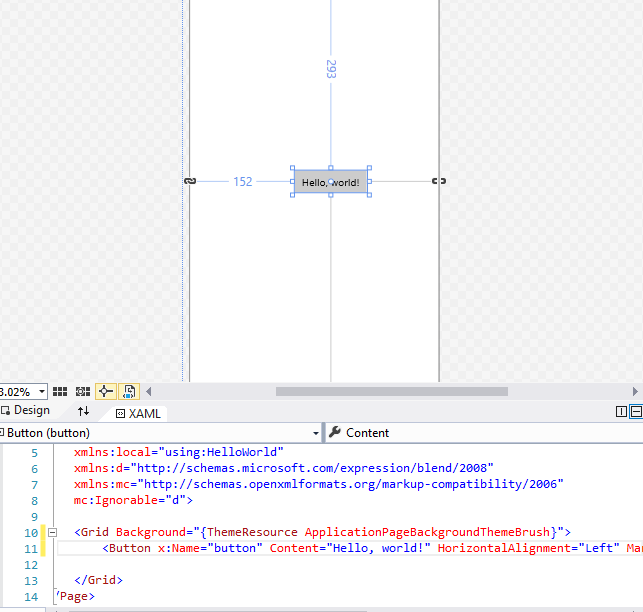
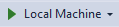

# <a name="create-a-hello-world-app-xaml"></a>Создание приложения "Hello, world" (XAML)

В этом учебнике описано, как с помощью XAML и C# создать простое приложение "Hello, world", предназначенное для универсальной платформы Windows (UWP) в Windows10. С помощью единственного проекта в Microsoft Visual Studio вы можете создать приложение, работающее на любом устройстве с Windows10.

В этом разделе вы научитесь выполнять следующие действия.

-   Создавать новый проект **Visual Studio 2017**, предназначенный для **Windows10** и платформы **UWP**.
-   Писать код XAML, чтобы изменить пользовательский интерфейс на начальной странице.
-   Запускать проект на локальном компьютере в Visual Studio.
-   Использовать объект SpeechSynthesizer, чтобы добавить в приложение голосовую функцию, активируемую нажатием кнопки.


## <a name="before-you-start"></a>Перед началом работы...

-   [Что такое универсальное приложение для Windows?](universal-application-platform-guide.md)
-   [Скачать Visual Studio 2017 (и Windows 10)](https://developer.microsoft.com/windows/downloads). Если вам требуется помощь, узнайте, как [выполнить настройку](get-set-up.md).
-   Мы также предполагаем, что в Visual Studio используется компоновка окна по умолчанию. Если макет по умолчанию изменен, его можно сбросить в меню **Окно** с помощью команды **Сбросить макет окна**.

> [!NOTE]
> В этом учебнике используется Visual Studio Community 2017. Если вы используете другую версию Visual Studio, она может выглядеть иначе.

## <a name="video-summary"></a>Видео с кратким описанием

<iframe src="https://channel9.msdn.com/Blogs/One-Dev-Minute/Writing-Your-First-Windows-10-App/player" width="640" height="360" allowFullScreen frameBorder="0"></iframe>


## <a name="step-1-create-a-new-project-in-visual-studio"></a>Шаг 1. Создание нового проекта в Visual Studio.

1.  Запустите Visual Studio2017.

2.  В меню " **файл** ", выберите **Создать > проект** чтобы открыть диалоговое окно *Новый проект* .

3.  В списке шаблонов слева выберите **Установленные > Visual C# > Windows Universal** список шаблонов проектов UWP.

    (Если универсальные шаблоны не отображаются, возможно, у вас нет компонентов для создания приложений UWP. Вы можете повторить процесс установки и добавить поддержку UWP. Для этого нажмите **Открыть установщик Visual Studio** в диалоговом окне *Новый проект*. См. [Подготовка](get-set-up.md)).

    

4.  Выберите шаблон **Пустое приложение (универсальные приложения для Windows)** и укажите "HelloWorld" в качестве **Имени**. Нажмите кнопку **ОК**.

    

> [!NOTE]
> Если вы пользуетесь Visual Studio впервые, может открыться диалоговое окно с запросом включить **Режим разработчика**. Режим разработчика— это специальный параметр, включающий определенные функции, например разрешение на непосредственный запуск приложений, а не только через Магазин. Подробнее см. в разделе [Подготовка устройства к разработке](enable-your-device-for-development.md). Чтобы продолжить работу с этим руководством, выберите **Режим разработчика**, нажмите **Да** и закройте диалоговое окно.

 

5.  Отобразится диалоговое окно с полями целевой/минимальной версии Windows. Параметры по умолчанию для этого учебника заданы правильно, поэтому нажмите кнопку **ОК**, чтобы создать проект.

    

6.  После того как откроется новый проект, его файлы будут представлены на панели **Обозреватель решений** справа. Чтобы просмотреть файлы, вместо вкладки **Свойства** можно выбрать вкладку **Обозреватель решений**.

    

Несмотря на то, что шаблон **Пустое приложение (универсальные приложения для Windows)** предоставляет минимальные возможности, он содержит несколько файлов. Эти файлы необходимы для всех приложений UWP на C#. Они имеются во всех проектах, создаваемых в Visual Studio.


### <a name="whats-in-the-files"></a>Что содержат файлы?

Для просмотра и изменения файла проекта дважды щелкните файл в **Обозревателе решений**. Разверните XAML-файл так же, как и папку, чтобы увидеть соответствующий файл кода. XAML-файлы открываются в разделенном представлении, в котором отображается как поверхность конструктора, так и редактор XAML.
> [!NOTE]
> Что такое XAML? Расширяемый язык разметки для приложений (Extensible Application Markup Language, XAML)— это язык, который используется для определения пользовательского интерфейса приложения. Код на нем можно писать вручную или создавать с помощью средств разработки Visual Studio. В XAML-файле есть файл кода программной части .xaml.cs, содержащий логику приложения. Совместно XAML и код программной части образуют полный класс. Дополнительные сведения см. в разделе [Обзор языка XAML](https://msdn.microsoft.com/library/windows/apps/Mt185595).

*Файлы App.xaml и App.xaml.cs*

-   App.xaml— это файл, в котором объявляются ресурсы, используемые по всему приложению.
-   App.xaml.cs— это файл кода программной части для App.xaml. Как и все страницы с кодом программной части, эта страница содержит конструктор, который вызывает метод `InitializeComponent`. Вам нет необходимости писать метод `InitializeComponent`. Он создается в Visual Studio, и его главной целью является инициализация элементов, объявленных в XAML-файле.
-   App.xaml.cs— это точка входа для вашего приложения.
-   App.xaml.cs также содержит методы для обработки активации и приостановки приложения.

*MainPage.xaml*

-   В файле MainPage.xaml определяется пользовательский интерфейс приложения. Добавлять элементы можно непосредственно с помощью разметки XAML или с помощью инструментов конструктора, предоставляемых Visual Studio.
-   MainPage.xaml.cs— это страница с кодом программной части для MainPage.xaml. Здесь вы добавляете логику приложения и обработчики событий.
-   Вместе эти два файла формируют новый класс, называемый `MainPage`, наследующий от [**Page**](https://msdn.microsoft.com/library/windows/apps/BR227503) в пространстве имен `HelloWorld`.

*Package.appxmanifest*
-   Файл манифеста, в котором описывается ваше приложение: его имя, описание, плитка, начальная страница и т. д.
-   Хранит список файлов, содержащихся в приложении.

*Набор изображений логотипов*
-   Файл Assets/Square150x150Logo.scale-200.png отвечает за отображение вашего приложения в меню "Пуск".
-   Файл Assets/StoreLogo.png представляет ваше приложение в Microsoft Store.
-   Файл Assets/SplashScreen.scale-200.png— это экран-заставка, отображающаяся при запуске вашего приложения.

## <a name="step-2-adding-a-button"></a>Шаг 2. Добавление кнопки

### <a name="using-the-designer-view"></a>Использование представления конструктора

Добавим кнопку на нашу страницу. В этом учебнике вы будете работать лишь с несколькими из перечисленных ранее файлов: App.xaml, MainPage.xaml и MainPage.xaml.cs.

1.  Дважды щелкните файл **MainPage.xaml**, чтобы открыть его в представлении конструктора.

    В верхней части экрана будет отображаться графическое представление, а под ним представление кода XAML. Изменения можно внести в любое представление, но сейчас мы будем использовать графическое представление.

    

2.  Выберите вертикальную вкладку **Панель элементов** слева, чтобы открыть список элементов управления пользовательского интерфейса (чтобы эта вкладка отображалась постоянно, можно щелкнуть значок закрепления в строке заголовка вкладки).

    

3.  Разверните группу **Типовые элементы управления XAML** и перетащите **Кнопку** в центр холста проектирования.

    

    Если вы посмотрите на окно кода XAML, то увидите, что "Кнопка (Button)" была добавлена и туда.

 ```XAML
<Button x:name="button" Content="Button" HorizontalAlignment="Left" Margin = "152,293,0,0" VerticalAlignment="Top"/>
 ```

4.  Измените текст кнопки.

    Установите курсор в представлении кода XAML и задайте свойству "Содержимое (Content)" значение "Hello, world!" вместо значения "Кнопка (Button)".

```XAML
<Button x:name="button" Content="Hello, world!" HorizontalAlignment="Left" Margin = "152,293,0,0" VerticalAlignment="Top"/>
```

Обратите внимание, что текст кнопки на холсте проектирования обновится.



## <a name="step-3-start-the-app"></a>Шаг 3. Запуск приложения


К этому моменту вы создали очень простое приложение. Этот этап подходит для сборки, развертывания и запуска приложения, а также его просмотра. Вы можете выполнить отладку приложения на локальном компьютере, симуляторе или эмуляторе, а также на удаленном устройстве. Меню целевого устройства в Visual Studio.


### <a name="start-the-app-on-a-desktop-device"></a>Запуск приложения на настольном ПК

По умолчанию приложение запускается на локальном компьютере. Меню целевого устройства предоставляет ряд возможностей для отладки приложения на устройствах с настольного ПК.

-   **Симулятор**
-   **Локальный компьютер**
-   **Удаленный компьютер**

**Запуск отладки на локальном компьютере**

1.  Убедитесь, что в меню целевого устройства () на панели инструментов **Стандартная** выбран параметр **Локальный компьютер**. (Этот параметр выбран по умолчанию.)
2.  Нажмите кнопку **Начать отладку** () на панели инструментов.

   либо

   В меню **Отладка** выберите команду **Начать отладку**.

   либо

   Нажмите клавишу F5.

Приложение откроется в новом окне и сначала отобразится экран-заставка по умолчанию. Экран-заставка определяется изображением (SplashScreen.png) и цветом фона (указанным в манифесте приложения).

После исчезновения экрана-заставки появится ваше приложение. Оно выглядит следующим образом.


Нажмите клавишу Windows, чтобы открыть меню **Пуск**, и выберите пункт «Все программы». Обратите внимание, что при локальном развертывании приложения его плитка добавляется в меню **Пуск**. Чтобы снова запустить приложение (не в режиме отладки) нажмите или щелкните соответствующую плитку в меню **Пуск**.

Ваше приложение пока что умеет немного, но все равно поздравляем— вы создали свое первое приложение UWP!

**Остановка отладки**

   Нажмите кнопку **Остановить отладку** () на панели инструментов.

   либо

   В меню **Отладка** выберите команду **Остановить отладку**.

   либо

   Закройте окно приложения.

## <a name="step-4-event-handlers"></a>Шаг 4. Обработчики событий

Термин "обработчик событий" звучит непонятно, однако это просто еще одно имя кода, который вызывается при возникновении события (например, когда пользователь нажимает кнопку).

1.  Остановите приложение, если вы еще не сделали этого.

2.  Дважды щелкните элемент управления "Кнопка (Button)" на холсте проектирования, чтобы среда Visual Studio создала обработчик событий для вашей кнопки.

  Также вы можете создать код вручную. Либо можно щелкнуть кнопку, чтобы выбрать ее, и посмотреть сведения в окне **Свойства** в нижнем правом углу. Перейдя на панель **События** (с изображением молнии), вы сможете задать имя для обработчика событий.

3.  Измените код обработчика событий в файле *MainPage.xaml.cs* на странице с кодом программной части. Это самый интересный этап. Код обработчика событий по умолчанию выглядит следующим образом.

```C#
private void Button_Click(object sender, RoutedEventArgs e)
{

}
```

  Давайте изменим его, чтобы он выглядел следующим образом.

```C#
private async void Button_Click(object sender, RoutedEventArgs e)
        {
            MediaElement mediaElement = new MediaElement();
            var synth = new Windows.Media.SpeechSynthesis.SpeechSynthesizer();
            Windows.Media.SpeechSynthesis.SpeechSynthesisStream stream = await synth.SynthesizeTextToStreamAsync("Hello, World!");
            mediaElement.SetSource(stream, stream.ContentType);
            mediaElement.Play();
        }
```

Обязательно добавьте ключевое слово **async**. Если этого не сделать, приложение выдаст ошибку при попытке его запуска.

### <a name="what-did-we-just-do"></a>Что нам удалось сделать?

В этом коде используются некоторые API-интерфейсы Windows для создания объекта синтеза речи, которому передается определенный текст для его озвучивания. Дополнительные сведения по использованию объекта SpeechSynthesis см. в документации по[Пространству имен SpeechSynthesis](https://msdn.microsoft.com/library/windows/apps/windows.media.speechsynthesis.aspx).

Если вы запустите приложение и нажмете кнопку, ваш компьютер (или телефон) воспроизведет фразу "Hello, World!".


## <a name="summary"></a>Резюме

Поздравляем! Вы создали свое первое приложение для Windows10 и платформы UWP!

Чтобы узнать, как использовать XAML для размещения элементов управления, которые будут использоваться в вашем приложении, изучите [учебник по сетке](../design/layout/grid-tutorial.md) или сразу перейдите к [следующему шагу](learn-more.md).

## <a name="see-also"></a>См. также

* [Ваше первое приложение](your-first-app.md)
* [Публикация вашего приложения UWP](https://developer.microsoft.com/store/publish-apps).
* [Практические руководства по разработке приложений UWP](https://developer.microsoft.com/windows/apps/develop)
* [Примеры кода для разработчиков UWP](https://developer.microsoft.com/windows/samples)
* [Что такое универсальное приложение для Windows?](universal-application-platform-guide.md)
* [Регистрация учетной записи Windows](sign-up.md)
