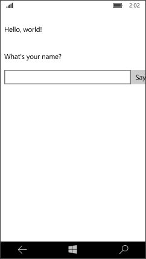
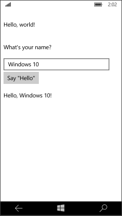

# Создание приложения «Hello, world» (XAML)

В этом учебнике описано, как использовать XAML с C# для создания простого приложения «Hello, world», предназначенного для универсальной платформы Windows (UWP) в ОС Windows10. С помощью единственного проекта в Microsoft Visual Studio вы можете создать приложение, работающее на любом устройстве с Windows 10. Основное внимание мы уделим созданию приложений, которые работают одинаково хорошо как на настольных компьютерах, так и на мобильных устройствах.


              **Важно.**   Это руководство предназначено для использования с Microsoft Visual Studio2015 и Windows10. Он не будет работать правильно с предыдущими версиями.

В этом разделе вы научитесь выполнять следующие действия.

-   Создавать новый проект Visual Studio, предназначенный для Windows10 и платформы UWP.
-   Добавлять содержимое XAML на начальную страницу.
-   Обрабатывать ввод с помощью касаний, пера и мыши.
-   Запускать проект на локальном ПК и на эмуляторе телефона в Visual Studio.
-   Адаптировать пользовательский интерфейс к различным размерам экрана.

## Перед началом работы...


-   Здесь описываются шаги, используемые для создания простого универсального приложения. Поэтому мы настоятельно рекомендуем вам прочесть и понять общую информацию в разделах [Новости разработки в Windows 10](https://dev.windows.com/whats-new-windows-10-dev-preview) и [Что такое универсальное приложение для Windows](whats-a-uwp.md), прежде чем запускать этот учебник.
-   Для работы с этим учебником вам потребуются Windows10 и Visual Studio2015. Подробнее см. в разделе [Подготовка](get-set-up.md).
-   Предполагается, что вы имеете основные сведения о XAML и знаете основные концепции из [обзора XAML](https://msdn.microsoft.com/library/windows/apps/Mt185595).
-   Мы также предполагаем, что в Visual Studio используется компоновка окна по умолчанию. Если макет по умолчанию изменен, его можно сбросить в меню **Window** (Окно), выбрав команду **Reset Window Layout** (Сбросить макет окна).

##  Шаг 1. Создание нового проекта в Visual Studio.


1.  Запустите Visual Studio2015.

   Откроется начальный экран Visual Studio2015. (Далее Visual Studio 2015 будет упоминаться просто как Visual Studio.)

2.  В меню **Файл** выберите элемент **Создать** > **Проект**.

   Откроется диалоговое окно **Создание проекта**. Левая панель диалогового окна позволяет выбрать тип отображаемого шаблона.

3.  На левой панели разверните узел **Установленные > Шаблоны > Visual C# > Windows** и выберите группу шаблонов **Universal**. На центральной панели диалогового окна отображается список шаблонов проектов для приложений универсальной платформы Windows (UWP).

   
   
   (Если эти параметры не отображаются, убедитесь, что вы установили средства разработки универсальных приложений для Windows. Подробнее см. в разделе [Подготовка](get-set-up.md)).

4.  На центральной панели выберите шаблон **Пустое приложение (универсальное приложение для Windows)**.

   Шаблон **Пустое приложение** дает возможность создать обладающее минимальным функционалом приложение UWP, которое компилируется и запускается, но не содержит данных или элементов управления пользовательского интерфейса. Вы добавите элементы управления в приложение в процессе работы с этим руководством.

5.  Введите «HelloWorld» в текстовое поле **Имя**.
6.  Нажмите **ОК**, чтобы создать проект.

   Visual Studio создаст проект и отобразит его в **обозревателе решений**.

   

Хотя шаблон **Пустое приложение** предоставляет минимальные возможности, он содержит несколько файлов.

-   файл манифеста (Package.appxmanifest), в котором описывается ваше приложение (имя, описание, плитка, начальная страница, экран-заставка ит.п.) и перечисляются файлы, содержащиеся в приложении;
-   набор изображений логотипов (Assets/Square150x150Logo.scale-200.png, Assets/Square44x44Logo.scale-200.png и Assets/Wide310x150Logo.scale-200.png) для отображения на начальном экране;
-   изображение (Assets/StoreLogo.png) для представления вашего приложения в Магазине Windows;
-   экран-заставка (Assets/SplashScreen.scale-200.png), который будет отображаться при запуске вашего приложения;
-   файлы XAML и кода для приложения (App.xaml и App.xaml.cs);
-   начальная страница (MainPage.xaml) и соответствующий файл кода (MainPage.xaml.cs), который выполняется при запуске приложения.

Эти файлы необходимы для всех приложений UWP на C#. Они имеются во всех проектах, создаваемых в Visual Studio.

## Шаг 2. Изменение начальной страницы


### Что включено в файлы?

Для просмотра и изменения файла проекта дважды щелкните файл в **Обозревателе решений**. По умолчанию XAML-файл можно развернуть так же, как и папку, чтобы увидеть соответствующий файл кода. XAML-файлы открываются в разделенном представлении, в котором отображается как поверхность конструктора, так и редактор XAML.

В этом учебнике вы будете работать лишь с несколькими из перечисленных ранее файлов: App.xaml, MainPage.xaml и MainPage.xaml.cs.

### Файлы App.xaml и App.xaml.cs

App.xaml— это файл, в котором объявляются ресурсы, используемые по всему приложению. App.xaml.cs— это файл кода программной части для App.xaml. Код программной части— это код, который присоединяется к разделяемому классу страницы XAML. Совместно XAML и код программной части образуют полный класс. App.xaml.cs— это точка входа для вашего приложения. Как и все страницы с кодом программной части, эта страница содержит конструктор, который вызывает метод `InitializeComponent`. Вам нет необходимости писать метод `InitializeComponent`. Он создается в Visual Studio, и его главной целью является инициализация элементов, объявленных в XAML-файле. App.xaml.cs также содержит методы для обработки активации и приостановки приложения.

### MainPage.xaml

В файле MainPage.xaml определяется пользовательский интерфейс приложения. Добавлять элементы можно непосредственно с помощью разметки XAML или с помощью инструментов конструктора, предоставляемых Visual Studio. MainPage.xaml.cs — это страница с кодом программной части для MainPage.xaml. Здесь вы добавляете логику приложения и обработчики событий.

Вместе эти два файла формируют новый класс, называемый `MainPage`, наследующий от [**Page**](https://msdn.microsoft.com/library/windows/apps/BR227503) в пространстве имен `HelloWorld`.

MainPage.xaml

```xml
    <Page
    x:Class="HelloWorld.MainPage"
    xmlns="http://schemas.microsoft.com/winfx/2006/xaml/presentation"
    xmlns:x="http://schemas.microsoft.com/winfx/2006/xaml"
    xmlns:local="using:HelloWorld"
    xmlns:d="http://schemas.microsoft.com/expression/blend/2008"
    xmlns:mc="http://schemas.openxmlformats.org/markup-compatibility/2006"
    mc:Ignorable="d">

    <Grid Background="{ThemeResource ApplicationPageBackgroundThemeBrush}">

    </Grid>
</Page>
```

MainPage.xaml.cs

```csharp
using Windows.UI.Xaml;
using Windows.UI.Xaml.Controls;

namespace HelloWorld
{
    /// <summary>
    /// An empty page that can be used on its own or navigated to within a Frame.
    /// </summary>
    public sealed partial class MainPage : Page
    {
        public MainPage()
        {
            this.InitializeComponent();
        }
    }
}
```

### Изменение начальной страницы

Теперь добавим новое содержимое в приложение.

**Изменение начальной страницы**

1.  Дважды щелкните файл MainPage.xaml в **обозревателе решений**, чтобы открыть его.
2.  В редакторе XAML добавьте элементы управления пользовательского интерфейса.

   В корне [**Grid**](https://msdn.microsoft.com/library/windows/apps/BR242704) добавьте этот код XAML. В нем содержится элемент [**StackPanel**](https://msdn.microsoft.com/library/windows/apps/BR209635) с названием [**TextBlock**](https://msdn.microsoft.com/library/windows/apps/BR209652); элемент **TextBlock**, который запрашивает имя пользователя; элемент [**TextBox**](https://msdn.microsoft.com/library/windows/apps/BR209683), который принимает имя пользователя; элемент [**Button**](https://msdn.microsoft.com/library/windows/apps/BR209265) и еще один элемент **TextBlock**, отображающий приветствие. Некоторые из этих элементов управления имеют имена, благодаря чему на них можно ссылаться в коде.

```xml    
    <StackPanel x:Name="contentPanel" Margin="8,32,0,0">
        <TextBlock Text="Hello, world!" Margin="0,0,0,40"/>
        <TextBlock Text="What' s your name?"/>
        <StackPanel x:Name="inputPanel" Orientation="Horizontal" Margin="0,20,0,20">
            <TextBox x:Name="nameInput" Width="280" HorizontalAlignment="Left"/>
            <Button x:Name="inputButton" Content="Say &quot;Hello&quot;"/>
        </StackPanel>
        <TextBlock x:Name="greetingOutput"/>
    </StackPanel>
```    

    The controls that you added in the XAML editor show up in the design view.

## Шаг 3. Запуск приложения


К этому моменту вы создали очень простое приложение. Этот этап подходит для сборки, развертывания и запуска приложения, а также его просмотра. Вы можете выполнить отладку приложения на локальном компьютере, симуляторе или эмуляторе, а также на удаленном устройстве. Меню целевого устройства в Visual Studio.


### Запуск приложения на настольном ПК

По умолчанию приложение запускается на локальном компьютере. Меню целевого устройства предоставляет ряд возможностей для отладки приложения на устройствах с настольного ПК.

-   **Симулятор**
-   **Локальный компьютер**
-   **Удаленный компьютер**

**Запуск отладки на локальном компьютере**

1.  Убедитесь, что в меню целевого устройства () на панели инструментов **Стандартная** выбран параметр **Локальный компьютер**. (Этот параметр выбран по умолчанию.)
2.  Нажмите кнопку **Начать отладку** () на панели инструментов.

   либо

   В меню **Отладка** выберите команду **Начать отладку**.

   либо

   Нажмите клавишу F5.

Приложение откроется в новом окне и сначала отобразится экран-заставка по умолчанию. Экран-заставка определяется изображением (SplashScreen.png) и цветом фона (указанным в манифесте приложения).

После исчезновения экрана-заставки появится ваше приложение. Оно выглядит следующим образом.


Нажмите клавишу Windows, чтобы открыть меню **Пуск**, и выберите пункт «Все программы». Обратите внимание, что при локальном развертывании приложения его плитка добавляется в меню **Пуск**. Чтобы снова запустить приложение (не в режиме отладки) нажмите или щелкните соответствующую плитку в меню **Пуск**.

Ваше приложение пока что умеет не много, но все равно поздравляем — вы создали свое первое приложение UWP!

**Остановка отладки**

-   Нажмите кнопку **Остановить отладку** () на панели инструментов.

   либо

   В меню **Отладка** выберите команду **Остановить отладку**.

   либо

   Закройте окно приложения.

### Запуск приложения в эмуляторе мобильного устройства

Ваше приложение работает на любом устройстве с Windows 10, поэтому давайте посмотрим, как оно выглядит в Windows Phone.

Помимо возможности отладки на настольном ПК Visual Studio предоставляет возможность развертывания и отладки приложения на физическом мобильном устройстве, подключенном к компьютеру, или на эмуляторе мобильного устройства. Вы можете выбрать эмулятор для устройств с теми или иными параметрами памяти и экрана.

-   **устройство;**
-   **Эмулятор <SDK version> WVGA, 4дюйма, 512МБ**
-   **Эмулятор <SDK version> WVGA, 4дюйма, 1ГБ**
-   и т. д. (различные эмуляторы с другими конфигурациями).

(Если эти эмуляторы не отображаются, убедитесь, что вы установили средства разработки универсальных приложений для Windows. Подробнее см. в разделе [Подготовка](get-set-up.md)).

Рекомендуется протестировать приложение на устройстве с маленьким экраном и ограниченным объемом памяти, поэтому используйте параметр **Эмулятор 10.0.10240.0 WVGA 4 дюйма, 512 МБ**.
**Запуск отладки в эмуляторе мобильного устройства**

1.  В меню целевого устройства () на панели инструментов **Стандартная** выберите **Эмулятор 10.0.10240.0 WVGA 4 дюйма 512 МБ**.
2.  Нажмите кнопку **Начать отладку** () на панели инструментов.

   либо

   В меню **Отладка** выберите команду **Начать отладку**.

   либо

   Нажмите клавишу F5.

Visual Studio запускает выбранный эмулятор и затем разворачивает и запускает приложение. В эмуляторе мобильного устройства приложение выглядит следующим образом.



Прежде всего вы заметите то, что кнопка сместилось за пределы небольшого экрана мобильного устройства. Далее вы узнаете, как адаптировать пользовательский интерфейс к различным размерам экрана, чтобы ваше приложение всегда выглядело хорошо.

Кроме того, можно заметить, что доступен ввод текста в [**TextBox**](https://msdn.microsoft.com/library/windows/apps/BR209683), но если в данный момент нажать [**Button**](https://msdn.microsoft.com/library/windows/apps/BR209265), ничего не случится. Далее мы создадим для кнопки обработчик события [**Click**](https://msdn.microsoft.com/library/windows/apps/BR227737), который отображает персонализированное приветствие. Мы добавим код обработчика события в файл MainPage.xaml.cs.

## Шаг 4. Создание обработчика события


Элементы XAML могут отправлять сообщения, когда возникают определенные события. Подобные сообщения о событиях дают вам возможность выполнять какие-либо действия в ответ на событие. Поместите код, выполняемый в ответ на событие, в метод обработчика события. Одним из наиболее часто используемых событий во многих приложениях является щелчок объекта [**Button**](https://msdn.microsoft.com/library/windows/apps/BR209265).

Определим обработчик события [**Click**](https://msdn.microsoft.com/library/windows/apps/BR227737) для кнопки. Обработчик события принимает имя пользователя из элемента управления `nameInput` [**TextBox**](https://msdn.microsoft.com/library/windows/apps/BR209683) и использует его для вывода приветствия в `greetingOutput` [**TextBlock**](https://msdn.microsoft.com/library/windows/apps/BR209652).

### Использование событий, которые поддерживают сенсорный ввод, ввод с помощью мыши и ввод с помощью пера

Какие события следует обрабатывать? Приложения Магазина Windows могут выполняться на различных устройствах, поэтому разрабатывать их следует с учетом возможности сенсорного ввода. Ваше приложение должно также уметь обрабатывать ввод с помощью мыши или пера. К счастью, такие события, как [**Click**](https://msdn.microsoft.com/library/windows/apps/BR227737) и [**DoubleTapped**](https://msdn.microsoft.com/library/windows/apps/BR208922), не зависят от устройств. Если вы знакомы с программированием в Microsoft .NET, вы могли видеть отдельные события для ввода с помощью мыши, касания или пера, такие как **MouseMove**, **TouchMove** и **StylusMove**. В приложениях Магазина Windows эти отдельные события заменяются единым событием [**PointerMoved**](https://msdn.microsoft.com/library/windows/apps/BR208970), которое одинаково работает при вводе с помощью мыши, касания или пера.

**Добавление обработчика событий**

1.  В коде XAML или в представлении конструирования выберите элемент Say Hello [**Button**](https://msdn.microsoft.com/library/windows/apps/BR209265), который вы добавили в файл MainPage.xaml.
2.  В **окне свойств** нажмите кнопку «События» ().
3.  Найдите событие [**Click**](https://msdn.microsoft.com/library/windows/apps/BR227737) в верхней части списка событий. В текстовом поле для события введите имя функции, которая обрабатывает событие **Click**. Для этого примера введите Button\_Click.

   

4.  Нажмите клавишу ВВОД. Метод обработчика событий создается и открывается в редакторе кода, где затем можно добавить код, выполняемый при возникновении события.

    В редакторе XAML код XAML для [**Button**](https://msdn.microsoft.com/library/windows/apps/BR209265) обновляется, чтобы объявить обработчик событий [**Click**](https://msdn.microsoft.com/library/windows/apps/BR227737) следующим образом:

```xml   
   <Button x:Name="inputButton" Content="Say &quot;Hello&quot;" Click="Button_Click"/>
```    

5.  Добавьте код в обработчик события, созданный на странице с выделенным кодом. В обработчике события получите имя пользователя из элемента управления `nameInput` [**TextBox**](https://msdn.microsoft.com/library/windows/apps/BR209683) и используйте его, чтобы создать приветствие. Используйте `greetingOutput` [**TextBlock**](https://msdn.microsoft.com/library/windows/apps/BR209652), чтобы отобразить результат.
    
```csharp    
    private void Button_Click(object sender, RoutedEventArgs e)
    {
        greetingOutput.Text = "Hello, " + nameInput.Text + "!";
    }
```    

6.  Выполните отладку приложения на локальном компьютере. Когда вы вводите имя в текстовое поле и нажимаете кнопку, приложение отображает персональное приветствие.

## Шаг 5. Адаптация пользовательского интерфейса к различным размерам окон


Теперь мы адаптируем пользовательский интерфейс к различным размерам экрана, чтобы приложение выглядело хорошо на мобильных устройствах. Для этого добавьте [**VisualStateManager**](https://msdn.microsoft.com/library/windows/apps/BR209021) и установите свойства, применяемые для различных визуальных состояний.

**Настройка макета пользовательского интерфейса**

1.  В редакторе XAML добавьте этот блок XAML после открывающего тега корневого элемента [**Grid**](https://msdn.microsoft.com/library/windows/apps/BR242704).

```xml    
    <VisualStateManager.VisualStateGroups>
        <VisualStateGroup>
            <VisualState x:Name="wideState">
                <VisualState.StateTriggers>
                    <AdaptiveTrigger MinWindowWidth="641" />
                </VisualState.StateTriggers>
            </VisualState>
            <VisualState x:Name="narrowState">
                <VisualState.StateTriggers>
                    <AdaptiveTrigger MinWindowWidth="0" />
                </VisualState.StateTriggers>
                <VisualState.Setters>
                    <Setter Target="inputPanel.Orientation" Value="Vertical"/>
                    <Setter Target="inputButton.Margin" Value="0,4,0,0"/>
                </VisualState.Setters>
            </VisualState>
        </VisualStateGroup>
    </VisualStateManager.VisualStateGroups>
```    

2.  Выполните отладку приложения на локальном компьютере. Обратите внимание, что пользовательский интерфейс выглядит так же, как и раньше, пока ширина окна не станет меньше 641 пикселя.
3.  Выполните отладку приложения на эмуляторе мобильного устройства. Обратите внимание, что пользовательский интерфейс использует свойства, указанные вами в `narrowState`, и правильно отображается на маленьком экране.



Если вы использовали [**VisualStateManager**](https://msdn.microsoft.com/library/windows/apps/BR209021) в предыдущих версиях XAML, можно заметить, что в XAML здесь используется упрощенный синтаксис.

У [**VisualState**](https://msdn.microsoft.com/library/windows/apps/BR209007) с именем `wideState` имеется [**AdaptiveTrigger**](https://msdn.microsoft.com/library/windows/apps/Dn890382), для свойства [**MinWindowWidth**](https://msdn.microsoft.com/library/windows/apps/windows.ui.xaml.adaptivetrigger.minwindowwidth) которого задано значение 641. Это означает, что состояние будет применяться только тогда, когда ширина окна составляет не менее 641 пикселя. Вы не указываете никакие объекты [**Setter**](https://msdn.microsoft.com/library/windows/apps/BR208817) для этого состояния, поэтому оно использует свойства макета, заданные в XAML для содержимого страницы.

У второго [**VisualState**](https://msdn.microsoft.com/library/windows/apps/BR209007), `narrowState`, имеется [**AdaptiveTrigger**](https://msdn.microsoft.com/library/windows/apps/Dn890382), для свойства [**MinWindowWidth**](https://msdn.microsoft.com/library/windows/apps/windows.ui.xaml.adaptivetrigger.minwindowwidth) которого задано значение 0. Это состояние применяется, когда ширина окна больше 0, но меньше 641 пикселя. (Для 641пикселя применяется `wideState`.) В этом состоянии необходимо указать некоторые объекты [**Setter**](https://msdn.microsoft.com/library/windows/apps/BR208817), чтобы изменить свойства макета элементов управления в пользовательском интерфейсе:

-   Вы изменяете [**Orientation**](https://msdn.microsoft.com/library/windows/apps/windows.ui.xaml.controls.stackpanel.orientation) для элемента `inputPanel` с **Horizontal** на **Vertical**.
-   Вы добавляете верхнее поле высотой 4 пикселя к элементу `inputButton`.

## Резюме


Поздравляем! Вы создали свое первое приложение для Windows 10 и платформы UWP.


<!--HONumber=Jul16_HO2-->


