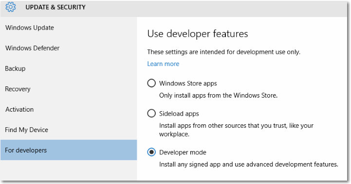

# Подготовка устройства к разработке

Перед тем как создавать приложения, необходимо включить режим разработчика как на компьютере для разработки, так и на всех устройствах, на которых будет тестироваться код. 

## Использование возможностей для разработчиков

### Разработка приложений с помощью Microsoft Visual Studio

Чтобы можно было открыть проект приложения UWP в Visual Studio, необходимо включить режим разработчика на компьютере. Если при открытии проекта UWP режим разработчика не включен, автоматически откроется страница параметров **Для разработчиков**. Следуйте инструкциям в следующем разделе, чтобы включить режим разработчика.

При открытии проекта приложения UWP в Visual Studio на компьютере с Windows 10 версии 1511 или более ранней в Visual Studio открывается следующее диалоговое окно. 

При отображении этого диалогового окна нажмите ссылку **раздел параметров для разработчиков**, чтобы открыть страницу параметров **Для разработчиков** и включить режим разработчика.

> Режим разработчика можно в любой момент включить или отключить, перейдя на страницу **Для разработчиков**: просто введите строку «параметры разработчика» в поле поиска Кортана на панели задач.

### Включение режима разработчика на устройстве с Windows 10

Вы можете включить на устройстве как функции разработчика, так и просто функцию загрузки неопубликованных приложений.

-   *Загрузка неопубликованных приложений* — это установка и запуск или тестирование приложения, которое еще не сертифицировано Магазином Windows. Например, это может быть приложение, используемое только внутри компании.
-   *Режим разработчика* позволяет загружать неопубликованные приложения, а также запускать приложения из Visual Studio в режиме отладки. 

    При включении режима разработчика устанавливается пакет компонентов, в том числе:
    - Устанавливается портал устройств с Windows. Установка портала устройств и настройка для него правил брандмауэра производятся только в том случае, если включен параметр **Включение портала устройств**.
    - Устанавливаются, включаются и настраиваются правила брандмауэра для служб SSH, которые разрешают удаленную установку приложений.
    - (Только для ПК) Разрешается включение подсистемы Windows для Linux. Дополнительные сведения см. в разделе [О Bash для Ubuntu в Windows](https://msdn.microsoft.com/commandline/wsl/about).

Дополнительные сведения о параметрах см. в разделе [Какие параметры выбрать: загрузку неопубликованных приложений или режим разработчика?](https://msdn.microsoft.com/en-us/windows/uwp/get-started/enable-your-device-for-development#which-settings-should-i-choose-sideload-apps-or-developer-mode)

**Использование функций разработчика**

1.  На устройстве, для которого вы хотите включить режим разработчика, перейдите в меню **Параметры**. Выберите **Обновление и безопасность**, затем **Для разработчиков**.
2.  Выберите необходимый уровень доступа; для разработки приложений UWP следует выбрать **Режим разработчика**. 
3.  Прочитайте заявление об отказе от ответственности для выбранного параметра, затем щелкните **Да**, чтобы принять изменения.

> [!NOTE]
> Если устройство принадлежит организации, некоторые параметры могут быть недоступны в вашей организации, как показано ниже.

Ниже показана страница параметров для семейства настольных устройств.

Ниже показана страница параметров для семейства мобильных устройств.

## Функциональные возможности режима разработчика

Для каждого семейства устройств могут быть доступны дополнительные функциональные возможности разработчика. Эти функциональные возможности доступны только в том случае, если режим разработчика включен на устройстве, и могут зависеть от версии ОС.

На этом изображении показаны функциональные возможности разработчика для семейства мобильных устройств в Windows 10 версии 1511.

 

### Портал устройств

Для получения дополнительных сведений об обнаружении устройств и портале устройств см. раздел [Обзор портала устройств с Windows](../debug-test-perf/device-portal.md).

Конкретные инструкции по настройке устройства см. в следующих разделах:
- [Портал устройств для ПК](https://msdn.microsoft.com/windows/uwp/debug-test-perf/device-portal-desktop)
- [Портал устройств для HoloLens](https://developer.microsoft.com/windows/holographic/using_the_windows_device_portal)
- [Портал устройств для IoT](https://developer.microsoft.com/windows/iot/docs/DevicePortal)
- [Портал устройств для мобильных устройств](../debug-test-perf/device-portal-mobile.md)
- [Портал устройств для Xbox](../debug-test-perf/device-portal-xbox.md)

Если возникли проблемы при включении режима разработчика и портала устройств, см. форум [Известные проблемы](https://social.msdn.microsoft.com/Forums/en-US/home?forum=Win10SDKToolsIssues&sort=relevancedesc&brandIgnore=True&searchTerm=%22device+portal%22) для поиска решения этих проблем. 

###SSH

Службы SSH включаются при включении режима разработчика на устройстве.  Они используются, если устройство является целью развертывания для приложений UWP.   Службы называются «SSH Server Broker» и «SSH Server Proxy».

> [!NOTE]
> Это реализация OpenSSH (не Microsoft), которую можно найти на [GitHub](https://github.com/PowerShell/Win32-OpenSSH).

Чтобы воспользоваться преимуществами служб SSH, можно включить функцию обнаружения устройств для разрешения связывания с помощью PIN-кода. Если планируется запускать другую службу SSH, можно настроить ее с другим портом или отключить службы SSH режима разработчика. Чтобы отключить службы SSH, просто отключите режим разработчика.  

### Обнаружение устройств

При включении обнаружения устройства вы разрешаете, чтобы устройство было видимым для других устройств в сети через mDNS.  Эта функция также позволяет получать PIN-код SSH для связывания с этим устройством.  

Обнаружение устройства следует включать только в том случае, если устройство будет являться целью развертывания. Например если вы используете портал устройств для развертывания приложения на телефоне для тестирования, необходимо включить функцию обнаружения устройств на телефоне, но не на компьютере разработчика.

### Отчеты об ошибках (только мобильные устройства)

Укажите, сколько аварийных дампов необходимо сохранять на телефоне.

Сбор аварийных дампов на телефоне позволяет получить мгновенный доступ к важной информации о сбоях сразу после их возникновения. Дампы собираются только для приложений, подписанных разработчиком. Дампы можно найти в хранилище телефона в папке Documents\\Debug. Дополнительные сведения о файлах дампов см. в разделе [Использование файлов дампов](https://msdn.microsoft.com/library/d5zhxt22.aspx).

### Оптимизация для проводника Windows, удаленного рабочего стола и PowerShell (только на ПК)

 Для семейства настольных устройств на странице параметров **Для разработчиков** имеются ссылки на параметры, которые можно использовать для оптимизации компьютера под задачи разработки. Для каждого параметра можно установить флажок и нажать кнопку **Применить** или нажать ссылку **Показать параметры**, чтобы открыть страницу параметров для этого варианта. 

## Какие параметры выбрать: загрузку неопубликованных приложений или режим разработчика?

По умолчанию из Магазина Windows можно устанавливать только приложения универсальной платформы Windows. Если вы измените эти параметры, чтобы использовать функции разработчика, это может повлиять на уровень безопасности вашего устройства. Не устанавливайте приложения из непроверенных источников.

### Загрузка неопубликованных приложений

Параметр «Загрузка неопубликованных приложений» обычно используется компаниями или учебными заведениями, которым необходимо устанавливать нестандартные приложения на управляемых устройствах, не используя Магазин Windows. В этом случае организации обычно применяют политику, отключающую параметр *Приложения Магазина Windows*, как показано выше на изображении страницы параметров. Кроме того, организация предоставляет необходимый сертификат и расположение установки для загрузки неопубликованных приложений. Дополнительные сведения см. в статьях TechNet [Загрузка неопубликованных приложений в Windows 10](https://technet.microsoft.com/library/mt269549.aspx) и [Начало работы по развертыванию приложений в Microsoft Intune](https://technet.microsoft.com/library/dn646955.aspx).

Сведения, предназначенные для определенных семейств устройств

-   Для семейства настольных устройств: вы можете установить пакет приложения (APPX-файл) и любой сертификат, необходимый для запуска приложения, выполнив сценарий Windows PowerShell, созданный с использованием пакета (Add-AppDevPackage.ps1). Дополнительные сведения см. в разделе [Формирование пакетов приложений UWP](../packaging/packaging-uwp-apps.md).

-   Для семейства мобильных устройств: если необходимый сертификат уже установлен, вы можете коснуться файла, чтобы установить любой APPX-файл, отправленный вам по электронной почте или на карте SD.

**Загрузка неопубликованных приложений** — более безопасный вариант, чем режим разработчика, так как вы не сможете устанавливать на устройство приложения без доверенного сертификата.

> [!NOTE]
> При загрузке неопубликованных приложений по-прежнему необходимо следить, чтобы они были получены из надежных источников. При установке неопубликованного приложения, еще не сертифицированного Магазином Windows, вы соглашаетесь, что получили все необходимые права для загрузки этого приложения и несете всю ответственность за любые убытки, которые могут возникнуть в результате установки и запуска приложения. См. раздел «Windows &gt; Магазин Windows» данного [заявления о конфиденциальности](http://go.microsoft.com/fwlink/?LinkId=521839).

### Режим разработчика

Режим разработчика заменяет требования Windows 8.1 на наличие лицензии разработчика.  Помимо возможностей, предоставляемых функцией загрузки неопубликованных приложений, режим разработчика позволяет выполнять отладку и использовать дополнительные варианты развертывания. Сюда входит запуск службы SSH, чтобы разрешить развертывание на данное устройство. Чтобы остановить эту службу, необходимо отключить режим разработчика.

Сведения, предназначенные для определенных семейств устройств

-   Для семейства настольных устройств

    Включите режим разработчика, чтобы разрабатывать и выполнять отладку приложений в Visual Studio. Как уже упоминалось, если режим разработчика не включен, Visual Studio предложит вам его включить.

    Позволяет включить подсистему Windows для Linux. Дополнительные сведения см. в разделе [О Bash для Ubuntu в Windows](https://msdn.microsoft.com/commandline/wsl/about).

-   Для семейства мобильных устройств

    Включите режим разработчика, чтобы развертывать приложения из Visual Studio и выполнять их отладку на устройстве.

    Вы можете коснуться файла, чтобы установить любой APPX-файл, отправленный вам по электронной почте или на карте SD. Не устанавливайте приложения из непроверенных источников.

**Подсказка**  
Существует ряд средств, которые вы можете использовать для развертывания приложения с компьютера с Windows 10 на мобильном устройстве с Windows 10. Оба устройства должны быть подключены к одной подсети с помощью проводного или беспроводного подключения или соединены друг с другом через USB. При использовании любого из указанных выше способов будет установлен только пакет приложения (APPX-файл); сертификаты установлены не будут.

-   Используйте средство развертывания приложений для Windows 10 (WinAppDeployCmd). Узнайте больше о [средстве WinAppDeployCmd](http://msdn.microsoft.com/library/windows/apps/mt203806.aspx).
-   В ОС Windows 10 версии 1511 (и более поздней) можно использовать [Портал устройств](#device_portal) для развертывания из браузера. Используйте страницу **[Приложения](../debug-test-perf/device-portal.md#apps)** портала устройств для отправки пакета приложения (APPX-файл) и установки его на устройство.

## Использование групповых политик или разделов реестра для подготовки устройства

Большинство разработчиков будут использовать приложение «Параметры», чтобы включить в устройстве возможность отладки. В некоторых сценариях, таких как автоматизированные тесты, можно использовать другие способы подготовки компьютера с Windows 10 для разработки.

С помощью файла gpedit.msc можно включить режим разработчика на устройстве, используя групповые политики (кроме случая выпуска Windows 10 Домашняя). Если у вас Windows 10 Домашняя, то, чтобы напрямую настроить разделы реестра для включения режима разработчика на устройстве, необходимо использовать программу regedit или команды PowerShell.

**Включение режима разработчика на устройстве с помощью команды gpedit**

1.  Выполните команду **Gpedit.msc**.
2.  Последовательно выберите элементы Политика локального компьютера &gt; Конфигурация компьютера &gt; Административные шаблоны &gt; Компоненты Windows &gt; Развертывание пакета приложений
3.  Чтобы разрешить загрузку неопубликованных приложений, измените политики, чтобы включить параметр:

    -   **Разрешить установку всех доверенных приложений**

    - ЛИБО -

    Чтобы включить режим разработчика, измените политики, чтобы включить следующие параметры:

    -   **Разрешить установку всех доверенных приложений**
    -   **Разрешить разработку приложений Магазина Windows и их установку из интегрированной среды разработки (IDE)**

4.  Перезагрузите компьютер.

**Используйте команду regedit, чтобы включить режим разработчика на устройстве**

1.  Выполните команду **regedit**.
2.  Чтобы разрешить загрузку неопубликованных приложений, присвойте этому параметру типа DWORD значение 1:

    -   **HKLM\\SOFTWARE\\Microsoft\\Windows\\CurrentVersion\\AppModelUnlock\\AllowAllTrustedApps**

    - ЛИБО -

    Чтобы включить режим разработчика, присвойте этому параметру типа DWORD значение 1:

    -   **HKLM\\SOFTWARE\\Microsoft\\Windows\\CurrentVersion\\AppModelUnlock\\AllowDevelopmentWithoutDevLicense**

**Включение режима разработчика на устройстве с помощью PowerShell**

1.  Запустите PowerShell с правами администратора.
2.  Чтобы разрешить загрузку неопубликованных приложений, выполните следующую команду:

    -   **PS C:\\WINDOWS\\system32&gt; reg add "HKEY\_LOCAL\_MACHINE\\SOFTWARE\\Microsoft\\Windows\\CurrentVersion\\AppModelUnlock" /t REG\_DWORD /f /v "AllowAllTrustedApps" /d "1"**

    - ЛИБО -

    Чтобы включить режим разработчика, выполните следующую команду:

    -   **PS C:\\WINDOWS\\system32&gt; reg add "HKEY\_LOCAL\_MACHINE\\SOFTWARE\\Microsoft\\Windows\\CurrentVersion\\AppModelUnlock" /t REG\_DWORD /f /v "AllowDevelopmentWithoutDevLicense" /d "1"**

## Обновление устройства с Windows 8.1 до Windows 10

Если вы хотите создавать приложения или загружать неопубликованные приложения на устройство с Windows 8.1, необходимо установить лицензию разработчика. При обновлении устройства с Windows 8.1 до Windows 10 эта информация сохранится. Чтобы удалить эту информацию с устройства, обновленного до Windows 10, выполните указанную ниже команду. Это действие необязательно, если вы обновляете Windows 8.1 напрямую до Windows 10 версии 1511 или более поздней.

**Отмена регистрации лицензии разработчика**

1.  Запустите PowerShell с правами администратора.
2.  Выполните команду **unregister-windowsdeveloperlicense**.

После этого необходимо включить на устройстве режим разработчика, как описано в данной статье, чтобы можно было продолжить разработку на этом устройстве. Если не сделать этого, может возникнуть ошибка при отладке вашего приложения или при создании пакета для него. Ниже указан пример такой ошибки.

Ошибка DEP0700: не удалось зарегистрировать приложение.

