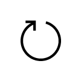
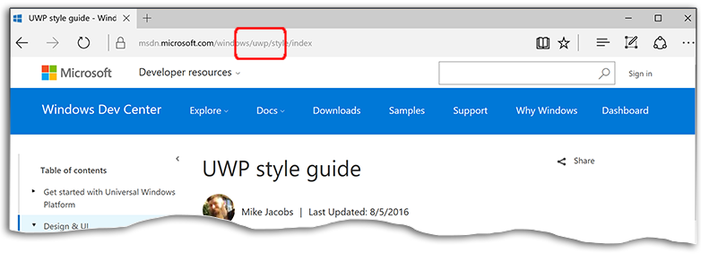

<link rel="stylesheet" href="https://az835927.vo.msecnd.net/sites/uwp/Resources/css/custom.css">

# Дальнейшие действия

Итак, вы хотите создать приложение. С чего начать? Ниже приведены некоторые разделы Центра разработки, помогающие приступить к работе. Если вы не знакомы с платформой UWP, посмотрите видеоматериалы на сайте <a href="https://channel9.msdn.com/">Channel 9</a> и пройдите курсы <a href="https://www.microsoftvirtualacademy.com">Microsoft Virtual Academy</a>. Если вы уже знакомы с XAML и C#, можете приступать к чтению приведенных ниже разделов.

Рекомендуется ознакомиться с разделами, посвященными UWP, чтобы получить представление об этой платформе, а затем изучить создание пользовательского интерфейса с использованием элементов управления XAML и их последующей настройкой. Основное достоинство языка XAML — это использование *привязки данных* для связывания элементов управления с информацией, которую требуется отображать приложению; если вы не знакомы с платформой Windows, будет важно понять эту концепцию.

Если вы хотите изучать новейшие методы программирования для Windows 10, такие как добавление анимации и эффектов в приложения, ознакомьтесь с [Блогом разработчиков Windows](https://blogs.windows.com/buildingapps).

<table class="wdg-noborder">
<tr>
 <td width=60></td>
    <td><h2>UWP и жизненный цикл приложения UWP</h2>
Как запускается приложение, что происходит при запуске другого приложения? Информация приведена ниже.
 <ul>
    <li><a href="https://msdn.microsoft.com/windows/uwp/get-started/universal-application-platform-guide">Руководство по работе с приложениями универсальной платформы Windows (UWP)</a></li>
    <li><a href="https://msdn.microsoft.com/windows/uwp/launch-resume/app-lifecycle">Жизненный цикл приложения UWP</a></li>
    <li><a href="https://developer.microsoft.com/windows/windows-10-for-developers">Потрясающие возможности Windows 10</a></ul></td>  
</tr>
 
 
<tr>
 <td width=60></td>
    <td><h2>Взаимодействие с пользователем и пользовательский интерфейс</h2>
Какие элементы управления есть в вашем распоряжении и как их можно использовать? В этих разделах объясняется совместная работа элементов управления и кода, а также настройка элементов управления в соответствии с внешним видом приложения.
 <ul>
    <li><a href="https://developer.microsoft.com/windows/design">Оформление и пользовательский интерфейс</a></li>
    <li><a href="https://msdn.microsoft.com/windows/uwp/layout/layouts-with-xaml">Определение макетов страниц с помощью XAML</a></li>
    <li><a href="https://msdn.microsoft.com/windows/uwp/controls-and-patterns/controls-by-function">Элементы управления по функциям</a></li>
      <li><a href="https://msdn.microsoft.com/windows/uwp/controls-and-patterns/controls-and-events-intro">Введение в работу с элементами управления и шаблонами</a></li>
     <li><a href="https://msdn.microsoft.com/windows/uwp/controls-and-patterns/styling-controls">Настройка стиля элементов управления</a></li>
      <li><a href="https://msdn.microsoft.com/windows/uwp/layout/screen-sizes-and-breakpoints-for-responsive-design">Размеры экрана и точки прерывания для обеспечения отзывчивого дизайна</a></li>
      <li><a href="https://developer.microsoft.com/windows/projects/campaigns/welcome-toolbox">Использование набора средств сообщества UWP для выбора встроенных элементов управления и шаблонов</a></li>
    </ul></td>  
</tr>
 
 
<tr>
 <td width=60></td>
    <td><h2>Данные и службы</h2>
Познакомьтесь с привязкой данных, которая позволяет коду автоматически заполнять списки и сетки. Узнайте, как задавать ссылки на внешние ресурсы для получения данных в приложениях.
 <ul>
    <li><a href="https://msdn.microsoft.com/windows/uwp/data-binding/index">Привязка данных</a></li>
    <li><a href="https://msdn.microsoft.com/windows/uwp/controls-and-patterns/listview-and-gridview">Элемент ListView, элемент GridViews и привязка данных</a></li>
     <li><a href="https://msdn.microsoft.com/windows/uwp/data-access/index">Доступ к данным</a></li>
    </ul></td>  
</tr>
 

<tr>
 <td width=60></td>
    <td><h2>Публикация</h2>
Сообщите миру о своей работе, получите прибыль. Мы предоставим пошаговые инструкции, как разместить приложение в Магазине.
 <ul>
    <li><a href="https://msdn.microsoft.com/windows/uwp/publish/index">Публикация приложений для Windows</a></li>
    <li><a href="https://msdn.microsoft.com/windows/uwp/packaging/index">Создание пакетов приложений</a></li>
    </ul></td>  
</tr>
 
<tr>
 <td width=60></td>
    <td><h2>Другие ресурсы</h2>
Примеры, учебные пособия, видео, другие средства и пакеты SDK. Переходите на следующий уровень.

    <ul>
    <li><a href="https://developer.microsoft.com/windows/develop">Практические руководства</a></li>
    <li><a href="https://developer.microsoft.com/windows/samples">Примеры кода</a></li>
    <li><a href="https://msdn.microsoft.com/library/618ayhy6(VS.110).aspx">Справочник по C#</a></li>
    <li><a href="https://msdn.microsoft.com/library/windows/apps/bg124285.aspx">Справочник по API</a></li>
     <li><a href="https://msdn.microsoft.com/windows/uwp/xbox-apps/index">Создание приложений для Xbox One</a></li>
     <li><a href="https://www.microsoft.com/microsoft-hololens/developers">Разработка для HoloLens</a></li>
     <li><a href="https://msdn.microsoft.com/windows/uwp/porting/index">Перенос приложений в Windows 10</a></li>
      <li><a href="https://msdn.microsoft.com/windows/uwp/enterprise/index">Создание приложений для предприятий</a></li>
      <li><a href="https://blogs.windows.com/buildingapps/2016/08/17/introducing-the-uwp-community-toolkit/#D1IfVxCZMQGZqlc7.97">Набор средств сообщества UWP</a></li>
    </ul>
    </td>  
</tr>
 

</table>

## Поиск справки в Центре разработки

[Центр разработки Microsoft](http://devcenter.microsoft.com) содержит обширнейшую документацию для различных средств, инфраструктуры и платформ. При поиске тем и примеров обязательно убедитесь, что содержимое относится к UWP. Как убедиться, что вы читаете нужное содержимое?
В URL-адресе раздела концептуального содержимого (т. е. содержимого, не относящегося к справочным материалам по API) присутствуют буквы UWP. В пути содержимого по API присутствует строка «Windows Runtime APIs» (API среды выполнения Windows). 

При использовании поисковой системы добавление строки «Разработка приложений для Windows» в строку поиска с большой вероятностью позволит найти содержимое UWP.

## Важные разделы Центра разработки

Ниже приведен список ключевых разделов содержимого в Центре разработки. 

<table style="width:100%">
<colgroup>
<col width="20%" />
<col width="80%" />
</colgroup>

<tbody>

<tr class="even" style="background-color: #f2f2f2">
<td align="left"><strong>Оформление</strong></td>
<td align="left"><a href="http://go.microsoft.com/fwlink/p/?LinkId=533896">Руководства по оформлению приложений UWP.</a></td>
</tr>

<tr class="odd" style="background-color: #ffffff">
<td align="left"><strong>Разработка</strong></td>
<td align="left"><a href="http://go.microsoft.com/fwlink/p/?LinkId=529575">Подробные сведения и примеры кода для реализации многих возможностей в вашем приложении.</a></td>
</tr>
<tr class="even" style="background-color: #f2f2f2">
<td align="left"><strong>Справочник по языку</strong></td>
<td align="left"><a href="https://msdn.microsoft.com/library/windows/apps/bg124285.aspx">Языки программирования, доступные для разработки UWP.</a></td>
</tr>
<tr class="odd" style="background-color: #ffffff">
<td align="left"><strong>Игры</strong></td>
<td align="left"><a href="http://go.microsoft.com/fwlink/p/?LinkId=534184">Разработка игр с помощью DirectX.</a></td>
</tr>
<tr class="even" style="background-color: #f2f2f2">
<td align="left"><strong>«Интернет вещей»</strong></td>
<td align="left"><a href="http://go.microsoft.com/fwlink/p/?LinkId=534186">Создание собственных подключенных устройств.</a></td>
</tr>
<tr class="odd" style="background-color: #ffffff">
<td align="left"><strong>Перенос</strong></td>
<td align="left"><a href="https://msdn.microsoft.com/library/windows/apps/Mt238321">Использование навыков разработки для Android и iOS для быстрого создания приложений UWP.</a></td>
</tr>
<tr class="odd" style="background-color: #f2f2f2">
<td align="left"><strong>Мосты Windows</strong></td>
<td align="left"><a href="https://developer.microsoft.com/windows/bridges">Средства для обновления старых приложений и приложений iOS до приложений UWP.</a></td>
</tr>
<tr class="odd" style="background-color: #ffffff">
<td align="left"><strong>Xamarin</strong></td>
<td align="left"><a href="https://www.xamarin.com">Использование C# для создания приложений для iOS, Android и Windows 10.</a></td>
</tr>
<tr class="odd" style="background-color: #ffffff">
<td align="left"><strong>Фрагменты задач</strong></td>
<td align="left"><a href="https://github.com/Microsoft/Windows-task-snippets">Готовый код, выполняющий небольшие, но полезные задачи.</a></td>
</tr>
<tr class="odd" style="background-color: #f2f2f2">
<td align="left"><strong>Пошаговые руководства</strong></td>
<td align="left"><a href="https://developer.microsoft.com/windows/develop">Примеры кода для определенных функций UWP.</a></td>
</tr>
</table>

<!--HONumber=Nov16_HO1-->

