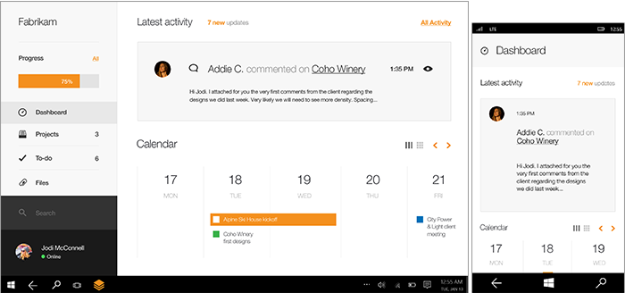
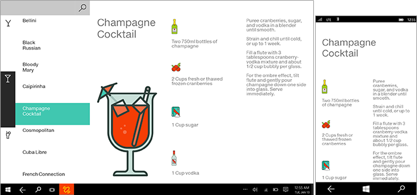
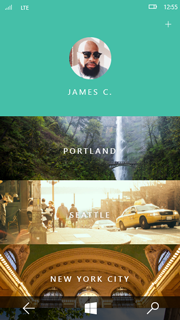

#  Создание сложного приложения универсальной платформы Windows (UWP)

Группы разработчиков Майкрософт делят процесс создания приложений на пять основных этапов: концепция, структура, динамика, визуальные элементы и прототип. Мы предлагаем вам использовать похожий процесс и с легкостью создавать новые взаимодействия на радость пользователям.

## Концепция

**Определите назначение приложения**

При планировании приложения универсальной платформы Windows (UWP) необходимо определить не только функции приложения и его целевую аудиторию, но также и его сильные стороны. В основе любого успешного приложения всегда лежит удачная концепция, которая обеспечивает надежный фундамент.

Допустим, вы собираетесь создать приложение для работы с фотографиями. В этом случае для начала стоит задуматься, ради чего вообще люди обрабатывают, хранят и отправляют друг другу фотографии. Вероятно, они хотят вновь пережить приятные моменты, поделиться эмоциями и сберечь воспоминания. Именно эти задачи должно эффективно решать ваше приложение. Это цель, к которой нужно постоянно стремиться при проектировании приложения.

**Для чего нужно ваше приложение?** Начните с общей идеи, а затем составьте список всех возможностей, которые приложение открывает пользователю.

Допустим, вы хотите создать приложение для планирования путешествий. Какие возможности оно открывает путешественнику?

-   Найти карты на весь маршрут поездки и взять их с собой.
-   Узнать, какие мероприятия запланированы на время пребывания в месте назначения.
-   Составить собственный список событий и достопримечательностей, которым можно делиться с попутчиками.
-   Собрать фотографии всех попутчиков в один альбом, который можно показывать друзьям и родственникам.
-   Разработать маршрут с учетом цен на авиабилеты.
-   Найти подробный перечень скидок и акций, предлагающихся в ресторанах, магазинах и т. п. в месте пребывания.

**Чем замечательно ваше приложение?** Теперь отвлекитесь и окиньте свежим взглядом список, который у вас получился. Возможно, один из сценариев кажется вам наиболее выигрышным. Выберите из списка такой сценарий и сосредоточьтесь на нем. При разработке приложения вам, скорее всего, придется с сожалением вычеркнуть много замечательных идей. Важно суметь это сделать, чтобы создать единственный, но достойный сценарий.

Когда выбор сценария сделан, предстоит придумать, как одной фразой объяснить обычному человеку, чем же примечательно ваше приложение. Например:

-   Мое приложение для путешествий поможет попутчикам совместно разработать маршрут поездки.
-   Мое приложение для тренировок поможет спортсменам отслеживать свои результаты и сравнивать их с результатами других.
-   Мое приложение для покупки продуктов поможет семьям организовать еженедельную закупку продовольствия так, чтобы ничего не забыть и не купить лишнее.

Такая фраза, суммирующая ценность приложения, — своего рода девиз, которым следует руководствоваться при проектировании приложения, решая, что добавить и от чего отказаться. Сосредоточьтесь на сценариях, которые хотите предоставить пользователю в приложении, но не увлекайтесь, чтобы у вас не получился перечень функций. Главное — чего сможет достичь пользователь, а не то, на что способно само приложение.

**Воронка проектирования**

Очень соблазнительно взять идею, которая вам нравится, развить ее и даже перейти к детальной разработке. Но представьте, что вы это сделали, а затем вам в голову пришла другая интересная идея. Вам, конечно же, захочется сохранить идею, в которую вы уже вложились, вне зависимости от сравнительной ценности двух идей. Если бы только эта идея пришла вам в голову на более раннем этапе! Что ж, прием "воронка проектирования" поможет вам выявить самые лучшие идеи как можно раньше.

Термин "воронка" используется из-за формы. С широкой стороны воронки поступает множество идей, и каждая из них реализуется в виде проектного артефакта низкой точности (наброска или, к примеру, фрагмента текста). По мере продвижения набора идей к узкому краю воронки количество идей сокращается, а точность артефактов, представляющих идеи, увеличивается. Каждый артефакт должен содержать только ту информацию, которая необходима для сравнения одной идеи с другой или для ответа на такие вопросы, как «Насколько это удобно?» или «Насколько это интуитивно понятно?». *Не вкладывайте в артефакты больше времени или усилий*. Некоторые идеи отсеются по мере тестирования, и вам не придется жалеть о них, ведь вы вложили в них ровно столько, сколько необходимо для оценки. Оставшиеся идеи по мере продвижения по воронке будут последовательно подвергаться более тщательной разработке. В результате вы получите единый проект, представляющий самую удачную идею. Эта идея будет выбрана из-за ее ценности, а не потому, что она появилась первой. Таким образом вы сможете создать наиболее успешное приложение.

## Структура

**Организованность все упрощает**

Теперь, когда вы разработали устраивающую вас концепцию, вы готовы к следующему этапу — созданию проекта приложения. Информационная архитектура дает вашему содержимому необходимую структурную целостность. Она помогает определить модель навигации приложения и в конечном итоге его индивидуальность. Спланировав, как организовать содержимое — и как пользователи будут получать к нему доступ, — вы получите более полное представление о том, как пользователи будут взаимодействовать с вашим приложением.

Хорошая информационная архитектура не только помогает упростить пользовательские сценарии, но и позволяет вам визуализировать ключевые экраны, с которых следует начать. Например, приложение [Audible](https://go.microsoft.com/fwlink/p/?LinkID=268089) запускается непосредственно в концентраторе, который предоставляет доступ к библиотеке, хранилищу, новостям и статистике пользователя. Взаимодействие сфокусировано, поэтому пользователь может быстро получить доступ к аудиокнигам и начать их слушать. Более глубокие уровни приложения сфокусированы на более специфических задачах.

Связанные руководства см. в разделе [Основы проектирования навигации](../design/basics/navigation-basics.md).

## Dynamics

**Реализуйте свою концепцию**

Если на этапе разработки концепции вы определяете цель вашего приложения, то этап динамики касается выполнения этой цели. Этого можно достичь многими способами, например с помощью каркасов для отрисовки потоков страниц (процессов перемещения из одного места в другое в рамках приложения), а также обдумав тон приложения и выбрав нужные слова для пользовательского интерфейса. Каркасы — это быстрое черновое средство, которое поможет вам принять важные решения, касающиеся потока пользовательского интерфейса приложения.

Каждый поток приложения должен быть привязан к девизу и обслуживать тот сценарий, который вы стремитесь реализовать. Удачные приложения отличают потоки, несложные в освоении и включающие минимум операций. Начните обдумывать уровень переходов между экранами и посмотрите на свое приложение так, как будто видите его впервые. Если вы точно определите сценарии для создаваемых страниц, то сможете дать пользователям именно то, что им нужно, без множества ненужных действий. Динамика — это также и движение. Наличие нужных возможностей движения обеспечит динамичность и простоту переходов между страницами.

Общие советы, полезные на этом этапе:

-   Наметьте схему действий в общих чертах: что будет в начале, а что — потом.
-   Сделайте раскадровку схемы действий, а именно: как будет выглядеть последовательность действий применительно к пользовательскому интерфейсу.
-   Прототип: опробуйте схему на небольшом прототипе.

**Чего сможет достичь пользователь благодаря вашему приложению?** Предположим, ваше приложение для путешествий призвано помочь попутчикам совместно разработать маршрут поездки. Перечислим ключевые действия такого приложения:

-   Создавать проекты путешествий.
-   Приглашать в поездку друзей.
-   Присоединяться к поездкам друзей.
-   Просматривать маршруты, рекомендованные другими путешественниками.
-   Добавлять туристические направления и мероприятия.
-   Изменять и комментировать направления и мероприятия, добавленные друзьями.
-   Делиться уже освоенными маршрутами с друзьями и родственниками.

## Объект класса Visual

**Говорите без слов**

Определив динамику приложения, вы можете сделать его неповторимым в визуальном плане. Отличные визуальные элементы определяют не только то, как выглядит ваше приложение, но и то, какие оно вызывает ощущения и как его оживляют анимации и движение. Цветовая палитра, значок и изображения — вот лишь некоторые из визуальных элементов, которые вы можете выбрать.

Каждое приложение обладает индивидуальностью, поэтому стоит внимательно изучить направления визуальных элементов, которые можно использовать для приложения. Выбирайте внешний вид исходя из содержимого, а не наоборот.

## Прототип

**Детализируйте приложение**

Создание прототипа является этапом *воронки проектирования* — приема, о котором мы говорили ранее, — на котором артефакт, представляющий вашу идею, становится чем-то большим, чем просто набросок, хотя менее сложным, чем завершенное приложение. Прототип может представлять собой несколько нарисованных от руки экранов, которые увидит пользователь. Разработчик, который проводит тест, может реагировать на действия пользователя, размещая различные экраны или прикрепляя на страницах и убирая с них более мелкие части интерфейса, чтобы имитировать работающее приложение. Или же прототипом может быть очень простое приложение, которое имитирует некоторые рабочие процессы при условии, что оператор придерживается сценария и нажимает на нужные кнопки. На этом этапе ваша идея действительно начинает воплощаться в жизнь и проходит первое тестирование. В ходе создания прототипов различных областей приложения уделите внимание усовершенствованию и детализации тех компонентов, которые больше всего в этом нуждаются.

Повторим еще раз для начинающих разработчиков: создание отличного приложения — циклический процесс. Мы рекомендуем создавать прототипы на самых ранних этапах разработки и как можно чаще. Как и любое творческое начинание, хорошее приложение — это результат проб и ошибок.

## Определите набор функций

Теперь, когда вы точно знаете, чего хотят получить пользователи и как им в этом помочь, настало время заглянуть в набор инструментов. Изучите универсальную платформу Windows (UWP) и соотнесите ее возможности с задачами вашего приложения. Продумывая каждую функцию, следуйте [указаниям по взаимодействию с пользователем](https://developer.microsoft.com/windows/apps/design).
<!--need URL for landing page -->

Методики:

-   Исследование платформы: выясните, какими возможностями обладает платформа и как их можно использовать.
-   Карта мыслей: сопоставьте схемы действий с функциями.
-   Прототип: попробуйте функции в действии, чтобы удостовериться, что они отвечают вашим нуждам.

**Контракты приложений.**   Благодаря контрактам приложений в схемах действий пользователя можно объединять множество приложений и функций.

-   **Общий доступ.**   Разрешите пользователям отправлять содержимое вашего приложения другим людям через другие приложения и наоборот.
-   **Воспроизведение на устройстве.**   Дайте пользователям возможность наслаждаться изображениями, звуковыми файлами и видеофайлами, передаваемыми вашим приложением на другие устройства в домашней сети.
-   **Средство выбора файлов и расширения средства.**   Дайте пользователям возможность загружать и сохранять в вашем приложении файлы из локальной файловой системы, подключенных запоминающих устройств, домашней группы или даже из других приложений. Вы также можете предоставить расширение средства выбора файлов, чтобы и другие приложения могли загружать содержимое вашего приложения.

Дополнительные сведения: [Контракты приложений и расширения](https://docs.microsoft.com/previous-versions/windows/apps/hh464906(v=win.10)).
<!-- Win 8 page. Should have replacement. -->

**Различные представления, форм-факторы и конфигурации оборудования.**   Windows обеспечивает пользователям полный контроль и помещает ваше приложение на передний план. Вы стремитесь к тому, чтобы пользователи наслаждались эффективностью и удобством интерфейса вашего приложения на любом устройстве, с любым способом ввода, при любой ориентации экрана, конфигурации оборудования и в любой обстановке.

**Сенсорные возможности.**   Windows раскрывает уникальные возможности сенсорного управления, качественно превосходящие функциональность мыши.

Например, контекстное масштабирование, обогащенное сенсорными возможностями, обеспечивает динамичную навигацию по всему обилию содержимого. Пользователь может сдвигать или прокручивать категории содержимого и, приближая понравившиеся, получать более подробную информацию. Теперь вы можете представлять содержимое более осязательно, наглядно и информативно, чем при традиционных способах просмотра и навигации, таких как вкладки.

При этом, разумеется, доступны различные сенсорные возможности, такие как поворот, сдвиг, прокрутка и др. Узнайте больше о [сенсорном вводе и других способах взаимодействия с пользователем](../design/input/input-primer.md).

**Увлекательность и новизна.**   Если хотите, чтобы ваше приложение было оригинальным и захватывающим, к вашим услугам такие средства:

-   **Анимация.**   Создайте ощущение скорости и плавности при помощи нашей библиотеки анимации. Помогите пользователям ориентироваться в изменениях контекста, применяя визуальные переходы. Узнайте больше о [возможностях анимации](../graphics/animations-overview.md).
-   **Всплывающие уведомления.**   Применяйте всплывающие уведомления, чтобы своевременно информировать пользователя о содержимом, которое актуально для него, даже когда приложение закрыто. Узнайте подробнее о [плитках, индикаторах событий и всплывающих уведомлениях](../design/shell/tiles-and-notifications/index.md).
-   **Плитки приложения.**   Предоставляйте заманчивые и нужные обновления, чтобы поддержать интерес пользователя. Подробнее об этом вы узнаете в следующем разделе. Узнайте подробнее о [плитках приложения](../design/shell/tiles-and-notifications/creating-tiles.md).

**Персонализация**

-   **Параметры.**   Помогите пользователям сэкономить время, затрачиваемое на настройку параметров приложения. Объедините все ваши настройки в одном месте, чтобы пользователь мог управлять параметрами приложения с помощью единого механизма, к которому он привык. Узнайте подробнее о [добавлении параметров приложения](../design/app-settings/app-settings-and-data.md).
-   **Перемещение.**   Обеспечьте непрерывность взаимодействия с устройствами, перемещая данные. Это даст пользователям возможность продолжить с того места, где они остановились, и сохранит наиболее важные результаты их действий независимо от используемого устройства. Сделайте приложение удобным для использования повсюду — на домашнем или рабочем компьютере, личном планшете или других устройствах, — сохранив параметры и состояния с помощью перемещения. Узнайте больше об [управлении данными приложения](../design/app-settings/store-and-retrieve-app-data.md) и изучите [руководство по перемещаемым данным приложения](https://docs.microsoft.com/windows/uwp/design/app-settings/store-and-retrieve-app-data).
-   **Пользовательские плитки.**   Обеспечьте персонализацию: предоставьте пользователям возможность загружать изображение пользовательской плитки или устанавливать содержимое из вашего приложения в качестве личной плитки в любом месте.

**Возможности устройств.**   Задействуйте все многообразие возможностей современных устройств.

-   **Жесты близкого взаимодействия.**   Предоставьте пользователю возможность установить соединение с устройством другого пользователя, находящегося поблизости, посредством физического соприкосновения устройств (многопользовательские игры). Узнайте подробнее о [бесконтактном и контактном взаимодействии](https://docs.microsoft.com/previous-versions/windows/apps/hh465229(v=win.10)).
-   **Камеры и внешние накопители.**   Подключайте встроенные или внешние камеры, чтобы пользователи могли общаться в чатах, участвовать в видеоконференциях, записывать видеоблоги, делать фотографии для учетной записи, вести документальные съемки и экспериментировать с другими замечательными возможностями вашего приложения. Подробнее о [получении доступа к содержимому съемного носителя](https://docs.microsoft.com/previous-versions/windows/apps/hh465189(v=win.10)).
-   **Акселерометры и другие датчики.**    Современные устройства оснащены рядом различных датчиков. Ваше приложение способно менять яркость в зависимости от освещения, адаптировать интерфейс при повороте дисплея и реагировать на любые движения. Узнайте подробнее о [датчиках](../devices-sensors/sensors.md).
-   **Географическое положение.**   Используйте данные географического положения, получаемые из стандартных веб-данных или от датчиков географического положения, чтобы помочь пользователям сориентироваться на местности, определить свое положение на карте или узнать о людях, событиях и объектах, которые находятся рядом. Дополнительные сведения о [географическом положении](https://docs.microsoft.com/previous-versions/windows/apps/hh465139(v=win.10)).

Давайте снова обратимся к примеру приложения для путешественников. Чтобы по-настоящему эффективно помогать попутчикам совместно разрабатывать маршрут поездки, обратите внимание на такие варианты:

-   Общий доступ. Пользователи могут поделиться информацией о намеченном путешествии в социальные сети, чтобы разделить с друзьями и родственниками эмоции от предстоящей поездки.
-   Поиск. Пользователь может искать развлечения и туристические направления в маршрутах других путешественников, открытых для общего доступа, и включать их в план собственной поездки.
-   Уведомления. Пользователи получают уведомления об изменениях в маршрутах попутчиков.
-   Параметры: Каждый пользователь настраивает получение уведомлений, доступ к своим маршрутам и другие параметры приложения по своему усмотрению.
-   Контекстное масштабирование. Приближая отдельные участки на временной шкале своего маршрута, пользователь увидит более подробные сведения о запланированных мероприятиях.
-   Пользовательские плитки. Пользователь может выбрать изображение, которое будет появляться при обмене информацией о путешествии с друзьями.

## Выберите способ получения прибыли

Существует множество способов заработать деньги с помощью приложения. Один из них — проектирование приложения таким образом, чтобы в нем можно было размещать рекламу или продавать товары и услуги. Подробнее см. в разделе, посвященном [планированию коммерческого использования](../monetize/index.md).

## Спроектируйте взаимодействие приложения с пользователем

Очень важно правильно заложить основу. Теперь, когда вы определили ценность приложения и выбрали схемы действий, пора продумать фундаментальные основы взаимодействия с пользователем.

**Как упорядочить содержимое пользовательского интерфейса?**   Как правило, содержимое приложения может быть упорядочено в форме групп или иерархий. На верхнем уровне должно размещаться содержимое, отвечающее вашему замыслу.

Останемся верными примеру с приложением для путешествий и попробуем придумать варианты группировки маршрутов. Если главное назначение приложения — находить интересные туристические направления, то последние можно распределять по категориям: приключения, пляжный отдых, романтические путешествия и т. п. Но так как основной акцент сделан на планировании путешествий совместно с друзьями, будет логичнее сгруппировать маршруты по принципу социальных сетей: семья, друзья, работа и др.

Определившись со способом организации содержимого, вы сможете решить, какие страницы или режимы просмотра уместнее для вашего приложения. Подробнее см. в статье «Основы пользовательского интерфейса».

**Как следует представлять содержимое пользовательского интерфейса?** После того как вы решили, как организовать пользовательский интерфейс, можно определить цели взаимодействия с пользователем, которые задают способ создания пользовательского интерфейса и его представления пользователю. При любом сценарии вы стремитесь предоставить пользователю возможность максимально быстро продолжить использование вашего приложения. Для этого решите, какие части пользовательского интерфейса следует представлять сначала, и убедитесь, что они готовы, прежде чем приступать к созданию менее важных частей.

В приложении для путешествий пользователь, скорее всего, захочет в первую очередь найти маршрут определенной поездки. Чтобы как можно скорее предоставить эту информацию, необходимо сначала вывести список маршрутов, используя элемент управления **ListView**.

После отображения списка маршрутов можно начать загрузку других компонентов, например новостных веб-каналов с поездками друзей пользователя.

**Какие поверхности и команды пользовательского интерфейса вам необходимы?**   Изучите составленные ранее потоки. Набросайте последовательность действий пользователя для каждой схемы.

Рассмотрим схему действий "Поделиться уже освоенными маршрутами с друзьями и родственниками". Предположим, пользователь уже создал маршрут поездки. Чтобы им поделиться, необходимо:

1.  Открыть приложение и просмотреть список уже созданных поездок.
2.  Касанием выбрать нужный маршрут.
3.  Просмотреть появившиеся сведения о поездке.
4.  Выполнить соответствующую команду, чтобы начать обмен.
5.  Выбрать или ввести адрес почты или имя человека, с которым пользователь собирается поделиться сведениями.
6.  Соответствующей командой завершить обмен.
7.  После этого приложение синхронизирует данные о поездке с учетной записью выбранного человека.

Выполняя эти действия, вы начинаете яснее представлять, каким должно получиться приложение и какими компонентами его необходимо дополнить (например, шаблоном сообщения для тех, у кого еще нет вашего приложения). Возможно, некоторые шаги вы захотите убрать. К чему, например, лишний раз просматривать данные о поездке перед их отправкой? Чем меньше избыточных действий, тем удобнее пользоваться приложением.

Подробнее о том, как использовать различные поверхности, см. в статье <!--[Command design basics](../design/basics/commanding-basics.md)-->.

**Как должен выглядеть поток?** После того как вы определили последовательность действий пользователя, можно приступить к оптимизации производительности. Подробнее об этом см. в разделе [Планирование производительности](../debug-test-perf/planning-and-measuring-performance.md).

**Как лучше организовать команды?**   По намеченным последовательностям действий определите, какие команды необходимо предусмотреть. После этого подумайте, где в приложении эти команды лучше всего использовать.

-   **Всегда старайтесь использовать содержимое.**   При любой возможности разрешайте пользователям управлять содержимым непосредственно на полотне приложения, а не добавлять команды для влияния на содержимое. Скажем, пусть путешественники из нашего примера, планируя маршрут, просто перетаскивают развлечения внутри списка на полотне приложения, а не нажимают всякий раз стрелки.
-   **Если содержимое использовать невозможно.** Разместите команды на одной из этих поверхностей интерфейса, если не получается использовать содержимое:

    -   [Панель команд](https://docs.microsoft.com/windows/uwp/controls-and-patterns/app-bars). Большинство команд лучше расположить на панели команд, которая обычно остается скрытой до тех пор, пока ее не коснется пользователь.
    -   Холст приложения. Если определенная страница или представление служит одной цели, то команды, обслуживающие эту цель, можно разместить прямо на холсте. Таких команд должно быть совсем немного.
    -   [Контекстное меню](https://docs.microsoft.com/windows/uwp/controls-and-patterns/menus). В контекстное меню можно поместить команды, обеспечивающие работу буфера обмена (вырезание, копирование и вставка), или команды, относящиеся к содержимому, которое нельзя выбрать (например, добавление флажка на карту).

**Выберите способ расположения вашего приложения в каждом представлении.**   Windows поддерживает альбомную и книжную ориентации, а также адаптацию размеров окна приложения под любую ширину экрана — от полноэкранного режима до минимальной ширины. Нам нужно, чтобы приложение выглядело и работало превосходно на любом экране и в любой ориентации. Это значит, что необходимо планировать структуру элементов интерфейса для различных размеров и представлений. Тем самым вы обеспечите плавную адаптацию интерфейса к нуждам и предпочтениям пользователя.

Дополнительные сведения о создании приложений для разных размеров экрана см. в статье [Размеры экрана и точки останова для реализации отзывчивого дизайна](https://docs.microsoft.com/windows/uwp/design/layout/screen-sizes-and-breakpoints-for-responsive-design).

## Создание хорошего первого впечатления

Подумайте о том, какими должны быть впечатления и действия пользователей при первом запуске вашей программы. Вспомните ваш девиз. Хотя у вас не будет возможности лично рассказать пользователю о всех достоинствах вашего приложения, сообщите самое важное при первом запуске. К вашим услугам следующие средства.

**Плитка и уведомления.**    Плитка — это "лицо" приложения. Что может побудить пользователя запустить именно ваше приложение, выбрав его среди прочих, которыми изобилует его начальный экран? Не пожалейте сил на разработку плитки. Она должна отражать фирменную символику и подчеркивать ценность приложения. Используйте уведомления плиток, чтобы ваше приложение всегда вызывало ощущение новизны и актуальности, вновь и вновь привлекая пользователей.

**Экран-заставка.**   Экран-заставка должен загружаться как можно быстрее и оставаться на экране только на время, необходимое для инициализации вашего приложения. Экран-заставка должен отражать суть вашего приложения.

**Первый запуск.**   Чтобы пользователь заинтересовался вашей услугой, зарегистрировал свою учетную запись и начал добавлять собственное содержимое, его нужно привлечь к этому. Сначала убедите пользователя в полезности приложения, а уже потом запрашивайте его данные. Неплохой ход — показать пример содержимого, чтобы пользователь мог ознакомиться и понять, зачем нужно ваше приложение, прежде чем зарегистрироваться.

**Домашняя страница.**   Домашняя страница — это то место, куда пользователь попадает при каждом запуске приложения. Содержимое домашней страницы должно сразу ясно демонстрировать, для чего предназначено приложение. Здесь важно сделать акцент на самом существенном. Об остальных возможностях вашего приложения пользователи узнают сами в процессе работы. Сконцентрируйтесь на удалении отвлекающих факторов с целевой страницы, а не на открытости.

## Проверьте разработку

Прежде чем погрузиться в детальную разработку, проверьте соответствие вашего проекта или прототипа требованиям, рекомендациям и ожиданиям пользователей, чтобы позже вам не пришлось полностью переделывать приложение. Для каждого компонента существуют рекомендации по взаимодействию с пользователем, соблюдение которых поможет довести ваше приложение до совершенства. Также есть требования, которые необходимо соблюсти, чтобы можно было опубликовать приложение в Microsoft Store. Для проверки соответствия техническим требованиям Магазина используйте [комплект сертификации приложений для Windows](https://developer.microsoft.com/windows/develop/app-certification-kit). Кроме того, вы можете использовать средства оценки производительности в Microsoft Visual Studio, чтобы обеспечить самое высокое качество работы пользователя при любом сценарии.

Раздел [подробные рекомендации по взаимодействию с пользователем для приложений UWP](https://developer.microsoft.com/windows/apps/design) поможет вам не упустить важные моменты. С помощью [средств оценки производительности Visual Studio](https://docs.microsoft.com/visualstudio/profiling/profiling-tools?view=vs-2015) можно проанализировать производительность каждого сценария приложения.
