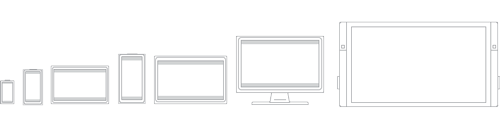

# Что такое приложение UWP?

Основные достоинства приложения UWP:

- Безопасность: Приложений универсальной платформы Windows объявлять, какие ресурсы устройства и их доступа к данным. Пользователь должен разрешить такой доступ.
- Возможность использовать общий API на всех устройствах под управлением Windows 10.
- Возможность использования отдельных возможностей устройства и адаптировать его для размеров экрана другое устройство, разрешений и DPI.
- Доступность в Microsoft Store, на всех устройствах (или только тех, которых вы укажете), работающих под управлением Windows 10. В Microsoft Store предусмотрено несколько способов монетизировать ваше приложение.
- Способность устанавливаться и удаляться без риска для компьютера или "деградации" ПО.
- Увлекательность: возможность использовать живые плитки, push-уведомления и пользовательские действия, взаимодействующие с временной шкалой Windows и функцией "Продолжить с места остановки" Кортаны, для поддержания интереса пользователей к приложению.
- Возможность программирования на C#, C++, Visual Basic и JavaScript. Для пользовательского интерфейса можно использовать XAML, HTML или DirectX.

Рассмотрим все это более подробно.

## Безопасность

В манифестах приложений UWP объявляются возможности устройства, необходимые приложению, — например, доступ к микрофону, геоданным, веб-камере, USB-устройствам, файлам и т. д. Прежде чем приложение получит доступ к возможности, пользователь должен подтвердить и разрешить такой доступ.

## Общая поверхность API для всех устройств

Windows 10 представляет универсальной платформы Windows (UWP), который предоставляет единую платформу приложений на любом устройстве с ОС Windows 10. Основные API UWP являются одинаковыми на всех устройствах с Windows. Если ваше приложение использует только базовые интерфейсы API, он будет выполняться на любом устройстве Windows 10 независимо от того, ориентации настольный ПК, Xbox, Mixed реальности гарнитуры и так далее.

Приложение UWP, написанное на C++ /WinRT или C++ /CX, имеет доступ к API-интерфейсам Win32, которые входят в состав UWP. Эти API-интерфейсы Win32, реализуются посредством всех устройств Windows 10.

## Пакеты SDK расширений предоставляют уникальные возможности конкретных типов устройств

Если вы разрабатываете приложение для универсальных API, оно сможет работать на всех устройствах под управлением Windows 10. Но если вы хотите, чтобы ваше приложение UWP могло пользоваться преимуществами API конкретных устройств, это также возможно.

Пакеты SDK расширений позволяют вызывать специализированные API для различных устройств. Например, если ваше приложение UWP предназначено для устройства Интернета вещей, вы можете добавить в свой проект пакет SDK расширения для Интернета вещей, чтобы реализовать функции, характерные для устройств Интернета вещей. Подробнее о добавлении пакетов SDK расширений см. в статье **Пакеты SDK расширений** статьи [Общие сведения о семействах устройств](https://docs.microsoft.com/uwp/extension-sdks/device-families-overview#extension-sdks).

Вы можете написать приложение так, чтобы оно было предназначено для запуска только на устройствах определенного типа, а затем ограничить его распространение в Microsoft Store только этим типом устройств. Или же вы можете реализовать условную проверку на наличие того или иного API во время выполнения и соответствующим образом адаптировать поведение своего приложения. Подробнее см. в разделе **Написание кода** статьи [Общие сведения о семействах устройств](https://docs.microsoft.com/uwp/extension-sdks/device-families-overview#writing-code). 

Следующее видео представляет собой краткий обзор семейств устройств и написания адаптивного кода:
<iframe src="https://channel9.msdn.com/Blogs/One-Dev-Minute/Introduction-to-UWP-and-Device-Families/player" width="640" height="360" allowFullScreen frameBorder="0"></iframe>

## Адаптивные элементы управления и ввод

Элементы пользовательского интерфейса реагируют на размер и плотность DPI, на котором выполняется приложение, и корректируют свой масштаб и макет. Кроме того, приложения UWP отлично работают с различными средствами ввода, такими как клавиатура, мышь, касания, перо и устройства управления Xbox One. Если нужно дополнительно настроить пользовательский интерфейс в соответствии с определенным размером экрана или типом устройства, новые панели макета и инструменты помогут вам разработать интерфейс, способный адаптироваться к различным устройствам и форм-факторам, на которых может работать ваше приложение.

Windows помогает ориентировать ваш пользовательский интерфейс на несколько устройств с помощью следующих функций:

- Универсальные элементы управления и панели макета помогают оптимизировать пользовательский интерфейс для разрешения экрана устройства. Например, такие элементы управления, как кнопки и ползунки, автоматически адаптируются к размеру и плотности DPI экрана устройства. Панели макета помогают корректировать компоновку содержимого в зависимости от размера экрана. Адаптивное масштабирование подстраивается под различия в разрешении и плотности DPI на всех устройствах.
- Общий механизм обработки ввода позволяет получать входные данные с помощью сенсорного ввода, пера, мыши, клавиатуры или контроллера, такого как контроллер Microsoft Xbox.
- Инструменты помогут разработать вам пользовательский интерфейс, способный адаптироваться под различные разрешения экрана.

Некоторые аспекты пользовательского интерфейса вашего приложения будут автоматически адаптированы под все устройства. Тем не менее, в зависимости от устройства, на котором будет выполняться приложение, может потребоваться адаптация дизайна интерфейса пользователя. Например, приложению для фотографирования имеет смысл адаптировать свой пользовательский интерфейс под маленькое наладонное устройство, чтобы с ним удобно было работать одной рукой. Если же приложение для фотографирования запускается на настольном компьютере, пользовательский интерфейс должен адаптироваться так, чтобы использовать дополнительное пространство экрана.

## Один магазин для всех устройств

В магазине приложений единой делает приложения доступными на устройствах Windows 10, такие как PC, tablet, Xbox, HoloLens, Surface Hub и устройства Интернета вещей (IoT). Вы можете отправить свое приложение в магазин и сделать его доступным для всех типов устройств или только некоторых из них. Вы отправляете все свои приложения для устройств с ОС Windows и управляете ими в одном месте. У вас есть классическое приложение на C++, которое вы хотите модернизировать за счет возможностей UWP и продавать в Microsoft Store? Пожалуйста!

Приложения UWP интегрируются с [Application Insights](https://azure.microsoft.com/services/application-insights/) для получения подробной телеметрии и аналитики, что поможет вам понять предпочтения своих пользователей и усовершенствовать приложения.

### Монетизация приложения

Вы можете выбрать способ монетизации своего приложения. Существует целый ряд способов заработать на своем приложении. Вам нужно только выбрать наиболее подходящий, например:

- Самый простой вариант — платная загрузка. Просто назовите свою цену.
- Ознакомительные версии пользователя позволяют опробовать ваше приложение перед покупкой. Так пользователям становится легче обнаружить ваше приложение, к тому же это увеличивает процент покупателей от общего числа посетителей по сравнению с более традиционными минимально-бесплатными версиями.
- Скидки и распродажи, которые мотивируют пользователей совершить покупку.
- Кроме того, доступны покупки из приложения и реклама.

### Приложения из Microsoft Store легко устанавливаются, удаляются и обновляются

Все приложения UWP распространяются с использованием механизма упаковки, который защищает пользователя, устройство и систему. Пользователям никогда не придется сожалеть об установке приложения, потому что приложения UWP удаляются без следа — если не считать документов, созданных с помощью приложения.

Приложения развертываются и обновляются без всяких проблем. Приложения можно упаковывать модульно, чтобы дать пользователя возможность скачивать содержимое и расширения по требованию.

## Актуальная информация в реальном времени, которая побуждает пользователей вновь и вновь обращаться к приложению

Существует множество способов поддерживать заинтересованность пользователей в вашем приложении UWP:

- Живые плитки и экран блокировки, на которые выводится краткий обзор актуальной и значимой в определенном контексте информации из вашего приложения.
- Push-уведомления, которые предлагают вниманию пользователей важные оповещения в нужный момент.
- Действия пользователей, которые позволяют пользователям продолжить работу в приложении с того места, где они остановились — даже на другом устройстве.
- Центр уведомлений обеспечивает организацию уведомлений, поступающих из вашего приложения.
- Фоновое выполнение и триггеры позволяют вашему приложению возобновлять работу именно тогда, когда это нужно пользователю.
- Вы можете использовать голосовые функции и устройства Bluetooth с низким энергопотреблением, чтобы помочь пользователям взаимодействовать с окружающим миром.
- Интеграция с Кортаной позволяет добавить в ваше приложение возможности голосового управления.

##  Использование знакомого языка

Приложения UWP могут использовать среду выполнения Windows, то есть собственный API, встроенный в операционную систему. Этот API реализован на языке C++ и поддерживается в C#, Visual Basic, C++ и JavaScript. Некоторые из языков и технологий, пригодных для написания приложений UWP:

- XAML (для пользовательского интерфейса) и C#, VB или C++
- DirectX (для пользовательского интерфейса) и C++
- JavaScript и HTML

## Ссылки, которые помогут вам приступить к работе

### Подготовка

Зайдите в раздел [Подготовка](get-set-up.md), чтобы скачать средства, необходимые для создания приложений, и приступайте к [написанию своего первого приложения](your-first-app.md).

### Проектирование вашего приложения

Система проектирования Майкрософт называется Fluent Design. Fluent Design — это набор функций UWP в сочетании с рекомендациями по созданию приложений, которые будут прекрасно смотреться на всех типах устройств под управлением Windows. Разработанные с помощью Fluent приложения адаптируются к самым разным устройствам — от планшетов до ноутбуков и от ПК до телевизоров, а также устройств виртуальной реальности — и выглядят на них совершенно естественно. Вводные сведения о системе Fluent см. в статье [Система проектирования Fluent для приложений UWP](https://docs.microsoft.com/windows/uwp/design/fluent-design-system).

Хорошее [проектирование](https://go.microsoft.com/fwlink/?LinkId=258848) подразумевает принятие решений о том, как пользователи будут взаимодействовать с приложением, а также как оно будет выглядеть и функционировать. Взаимодействие с пользователем играет огромную роль в удовлетворенности людей при использовании вашего приложения, поэтому тщательно проработайте этот шаг. Из статьи [Основы проектирования](https://developer.microsoft.com/en-us/windows/apps/design) вы узнаете, с чего начинать проектирование универсального приложения для Windows. В разделе [Знакомство с приложениями универсальной платформы Windows (UWP) для дизайнеров](https://docs.microsoft.com/windows/uwp/layout/design-and-ui-intro) вы узнаете о создании приложений для Windows, которые понравятся вашим пользователям. Прежде чем приступить к написанию кода, ознакомьтесь с [азбукой устройств](../design/devices/index.md), которая поможет определить интерфейс взаимодействия вашего приложения на всех форм-факторах, на которые вы ориентируетесь.

В дополнение к взаимодействию на различных устройствах, [создайте план приложения](https://docs.microsoft.com/windows/uwp/get-started/plan-your-app), чтобы воспользоваться преимуществами работы на нескольких устройствах. Пример:

- Спроектируйте рабочий процесс с помощью раздела [Основы проектирования навигации для приложений UWP](https://docs.microsoft.com/windows/uwp/layout/navigation-basics), чтобы адаптировать мобильные устройства и устройства с маленьким и большим экранами. [Разработайте свой пользовательский интерфейс](https://docs.microsoft.com/windows/uwp/layout/screen-sizes-and-breakpoints-for-responsive-design) для различных размеров и разрешений экрана.

- Подумайте, как вы реализуете прием нескольких типов ввода. Ознакомьтесь с [Руководством по взаимодействию](https://developer.microsoft.com/windows/design/inputs-devices), чтобы узнать, как пользователи могут взаимодействовать с вашим приложением с помощью [Кортаны](https://docs.microsoft.com/windows/uwp/input-and-devices/cortana-design-guidelines), [голосовых функций](https://docs.microsoft.com/windows/uwp/input-and-devices/speech-interactions), [распознавания сенсорного ввода](https://docs.microsoft.com/windows/uwp/input-and-devices/guidelines-for-user-interaction), [сенсорной клавиатуры](https://docs.microsoft.com/windows/uwp/input-and-devices/keyboard-interactions) и других возможностей.  Или ознакомьтесь с [Руководством по тексту и текстовому вводу](https://docs.microsoft.com/windows/uwp/controls-and-patterns/text-controls), чтобы узнать больше о традиционных способах взаимодействия.

### Добавление служб

- Используйте [облачные службы](https://go.microsoft.com/fwlink/?LinkId=526377), чтобы выполнять синхронизацию между устройствами.
- Узнайте, как [подключаться к веб-службам](https://docs.microsoft.com/previous-versions/windows/apps/hh761504(v=win.10)) для улучшения взаимодействия с вашим приложением.
- Узнайте, как [интегрировать приложение с Кортаной](https://mva.microsoft.com/training-courses/integrating-cortana-in-your-apps-8487?l=20D3s5Xz_5904984382), чтобы оно могло реагировать на голосовые команды.
- Включите в свой план [push-уведомления](https://docs.microsoft.com/windows/uwp/controls-and-patterns/tiles-and-notifications-windows-push-notification-services--wns--overview) и [покупки из приложений](https://docs.microsoft.com/windows/uwp/monetize/enable-in-app-product-purchases). Эти функции должны работать на всех устройствах.

### Отправьте приложение в Магазин Windows.

[Центр партнеров](https://partner.microsoft.com/dashboard) позволяет управлять и отправки всех ваших приложений для устройств Windows в одном месте. См. в разделе [публикация Windows-приложений и игр](../publish/index.md) чтобы узнать, как отправить приложениях для публикации в Microsoft Store.

Новые функциональные возможности упрощают процессы, обеспечивая больший контроль с вашей стороны. Вы также найдете здесь подробные [аналитические отчеты](https://docs.microsoft.com/windows/uwp/publish/analytics) вместе с [сведениями о выплатах](https://docs.microsoft.com/windows/uwp/publish/payout-summary), способами [продвижения вашего приложения среди пользователей](https://docs.microsoft.com/windows/uwp/publish/app-promotion-and-customer-engagement) и многие другие сведения.

Дополнительные вводные сведения см. в статье [Вводные сведения о создании приложений для Windows для устройств с Windows 10](https://msdn.microsoft.com/magazine/dn973012.aspx)

### Более сложные темы

- Узнайте, как использовать [действия пользователей](https://blogs.windows.com/buildingapps/2017/12/19/application-engagement-windows-timeline-user-activities/#tHuZ6tLPtCXqYKvw.97) для отображения действий, выполняемых пользователями в вашем приложении, на временной шкале Windows и в функции "Продолжить с места остановки" Кортаны.
- Узнайте, как использовать [плитки, индикаторы событий и уведомления для приложений UWP](https://docs.microsoft.com/windows/uwp/design/shell/tiles-and-notifications/).
- Полный список API-интерфейсов Win32, доступных на приложениях UWP, можно найти в разделах [Наборы API-интерфейсов для приложений UWP](https://docs.microsoft.com/previous-versions//mt186421(v=vs.85)) и [Библиотеки DLL для приложений UWP](https://docs.microsoft.com/previous-versions//mt186422(v=vs.85)).
- В статье [Универсальные приложения для Windows в .NET](https://devblogs.microsoft.com/dotnet/universal-windows-apps-in-net/) вы найдете общие сведения о написании приложений UWP для .NET.
- Список типов .NET, которые можно использовать в приложении UWP, см. в статье [Платформа .NET для приложений UWP](https://docs.microsoft.com/dotnet/api/index?view=dotnet-uwp-10.0)
- [Компиляция приложений с машинным кодом .NET](https://docs.microsoft.com/dotnet/framework/net-native/)
- Узнайте, как добавить в свое классическое приложение современные способы взаимодействия, ориентированные на пользователей Windows 10, и распространять его через Microsoft Store с помощью [моста для классических приложений](https://developer.microsoft.com/windows/bridges/desktop).

## Связь с API среды выполнения Windows на универсальную платформу Windows
Если вы разрабатываете приложения универсальной платформы Windows (UWP), можно получить много расстояние и удобства из рассмотрения термины «Windows платформы Универсальной» и «Среда выполнения Windows (WinRT)» в качестве более или менее синонимами. Но *является* возможность поиска на самом деле технологии и определить, просто какая разница между эти идеи. Если вам интересно, этого последнего раздела именно для вас.

Среда выполнения Windows и API-интерфейсы WinRT, — это усовершенствованная версия API-интерфейсов Windows. Первоначально Windows был запрограммирован через плоский, API В стиле Win32. Тем, были добавлены API-интерфейсы COM ([DirectX](https://docs.microsoft.com/windows/desktop/directx) выполняется выдающийся пример). Windows Forms, WPF, .NET и управляемые языки подключить свои собственные способом написания приложения Windows и свои собственные flavor технологии API. Среда выполнения Windows находится на самом деле, на следующем этапе модели COM. На уровне двоичного интерфейса (ABI) фактического типа приложения корнями в COM становятся видимыми. Однако среда выполнения Windows была разработана быть вызван из отличных диапазона языков программирования. И вызываемых способом, который совершенно естественным каждый из этих языков. Для этого доступ к среде выполнения Windows сделан доступным через то, что известно как языковых проекций. Имеется проекция языковой среды выполнения Windows в C#, в Visual Basic, в стандартном языке C++, JavaScript и т. д. Кроме того, один раз упаковано должным образом (см. в разделе [моста для классических](/windows/uwp/porting/desktop-to-uwp-root)), можно вызвать из приложения, созданного в одном из отличных диапазон модели приложений API-интерфейсы WinRT: Win32, .NET, WinForms и WPF.

И, само собой, можно вызывать API-интерфейсы WinRT из приложения универсальной платформы Windows. UWP представляет собой модель приложения, созданная на основе среды выполнения Windows. С технической точки зрения на основе модели приложения UWP [CoreApplication](/uwp/api/windows.applicationmodel.core.coreapplication), несмотря на то, что, предоставляющие информацию о могут быть скрыты от вас, в зависимости от выбранного языка программирования. Как описано в этом разделе, значение предложение точки зрения, UWP пригоден для написания единого двоичного файла, можно Если вы решите, опубликованные в Microsoft Store и запустить на одном из отличных диапазона конструктивных параметров. Охват устройств приложения универсальной платформы Windows зависит от подмножество интерфейсов API универсальной платформы Windows ограничивать приложения для вызова метода или вызывать по условию.

Можно надеяться, что в этом разделе выполнена успешно при описании разницу между технологии базового API среды выполнения Windows и механизм и ценность для бизнеса на универсальную платформу Windows.
