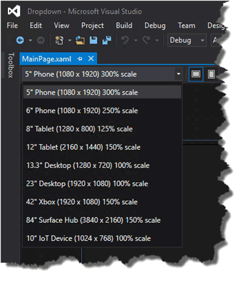

# Руководство по работе с приложениями универсальной платформы Windows (UWP)


\[ Обновлено для приложений UWP в Windows 10. Статьи о Windows 8.x см. в [архиве](http://go.microsoft.com/fwlink/p/?linkid=619132) \]

В этом руководстве вы узнаете:

-   Что такое *семейство устройств* и как определить целевое семейство.
-   О новых элементах управления и панелях пользовательского интерфейса, которые позволяют адаптировать пользовательский интерфейс под различные форм-факторы устройств.
-   Как понимать поверхность API, доступную для вашего приложения, и управлять ею.

В Windows 8 была представлена среда выполнения Windows (WinRT), которая была усовершенствованной моделью приложения для Windows. Она должна была играть роль общей архитектуры приложений.

Когда стала доступной Windows Phone 8.1, среда выполнения Windows была адаптирована под Windows Phone 8.1 и Windows. Это позволило разработчикам создавать *универсальные приложения для Windows 8* с общей базой кода, подходящие как для Windows, так и для Windows Phone.

В Windows 10 представлена универсальная платформа Windows (UWP), которая продолжает усовершенствование модели среды выполнения и перемещает эту модель в унифицированное ядро Windows 10. Будучи частью ядра, UWP теперь предоставляет общую платформу для приложений, доступную на любом устройстве под управлением Windows 10. Благодаря этому усовершенствованию приложения, разработанные для UWP, могут вызывать не только API WinRT, общие на всех устройствах, но и API (включая Win32 и API .NET), работающие исключительно на устройствах определенного семейства. UWP обеспечивает гарантированный уровень базового API на различных устройствах. Это означает, что вы можете создать один пакет приложения, который можно установить на целый ряд устройств. Кроме того, при использовании этого одного пакета приложения Магазин Windows предоставляет единый канал распределения для отображения всех типов устройств, на которых может работать приложение.


Так как ваше приложение UWP выполняется на целом ряде устройств с различными форм-факторами и модальностями ввода, вы хотите, чтобы оно было адаптировано под каждое устройство и могло разблокировать их уникальные возможности. Устройства добавляют собственные уникальные API-интерфейсы к гарантированному уровню API. При определенных условиях вы можете написать код для получения доступа к этим уникальным API, чтобы ваше приложение запускало функции, определенные только для одного типа устройств, при этом предоставляя другой интерфейс на остальных устройствах. Адаптивные элементы управления пользовательского интерфейса и новые панели макета помогут адаптировать ваш пользовательский интерфейс к целому ряду разрешений экрана.

## Семейства устройств


Приложения для Windows 8.1 и Windows Phone 8.1 предназначены для операционных систем (ОС) Windows или Windows Phone. С Windows 10 ваше приложение ориентируется не на операционную систему, а на одно или несколько семейств устройств. Семейство устройств определяет API-интерфейсы, характеристики системы и поведение, ожидаемые на устройствах внутри семейства. Оно также определяет набор устройств, на которые может быть установлено ваше приложение из магазина. Вот иерархия семейства устройств.


Семейство устройств — это набор API-интерфейсов, которые собраны вместе и имеют имя и номер версии. Семейство устройств является основой ОС. Компьютеры запускают классическую ОС, которая основывается на семействе настольных устройств. Телефоны, планшеты и т. п. запускают мобильную ОС, которая основывается на семействе мобильных устройств. И так далее.

Универсальное семейство устройств — особенное. Оно не является непосредственно основой любой ОС. Наоборот, набор API-интерфейсов в универсальном семействе устройств наследуется дочерними семействами устройств. Благодаря этому гарантируется, что API-интерфейсы универсального семейства устройств будут представлены в каждой ОС и, соответственно, на каждом устройстве.

Каждое дочернее семейство устройств добавляет в наследуемые интерфейсы собственные API-интерфейсы. Гарантируется, что получаемое объединение API-интерфейсов в дочернем семействе устройств будет представлено в ОС, основанной на этом семействе устройств, и, соответственно, на каждом устройстве под управлением этой ОС.

Одним из преимуществ семейств устройств является то, что ваше приложение может работать на любом или даже на всем множестве устройств, — от телефонов, планшетов и настольных компьютеров до устройств Surface Hub и консолей Xbox. Кроме того, ваше приложение может использовать адаптивный код для динамического обнаружения и использования функций устройства, выходящего за рамки универсального семейства устройств.

Целевое семейство устройств (или семейства) для вашего приложения выбираете вы. Этот выбор влияет на важные аспекты вашего приложения. Оно определяет:

-   Набор API-интерфейсов, которые могут присутствовать в вашем приложении во время его работы (и поэтому могут быть свободно вызваны).
-   Набор вызовов API, защищаемых только в пределах условных операторов.
-   Набор устройств, на которых может быть установлено ваше приложение из магазина (и, соответственно, форм-факторов, которые необходимо учитывать).

Существует два основных следствия выбора семейства устройств: поверхность API, которую приложение может вызвать безусловно, и количество устройств, с которыми это приложение может связаться. Эти два фактора предполагают выбор оптимального соотношения и являются обратно пропорциональными. Например приложение UWP является приложением, которое главным образом ориентировано на универсальные семейства устройств и поэтому доступно для всех устройств. Приложение, которое ориентировано на универсальное семейство устройств, может допускать наличие API-интерфейсов только из универсального семейства устройств (так как оно ориентировано на это семейство). Другие API-интерфейсы необходимо вызывать по условию. Кроме того, такое приложение должно иметь высокоадаптивный пользовательский интерфейс и широкие возможности ввода, так как оно может запускаться на самых различных устройствах. Мобильное приложение для Windows является приложением, которое главным образом ориентировано на семейство мобильных устройств и доступно для устройств под управлением ОС, основанной на семействе мобильных устройств (которое включает телефоны, планшеты и подобные устройства). Приложение семейства мобильных устройств может допускать наличие всех API-интерфейсов в семействе мобильных устройств, а его пользовательский интерфейс должен быть умеренно адаптивным. Приложение, которое ориентировано на семейство устройств IoT, может быть установлено только на устройствах IoT и может допускать наличие всех API-интерфейсов в семействе устройств IoT. Это приложение может быть узкоспециализированным по части пользовательского интерфейса и возможностей ввода, так как вы знаете, что оно будет работать только на определенном типе устройств.

Вот несколько вопросов, которые помогут вам решить, какое семейство устройств выбрать:

**Максимальное расширение охвата вашего приложения**

Чтобы ваше приложение охватило максимальное количество устройств и могло использоваться на максимально возможном количестве типов устройств, оно будет ориентировано на универсальное семейство. Это позволит приложению автоматически ориентироваться на все семейства устройств, основанные на универсальном семействе (на схеме это все дочерние элементы универсального семейства). Это означает, что приложение запускается на любой ОС, основанной на этих семействах устройств, и на всех устройствах, работающих под управлением этих операционных систем. Единственные API-интерфейсы, которые гарантировано будут доступны на всех этих устройствах, — это набор, определенный конкретной версией универсального семейства устройств, на которое вы ориентируетесь. (Начиная с этого выпуска, этой версией всегда является 10.0.x.0.) Чтобы узнать, как приложение может вызвать API-интерфейсы, выходящие за пределы установленной версии семейства устройств, ознакомьтесь с подразделом "Написание кода", представленном ниже.

**Ограничение приложения одним типом устройства**

Возможно, вы не хотите, чтобы ваше приложение работало на широком ряде устройств; скажем, оно предназначается для настольных компьютеров или консоли Xbox. В этом случае вы можете ориентировать приложение на одно из дочерних семейств устройств. Например, если вы ориентируетесь на семейство настольных устройств, для вашего приложения гарантированно будут доступны API-интерфейсы, включая унаследованные от универсального семейства устройств и специфические для семейства настольных устройств.

**Ограничение приложения подмножеством всех возможных устройств**

Вместо ориентации на универсальное семейство устройств или на одно из дочерних семейств, вы можете выбрать два (или более) дочерних семейства устройств. Для вашего приложения может быть целесообразна ориентация на настольные компьютеры и мобильные устройства. Или настольные компьютеры и Xbox. Либо настольные компьютеры, Xbox и Surface Hub.

**Исключение поддержки для определенной версии семейства устройств**

Возможно, вы хотите, чтобы в некоторых случаях ваше приложение не запускалось на конкретной версии конкретного семейства устройств. Например, ваше приложение ориентировано на универсальное семейство устройств версии 10.0.x.0. В момент, когда в будущем версия операционной системы изменится, например на 10.0.x.2, вы можете указать, что ваше приложение выполняется на всех версиях, кроме версии 10.0.x.1 для Xbox, сориентировав свое приложения на версию 10.0.x.0 для универсальных устройств и 10.0.x.1 — для Xbox. После этого ваше приложение окажется недоступным для набора версий семейства устройств в рамках Xbox 10.0.x.1 (включительно) и более ранних версий.

По умолчанию Microsoft Visual Studio определяет **Windows.Universal** как целевое семейство устройств в файле манифеста пакета приложения. Чтобы указать в Магазине семейство или семейства устройств, для которых предназначено ваше приложение, вручную настройте элемент [**TargetDeviceFamily**](https://msdn.microsoft.com/library/windows/apps/dn986903) в файле Package.appxmanifest.

## Пользовательский интерфейс и универсальный ввод


Приложение UWP может выполняться на многих типах устройств, которые имеют различные формы ввода, разрешения экрана, плотность точек на дюйм и другие уникальные характеристики. Windows 10 предоставляет новые универсальные элементы управления, панели макетов и инструменты, которые помогают адаптировать пользовательский интерфейс для устройств, на которых может запускаться приложение. Например вы можете адаптировать пользовательский интерфейс, чтобы воспользоваться преимуществами разницы в разрешении экрана при запуске приложения на настольном компьютере и на мобильном устройстве.

Некоторые аспекты пользовательского интерфейса вашего приложения будут автоматически адаптированы под все устройства. Элементы управления, например кнопки и ползунки, автоматически адаптируются под все семейства устройств и режимы ввода. Тем не менее, в зависимости от устройства, на котором будет выполняться приложение, может потребоваться адаптация дизайна интерфейса пользователя. Например в приложении для фотографий необходимо адаптировать пользовательский интерфейс под управление на маленьком наладонном устройстве, чтобы обеспечить оптимальное использование одной рукой. Если приложение для фотографий выполняется на настольном компьютере, пользовательский интерфейс должен быть адаптирован для использования преимуществ дополнительного пространства экрана.

Windows помогает ориентировать ваш пользовательский интерфейс на несколько устройств с помощью следующих функций:

-   Универсальные элементы управления и панели макета помогают оптимизировать пользовательский интерфейс для разрешения экрана устройства.
-   Обработка общего ввода позволяет получить входные данные с помощью касания, пера, мыши или клавиатуры, либо контроллера, такого как контроллер Microsoft Xbox.
-   Инструменты помогут разработать пользовательский интерфейс, который адаптируется под различные разрешения экрана.
-   Адаптивное масштабирование подстраивается под различия в разрешении и DPI на всех устройствах.

### Универсальные элементы управления и панели макета

Windows 10 включает новые элементы управления, такие как календарь и комбинированный режим. Элемент управления Pivot, который ранее был доступен только для Windows Phone, теперь также доступен для универсального семейства устройств.

Элементы управления были обновлены, чтобы обеспечить работу на экранах большего размера, собственную адаптацию, основанную на количестве доступных на устройстве пикселей экрана, и работу с несколькими типами ввода, например клавиатурой, мышью, сенсорным вводом, пером и контроллерами, например контроллером Xbox.

Возможно, вам потребуется адаптация всего макета пользовательского интерфейса в зависимости от разрешения экрана устройства, на котором будет выполняться ваше приложение. Например приложение для связи, запущенное на настольном компьютере, может включать картинку в картинке звонящего, а элементы управления хорошо подходят для ввода с помощью мыши:


Однако при запуске приложения на телефоне из-за того, что полезная площадь экрана имеет небольшой размер, ваше приложение может исключить режим "картинка в картинке" и увеличить размер кнопки вызова, чтобы облегчить работу одной рукой.


Для помощи при адаптации всего макета пользовательского интерфейса, который основывается на объеме доступного пространства экрана, Windows 10 представляет адаптивные элементы управления и состояния проектирования.

### Проектирование адаптивного пользовательского интерфейса с помощью адаптивных элементов управления

Панели макета передают размеры и положение своим дочерним элементам в зависимости от доступного пространства. Например, [**StackPanel**](https://msdn.microsoft.com/library/windows/apps/br209635) предопределяет свои дочерние элементы последовательно (горизонтально или вертикально). Класс [
              **Grid**
            ](https://msdn.microsoft.com/library/windows/apps/br242704) похож на сетку CSS, дочерние элементы которой располагаются в ячейках.

Новый класс [**RelativePanel**](https://msdn.microsoft.com/library/windows/apps/dn879546) реализует стиль макета, который определяется связями между его дочерними элементами. Он используется при создании макетов приложения, которые могут адаптироваться к изменениям разрешения экрана. **RelativePanel** упрощает процесс переупорядочения элементов за счет определения связей между ними, что позволяет строить более динамический пользовательский интерфейс без использования вложенных макетов.

В следующем примере, независимо от изменений ориентации или макета, кнопка **blueButton** появится справа от поля **textBox1**, а кнопка **orangeButton** появится сразу же ниже и будет выровнена относительно кнопки **blueButton**, даже если ширина поля **textBox1** будет изменяться по мере ввода текста в него. Раньше для достижения такого эффекта потребовались бы строки и столбцы в **Grid**, а теперь это можно сделать с помощью значительно меньшего количества разметки.


```XML
<RelativePanel>
    <TextBox x:Name="textBox1" Text="textbox" Margin="5"/>
    <Button x:Name="blueButton" Margin="5" Background="LightBlue" Content="ButtonRight" RelativePanel.RightOf="textBox1"/>
    <Button x:Name="orangeButton" Margin="5" Background="Orange" Content="ButtonBelow" RelativePanel.RightOf="textBox1" RelativePanel.Below="blueButton"/>
</RelativePanel>
```

### Использование визуального состояния триггеров для построения пользовательского интерфейса, который может адаптироваться к доступному пространству экрана

Для вашего пользовательского интерфейса может потребоваться адаптация к изменениям размера окна. Адаптивные визуальные состояния позволяют изменить визуальное состояние в ответ на изменение размера окна.

StateTriggers определяет пороговое значение, при котором активируется визуальное состояние, которое затем устанавливает свойства макета в соответствии с размером окна, вызвавшим изменение состояния.

В следующем примере, если ширина размера окна станет равна 720 пикселям или больше, инициируется визуальное состояние с именем **wideView**, которое затем размещает панель **Лучшие игры** справа от панели **Топ бесплатных игр** и выравнивает ее по верхней части этой панели.


Если ширина окна меньше 720 пикселей, инициируется визуальное состояние **narrowView**, так как триггер **wideView** не удовлетворяет требованиям и поэтому больше не действует. Визуальное состояние **narrowView** располагает панель **Лучшие игры** ниже панели **Топ платных игр** и выравнивает по левой стороне этой панели.


Вот XAML для триггеров визуальных состояний, описанных выше. Для краткости определение элементов управления, упоминаемых при помощи "`...`" ниже, было удалено.

```XML
<Grid Background="{ThemeResource ApplicationPageBackgroundThemeBrush}">
    <VisualStateManager.VisualStateGroups>
        <VisualStateGroup>
            <VisualState x:Name="wideView">
                <VisualState.StateTriggers>
                    <AdaptiveTrigger MinWindowWidth="720" />
                </VisualState.StateTriggers>
                <VisualState.Setters>
                    <Setter Target="best.(RelativePanel.RightOf)" Value="free"/>
                    <Setter Target="best.(RelativePanel.AlignTopWidth)" Value="free"/>
                </VisualState.Setters>
            </VisualState>
            <VisualState x:Name="narrowView">
                <VisualState.Setters>
                    <Setter Target="best.(RelativePanel.Below)" Value="paid"/>
                    <Setter Target="best.(RelativePanel.AlignLeftWithPanel)" Value="true"/>
                </VisualState.Setters>
                <VisualState.StateTriggers>
                    <AdaptiveTrigger MinWindowWidth="0" />
                </VisualState.StateTriggers>
            </VisualState>
        </VisualStateGroup>
    </VisualStateManager.VisualStateGroups>
    ...
</Grid>
```

### Инструменты

По умолчанию вы, вероятно, захотите охватить наиболее широкое семейство устройств. Когда вы будете готовы увидеть, как выглядит и располагается ваше приложение на конкретном устройстве, используйте панель инструментов для предварительного просмотра устройства в Visual Studio, чтобы просмотреть свой пользовательский интерфейс на маленьком или среднем мобильном устройстве, на компьютере или большом ТВ-экране. Таким образом вы сможете настроить и проверить адаптивные визуальные состояния:



Не следует заранее задавать тип каждого устройства, которое вы будете поддерживать. Вы можете добавить дополнительный размер устройства в свой проект позже.

### Адаптивное масштабирование

Windows 10 вводит развитие существующей модели масштабирования. В дополнение к содержимому вектора масштабирования существует единый набор коэффициентов масштабирования, который обеспечивает согласованный размер для элементов пользовательского интерфейса по различным размерам экрана и разрешениям дисплея. Кроме того, коэффициенты масштабирования совместимы с коэффициентами масштабирования других операционных систем, таких как iOS и Android. Это облегчает совместное использование ресурсов между этими платформами.

Магазин выбирает ресурсы для загрузки на основе части DPI устройства. Загружаются только те ресурсы, которые лучше всего подходят под устройство.

### Обработка общего ввода

Вы можете создать универсальное приложение для Windows с помощью универсальных элементов управления, которые обрабатывают различные методы ввода, такие как мышь, клавиатура, сенсорный ввод, перо, а также контроллер (например, контроллер Xbox). Обычно рукописный ввод связан только с вводом с помощью пера, но в Windows 10 на некоторых устройствах доступен рукописный ввод касанием и с помощью любого указателя. Рукописный ввод поддерживается на множестве устройств (включая мобильные устройств) и может быть с легкостью встроен с помощью нескольких строчек кода.

Следующие API-интерфейсы предоставляют доступ на ввод:

-   [
              **CoreIndependentInputSource**
            ](https://msdn.microsoft.com/library/windows/apps/dn298460) — новый API-интерфейс, позволяющий использовать необработанные входные данные в основном или фоновом потоке.
-   [
              **PointerPoint**
            ](https://msdn.microsoft.com/library/windows/apps/br242038) унифицирует необработанные входные данные от касаний, мыши и пера в единый и последовательный набор интерфейсов и событий, который может быть использован в основном или фоновом потоке с помощью **CoreInput.**
-   [
              **PointerDevice**
            ](https://msdn.microsoft.com/library/windows/apps/br225633) — API-интерфейс устройства, который поддерживает запросы возможностей устройств, чтобы вы могли определить модальности ввода, доступные на данном устройстве.
-   Новый элемент управления XAML [**InkCanvas**](https://msdn.microsoft.com/library/windows/apps/dn858535) и API-интерфейсы среды выполнения Windows [**InkPresenter**](https://msdn.microsoft.com/library/windows/apps/dn922011) позволяют получить доступ к данным движения пера.

## Написание кода


Варианты языка программирования для вашего [проекта Windows 10 в Visual Studio](https://msdn.microsoft.com/en-us/library/windows/apps/dn609832.aspx#target_win10) : Visual C++, C#, Visual Basic и JavaScript. В Visual C++, C# и Visual Basic можно использовать XAML для высококачественного и естественного взаимодействия с пользовательским интерфейсом. В Visual C++ вы можете выбрать рисование с помощью DirectX вместо использования XAML или вместе с ним. В JavaScript вашим уровнем представления данных будет HTML, а HTML является кроссплатформенным веб-стандартом. Большая часть кода и пользовательского интерфейса будут универсальными и будут работать одинаково на любых устройствах. Но для кода, написанного для конкретных семейств устройств, и пользовательского интерфейса, разработанного для определенных форм-факторов, вам будет предложено использовать адаптивный код и адаптивный пользовательский интерфейс. Рассмотрим эти случаи.

**Вызов API-интерфейса, реализованного целевым семейством устройств**

При вызове API необходимо знать, реализован ли API-интерфейс тем семейством устройств, на которое ориентировано ваше приложение. Если есть сомнения, вы можете проверить это в справочной документации API-интерфейса. Если вы откроете соответствующий раздел и просмотрите раздел "Требования", вы увидите какое семейство устройств его реализует. Допустим, ваше приложение ориентировано на универсальное семейство устройств версии 10.0.x.0, и вы хотите вызвать членов класса [**Windows.UI.Core.SystemNavigationManager**](https://msdn.microsoft.com/library/windows/apps/dn893595). В этом примере семейством устройств является "Universal". Рекомендуется в дальнейшем подтвердить, что вызываемые члены класса также являются целевыми объектами, а в этом случае они ими являются. Итак, теперь из этого примера вы знаете, что API-интерфейсы гарантированно присутствуют на каждом устройстве, на котором установлено ваше приложение, и вы можете вызывать API-интерфейсы в коде обычным образом.

```csharp
    Windows.UI.Core.SystemNavigationManager.GetForCurrentView().BackRequested += TestView_BackRequested;
```

В качестве другого примера представьте, что ваше приложение ориентировано на семейство устройств Xbox версии 10.0.x.0, а справочный раздел API-интерфейса, который вы хотите вызвать, говорит, что он был создан в семействе устройств Xbox версии 10.0.x.0. В этом случае API-интерфейс снова будет гарантированно присутствовать на каждом устройстве, на котором было установлено ваше приложение. Поэтому вы можете вызывать этот API-интерфейс в коде обычным способом.

Обратите внимание, что технология IntelliSense в Visual Studio не распознает API-интерфейсы, если они не реализуются с помощью целевого семейства устройств или любого пакета расширений SDK, на которые вы ссылались. Следовательно, если вы не ссылались на какие-либо пакеты расширений SDK, вы можете быть уверены, что все API-интерфейсы, которые отображаются в IntelliSense, должны находиться в вашем целевом семействе устройств, и вы можете вызывать их свободно.

**Вызов API-интерфейса, НЕ реализованного целевым семейством устройств**

Сюда относятся случаи, когда вы хотите вызвать API-интерфейс, но ваше целевое семейство устройств не указано в документации. В этом случае для вас может оказаться предпочтительным написание адаптивного кода для вызова этого API-интерфейса.

**Написание адаптивного кода с помощью класса ApiInformation**

Создание адаптивного кода делится на два шага. Первый шаг — сделать API-интерфейс, к которому вы хотите обратиться, доступным для вашего проекта. Для этого добавьте ссылку на пакет расширения SDK, который представляет семейство устройств, содержащее API-интерфейсы, к которым вы хотите применить условный вызов. Обратитесь к разделу [Пакеты расширений SDK](../porting/w8x-to-uwp-porting-to-a-uwp-project.md#extension-sdks).

Второй шаг — использовать класс [**Windows.Foundation.Metadata.ApiInformation**](https://msdn.microsoft.com/library/windows/apps/dn949001) в своем коде в условном выражении, чтобы проверить наличие API-интерфейса, который вы хотите вызвать. Это условие оценивается при каждом запуске приложения, но оно будет истинным только на устройствах, где этот API-интерфейс присутствует и, следовательно, доступен.

Если вы хотите вызвать небольшое количество API-интерфейсов, следует использовать метод [**ApiInformation.IsTypePresent**](https://msdn.microsoft.com/library/windows/apps/dn949016) типа следующего:

```csharp
    // Note: Cache the value instead of querying it more than once.
    bool isHardwareButtonsAPIPresent =
        Windows.Foundation.Metadata.ApiInformation.IsTypePresent("Windows.Phone.UI.Input.HardwareButtons");

    if (isHardwareButtonsAPIPresent)
    {
        Windows.Phone.UI.Input.HardwareButtons.CameraPressed +=
            HardwareButtons_CameraPressed;
    }
```

В этом случае мы можем быть уверены, что присутствие класса [**HardwareButtons**](https://msdn.microsoft.com/library/windows/apps/jj207557) подразумевает наличие события [**CameraPressed**](https://msdn.microsoft.com/library/windows/apps/dn653805), так как этот класс и этот член имеют одинаковую информацию о требованиях. Однако со временем к уже введенным классам будут добавлены новые члены, и эти члены будут иметь более поздние номера версий в "introduced in" (введено в). В этом случае вместо использования метода **IsTypePresent** вы можете проверить наличие отдельных членов с помощью **IsEventPresent**, **IsMethodPresent**, **IsPropertyPresent** и похожих методов. Рассмотрим пример.

```csharp
    bool isHardwareButtons_CameraPressedAPIPresent =
        Windows.Foundation.Metadata.ApiInformation.IsEventPresent
            ("Windows.Phone.UI.Input.HardwareButtons", "CameraPressed");
```

Набор API-интерфейсов в семействе устройств далее разбивается на промежуточные деления, известные как контракты API. Вы можете использовать метод **ApiInformation.IsApiContractPresent**, чтобы проверить наличие контракта API. Это полезно, если вы хотите протестировать наличие большого количества API-интерфейсов, которые существуют в той же версии контракта API.

```csharp
    bool isWindows_Devices_Scanners_ScannerDeviceContract_1_0Present =
        Windows.Foundation.Metadata.ApiInformation.IsApiContractPresent
            ("Windows.Devices.Scanners.ScannerDeviceContract", 1, 0);
```

**API Win32 в UWP**

Приложение UWP или компонент среды выполнения Windows, написанные на C++/CX, имеют доступ к API-интерфейсам Win32, которые являются частью UWP. Эти API-интерфейсы Win32 реализуются всеми семействами устройств с Windows 10. Свяжите свое приложения с Windowsapp.lib. Windowsapp.lib — это библиотека "umbrella", которая обеспечивает экспорт API-интерфейсов UWP. Ссылки на Windowsapp.lib будут добавлены к зависимостям вашего приложения в библиотеках DLL, которые присутствуют на всех семействах устройств с Windows 10.

Полный список API-интерфейсов Win32, доступных на приложениях UWP, можно найти в разделах [Наборы API-интерфейсов для приложений UWP](https://msdn.microsoft.com/library/windows/desktop/mt186421) и [Библиотеки DLL для приложений UWP](https://msdn.microsoft.com/library/windows/desktop/mt186422).

## Взаимодействие с пользователем


Универсальное приложение для Windows позволяет вам воспользоваться уникальными возможностями устройства, на котором оно работает. Ваше приложение может использовать всю силу настольного устройства, естественное взаимодействие непосредственной работы на планшете (включая сенсорный ввод и ввод с помощью пера), переносимость и удобство мобильных устройств и объединенную мощь [Surface Hub.](http://go.microsoft.com/fwlink/?LinkId=526365)

Хорошее [проектирование](http://go.microsoft.com/fwlink/?LinkId=258848) — процесс определения взаимодействия пользователей и приложения, а также внешнего вида и функций. Взаимодействие с пользователем играет огромную роль в удовлетворенности людей при использовании вашего приложения, поэтому тщательно проработайте этот шаг. В разделе [Основы дизайна](https://dev.windows.com/en-us/design) вы познакомитесь с оформлением универсального приложения для Windows. В разделе [Знакомство с приложениями универсальной платформы Windows (UWP) для дизайнеров](https://msdn.microsoft.com/library/windows/apps/dn958439) вы узнаете о создании приложений для Windows, которые понравятся вашим пользователям. Прежде чем приступить к написанию кода, ознакомьтесь с [азбукой устройств](../input-and-devices/device-primer.md), которая поможет определить интерфейс взаимодействия вашего приложения на всех форм-факторах, на которые вы ориентируетесь.


В дополнение к взаимодействию на различных устройствах, [создайте план приложения](https://msdn.microsoft.com/library/windows/apps/hh465427), чтобы воспользоваться преимуществами работы на нескольких устройствах. Например:

-   Используйте [облачные службы](http://go.microsoft.com/fwlink/?LinkId=526377), чтобы выполнять синхронизацию между устройствами. Узнайте, как [подключиться к веб-службам](https://msdn.microsoft.com/library/windows/apps/xaml/hh761504) для поддержки взаимодействия с вашим приложением.

-   Подумайте, как можно обеспечить поддержку пользователей, которые переходят c одного устройства на другое, как подхватывать элементы, на которых они остановились. Включите в свое планирование [уведомления](https://msdn.microsoft.com/library/windows/apps/mt187203) и [покупки из приложений](https://msdn.microsoft.com/library/windows/apps/mt219684). Эти функции должны работать на всех устройствах.

-   Спроектируйте рабочий процесс с помощью раздела [Основы проектирования навигации для приложений UWP](https://msdn.microsoft.com/library/windows/apps/dn958438), чтобы адаптировать мобильные устройства и устройства с маленьким и большим экранами. [Разработайте свой пользовательский интерфейс](https://msdn.microsoft.com/library/windows/apps/dn958435) для различных размеров и разрешений экрана.

-   Подумайте, есть ли в вашем приложении функции, не имеющие смысла на небольшом экране мобильного устройства. Возможно также есть области, не имеющие смысла на стационарном настольном компьютере, и требующиеся для работы мобильного устройства. Например, большинство сценариев, использующих [расположение](https://msdn.microsoft.com/library/windows/apps/mt219698), предполагают мобильное устройство.

-   Решите, каким образом вы разместите несколько модальностей ввода. Ознакомьтесь с [Руководством по взаимодействию](https://msdn.microsoft.com/library/windows/apps/dn611861), чтобы узнать, как пользователи могут взаимодействовать с вашим приложением с помощью [Кортаны](https://msdn.microsoft.com/library/windows/apps/dn974233), [голосовых функций](https://msdn.microsoft.com/library/windows/apps/dn596121), [распознавания сенсорного ввода](https://msdn.microsoft.com/library/windows/apps/hh465370), [сенсорной клавиатуры](https://msdn.microsoft.com/library/windows/apps/hh972345) и других возможностей.

    Ознакомьтесь с [Руководством по тексту и текстовому вводу](https://msdn.microsoft.com/library/windows/apps/dn611864), чтобы узнать больше о традиционных способах взаимодействия.

## Отправка универсального приложения для Windows с помощью информационной панели


Новая унифицированная информационная панель в Центре разработки для Windows позволяет централизованно управлять всеми приложениями и отправлять все ваши приложения для устройств Windows. Новые функциональные возможности упрощают процессы, обеспечивая больший контроль с вашей стороны. Вы также найдете здесь подробные [аналитические отчеты](https://msdn.microsoft.com/library/windows/apps/mt148522) вместе с [сведениями о выплатах](https://msdn.microsoft.com/library/windows/apps/dn986925), способами [продвижения вашего приложения среди пользователей](https://msdn.microsoft.com/library/windows/apps/mt148526) и многие другие сведения.

См. раздел [Использование единой информационной панели центра разработки для Windows](../publish/using-the-windows-dev-center-dashboard.md), чтобы узнать о том, как отправлять приложения в магазин Windows для публикации.

 

 


<!--HONumber=Jun16_HO5-->


