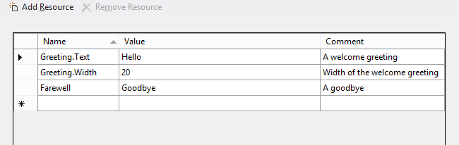

# Размещение строк пользовательского интерфейса в ресурсах


\[ Обновлено для приложений UWP в Windows 10. Статьи о Windows 8.x см. в [архиве](http://go.microsoft.com/fwlink/p/?linkid=619132) \]


**Важные API**

-   [**ApplicationModel.Resources.ResourceLoader**](https://msdn.microsoft.com/library/windows/apps/br206014)
-   [**WinJS.Resources.processAll**](https://msdn.microsoft.com/library/windows/apps/br211864)

Добавьте строковые ресурсы для своего пользовательского интерфейса в файлы ресурсов. После этого вы сможете ссылаться на эти строки из кода или разметки.

В этом разделе описаны действия, которые позволяют добавлять строковые ресурсы на нескольких языках в универсальные приложения для Windows и быстро их тестировать.

## <span id="put_strings_into_resource_files__instead_of_putting_them_directly_in_code_or_markup."></span><span id="PUT_STRINGS_INTO_RESOURCE_FILES__INSTEAD_OF_PUTTING_THEM_DIRECTLY_IN_CODE_OR_MARKUP."></span>Размещайте строки в файлах ресурсов, а не в коде или разметке.


1.  Откройте свое приложение (или создайте новое) в Visual Studio.

2.  Откройте файл package.appxmanifest в Visual Studio, перейдите на вкладку **Приложение** и установите en-US (английский, США) языком по умолчанию для данного примера. Если в вашем приложении имеется несколько файлов package.appxmanifest, выполните эти действия для каждого из них.
    <br>**Примечание.**  Это позволит задать язык проекта по умолчанию. Ресурсы языка по умолчанию используются, если предпочитаемый язык пользователя или языки интерфейса не соответствуют языковым ресурсам, представленным в приложении.
3.  Создайте папку для размещения файлов ресурсов.
    1.  В обозревателе решений щелкните правой кнопкой мыши на проекте («Общий проект», если ваше приложение включает несколько проектов) и выберите **Добавить** &gt; **Новая папка**.
    2.  Назовите новую папку Strings (Строки).
    3.  Если новая папка не отображается в обозревателе решений, выберите **Проект** &gt; **Показать все файлы** из меню Microsoft Visual Studio (проект должен быть выбран).

4.  Создайте вложенную папку и файл ресурсов для английского языка (США).
    1.  Щелкните правой кнопкой мыши на папке Strings (Строки) и создайте в ней новую папку. Присвойте ей имя en-US. Файл ресурсов необходимо поместить в папку, которая названа в соответствии со спецификацией языковых тегов [BCP-47](http://go.microsoft.com/fwlink/p/?linkid=227302). Дополнительные сведения о различных языковых квалификаторах и список распространенных языковых тегов приводятся в разделе [Именование ресурсов с помощью квалификаторов](https://msdn.microsoft.com/library/windows/apps/xaml/hh965324).
    2.  Щелкните правой кнопкой мыши на папке en-US и выберите команду **Добавить** &gt; **Новый элемент…**.
    3.  **XAML:** выберите «Файл ресурсов (.resw)».
        <br>**HTML:** выберите «Файл ресурсов (.resjson)».

    4.  Нажмите кнопку **Добавить**. Будет добавлен файл ресурсов с именем Resources.resw (в случае **XAML**) или resources.rejson (в случае **HTML**). Рекомендуется использовать имя файла по умолчанию. Приложение может разделить свои ресурсы и разместить их в других файлах, но вам следует специально позаботиться о том, чтобы ссылки на них были правильными (см. раздел [Загрузка строковых ресурсов](https://msdn.microsoft.com/library/windows/apps/xaml/hh965323)).
    5.  **Только XAML:** если от предыдущих проектов .NET остались RESX-файлы, содержащие только строковые ресурсы, выберите команду **Добавить** &gt; **Существующий элемент…**, добавьте RESX-файл и измените его расширение на RESW.
    6.  Откройте файл и с помощью редактора добавьте следующие ресурсы.

        **XAML**

        Strings/en-US/Resources.resw
        
        В этом примере Greeting.Text и Farewell обозначают отображаемые строки. Greeting.Width обозначает свойство Width строки Greeting. В комментариях удобно размещать специальные указания для переводчиков, которые локализуют строки на другие языки.

        **HTML**

        Новый файл включает содержимое по умолчанию. Замените его следующим содержимым (оно может мало отличаться от содержимого по умолчанию).

        Strings/en-US/resources.resjson

        ```        json
        {
                "greeting"              : "Hello",
                "_greeting.comment"     : "A welcome greeting",

                "farewell"              : "Goodbye",
                "_farewell.comment"     : "A goodbye"
        }
        ```

        Это строгий синтаксис нотации объектов JavaScript (JSON), в котором необходимо обязательно ставить запятую после каждой пары «имя — значение» за исключением последней. В этом примере greeting и farewell идентифицируют строки, которые должны отображаться. Остальные пары (\_greeting.comment и \_farewell.comment) — это комментарии, которые описывают строки. В комментариях удобно размещать специальные указания для переводчиков, которые локализуют строки на другие языки.

## <span id="associate_controls_to_resources."></span><span id="ASSOCIATE_CONTROLS_TO_RESOURCES."></span>Свяжите элементы управления с ресурсами.


**Только XAML**

Каждый элемент управления, для которого необходим локализованный текст, нужно сопоставить с RESW-файлом. Для этого используйте атрибут **x:Uid** в элементах XAML следующим образом.

```XAML
<TextBlock x:Uid="Greeting" Text="" />
```

Для имени ресурса нужно присвоить значение атрибута **Uid** и указать свойство для получения переведенной строки (в нашем случае — свойство Text). Для других языков можно указать другие свойства или значения, например Greeting.Width, но с такими свойствами, связанными с макетом, следует быть осторожнее. Нужно стремиться к динамическому расположению элементов управления на экране устройства.

Обратите внимание, что присоединенные свойства, такие как AutomationPeer.Name, по-разному обрабатываются в файлах .resw. Необходимо явно прописать пространство имен следующим образом.

```XAML
MediumButton.[using:Windows.UI.Xaml.Automation]AutomationProperties.Name</code></pre></td>
```

## <span id="add_string_resource_identifiers_to_code_and_markup."></span><span id="ADD_STRING_RESOURCE_IDENTIFIERS_TO_CODE_AND_MARKUP."></span>Добавьте идентификаторы строковых ресурсов в код и разметку.


**XAML**

В коде можно ссылаться на строки динамически.

**C#**
```CSharp
var loader = new Windows.ApplicationModel.Resources.ResourceLoader();
var str = loader.GetString("Farewell");
```

**C++**
```ManagedCPlusPlus
auto loader = ref new Windows::ApplicationModel::Resources::ResourceLoader();
auto str = loader->GetString("Farewell");
```

**HTML**

1.  Добавьте ссылки на библиотеку Windows для JavaScript в HTML-файл, если вы этого еще не сделали.

    **Примечание.**  В следующем примере показан HTML-код файла default.html проекта Windows, генерируемого при создании нового JavaScript-проекта **Пустое приложение (универсальное приложение Windows)** в Visual Studio. Обратите внимание, что файл уже содержит ссылки на WinJS.

    ```    HTML
    <!-- WinJS references -->
    <link href="WinJS/css/ui-dark.css" rel="stylesheet" />
    <script src="WinJS/js/base.js"></script>
    <script src="WinJS/js/ui.js"></script>
    ```

2.  В связанном с HTML-файлом коде JavaScript добавьте вызов функции [**WinJS.Resources.processAll**](https://msdn.microsoft.com/library/windows/apps/br211864) при загрузке этого файла.

    ```    JavaScript
    WinJS.Application.onloaded = function(){
        WinJS.Resources.processAll();
    }
    ```
    
    Если в объект [**WinJS.UI.Pages.PageControl**](https://msdn.microsoft.com/library/windows/apps/jj126158) загружается дополнительный HTML-файл, вызовите [**WinJS.Resources.processAll**](https://msdn.microsoft.com/library/windows/apps/br211864)(*элемент*) в методе [**IPageControlMembers.ready**](https://msdn.microsoft.com/library/windows/apps/hh770590) элемента управления страницей, где *элемент* — загружаемый элемент HTML (и его дочерние элементы). Этот пример основан на сценарии 6 в разделе [Ресурсы приложения и пример локализации](http://go.microsoft.com/fwlink/p/?linkid=227301):

    ```    JavaScript
    var output;
    
    var page = WinJS.UI.Pages.define("/html/scenario6.html", {
        ready: function (element, options) {
            output = element.querySelector('#output');
            WinJS.Resources.processAll(output); // Refetch string resources
            WinJS.Resources.addEventListener("contextchanged", refresh, false);
        }
        unload: function () { 
            WinJS.Resources.removeEventListener("contextchanged", refresh, false); 
        } 
    });
    ```

3.  С помощью идентификаторов (greeting и farewell) из файлов ресурсов добавьте в HTML-файл ссылки на строковые ресурсы.
    ```    HTML
    <h2><span data-win-res="{textContent: 'greeting';}"></span></h2>
    <h2><span data-win-res="{textContent: 'farewell'}"></span></h2>
    ```

4.  Добавьте ссылки на строковые ресурсы для получения атрибутов.

    ```    HTML
    <div data-win-res="{attributes: {'aria-label'; : 'String1'}}" >
    ```

    Общий шаблон атрибута data-win-res для замены HTML: data-win-res="{*propertyname1*: '*resource ID*', *propertyname2*: '*resource ID2*'}".

    **Примечание.**  Если строка не содержит разметки, привяжите ресурс к свойству textContent вместо innerHTML где это возможно. Свойство textContent можно заменить гораздо быстрее, чем innerHTML.

5.  Добавьте ссылки на строковые ресурсы в JavaScript.
    <span codelanguage="JavaScript"></span>
    ```    JavaScript
    var el = element.querySelector('#header');
    var res = WinJS.Resources.getString('greeting');
    el.textContent = res.value;
    el.setAttribute('lang', res.lang);
    ```

## <span id="add_folders_and_resource_files_for_two_additional_languages."></span><span id="ADD_FOLDERS_AND_RESOURCE_FILES_FOR_TWO_ADDITIONAL_LANGUAGES."></span>Добавьте папки и файлы ресурсов для дополнительных языков.


1.  Добавьте в папку Strings (Строки) еще одну папку для немецкого языка. Присвойте папке имя de-DE для языка «немецкий (Германия)».
2.  Создайте еще один файл ресурсов в папке de-DE и добавьте следующее.

    **XAML**

    strings/de-DE/Resources.resw

    

    **HTML**

    strings/de-DE/resources.resjson

    ```    json
    {
        "greeting"              : "Hallo",
        "_greeting.comment"     : "A welcome greeting.",

        "farewell"              : "Auf Wiedersehen",
        "_farewell.comment"     : "A goodbye."
    }
    ```

3.  Создайте еще одну папку с именем fr-FR для языка «французский (Франция)». Создайте новый файл ресурсов и добавьте следующее.

    **XAML**

    strings/fr-FR/Resources.resw
    
    **HTML:**

    strings/fr-FR/resources.resjson

    ```    json
    {
        "greeting"              : "Bonjour",
        "_greeting.comment"     : "A welcome greeting.",

        "farewell"              : "Au revoir",
        "_farewell.comment"     : "A goodbye."
    }
    ```

## <span id="build_and_run_the_app."></span><span id="BUILD_AND_RUN_THE_APP."></span>Сборка и запуск приложения


Протестируйте приложение для языка интерфейса по умолчанию.

1.  Чтобы выполнить сборку и запустить приложение, нажмите клавишу F5.
2.  Обратите внимание, что приветствие и прощание отображаются на выбранном пользователем языке.
3.  Закройте приложение.

Протестируйте приложение для других языков.

1.  Откройте **Параметры** на своем устройстве.
2.  Выберите **Время и язык**.
3.  Выберите **Язык и региональные стандарты** (**Язык** на телефоне или эмуляторе телефона).
4.  Обратите внимание, что язык, который отображался при запуске приложения (т. е. английский, немецкий или французский), является первым языком в списке. Если первый язык в списке не является ни одним из этих трех, приложение переходит к следующему языку, который оно поддерживает.
5.  Если на вашем компьютере отсутствует какой-либо из этих трех языков, добавьте отсутствующий язык в список с помощью команды **Добавить язык**.
6.  Чтобы протестировать использование другого языка в приложении, выберите язык в списке и нажмите **По умолчанию**. На телефоне или эмуляторе телефона нажмите и удерживайте язык в списке, а затем коснитесь **Переместить вверх**, чтобы переместить его в верх списка. После этого запустите приложение.

## <span id="related_topics"></span>Связанные разделы


* [Как присваивать имена ресурсам с помощью квалификаторов](https://msdn.microsoft.com/library/windows/apps/xaml/hh965324)
* [Загрузка строковых ресурсов](https://msdn.microsoft.com/library/windows/apps/xaml/hh965323)
* [Тег языка по стандарту BCP-47](http://go.microsoft.com/fwlink/p/?linkid=227302)
 

 


<!--HONumber=Mar16_HO1-->


