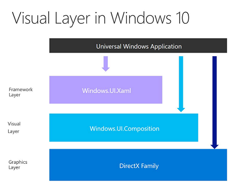

# Визуальный уровень

\[ Обновлено для приложений UWP в Windows10. Статьи о Windows8.x см. в [архиве](http://go.microsoft.com/fwlink/p/?linkid=619132) \]

В Windows 10 была проведена значительная работа по созданию нового единого компоновщика и модуля отрисовки для всех Windows-приложений, как классических, так и мобильных. Результатом этой работы стало создание единого API композиции WinRT под названием Windows.UI.Composition, который предоставляет доступ к новым облегченным объектам композиции, а также к новым видам анимации и эффектов, управляемым с помощью компоновщика.

Windows.UI.Composition — это декларативный API [абстрактного режима](https://msdn.microsoft.com/library/windows/desktop/ff684178.aspx), к которому можно обращаться из любого приложения универсальной платформы Windows (UWP) и создавать объекты композиции, анимацию и эффекты прямо в приложении. Данный API является мощным дополнением к существующим платформам (например, XAML) и предоставляет разработчикам приложений UWP знакомую поверхность C#, которую они могут добавлять в свои приложения. Эти API также можно использовать для создания приложений в стиле DX без использования платформы.

Разработчик XAML может спуститься на уровень композиции в C# и с помощью WinRT выполнить здесь необходимые действия, а не переходить на уровень графики и использовать DirectX и C++ для выполнения необходимых действий с пользовательским интерфейсом. Этот метод может быть использован для анимирования существующего элемента с помощью API композиции или дополнения пользовательского интерфейса путем создания «визуального острова» содержимого Windows.UI.Composition в дереве элементов XAML.

## Объекты композиции и компоновщик

Объекты композиции создаются с помощью компоновщика [**Compositor**](https://msdn.microsoft.com/library/windows/apps/Dn706789), который служит фабрикой для объектов композиции. Компоновщик может создавать объекты класса [**Visual**](https://msdn.microsoft.com/library/windows/apps/Dn706858), которые позволяют создавать визуальную древовидную структуру, которую используют и на которую опираются остальные функции и объекты композиции в API.

Этот API позволяет разработчикам определить и создать один или несколько объектов класса [**Visual**](https://msdn.microsoft.com/library/windows/apps/Dn706858), каждый из которых представляет отдельный узел визуального дерева.

Объекты класса Visual могут являться контейнерами для других визуальных объектов или содержать визуальные объекты с содержимым. Этот API легко использовать, так как он предоставляет понятный иерархический набор объектов класса [**Visual**](https://msdn.microsoft.com/library/windows/apps/Dn706858) для определенных задач.

-   
              [
              **Visual**](https://msdn.microsoft.com/library/windows/apps/Dn706858) — базовый объект. Обладает большей частью свойств, которые наследуются другими объектами класса Visual.
-   
              [
              **ContainerVisual**](https://msdn.microsoft.com/library/windows/apps/Dn706810) является потомком объекта класса [**Visual**](https://msdn.microsoft.com/library/windows/apps/Dn706858) и позволяет добавлять дочерние визуальные объекты.
-   
              [
              **SpriteVisual**](https://msdn.microsoft.com/library/windows/apps/Mt589433) является потомком объекта класса [**ContainerVisual**](https://msdn.microsoft.com/library/windows/apps/Dn706810) и включает содержимое в виде изображений, эффектов и цепочек переключений.
-   
              [
              **Compositor**](https://msdn.microsoft.com/library/windows/apps/Dn706789) — фабрика объектов, которая управляет взаимодействием между приложением и процессом компоновщика системы.

Компоновщик также является фабрикой для ряда других объектов композиции, используемых для обрезки или преобразования визуальных объектов дерева, а также богатого набора анимаций и эффектов.

## Система эффектов

Интерфейс Windows.UI.Composition поддерживает эффекты в реальном времени, которые можно анимировать, настраивать и соединять. Есть следующие эффекты: двумерное аффинное преобразование, арифметическое сложение, смешивание, источник цвета, объединение, изменение контрастности, экспозиция, преобразование в оттенки серого, гамма-преобразование, поворот цветового круга, инверсия, изменение насыщенности, сепия, изменение цветовой температуры, изменение тона.

Дополнительные сведения см. в обзоре [эффектов композиции](composition-effects.md).

## Система анимации

Интерфейс Windows.UI.Composition содержит эффективную систему анимации без привязки к конкретной платформе, которая позволяет задавать два типа анимации: анимацию по ключевым кадрам и анимацию на основе выражений. Они используются для перемещения визуальных объектов, применения преобразования или обрезки или анимации эффектов. При выполнении непосредственно в процессе компоновщика они обеспечивают плавность и масштабируемость, позволяя выполнять большое количество независимых процессов анимации одновременно.

Дополнительную информацию см. в обзорном материале [Анимации композиции](composition-animation.md).

## Взаимодействие с XAML

Помимо создания визуального дерева с нуля, API композиции может взаимодействовать с существующим пользовательским интерфейсом XAML с помощью класса [**ElementCompositionPreview**](https://msdn.microsoft.com/library/windows/apps/Mt608976) в [**Windows.UI.Xaml.Hosting**](https://msdn.microsoft.com/library/windows/apps/Hh701908).

- 
              [
              **ElementCompositionPreview.GetElementVisual()**](https://msdn.microsoft.com/library/windows/apps/windows.ui.xaml.hosting.elementcompositionpreview.getelementvisual): получение резервного визуального элемента для анимирования с помощью API композиции.
- 
              [
              **ElementCompositionPreview.SetChildVisual()**](https://msdn.microsoft.com/library/windows/apps/windows.ui.xaml.hosting.elementcompositionpreview.setelementchildvisual): добавление «визуального острова» содержимого композиции в дерево XAML.
- 
              [
              **ElementCompositionPreview.GetScrollViewerManipulationPropertySet()**](https://msdn.microsoft.com/library/windows/apps/mt608980.aspx): используйте манипуляцию [**ScrollViewer**](https://msdn.microsoft.com/library/windows/apps/windows.ui.xaml.controls.scrollviewer.aspx) в качестве входных данных для анимации композиции.

**Примечание**  
Эта статья адресована разработчикам приложений для Windows10 на базе универсальной платформы Windows (UWP). При разработке приложений для Windows 8.x или Windows Phone 8.x см. раздел [архивной документации](http://go.microsoft.com/fwlink/p/?linkid=619132).

 

## Дополнительные ресурсы:

-   Ознакомьтесь со статьей Кенни Керра (Kenny Kerr) на MSDN, которая посвящена этому API: [Graphics and Animation — Windows Composition Turns 10](https://msdn.microsoft.com/magazine/mt590968) (Графика и анимация — композиция в Windows 10)
-   Расширенные примеры пользовательского интерфейса и композиции в [WindowsUIDevLabs GitHub](https://github.com/microsoft/windowsuidevlabs).
-   
              [
              **Полная справочная документация для API**](https://msdn.microsoft.com/library/windows/apps/Dn706878).
-   Известные проблемы: [Известные проблемы](https://social.msdn.microsoft.com/Forums/en-US/home?forum=Win10SDKToolsIssues).

 

 

<!--HONumber=Jul16_HO2-->

