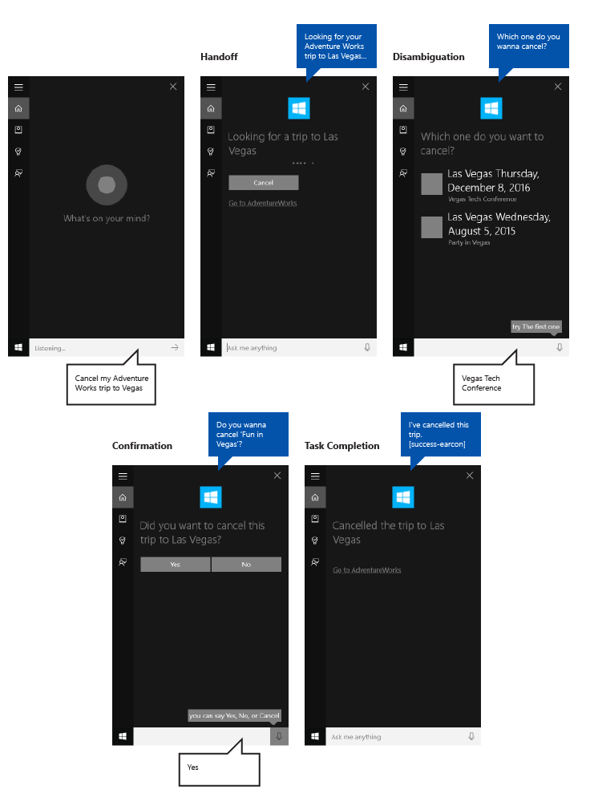

# Рекомендации по проектированию для Кортаны

В этих инструкциях и рекомендациях описано, как ваше приложение может наилучшим образом использовать **Кортану**, чтобы взаимодействовать с пользователем, помогать ему выполнять задачи и давать четкие пояснения.

**Cortana** позволяет приложениям, работающим в фоновом режиме, запрашивать у пользователя подтверждение или уточнение и в ответ предоставлять ему отзыв о состоянии голосовой команды. Это легкий и быстрый процесс, который не вынуждает пользователя выходить из **Кортаны** или переключать контекст на приложение.

В то время как пользователь должен чувствовать, что **Кортана** помогает сделать процесс как можно легче и проще, вы, возможно, захотите, чтобы **Кортана** также явно указывала, что это ваше приложение выполняет задачу.

На примере приложения для планирования поездок под названием **Adventure Works**, интегрированного в пользовательский интерфейс **Кортана**, здесь демонстрируются многие концепции и функции из тех, которые мы обсуждаем.

## Разговорное письмо

Для успешного взаимодействия с **Кортаной** необходимо следовать некоторым базовым принципам при создании строк преобразования текста в речь (TTS) и строк графического пользовательского интерфейса.

<table>
<colgroup>
<col width="33%" />
<col width="33%" />
<col width="33%" />
</colgroup>
<thead>
<tr class="header">
<th align="left">Принцип</th>
<th align="left">Пример неправильного поведения приложения</th>
<th align="left">Пример правильного поведения приложения</th>
</tr>
</thead>
<tbody>
<tr class="odd">
<td align="left">

<dl>
<dt>Эффективность</dt>
<dd>
Используйте как можно меньше слов и сначала сообщайте наиболее важную информацию.

</dd>
</dl></td>
<td align="left">
Конечно могу, какой фильм хочется поискать на сегодня? У нас большая коллекция.
</td>
<td align="left">
Конечно, какой фильм ищем?
</td>
</tr>
<tr class="even">
<td align="left">

<dl>
<dt>Актуальность</dt>
<dd>
Предоставляйте информацию, которая имеет отношение только к задаче, содержимому и контексту.

</dd>
</dl></td>
<td align="left">
Я добавила это в ваш список воспроизведения. Кстати, батарея разряжается.
</td>
<td align="left">
Я добавила это в ваш список воспроизведения.
</td>
</tr>
<tr class="odd">
<td align="left">

<dl>
<dt>Четкость</dt>
<dd>
Избегайте неоднозначности. Используйте разговорный язык, а не профессиональный жаргон.

</dd>
</dl></td>
<td align="left">
Нет результатов для запроса &quot;Поездки в Лас-Вегас&quot;.
</td>
<td align="left">
Я не смогла найти поездки в Лас-Вегас.
</td>
</tr>
<tr class="even">
<td align="left">

<dl>
<dt>Достоверность </dt>
<dd>
Будьте максимально точными. Не скрывайте того, что происходит в фоновом режиме — не говорите, что задача завершена, если это не так. Относитесь к конфиденциальным данным с уважением — не читайте личную информацию вслух.

</dd>
</dl></td>
<td align="left">
Я не смогла найти этот фильм, наверное, он еще не вышел.
</td>
<td align="left">
Я не смогла найти этот фильм в нашем каталоге.
</td>
</tr>
</tbody>
</table>

 

Записывайте, как люди говорят. Не ставьте грамматическую точность выше естественности звучания. Например, понятные уху устные сокращения (например, "wanna" или "gotta" в английском языке) хорошо воспринимаются при преобразовании текста в речь.

По возможности используйте такие грамматические формы, как будто говорите от первого лица. Например, фраза "Поиск следующей поездки на Adventure Works" говорит о том, что кто-то выполняет поиск, но без использования слова "Я".

Используйте некоторые вариации, чтобы ваше приложение звучало более естественно. Предоставьте различные версии ваших строк преобразования текста в речь и графического интерфейса пользователя, чтобы они были согласованными. Например, "Какой фильм смотрим?" может иметь такие альтернативы, как "Какое кино хотите посмотреть?" Люди не выражают одну и ту же мысль каждый раз одинаково. Просто убедитесь, что версии преобразования текста в речь и графического интерфейса пользователя синхронизированы.

С осторожностью используйте фразы "Сейчас" и "Хорошо" в своих ответах. Хотя они служат для подтверждения и создают ощущение продвижения, они могут звучать однообразно, если их использовать слишком часто и без вариаций.

**Примечание**  Используйте фразы подтверждения только в преобразовании текста в речь. Из-за ограниченного пространства на холсте **Кортаны** не повторяйте их в соответствующих строках графического интерфейса пользователя.

 

Используйте сокращенные формы в своих ответах для более естественного взаимодействия и дополнительной экономии места на холсте **Кортана**. Например, "Не могу найти этот фильм" вместо "Мне не удалось найти этот фильм". Пишите для ушей, не для глаз.

Используйте язык, который система понимает. Пользователи обычно повторяют то, что им представляют. Разбирайтесь в том, что отображаете.

Используйте в своих ответах некоторые вариации (по очереди или выбирая случайно) из коллекции альтернативных ответов. Например, "Какой фильм смотрим?" и "Какое кино хотите посмотреть?" Таким образом ваше приложение будет звучать более естественно и уникально.

## Локализация

Чтобы инициировать действие с помощью голосовой команды, ваше приложение должно зарегистрировать голосовые команды на языке, который пользователь выбрал на своем устройстве (меню Параметры &gt; Система &gt; Речь &gt; Язык голосовых функций).

Вы должны локализовать голосовые команды, на которые реагирует ваше приложение, а также все строки преобразования текста в речь и строки графического интерфейса.

Следует избегать длинных строк графического интерфейса. На холсте **Кортана** есть три линии для ответов. Более длинные строки будут усечены.

Подробнее см. в разделе [Руководство по глобализации и локализации](../globalizing/globalizing-portal.md).

## Ресурсы и масштабирование изображения

Приложения универсальной платформы Windows (UWP) могут автоматически выбирать наиболее подходящий логотип приложения на основе определенных параметров и возможностей устройства (высокая контрастность, эффективные пиксели, язык и т д). Достаточно предоставить изображения, придерживаясь соответствующего соглашения об именовании и используя правильную структуру папок в проекте приложения для различных версий ресурсов. Если не предоставить рекомендуемые версии ресурсов, это может отрицательно сказаться на специальных возможностях, качестве локализации и изображений в зависимости от пользовательских настроек, возможностей, типа устройства и местоположения.

Дополнительную информацию о ресурсах изображений для высокой контрастности и коэффициентов масштабирования см. в статье [Руководство по работе с ресурсами плиток и значков](../controls-and-patterns/tiles-and-notifications-app-assets.md).

Назовите ресурсы с помощью квалификаторов. Квалификаторы ресурсов — это модификаторы папки и имени файла, которые определяют контекст использования версии ресурса.

Стандартное соглашение об именовании: «foldername/qualifiername-value\[\_qualifiername-value\]/filename.qualifiername-value\[\_qualifiername-value\].ext». Например: на объект images/en-US/logo.scale-100\_contrast-white.png легко ссылаться в коде, указав корневую папку и имя файла: images/logo.png. Подробнее: [Глобализация и локализация](../globalizing/globalizing-portal.md) и [Именование ресурсов с помощью квалификаторов](https://msdn.microsoft.com/library/windows/apps/xaml/hh965324).

Рекомендуется пометить язык по умолчанию и строковые файлы ресурсов (например, "en-US\resources.resw"), а также стандартный коэффициент масштабирования изображений (например, "logo.scale-100.png"), даже если вы не планируете в настоящий момент предоставлять локализованные ресурсы или ресурсы с разными разрешениями. Тем не менее, мы настоятельно рекомендуем предоставлять ресурсы с коэффициентами масштабирования 100, 200 и 400.

**Важно**  
Значок приложения, используемый в области названия холста Кортаны — это значок Square44x44Logo, определенный в файле "Package.appxmanifest". 

Вы также можете указать значок для плитки каждого результата по запросу пользователя. Допустимые размеры изображения для значков результатов:

-   68×68 (Ш×В)
-   68×92 (Ш×В)
-   280×140 (Ш×В)

## Шаблоны плиток результатов

Набор шаблонов предоставляется для плиток результатов, отображаемых на холсте Кортаны. Используйте эти шаблоны, чтобы определить заголовок плитки и то, включает ли плитка текст и изображение значка результата. Каждая плитка может включать до трех строк текста и одно изображение в зависимости от указанного шаблона.

Здесь приводятся поддерживаемые шаблоны (с примерами).

| Имя | Пример |
| --- | --- |
| Только заголовок  |  |
| Заголовок с текстом   |  |
| Заголовок со значком 68x68   | без изображения |
| Заголовок со значком 68x68 и текстом   |  |
| Заголовок со значком 68x92   | без изображения |
| Заголовок со значком 68x92 и текстом    |  |
| Заголовок со значком 280x140   | без изображения |
| Заголовок со значком 280x140 и текстом    |  |

Дополнительные сведения о шаблонах Кортаны см. в разделе [VoiceCommandContentTileType](https://msdn.microsoft.com/library/windows/apps/windows.applicationmodel.voicecommands.voicecommandcontenttiletype.aspx).

## Пример

В этом примере демонстрируется сквозной поток задач для фонового приложения в **Кортане**. Мы используем приложение **Adventure Works** для отмены поездки в Лас-Вегас. В этом примере используется шаблон "Заголовок со значком 68x68 и текстом".

Вот шаги, приведенные на этом изображении:

1.  Пользователь нажимает микрофон, чтобы инициировать **Кортану**.
2.  Пользователь говорит "Отмена моей поездки Adventure Works в Вегас" для запуска приложения **Adventure Works** в фоновом режиме. Приложение использует речь и холст **Кортаны** для взаимодействия с пользователем.
3.  **Кортана** переходит на экран передачи, где отображается подтверждение для пользователя ("Я свяжусь с Adventure Works по этому вопросу."), строка состояния и кнопка отмены.
4.  В этом случае у пользователя находится несколько поездок, соответствующих запросу, поэтому приложение предоставляет экран уточнения, на котором приведены все соответствующие результаты и отображается запрос: "Какую поездку отменить"?
5.  Пользователь отвечает: "Техническую конференцию в Вегасе".
6.  Так как отмену отменить невозможно, приложение показывает экран подтверждения, где пользователь должен подтвердить свое намерение.
7.  Пользователь отвечает: "Да".
8.  Затем приложение предоставляет экран завершения, на котором отображаются результаты операции.

Здесь мы подробнее рассмотрим эти действия.

### Передача

|  |
|--- |
| Поиск поездки без экрана передачи |

|  |
|--- |
| Отмена поездки с экраном передачи | 

Задачи, которые занимают менее 500 мс для реакции приложения и не требуют от пользователей дополнительных данных, могут завершаться без дальнейшего участия **Кортаны** за исключением отображения экрана завершения.

Если вашему приложению требуется более 500 мс на реагирование, **Кортана** предоставляет экран передачи. Отображается значок и имя приложения, и вы должны предоставить строки передачи для графического интерфейса пользователя и преобразования текста в речь, чтобы убедиться в правильном понимании голосовых команд. Экран передачи будет отображаться в течение 5 секунд. Если ваше приложение не отреагирует в течение этого времени, **Кортана** отобразит общий экран ошибки.

### Рекомендации по графическому интерфейсу пользователя и преобразованию текста в речь для экранов передачи

Четко определяйте выполняемую задачу.

Используйте настоящее время.

используйте команду действия, которая подтверждает, что запускает задача и ссылается на определенный объект.

Используйте общую команду, которая не относится к запрашиваемому, но еще незавершенному действию. Например: "Поиск поездки" вместо "Отмена поездки". В этом случае, если результаты не возвращены, пользователь не услышит что-то вроде "Отмена вашей поездки в Лас-Вегас... Не могу найти поездку в Лас-Вегас".

Точно укажите, что задача еще не была выполнена, если приложению все еще необходимо разрешить запрошенный объект. Например, обратите внимание, как мы говорим «Поиск поездки» вместо «Отмена поездки», потому что сопоставление может выдать нуль и более поездок, а эти результаты мы еще не знаем.

Строки графического интерфейса пользователя и преобразования текста в речь могут совпадать, но не обязательно. Попытайтесь сделать строку графического интерфейса пользователя короткой во избежание усечения и дублирования других визуальных ресурсов.

| TTS                                                    | Графический интерфейс пользователя                                 |
|--------------------------------------------------------|-------------------------------------|
| Поиск вашей следующей поездки Adventure Works.            | Поиск вашей следующей поездки...         |
| Поиск вашей поездки Adventure Works в Фоллс-Сити. | Поиск поездки в Фоллс-Сити... |

 

### Ход выполнения

|  |
| --- |
| Отмена поездки с экраном хода выполнения |  

Если в задаче действия разделены некоторым временем, ваше приложение должно воспользоваться этим и уведомить пользователя о том, что происходит, с помощью экрана хода выполнения. Отображается значок приложения, и вы должны предоставить строки хода выполнения как для графического интерфейса пользователя, так и для преобразования текста в речь, чтобы оповестить о выполнении задачи.

Вы должны предоставить ссылку на ваше приложение с параметрами запуска, чтобы запустить приложение в соответствующем состоянии. Это позволяет пользователю просмотреть или завершить задачу самостоятельно. **Кортана** предоставляет текстовую ссылку (например, "Перейти в Adventure Works").

Экраны хода выполнения отображаются по 5 секунд каждый, после чего должен отобразиться другой экран или задача завершится по тайм-ауту.

За экраном хода выполнения могут следовать следующие экраны:

-   Ход выполнения
-   Подтверждение (явный, описан ниже)
-   Уточнение
-   Завершение

### Рекомендации по графическому интерфейсу пользователя и преобразованию текста в речь для экранов хода выполнения

Используйте настоящее время.

Используйте команду действия, которое подтверждает выполнение задачи.

**Графический интерфейс пользователя**: если объект отображается, используйте ссылку на него ("Отмена этой поездки…"); если объект не отображается, явно назовите объект ("Отмена технической конференции в Вегасе").

**Преобразование текста в речь**: необходимо только добавить строку преобразования текста в речь на первый экран хода выполнения. Если необходимы дальнейшие экраны хода выполнения, отправьте пустую строку {} в качестве строки преобразования текста в речь и предоставьте только строку графического интерфейса пользователя.

| Условия                                              | TTS                            | Графический интерфейс пользователя                            |
|---------------------------------------------------------|--------------------------------|--------------------------------|
| ОБЪЕКТ, ПРОЧИТАННЫЙ РАНЕЕ / ОБЪЕКТ, ОТОБРАЖАЕМЫЙ НА ЭКРАНЕ     | Отмена этой поездки...          | Отмена этой поездки...          |
| ОБЪЕКТ, НЕ ПРОЧИТАННЫЙ РАНЕЕ / ОБЪЕКТ, ОТОБРАЖАЕМЫЙ НА ЭКРАНЕ | Отмена поездки в Вегас... | Отмена этой поездки...          |
| ОБЪЕКТ, НЕ ПРОЧИТАННЫЙ РАНЕЕ / ОБЪЕКТ, НЕ ОТОБРАЖАЕМЫЙ НА ЭКРАНЕ        | Отмена поездки в Вегас... | Отмена поездки в Вегас... |

 

### Подтверждение

|  |
| --- |
| Отмена поездки с экраном подтверждения | 

Некоторые задачи могут быть неявно подтверждены по природе пользовательской команды; другие, скорее всего, являются более чувствительными и требуют явного подтверждения. Ниже приведены некоторые рекомендации по использованию явного и неявного подтверждения.

Строки графического интерфейса пользователя и преобразования текста в речь на экране подтверждения определяются вашим приложением, а значок приложения, если имеется, отображается вместо аватара **Кортаны**.

После реагирования клиента на подтверждение ваше приложение должно предоставить следующий экран в течение 500 мс во избежание перехода на экран хода выполнения.

Используйте явное подтверждение, когда...

-   Содержимое отправляется пользователем (например, текстовое сообщение, сообщение эл. почты или запись в социальной сети)
-   Действие невозможно отменить (например, покупка или удаление)
-   Результат может привести к чувству неловкости (например, вы ошибетесь номером при звонке)
-   Требуется более сложное распознавание (например, транскрипция с открытым окончанием)

Используйте неявное подтверждение, когда...

-   Содержимое сохранено только для пользователя (например, личная заметка)
-   Есть простой способ возврата действия (например, включение или выключение будильника)
-   Задачу необходимо выполнить быстро (например, быстро записать идею, пока она еще в памяти)
-   Точность является высокой (например, простое меню)

### Рекомендации по графическому интерфейсу пользователя и преобразованию текста в речь для экранов подтверждения

Используйте настоящее время.

Задавайте пользователю однозначный вопрос, на который можно ответить "Да" или "Нет". Вопрос должен точно подтверждать действие пользователя, при этом не может быть других вариантов ответа.

Предоставьте вариации вопроса для последующего подтверждения, если голосовая команда не была понятна в первый раз.

**Графический интерфейс пользователя**: если отображается объект, используйте ссылку на него. Если объект не отображается, явным образом укажите объект.

**Преобразование текста в речь**: для точности всегда ссылайтесь на определенный элемент или объект, если только он не был прочитан системой на предыдущем шаге.

| Условия                                              | TTS                                        | графический интерфейс пользователя                                           |
|---------------------------------------------------------|--------------------------------------------|-----------------------------------------------|
| ОБЪЕКТ, НЕ ПРОЧИТАННЫЙ РАНЕЕ / ОБЪЕКТ, ОТОБРАЖАЕМЫЙ НА ЭКРАНЕ | Отменить техническую конференцию в Вегасе? | Отменить эту поездку?                             |
| ОБЪЕКТ, НЕ ПРОЧИТАННЫЙ РАНЕЕ / ОБЪЕКТ, НЕ ОТОБРАЖАЕМЫЙ НА ЭКРАНЕ        | Отменить техническую конференцию в Вегасе? | Отменить техническую конференцию в Вегасе?                 |
| ОБЪЕКТ, НЕ ПРОЧИТАННЫЙ РАНЕЕ / ОБЪЕКТ, НЕ ОТОБРАЖАЕМЫЙ НА ЭКРАНЕ            | Отменить эту поездку?             | Отменить эту поездку?                             |
| ПОВТОРНО ЗАПРОСИТЬ С ОТОБРАЖЕНИЕМ ОБЪЕКТА НА ЭКРАНЕ                              | Вы хотели отменить эту поездку?            | Вы хотели отменить эту поездку?             |
| ПОВТОРНО ЗАПРОСИТЬ БЕЗ ОТОБРАЖЕНИЯ ОБЪЕКТА НА ЭКРАНЕ                          | Вы хотели отменить эту поездку?            | Вы хотели отменить техническую конференцию в Вегасе? |

 

### Уточнение

|  |
| --- |
| Отмена поездки с экраном уточнения | 

Некоторые задачи могут потребовать у пользователя выбора объекта из списка для завершения задачи.

Строки графического интерфейса пользователя и преобразования текста в речь на экране уточнения определяются вашим приложением, а значок приложения, если имеется, отображается вместо аватара **Кортаны**.

После реагирования клиента на вопрос уточнения ваше приложение должно предоставить следующий экран в течение 500 мс во избежание перехода на экран хода выполнения.

### Рекомендации по графическому интерфейсу пользователя и преобразованию текста в речь для экрана уточнения

Используйте настоящее время.

Задайте пользователю однозначный вопрос, на который можно ответить заголовком или текстовой строкой отображаемого объекта.

Можно отобразить до 10 объектов.

Каждый объект может иметь уникальный заголовок.

Предоставьте вариации вопроса для последующего подтверждения, если голосовая команда не была понятна в первый раз.

**Преобразование текста в речь**: для точности всегда ссылайтесь на определенный элемент или объект, если только он не был назван на предыдущем шаге.

**Преобразование текста в речь**: не читайте вслух список объектов, если только их не больше трех и они краткие.

| Условия                 | TTS                                                                            | Графический интерфейс пользователя                              |
|----------------------------|--------------------------------------------------------------------------------|----------------------------------|
| ЗАПРОС — НЕ БОЛЕЕ 3 ОБЪЕКТОВ  | Какую поездку в Вегас вы хотите отменить? Техническая конференция в Вегасе или вечеринка в Вегасе? | Что вы хотите отменить? |
| ЗАПРОС — БОЛЕЕ 3 ЭЛЕМЕНТОВ | Какую поездку в Вегас вы хотите отменить?                                          | Что вы хотите отменить? |
| ПОВТОРНЫЙ ЗАПРОС                   | Какую поездку в Вегас вы хотели отменить?                                         | Что вы хотите отменить? |

 

### Завершение

|  |
| --- |
| Отмена поездки с экраном завершения |

 

При успешном завершении задачи ваше приложение должно проинформировать пользователя о том, что запрошенная задача была успешно завершена.

Строки графического интерфейса пользователя и преобразования текста в речь на экране завершения определяются вашим приложением, а значок приложения, если имеется, отображается вместо аватара **Кортаны**.

Вы должны предоставить ссылку на ваше приложение с параметрами запуска, чтобы запустить приложение в соответствующем состоянии. Это позволяет пользователю просмотреть или завершить задачу самостоятельно. **Кортана** предоставляет текстовую ссылку (например, "Перейти в Adventure Works").

### Рекомендации по графическому интерфейсу пользователя и преобразованию текста в речь для экранов завершения

Используйте прошедшее время.

Используйте команду действия, чтобы явно выразить завершение задачи.

Если объект отображается или упоминался на ранее, только сошлитесь на него.

| Условия                                       | TTS                                             | Графический интерфейс пользователя                                |
|--------------------------------------------------|-------------------------------------------------|------------------------------------|
| ОБЪЕКТ, ОТОБРАЖАЕМЫЕ НА ЭКРАНЕ / ОБЪЕКТ, ПРОЧИТАННЫЙ РАНЕЕ         | Я отменила эту поездку.                       | Поездка отменена.               |
| ОБЪЕКТ, НЕ ОТОБРАЖАЕМЫЙ НА ЭКРАНЕ / ОБЪЕКТ, НЕ ПРОЧИТАННЫЙ РАНЕЕ | Я отменила вашу поездку на техническую конференцию в Вегасе. | Отменено "Техническая конференция в Вегасе". |

 

### Ошибка

|  |
| --- |
| Отмена поездки с экраном ошибки |

 

Если возникает одни из следующих ошибок, **Кортана** отображает одно и то же общее сообщение об ошибке.

-   Работа службы приложения неожиданно прервана.
-   **Кортане** не удается связаться со службой приложения.
-   Приложение не может отобразить экран после показа **Кортаной** экрана перехода или экрана хода выполнения в течение 5 секунд.

## Статьи по теме

* [Взаимодействие с помощью голосовых функций](speech-interactions.md)  

**Разработчикам**
* [Взаимодействия с Кортаной](https://msdn.microsoft.com/library/windows/apps/mt185598)
* [Взаимодействия с помощью голосовых функций](https://msdn.microsoft.com/library/windows/apps/mt185614)
 

 

<!--HONumber=May16_HO2-->

