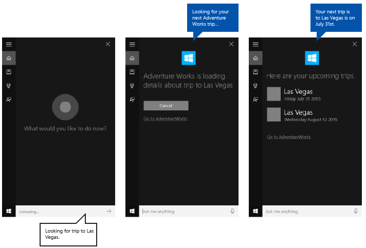

# Прямая ссылка на фоновое приложение от Кортаны


\[ Обновлено для приложений UWP в Windows 10. Статьи о Windows 8.x см. в [архиве](http://go.microsoft.com/fwlink/p/?linkid=619132) \]


**Важные API**

-   [**Windows.ApplicationModel.VoiceCommands**](https://msdn.microsoft.com/library/windows/apps/dn706594)
-   [**Элементы и атрибуты определения голосовых команд (VCD), версия 1.2**](https://msdn.microsoft.com/library/windows/apps/dn706593)

Предоставьте прямые ссылки из фонового приложения в **Кортане**, чтобы запустить приложение на переднем плане в определенном состоянии или контексте.

> **Примечание.**  
И **Кортана**, и служба фонового приложения завершают работу при запуске приложения переднего плана.

Прямая ссылка отображается по умолчанию на экране завершения **Кортаны**, как показано здесь («Перейти в AdventureWorks»), но можно отобразить прямые ссылки на других экранах. 


**Необходимые условия  **

В этом разделе используются сведения из раздела [Взаимодействие с фоновым приложением в Кортане](interact-with-a-background-app-in-cortana.md). Мы продолжим использование приложения для планирования поездок и управления ими под названием **Adventure Works**, чтобы продемонстрировать различные функции **Кортаны**.

Если вы — начинающий разработчик приложений универсальной платформы Windows (UWP), ознакомьтесь со следующими разделами, чтобы получить представление об описываемых здесь технологиях.

-   [Создание первого приложения](https://msdn.microsoft.com/library/windows/apps/bg124288)
-   Дополнительную информацию о событиях см. в разделе [Общие сведения о событиях и перенаправленных событиях](https://msdn.microsoft.com/library/windows/apps/mt185584).

**Рекомендации по взаимодействию с пользователем: **

Сведения об интеграции приложения с **Кортаной** см. в [рекомендациях по проектированию Кортаны](https://msdn.microsoft.com/library/windows/apps/dn974233), а подсказки по проектированию удобного и привлекательного приложения с поддержкой распознавания речи — в [рекомендациях по проектированию голосовых функций](https://msdn.microsoft.com/library/windows/apps/dn596121).

## <span id="Overview"></span><span id="overview"></span><span id="OVERVIEW"></span>Обзор


Пользователи могут получать доступ к вашему приложению с помощью **Кортаны** посредством:

-   активации на переднем плане (см. раздел [Активация приложения переднего плана с помощью голосовых команд в Кортане](launch-a-foreground-app-with-voice-commands-in-cortana.md));
-   представления определенной функции как службы фонового приложения (см. раздел [Активация фонового приложения с помощью голосовых команд в Кортане](launch-a-background-app-with-voice-commands-in-cortana.md));
-   создания прямых ссылок на определенные страницы, содержимое и состояние или контекст.

Здесь мы рассмотрим прямые ссылки.

Создание прямых ссылок удобно, когда Кортана и ваша служба приложения являются шлюзом к полному приложению (вместо требования от пользователя запустить ваше приложение через меню «Пуск»). Также оно подходит для предоставления доступа к более подробным сведениям и функциям в рамках приложения, которое невозможно с помощью Кортаны. Создание прямых ссылок — это еще один способ повысить удобство использования и упростить доступ к приложению.

Есть три способа предоставления прямых ссылок:

-   ссылка «Перейти в &lt;приложение&gt;» на различных экранах **Кортаны**;
-   ссылка, встроенная в плитку содержимого на различных экранах **Кортаны**;
-   программный запуск приложения на переднем плане из службы фонового приложения.

## <span id="Go_to__app__deep_link"></span><span id="go_to__app__deep_link"></span><span id="GO_TO__APP__DEEP_LINK"></span>Прямая ссылка «Перейти в &lt;приложение&gt;»


**Кортана** отображает прямую ссылку «Перейти к &lt;приложению&gt;» непосредственно под карточкой содержимого на большинстве экранов.


Можно указать аргумент запуска для этой ссылки для открытия приложения с аналогичным службе приложения контекстом. Если не указать аргумент запуска, приложение запускается на главном экране.

В этом примере из AdventureWorksVoiceCommandService.cs в **AdventureWorks** мы передаем указанный пункт назначения методу SendCompletionMessageForDestination, который извлекает все подходящие поездки и предоставляет прямую ссылку на приложение.

Сначала мы создаем сообщение  [**VoiceCommandUserMessage**](https://msdn.microsoft.com/en-us/library/windows/apps/windows.applicationmodel.voicecommands.voicecommandusermessage.aspx) (```userMessage```), которое произносит **Кортана** и которое отображается на холсте **Кортаны**. Затем создается объект списка [**VoiceCommandContentTile**](https://msdn.microsoft.com/en-us/library/windows/apps/windows.applicationmodel.voicecommands.voicecommandcontenttile.aspx) для отображения коллекции карточек результата на холсте. 

Затем эти два объекта передаются методу [CreateResponse](https://msdn.microsoft.com/en-us/library/windows/apps/windows.applicationmodel.voicecommands.voicecommandresponse.createresponse.aspx) объекта [**VoiceCommandResponse**](https://msdn.microsoft.com/library/windows/apps/dn974182) (```response```). Затем в качестве значения свойства [**AppLaunchArgument**](https://msdn.microsoft.com/library/windows/apps/dn974183) мы устанавливаем пункт назначения в голосовой команде.

Наконец, мы вызываем метод [**ReportSuccessAsync**](https://msdn.microsoft.com/library/windows/apps/dn706580) объекта [**VoiceCommandServiceConnection**](https://msdn.microsoft.com/library/windows/apps/dn974204).

```csharp
/// <summary>
/// Show details for a single trip, if the trip can be found. 
/// This demonstrates a simple response flow in Cortana.
/// </summary>
/// <param name="destination">The destination specified in the voice command.</param>
private async Task SendCompletionMessageForDestination(string destination)
{
...
    IEnumerable<Model.Trip> trips = store.Trips.Where(p => p.Destination == destination);

    var userMessage = new VoiceCommandUserMessage();
    var destinationsContentTiles = new List<VoiceCommandContentTile>();
...
    var response = VoiceCommandResponse.CreateResponse(userMessage, destinationsContentTiles);

    if (trips.Count() > 0)
    {
        response.AppLaunchArgument = destination;
    }

    await voiceServiceConnection.ReportSuccessAsync(response);
}
```


## <span id="Content_tile_deep_link"></span><span id="content_tile_deep_link"></span><span id="CONTENT_TILE_DEEP_LINK"></span>Прямая ссылка на плитку содержимого


Можно добавлять прямые ссылки на карточки содержимого на различных экранах **Кортаны**.



Как и в случае ссылок «Перейти в &lt;приложение&gt;», можно предоставить аргумент запуска для открытия приложения с аналогичным службе приложения контекстом. Если не указать аргумент запуска, плитка содержимого не будет связана с вашим приложением.

В этом примере из AdventureWorksVoiceCommandService.cs в **AdventureWorks** мы передаем указанный пункт назначения методу SendCompletionMessageForDestination, который извлекает все подходящие поездки и предоставляет приложению карточки содержимого с прямыми ссылками.

Сначала мы создаем сообщение  [**VoiceCommandUserMessage**](https://msdn.microsoft.com/en-us/library/windows/apps/windows.applicationmodel.voicecommands.voicecommandusermessage.aspx) (```userMessage```), которое произносит **Кортана** и которое отображается на холсте **Кортаны**. Затем создается объект списка [**VoiceCommandContentTile**](https://msdn.microsoft.com/en-us/library/windows/apps/windows.applicationmodel.voicecommands.voicecommandcontenttile.aspx) для отображения коллекции карточек результата на холсте. 

Затем эти два объекта передаются методу [CreateResponse](https://msdn.microsoft.com/en-us/library/windows/apps/windows.applicationmodel.voicecommands.voicecommandresponse.createresponse.aspx) объекта [**VoiceCommandResponse**](https://msdn.microsoft.com/library/windows/apps/dn974182) (```response```). Затем в качестве значения свойства [**AppLaunchArgument**](https://msdn.microsoft.com/library/windows/apps/dn974183) мы устанавливаем пункт назначения в голосовой команде.

Наконец, мы вызываем метод [**ReportSuccessAsync**](https://msdn.microsoft.com/library/windows/apps/dn706580) объекта [**VoiceCommandServiceConnection**](https://msdn.microsoft.com/library/windows/apps/dn974204).
Здесь мы добавляем две плитки содержимого с разными значениями параметра [**AppLaunchArgument**](https://msdn.microsoft.com/library/windows/apps/dn974183) в список [**VoiceCommandContentTile**](https://msdn.microsoft.com/library/windows/apps/dn974168), используемый в вызове [**ReportSuccessAsync**](https://msdn.microsoft.com/library/windows/apps/dn706580) объекта [**VoiceCommandServiceConnection**](https://msdn.microsoft.com/library/windows/apps/dn974204).

```csharp
/// <summary>
/// Show details for a single trip, if the trip can be found. 
/// This demonstrates a simple response flow in Cortana.
/// </summary>
/// <param name="destination">The destination specified in the voice command.</param>
private async Task SendCompletionMessageForDestination(string destination)
{
    // If this operation is expected to take longer than 0.5 seconds, the task must
    // supply a progress response to Cortana before starting the operation, and
    // updates must be provided at least every 5 seconds.
    string loadingTripToDestination = string.Format(
               cortanaResourceMap.GetValue("LoadingTripToDestination", cortanaContext).ValueAsString,
               destination);
    await ShowProgressScreen(loadingTripToDestination);
    Model.TripStore store = new Model.TripStore();
    await store.LoadTrips();

    // Query for the specified trip. 
    // The destination should be in the phrase list. However, there might be  
    // multiple trips to the destination. We pick the first.
    IEnumerable<Model.Trip> trips = store.Trips.Where(p => p.Destination == destination);

    var userMessage = new VoiceCommandUserMessage();
    var destinationsContentTiles = new List<VoiceCommandContentTile>();
    if (trips.Count() == 0)
    {
        string foundNoTripToDestination = string.Format(
               cortanaResourceMap.GetValue("FoundNoTripToDestination", cortanaContext).ValueAsString,
               destination);
        userMessage.DisplayMessage = foundNoTripToDestination;
        userMessage.SpokenMessage = foundNoTripToDestination;
    }
    else
    {
        // Set plural or singular title.
        string message = "";
        if (trips.Count() > 1)
        {
            message = cortanaResourceMap.GetValue("PluralUpcomingTrips", cortanaContext).ValueAsString;
        }
        else
        {
            message = cortanaResourceMap.GetValue("SingularUpcomingTrip", cortanaContext).ValueAsString;
        }
        userMessage.DisplayMessage = message;
        userMessage.SpokenMessage = message;

        // Define a tile for each destination.
        foreach (Model.Trip trip in trips)
        {
            int i = 1;
            
            var destinationTile = new VoiceCommandContentTile();

            destinationTile.ContentTileType = VoiceCommandContentTileType.TitleWith68x68IconAndText;
            destinationTile.Image = await StorageFile.GetFileFromApplicationUriAsync(new Uri("ms-appx:///AdventureWorks.VoiceCommands/Images/GreyTile.png"));

            destinationTile.AppLaunchArgument = trip.Destination;
            destinationTile.Title = trip.Destination;
            if (trip.StartDate != null)
            {
                destinationTile.TextLine1 = trip.StartDate.Value.ToString(dateFormatInfo.LongDatePattern);
            }
            else
            {
                destinationTile.TextLine1 = trip.Destination + " " + i;
            }

            destinationsContentTiles.Add(destinationTile);
            i++;
        }
    }

    var response = VoiceCommandResponse.CreateResponse(userMessage, destinationsContentTiles);

    if (trips.Count() > 0)
    {
        response.AppLaunchArgument = destination;
    }

    await voiceServiceConnection.ReportSuccessAsync(response);
}
```
## <span id="Programmatic_deep_link"></span><span id="programmatic_deep_link"></span><span id="PROGRAMMATIC_DEEP_LINK"></span>Программная прямая ссылка


Можно также программно запустить приложение с аргументом запуска для открытия приложения с похожим контекстом в виде службы приложения. Если не указать аргумент запуска, приложение запускается на главном экране.

Здесь мы добавляем параметр [**AppLaunchArgument**](https://msdn.microsoft.com/library/windows/apps/dn974183) со значением Las Vegas для объекта [**VoiceCommandResponse**](https://msdn.microsoft.com/library/windows/apps/dn974182), используемого в вызове [**RequestAppLaunchAsync**](https://msdn.microsoft.com/library/windows/apps/dn706581) объекта [**VoiceCommandServiceConnection**](https://msdn.microsoft.com/library/windows/apps/dn974204).

```CSharp
var userMessage = new VoiceCommandUserMessage();
userMessage.DisplayMessage = "Here are your trips.";
userMessage.SpokenMessage = 
  "You have one trip to Vegas coming up.";

response = VoiceCommandResponse.CreateResponse(userMessage);
response.AppLaunchArgument = “Las Vegas”;
await  VoiceCommandServiceConnection.RequestAppLaunchAsync(response);
```

## <span id="App_manifest"></span><span id="app_manifest"></span><span id="APP_MANIFEST"></span>Манифест приложения


Чтобы включить прямые ссылки на ваше приложение, необходимо объявить расширение `windows.personalAssistantLaunch` в файле Package.appxmanifest проекта вашего приложения.

Здесь мы объявляем расширение `windows.personalAssistantLaunch` для приложения **Adventure Works**.

```XML
<Extensions>
  <uap:Extension Category="windows.appService" 
    EntryPoint="AdventureWorks.VoiceCommands.AdventureWorksVoiceCommandService">
    <uap:AppService Name="AdventureWorksVoiceCommandService"/>
  </uap:Extension>
  <uap:Extension Category="windows.personalAssistantLaunch"/> 
</Extensions>
```

## <span id="Protocol_contract"></span><span id="protocol_contract"></span><span id="PROTOCOL_CONTRACT"></span>Контракт Protocol


Ваше приложение запускается на переднем плане с помощью активации универсального кода ресурса (URI) с использованием контракта [**Protocol**](https://msdn.microsoft.com/library/windows/apps/br224693). Приложение должно переопределять событие [**OnActivated**](https://msdn.microsoft.com/library/windows/apps/br242330) и проверять **ActivationKind** контракта **Protocol**. Подробнее см. в разделе [Обработка активации URI](https://msdn.microsoft.com/library/windows/apps/mt228339).

Здесь мы расшифровываем URI, предоставляемый [**ProtocolActivatedEventArgs**](https://msdn.microsoft.com/library/windows/apps/br224742), для получения доступа к аргументу запуска. В этом примере для параметра [**Uri**](https://msdn.microsoft.com/library/windows/apps/br224746) установлено значение «windows.personalassistantlaunch:?LaunchContext=Las Vegas».

```CSharp
if (args.Kind == ActivationKind.Protocol)
  {
    var commandArgs = args as ProtocolActivatedEventArgs;
    Windows.Foundation.WwwFormUrlDecoder decoder = 
      new Windows.Foundation.WwwFormUrlDecoder(commandArgs.Uri.Query);
    var destination = decoder.GetFirstValueByName("LaunchContext");

    navigationCommand = new ViewModel.TripVoiceCommand(
      "protocolLaunch",
      "text",
      "destination",
      destination);

    navigationToPageType = typeof(View.TripDetails);

    rootFrame.Navigate(navigationToPageType, navigationCommand);

    // Ensure the current window is active.
    Window.Current.Activate();
  }
```

## <span id="related_topics"></span>Статьи по теме


**Разработчикам**
* [Взаимодействия с Кортаной](cortana-interactions.md)
* [**Элементы и атрибуты VCD вер. 1.2**](https://msdn.microsoft.com/library/windows/apps/dn706593)

**Проектировщикам**
* [Рекомендации по проектированию Кортаны](https://msdn.microsoft.com/library/windows/apps/dn974233)
* [Рекомендации по проектированию голосовых функций](https://msdn.microsoft.com/library/windows/apps/dn596121)

**Примеры**
* [Пример голосовой команды Кортаны](http://go.microsoft.com/fwlink/p/?LinkID=619899)
 

 


<!--HONumber=Mar16_HO4-->


