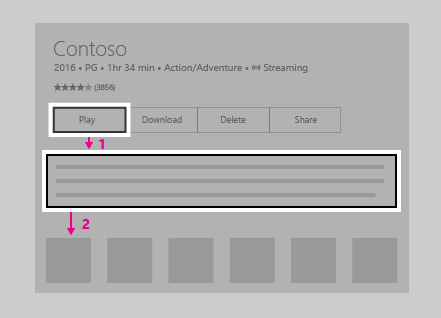
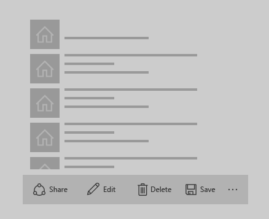
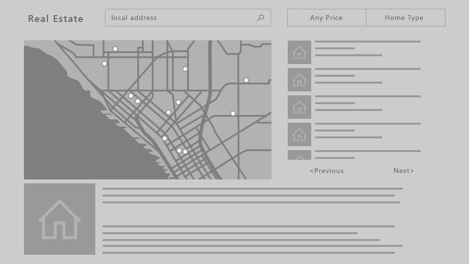
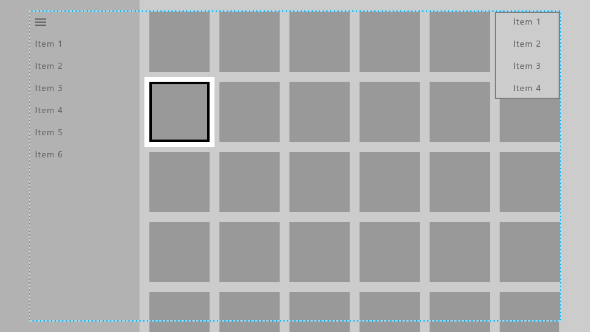
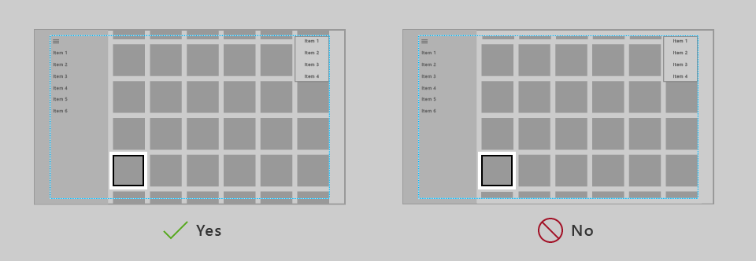
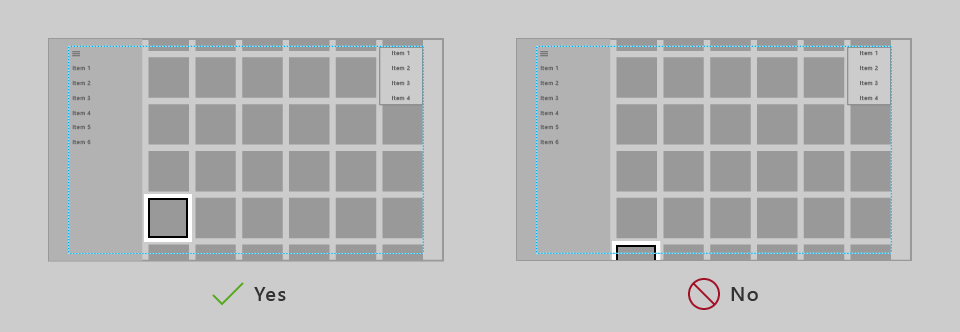

> \[В этой статье описывается еще не доступная функциональная возможность. Эта функциональная возможность может быть значительно изменена до коммерческого выпуска. Майкрософт не дает никаких гарантий, прямых или косвенных, в отношении указанной здесь информации.\]

# Проектирование для Xbox и телевизора

Разрабатывайте приложение для универсальной платформы Windows (UWP) таким образом, чтобы оно хорошо выглядело и функционировало на Xbox One и на экране телевизора.

## Обзор

Универсальная платформа Windows позволяет создавать отличные приложения для самых разных устройств с Windows 10. Большинство функциональных возможностей, предоставляемых платформой UWP, позволяет приложениям использовать один и тот же пользовательский интерфейс на всех устройствах без проведения дополнительной работы. Однако настройка и оптимизация приложения для работы на Xbox One и телевизионных экранах требуют особого подхода.

Взаимодействие с телевизором с дивана на другом конце комнаты с помощью игрового контроллера или пульта ДУ называется **взаимодействием на большом расстоянии**. Такое название связано прежде всего с тем, что пользователь, как правило, находится на большом (3 м) расстоянии от экрана. Оно представляет определенные трудности, которые отсутствуют при *взаимодействии на расстоянии 0,5 м* или при работе за компьютером. Этот фактор следует учитывать, если вы разрабатываете приложение для Xbox One или любого другого устройства, которое выводит изображение на телеэкран, а для ввода использует игровой контроллер.

Не все действия, описанные в этой статье, необходимы для обеспечения работоспособности приложения при просмотре на большом расстоянии. Однако понимание этих принципов и принятие соответствующих решений позволят обеспечить более удобную работу с приложением и принять во внимание его особые требования. Выпуская приложение, обеспечивающее просмотр на большом расстоянии, следует учитывать следующие принципы проектирования.

### Простота

Проектирование для обеспечения возможности просмотра на большом расстоянии таит в себе ряд определенных трудностей. Разрешение и расстояние просмотра может затруднить обработку большого объема информации. Чтобы обеспечить простоту дизайна, сведите его по возможности к самым простым компонентам. Количество информации, отображаемое на телеэкране, должно быть сравнимо с тем, что вы видите на мобильном телефоне, а не на рабочем столе компьютера.


### Ясность

Приложения UWP, предназначенные для просмотра на большом расстоянии, должны быть интуитивно понятными и простыми в использовании. Необходимо четко обозначать фокус, чтобы его невозможно было перепутать ни с чем другим. Расположите содержимое таким образом, чтобы перемещение по пространству экрана было прогнозируемым и согласованным. Предоставьте пользователям самый короткий путь к необходимым им элементам.


_**Все фильмы, приведенные на снимке экрана, доступны в программе «Кино и ТВ (Майкрософт)».**_  

### Увлечение

Большой экран обеспечивает самый удобный просмотр фильмов с эффектом полного погружения. Полноэкранное изображение, плавные движение, яркие цвета, изысканное оформление выведут ваши приложения на качественно новый уровень. Ваши приложения должны заметными и красивыми.


### Оптимизация для просмотра на большом расстоянии

Итак, теперь вы знаете о принципах качественного проектирования приложений UWP для просмотра на большом расстоянии. Ознакомьтесь со следующим обзором и узнайте, как оптимизировать приложение и обеспечить удобную работу пользователей.

| Возможность        | Описание           |
| -------------------------------------------------------------- |--------------------------------|
| [Геймпад и пульт дистанционного управления](#gamepad-and-remote-control)      | Чтобы оптимизировать просмотр на большом расстоянии, убедитесь, что ваше приложение надлежащим образом поддерживает геймпад и пульт ДУ. Имеется ряд улучшений, связанных с геймпадом и пультом ДУ, которые можно внести для оптимизации взаимодействия пользователя с устройством, на котором его возможности ограничены. |
| [Перемещение фокуса по оси X и Y и взаимодействие](#xy-focus-navigation-and-interaction) | Платформа UWP обеспечивает **навигацию с фокусом по осям X и Y**, которая позволяет пользователю осуществлять навигацию по пользовательскому интерфейсу приложения. Однако это позволяет пользователю перемещаться только вверх, вниз, влево или вправо. Рекомендации по выполнению этих и других требований приведены в этом разделе. |
| [Режим мыши](#mouse-mode)|В некоторых пользовательских интерфейсах, например картах или поверхностях для рисования, навигация с фокусом по осям X и Y невозможна или непрактична. Для этих интерфейсов UWP предоставляет **режим мыши**, который позволяет свободно использовать геймпад / пульт ДУ для навигации, аналогичной использованию мыши на настольном компьютере.|
| [Визуальный элемент фокуса](#focus-visual)  | Визуальный элемент фокуса — это граница вокруг элемента пользовательского интерфейса, который в настоящее время находится в фокусе. Он позволяет пользователю ориентироваться и без труда перемещаться по пользовательскому интерфейсу. Если фокус не виден, пользователь может запутаться в элементах пользовательского интерфейса и счесть его неудобным.  |
| [Включение фокуса](#focus-engagement) | Настройка включения фокуса на элементе пользовательского интерфейса требует нажатия кнопки **А/выбор**, чтобы пользователь смог взаимодействовать с ним. Это помогает повысить удобство взаимодействия пользователя при работе с пользовательским интерфейсом вашего приложения.
| [Размер элемента пользовательского интерфейса](#ui-element-sizing)  | Универсальная платформа Windows использует показатели [масштабирования и количества эффективных пикселей](..\layout\design-and-ui-intro.md#effective-pixels-and-scaling) для масштабирования пользовательского интерфейса в соответствии с расстоянием до экрана. Понимание принципов масштабирования и применение их ко всему пользовательскому интерфейсу поможет оптимизировать приложение для просмотра на большом расстоянии.  |
|  [Безопасная область телевизора](#tv-safe-area) | По умолчанию платформа UWP автоматически избегает отображения элементов пользовательского интерфейса в небезопасных областях телевизионного экрана (области вблизи границ экрана). Однако это создает эффект черных полей (эффект экранного каше) вокруг пользовательского интерфейса. Чтобы ваше приложение полностью заполняло экран телевизора, необходимо изменить его таким образом, чтобы оно доходило до краев экрана телевизора, если последний поддерживает такую возможность. |
| [Цвета](#colors)  |  Платформа UWP поддерживает цветовые темы, а в приложении, использующем системную тему, на Xbox One будет по умолчанию применена **темная** схема. Если ваше приложение имеет специальные цветовую тему, необходимо помнить, что определенные цвета не подходят для телевизора, поэтому их следует избегать. |
| [Звук](../style/sound.md)    | Звуки играют ключевую роль при просмотре ТВ на большом расстоянии, позволяя пользователю погрузиться в происходящее на экране и предоставляя обратную связь. UWP поддерживает возможность, которая автоматически включит звуки для стандартных элементов управления, когда приложение работает на Xbox One. Узнайте больше о поддержке звуков, встроенной в UWP, а также о том, как ими пользоваться.    |
| [Руководство по элементам управления пользовательского интерфейса](#guidelines-for-ui-controls)  |  Имеется несколько элементов управления пользовательского интерфейса, которые хорошо работают на разных устройствах, но обладают некоторыми особенностями при использовании вместе с телевизором. Ознакомьтесь с рекомендациями по использованию этих элементов управления при разработке приложений, работа с которыми будет выполняться на большом расстоянии. |

<!--[elcowle] We may uncomment this now that the Sound article is live-->
<!--| [Sound](../style/sound.md)  |  Sounds play a key role in the 10-foot experience, helping to immerse and give feedback to the user. The UWP provides functionality that automatically turns on sounds for common controls when the app is running on Xbox One. Find out more about the sound support built into the UWP and learn how to take advantage of it. |-->

## Геймпад и пульт дистанционного управления

Так же, как клавиатура и мышь на компьютере и сенсорный экран на телефоне и планшете, геймпад и пульт ДУ являются основными устройствами ввода при просмотре на большом расстоянии. В этом разделе описаны аппаратные кнопки и их предназначение. В разделах [Перемещение фокуса по оси X и Y и взаимодействие](#xy-focus-navigation-and-interaction) и [Режим мыши](#mouse-mode) вы узнаете, как оптимизировать приложение для использования этих устройств ввода.

Качество работы геймпадов и пультов ДУ по умолчанию зависит от того, насколько хорошо ваше приложение поддерживает клавиатуру. Хороший способ реализовать оптимальную поддержку геймпада / пульта ДУ в приложении — обеспечить поддержку клавиатуры на ПК, а затем протестировать его с геймпадом и пультом ДУ и выявить слабые места пользовательского интерфейса.

### Аппаратные кнопки

В этом документе будут использоваться имена кнопок, указанные на следующей схеме.


Как видно на схеме, имеется ряд кнопок, которые поддерживаются на геймпаде и не поддерживаются на пульте ДУ и наоборот. Хотя для ускорения навигации и можно использовать кнопки, которые поддерживаются только одним устройством ввода, следует помнить, что их использование в критически важных случаях может привести к тому, что пользователь не сможет получить доступ к определенным частям пользовательского интерфейса.

В следующей таблице перечислены все аппаратные кнопки, поддерживаемые приложениями UWP, с указанием соответствующего устройства ввода.

| Кнопка                    | Геймпад   | Пульт ДУ    |
|---------------------------|-----------|-------------------|
| Кнопка A / выбор           | Да       | Да               |
| Кнопка B / назад             | Да       | Да               |
| Крестовина   | Да       | Да               |
| Кнопка меню               | Да       | Да               |
| Кнопка просмотра               | Да       | Да               |
| Кнопки X и Y           | Да       | Нет                |
| Левый джойстик                | Да       | Нет                |
| Правой джойстик               | Да       | Нет                |
| Левый и правый триггеры   | Да       | Нет                |
| Левый и правый бамперы    | Да       | Нет                |
| Кнопка OneGuide           | Нет        | Да               |
| Кнопка громкости             | Нет        | Да               |
| Кнопка канала            | Нет        | Да               |
| Кнопки управления мультимедиа     | Нет        | Да               |
| Кнопка выключения звука               | Нет        | Да               |

### Встроенная поддержка кнопок

UWP автоматически сопоставляет существующее поведение при вводе с помощью клавиатуры с вводом с помощью геймпада и пульта ДУ. В следующей таблице представлены эти встроенные сопоставления.

| Клавиатура              | Геймпад / пульт ДУ                        |
|-----------------------|---------------------------------------|
| Клавиши со стрелками            | Крестовина (также левый джойстик на геймпаде)    |
| Пробел              | Кнопка A / выбор                       |
| Ввод                 | Кнопка A / выбор                       |
| Escape                | Кнопка B / назад*                        |

\* Если ни событие [KeyDown](https://msdn.microsoft.com/library/windows/apps/br208941), ни событие [KeyUp](https://msdn.microsoft.com/en-us/library/windows/apps/windows.ui.xaml.uielement.keyup.aspx) кнопки B не обрабатываются приложением, запускается событие [SystemNavigationManager.BackRequested](https://msdn.microsoft.com/en-us/library/windows/apps/windows.ui.core.systemnavigationmanager.backrequested.aspx), которое ведет к обратной навигации в приложении.

### Поддержка горячих клавиш

Горячие клавиши — это те кнопки, которые можно использовать для увеличения скорости навигации по пользовательскому интерфейсу. Однако эти кнопки могут быть уникальными для того или иного устройства ввода, поэтому следует помнить, что не все пользователи смогут воспользоваться этими функциями. Фактически геймпад в настоящее время является единственным устройством ввода, которое поддерживает функции ускорения для приложений UWP на устройстве Xbox One.

В следующей таблице указаны встроенные в UWP функции поддержки горячих клавиш, а также возможности, которые вы можете реализовать самостоятельно. Используйте эти возможности в своем пользовательском интерфейсе для обеспечения согласованной и удобной работы пользователей.

| Тип взаимодействия   | Клавиатура   | Геймпад      | Встроенная функция для  | Рекомендуется для |
|---------------|------------|--------------|----------------|------------------|
| Сдвиг       | Нет       | Правой джойстик  | Нет           |      [ScrollViewer](https://msdn.microsoft.com/en-us/library/windows/apps/windows.ui.xaml.controls.scrollviewer.aspx) |
| Страница вверх/вниз  | Страница вверх/вниз | Левый и правый триггеры | Нет | `ScrollViewer` и список/сетка
| Страница влево/вправо | Нет | Левый и правый бамперы | [Сводка](https://msdn.microsoft.com/en-us/library/windows/apps/windows.ui.xaml.controls.pivot.aspx) | `ScrollViewer`
| Увеличение/уменьшение        | Ctrl +/- | Левый и правый триггеры | `ScrollViewer` | Представления, поддерживающие увеличение и уменьшение масштаба

## Перемещение фокуса по оси X и Y и взаимодействие

Если ваше приложение поддерживает корректное перемещение фокуса с помощью клавиатуры, оно будет поддерживать геймпад и пульт ДУ. Навигация с помощью клавиш со стрелками соответствует использованию **крестовины** (а также **левого джойстика** на геймпаде), а взаимодействие с элементами управления пользовательского интерфейса — использованию клавиши **Ввод/выбор**(см. [Геймпад и пульт ДУ](#gamepad-and-remote-control)) Руководство по проектированию управления с помощью клавиатуры см. в разделе [Взаимодействие с клавиатурой](keyboard-interactions.md).

Если поддержка клавиатуры реализована надлежащим образом, ваше приложение будет работать достаточно стабильно. Однако может понадобиться выполнить ряд дополнительных задач для поддержки всех сценариев. Подумайте об особых требованиях своего приложения, чтобы обеспечить максимально удобную работу пользователя.

### Недоступный пользовательский интерфейс

Поскольку перемещение фокуса по оси X и Y ограничивает пользователя направлениями «Вверх», «Вниз», «Влево» и «Вправо», могут возникнуть случаи, когда части пользовательского интерфейса останутся недоступными. На следующей схеме приведен пример компоновки пользовательского интерфейса, не поддерживающей перемещения фокуса по оси X и Y. Обратите внимание, что элемент посередине не доступен при использовании геймпада / пульта ДУ, так как приоритетной является вертикальная и горизонтальная навигация. Средний элемент никогда не получит достаточно высокого приоритета для получения фокуса.


Если по какой-либо причине изменение пользовательского интерфейса невозможно, воспользуйтесь одним из методов, которые обсуждаются в следующем разделе, чтобы переопределить поведение фокуса по умолчанию.

### Переопределение навигации по умолчанию <a name="overriding-the-default-navigation"></a>

Хотя платформа UWP стремится обеспечить удобство навигации пользователя с помощью крестовины / левого джойстика, невозможно гарантировать поведение, которое было бы оптимизировано под цели вашего приложения. Лучшим способом оптимизации навигации в приложении является его тестирование с использованием геймпада и проверка доступности каждого элемента пользовательского интерфейса с учетом различных сценариев использования приложения. Если в приложении необходимо реализовать поведение, которого невозможно добиться с помощью имеющихся возможностей перемещения фокуса по оси X и Y, ознакомьтесь с приведенными в следующем разделе рекомендациями, чтобы переопределить поведение и иметь возможность размещать фокус на логическом элементе.

В следующем фрагменте кода показано, как переопределить поведение при перемещении фокуса по оси X и Y по умолчанию.

```xml
<StackPanel>
    <Button x:Name="MyBtnLeft" 
            Content="Search" />
    <Button x:Name="MyBtnRight" 
            Content="Delete"/>
    <Button x:Name="MyBtnTop" 
            Content="Update" />
    <Button x:Name="MyBtnDown" 
            Content="Undo" />
    <Button Content="Home"  
            XYFocusLeft="{x:Bind MyBtnLeft}" 
            XYFocusRight="{x:Bind MyBtnRight}"
            XYFocusDown="{x:Bind MyBtnDown}"
            XYFocusUp="{x:Bind MyBtnTop}" />
</StackPanel>
```

В этом случае при переходе фокуса к кнопке `Home` и навигации пользователя влево, фокус перемещается к кнопке `MyBtnLeft`. Если пользователь переходит вправо, фокус перемещается к кнопке `MyBtnRight` и т. д.

Чтобы не допустить перемещения фокуса от элемента управления в определенном направлении, используйте свойство `XYFocus*` для указания на тот же самый элемент управления.

```xml
<Button Name="HomeButton"  
        Content="Home"  
        XYFocusLeft ="{x:Bind HomeButton}" />
```

### Путь с наименьшим количеством нажатий <a name="path-of-least-clicks"></a>

Попробуйте свести к минимуму количество нажатий, необходимое для выполнения наиболее распространенных задач. В следующем примере [TextBlock](https://msdn.microsoft.com/en-us/library/windows/apps/windows.ui.xaml.controls.textblock.aspx) располагается между кнопкой **воспроизведения** (которая изначально имеет фокус) и часто используемым элементом, так что между приоритетными задачами размещается лишний элемент.



В следующем примере [TextBlock](https://msdn.microsoft.com/en-us/library/windows/apps/windows.ui.xaml.controls.textblock.aspx) расположен над кнопкой **воспроизведения**. Простая реорганизация пользовательского интерфейса, при которой ненужные элементы не размещаются между приоритетными задачами, значительно повысит удобство использования приложения.


### CommandBar и ContextFlyout

При использовании [CommandBar](https://msdn.microsoft.com/en-us/library/windows/apps/windows.ui.xaml.controls.commandbar.aspx) следует помнить, что имеется проблема прокрутки списка, которая была упомянута в разделе [Проблема: элементы пользовательского интерфейса, размещенные после длинного списка/сетки](#problem-ui-elements-located-after-long-scrolling-list-grid). На следующем рисунке показан макет пользовательского интерфейса с `CommandBar` под списком/сеткой. Пользователю нужно полностью прокрутить список/сетку, чтобы достичь `CommandBar`.



Что если поместить `CommandBar`*над* списком/сеткой? Хотя пользователю, который прокрутил список/сетку, понадобится прокрутить их обратно, чтобы достичь `CommandBar`, это потребует меньше усилий, чем в случае предыдущей конфигурации. Обратите внимание: предполагается, что исходный фокус приложения помещается рядом или над `CommandBar`. Этот подход не будет столь же удобен, если исходный фокус располагается под списком/сеткой. Если эти элементы `CommandBar` являются глобальными элементами действия, которые не нужно использовать слишком часто (например, кнопка **Синхронизировать**), их можно разместить над списком/сеткой.

Если ваше приложение содержит объект `CommandBar`, элементы которого должны быть доступны пользователям, возможно, их стоит разместить внутри `ContextFlyout` и удалить их из `CommandBar`. 

Несмотря на то что элементы `CommandBar` невозможно расположить вертикально, их размещение вдоль направления прокрутки (например, слева или справа от вертикально прокручиваемого списка или сверху или снизу от горизонтально прокручиваемого списка) является еще одним вариантом компоновки пользовательского интерфейса, который можно принять во внимание.

### Проблемы компоновки пользовательского интерфейса

Использовать некоторые макеты пользовательского интерфейса сложнее вследствие особенностей перемещения фокуса по оси X и Y, поэтому их применение следует оценивать в зависимости от ситуации. Несмотря на отсутствие единственного правильного способа, решение зависит от вас и особых нужд вашего приложения. Однако существует ряд методов, которые можно использовать для упрощения работы с телевизором.

Чтобы лучше понять эти методы, рассмотрим вымышленное приложение, которое продемонстрирует ряд проблем и методов их решения.

> **Примечание.**
            &nbsp;&nbsp;Это вымышленное приложение служит для демонстрации проблем, связанных с пользовательским интерфейсом, и возможных способов их решения и не предназначено для демонстрации возможностей упрощения работы пользователей в каком-либо приложении.

Ниже приведено вымышленное приложение для покупки недвижимости, которое показывает список доступных для продажи домов с картой, описанием объекта и прочими данными. В этом приложении имеется три проблемы, которые можно устранить с помощью следующих методов:

- [изменение макета пользовательского интерфейса;](#ui-rearrange)
- [включение фокуса;](#engagement)
- [режим мыши.](#mouse-mode)



#### Проблема: элементы пользовательского интерфейса, размещенные после длинного списка/сетки <a name="problem-ui-elements-located-after-long-scrolling-list-grid"></a>

Объект [ListView](https://msdn.microsoft.com/en-us/library/windows/apps/windows.ui.xaml.controls.listview.aspx), приведенный на следующем рисунке, является очень длинным списком прокрутки. Если [включение](#focus-engagement) *не* является обязательным для `ListView`, то при переходе пользователя к списку фокус переводится на первый элемент списка. Чтобы пользователь перешел к кнопке **Назад** или **Далее**, ему необходимо перебрать все элементы в списке. В таких случаях, когда пользователю необходимо&mdash;перебирать все элементы списка (список недостаточно короткий) и когда пользовательский интерфейс становится неудобным, &mdash;возможно, следует использовать другие варианты.


#### Решения

##### Изменение макета пользовательского интерфейса <a name="ui-rearrange"></a>

Если исходный фокус не находится в нижней части страницы, элементы пользовательского интерфейса, размещенные над длинным списком прокрутки, станут более доступны, если поместить их под списком. Если новый макет подходит для других устройств, изменение компоновки для всех семейств устройств вместо внесения специальных изменений в пользовательский интерфейс только для Xbox One может стать менее затратным решением. Кроме того, размещение элементов пользовательского интерфейса поперек направления прокрутки (то есть горизонтально относительно вертикального списка прокрутки или вертикально относительно горизонтального списка прокрутки) обеспечит более удобный к ним доступ.


##### Включение фокуса <a name="engagement"></a>

Если включение является *обязательным*, весь при фокусировке выделяется весь объект `ListView`. Пользователь сможет перейти к следующему доступному для фокусировки элементу, не переходя к содержимому списка. Дополнительные сведения о том, какие элементы управления поддерживают включение и как их использовать см. в разделе [Включение фокуса](#focus-engagement).


#### Проблема: ScrollViewer без доступных для фокусировки элементов

Поскольку перемещение фокуса по оси X и Y основано на переходе к одному доступному для фокусировки элементу за раз, объект [ScrollViewer](https://msdn.microsoft.com/en-us/library/windows/apps/windows.ui.xaml.controls.scrollviewer.aspx), который не содержит каких-либо доступных элементов (например, объект только с текстом, как в этом примере), может привести к тому, что пользователь не сможет просмотреть все содержимое `ScrollViewer`. Решения для этого и других похожих сценариев приведены в разделе [Включение фокуса](#focus-engagement).


#### Проблема: пользовательский интерфейс со свободной прокруткой

Если приложение требует свободной прокрутки пользовательского интерфейса, например в случае поверхности рисования или, как в этом примере, карты, перемещение фокуса по оси X и Y попросту не работает. В этих случаях можно включить [режим мыши](#mouse-mode), чтобы разрешить пользователю свободно перемещаться внутри элемента пользовательского интерфейса.


## Режим мыши

Как описано в разделе [Перемещение фокуса по оси X и Y и взаимодействие](#xy-focus-navigation-and-interaction), на Xbox One фокус перемещается по оси X и Y, позволяя пользователю переходить от одного элемента управления к другому в обоих направлениях по вертикали и горизонтали. Однако некоторые элементы управления, такие как [WebView](https://msdn.microsoft.com/en-us/library/windows/apps/windows.ui.xaml.controls.webview.aspx) и [MapControl](https://msdn.microsoft.com/en-us/library/windows/apps/windows.ui.xaml.controls.maps.mapcontrol.aspx), требуют взаимодействия, аналогичного работе с мышью, когда пользователи могут свободно перемещать указатель внутри границ элемента управления. Имеются также приложения, в которых пользователю было бы разумно иметь возможность перемещать указатель по всей странице с помощью геймпада / пульта ДУ, как при работе с мышью на ПК.

В этих сценариях следует обеспечить работу указателя (режим мыши) на всей странице или в границах элемента управления. Например, ваше приложение может содержать страницу с элементом управления `WebView`, который использует режим мыши только внутри этого элемента и перемещение фокуса по оси X и Y во всех остальных областях экрана. Чтобы запросить указатель, следует обозначить, использовать ли его **при взаимодействии с элементом управления или страницей** или **при перемещении фокуса на страницу**.

> **Примечание.**
            &nbsp;&nbsp;Запрос указателя при получении элементом управления фокуса не поддерживается.

На следующей схеме показаны сопоставления кнопок для геймпада / пульта ДУ в режиме мыши.


> **Примечание.**
            &nbsp;&nbsp;Режим мыши поддерживается только на устройстве Xbox One с геймпадом/пультом ДУ. В случае других семейств устройств и типов ввода он игнорируется без отображения каких-либо сообщений.

Используйте свойство `RequiresPointer`, чтобы включить режим мыши для элемента управления или страницы. `RequiresPointer` поддерживает три возможных значения: `Never` (значение по умолчанию), `WhenEngaged` и `WhenFocused`.

> **Примечание.**
            &nbsp;&nbsp;`RequiresPointer` — это новый, еще не задокументированный API. 

<!--TODO: Link to doc-->

### Активация режима мыши для элемента управления

Если пользователь взаимодействует с элементом управления с помощью `RequiresPointer="WhenEngaged"`, режим мыши остается активным на протяжении периода взаимодействия. В следующем фрагменте кода показан простой объект `MapControl`, который активирует режим мыши при начале взаимодействия.

```xml
<Page>
    <Grid>
        <MapControl IsEngagementRequired="true" 
                    RequiresPointer="WhenEngaged"/>
    </Grid>
</Page> 
```

> **Примечание.**
            &nbsp;&nbsp;Если элемент управления активирует режим мыши при начале взаимодействия, он также должен требовать выполнения условия `IsEngagementRequired="true"`. В противном случае режим мыши активирован не будет.

Если элемент управления работает в режиме мыши, вложенные элементы управления также будут работать в режиме мыши. Запрошенный режим дочерних объектов будет игнорироваться&mdash;так как ситуация, когда родительский объект находится в режиме мыши, а дочерние объекты работают в другом режиме, невозможна.

Кроме того, запрошенный режим элемента управления проверяется только при получении фокуса, поэтому если элемент уже имеет фокус, режим не меняется динамически.

### Активация режима мыши на странице

Если на странице имеется свойство `RequiresPointer="WhenFocused"`, режим мыши будет активирован для всей страницы при получении ею фокуса. В следующем фрагменте кода показано предоставление странице этого свойства.

```xml
<Page RequiresPointer="WhenFocused">
    ...
</Page> 
```

> **Примечание.**
            &nbsp;&nbsp;Значение `WhenFocused` поддерживается только для объектов [Page](https://msdn.microsoft.com/en-us/library/windows/apps/windows.ui.xaml.controls.page.aspx). Если вы пытаетесь задать это значение для элемента управления, возникнет исключение.

## Визуальный элемент фокуса

Визуальный элемент фокуса — это граница вокруг элемента пользовательского интерфейса, который в настоящее время находится в фокусе. Он позволяет пользователю ориентироваться и без труда перемещаться по пользовательскому интерфейсу.

Благодаря обновлению визуального элемента и различным параметрам его настройки разработчики могут быть уверены, что один и тот же визуальный элемент фокуса будет корректно работать на компьютерах и устройствах Xbox One, а также на любых других устройствах с Windows 10, которые поддерживают клавиатуру и геймпад / пульт ДУ.

Хотя один и тот же визуальный элемент фокуса можно использовать на различных платформах, контекст его использования при просмотре на большом расстоянии несколько отличается. Предполагается, что пользователь не уделяет особого внимания всей площади экрана телевизора, поэтому важно, что текущий выделенный элемент всегда был отчетливо виден. Это позволит избавить пользователя от долгих поисков элемента.

Важно помнить, что визуальный элемент фокуса по умолчанию отображается при использовании геймпада или пульта ДУ, но *не* клавиатуры. Поэтому даже если вы не реализовали его, он будет отображаться при запуске приложения на Xbox One.

### Исходное положение визуального элемента фокуса

При запуске приложения или перехода к странице поместите фокус на элементе пользовательского интерфейса, который воспринимается как первый элемент, с которым пользователь может выполнить какие-либо действия. Например, в приложении для обработки фотографий фокус можно поместить на первом элементе галереи, а при переходе к подробному представлению композиции в музыкальном приложении — на кнопке воспроизведения. Это позволит упростить воспроизведение музыки.

Попробуйте разместить исходный фокус в левом верхнем углу приложения (или в правом верхнем углу при направлении движения справа налево). Большинство пользователей смотрят сначала в этот угол, так как именно отсюда начинается перемещение по содержимому приложения.

### Четкое выделение фокуса

Визуальный элемент фокуса всегда должен быть виден на экране, чтобы пользователь без лишних поисков мог продолжить работу с того места, на котором он остановился. Аналогичным образом элемент, отображаемый на экране, всегда должен быть доступен для фокусировки.&mdash;Поэтому, например, не следует использовать всплывающие окна, содержащие только текст и не содержащие элементов, которым можно передать фокус.

### Наложение с исчезновением

Чтобы привлечь внимание пользователя к элементам интерфейса, с которыми он работает в настоящее время, используя игровой контроллер или пульт ДУ, при запуске приложения на Xbox One платформа UWP автоматически добавляет «дымку», закрывающую области вне интерфейса всплывающего окна. Для этого не требуется какой-либо дополнительной работы, однако об этом стоит помнить при проектировании пользовательского интерфейса.

## Включение фокуса

Включение фокусапризвано упростить использование геймпада или пульта ДУ при взаимодействии с приложением. 

> **Примечание.**
            &nbsp;&nbsp;Настройка включения фокуса не влияет на клавиатуру и другие устройства ввода.

Если свойство `IsFocusEngagementEnabled` в объекте [FrameworkElement](https://msdn.microsoft.com/en-us/library/windows/apps/windows.ui.xaml.frameworkelement.aspx) имеет значение `True`, элемент управления помечается как требующий включения фокуса. Это означает, что пользователь должен нажать кнопку **A/выбор**, чтобы включить элемент управления и начать с ним взаимодействовать. После завершения работы можно нажать кнопку **B/назад**, чтобы отключить элемент управления и перейти к другому.

> **Примечание.**
            &nbsp;&nbsp;`IsFocusEngagementEnabled` — это новый, еще не задокументированный API.

### Захват фокуса

Захват фокуса происходит, когда пользователь пытается выполнить переход между элементами интерфейса приложения, но «застревает» на одном из них. При этом перемещение за пределы этого элемента затруднено или невозможно.

В следующем примере показан пользовательский интерфейс, создающий захват фокуса.


Если пользователь хочет перейти от левой кнопки к правой, логично предположить, что для этого нужно только дважды нажать «Вправо» на крестовине или два раза передвинуть левый джойстик. Однако если ползунок [Slider](https://msdn.microsoft.com/en-us/library/windows/apps/windows.ui.xaml.controls.slider.aspx) не требует включения, произойдет следующее: если пользователь нажмет «Вправо» в первый раз, фокус сместится на `Slider`, а повторное нажатие приведет к перемещению указателя ползунка `Slider`. Пользователь продолжит перемещать маркер вправо и не сможет достичь кнопки.

Данную проблему можно обойти двумя способами. Первый — это создание другого макета, аналогичного примеру приложения для покупки недвижимости в разделе [Перемещение фокуса по оси X и Y и взаимодействие](#xy-focus-navigation-and-interaction), где мы переместили кнопки **Назад** и **Далее** над объектом `ListView`. Размещение элементов управления вертикально, а не горизонтально, как показано на следующем изображении, позволит решить эту проблему.


Теперь пользователь может переходить к каждому элементу управления, нажимая «Вверх» и «Вниз» на крестовине или левом джойстике. При переходе фокуса к объекту `Slider`, можно нажать «Влево» и «Вправо» для перемещения маркера `Slider` в необходимое положение.

Другой подход к решению этой проблемы — обязательное включение объекта `Slider`. Если задать значение `IsFocusEngagementEnabled="True"`, это приведет к следующему.


Если объект `Slider` требует включения фокуса, пользователь может перейти к кнопке справа, просто нажав дважды «Вправо» на крестовине / левом джойстике. Это замечательное решение, поскольку оно не требует настройки пользовательского интерфейса и приводит к ожидаемому результату.

### Элементы управления

Помимо элемента управления [Slider](https://msdn.microsoft.com/en-us/library/windows/apps/windows.ui.xaml.controls.slider.aspx), существуют другие элементы управления, для которых может потребоваться включения фокуса, например:

- [ListBox;](https://msdn.microsoft.com/en-us/library/windows/apps/windows.ui.xaml.controls.listbox.aspx)
- [ListView;](https://msdn.microsoft.com/en-us/library/windows/apps/windows.ui.xaml.controls.listview.aspx)
- [GridView;](https://msdn.microsoft.com/en-us/library/windows/apps/windows.ui.xaml.controls.gridview.aspx)
- [FlipView.](https://msdn.microsoft.com/en-us/library/windows/apps/xaml/windows.ui.xaml.controls.flipview)

В отличие от элемента управления `Slider`, они не захватывают фокус. Однако если они содержат большой объем данных, эти элементы управления могут привести к проблемам, связанным с удобством использования. Ниже приведен пример элемента `ListView`, содержащего большой объем данных.


Как и в примере с элементом `Slider`, давайте попытаемся перейти от кнопки сверху к кнопке снизу, используя геймпад / пульт ДУ. Фокус находится на верхней кнопке. Нажатие «Вниз» на крестовине или джойстике приведет к перемещению фокуса на первый элемент в `ListView` (Элемент 1). Когда пользователь снова нажмет «Вниз», фокус перейдет к следующему элементу в списке, а не к кнопке снизу. Чтобы перейти к кнопке, пользователь должен сначала перебрать все элементы в `ListView`. Если `ListView` содержит большой объем данных, это может оказаться очень неудобным, что создаст у пользователя плохое впечатление о приложении.

Чтобы устранить эту проблему, установите значение свойства `IsFocusEngagementEnabled="True"` объекта `ListView`. Это позволит сделать включение элемента обязательным. Это позволит пользователю быстро пропустить `ListView` простым нажатием кнопки «Вниз». Однако, пользователь не сможет прокрутить список или выбрать его элемент, не включив список с помощью кнопки **A/выбор** при получении им фокуса с последующим его отключением с помощью кнопки **B/назад**.


#### ScrollViewer

От этих элементов управления несколько отличается объект [ScrollViewer](https://msdn.microsoft.com/en-us/library/windows/apps/windows.ui.xaml.controls.scrollviewer.aspx). Он так же имеет собственные особенности, которые необходимо учитывать. Если у вас есть `ScrollViewer` с доступным для фокусировки содержимым, по умолчанию переход к `ScrollViewer` приведет к перемещению между его элементами. Как и в случае с `ListView`, необходимо перебрать все элементы `ScrollViewer`, чтобы выйти из этого элемента. 

Если `ScrollViewer` *не* имеет содержимого, доступного для фокусировки &mdash; например, содержит только текст &mdash; можно установить значение `IsFocusEngagementEnabled="True"`, чтобы пользователь мог включить объект `ScrollViewer` с помощью кнопки **A/выбор**. После включения элемента пользователь может прокрутить текст с помощью **крестовины / левого джойстика** и нажать кнопку **B/назад**, чтобы отключить фокус элемента.

Другой способ — установить значение `IsTabStop="True"` для `ScrollViewer`. В результате пользователю не придется включать элемент управления &mdash; а только перевести на него фокус и прокрутить с помощью **крестовины/левого джойстика**, если `ScrollViewer` не содержит элементов, доступных для фокусировки.

### Значения по умолчанию для включения фокуса

Некоторые элементы управления достаточно часто захватывают фокус, поэтому настройки по умолчанию должны требовать их обязательного включения. Для других элементов управления включение фокуса не является обязательным по умолчанию, однако оно может принести определенные преимущества. В следующей таблице перечислены эти элементы управления и их поведение по умолчанию при включении фокуса.

| Элемент управления               | Включение фокусапо умолчанию  |
|-----------------------|---------------------------|
| CalendarDatePicker    | Включено                        |
| FlipView              | Отключено                       |
| GridView              | Отключено                       |
| ListBox               | Отключено                       |
| ListView              | Отключено                       |
| ScrollViewer          | Отключено                       |
| SemanticZoom          | Отключено                       |
| Ползунок                | Включено                        |

Для всех прочих элементов управления UWP условие `IsFocusEngagementEnabled="True"` не меняет их поведения или визуального отображения.

## Размер элемента пользовательского интерфейса

Так как при просмотре на большом расстоянии пользователь использует пульт ДУ или геймпад и находится в нескольких метрах от экрана, имеется ряд факторов, связанных с интерфейсом, которые необходимо учесть при проектировании. Убедитесь, что пользовательский интерфейс имеет необходимую плотность содержимого, а также что он не перегружен и позволяет пользователю без труда перемещаться и выбирать нужные элементы. Помните: простота — это ключевой фактор.

### Коэффициент масштабирования и адаптивный макет

**Коэффициент масштабирования** обеспечивает отображение правильного размера элементов пользовательского интерфейса на том устройстве, на котором работает приложение. На компьютере этот параметр регулируется с помощью ползунка и находится в следующем расположении: **Параметры > Система > Экран**. Этот же параметр используется и на телефоне, если устройство поддерживает его.

 

На Xbox One такого системного параметра нет, однако чтобы элементы пользовательского интерфейса UWP отображались на экране телевизора в правильном размере, они масштабируются со значением по умолчанию **200 %**. Если элементы пользовательского интерфейса имеют правильные размеры на других устройствах, они будут правильно отображаться и на экране телевизора. Xbox One отображает приложение в разрешении 1080p (1920 x 1080 пикселей). Поэтому при переносе приложения с других устройств, например ПК, убедитесь, что пользовательский интерфейс хорошо выглядит при разрешении 960 x 540 пикселей и масштабе 100 %, воспользовавшись [специальными возможностями](https://msdn.microsoft.com/en-us/windows/uwp/layout/screen-sizes-and-breakpoints-for-responsive-design).

Проектирование для Xbox несколько отличается от проектирования для ПК, так как необходимо работать только с одним разрешением — 1920 x 1080. Неважно, если разрешение телевизора выше&mdash;приложения UWP всегда будут масштабироваться до 1080p.

Правильные размеры ресурсов при значении 200 % также будут использоваться для вашего приложения при работе на Xbox One независимо от разрешения телевизора.

### Плотность содержимого

При проектировании приложения помните, что пользователь будет смотреть на пользовательский интерфейс с некоторого расстояния и взаимодействовать с ним с помощью пульта ДУ или геймпада, навигация с помощью которых занимает больше времени, чем навигация с помощью мыши или сенсорного экрана.

#### Размеры элементов управления пользовательского интерфейса

Интерактивные элементы пользовательского интерфейса должны иметь минимальную высоту 32 эффективных пикселя. Это значение по умолчанию для основных элементов управления UWP. При использовании масштаба 200 % оно обеспечивает видимость элементов пользовательского интерфейса с расстояния и позволяет снизить плотность содержимого. 


#### Количество нажатий

Для упрощения пользовательского интерфейса переход от одного края экрана телевизора до другого должен осуществляться за **шесть нажатий**. Помните, что здесь применим принцип **простоты**. Дополнительные сведения см. в разделе [Путь с наименьшим количеством нажатий](#path-of-least-clicks).


### Размеры шрифта

Чтобы пользовательский интерфейс был виден с расстояния, следуйте простым правилам, приведенным ниже.

* Основной текст и содержимое, предназначенное для чтения: как минимум 15 эффективных пикселей
* Второстепенный текст и вспомогательное содержимое: как минимум 12 эффективных пикселей

При использовании более крупного текста в пользовательском интерфейсе выберите размер, который не слишком ограничивает эффективную область экрана, и не занимает место, которое можно заполнить другим содержимым.

### Отказ от коэффициента масштабирования

Мы рекомендуем, чтобы ваше приложение поддерживало коэффициент масштабирования. Это позволит ему работать и корректно отображаться на всех устройствах. Однако можно отказаться от такого поведение и разработать весь пользовательский интерфейс в масштабе 100 %. Обратите внимание, что вы не можете изменить коэффициент масштабирования на значение, отличное от 100 %.

Вы можете отказаться от коэффициента масштабирования, воспользовавшись следующим фрагментом кода.

```csharp
bool result = Windows.UI.ViewManagement.ApplicationViewScaling.TrySetDisableLayoutScaling(true);
```

`result` сообщит вам о том, что вы успешно отказались от этой функции.

Обязательно рассчитайте подходящие размеры элементов пользовательского интерфейса, удвоив значения в *эффективных* пикселях, упомянутые в этом разделе, до значений в *фактических* пикселях.

## Безопасная область телевизора

В силу исторических, а также технических обстоятельств, не все телевизоры поддерживают отображение на всем экране. По умолчанию платформа UWP не отображает содержимое пользовательского интерфейса в небезопасных областях телеэкрана, заполняя его только фоновым изображением страницы.

Небезопасная область телевизионного экрана обозначена на следующим изображением синим цветом.


Вы можете установить в качестве фонового изображения статический цвет, цвет темы или изображение, как показано в следующих фрагментах кода.

### Цвета темы

```xml
<Page x:Class="Sample.MainPage"
      Background="{ThemeResource ApplicationPageBackgroundThemeBrush}"/>
```

### Изображение

```xml
<Page x:Class="Sample.MainPage"
      Background="\Assets\Background.png"/>
```

Вот как будет выглядеть ваше приложение без дополнительной работы.


Это не самый оптимальный вариант, поскольку он приводит к появлению эффекта черных полей в приложении, где части пользовательского интерфейса, например панель навигации и сетка, выглядят обрезанными. Однако с помощью оптимизации можно расширить некоторые части пользовательского интерфейса до краев экрана, чтобы создать более кинематографическое представление.

### Отрисовка пользовательского интерфейса до краев

Мы рекомендуем использовать определенные элементы пользовательского интерфейса для расширения до краев экрана. Это усилит эффект погружения. Сюда входят средства прокрутки [ScrollViewer](https://msdn.microsoft.com/en-us/library/windows/apps/windows.ui.xaml.controls.scrollviewer.aspx), [навигационные панели](https://msdn.microsoft.com/en-us/windows/uwp/controls-and-patterns/nav-pane) и панели команд [CommandBar](https://msdn.microsoft.com/en-us/library/windows/apps/windows.ui.xaml.controls.commandbar.aspx).

С другой стороны, также важно, чтобы интерактивные элементы и текст никогда не доходили до краев экрана. Это позволит избежать их обрезки на некоторых телевизорах. Мы рекомендуем использовать в 5 % области вдоль краев экрана только некритичное визуальное оформление. Как уже упоминалось в разделе [Размер элементов пользовательского интерфейса](#ui-element-sizing), приложение UWP использующее коэффициент масштабирования Xbox One по умолчанию (200 %), будет использовать область 960 x 540 эффективных пикселей. Поэтому следует избегать размещения критически важных элементов пользовательского интерфейса в следующих областях:

- 27 эффективных пикселей от верхнего и нижнего краев;
- 48 эффективных пикселей от левого и правого краев.

Существует два способа, позволяющих расширить пользовательский интерфейс до краев экрана: *границы основного окна* и *отрицательные поля*.

### Границы основного окна

Для приложений UWP, ориентированных только на просмотр на большом расстоянии, использование границ основного окна является самым простым подходом.

В методе `OnLaunched` для `App.xaml.cs` добавьте следующий код.

```csharp
Windows.UI.ViewManagement.ApplicationView.GetForCurrentView().SetDesiredBoundsMode
    (Windows.UI.ViewManagement.ApplicationViewBoundsMode.UseCoreWindow);
```

Благодаря этой строке кода окно приложения будет расширено до границ экрана, поэтому вам придется переместить все интерактивные и важные элементы пользовательского интерфейса в безопасную область телеэкрана, которая была описана выше. Прозрачный пользовательский интерфейс, например контекстные меню, открытые поля со списком [ComboBox](https://msdn.microsoft.com/en-us/library/windows/apps/windows.ui.xaml.controls.combobox.aspx), автоматически будут оставаться в пределах безопасной области телевизионного экрана.


### Отрицательные поля

В случае приложений UWP, ориентированных на различные линейки устройств (мобильные устройства, настольные компьютеры и Xbox One), отрицательные поля могут предоставить более интуитивно понятный метод создания адаптивных макетов. Рекомендуется создать [пользовательский триггер](#custom-visual-state-trigger-for-xbox-one) и изменить поля под макет телеэкрана.

#### Фоновые изображения панелей 

Как правило, панели навигации помещаются вдоль границ экрана, поэтому фоновое изображение должно выходить за границы безопасной области. Это позволит избежать появления странных пропусков. Это можно сделать с помощью отрицательных полей в элементе управления [SplitView](https://msdn.microsoft.com/en-us/library/windows/apps/windows.ui.xaml.controls.splitview.aspx), который, как правило, используется в качестве основного блока панели навигации, и положительных полей для содержимого `SplitView`, которые позволят ему оставаться в безопасной области телевизионного экрана.



Здесь фон панели навигации расширен до краев экрана, а элементы навигации находятся в пределах безопасной области телевизионного экрана. Содержимое `SplitView` (в данном случае сетка элементов) было расширено до нижней части экрана, поэтому оно отображается непрерывно, тогда как верхняя часть сетки все еще находится в пределах безопасной области телевизионного экрана. Далее в этом разделе мы узнаем, как размещать элемент с фокусом ввода в безопасной области телевизионного экрана.

Следующий фрагмент кода позволяет достичь этого эффекта.

```xml
<SplitView x:Name="RootSplitView"
           Margin="-48, -27">
            <SplitView.Pane>
                 <ListView x:Name="NavMenuList"
                           Margin="0,75,0,27"
                           ContainerContentChanging=
                                "NavMenuItemContainerContentChanging"
                           ItemContainerStyle="{StaticResource 
                                NavMenuItemContainerStyle}"
                           ItemTemplate="{StaticResource NavMenuItemTemplate}"
                           ItemInvoked="NavMenuList_ItemInvoked"/>
            </SplitView.Pane>
            <Frame x:Name="frame"
                   Margin="0,27,48,27"
                   Navigating="OnNavigatingToPage"
                   Navigated="OnNavigatedToPage"/>
    </SplitView>
```

[CommandBar](https://msdn.microsoft.com/en-us/library/windows/apps/windows.ui.xaml.controls.commandbar.aspx) — еще один пример панели, которая, как правило, располагается рядом с одним или несколькими краями приложения, поэтому на телеэкране фон этой панели должен достигать краев экрана. Кроме того, здесь, как правило, имеется кнопка **Дополнительно** в виде многоточия (...), на правой стороне экрана, которая должна оставаться в безопасной области. Ниже приведены несколько различных стратегий, обеспечивающий нужное взаимодействие и визуальные эффекты.

**Вариант 1**. Сделайте фоновый цвет `CommandBar` прозрачным, или замените его на цвет, идентичный фоновому цвету страницы.

```xml
<CommandBar x:Name="topbar" 
            Background="{ThemeResource SystemControlBackgroundAltHighBrush}">
            ...
</CommandBar>
```

Этот приведет к тому, что визуально `CommandBar` будет располагаться на том же фоне, что и вся остальная страница. Таким образом фон будет непрерывно простираться до края экрана.

**Вариант 2**. Добавьте фоновый прямоугольник, заполненный тем же цветом, что и фон `CommandBar`, и продлите его до краев экрана с помощью отрицательных полей.

```xml
<Rectangle VerticalAlignment="Top" 
            HorizontalAlignment="Stretch" 
            Margin="0,-27,-48,0"      
            Fill="{ThemeResource SystemControlBackgroundChromeMediumBrush}"/>
<CommandBar x:Name="topbar" 
            VerticalAlignment="Top" 
            HorizontalContentAlignment="Stretch">
            ...
</CommandBar>
```

> **Примечание.**
            &nbsp;&nbsp;При использовании такого подхода следует помнить, что кнопка **Дополнительно** меняет при необходимости высоту открытого элемента `CommandBar`, позволяя отобразить подписи `AppBarButton` под соответствующими значками. Рекомендуется переместить подписи *вправо* от соответствующих значков во избежание такого изменения размеров.

#### Фоновые изображения и элементы мультимедиа

Большинство изображений и других элементов мультимедиа не содержат критически важных сведений вдоль краев, поэтому эти элементы пользовательского интерфейса можно размещать вдоль краев экрана для обеспечения эффекта полного погружения. В следующем фрагменте кода приведен пример отрисовки изображения по краям экрана.

```xml
<Image Source="\Assets\HeaderBackground.png" 
       Stretch="Uniform" 
       Height="227" 
       VerticalAlignment="Top" 
       Margin="-48,-27,-48,0"/>
```

То же самое можно сделать и с элементами мультимедиа, например видеороликами.

#### Прокрутка концов списков и сеток

Как правило, списки и сетки содержат больше элементов, чем одновременно может уместиться на экране. В этом случае рекомендуется расширить список или сетку до края экрана. Горизонтально прокручиваемые списки и сетки должны доходить до правого края, а вертикально прокручиваемые списки и сетки — до нижнего края экрана.



Если список или сетка простираются подобным образом, важно обеспечить положение визуального фокуса и соответствующего элемента в пределах безопасной области телевизионного экрана.



Функциональные возможности платформы UWP позволяют удерживать визуальный элемент фокуса внутри видимых границ [VisibleBounds](https://msdn.microsoft.com/en-us/library/windows/apps/windows.ui.viewmanagement.applicationview.visiblebounds.aspx), однако необходимо увеличить расстояние до края, чтобы элементы списка/сетки можно было прокручивать в безопасной области. В частности, следует добавить положительное поле для [ItemsPresenter](https://msdn.microsoft.com/en-us/library/windows/apps/windows.ui.xaml.controls.itemspresenter.aspx) объектов [ListView](https://msdn.microsoft.com/en-us/library/windows/apps/windows.ui.xaml.controls.listview.aspx) или [GridView](https://msdn.microsoft.com/en-us/library/windows/apps/windows.ui.xaml.controls.gridview.aspx), как показано в следующем фрагменте кода.

```xml
<Style x:Key="TitleSafeListViewStyle" 
       TargetType="ListView">
    <Setter Property="Margin" 
            Value="0,0,0,-27"/>
        <Setter Property="Template">
            <Setter.Value>
                <ControlTemplate TargetType="ListView">
                    <Border BorderBrush="{TemplateBinding BorderBrush}" 
                            Background="{TemplateBinding Background}" 
                            BorderThickness="{TemplateBinding BorderThickness}">
                        <ScrollViewer x:Name="ScrollViewer"
                                      TabNavigation="{TemplateBinding TabNavigation}"
                                      HorizontalScrollMode="{TemplateBinding ScrollViewer.HorizontalScrollMode}"
                                      HorizontalScrollBarVisibility="{TemplateBinding ScrollViewer.HorizontalScrollBarVisibility}"
                                      IsHorizontalScrollChainingEnabled="{TemplateBinding ScrollViewer.IsHorizontalScrollChainingEnabled}"
                                      VerticalScrollMode="{TemplateBinding ScrollViewer.VerticalScrollMode}"
                                      VerticalScrollBarVisibility="{TemplateBinding ScrollViewer.VerticalScrollBarVisibility}"
                                      IsVerticalScrollChainingEnabled="{TemplateBinding ScrollViewer.IsVerticalScrollChainingEnabled}"
                                      IsHorizontalRailEnabled="{TemplateBinding ScrollViewer.IsHorizontalRailEnabled}"
                                      IsVerticalRailEnabled="{TemplateBinding ScrollViewer.IsVerticalRailEnabled}"
                                      ZoomMode="{TemplateBinding ScrollViewer.ZoomMode}"
                                      IsDeferredScrollingEnabled="{TemplateBinding ScrollViewer.IsDeferredScrollingEnabled}"
                                      BringIntoViewOnFocusChange="{TemplateBinding ScrollViewer.BringIntoViewOnFocusChange}"
                                      AutomationProperties.AccessibilityView="Raw">
                            <ItemsPresenter Header="{TemplateBinding Header}"
                                            HeaderTemplate="{TemplateBinding HeaderTemplate}"
                                            HeaderTransitions="{TemplateBinding HeaderTransitions}"
                                            Footer="{TemplateBinding Footer}"
                                            FooterTemplate="{TemplateBinding FooterTemplate}"
                                            FooterTransitions="{TemplateBinding FooterTransitions}"
                                            Padding="{TemplateBinding Padding}" 
                                            Margin="0,27,0,27"/>
                    </ScrollViewer>
                </Border>
            </ControlTemplate>
        </Setter.Value>
    </Setter>
</Style>
```

Предыдущий фрагмент кода следует разместить в ресурсах страницы или приложения, а затем получать к нему доступ следующим образом.

```xml
<Page>
    <Grid>
        <ListView Style="{StaticResource TitleSafeListViewStyle}"
                  ... />
```

> **Примечание.**
            &nbsp;&nbsp;Этот фрагмент кода предназначен специально для `ListView`. Для стиля `GridView` задайте атрибут [TargetType](https://msdn.microsoft.com/en-us/library/windows/apps/windows.ui.xaml.controls.controltemplate.targettype.aspx) для [ControlTemplate](https://msdn.microsoft.com/en-us/library/windows/apps/windows.ui.xaml.controls.controltemplate.aspx) и [Style](https://msdn.microsoft.com/en-us/library/windows/apps/windows.ui.xaml.style.aspx) равным `GridView`.


### Пользовательский триггер визуального состояния для Xbox One <a name="custom-visual-state-trigger-for-xbox-one"></a>

Чтобы адаптировать приложение UWP для просмотра на большом расстоянии, рекомендуется изменять макет, если приложение определяет, что оно было запущено на игровой приставке Xbox. Это можно сделать с помощью пользовательского триггера визуального состояния, как показано в следующем фрагменте кода.

```xml
<VisualStateManager.VisualStateGroups>
    <VisualStateGroup>
        <VisualState>
            <VisualState.StateTriggers>
                <triggers:DeviceFamilyTrigger DeviceFamily="Windows.Xbox"/>
            </VisualState.StateTriggers>
            <VisualState.Setters>
                <Setter Target="RootSplitView.Margin" 
                        Value="-48,-27"/>
                <Setter Target="RootSplitView.OpenPaneLength" 
                        Value="368"/>
                <Setter Target="RootSplitView.CompactPaneLength" 
                        Value="96"/>
                <Setter Target="NavMenuList.Margin" 
                        Value="0,75,0,27"/>
                <Setter Target="Frame.Margin" 
                        Value="0,27,48,27"/>
                <Setter Target="NavMenuList.ItemContainerStyle" 
                        Value="{StaticResource NavMenuItemContainerXboxStyle}"/>
            </VisualState.Setters>
        </VisualState>
    </VisualStateGroup>
</VisualStateManager.VisualStateGroups>
```

Чтобы создать триггер, добавьте в приложение следующий класс. Это класс, на который ранее ссылался код XAML.

```csharp
class DeviceFamilyTrigger : StateTriggerBase
{
    private string _currentDeviceFamily, _queriedDeviceFamily;

    public string DeviceFamily
    {
        get
        {
            return _queriedDeviceFamily;
        }
        
        set
        {
            _queriedDeviceFamily = value;
            _currentDeviceFamily = AnalyticsInfo.VersionInfo.DeviceFamily;
            SetActive(_queriedDeviceFamily == _currentDeviceFamily);
        }
    }
}
```

После добавления пользовательского триггера ваше приложение автоматически будет изменять макет в соответствии с инструкциями в коде XAML, если оно обнаружит, что было запущено на игровой приставке Xbox One.

## Цвета

По умолчанию универсальная платформа Windows не изменяет цвета приложения. При этом имеется ряд улучшений, которые можно внести в набор цветов, используемый вашим приложением, которые позволят улучшить его отображение на экране телевизора.

### Тема приложения

Вы можете выбрать **тему приложения** (темную или светлую) в соответствии со стилем приложения или вообще отказаться от темы. Дополнительные сведения об общих рекомендациях по темам см. в разделе [Цветовые темы](../style/color.md#color-themes).

Платформа UWP также позволяет приложениям динамически задавать тему на основе параметров системы, предоставляемых устройствами, на которых они работают. Несмотря на то, что платформа UWP всегда придерживается параметров темы, указанных пользователем, каждое устройство также предоставляет соответствующую тему по умолчанию. Вследствие особенностей устройства Xbox One, которое ориентировано больше на работу с *мультимедиа*, чем с *офисными документами*, по умолчанию используется темная системная тема. Если тема приложения основана на системных параметров, будьте готовы, что на Xbox One будет использоваться темная цветовая схема.

### Цвет элементов

Платформа UWP предоставляет удобный способ отображения **цвета элементов**, выбранного пользователем в системных параметрах.

На Xbox One можно выбрать пользовательский цвет, так же, как на компьютере можно выбрать цвет элементов. Если ваше приложение вызывает эти цвета элементов с помощью кистей или цветовых ресурсов, будет использоваться цвет, выбранный пользователем в параметрах системы. Обратите внимание, что цвета элементов на устройстве Xbox One применяются на уровне пользователя, а не всей системы.

Кроме того, следует обратить внимание на то, что набор пользовательских цветов на устройстве Xbox One отличается от цветов на ПК, телефонах и других устройствах. Частично это связано с тем, что данные цвета выбираются вручную для оптимизации просмотра на Xbox One на большом расстоянии с использованием тех же методов и стратегий, которые объясняются в этой статье.

Пока в вашем приложении используется ресурс кисти, например **SystemControlForegroundAccentBrush**, или ресурс цвета (**SystemAccentColor**), или же если цвета элементов вызываются напрямую через API [UIColorType.Accent*](https://msdn.microsoft.com/en-us/library/windows/apps/windows.ui.viewmanagement.uicolortype.aspx), эти цвета заменяются на цвета элементов, подходящие для телевизора. Цвета кистей высокой контрастности также берутся из системы, как на ПК и телефоне, однако при этом используются подходящие для телевизора цвета.

Дополнительные сведения о цветах элементов в целом, см. в разделе [Цвет элементов](../style/color.md#accent-color).

### Различие цветов на разных телевизорах

При проектировании приложений для телевизора следует помнить, что цвета по-разному отображаются на различных телевизорах. Не следует предполагать, что цвета будут выглядеть точно так же, как на вашем мониторе. Если для вашего приложения критичны незначительные отличия в цветах для обозначения частей пользовательского интерфейса, то следует помнить что цвета могут сливаться. Это может ввести пользователей в заблуждение. Попробуйте использовать цвета, которые достаточно различимы, чтобы пользователи могли четко их разделять независимо от используемого телевизора.

### Безопасные цвета для использования на телевизионных экранах

Цветовые значения RGB обозначают интенсивность красного, зеленого и синего цветов. Телевизоры не могут надлежащим образом отображать предельные значения интенсивности, поэтому следует избегать использования этих цветов при проектировании для просмотра на большом расстоянии. На некоторых экранах может возникнуть странный эффект чередования цветов, или же цвета могут выглядеть размытыми. Кроме того, цвета с высокой интенсивностью могут привести к помутнению (соседние пиксели начинают отрисовываться одним цветом). 

Существуют различные мнения о том, что считать безопасными для телевизионных экранов цветами, однако цвета в пределах значений RGB от 16 до 235 (или от 10 до EB в шестнадцатеричной системе) обычно можно использовать для телеэкранов.


### Исправление цветов, не безопасных для телеэкранов

Индивидуальное исправление цветов, не безопасных для телевизионных экранов, с помощью регулировки значений RGB до безопасного диапазона, обычно называется **закреплением цветов**. Этот метод может подойти для приложения, которое не использует богатую цветовую палитру. Тем не менее, подобное закрепление цветов может стать причиной цветовых конфликтов, которые приведут к ухудшению взаимодействия на большом расстоянии.

Чтобы оптимизировать цветовую палитру для телевизора, мы рекомендуем использовать **масштабирование**, после того как с помощью закрепления цветов, ориентированного на их оптимизацию, вы убедитесь в их безопасности.

Сюда входит масштабирование всех значений RGB используемых цветов с применением определенного коэффициента для вывода их в диапазон, безопасный для телевизора. Масштабирование всех цветов приложения позволяет предотвратить конфликты и улучшает просмотр на большом расстоянии.


### Ресурсы

При изменении цветов убедитесь, что ресурсы также обновляются соответствующим образом. Если приложение использует цвет в XAML, который должен выглядеть так же, как цвет ресурса, однако вы обновили только код XAML, ваши ресурсы будут иметь ненадлежащие цвета.

### Пример цвета UWP

[Цветовые темы UWP](../style/color.md#color-themes) разработаны на основе фона приложения, который может быть или **черным** для темной темы, или **белым** для светлой темы. Так как ни черный, ни белый не являются безопасными для телевизионного экрана цветами, их необходимо исправить с помощью *закрепления*. После их исправления все остальные цвета необходимо скорректировать с помощью *масштабирования* для сохранения необходимой контрастности.

<!--[v-lcap to eliot]why is the above paragraph in the past tense?-->
<!--[elcowle] Because this is something that Microsoft had to do to the UWP color themes to accommodate TV-safe colors for Xbox. These themes are then provided in the below code sample.-->

В следующем фрагменте кода представлена цветовая тема, которая была оптимизирована для использования на телевизоре.

```xml
<Application.Resources>
    <ResourceDictionary>
        <ResourceDictionary.ThemeDictionaries>
            <ResourceDictionary x:Key="Default">
                <SolidColorBrush x:Key="ApplicationPageBackgroundThemeBrush" 
                                 Color="#FF101010"/>
                <Color x:Key="SystemAltHighColor">#FF101010</Color>
                <Color x:Key="SystemAltLowColor">#33101010</Color>
                <Color x:Key="SystemAltMediumColor">#99101010</Color>
                <Color x:Key="SystemAltMediumHighColor">#CC101010</Color>
                <Color x:Key="SystemAltMediumLowColor">#66101010</Color>
                <Color x:Key="SystemBaseHighColor">#FFEBEBEB</Color>
                <Color x:Key="SystemBaseLowColor">#33EBEBEB</Color>
                <Color x:Key="SystemBaseMediumColor">#99EBEBEB</Color>
                <Color x:Key="SystemBaseMediumHighColor">#CCEBEBEB</Color>
                <Color x:Key="SystemBaseMediumLowColor">#66EBEBEB</Color>
                <Color x:Key="SystemChromeAltLowColor">#FFDDDDDD</Color>
                <Color x:Key="SystemChromeBlackHighColor">#FF101010</Color>
                <Color x:Key="SystemChromeBlackLowColor">#33101010</Color>
                <Color x:Key="SystemChromeBlackMediumLowColor">#66101010</Color>
                <Color x:Key="SystemChromeBlackMediumColor">#CC101010</Color>
                <Color x:Key="SystemChromeDisabledHighColor">#FF333333</Color>
                <Color x:Key="SystemChromeDisabledLowColor">#FF858585</Color>
                <Color x:Key="SystemChromeHighColor">#FF767676</Color>
                <Color x:Key="SystemChromeLowColor">#FF1F1F1F</Color>
                <Color x:Key="SystemChromeMediumColor">#FF262626</Color>
                <Color x:Key="SystemChromeMediumLowColor">#FF2B2B2B</Color>
                <Color x:Key="SystemChromeWhiteColor">#FFEBEBEB</Color>
                <Color x:Key="SystemListLowColor">#19EBEBEB</Color>
                <Color x:Key="SystemListMediumColor">#33EBEBEB</Color>
            </ResourceDictionary>
            <ResourceDictionary x:Key="Light">
                <SolidColorBrush x:Key="ApplicationPageBackgroundThemeBrush" 
                                 Color="#FFEBEBEB" /> 
                <Color x:Key="SystemAltHighColor">#FFEBEBEB</Color>
                <Color x:Key="SystemAltLowColor">#33EBEBEB</Color>
                <Color x:Key="SystemAltMediumColor">#99EBEBEB</Color>
                <Color x:Key="SystemAltMediumHighColor">#CCEBEBEB</Color>
                <Color x:Key="SystemAltMediumLowColor">#66EBEBEB</Color>
                <Color x:Key="SystemBaseHighColor">#FF101010</Color>
                <Color x:Key="SystemBaseLowColor">#33101010</Color>
                <Color x:Key="SystemBaseMediumColor">#99101010</Color>
                <Color x:Key="SystemBaseMediumHighColor">#CC101010</Color>
                <Color x:Key="SystemBaseMediumLowColor">#66101010</Color>
                <Color x:Key="SystemChromeAltLowColor">#FF1F1F1F</Color>
                <Color x:Key="SystemChromeBlackHighColor">#FF101010</Color>
                <Color x:Key="SystemChromeBlackLowColor">#33101010</Color>
                <Color x:Key="SystemChromeBlackMediumLowColor">#66101010</Color>
                <Color x:Key="SystemChromeBlackMediumColor">#CC101010</Color>
                <Color x:Key="SystemChromeDisabledHighColor">#FFCCCCCC</Color>
                <Color x:Key="SystemChromeDisabledLowColor">#FF7A7A7A</Color>
                <Color x:Key="SystemChromeHighColor">#FFB2B2B2</Color>
                <Color x:Key="SystemChromeLowColor">#FFDDDDDD</Color>
                <Color x:Key="SystemChromeMediumColor">#FFCCCCCC</Color>
                <Color x:Key="SystemChromeMediumLowColor">#FFDDDDDD</Color>
                <Color x:Key="SystemChromeWhiteColor">#FFEBEBEB</Color>
                <Color x:Key="SystemListLowColor">#19101010</Color>
                <Color x:Key="SystemListMediumColor">#33101010</Color>
            </ResourceDictionary> 
        </ResourceDictionary.ThemeDictionaries>
    </ResourceDictionary>
</Application.Resources>
```

> **Примечание.**
            &nbsp;&nbsp;Цвет **SystemChromeMediumLowColor** в светлой теме и **SystemChromeMediumLowColor** специально являются одинаковыми, а не представляют собой результат закрепления. 

> **Примечание.**
            &nbsp;&nbsp;Шестнадцатеричные значения цветов указываются в **ARGB** (альфа, красный, зеленый, синий).

Не рекомендуется использовать безопасные для телеэкрана цвета на мониторе, способном отображать полный диапазон без закрепления, так как цвета будут выглядеть размытыми. Вместо этого загрузите словарь ресурсов (предыдущий пример), если приложение работает на устройстве Xbox, но *не* на других платформах. В методе `OnLaunched` для `App.xaml.cs` добавьте следующую проверку.

```csharp
if (Windows.System.Profile.AnalyticsInfo.VersionInfo.DeviceFamily == "Windows.Xbox")
{ 
    this.Resources.MergedDictionaries.Add(new ResourceDictionary 
    { 
        Source = new Uri("ms-appx:///TenFootStylesheet.xaml") 
    }); 
}
```

Это обеспечит корректное отображение цветов на всех устройствах и повысит качество и эстетическую привлекательность пользовательского интерфейса.

## Руководство по элементам управления пользовательского интерфейса

Имеется несколько элементов управления пользовательского интерфейса, которые хорошо работают на разных устройствах, но обладают некоторыми особенностями при использовании вместе с телевизором. Ознакомьтесь с рекомендациями по использованию этих элементов управления при разработке приложений, работа с которыми будет выполняться на большом расстоянии.

### Элемент управления Pivot

Элемент управления [Pivot](https://msdn.microsoft.com/en-us/library/windows/apps/windows.ui.xaml.controls.pivot.aspx) содержит свойства, которые можно задать таким образом, чтобы заголовки отображались на экране без переноса, как это происходит на телефоне или планшете. Это особенно удобно в случае больших экранов, например экранов телевизоров, так как перенос заголовков может отвлекать пользователей. Дополнительные сведения см. в разделе [Вкладки и сводные таблицы](https://msdn.microsoft.com/windows/uwp/controls-and-patterns/tabs-pivot).

### Панель навигации

UWP обеспечивает единообразие внешнего вида и управление на всех устройствах. Дополнительные сведения о том, как ведут себя навигационные панели на экранах различных размеров, а также рекомендации по навигации с помощью геймпада / пульта ДУ см. в разделе [Панели навигации](https://msdn.microsoft.com/windows/uwp/controls-and-patterns/nav-pane).

### Подписи CommandBar

Элемент управления [CommandBar](https://msdn.microsoft.com/en-us/library/windows/apps/windows.ui.xaml.controls.commandbar.aspx) имеет свойство, позволяющее отображать подписи рядом со значками. Это хорошо подходит для просмотра на большом расстоянии, так как уменьшает количество нажатий, которые необходимо выполнить, чтобы узнать о назначении кнопок. Эту модель также можно успешно реализовать и на других типах устройств.

### Всплывающая подсказка

Элемент управления [Tooltip](https://msdn.microsoft.com/en-us/library/windows/apps/windows.ui.xaml.controls.tooltip.aspx) предоставляет дополнительные сведения об элементе пользовательского интерфейса при наведении на него указателя мыши или при его нажатии и удержании. При использовании геймпада и пульта ДУ элемент `Tooltip` отображается после получения элементом фокуса, остается на экране в течение краткого времени, а затем исчезает. Это поведение может отвлекать, если используется слишком много элементов `Tooltip`. Пытайтесь избегать использования подсказок при проектировании приложений для телевизора.

### Стили кнопок

Хотя стандартные кнопки UWP хорошо подходят для телевизоров, некоторые визуальные стили кнопок больше привлекают внимание к пользовательскому интерфейсу. Поэтому, возможно, их следовало бы использовать на всех платформах, особенно на устройствах, рассчитанных на просмотр на большом расстоянии, для которых четкое указание фокуса особенно удобно. Дополнительные сведения об этих стилях см. в разделе [Кнопки](https://msdn.microsoft.com/windows/uwp/controls-and-patterns/buttons).

### Вложенные элементы пользовательского интерфейса

Если элементы пользовательского интерфейса вложены в другие элементы, по умолчанию пользователь не сможет получить к ним доступ.

Один из основных сценариев — отображение элемента при наведении указателя мыши на вложенный элемент пользовательского интерфейса, который в противном случае не отображается.


Рекомендуемый способ обработки данного сценария при вводе с геймпада / пульта ДУ — размещение этих элементов пользовательского интерфейса в `ContextFlyout`.

## Резюме

Проектирование взаимодействия пользователя с ТВ при просмотре на большом расстоянии обладает своими особенностями, которые нужно учитывать, и за счет которых оно отличается от проектирования для других платформ. Несмотря на то, что можно, конечно, осуществить непосредственный перенос приложения UWP на Xbox One и оно будет работать, приложение не будет априори оптимизировано для просмотра на большом расстоянии, что может привести к разочарованию пользователя. Выполнение рекомендаций в этой статье гарантирует, что ваше приложение будет работать на телевизоре так же хорошо, как и на любой другой платформе.

## Статьи по теме

- [Азбука устройств для приложений универсальной платформы Windows (UWP)](device-primer.md)
- [Взаимодействие с помощью геймпада и пульта дистанционного управления](gamepad-and-remote-interactions.md)
- [Звук в приложениях UWP](../style/sound.md)


<!--HONumber=Jun16_HO3-->


