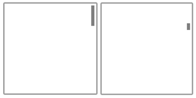

# Руководство по функции сдвига

\[ Обновлено для приложений UWP в Windows 10. Статьи, касающиеся Windows 8.x, см. в разделе [Архив](http://go.microsoft.com/fwlink/p/?linkid=619132) \]

**Важные API**

-   [**Windows.UI.Input**](https://msdn.microsoft.com/library/windows/apps/br242084)
-   [**Windows.UI.Xaml.Input**](https://msdn.microsoft.com/library/windows/apps/br227994)

Сдвиг или прокрутка обеспечивают пользователю навигацию в рамках единого представления, позволяя просматривать содержимое, которое выходит за пределы окна просмотра. Примеры представлений включают структуру папок компьютера, библиотеку документов или фотоальбом.

## Рекомендации

**Индикаторы сдвига и полосы прокрутки**

-   Перед загрузкой содержимого в приложение убедитесь, что возможен сдвиг (прокрутка).

-   Отображайте индикаторы сдвига и полосы прокрутки, чтобы давать подсказки о расположении и размере. Скрывайте их, если в приложении реализован специальный метод навигации.

    **Примечание.**  В отличие от стандартных полос прокрутки индикаторы сдвига являются исключительно источником информации. Они не предоставляются для устройств ввода, и с ними нельзя производить никаких манипуляций.

     

**Сдвиг вдоль одной оси (одномерное переполнение)**

-   Применяйте сдвиг вдоль одной оси для областей содержимого, выходящих за одну из границ окна просмотра (вертикальную или горизонтальную).

    -   Вертикальный сдвиг для одномерного списка элементов.
    -   Горизонтальный сдвиг для сетки элементов.
-   Не используйте обязательные точки переключения для сдвига по одной оси, если пользователь должен иметь возможность производить сдвиг и останавливаться между точками переключения. Обязательные точки переключения гарантируют, что пользователь остановится на точке переключения. Вместо этого используйте бесконтактные точки переключения.

**Свободный сдвиг (двухмерное переполнение)**

-   Применяйте сдвиг по двум осям для областей содержимого, которые выходят за обе границы окна просмотра (вертикальную и горизонтальную).

    -   Переопределите поведение направляющих и используйте свободный сдвиг для неорганизованного содержимого, которое пользователь, вероятно, будет двигать в различных направлениях.
-   Свободный сдвиг обычно подходит для переходов внутри изображений и карт.

**Представление с разбиением на страницы**

-   Используйте обязательные точки прикрепления, если содержимое состоит из несвязанных элементов или требуется показать какой-либо элемент полностью. Это может относиться к страницам книги или журнала, колонке элементов или отдельным изображениям.

    -   На каждой логической границе должна быть размещена точка переключения.
    -   Размер каждого элемента должен быть подобран так, чтобы он помещался в области просмотра.

**Логические и важные точки**

-   Используйте бесконтактные точки прикрепления, если в содержимом присутствуют ключевые точки или логические области, в которых пользователь часто будет останавливаться. Например, это заголовок раздела.

-   Если указаны максимальный и минимальный размер или границы, с помощью визуальной обратной связи необходимо показать, когда пользователь достигает этих границ или превышает их.

**Связывание встроенного или вложенного содержимого**

-   Используйте сдвиг вдоль одной оси (обычно горизонтальной) и макеты столбцов для содержимого на основе текста и сеток. В этих случаях содержимое обычно переносится и естественным образом перетекает из столбца в столбец, благодаря чему взаимодействие с пользователем остается единообразным и обнаруживаемым в различных приложениях Магазина Windows.

-   Не используйте встроенные области сдвига для отображения текста или элементов списка. Поскольку индикаторы сдвига и полосы прокрутки отображаются только при обнаружении ввода внутри такой области, то и взаимодействие с пользователем не является интуитивным и обнаруживаемым.

-   Не помещайте области сдвига одну за другой или друг в друга, если обе они поддерживают сдвиг в одном направлении, как показано ниже. Это может привести к тому, что родительская область будет непроизвольно сдвигаться при достижении границы сдвига в дочерней области. Размещайте плоскости сдвигов перпендикулярно друг другу.

    

## Дополнительные рекомендации по использованию

При сенсорном взаимодействии сдвиг с помощью жеста прокрутки или скольжения одним или несколькими пальцами похож на прокрутку с помощью мыши. Сдвиг больше похож на поворот колесика мыши или перетаскивание ползунка полосы прокрутки, чем на щелчок в полосе прокрутки. Мы будем называть обе эти операции сдвигом, если они не различаются в API и их не требуется различать в специальном пользовательском интерфейсе Windows для конкретного устройства.

В зависимости от устройства ввода пользователь осуществляет сдвиг соответствующей области с помощью следующих элементов.

-   Мыши, сенсорной панели или активного пера для нажатия кнопки со стрелкой для прокрутки, перетаскивания ползунка полосы прокрутки или щелчка в пределах полосы прокрутки.
-   Колесика мыши для эмуляции перетаскивания ползунка полосы прокрутки.
-   Расширенные кнопки (XBUTTON1 и XBUTTON2), если они поддерживаются мышью.
-   Клавиш со стрелками на клавиатуре для эмуляции перетаскивания ползунка полосы прокрутки или клавиш на странице для эмуляции нажатия полосы прокрутки.
-   Касания, сенсорной панели или неактивного пера для скольжения или прокрутки пальцами в нужном направлении.

Скольжение подразумевает медленное перемещение пальцев в направлении сдвига. В результате скольжения содержимое передвигается с той же скоростью и на то же расстояние, что и пальцы. В результате прокрутки (быстрого скольжения и поднимания пальцев) к анимации сдвига применяются следующие физические эффекты.

-   Замедление (инерция). Если пользователь убирает пальцы, сдвиг начинает замедляться. Это происходит подобно замедлению скольжения на скользкой поверхности.
-   Амортизация. Движущая сила сдвига во время замедления вызывает слабый эффект отражения, если достигается точка прикрепления или граница области содержимого.

**Виды сдвигов**

Windows 8 поддерживает три вида сдвигов.

-   Сдвиг по одной оси поддерживается только в одном направлении (горизонтальном или вертикальном).
-   "Рельсовый" сдвиг поддерживается во всех направлениях. Тем не менее, когда пользователь пересекает пороговое значение расстояния в определенном направлении, сдвиг ограничивается этой осью.
-   Свободный сдвиг поддерживается во всех направлениях.

**Пользовательский интерфейс сдвига**

Взаимодействие сдвига обладает уникальными для каждого устройства ввода особенностями, но в любом случае обеспечивает схожие возможности.

**Области, поддерживающие сдвиг**
Области, поддерживающие сдвиг, доступны разработчикам приложений Магазина Windows на JavaScript во время разработки посредством каскадных таблиц стилей (CSS).

Есть два режима отображения сдвига в зависимости от обнаруженного устройства ввода.

-   Индикаторы сдвига для сенсорного ввода.
-   Полосы прокрутки для других устройств ввода, в том числе мыши, клавиатуры и пера.

**Примечание.**  Индикаторы сдвига видны, только когда контактная область касания находится в пределах области, поддерживающей сдвиг. Аналогичным образом полоса прокрутки отображается, только когда указатель мыши, курсор пера или фокус клавиатуры находится в области, поддерживающей прокрутку.

 

**Индикаторы сдвига**
Индикатор сдвига похож на ползунок полосы прокрутки. Ширина индикатора сдвига обратно пропорциональна длине отображаемого содержимого. Расположение индикатора сдвига указывает на расположение просматриваемого содержимого относительно всей области просмотра.

На следующем рисунке показаны две области разной длины с индикаторами сдвига.

**Функции сдвига**
**Точки прикрепления**
Сдвиг жестом прокрутки добавляет во взаимодействие эффект инерции, когда прекращается сенсорный контакт. В результате инерции содержимое продолжает сдвигаться даже в отсутствие движения пользователя, пока не пройдет некоторое пороговое расстояние. Точки прикрепления позволяют настраивать эффект инерции.

Они задают логические остановки в содержимом приложения. С точки зрения пользователя точки прикрепления выступают как механизм разбивки на страницы, избавляя его от лишних жестов прокрутки и перетаскивания в крупных областях сдвига. С помощью точек прикрепления можно исправлять неточности сенсорного ввода и обеспечивать отображение определенной части важной информации в окне просмотра.

Существует два типа точек прикрепления.

-   Бесконтактные. Точка прикрепления выбирается после завершения контакта, если инерция прекращается в пределах порогового расстояния точки прикрепления. Сдвиг может останавливаться между двумя бесконтактными точками прикрепления.
-   Обязательные. Выбираемая точка прикрепления располагается непосредственно до или после последней точки прикрепления, пересеченной перед завершением контакта (в зависимости от направления и скорости жеста). Сдвиг должен останавливаться только в обязательной точке прикрепления.

Точки прикрепления используются в приложениях, которые имитируют разбивку содержимого на страницы или содержат логически сгруппированные элементы, поддерживающие динамическую перегруппировку для обеспечения соответствия окну просмотра или экрану, например в веб-браузерах и приложениях для просмотра фотографий.

На следующих рисунках показано, как сдвиг до определенной точки приводит к автоматическому сдвигу содержимого до логического расположения.

|                                                                |                                                                                         |                                                                                                                 |
|----------------------------------------------------------------|-----------------------------------------------------------------------------------------|-----------------------------------------------------------------------------------------------------------------|
|  |  |  |
| Прокрутите для сдвига.                                                  | Прекратите сенсорный контакт.                                                                     | Область для сдвига останавливается в точке прикрепления, а не в точке, где прекращен сенсорный контакт.                                |

 

**Ограничители**
Высота и ширина содержимого могут превышать размеры и разрешение устройства отображения. Поэтому часто требуется двухмерный сдвиг (по горизонтали и вертикали). В этом случае ограничители улучшают взаимодействие с пользователем, давая преимущество сдвигу вдоль осей движения (вертикальной или горизонтальной).

Принцип работы ограничителей показан на следующем рисунке.

**Связывание встроенного или вложенного содержимого**

Когда пользователь достигает предела масштабирования или прокрутки для элемента, вложенного в другой масштабируемый или прокручиваемый элемент, можно указать, должен ли родительский элемент продолжать операцию масштабирования или прокрутки, начатую в его дочернем элементе. Это называется связыванием масштабирования или прокрутки.

Связывание используется для областей, которые поддерживают сдвиг в одном направлении и содержат дочерние области, которые, в свою очередь, поддерживают сдвиг в одном направлении или сдвиг в произвольных направлениях (при касании в одной из дочерних областей). При достижении границы сдвига дочерней области в определенном направлении активируется сдвиг в родительской области в том же направлении.

Если область сдвига расположена внутри другой области сдвига, то между контейнером и встроенным содержимым должно быть достаточно свободного пространства. На следующих рисунках показана область сдвига, которая расположена внутри другой области сдвига. Каждая из этих областей поддерживает сдвиг перпендикулярно сдвигу другой области. Пользователям достаточно пространства для сдвига в каждой области.

Если свободного пространства недостаточно, как видно на следующем рисунке, встроенная область сдвига может повлиять на возможности сдвига в контейнере и привести к непроизвольному сдвигу в одной или нескольких областях.

Этот способ также полезен для приложений, например фотоальбомов или карт, которые поддерживают как свободный сдвиг в пределах отдельной фотографии или карты, так и сдвиг вдоль одной оси в альбоме (до предыдущей или следующей фотографии) или в области сведений. В приложениях, где показывается область сведений или область параметров, соответствующая изображению или карте, поддерживающей свободный сдвиг, рекомендуется начинать создание макета с области сведений или параметров, поскольку область свободного сдвига изображения или карты может вызывать конфликт со сдвигом в области сведений.

## Связанные статьи

* [Настраиваемые взаимодействия с пользователем](https://msdn.microsoft.com/library/windows/apps/mt185599)
* [Оптимизация ListView и GridView](https://msdn.microsoft.com/library/windows/apps/mt204776)
* [Специальные возможности клавиатуры](https://msdn.microsoft.com/library/windows/apps/mt244347)
**Примеры**
* [Пример базового ввода](http://go.microsoft.com/fwlink/p/?LinkID=620302)
* [Пример ввода с малой задержкой](http://go.microsoft.com/fwlink/p/?LinkID=620304)
* [Пример режима взаимодействия с пользователем](http://go.microsoft.com/fwlink/p/?LinkID=619894)
* [Пример визуальных элементов фокуса](http://go.microsoft.com/fwlink/p/?LinkID=619895)
**Примеры из архива**
* [Ввод: пример событий пользовательского ввода на XAML](http://go.microsoft.com/fwlink/p/?linkid=226855)
* [Ввод: пример возможностей устройств](http://go.microsoft.com/fwlink/p/?linkid=231530)
* [Ввод: пример тестирования сенсорного ввода](http://go.microsoft.com/fwlink/p/?linkid=231590)
* [Пример прокрутки, сдвига и масштабирования на XAML](http://go.microsoft.com/fwlink/p/?linkid=251717)
* [Ввод: пример упрощенного рукописного ввода](http://go.microsoft.com/fwlink/p/?linkid=246570)
* [Ввод: пример жестов в Windows 8](http://go.microsoft.com/fwlink/p/?LinkId=264995)
* [Ввод: пример управления и жестов (C++)](http://go.microsoft.com/fwlink/p/?linkid=231605)
* [Пример сенсорного ввода в DirectX](http://go.microsoft.com/fwlink/p/?LinkID=231627)
 

 

<!--HONumber=Mar16_HO1-->

