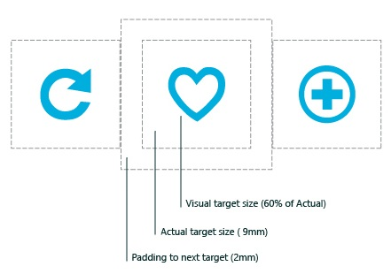

# Руководство по определению цели касания

При определении цели касания в Windows используется вся контактная область каждого пальца, обнаруженная сенсорным дигитайзером. Более значительный и сложный набор данных ввода, сообщаемый дигитайзером, используется для повышения точности при определении намеченного пользователем (или наиболее вероятного) целевого объекта.

**Важные API**

-   [**Windows.UI.Core**](https://msdn.microsoft.com/library/windows/apps/br208383)
-   [**Windows.UI.Input**](https://msdn.microsoft.com/library/windows/apps/br242084)
-   [**Windows.UI.Xaml.Input**](https://msdn.microsoft.com/library/windows/apps/br227994)

В этом разделе описано использование геометрии контакта для цели касания и приводятся рекомендации для целей касания в приложениях UWP.

## Единицы измерения и масштабирование

Для сохранения единообразия размеры целей всегда представляются в физических единицах (миллиметрах), вне зависимости от размеров экрана и плотности пикселей. Физические единицы можно преобразовать в пиксели по следующей формуле:

Количество пикселей = плотность пикселей × единица измерения

В следующем примере эта формула используется для вычисления размера целевого объекта 9 мм в пикселях для дисплея с плотностью 135 пикселей на дюйм в позиции масштабирования 1x:

Количество пикселей = 135 пикселей на дюйм × 9 мм

Количество пикселей = 135 пикселей на дюйм × (0,03937 дюймов на мм × 9 мм)

Количество пикселей = 135 пикселей на дюйм × 0,35433 дюйма

Количество пикселей = 48 пикселей

Этот результат необходимо откорректировать в соответствии с каждой позицией масштабирования системы.

## Пороговые значения

Пороговые значения расстояния и времени можно использовать для определения результата взаимодействия.

Например, при обнаружении нажатия система регистрирует его как касание, если при этом объект смещается менее чем на 2,7 мм от точки касания и если пользователь отрывает от него палец через 0,1 секунды или раньше. Перемещение пальца за пределы порогового значения 2,7 мм расценивается как перетаскивание объекта, и объект либо выделяется, либо перемещается (подробнее см. [Руководство по скольжению по диагонали](guidelines-for-cross-slide.md)). В зависимости от специфики вашего приложения при удерживании пальца на объекте дольше 0,1 секунды система может произвести взаимодействие самообнаружения (подробнее см. [Руководство по визуальной обратной связи](guidelines-for-visualfeedback.md#selfreveal)).

## Размеры цели

В общем случае задавайте в качестве цели касания квадрат со стороной 9 мм или больше (48 x 48 пикселей на экране 135 точек на дюйм при уровне масштабирования 1,0). Не используйте в качестве цели касания квадрат со стороной меньше 7 мм.

Схема ниже служит иллюстрацией того, как размер обычно является комбинацией визуальной цели, размера фактической цели и заполнения между фактической целью и другими потенциальными целями.

В следующей таблице перечислены минимальные и рекомендуемые размеры для компонентов цели касания.

<table>
<colgroup>
<col width="33%" />
<col width="33%" />
<col width="33%" />
</colgroup>
<thead>
<tr class="header">
<th align="left">Компонент цели</th>
<th align="left">Минимальный размер</th>
<th align="left">Рекомендуемый размер</th>
</tr>
</thead>
<tbody>
<tr class="odd">
<td align="left">Заполнение</td>
<td align="left">2 мм</td>
<td align="left">Не применимо.</td>
</tr>
<tr class="even">
<td align="left">Визуальный размер цели</td>
<td align="left">&lt; 60 % от фактического размера</td>
<td align="left">90–100 % от фактического размера

У большинства пользователей визуальный объект размером меньше квадрата со стороной 4,2 мм (60 % от рекомендуемого минимального размера 7 мм) не будет восприниматься как цель касания.
</td>
</tr>
<tr class="odd">
<td align="left">Истинный размер цели</td>
<td align="left">Квадрат со стороной 7 мм</td>
<td align="left">Квадрат со стороной, равной или превышающей 9 мм (48 x 48 пикселей при масштабе 1)</td>
</tr>
<tr class="even">
<td align="left">Общий размер цели</td>
<td align="left">11 x 11 мм (приблизительно 60 пикс.: три единицы сетки по 20 пикс. при 1x)</td>
<td align="left">13,5 x 13,5 мм (72 x 72 пикс. при 1x)

Подразумевается, что совокупный размер фактической цели и заполнения больше, чем их соответствующие минимальные размеры.
</td>
</tr>
</tbody>
</table>

 

Эти рекомендации по размеру цели можно скорректировать для конкретного сценария. При разработке рекомендаций учитывались следующие соображения.

-   Частота касаний: размер целей, к которым часто или неоднократно прикасаются, должен быть больше минимального.
-   Результат ошибки: цели, ошибочное касание которых ведет к серьезным последствиям, должны иметь большее заполнение и размещаться дальше от края области содержимого. Это особенно важно для целей, которых часто касаются.
-   Положение в области содержимого
-   Конструктивные параметры и размер экрана
-   Положение пальцев
-   Зрительные образы сенсорного ввода
-   Оборудование и сенсорные дигитайзеры

## Вспомогательные средства для определения цели касания

Windows поддерживает вспомогательные средства для определения цели касания в сценариях, где рекомендуемые здесь минимальный размер и заполнение неприменимы. Это касается, например, гиперссылок на веб-странице, элементов управления календаря, раскрывающихся списков и полей со списком или выделения текста.

Эти улучшения платформы для определения цели касания и расширение функциональности пользовательского интерфейса в сочетании с визуальной реакцией (пользовательский интерфейс без неоднозначности) повышают точность и позволяют пользователю действовать увереннее. Подробнее см. в разделе [Рекомендации по визуальной обратной связи](guidelines-for-visualfeedback.md).

Если необходимо, чтобы размер элемента, являющегося целью касания, был меньше рекомендуемого минимального размера, то для устранения проблем с определением цели касания можно использовать следующие приемы.

## Пограничный контакт

Пограничный контакт — это визуальные подсказки (соединитель между точкой контакта и ограничивающим прямоугольником объекта), которые сообщают пользователю о соединении и взаимодействии с объектом, хотя контакт ввода не находится в непосредственном соприкосновении с объектом. Это может происходить, если:

-   В пределах порогового значения близкого взаимодействия был обнаружен сенсорный контакт и этот объект был определен как наиболее вероятная цель контакта.
-   Сенсорный контакт был перемещен с объекта, но все еще находится в пределах порогового значения близкого взаимодействия.

Эта функция недоступна для приложений Магазина Windows, разработанных на JavaScript.

## Проведение

Проведение подразумевает, что для выбора цели пользователь касается поля целей и проводит пальцем, не отрывая его, пока не пересечет цель. Иначе это можно назвать "активацией отрывом", поскольку так активируется последний объект, которого коснулся палец, прежде чем оторваться от экрана.

Проектируя взаимодействия при проведении пальцем по элементам учитывайте следующие рекомендации.

-   Функция проведения используется в сочетании с пользовательским интерфейсом без неоднозначности. Подробнее см. в разделе [Рекомендации по визуальной обратной связи](guidelines-for-visualfeedback.md).
-   Рекомендованный минимальный размер цели касания для проведения — 20 пикс. (3,75 мм при 1x).
-   Проведение имеет приоритет при выполнении на сдвигаемой поверхности, например на веб-странице.
-   Цели при проведении должны располагаются близко друг к другу.
-   Действие будет отменено, если пользователь проведет пальцем по направлению от цели.
-   Пограничный контакт с целью проведения задается, если действие, выполняемое целью, не несет деструктивный характер (например, переключение дат в календаре).
-   Пограничный контакт задается в одном направлении, горизонтальном или вертикальном.

## Связанные разделы

**Примеры**
* [Пример базового ввода](http://go.microsoft.com/fwlink/p/?LinkID=620302)
* [Пример ввода с малой задержкой](http://go.microsoft.com/fwlink/p/?LinkID=620304)
* [Пример режима взаимодействия с пользователем](http://go.microsoft.com/fwlink/p/?LinkID=619894)
* [Пример визуальных элементов фокуса](http://go.microsoft.com/fwlink/p/?LinkID=619895)

**Примеры архива**
* [Ввод: пример событий пользовательского ввода на XAML](http://go.microsoft.com/fwlink/p/?linkid=226855)
* [Ввод: пример возможностей устройств](http://go.microsoft.com/fwlink/p/?linkid=231530)
* [Ввод: пример тестирования сенсорного ввода](http://go.microsoft.com/fwlink/p/?linkid=231590)
* [Пример прокрутки, сдвига и масштабирования на XAML](http://go.microsoft.com/fwlink/p/?linkid=251717)
* [Ввод: пример упрощенного рукописного ввода](http://go.microsoft.com/fwlink/p/?linkid=246570)
* [Ввод: пример жестов в Windows 8](http://go.microsoft.com/fwlink/p/?LinkId=264995)
* [Ввод: пример управления и жестов (C++)](http://go.microsoft.com/fwlink/p/?linkid=231605)
* [Пример сенсорного ввода в DirectX](http://go.microsoft.com/fwlink/p/?LinkID=231627)
 

 

<!--HONumber=Jun16_HO5-->

