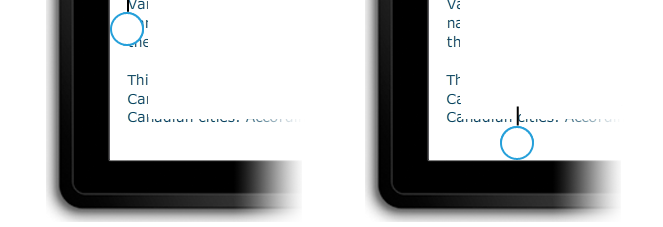
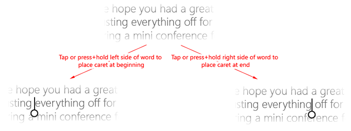
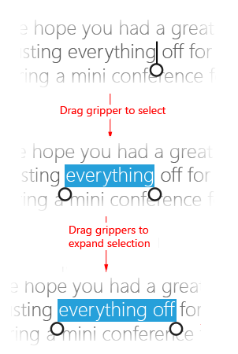
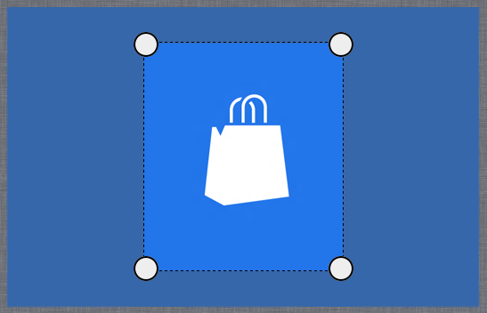

# Выделение текста и изображений
<link rel="stylesheet" href="https://az835927.vo.msecnd.net/sites/uwp/Resources/css/custom.css">

В этой статье описывается выделение и обработка текста, изображений и элементов управления, а также представлены рекомендации по взаимодействию с пользователем, которые следует учитывать при использовании этих механизмов в приложениях.

<b>Важные API</b> 
<ul>
<li>[**Windows.UI.Xaml.Input**](https://msdn.microsoft.com/library/windows/apps/br227994)</li>
<li>[**Windows.UI.Input**](https://msdn.microsoft.com/library/windows/apps/br242084)</li>
</ul>

 

## Рекомендации

-   Используйте глифы шрифтов при реализации собственного пользовательского интерфейса захвата. Захват представляет собой сочетание двух шрифтов Segoe UI, доступных в системе. Использование ресурсов шрифтов упрощает отрисовку при различных значениях DPI и хорошо работает с различными уровнями масштабирования пользовательского интерфейса. При реализации собственных захватов они должны обладать следующими характеристиками пользовательского интерфейса:

    -   круглая форма;
    -   видимость на любом фоне;
    -   согласованный размер.
-   Создать поле вокруг доступного для выбора содержимого, чтобы разместить пользовательский интерфейс захвата. Если ваше приложение допускает выделение текста в области, которая не затрагивается функциями сдвига и прокрутки, оставьте 1/2 поля захвата слева и справа от области текста, а также 1 высоту захвата сверху и снизу от области текста (как показано на следующих иллюстрациях). Это обеспечит доступность всего пользовательского интерфейса захвата для пользователя и минимизирует случайные взаимодействия с другими элементами пользовательского интерфейса, привязанными к границам экрана.

    

-   Скрывайте пользовательский интерфейс захватов во время взаимодействия. Исключает загораживание экрана захватами во время взаимодействия. Это особенно удобно, когда захват не полностью скрыт пальцем или существует несколько захватов выделения текста. Это исключает появление визуальных артефактов при отображении дочерних окон.

-   Не допускайте выбора таких элементов пользовательского интерфейса, как элементы управления, наклейки, рисунки, защищаемое содержимое и т. д. Обычно приложения для Windows допускают выделение только определенного набора элементов управления. Такие элементы управления, как кнопки, метки и логотипы, не выделяются. Подумайте, необходимо ли выделение в вашем приложении, и если да, то определите области пользовательского интерфейса, в которых выделение следует запретить. 

## Дополнительные рекомендации по использованию

Выделение текста и манипулирование им принадлежат к числу самых сложных задач, возникающих при использовании сенсорного взаимодействия. Ввод с помощью мыши, пера и клавиатуры в высшей степени точен: щелчок мыши или контакт пера обычно сопоставляются с определенным пикселем, а клавиша либо нажата, либо нет. Сенсорный ввод неточен. Сложно сопоставить всю поверхность пальца с определенными координатами X и Y на экране, чтобы точно установить курсор.

**Рекомендации**

С помощью встроенных элементов управления, доступных через языковые структуры в Windows, создавайте приложения, которые обеспечивают полное взаимодействие с пользователем платформы, в том числе поведение при выделении и манипуляциях. Функций взаимодействия, которые предоставляют встроенные элементы управления, вполне достаточно для большинства приложений UWP.

При использовании стандартных элементов управления текстом UWP, функции выделения и визуальные элементы, описанные в этом разделе, невозможно настроить.

**Выделение текста**

Если для вашего приложения требуется настраиваемый пользовательский интерфейс, который поддерживает выделение текста, рекомендуется придерживаться описанных здесь функций выделения Windows.

**Редактируемое и нередактируемое содержимое**

При сенсорном взаимодействии для выделения используются в основном жесты, например касание для установки курсора или выделения слова и скользящее движение для изменения выделения. Как и в случае других сенсорных взаимодействий Windows, основанные на времени взаимодействия нажатия и удерживания используются для отображения информационного пользовательского интерфейса. Подробнее см. в разделе [Руководство по визуальной обратной связи](guidelines-for-visualfeedback.md).

Windows распознает два возможных состояния взаимодействий выделения — редактируемое и нередактируемое — и настраивает пользовательский интерфейс выделения, реакцию и функции соответствующим образом.

**Редактируемое содержимое**

Касание левой части слова помещает курсор непосредственно слева от слова, а касание правой части — непосредственно справа от слова.

Следующее изображение демонстрирует, как установить начальный курсор вставки с захватом, коснувшись экрана рядом с началом или концом слова.

Следующее изображение демонстрирует, как регулировать выделение, перетаскивая захват.

Следующее изображение демонстрирует, как вызвать контекстное меню, коснувшись выделения или захвата (можно также использовать нажатие и удерживание).

**Примечание.** В случае неверно написанного слова эти взаимодействия несколько изменяются. Если вы коснетесь слова, которое отмечено как неверно написанное, вы тем самым выделите все слово и вызовете контекстное меню с предложением вариантов написания.

 

**Нередактируемое содержимое**

Следующее изображение демонстрирует, как выделить слово, коснувшись его (пробелы не включены в начальное выделение).

Выполните те же действия, что и для редактируемого текста, чтобы отрегулировать выделение и вызвать контекстное меню.

**Манипулирование объектами**

При реализации специального манипулирования объектами в приложении UWP по возможности используйте те же (или сходные) ресурсы захвата, что и для выделения текста. Это помогает обеспечить согласованное взаимодействие в масштабах платформы.

Например, захваты можно также использовать в графических редакторах, поддерживающих изменение размеров и обрезку, либо в приложениях проигрывателей мультимедиа, содержащих настраиваемые индикаторы выполнения, как показано на следующих рисунках.

*Проигрыватель мультимедиа с настраиваемым индикатором выполнения.*

*Редактор изображений с захватами обрезки.*

## Связанные разделы

**Для разработчиков**
* [Настраиваемые взаимодействия с пользователем](https://msdn.microsoft.com/library/windows/apps/mt185599)

**Примеры**
* [Пример базового ввода](http://go.microsoft.com/fwlink/p/?LinkID=620302)
* [Пример ввода с малой задержкой](http://go.microsoft.com/fwlink/p/?LinkID=620304)
* [Пример режима взаимодействия с пользователем](http://go.microsoft.com/fwlink/p/?LinkID=619894)
* [Пример визуальных элементов фокуса](http://go.microsoft.com/fwlink/p/?LinkID=619895)

**Примеры архива**
* [Ввод: пример событий пользовательского ввода на XAML](http://go.microsoft.com/fwlink/p/?linkid=226855)
* [Ввод: пример возможностей устройств](http://go.microsoft.com/fwlink/p/?linkid=231530)
* [Ввод: пример тестирования сенсорного ввода](http://go.microsoft.com/fwlink/p/?linkid=231590)
* [Пример прокрутки, сдвига и масштабирования на XAML](http://go.microsoft.com/fwlink/p/?linkid=251717)
* [Ввод: пример упрощенного рукописного ввода](http://go.microsoft.com/fwlink/p/?linkid=246570)
* [Ввод: пример жестов в Windows 8](http://go.microsoft.com/fwlink/p/?LinkId=264995)
* [Ввод: пример управления и жестов (C++)](http://go.microsoft.com/fwlink/p/?linkid=231605)
* [Пример сенсорного ввода в DirectX](http://go.microsoft.com/fwlink/p/?LinkID=231627)
 

 

