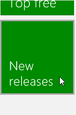

# Руководство по визуальной обратной связи

Используйте визуальную обратную связь, чтобы показать пользователю, что его взаимодействие с приложением обнаружено, интерпретировано и обработано. Визуальная обратная связь поможет пользователю и вдохновит его на дальнейшие действия. Она указывает на успешное взаимодействие, что повышает у пользователя чувство уверенности. Кроме того, визуальная обратная связь транслирует состояние системы и снижает количество ошибок.

**Важные API**

-   [**Windows.Devices.Input**](https://msdn.microsoft.com/library/windows/apps/br225648)
-   [**Windows.UI.Input**](https://msdn.microsoft.com/library/windows/apps/br242084)
-   [**Windows.UI.Core**](https://msdn.microsoft.com/library/windows/apps/br208383)

## Рекомендации

-   Предоставляйте визуальную обратную связь даже при самом кратком контакте. Это поможет пользователю:
    -   убедиться, что сенсорный экран в рабочем состоянии;
    -   определить, включается ли целевой объект касанием или он обеспечивает отклик;
    -   определить, не промахнулся ли пользователь при выборе целевого объекта.
-   Немедленно отображать обратную связь для всех событий взаимодействия.
-   Предоставлять обратную связь в виде ненавязчивых, интуитивных подсказок, не отвлекающих внимание пользователя.
-   Обеспечить "прилипание" к пальцу целевого объекта касания во время манипуляций.
-   Включить выбор элементов с помощью жеста прокрутки, когда сдвиг ограничен одним направлением.
-   Не используйте визуализацию касаний в случаях, когда они могут помешать использованию приложения. Подробнее см. в разделе [**ShowGestureFeedback**](https://msdn.microsoft.com/library/windows/apps/br241969).
-   Не используйте визуальную обратную связь, если в этом нет абсолютной необходимости. Не засоряйте пользовательский интерфейс визуальной обратной связью, если она не добавляет чего-то, чего больше нет нигде. Не показывайте всплывающие подсказки, если они повторяют уже видимый текст. Всплывающие подсказки следует использовать только в специфических случаях, например при усечении текста (текст с многоточием), который не отображается при выборе элемента, либо если требуется дополнительная информация для понимания или использования приложения.
-   Используйте жест нажатия и удерживания только для информационного пользовательского интерфейса.  
    **Важно!** Нажатие и удерживание можно использовать для выбора в случаях, когда включен и горизонтальный, и вертикальный сдвиг.    
-   Не настраивайте расширения функциональности визуальной обратной связи встроенных жестов Windows 8, поскольку это может вызвать несогласованность при взаимодействии и ввести пользователей в замешательство.
-   Не используйте визуальную обратную связь при сдвиге или перетаскивании — достаточно фактического перемещения объектов на экране. Однако если область содержимого не сдвигается и не прокручивается, используйте зрительные образы, чтобы указать граничные условия. Подробные сведения см. в разделе [Руководство по функции сдвига](guidelines-for-panning.md).
-   Не используйте визуальную обратную связь для элемента управления, который не является целью. Обратная связь особенно важна, если сенсорный ввод применяется для действий, которые требуют правильного и точного указания места. Показывая обратную связь всякий раз, когда обнаруживается сенсорный ввод, вы позволите пользователю понять всю эвристику нацеливания, определяемую приложением и его элементами управления.
-   Не используйте обратную связь, поведение которой предназначено для одного типа ввода, с другим типом. Например, прямоугольник фокуса на клавиатуре должен использоваться только при вводе с клавиатуры, а не для касаний.

## Дополнительные рекомендации по использованию

Зрительные образы контакта особенно важны для сенсорного взаимодействия, в котором требуется точность. Например, ваше приложение должно четко показывать место касания, чтобы пользователь знал, попал ли он в цель, насколько он промахнулся и какую поправку следует внести.

Используйте элементы управления платформы, доступные через языковые платформы приложений Магазина Windows (приложения Магазина Windows на JavaScript и приложения Магазина Windows на C++, C\# или Visual Basic), чтобы бесплатно получить зрительные образы Windows 8. Если в вашем приложении есть настраиваемые взаимодействия, требующие особой обратной связи, необходимо убедиться, что обратная связь адекватна, поддерживает различные устройства ввода и не отвлекает пользователя от работы. Это может иметь особое значение в игровых приложениях или графических редакторах, где визуальная обратная связь может закрывать или даже блокировать критически важные элементы интерфейса.

[!IMPORTANT] Не рекомендуется менять реакцию на события взаимодействия встроенных жестов. 

### Пользовательский интерфейс обратной связи

Пользовательский интерфейс обратной связи обычно зависит от устройства ввода (сенсорный экран, сенсорная панель, мышь, перо, клавиатура и пр.). Например, встроенная обратная связь для мыши обычно предусматривает перемещение и изменение курсора, тогда как для касания и пера требуются зрительные образы контакта, а при вводе и навигации с клавиатуры используются прямоугольники фокуса и выделение.

Обратная связь для жестов платформы настраивается в свойстве [**ShowGestureFeedback**](https://msdn.microsoft.com/library/windows/apps/br241969).

Настраивая интерфейс обратной связи, убедитесь, что обеспечивается обратная связь, адекватно поддерживающая все режимы ввода.

Ниже приведено несколько примеров встроенных зрительных образов контакта в Windows.

|  |  |  |  | 
| --- | --- | --- | --- |
| Зрительные образы касания | Зрительные образы для мыши и сенсорной панели | Зрительные образы для пера | Зрительные образы для клавиатуры |

### Информационный интерфейс (всплывающие окна)

Одна из основных форм визуальной обратной связи — это информационный пользовательский интерфейс (или пользовательский интерфейс устранения неоднозначности). Информационный интерфейс определяет и отображает информацию об объекте, описывает функции и способ доступа к ним, а при необходимости предлагает инструкции.

Далее представлены различные типы информационного интерфейса, поддерживаемые в приложениях Магазина Windows.

-   Подсказки
-   Подробные подсказки
-   Меню
-   Окна сообщений
-   Всплывающие элементы

Информационный пользовательский интерфейс удобен, в частности, для компенсации перекрытия элементов пальцем и улучшения сенсорного взаимодействия с приложением. В нем даже имеется встроенный специальный жест — нажатие и удерживание.

Нажатие и удерживание представляет собой взаимодействие, основанное на времени, что в Windows 8 обычно не рекомендуется. В этом случае взаимодействие по времени приемлемо, поскольку оно служит средством обучения и исследования. Рекомендованная продолжительность зависит от типа информационного пользовательского интерфейса. Ниже приведены рекомендованные пороговые значения времени.

| Тип информационного пользовательского интерфейса | Интервал времени | Активация | Использование |
| --- | --- | --- | --- |
| Всплывающая при заслонении подсказка (для функции "протаскивания" и мелких целевых объектов) | 0 мс | Да | Для быстрого распознавания действий. Обычно используется для команд. |
| Всплывающая при заслонении подсказка (для выполнения действий) | 200 мс | Да | |
| Подробная подсказка | ~2000 мс | Нет | Для неспешного, вдумчивого исследования и изучения. Обычно используется вместе с элементами семейства. |
| Взаимодействие самообнаружения | ~2000 мс | Нет | |
| Контекстное меню | ~2000 мс | Нет | Предоставляет ограниченный набор команд, относящихся к выбранному объекту. |
| Всплывающие элементы | ~2000 мс | Нет | Предоставляет ограниченный набор команд, относящихся к выбранному объекту. |

Подробнее о реализации информационного интерфейса см. в разделах [Создание макета пользовательского интерфейса](https://msdn.microsoft.com/library/windows/apps/hh465304) и [Отображение всплывающих окон](https://msdn.microsoft.com/library/windows/apps/hh738362).

### Подсказки

Дайте с помощью подсказок больше информации об элементе управления, перед тем как просить пользователя выполнить какое-либо действие.

Подсказки ([**Tooltip**](https://msdn.microsoft.com/library/windows/apps/br229763)) появляются автоматически, когда пользователь совершает жест нажатия и удерживания (или обнаруживается событие наведения) на объект или элемент управления. Подсказка исчезает, когда контакт заканчивается или курсор покидает элемент управления или объект. Подсказка может содержать текст и изображения, но не имеет интерактивных функций.

### Всплывающие при заслонении подсказки для мелких целевых объектов

Всплывающие при заслонении подсказки предназначены для описания целевого объекта, когда он заслонен. Они полезны, когда нужно произвести нацеливание и активацию более мелких элементов, чем стандартный целевой объект касания, — таких, например, как гиперссылки на веб-странице.

После определенного временного порога эти всплывающие подсказки можно заменять всплывающим информационным окном. Например, используйте всплывающую при заслонении подсказку, чтобы показать заслоненный текст гиперссылки, и затем замените подсказку всплывающим окном, в котором указан URL-адрес.

### Всплывающие при заслонении подсказки для выполнения действий и команд

Такие всплывающие подсказки описывают действие или команду, которые происходят, когда пользователь отпускает нажатый элемент. Они полезны, когда нужно произвести нацеливание и активацию кнопки или аналогичного элемента управления.

Всплывающая подсказка мелкого целевого объекта может по прошествии определенного временного порога сменяться подсказкой действия. В этом случае всплывающая подсказка мелкого целевого объекта должна развертываться, включая в себя дополнительную информацию из подсказки действия.

### Подробная подсказка

Эти подсказки показывают дополнительную информацию об элементе. Например, в качестве подробной подсказки может выступать текстовое описание изображения, полный текст сокращенного заголовка или другая относящаяся к целевому объекту информация.

Подробные подсказки обычно содержат сведения, которые не требуют немедленного доступа и которые иногда даже мешают, если отображаются слишком быстро. Более длительное пороговое значение позволяет пользователям неспешно изучить информацию.

После отображения подробной всплывающей подсказки объект перестает быть активированным, как только пользователь отрывает от него палец. Это задумано для того, чтобы пользователь мог не активировать данный элемент, если сведения, почерпнутые из подсказки, побудят его принять такое решение.

Мы рекомендуем вам сделать так, чтобы подробная всплывающая подсказка по своей визуальной конструкции и информации отличалась от стандартной подсказки и была более содержательной.

### Контекстное меню

Контекстное меню ([**PopupMenu**](https://msdn.microsoft.com/library/windows/apps/br208693)) — это облегченное меню, предоставляющее пользователю мгновенный доступ к действиям (таким как команды для работы с буфером обмена) с текстом или объектами пользовательского интерфейса в приложениях Магазина Windows.

Оптимизированное для сенсорного ввода контекстное меню состоит из двух частей. Визуальные подсказки и указания отображаются как результат взаимодействия удержания. Само контекстное меню отображается после того, как указание исчезает и пользователь поднимает палец.

Следующее изображение демонстрирует, как вызвать контекстное меню по умолчанию для текста, коснувшись выделения или захвата (можно также использовать нажатие и удерживание).

Подробнее: [Добавление контекстных меню](https://msdn.microsoft.com/library/windows/apps/hh465300).

### Диалоговое окно сообщения

Окна сообщений ([**MessageDialog**](https://msdn.microsoft.com/library/windows/apps/br208674)) позволяют запросить у пользователя ответ в зависимости от состояния приложения или действия пользователя, а затем продолжить работу. Их использование требует явного взаимодействия с пользователем, и ввод в приложение блокируется до ответа пользователя.

Вот типичные причины, по которым открывается окно сообщения.

-   Передача срочной информации
-   Задание вопроса перед продолжением выполнения
-   Отображение сообщений об ошибке

Подробнее: [Добавление диалоговых окон сообщений](https://msdn.microsoft.com/library/windows/apps/hh738361).

### Всплывающий элемент

Всплывающий элемент ([**Flyout**](https://msdn.microsoft.com/library/windows/apps/br211726)) — это облегченная панель пользовательского интерфейса, которая отображается в случае касания, щелчка или другого действия активации и предоставляет пользователю информацию, вопросы или меню вариантов, относящихся к текущему действию. Его легко закрыть (он пропадает, когда пользователь касается или щелкает вне всплывающей панели или нажимает клавишу ESC). Иными словами, всплывающий элемент можно игнорировать.

В отличие от подсказок, всплывающие элементы могут принимать вводимые данные. В отличие от окон сообщений, приложение остается активным и принимает вводимые данные.

Подробнее: [Добавление всплывающих элементов и меню](https://msdn.microsoft.com/library/windows/apps/hh465325).

## Связанные разделы

**Проектировщикам**
* [Руководство по функции сдвига](guidelines-for-panning.md)

**Для разработчиков**
* [Настраиваемые взаимодействия с пользователем](https://msdn.microsoft.com/library/windows/apps/mt185599)

**Образцы**
* [Пример базового ввода](http://go.microsoft.com/fwlink/p/?LinkID=620302)
* [Пример ввода с малой задержкой](http://go.microsoft.com/fwlink/p/?LinkID=620304)
* [Пример режима взаимодействия с пользователем](http://go.microsoft.com/fwlink/p/?LinkID=619894)
* [Пример визуальных элементов фокуса](http://go.microsoft.com/fwlink/p/?LinkID=619895)

**Примеры архива**
* [Ввод: пример событий пользовательского ввода на XAML](http://go.microsoft.com/fwlink/p/?linkid=226855)
* [Ввод: пример возможностей устройств](http://go.microsoft.com/fwlink/p/?linkid=231530)
* [Ввод: пример тестирования сенсорного ввода](http://go.microsoft.com/fwlink/p/?linkid=231590)
* [Пример прокрутки, сдвига и масштабирования на XAML](http://go.microsoft.com/fwlink/p/?linkid=251717)
* [Ввод: пример упрощенного рукописного ввода](http://go.microsoft.com/fwlink/p/?linkid=246570)
* [Ввод: пример жестов в Windows 8](http://go.microsoft.com/fwlink/p/?LinkId=264995)
* [Ввод: пример управления и жестов (C++)](http://go.microsoft.com/fwlink/p/?linkid=231605)
* [Пример сенсорного ввода в DirectX](http://go.microsoft.com/fwlink/p/?LinkID=231627)
 

 

<!--HONumber=May16_HO2-->

