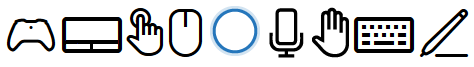
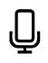
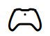

# Азбука взаимодействия

Взаимодействия пользователей в универсальной платформе Windows (UWP) состоят из источников входных и выходных данных (таких как мышь, клавиатура, перо, сенсорный ввод, сенсорная панель, речь, **Кортана**, контроллер, жест, взгляд и т. д.), а также различных режимов или модификаторов, позволяющих расширять возможности (включая колесико и кнопки мыши, кнопки ластика и пера, сенсорную клавиатуру и фоновые службы приложений).

Платформа UWP использует интеллектуальную контекстно-зависимую систему взаимодействия, которая в большинстве случаев избавляет от необходимости по отдельности обрабатывать уникальные типы входных данных, получаемые приложением. Сюда входит сенсорный ввод, а также ввод с помощью сенсорной панели, мыши и пера в качестве обычного типа указателя для поддержки статических жестов, например прикосновения или нажатия с удержанием, жестов операций, например сдвига, или передачи рукописного ввода.

Ознакомьтесь с каждым типом устройства ввода, его поведением, возможностями и ограничениями в сочетании с определенными форм-факторами. Так вам будет проще решить, достаточно ли вашему приложению элементов управления и возможностей платформы и требуется ли специальный пользовательских интерфейс.

## Кортана

Расширение возможностей **Кортаны** в Windows 10 позволяет вам обрабатывать голосовые команды пользователя и запускать приложение для выполнения одного действия.

Поддержка устройств
-   Телефоны и фаблеты
-   Планшет
-   Компьютеры и ноутбуки
-   Surface Hub
-   IoT
-   Xbox
-   HoloLens

Стандартное использование. Голосовая команда — это одно изречение, определенное в файле определения голосовых команд (VCD), которое адресовано установленному приложению через **Кортану**. Приложение может запускаться на переднем плане или в фоновом режиме, в зависимости от уровня и сложности взаимодействия. Например, голосовые команды, для которых необходим дополнительный контекст или пользовательский ввод, наилучшим образом обрабатываются на переднем плане, в то время как основные команды можно обрабатывать в фоновом режиме.

Благодаря интеграции основных функций вашего приложения и предоставлению центральной точки входа пользователю для выполнения большинства задач без непосредственного открытия приложения **Кортана** стала связующим звеном между вашим приложением и пользователем. Во многих случаях это может существенно сэкономить время и усилия пользователя. Дополнительные сведения см. в статье [Рекомендации по проектированию Кортаны](https://msdn.microsoft.com/library/windows/apps/dn974233).

Дополнительные сведения см. в статье [Рекомендации по проектированию Кортаны](https://msdn.microsoft.com/library/windows/apps/dn974233).
 

## Голосовые функции

Голосовые функции — эффективный и естественный способ взаимодействия пользователей с приложениями. Это простой и точный способ взаимодействия с приложениями, который позволяет пользователям продуктивно работать и оставаться в курсе различных ситуаций.

Голосовые функции могут дополнять или, во многих случаях, быть основным типом ввода, в зависимости от устройства. Например, такие устройства, как HoloLens и Xbox не поддерживают традиционные типы ввода (за исключением программной клавиатуры в специфических сценариях). Вместо этого они используют голосовые функции и выходные данные (как правило, в сочетании с другими нетрадиционными типами ввода, например взглядом и жестами) для большинства действий пользователей.

Преобразование текста в речь (также называемое TTS или синтезом речи) позволяет информировать или направлять пользователя.

Поддержка устройств
-   Телефоны и фаблеты
-   Планшет
-   Компьютеры и ноутбуки
-   Surface Hub
-   IoT
-   Xbox
-   HoloLens

Типичное использование

Существует три режима голосового взаимодействия:

Естественный язык  
Мы используем естественный язык каждый день при общении с людьми. Наша речь различается от человека к человеку и от ситуации к ситуации, а также понятна большинству людей. Если это не так, мы часто используем разные слова в разном порядке, чтобы передать такую же идею.

Взаимодействие с приложением на естественном языке действует аналогично: мы обращаемся к приложению как к человеку через устройство, ожидая, что оно поймет нас и отреагирует соответствующим образом.

Естественный язык – это самый совершенный режим голосового взаимодействия, который можно реализовать и сделать доступным с помощью **Кортаны**.

Команды и управление  
Команды и управление – это использование голосовых команд для активации элементов управления и функций, например нажатия кнопки или выбора элемента меню.

Так как команды и управление необходимы для успешной работы пользователя, один тип ввода обычно не рекомендуется. Как правило, голосовые функции — это один из нескольких вариантов ввода, доступных пользователям в зависимости от их предпочтений и возможностей оборудования.

Диктовка  
Самый простой метод голосового ввода. Каждая фраза преобразуется в текст.

Диктовка обычно используется, если приложению не требуется понимать значение или намерение.

Дополнительные сведения см.в разделе [Рекомендации по проектированию голосовых функций](https://msdn.microsoft.com/library/windows/apps/dn596121)
 

## Перо

Перо (или стилус) может служить указывающим устройством с точностью до пикселя, как мышь, и является оптимальным устройством для рукописного ввода.

**Примечание.** Существуют два типа перьев: активный и пассивный.
-   Пассивные перья не содержат электронных компонентов и фактически эмулируют сенсорный ввод пальцем. Для них требуется базовый экран устройства, который распознает ввод по давлению в зоне контакта. Так как пользователи часто кладут руку на сенсорную поверхность, входные данные могут быть повреждены в результате неудачной блокировки прикосновений ладони.
-   Активные перья содержат электронные компоненты и могут работать со сложными экранами устройств, предоставляя системе и приложению намного более подробные входные данные (в том числе данные о наведении и расстоянии). Функция блокировки прикосновений ладони намного более надежна.

 

В этой статье речь идет об активных перьях, предоставляющих подробные входные данные и использующихся в основном для точного рукописного ввода и указания.

Поддержка устройств
-   Телефоны и фаблеты
-   Планшет
-   Компьютеры и ноутбуки
-   Surface Hub
-   IoT

Стандартное использование. Платформа Windows для рукописного ввода в сочетании с пером обеспечивает естественный способ создания рукописных заметок и рисунков. Платформа поддерживает получение данных от дигитайзера, создает данные рукописного ввода, преобразует их в росчерки пера на устройстве вывода, управляет этими данными и выполняет распознавание рукописного ввода. В дополнение к получению данных о пространственном движении пера, когда пользователь пишет или рисует, ваше приложение также может собирать такую информацию, как сила нажатия, форма, цвет и прозрачность, чтобы предложить пользователю результат взаимодействия, очень похожий на рисунок карандашом, ручкой или кистью на бумаге.

Существенное отличие ввода с помощью пера от сенсорного ввода — возможность сенсорной эмуляции прямых взаимодействий с элементами пользовательского интерфейса на экране с использованием физических жестов (прокрутка, сдвиг, перетаскивание, поворот и т. п.).

Для поддержки этих взаимодействий указывайте специальные команды пользовательского интерфейса, или возможности, для пера. Например, используйте кнопки "Предыдущий" и "Следующий" (или кнопки "+" и "-"), чтобы пользователи могли листать страницы содержимого или поворачивать, масштабировать объекты и изменять их размер.

Дополнительные сведения см. разделе [Рекомендации по проектированию функций пера](https://msdn.microsoft.com/library/windows/apps/dn456352)
 

## Сенсорный ввод

Сенсорный ввод позволяет использовать движения одного или нескольких пальцев для имитации прямых манипуляций с элементами пользовательского интерфейса (например, горизонтальной прокрутки, поворота, изменения размера или перемещения), в качестве альтернативного (аналогично мыши или перу) или вспомогательного метода ввода (для изменения аспектов другого метода ввода, например для размазывания росчерка пера). Подобные тактильные взаимодействия могут обеспечить более естественные и реальные ощущения для пользователей при взаимодействии с элементами на экране.

Поддержка устройств
-   Телефоны и фаблеты
-   Планшет
-   Компьютеры и ноутбуки
-   Surface Hub
-   IoT

Стандартное использование. Поддержка сенсорного ввода может в значительной степени зависеть от устройства.

Некоторые устройства вообще не поддерживают сенсорный ввод, некоторые поддерживают одиночные прикосновения, а другие — мультисенсорный ввод (несколько касаний).

Большинство устройств, поддерживающих мультисенсорный ввод, распознают десять уникальных касаний одновременно.

Устройства Surface Hub распознают 100 уникальных касаний одновременно.

Как правило, сенсорный ввод:

-   предназначен для одного пользователя, если не используется устройство Microsoft Team, например Surface Hub, где особое внимание уделяется совместной работе;
-   не ограничена ориентацией устройства;
-   используется для всех видов взаимодействия, включая текстовый (сенсорная клавиатура) и рукописный ввод (настраивается приложением).

Дополнительные сведения см. в разделе [Рекомендации по проектированию сенсорных функций](https://msdn.microsoft.com/library/windows/apps/hh465370)
 

## Сенсорная панель

Сенсорная панель объединяет в себе косвенный мультисенсорный ввод и точный ввод с помощью указывающего устройства, например мыши. Благодаря такому сочетанию сенсорная панель подходит для применения как в оптимизированном для сенсорного ввода пользовательском интерфейсе, так и в приложениях для повышения производительности с более мелкими элементами управления.

Поддержка устройств
-   Компьютеры и ноутбуки
-   IoT

Стандартное использование. Сенсорные панели обычно поддерживают набор жестов, обеспечивающих поддержку прямых манипуляций с объектами и пользовательским интерфейсом аналогично сенсорному вводу.

Ввиду упомянутой общности между способами взаимодействия, которые поддерживаются сенсорными панелями, мы рекомендуем также использовать команды пользовательского интерфейса или возможности наподобие тех, что доступны для мыши, а не полагаться только на поддержку сенсорного ввода. Для поддержки этих взаимодействий указывайте специальные команды пользовательского интерфейса, или возможности, для сенсорной панели.

Для поддержки этих взаимодействий необходимо предоставлять специальные команды пользовательского интерфейса, или возможности, для мыши. Например, используйте кнопки "Предыдущий" и "Следующий" (или кнопки "+" и "-"), чтобы пользователи могли листать страницы содержимого или поворачивать, масштабировать объекты и изменять их размер.

Дополнительные сведения см. в разделе [Рекомендации по проектированию сенсорной панели](https://msdn.microsoft.com/library/windows/apps/dn456353)
 

## Клавиатура

Клавиатура — основное устройство для ввода текста. Она часто незаменима для пользователей с ограниченными возможностями и тех, кто считает ее более быстрым и эффективным средством взаимодействия с приложением.

С помощью [Continuum для телефонов](http://go.microsoft.com/fwlink/p/?LinkID=699431), нового интерфейса для совместимых мобильных устройств с Windows 10, пользователи могут подключать к своим телефонам мышь и клавиатуру, превращая телефон в ноутбук.

Поддержка устройств
-   Телефоны и фаблеты
-   Планшет
-   Компьютеры и ноутбуки
-   Surface Hub
-   IoT
-   Xbox
-   HoloLens

Стандартное использование. Пользователи могут взаимодействовать с универсальными приложениями для Windows с помощью аппаратной клавиатуры и двух программных клавиатур: экранной и сенсорной.

Экранная клавиатура — это визуальная программная клавиатура, которую можно использовать вместо физической для ввода текста и данных с помощью сенсорного экрана, мыши, пера или стилуса и других указывающих устройств (сенсорный экран не обязателен). Экранная клавиатура предназначена для систем, не имеющих физической клавиатуры, или для людей с нарушениями двигательных функций, которые не позволяют им пользоваться традиционными физическими устройствами ввода. Экранная клавиатура имитирует почти все (если не все) функции аппаратной клавиатуры.

Сенсорная клавиатура — это визуальная программная клавиатура, используемая для сенсорного ввода текста. Сенсорная клавиатура не заменяет собой экранную клавиатуру, так как позволяет вводить только текст (она не эмулирует аппаратную клавиатуру) и появляется только тогда, когда фокус ввода находится в текстовом поле или в другом текстовом элементе управления с поддержкой редактирования. Сенсорная клавиатура не поддерживает команды приложений или системные команды.

**Примечание.** Экранная клавиатура имеет приоритет над сенсорной клавиатурой, которая не отображается при наличии экранной клавиатуры.

 

Как правило, клавиатура:

-   предназначена для одного пользователя;
-   не ограничен ориентацией устройства;
-   используется для ввода текста, навигации, игр и специальных возможностей;
-   всегда доступна упреждающим или активным образом.

Дополнительные сведения см. в разделе [Рекомендации по проектированию функций клавиатуры](https://msdn.microsoft.com/library/windows/apps/hh972345)
 

## Мышь

Мышь лучше всего подходит для приложений для повышения производительности и плотного пользовательского интерфейса, где для взаимодействия с пользователем требуется пиксельная точность при выборе и управлении.

Поддержка устройств
-   Телефоны и фаблеты
-   Планшет
-   Компьютеры и ноутбуки
-   Surface Hub
-   IoT

Стандартное использование. Ввод с помощью мыши можно модифицировать путем добавления различных клавиш (Ctrl, Shift, Alt и т. д.). Эти клавиши можно сочетать с левой кнопкой мыши, правой кнопкой мыши, кнопкой-колесиком и X-кнопками для расширенного набора команд, оптимизированного для мыши. (Некоторые мыши Майкрософт оснащены двумя дополнительными кнопками, называемыми X-кнопками, которые обычно служат для перемещения вперед и назад в веб-браузерах).

Аналогично перу, существенное отличие ввода с помощью мыши от сенсорного ввода — возможность сенсорной эмуляции прямых взаимодействий с элементами пользовательского интерфейса на экране с использованием физических жестов (прокрутка, сдвиг, перетаскивание, поворот и т. п.).

Для поддержки этих взаимодействий необходимо предоставлять специальные команды пользовательского интерфейса, или возможности, для мыши. Например, используйте кнопки "Предыдущий" и "Следующий" (или кнопки "+" и "-"), чтобы пользователи могли листать страницы содержимого или поворачивать, масштабировать объекты и изменять их размер.

Дополнительные сведения см. в разделе [Рекомендации по проектированию функций мыши](https://msdn.microsoft.com/library/windows/apps/dn456351)
 

## Жест

Жесты — это любая форма движения пользователя, которая распознается в качестве входных данных для управления приложением или взаимодействия с ним. Жесты бывают самыми разными. Можно просто ткнуть пальцем в экран, изобразить замысловатую фигуру или даже непрерывную последовательность движений всем телом. Будьте осторожны при разработке собственных жестов, поскольку их значение может отличаться в разных странах и культурах.

Поддержка устройств
-   Компьютеры и ноутбуки
-   IoT
-   Xbox
-   HoloLens

Стандартное использование. Сенсорные панели обычно поддерживают набор жестов, обеспечивающих поддержку прямых манипуляций с объектами и пользовательским интерфейсом аналогично сенсорному вводу.

Ввиду упомянутой общности между способами взаимодействия, которые поддерживаются сенсорными панелями, мы рекомендуем также использовать команды пользовательского интерфейса или возможности наподобие тех, что доступны для мыши, а не полагаться только на поддержку сенсорного ввода. Для поддержки этих взаимодействий указывайте специальные команды пользовательского интерфейса, или возможности, для сенсорной панели.

Для поддержки этих взаимодействий необходимо предоставлять специальные команды пользовательского интерфейса, или возможности, для мыши. Например, используйте кнопки "Предыдущий" и "Следующий" (или кнопки "+" и "-"), чтобы пользователи могли листать страницы содержимого или поворачивать, масштабировать объекты и изменять их размер.

 

## Игровой контроллер

Игровой контроллер — это узкоспециализированное устройство, как правило, предназначенное для игр. Тем не менее, оно также используется для эмуляции базового ввода с клавиатуры и обеспечивает навигацию по пользовательскому интерфейсу аналогично клавиатуре.

Поддержка устройств
-   Компьютеры и ноутбуки
-   IoT
-   Xbox

Стандартное использование. Сенсорные панели обычно поддерживают набор жестов, обеспечивающих поддержку прямых манипуляций с объектами и пользовательским интерфейсом аналогично сенсорному вводу.

Ввиду упомянутой общности между способами взаимодействия, которые поддерживаются сенсорными панелями, мы рекомендуем также использовать команды пользовательского интерфейса или возможности наподобие тех, что доступны для мыши, а не полагаться только на поддержку сенсорного ввода. Для поддержки этих взаимодействий указывайте специальные команды пользовательского интерфейса, или возможности, для сенсорной панели.

Для поддержки этих взаимодействий необходимо предоставлять специальные команды пользовательского интерфейса, или возможности, для мыши. Например, используйте кнопки "Предыдущий" и "Следующий" (или кнопки "+" и "-"), чтобы пользователи могли листать страницы содержимого или поворачивать, масштабировать объекты и изменять их размер.

 

## Несколько типов ввода

Поддерживайте как можно больше типов пользователей и устройств, проектируйте приложения для работы с различными типами ввода (жесты, речь, сенсорный ввод, сенсорная панель, мышь и клавиатура), и ваше приложение будет максимально гибким, удобным в использовании и доступным.

Поддержка устройств
-   Телефоны и фаблеты
-   Планшет
-   Компьютеры и ноутбуки
-   Surface Hub
-   IoT
-   Xbox
-   HoloLens

Стандартное использование. Аналогично тому, как люди используют при общении речь и жесты, при взаимодействии с приложением можно успешно сочетать несколько типов и режимов ввода. Тем не менее такие комбинированные взаимодействия должны быть интуитивно понятными и естественными во избежание сложностей в управлении.

 

 

<!--HONumber=Jun16_HO4-->

