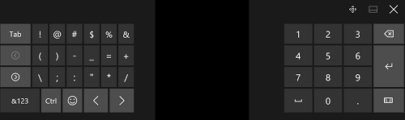
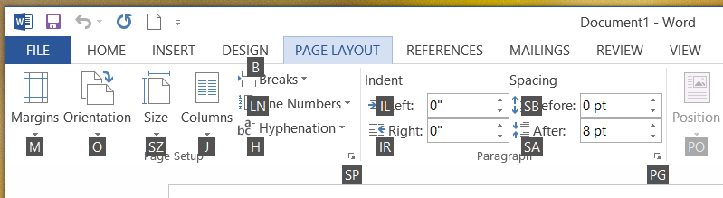

# Взаимодействие с помощью клавиатуры


Ввод с клавиатуры— важная составляющая общего взаимодействия с пользователем в приложениях. Клавиатура незаменима для пользователей с ограниченными возможностями и для тех, кто считает ее наиболее эффективным средством взаимодействия с приложением. Например, пользователи должны иметь возможность навигации в приложении с помощью клавиши Tab и клавиш со стрелками, активации элементов пользовательского интерфейса с помощью клавиш ПРОБЕЛ и ВВОД, а также доступа к командам с помощью сочетаний клавиш.  


**Важные API**

-   [**KeyDown**](https://msdn.microsoft.com/library/windows/apps/br208941)
-   [**KeyUp**](https://msdn.microsoft.com/library/windows/apps/br208942)
-   [**KeyRoutedEventArgs**](https://msdn.microsoft.com/library/windows/apps/hh943072)


Правильно разработанный пользовательский интерфейс клавиатуры является важным аспектом доступности программы. Он позволяет людям с ослабленным зрением или с определенными нарушениями двигательных способностей осуществлять переходы в приложении и взаимодействовать с его компонентами. Такие пользователи могут не иметь возможности использовать мышь. Вместо этого они могут рассчитывать на различные специальные возможности, такие как средства расширения функций клавиатуры, экранные клавиатуры, экранные лупы, средства чтения с экрана и средства голосового управления.

Пользователи могут взаимодействовать с универсальными приложениями с помощью аппаратной клавиатуры и двух программных клавиатур: экранной и сенсорной.

Экранная клавиатура  
Экранная клавиатура— это визуальная программная клавиатура, которую можно использовать вместо физической для ввода текста и данных с использованием сенсорного экрана, мыши, пера или другого указательного устройства (сенсорный экран необязателен). Экранная клавиатура предназначена для систем, не имеющих физической клавиатуры, или для людей с нарушениями двигательных функций, которые не позволяют им пользоваться традиционными физическими устройствами ввода. Экранная клавиатура имитирует почти все (если не все) функции аппаратной клавиатуры.

Экранную клавиатуру можно включить на странице "Клавиатура" в разделе "Параметры" &gt; "Специальные возможности".

**Примечание.** Сенсорная клавиатура имеет более низкий приоритет, чем экранная, и в присутствии последней не отображается.

 


<sup>Экранная клавиатура</sup>

Сенсорная клавиатура  
Сенсорная клавиатура–это визуальная программная клавиатура, используемая для сенсорного ввода текста. Она не заменяет экранную клавиатуру, так как используется только для ввода текста (т.е. она не эмулирует аппаратную клавиатуру).

В зависимости от устройства сенсорная клавиатура появляется, когда в фокус попадает текстовое поле или другой редактируемый текстовый элемент управления, либо когда пользователь включает ее вручную на странице **Центр уведомлений**:


**Примечание.** Пользователь может открыть экран **Режим планшета** в разделе "Параметры" &gt; "Система" и выбрать пункт "Включать дополнительные возможности сенсорного управления Windows при использовании устройства в качестве планшета", чтобы включить автоматическое появление сенсорной клавиатуры.

 

Если приложение программным способом перемещает фокус на элемент управления для ввода текста, сенсорная клавиатура не вызывается. Это исключает выполнение непредвиденных операций, не инициированных пользователем. Однако клавиатура автоматически скрывается, когда фокус программно перемещается на элемент, отличный от элемента управления для ввода текста.

Сенсорная клавиатура обычно остается видимой, когда пользователь переходит по элементам управления в форме. Это поведение может меняться в зависимости от других типов элементов управления в форме.

Ниже приведен список элементов управления, которые могут получать фокус в сеансе ввода текста с помощью сенсорной клавиатуры, не закрывая клавиатуру. Чтобы напрасно не перегружать пользовательский интерфейс и не запутывать пользователя, сенсорная клавиатура остается на виду, так как пользователь скорее всего будет переходить между этими элементами управления и вводом текста с помощью сенсорной клавиатуры.

-   флажок;
-   поле со списком;
-   переключатель;
-   полоса прокрутки;
-   дерево;
-   элемент дерева;
-   меню;
-   строка меню;
-   элемент меню;
-   панель инструментов;
-   список;
-   элемент списка.

Вот примеры различных режимов сенсорной клавиатуры. На первом рисунке показана раскладка по умолчанию, а на втором–раскладка мини-клавиатуры (может предлагаться не для всех языков).

Вот примеры различных режимов сенсорной клавиатуры. На первом рисунке показана раскладка по умолчанию, а на втором— раскладка мини-клавиатуры (может предлагаться не для всех языков).
<table>
<tr>
    <td>**Сенсорная клавиатура в режиме раскладки по умолчанию:  **</td>
    <td></td>
</tr>
<tr>
    <td>**Сенсорная клавиатура в режиме развернутой раскладки:  **</td>
    <td></td>
</tr>
<tr>
    <td>**Сенсорная клавиатура в режиме раскладки мини-клавиатуры:  **</td>
    <td></td>
</tr>
<tr>
    <td>**Сенсорная клавиатура в режиме раскладки цифровой мини-клавиатуры:  **</td>
    <td></td>
</tr>
</table>


Успешное взаимодействие с клавиатурой позволяет пользователям выполнять основные сценарии приложений, пользуясь только клавиатурой, то есть пользователи имеют доступ ко всем интерактивным элементам интерфейса и могут активировать любую функцию по умолчанию. Несколько факторов могут влиять на степень успеха, включая навигацию с помощью клавиатуры, клавиши доступа для специальных возможностей и сочетания клавиш для опытных пользователей.

**Примечание.** Сенсорная клавиатура не поддерживает переключение и большинство системных команд (см. [Шаблоны](#keyboard_command_patterns)).

## Навигация


Чтобы использовать элемент управления (в том числе элементы навигации) с помощью клавиатуры, фокус должен быть размещен на элементе. Один из способов получения фокуса клавиатуры состоит в том, чтобы сделать элемент доступным посредством навигации при помощи клавиши TAB. Качественная модель навигации с помощью клавиатуры предоставляет логичную и прогнозируемую последовательность табуляции, позволяющую пользователю быстро и эффективно просматривать и использовать ваше приложение.

У всех интерактивных элементов управления должны быть остановки перехода (если они не объединены в группу), а у неинтерактивных элементов управления, таких как метки, не должны.

Набор связанных элементов управления можно объединить в группу, которой можно назначить одну остановку перехода. Группы элементов управления используются для создания наборов, которые работают как один элемент управления, например переключатель. Их также можно использовать, если элементов управления слишком много и переход с помощью клавиши TAB недостаточно удобен. Клавиши со стрелками, HOME, END, PAGE UP и PAGE DOWN перемещают фокус ввода между элементами управления в группе (с помощью этих клавиш невозможно выйти за пределы группы).

При запуске приложения установите первоначальный фокус клавиатуры на элемент, с которым пользователи интуитивно начнут (или с наибольшей вероятностью начнут) взаимодействие в первую очередь. Зачастую это основной режим просмотра содержимого приложения, чтобы пользователь мог сразу же просмотреть содержимое с помощью клавиш со стрелками.

Не устанавливайте первоначальный фокус клавиатуры на элемент, активация которого может привести к отрицательным или нежелательным результатам. Это позволит предотвратить потерю данных или доступа к системе.

Попробуйте оценить и предоставить самые важные команды, элементы управления и содержимое в последовательности табуляции и порядке отображения (визуальной иерархии). Однако фактическое расположение на экране может зависеть от родительского контейнера макета и определенных свойств дочерних элементов, которые влияют на макет. В частности, направление чтения макетов, использующих метафору сетки или таблицы, может сильно отличаться от последовательности табуляции. Это не всегда создает проблемы, но вам следует проверить сенсорный пользовательский интерфейс и использование клавиатуры в приложении.

Последовательность табуляции должна соответствовать направлению чтения, когда это возможно. Это может уменьшить путаницу в зависимости от языка и языкового стандарта.

Сопоставьте кнопки клавиатуры с соответствующими элементами пользовательского интерфейса (с кнопками «Назад» и «Вперед») вашего приложения.

Постарайтесь сделать возврат на начальный экран приложения и переход между основным содержимым как можно более наглядным и простым.

Используйте клавиши со стрелками для правильной навигации между дочерними элементами составных элементов. Если в узлах дерева развертывание — свертывание и активация узла выполняются разными дочерними элементами, используйте клавиши СТРЕЛКА ВЛЕВО и СТРЕЛКА ВПРАВО, чтобы добавить функцию управления развертыванием — свертыванием с клавиатуры. Это соответствует поведению элементов управления платформы.

Так как сенсорная клавиатура занимает большую часть экрана, универсальная платформа Windows (UWP) обеспечивает постоянное присутствие находящегося в фокусе поля ввода в поле зрения пользователя, когда тот переходит по элементам управления в форме, включая элементы управления, которые в данный момент находятся вне поля зрения. Пользовательские элементы управления должны эмулировать такое поведение.


В ряде случаев некоторые элементы пользовательского интерфейса должны присутствовать на экране постоянно. При разработке пользовательского интерфейса следите за тем, чтобы элементы управления формы находились в области панорамирования, а важные элементы пользовательского интерфейса были статичными. Например, так:


## Активация


Элемент управления можно активировать разными способами в зависимости от того, содержит ли он фокус или нет.

ПРОБЕЛ, ВВОД и ESC  
Клавиша ПРОБЕЛ должна активировать элемент управления с фокусом ввода. Клавиша ВВОД должна активировать элемент управления по умолчанию или элемент управления с фокусом ввода. Элемент управления по умолчанию — это элемент с первоначальным фокусом или элемент, которые реагирует только на клавишу ВВОД (обычно он меняется вместе с фокусом ввода). Кроме того, клавиша ESC должна закрывать переходные элементы пользовательского интерфейса, например меню и диалоговые окна.

В показанном здесь приложении "Калькулятор" клавиша ПРОБЕЛ используется для активации кнопки с фокусом, клавиша ВВОД сопоставлена с кнопкой "=", а клавиша Esc–с кнопкой "С".


Модификаторы клавиатуры  
Модификаторы клавиатуры делятся на следующие категории:


| Категория | Описание |
|----------|-------------|
| Сочетание клавиш | Выполнение основного действия без использования пользовательского интерфейса, например, нажатие сочетания клавиш Ctrl+S для **сохранения**. Реализуйте сочетания клавиш для вызова ключевых функциональных возможностей приложения. Не каждая команда содержит настройки сочетания клавиш или требует их. |   
| Клавиша доступа/Сочетание клавиш | Назначена каждому видимому высокоуровневому элементу управления, например Alt+F для меню **Файл**. Клавиша доступа не вызывает и не активирует команду. |
| Сочетание клавиш | Выполняют стандартные системные команды или команды приложения, например Alt+PrtScrn для снимка экрана, Alt+Tab для переключения между приложениями или F1 для вызова справки. Команда, связанная с сочетанием клавиш, не обязательно должна представлять собой пункт меню. |
| Клавиша приложения/Клавиша меню | Отображает контекстное меню. |
| Клавиша Windows/Command | Активирует системные команды, такие так **Системное меню**, **Экран блокировки** или **Свернуть все окна**. |

Клавиши доступа и сочетания клавиш поддерживают взаимодействие с элементами управления напрямую–к ним не нужно переходить с помощью клавиши Tab.
> Хотя у некоторых элементов управления есть встроенные метки, например у кнопок команд, флажков и переключателей, у других элементов управления, например у представлений списка, есть внешние метки. Для элементов управления с внешними метками клавиша доступа назначается метке, которая при вызове устанавливает фокус на элементе или значении в связанном элементе управления.


В примере ниже показаны клавиши доступа для вкладки **Макет страницы** в **Word**.



Здесь значение текстового поля "Отступ слева" выделено после нажатия клавиши доступа, определенной в привязанной метке.


## Удобство использования и специальные возможности


Правильно разработанный пользовательский интерфейс клавиатуры является важным аспектом доступности программы. Он позволяет людям с ослабленным зрением или с определенными нарушениями двигательных способностей осуществлять переходы в приложении и взаимодействовать с его компонентами. Такие пользователи могут не иметь возможности использовать мышь. Вместо этого им приходится полагаться на различные специальные возможности, такие как средства расширения функций клавиатуры, экранные клавиатуры, экранные лупы, средства чтения с экрана и средства голосового управления. Для этих пользователей полнота более важна, чем согласованность.

Опытные пользователи чаще применяют клавиатуру, так как с ее помощью можно быстрее вводить команды, при этом не требуется убирать руки с клавиатуры. Для таких пользователей эффективность и согласованность критически важна. Полнота важна только для наиболее часто используемых команд.

Существуют тонкие различия дизайна с точки зрения удобства использования и реализации специальных возможностей, поэтому поддерживаются два различных механизма доступа с клавиатуры.

Клавиши доступа обладают следующими характеристиками.

-   Клавиша доступа — это сочетание клавиш, обеспечивающее доступ к элементу интерфейса вашего приложения.
-   Они используют клавишу ALT и буквенно-цифровую клавишу.
-   Они предназначены главным образом для специальных возможностей.
-   Они назначаются всем меню и большинству элементов управления диалоговых окон.
-   Они не предназначены для запоминания, поэтому указываются непосредственно в интерфейсе пользователя подчеркнутым символом метки соответствующего элемента управления.
-   Они действуют только в текущем окне и перемещают фокус на соответствующий пункт меню или элемент управления.
-   Они не назначаются последовательно, поскольку невозможно добиться всесторонней согласованности. Однако клавиши доступа следует назначать согласованно для часто используемых команд, особенно для кнопок фиксации.
-   Они локализуются.

Поскольку клавиши доступа не предназначены для запоминания, они назначаются одному из первых символов метки, чтобы их было легче найти, даже если в метке есть ключевое слово.

В отличие от них сочетания клавиш обладают следующими характеристиками.

-   Сочетание клавиш — это способ быстрого вызова команды приложения.
-   Они главным образом используют сочетания клавиш CTRL и функциональных клавиш (в Windows также используются сочетание ALT и не буквенно-цифровой клавиши и клавиша Windows).
-   Они предназначены в основном для опытных пользователей.
-   Они назначаются только наиболее часто используемым командам.
-   Они предназначены для запоминания и описываются только в меню, подсказках и справке.
-   Они действуют во всем приложении, но не дают результата там, где они не применяются.
-   Их необходимо назначать согласованно, поскольку они запоминаются и не описываются напрямую.
-   Они не локализуются.

Поскольку сочетания клавиш предназначены для запоминания, в идеале наиболее часто используемые сочетания клавиш используют первый или наиболее значимый символ в ключевом слове команды, например CTRL+C для копирования (Copy) и CTRL+Q для запроса (Request).

Пользователи должны иметь возможность выполнять все задачи, поддерживаемые вашим приложением, с помощью только аппаратной или только экранной клавиатуры.

Вы должны предоставить пользователям, которые пользуются средствами чтения с экрана и другими специальными возможностями, простой способ узнать сочетания клавиш для вашего приложения. Предоставьте информацию о сочетании клавиш при помощи всплывающих подсказок, специальных имен, специальных описаний и других видов экранных средств взаимодействия. По крайней мере клавиши доступа и сочетания клавиш должны быть подробно описаны в документации раздела справки вашего приложения.

Не назначайте известные или стандартные сочетания клавиш другим функциям. Например, сочетание клавиш CTRL+F обычно используется для поиска.

Не трудитесь назначать клавиши доступа всем интерактивным элементам управления в плотном пользовательском интерфейсе. Просто убедитесь, что самым важным и часто используемым элементам назначены клавиши доступа, или используйте группы элементов управления и назначайте клавиши доступа меткам групп.

Не изменяйте команды с помощью модификаторов клавиатуры. Это может привести к путанице.

Не отключайте элемент управления, когда фокус ввода находится на нем. Это может повлиять на возможности ввода с клавиатуры.

Для успешного взаимодействия с помощью клавиатуры важно тщательно проверить приложение, используя только клавиатуру.

## Текстовый ввод


Всегда запрашивайте возможности устройства при использовании ввода с клавиатуры. На некоторых устройствах (например, телефонах) сенсорную клавиатуру можно использовать только для ввода текста, поскольку на ней отсутствуют многие сочетания клавиш и клавиши для команд, присутствующие на аппаратных клавиатурах, в том числе клавиша ALT, функциональные клавиши и клавиша Windows.

Не заставляйте пользователей применять сенсорную клавиатуру для навигации по приложению. В зависимости от элемента управления с фокусом сенсорная клавиатура может быть закрыта.

Старайтесь отображать сенсорную клавиатуру в течение всего времени взаимодействия пользователя с формой. Это поможет предотвратить дезориентацию пользователя в середине сеанса ввода.

Убедитесь, что пользователям всегда видно поле, в которое они вводят текст. Сенсорная клавиатура занимает половину экрана, поэтому поле ввода с фокусом должно прокручиваться при просмотре пользователем формы.

Стандартная аппаратная или экранная клавиатура состоит из семи типов клавиш с уникальными функциями.

-   Символьная клавиша: отправляет буквенный символ в окно с фокусом ввода.
-   Клавиша-модификатор: изменяет функцию основной клавиши при одновременном нажатии (например, CTRL, ALT, SHIFT и клавиша Windows).
-   Клавиша навигации: перемещает фокус ввода или место ввода текста (например, TAB, HOME, END, PAGE UP, PAGE DOWN и клавиши со стрелками).
-   Клавиша редактирования: изменяет текст (например, SHIFT, TAB, ВВОД, INSERT, BACKSPACE и DELETE).
-   Функциональная клавиша: выполняет специальную функцию (например, F1–F12).
-   Клавиша-переключатель: переводит систему в определенный режим (например, CAPS LOCK, SCRLK и NUM LOCK).
-   Клавиша для команды: выполняет системную задачу или активирует команду (например, ПРОБЕЛ, ВВОД, ESC, PAUSE/BREAK и PRINT SCREEN).

Помимо этих категорий, есть дополнительный класс клавиш и их сочетаний, которые можно использовать как ярлыки для функций приложения.

-   Клавиша доступа: активирует элементы управления или пункты меню — пользователь нажимает клавишу ALT вместе с символьной клавишей, подчеркнутой в пункте меню или указанной в наложении.
-   Сочетание клавиш: активирует команды приложения — пользователь нажимает функциональную клавишу или клавишу CTRL вместе с символьной клавишей. Ваше приложение может содержать или не содержать элемент интерфейса, который соответствует этой команде.

Другой класс сочетаний клавиш, известный как специальное сочетание клавиш (SAS), не может быть перехвачен приложением. Это функция обеспечения безопасности, предназначенная для защиты системы пользователя при входе, и она включает в себя клавиши Ctrl-Alt-Del и Win-L.

Здесь показано приложение "Блокнот" с развернутым меню "Файл", в котором есть клавиши доступа и сочетания клавиш.


## Команды клавиатуры


Далее представлен полный список операций взаимодействия с помощью клавиатуры на разных устройствах, которые поддерживают ввод с клавиатуры. Некоторые устройства и платформы используют собственные сочетания клавиш и взаимодействия, как указано далее.

Создавая пользовательские элементы управления и взаимодействия, согласованно используйте этот «язык клавиатуры», чтобы пользователи могли легко разобраться в вашем приложении.

Не переопределяйте сочетания клавиш по умолчанию.

В следующих таблицах перечислены часто используемые команды клавиатуры. Полный список команд клавиатуры см. в разделе о [сочетании клавиш клавиатуры Windows](http://go.microsoft.com/fwlink/p/?linkid=325424).

**Команды навигации**

| Действие                               | Командная клавиша                                      |
|--------------------------------------|--------------------------------------------------|
| Назад                                 | ALT+СТРЕЛКА ВЛЕВО или клавиша перехода назад на специальных клавиатурах |
| Вперед                              | ALT+СТРЕЛКА ВПРАВО                                        |
| Вверх                                   | ALT+СТРЕЛКА ВВЕРХ                                           |
| Отмена или выход из текущего режима   | ESC                                              |
| Переход по элементам списка         | Клавиши стрелок (влево, вправо, вниз, вверх)                |
| Переход к следующему списку элементов           | CTRL+СТРЕЛКА ВЛЕВО                                        |
| Контекстное масштабирование                        | CTRL+знак "плюс" или CTRL+знак "минус"                                 |
| Переход к именованному элементу в коллекции | Начало ввода имени элемента                           |
| Следующая страница                            | PAGE UP, PAGE DOWN или ПРОБЕЛ                   |
| Следующая вкладка                             | CTRL+TAB                                         |
| Предыдущая вкладка                         | CTRL+SHIFT+TAB                                   |
| Открытие панели приложения                         | Windows + Z                                        |
| Активация элемента или переход к нему    | ВВОД                                            |
| Выделить                               | ПРОБЕЛ                                         |
| Постоянный выбор                  | SHIFT+клавиша со стрелкой                                  |
| Выбор всего                           | CTRL+A                                           |

 

**Распространенные команды**

| Действие                                                 | Командная клавиша     |
|--------------------------------------------------------|-----------------|
| Прикрепление элемента                                            | CTRL+SHIFT+1    |
| Сохранение                                                   | CTRL+S          |
| Поиск                                                   | CTRL+F          |
| Печать                                                  | CTRL+P          |
| Копировать                                                   | CTRL+C          |
| Вырезать                                                    | CTRL+X          |
| Создать элемент                                               | CTRL+N          |
| Вставка                                                  | CTRL+V          |
| Открыть                                                   | CTRL+O          |
| Открыть адрес (например, URL-адрес в Internet Explorer) | CTRL+L или ALT+D |

 

**Команды навигации мультимедиа**

| Действие       | Командная клавиша |
|--------------|-------------|
| Воспроизведение/Пауза   | CTRL+P      |
| Следующий элемент    | CTRL+F      |
| Просмотр элемента | CTRL+B      |

 

Примечание. Сочетания клавиш для таких команд навигации мультимедиа, как "Воспроизведение/Пауза" и "Следующий элемент", идентичны сочетаниям для команд "Печать" и "Поиск" соответственно. Общие команды должны иметь приоритет перед командами навигации мультимедиа. Например, если приложение поддерживает и воспроизведение, и печать, клавиши CTRL+P должны запускать печать.
## Визуальная обратная связь


Используйте прямоугольники фокуса только при взаимодействии с помощью клавиатуры. Если пользователь инициирует сенсорное взаимодействие, сделайте так, чтобы пользовательский интерфейс клавиатуры постепенно исчезал. В этом случае пользовательский интерфейс будет аккуратным, не загроможденным лишними элементами.

Не отображайте визуальную обратную связь, если элемент не поддерживает взаимодействие (например, статический текст). Опять же, в этом случае пользовательский интерфейс будет аккуратным, не загроможденным лишними элементами.

Отображайте визуальную обратную связь одновременно для всех элементов, представляющих одну и ту же цель ввода.

Предусмотрите экранные кнопки (например, "+" и "–") для эмуляции сенсорных операций, таких как сдвиг, поворот, масштабирование и т.д.

Дополнительные общие рекомендации по визуальной обратной связи см. в разделе [Руководство по визуальной обратной связи](guidelines-for-visualfeedback.md).


## События клавиатуры и фокус


Следующие событие клавиатуры могут возникнуть при использовании как аппаратной, так и сенсорной клавиатуры.

| Событие                                      | Описание                    |
|--------------------------------------------|--------------------------------|
| [**KeyDown**](https://msdn.microsoft.com/library/windows/apps/br208941) | Происходит, когда клавиша нажата.  |
| [**KeyUp**](https://msdn.microsoft.com/library/windows/apps/br208942)     | Происходит, когда клавиша отпущена. |


**Важно**  
Некоторые элементы управления среды выполнения Windows обрабатывают события ввода внутренне. В этом случае может показаться, что событие ввода не происходит, поскольку прослушиватель событий не вызывает связанный обработчик. Обычно это подмножество клавиш обрабатывается обработчиком классов для обеспечения встроенной поддержки базовых специальных возможностей клавиатуры. Например, класс [**Button**](https://msdn.microsoft.com/library/windows/apps/br209265) переопределяет события [**OnKeyDown**](https://msdn.microsoft.com/library/windows/apps/hh967982) для клавиш ПРОБЕЛ и ВВОД (а также [**OnPointerPressed**](https://msdn.microsoft.com/library/windows/apps/hh967989)) и перенаправляет их в событие [**Click**](https://msdn.microsoft.com/library/windows/apps/br227737) элемента управления. Если нажатие клавиши обрабатывается классом элемента управления, события [**KeyDown**](https://msdn.microsoft.com/library/windows/apps/br208941) и [**KeyUp**](https://msdn.microsoft.com/library/windows/apps/br208942) не вызываются.

Это предоставляет эквивалентную встроенную клавиатуру для вызова кнопки, что похоже на касание пальцем или щелчок мышью. Клавиши, отличные от клавиш ПРОБЕЛ и ВВОД, вызывают события [**KeyDown**](https://msdn.microsoft.com/library/windows/apps/br208941) и [**KeyUp**](https://msdn.microsoft.com/library/windows/apps/br208942). Дополнительные сведения об обработке событий на базе класса можно найти в статье [Общие сведения о событиях и перенаправленных событиях](https://msdn.microsoft.com/library/windows/apps/mt185584) (в частности, в разделе "Обработчики событий ввода в элементах управления").


Элементы пользовательского интерфейса создают события клавиатуры только при наличии у них фокуса ввода. Отдельный элемент управления получает фокус, когда пользователь щелкает этот элемент или касается его непосредственно в макете либо переходит на него с помощью клавиши Tab по последовательности табуляции в пределах области размещения содержимого.

Также можно принудительно установить фокус, вызвав метод [**Focus**](https://msdn.microsoft.com/library/windows/apps/hh702161) элемента управления. Это необходимо при реализации сочетаний клавиш, поскольку по умолчанию фокус клавиатуры не устанавливается при загрузке пользовательского интерфейса. Дополнительные сведения см. в разделе [Пример использования сочетания клавиш](#shortcut_keys_example) далее в этой теме.

Для того чтобы элемент управления получил фокус, он должен быть включенным, видимым, а его свойства [**IsTabStop**](https://msdn.microsoft.com/library/windows/apps/br209422) и [**HitTestVisible**](https://msdn.microsoft.com/library/windows/apps/br208933) должны иметь значение **true**. Для большинства элементов управления это состояние по умолчанию. При наличии у элемента управления фокуса ввода он может вызывать события клавиатурного ввода и реагировать на них, как описано далее в этой теме. Также вы можете реагировать на получение или потерю фокуса элементом управления, обрабатывая события [**GotFocus**](https://msdn.microsoft.com/library/windows/apps/br208927) и [**LostFocus**](https://msdn.microsoft.com/library/windows/apps/br208943).

По умолчанию последовательность табуляции для элементов управления аналогична порядку, в котором они указаны в XAML (Extensible Application Markup Language). Однако этот порядок можно изменить с помощью свойства [**TabIndex**](https://msdn.microsoft.com/library/windows/apps/br209461). Дополнительные сведения см. в разделе [Реализация специальных возможностей клавиатуры](https://msdn.microsoft.com/library/windows/apps/hh868161).

## Обработчики событий клавиатуры


Обработчик событий ввода реализует делегат, который предоставляет следующие сведения:

-   Отправитель события. Отправитель сообщает, к какому объекту присоединен обработчик событий.
-   Данные события. Для событий клавиатуры эти данные представляют собой экземпляр [**KeyRoutedEventArgs**](https://msdn.microsoft.com/library/windows/apps/hh943072). Делегатом для обработчиков является [**KeyEventHandler**](https://msdn.microsoft.com/library/windows/apps/br227904). Наиболее значимыми свойствами **KeyRoutedEventArgs** в большинстве сценариев использования обработчиков являются [**Key**](https://msdn.microsoft.com/library/windows/apps/hh943074) и, возможно, [**KeyStatus**](https://msdn.microsoft.com/library/windows/apps/hh943075).
-   [**OriginalSource**](https://msdn.microsoft.com/library/windows/apps/br208810). Поскольку события клавиатуры являются перенаправленными событиями, данные события включают **OriginalSource**. Если вы намеренно разрешаете восходящую маршрутизацию событий в дереве объектов, проблемы более вероятны с **OriginalSource**, а не с отправителем. Однако это зависит от разработки. Дополнительные сведения о возможности использования **OriginalSource** вместо отправителя см. в разделе "Перенаправленные события клавиатуры" этой статьи или в статье [Общие сведения о событиях и перенаправленных событиях](https://msdn.microsoft.com/library/windows/apps/mt185584).

### Присоединение обработчика событий клавиатуры

Функции обработчика событий клавиатуры можно прикрепить к любому объекту, включающему это событие в качестве члена. К таким объектам относятся и любые производные классы [**UIElement**](https://msdn.microsoft.com/library/windows/apps/br208911). В следующем примере XAML показано, как присоединять обработчики для события [**KeyUp**](https://msdn.microsoft.com/library/windows/apps/br208942) элемента [**Grid**](https://msdn.microsoft.com/library/windows/apps/br242704).

```XAML
<Grid KeyUp="Grid_KeyUp">
  ...
</Grid>
```

Кроме того, обработчик событий можно прикрепить и в коде. Дополнительные сведения см. в разделе [Общие сведения о событиях и перенаправленных событиях](https://msdn.microsoft.com/library/windows/apps/mt185584).

### Определение обработчика событий клавиатуры

В следующем примере показано неполное определение обработчика событий [**KeyUp**](https://msdn.microsoft.com/library/windows/apps/br208942), прикрепленного в предыдущем примере.

```CSharp
void Grid_KeyUp(object sender, KeyRoutedEventArgs e)
{
    //handling code here
}
```

```VisualBasic
Private Sub Grid_KeyUp(ByVal sender As Object, ByVal e As KeyRoutedEventArgs)
    &#39;handling code here
End Sub
```

```ManagedCPlusPlus
void MyProject::MainPage::Grid_KeyUp(
  Platform::Object^ sender,
  Windows::UI::Xaml::Input::KeyRoutedEventArgs^ e)
{//handling code here}
```

### Использование KeyRoutedEventArgs

Все события клавиатуры используют [**KeyRoutedEventArgs**](https://msdn.microsoft.com/library/windows/apps/hh943072) для указания данных события. Объект **KeyRoutedEventArgs** содержит следующие свойства.

-   [**Клавиша**](https://msdn.microsoft.com/library/windows/apps/hh943074)
-   [**KeyStatus**](https://msdn.microsoft.com/library/windows/apps/hh943075)
-   [**Handled**](https://msdn.microsoft.com/library/windows/apps/hh943073)
-   [**OriginalSource**](https://msdn.microsoft.com/library/windows/apps/br208810) (наследуется от [**RoutedEventArgs**](https://msdn.microsoft.com/library/windows/apps/br208809))

### Ключ

Событие [**KeyDown**](https://msdn.microsoft.com/library/windows/apps/br208941) создается, когда нажата клавиша. Подобным образом событие [**KeyUp**](https://msdn.microsoft.com/library/windows/apps/br208942) создается, когда клавиша отпущена. Обычно прослушивание событий выполняется для обработки определенного значения клавиши. Чтобы определить, какая клавиша нажата или отпущена, проверьте значение [**Key**](https://msdn.microsoft.com/library/windows/apps/hh943074) в данных события. **Key** возвращает значение [**VirtualKey**](https://msdn.microsoft.com/library/windows/apps/br241812) value. Перечисление **VirtualKey** содержит все поддерживаемые клавиши.

### Клавиши-модификаторы

Клавиши-модификаторы — это такие клавиши, как CTRL или SHIFT, которые пользователи обычно нажимают в сочетании с другими клавишами. В вашем приложении такие сочетания могут использоваться для вызова различных команд.

Чтобы обнаружить сочетание клавиш, используйте код в обработчиках событий [**KeyDown**](https://msdn.microsoft.com/library/windows/apps/br208941) и [**KeyUp**](https://msdn.microsoft.com/library/windows/apps/br208942). Затем вы можете отследить, какие из интересующих вас клавиш-модификаторов нажаты. Если событие клавиатуры связано не с клавишей-модификатором, можно проверить, не нажата ли одновременно клавиша-модификатор.

**Примечание.** Клавиша ALT представлена значением **VirtualKey.Menu**.

 

## Пример использования сочетаний клавиш


В следующем примере показано, как реализовать сочетания клавиш. В этом примере пользователь может управлять воспроизведением мультимедиа с помощью кнопок "Воспроизведение", "Пауза" или "Остановка" либо клавиш Ctrl+P, Ctrl+A и Ctrl+S. XAML-код кнопки отображает сочетания клавиш с помощью всплывающих подсказок и свойств [**AutomationProperties**](https://msdn.microsoft.com/library/windows/apps/br209081) в подписях кнопок. Такое самодокументирование важно для увеличения удобства вашего приложения и его доступности для людей с ограниченными возможностями. Дополнительную информацию см. в статье [Специальные возможности клавиатуры](https://msdn.microsoft.com/library/windows/apps/mt244347).

Обратите также внимание, что страница при загрузке устанавливает фокус ввода на себя. Без этого действия никакой элемент управления не получает первоначальный фокус ввода, и приложение не вызывает событие ввода до тех пор, пока пользователь вручную не установит фокус ввода (например, перейдя с помощью клавиши Tab или щелкнув элемент управления).

```XAML
<Grid KeyDown="Grid_KeyDown">

  <Grid.RowDefinitions>
    <RowDefinition Height="Auto" />
    <RowDefinition Height="Auto" />
  </Grid.RowDefinitions>

  <MediaElement x:Name="DemoMovie" Source="xbox.wmv"
    Width="500" Height="500" Margin="20" HorizontalAlignment="Center" />

  <StackPanel Grid.Row="1" Margin="10"
    Orientation="Horizontal" HorizontalAlignment="Center">

    <Button x:Name="PlayButton" Click="MediaButton_Click"
      ToolTipService.ToolTip="Shortcut key: Ctrl+P"
      AutomationProperties.AcceleratorKey="Control P">
      <TextBlock>Play</TextBlock>
    </Button>

    <Button x:Name="PauseButton" Click="MediaButton_Click"
      ToolTipService.ToolTip="Shortcut key: Ctrl+A"
      AutomationProperties.AcceleratorKey="Control A">
      <TextBlock>Pause</TextBlock>
    </Button>

    <Button x:Name="StopButton" Click="MediaButton_Click"
      ToolTipService.ToolTip="Shortcut key: Ctrl+S"
      AutomationProperties.AcceleratorKey="Control S">
      <TextBlock>Stop</TextBlock>
    </Button>

  </StackPanel>

</Grid>
```

```ManagedCPlusPlus
//showing implementations but not header definitions
void MainPage::OnNavigatedTo(NavigationEventArgs^ e)
{
    (void) e;    // Unused parameter
    this->Loaded+=ref new RoutedEventHandler(this,&amp;MainPage::ProgrammaticFocus);
}
void MainPage::ProgrammaticFocus(Object^ sender, RoutedEventArgs^ e) {
    this->Focus(Windows::UI::Xaml::FocusState::Programmatic);
}

void KeyboardSupport::MainPage::MediaButton_Click(Platform::Object^ sender, Windows::UI::Xaml::RoutedEventArgs^ e)
{
    FrameworkElement^ fe = safe_cast<FrameworkElement^>(sender);
    if (fe->Name == "PlayButton") {DemoMovie->Play();}
    if (fe->Name == "PauseButton") {DemoMovie->Pause();}
    if (fe->Name == "StopButton") {DemoMovie->Stop();}
}


void KeyboardSupport::MainPage::Grid_KeyDown(Platform::Object^ sender, Windows::UI::Xaml::Input::KeyRoutedEventArgs^ e)
{
    if (e->Key == VirtualKey::Control) isCtrlKeyPressed = true;
}


void KeyboardSupport::MainPage::Grid_KeyUp(Platform::Object^ sender, Windows::UI::Xaml::Input::KeyRoutedEventArgs^ e)
{
    if (e->Key == VirtualKey::Control) isCtrlKeyPressed = true;
    else if (isCtrlKeyPressed) {
        if (e->Key==VirtualKey::P) {
            DemoMovie->Play();
        }
        if (e->Key==VirtualKey::A) {DemoMovie->Pause();}
        if (e->Key==VirtualKey::S) {DemoMovie->Stop();}
    }
}
```

```CSharp
protected override void OnNavigatedTo(NavigationEventArgs e)
{
    // Set the input focus to ensure that keyboard events are raised.
    this.Loaded += delegate { this.Focus(FocusState.Programmatic); };
}

private void Grid_KeyUp(object sender, KeyRoutedEventArgs e)
{
    if (e.Key == VirtualKey.Control) isCtrlKeyPressed = false;
}

private void Grid_KeyDown(object sender, KeyRoutedEventArgs e)
{
    if (e.Key == VirtualKey.Control) isCtrlKeyPressed = true;
    else if (isCtrlKeyPressed)
    {
        switch (e.Key)
        {
            case VirtualKey.P: DemoMovie.Play(); break;
            case VirtualKey.A: DemoMovie.Pause(); break;
            case VirtualKey.S: DemoMovie.Stop(); break;
        }
    }
}

private void MediaButton_Click(object sender, RoutedEventArgs e)
{
    switch ((sender as Button).Name)
    {
        case "PlayButton": DemoMovie.Play(); break;
        case "PauseButton": DemoMovie.Pause(); break;
        case "StopButton": DemoMovie.Stop(); break;
    }
}
```

```VisualBasic
Private isCtrlKeyPressed As Boolean
Protected Overrides Sub OnNavigatedTo(e As Navigation.NavigationEventArgs)

End Sub

Private Sub Grid_KeyUp(sender As Object, e As KeyRoutedEventArgs)
    If e.Key = Windows.System.VirtualKey.Control Then
        isCtrlKeyPressed = False
    End If
End Sub

Private Sub Grid_KeyDown(sender As Object, e As KeyRoutedEventArgs)
    If e.Key = Windows.System.VirtualKey.Control Then isCtrlKeyPressed = True
    If isCtrlKeyPressed Then
        Select Case e.Key
            Case Windows.System.VirtualKey.P
                DemoMovie.Play()
            Case Windows.System.VirtualKey.A
                DemoMovie.Pause()
            Case Windows.System.VirtualKey.S
                DemoMovie.Stop()
        End Select
    End If
End Sub

Private Sub MediaButton_Click(sender As Object, e As RoutedEventArgs)
    Dim fe As FrameworkElement = CType(sender, FrameworkElement)
    Select Case fe.Name
        Case "PlayButton"
            DemoMovie.Play()
        Case "PauseButton"
            DemoMovie.Pause()
        Case "StopButton"
            DemoMovie.Stop()
    End Select
End Sub
```

**Примечание.** Параметр [**AutomationProperties.AcceleratorKey**](https://msdn.microsoft.com/library/windows/apps/hh759762) или [**AutomationProperties.AccessKey**](https://msdn.microsoft.com/library/windows/apps/hh759763) в XAML предоставляет сведения о строке, регистрирующие сочетание клавиш для вызова определенного действия. Эти сведения записываются клиентами автоматизации пользовательского интерфейса Майкрософт, например экранным диктором, и, как правило, предоставляются пользователю напрямую. Параметр **AutomationProperties.AcceleratorKey** или **AutomationProperties.AccessKey** не имеет собственных действий. Но вам все равно нужно подключить обработчики для событий [**KeyDown**](https://msdn.microsoft.com/library/windows/apps/br208941) или [**KeyUp**](https://msdn.microsoft.com/library/windows/apps/br208942), чтобы фактически реализовать применение сочетания клавиш в вашем приложении. Подчеркивание клавиши доступа не предоставляется автоматически. Вы должны явным образом подчеркнуть текст, относящийся к определенной назначенной клавише в качестве встроенного форматирования [**Underline**](https://msdn.microsoft.com/library/windows/apps/br209982), если вы хотите, чтобы подчеркнутый текст отображался в пользовательском интерфейсе.

 

## Перенаправленные события клавиатуры


Некоторые события являются перенаправленными, включая [**KeyDown**](https://msdn.microsoft.com/library/windows/apps/br208941) и [**KeyUp**](https://msdn.microsoft.com/library/windows/apps/br208942). Перенаправленные события используют стратегию восходящей маршрутизации. Стратегия восходящего перенаправления означает, что событие происходит из дочернего объекта, а затем направляется по последующим родительским объектам в дереве объектов. Это предоставляет еще одну возможность обработки того же события и взаимодействия с его данными.

Рассмотрим следующий пример кода XAML, в котором обрабатываются события [**KeyUp**](https://msdn.microsoft.com/library/windows/apps/br208942) для объекта [**Canvas**](https://msdn.microsoft.com/library/windows/apps/br209267) и двух объектов [**Button**](https://msdn.microsoft.com/library/windows/apps/br209265). В этом случае, если отпустить клавишу во время удержания фокуса любым из объектов **Button**, будет вызвано событие **KeyUp**. Затем событие передается родительскому объекту **Canvas**.

```XAML
<StackPanel KeyUp="StackPanel_KeyUp">
  <Button Name="ButtonA" Content="Button A"/>
  <Button Name="ButtonB" Content="Button B"/>
  <TextBlock Name="statusTextBlock"/>
</StackPanel>
```

В следующем примере показана реализация обработчика событий [**KeyUp**](https://msdn.microsoft.com/library/windows/apps/br208942) для соответствующего содержимого XAML из предыдущего примера.

```CSharp
void StackPanel_KeyUp(object sender, KeyRoutedEventArgs e)
{
    statusTextBlock.Text = String.Format(
        "The key {0} was pressed while focus was on {1}",
        e.Key.ToString(), (e.OriginalSource as FrameworkElement).Name);
}
```

Обратите внимание на использование свойства [**OriginalSource**](https://msdn.microsoft.com/library/windows/apps/br208810) в предыдущем обработчике. Здесь **OriginalSource** сообщает об объекте, вызвавшем событие. Этим объектом не может быть [**StackPanel**](https://msdn.microsoft.com/library/windows/apps/br209635), поскольку **StackPanel** не является элементом управления и не может содержать фокус. Событие могло быть вызвано только одной из двух кнопок внутри **StackPanel**, но какой именно? Определить исходный объект текущего события, если оно обрабатывается на уровне родительского объекта, позволяет свойство **OriginalSource**.

### Свойство Handled в данных события

В зависимости от выбранной стратегии обработки событий для реакции на восходящее событие можно использовать только один обработчик событий. Например, если имеется особый обработчик [**KeyUp**](https://msdn.microsoft.com/library/windows/apps/br208942), прикрепленный к одному из элементов управления [**Button**](https://msdn.microsoft.com/library/windows/apps/br209265), у него в первую очередь будет возможность обработать данное событие. В этом случае не нужно, чтобы событие было также обработано родительской панелью. Для данного сценария можно воспользоваться свойством [**Handled**](https://msdn.microsoft.com/library/windows/apps/hh943073) в данных события.

Цель свойства [**Handled**](https://msdn.microsoft.com/library/windows/apps/hh943073) в классе данных перенаправленного события–сообщить о том, что другой ранее зарегистрированный обработчик на маршруте события уже был задействован. Это влияет на поведение системы перенаправленных событий. При установке для **Handled** значения **true** в обработчике событий перенаправление этого события прекращается и оно не передается последующим родительским элементам.

### AddHandler и уже обработанные события клавиатуры

Для присоединения обработчиков, которые могут реагировать на события, уже отмеченные как обработанные, можно использовать специальную методику. При этом для регистрации обработчика используется метод [**AddHandler**](https://msdn.microsoft.com/library/windows/apps/hh702399) вместо атрибутов XAML или зависящего от языка синтаксиса для добавления обработчиков, например "+=" в языке C\#. Обычно ограничением для этой методики становится то, что API **AddHandler** принимает параметр типа [**RoutedEvent**](https://msdn.microsoft.com/library/windows/apps/br208808), который идентифицирует рассматриваемое перенаправленное событие. Идентификатор **RoutedEvent** предоставляется не всеми перенаправленными событиями, и это соображение влияет на то, какие перенаправленные события все же могут быть обработаны в случае [**Handled**](https://msdn.microsoft.com/library/windows/apps/hh943073). События [**KeyDown**](https://msdn.microsoft.com/library/windows/apps/br208941) и [**KeyUp**](https://msdn.microsoft.com/library/windows/apps/br208942) имеют идентификаторы перенаправленных событий ([**KeyDownEvent**](https://msdn.microsoft.com/library/windows/apps/hh702416) и [**KeyUpEvent**](https://msdn.microsoft.com/library/windows/apps/hh702418)) в [**UIElement**](https://msdn.microsoft.com/library/windows/apps/br208911). Однако другие события, например [**TextBox.TextChanged**](https://msdn.microsoft.com/library/windows/apps/br209706), не имеют идентификаторов перенаправленных событий, и поэтому для них нельзя использовать методику **AddHandler**.

## Командный интерфейс


Небольшое количество элементов пользовательского интерфейса предоставляет встроенную поддержку команд. В командах используются связанные с вводом перенаправленные события в базовой реализации. Это позволяет обрабатывать соответствующий ввод в пользовательском интерфейсе, например определенное действие указателя или нажатие определенного сочетания клавиш, путем вызова единого обработчика команды.

Если для элемента пользовательского интерфейса доступен командный интерфейс, подумайте об использовании соответствующих API командного интерфейса вместо любых дискретных событий ввода. Подробнее: [**ButtonBase.Command**](https://msdn.microsoft.com/library/windows/apps/br227740).

Также можно реализовать [**ICommand**](https://msdn.microsoft.com/library/windows/apps/br227885) для инкапсуляции функциональных возможностей команд, вызываемых из обычных обработчиков событий. Это позволяет использовать команды даже при отсутствии свойства **Command**.

## Ввод текста и элементы управления


Некоторые элементы управления реагируют на события клавиатуры собственной обработкой. Например, [**TextBox**](https://msdn.microsoft.com/library/windows/apps/br209683)–элемент управления, предназначенный для захвата и дальнейшего визуального представления текста, введенного с помощью клавиатуры. В нем используются [**KeyUp**](https://msdn.microsoft.com/library/windows/apps/br208942) и [**KeyDown**](https://msdn.microsoft.com/library/windows/apps/br208941) с собственной логикой перехвата нажатий клавиш, а затем инициируется собственное событие [**TextChanged**](https://msdn.microsoft.com/library/windows/apps/br209706), если текст был изменен.

Вы по-прежнему можете добавлять обработчики для [**KeyUp**](https://msdn.microsoft.com/library/windows/apps/br208942) и [**KeyDown**](https://msdn.microsoft.com/library/windows/apps/br208941) в [**TextBox**](https://msdn.microsoft.com/library/windows/apps/br209683) или любой связанный элемент управления, предназначенный для обработки текстового ввода. Однако элемент управления может быть разработан так, что будет отвечать не на все значения клавиш, направляемые ему через события клавиш. Для каждого элемента управления задается своя реакция.

Например, [**ButtonBase**](https://msdn.microsoft.com/library/windows/apps/br227736) (базовый класс для [**Button**](https://msdn.microsoft.com/library/windows/apps/br209265)) обрабатывает [**KeyUp**](https://msdn.microsoft.com/library/windows/apps/br208942) таким образом, что он может проверять клавиши ПРОБЕЛ или ВВОД. **ButtonBase** считает **KeyUp** эквивалентом нажатия левой кнопки мыши в целях инициации события [**Click**](https://msdn.microsoft.com/library/windows/apps/br227737). Эта обработка события выполняется, когда **ButtonBase** переопределяет виртуальный метод [**OnKeyUp**](https://msdn.microsoft.com/library/windows/apps/hh967983). При реализации он устанавливает [**Handled**](https://msdn.microsoft.com/library/windows/apps/hh943073) на **true**. В результате получается, что любой родительский элемент кнопки, прослушивающий событие клавиши, при нажатии клавиши ПРОБЕЛ не получит уже обработанное событие для своих обработчиков.

Еще один пример–[**TextBox**](https://msdn.microsoft.com/library/windows/apps/br209683). Некоторые клавиши, такие как клавиши со стрелками, не рассматриваются объектом **TextBox** как текстовые, а относятся к специальным реакциям пользовательского интерфейса элементов управления. **TextBox** отмечает эти случаи событий как обработанные.

Пользовательские элементы управления могут реализовывать собственные аналогичные реакции для событий клавиш путем переопределения [**OnKeyDown**](https://msdn.microsoft.com/library/windows/apps/hh967982) / [**OnKeyUp**](https://msdn.microsoft.com/library/windows/apps/hh967983). Если пользовательский элемент управления обрабатывает определенные сочетания клавиш либо реагирует как элемент управления или фокус аналогично сценарию, описанному для [**TextBox**](https://msdn.microsoft.com/library/windows/apps/br209683), следует применить эту логику к собственным переопределениям **OnKeyDown** / **OnKeyUp**.

## Сенсорная клавиатура


Элементы управления вводом текста обеспечивают автоматическую поддержку сенсорной клавиатуры. Когда пользователь устанавливает фокус ввода на текстовый элемент управления посредством сенсорного ввода, сенсорная клавиатура автоматически активируется. Когда фокус ввода не находится на текстовом элементе управления, сенсорная клавиатура скрыта.

При появлении сенсорной клавиатуры она автоматически изменяет положение пользовательского интерфейса так, чтобы содержащий фокус элемент оставался видимым. Это может вызвать отдаление других важных областей пользовательского интерфейса за пределы экрана. Однако можно отключить поведение по умолчанию и вносить собственные изменения в пользовательский интерфейс при появлении сенсорной клавиатуры. Дополнительные сведения см. в разделе [Пример реакции на появление экранной клавиатуры](http://go.microsoft.com/fwlink/p/?linkid=231633).

При создании пользовательского элемента управления текстовым вводом, не происходящего от стандартного элемента управления текстовым вводом, можно добавить поддержку сенсорной клавиатуры, реализовав нужные шаблоны элементов управления автоматизацией пользовательского интерфейса. Дополнительную информацию можно найти в статье [Реакция на наличие сенсорной клавиатуры](respond-to-the-presence-of-the-touch-keyboard.md) и на странице [Образец сенсорной клавиатуры](http://go.microsoft.com/fwlink/p/?linkid=246019).

Нажатия клавиш на сенсорной клавиатуре вызывают события [**KeyDown**](https://msdn.microsoft.com/library/windows/apps/br208941) и [**KeyUp**](https://msdn.microsoft.com/library/windows/apps/br208942) так же, как и нажатия клавиш на аппаратной клавиатуре. Однако сенсорная клавиатура не вызывает событий ввода для сочетаний клавиш Ctrl+A, Ctrl+Z, Ctrl+X, Ctrl+C и Ctrl+V, которые зарезервированы для обработки текста в элементе управления вводом.

Пользователи могут вводить данные в вашем приложении гораздо быстрее и проще, если настроить тип вводимых данных элемента управления текстом на соответствие типу данных, которые пользователь должен вводить. Тип вводимых данных предоставляет подсказку о типе ожидаемого текстового ввода с помощью элемента управления, таким образом система может предоставить специальную раскладку сенсорной клавиатуры в соответствии с типом ввода. Например, если текстовое поле используется только для ввода 4-значного ПИН-кода, установите для свойства [**InputScope**](https://msdn.microsoft.com/library/windows/apps/hh702632) значение [**Number**](https://msdn.microsoft.com/library/windows/apps/hh702028). Это сообщает системе, что нужно отобразить раскладку цифровой клавиатуры, благодаря чему пользователю будет проще вводить ПИН-код. Дополнительную информацию можно найти в статье [Использование типа вводимых данных для изменения сенсорной клавиатуры](https://msdn.microsoft.com/library/windows/apps/mt280229).


## Дополнительные статьи в этом разделе
<table>
<colgroup>
<col width="50%" />
<col width="50%" />
</colgroup>
<thead>
<tr class="header">
<th align="left">Раздел</th>
<th align="left">Описание</th>
</tr>
</thead>
<tbody>
<tr class="odd">
<td align="left"><p>[Реакция на наличие сенсорной клавиатуры](respond-to-the-presence-of-the-touch-keyboard.md)</p></td>
<td align="left"><p>Узнайте, как адаптировать пользовательский интерфейс приложения при отображении или скрытии сенсорной клавиатуры.</p></td>
</tr>
</tbody>
</table>

 


## Связанные статьи


**Разработчикам**
* [Распознавание устройств ввода](identify-input-devices.md)
* [Реакция на наличие сенсорной клавиатуры](respond-to-the-presence-of-the-touch-keyboard.md)

**Проектировщикам**
* [Руководство по сенсорной клавиатуре](https://msdn.microsoft.com/library/windows/apps/hh972345)

**Примеры**
* [Пример базового ввода](http://go.microsoft.com/fwlink/p/?LinkID=620302)
* [Пример ввода с малой задержкой](http://go.microsoft.com/fwlink/p/?LinkID=620304)
* [Пример визуальных элементов фокуса](http://go.microsoft.com/fwlink/p/?LinkID=619895)

**Примеры архивов**
* [Пример ввода](http://go.microsoft.com/fwlink/p/?linkid=226855)
* [Ввод: пример возможностей устройства](http://go.microsoft.com/fwlink/p/?linkid=231530)
* [Ввод: пример сенсорной клавиатуры](http://go.microsoft.com/fwlink/p/?linkid=246019)
* [Пример реакции на появление экранной клавиатуры](http://go.microsoft.com/fwlink/p/?linkid=231633)
* [Пример редактирования текста XAML](http://go.microsoft.com/fwlink/p/?LinkID=251417)
 

 


<!--HONumber=Aug16_HO3-->


