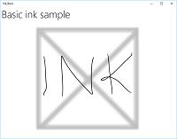

# Взаимодействие с помощью пера в приложениях UWP

Оптимизируйте взаимодействия с помощью пера в своем приложении универсальной платформы Windows (UWP), чтобы обеспечить как стандартные функциональные возможности для работы с [**указателем**](https://msdn.microsoft.com/library/windows/apps/br225633), так и возможности Windows Ink.

> Примечание. Данный раздел посвящен платформе Windows Ink. Общую информацию о работе со входными данными указателей, сходных с мышью, сенсорным краном и сенсорной панелью, см. в разделе [Работа с входными данными указателя](handle-pointer-input.md).


**Важные API**

-   [**Windows.Devices.Input**](https://msdn.microsoft.com/library/windows/apps/br225648)
-   [**Windows.UI.Input.Inking**](https://msdn.microsoft.com/library/windows/apps/br208524)
-   [**Windows.UI.Input.Inking.Core**](https://msdn.microsoft.com/library/windows/apps/dn958452)

Платформа Windows Ink — наряду с пером — обеспечивает естественный способ создания цифровых рукописных примечаний, рисунков и заметок. Платформа поддерживает получение входных данных дигитайзера в виде рукописных данных, создание рукописных данных, управление этими данными, отображение их в виде росчерков пера на устройстве вывода и преобразование этих росчерков в текст с помощью функции распознавания рукописного ввода.

В дополнение к получению данных об основном положении и движении пера, когда пользователь пишет или рисует, ваше приложение также может отслеживать и собирать сведения об изменяющейся силе нажатия, используемой в росчерке. Эти сведения вместе с параметрами формы, размера и поворота кончика пера, цвета чернил и цели (обычный рукописный ввод, стирание, выделение и выбор) позволяют обеспечить результат взаимодействия, очень похожий на письмо или рисунок ручкой, карандашом или кистью на бумаге.

**Примечание.**  Ваше приложение может поддерживать рукописный ввод и от других устройств на основе указателя, например дигитайзеров сенсорного ввода и мыши. 

Платформа рукописного ввода очень гибкая. Она предназначена для поддержки различных уровней функциональности в зависимости от ваших требований.

Платформа рукописного ввода включает три компонента.

-   [
              **InkCanvas**
            ](https://msdn.microsoft.com/library/windows/apps/dn858535) — элемент управления платформы пользовательского интерфейса XAML, который по умолчанию получает и отображает все входные данные от пера, будь то росчерк пера или росчерк стирания.

-   [
              **InkPresenter**
            ](https://msdn.microsoft.com/library/windows/apps/dn922011) — объект кода программной части, создаваемый вместе с элементом управления [**InkCanvas**](https://msdn.microsoft.com/library/windows/apps/dn858535) (предоставляется свойством [**InkCanvas.InkPresenter**](https://msdn.microsoft.com/library/windows/apps/dn899081)). Этот объект обеспечивает все возможности рукописного ввода по умолчанию, предоставляемые элементом **InkCanvas**, вместе с полным набором API для дополнительной настройки и персонализации.

-   [
              **IInkD2DRenderer**
            ](https://msdn.microsoft.com/library/mt147263) — позволяет преобразовать росчерки пера в специальный контекст устройства Direct2D универсального приложения для Windows вместо элемента управления по умолчанию [**InkCanvas**](https://msdn.microsoft.com/library/windows/apps/dn858535). Это делает возможным полную настройку рукописного ввода.

## <span id="inkcanvas"></span><span id="INKCANVAS"></span>Базовый рукописный ввод с использованием InkCanvas


Для выполнения базовой функции рукописного ввода просто поместите [**InkCanvas**](https://msdn.microsoft.com/library/windows/apps/dn858535) в любом месте страницы.

[
            **InkCanvas**](https://msdn.microsoft.com/library/windows/apps/dn858535) поддерживает рукописный ввод только с помощью пера. Входные данные обрабатываются как росчерк пера с помощью параметров цвета и толщины по умолчанию или трактуются как ластик для росчерков (когда ввод осуществляется кончиком ластика или кончиком пера, модифицированным при помощи кнопки стирания).

В этом примере [**InkCanvas**](https://msdn.microsoft.com/library/windows/apps/dn858535) перекрывает фоновое изображение.

```XAML
<Grid Background="{ThemeResource ApplicationPageBackgroundThemeBrush}">
    <Grid.RowDefinitions>
        <RowDefinition Height="Auto"/>
        <RowDefinition Height="*"/>
    </Grid.RowDefinitions>
    <StackPanel x:Name="HeaderPanel" Orientation="Horizontal" Grid.Row="0">
        <TextBlock x:Name="Header" 
                   Text="Basic ink sample" 
                   Style="{ThemeResource HeaderTextBlockStyle}" 
                   Margin="10,0,0,0" />            
    </StackPanel>
    <Grid Grid.Row="1">
        <Image Source="Assets\StoreLogo.png" />
        <InkCanvas x:Name="inkCanvas" />
    </Grid>
</Grid>
```

В этой серии изображений показано, как ввод с помощью пера обрабатывается этим элементом управления [**InkCanvas**](https://msdn.microsoft.com/library/windows/apps/dn858535).

|  |  |  |
| --- | --- | ---|
| Пустой элемент [**InkCanvas**](https://msdn.microsoft.com/library/windows/apps/dn858535) с фоновым изображением. | [
            **InkCanvas**](https://msdn.microsoft.com/library/windows/apps/dn858535) с росчерками пера. | [
            **InkCanvas**](https://msdn.microsoft.com/library/windows/apps/dn858535) с одним росчерком (обратите внимание, как операция стирания применяется ко всему росчерку, а не его части). |

Возможности рукописного ввода, поддерживаемые элементом управления [**InkCanvas**](https://msdn.microsoft.com/library/windows/apps/dn858535), предоставляются объектом кода программной части [**InkPresenter**](https://msdn.microsoft.com/library/windows/apps/dn922011).

При выполнении базового рукописного ввода вам не нужно беспокоиться об элементе [**InkPresenter**](https://msdn.microsoft.com/library/windows/apps/dn922011). Однако для настройки и конфигурации реакции на рукописный ввод в элементе [**InkCanvas**](https://msdn.microsoft.com/library/windows/apps/dn858535) необходимо получить доступ к соответствующему объекту **InkPresenter**.

## <span id="inkpresenter"></span><span id="INKPRESENTER"></span>Базовая настройка с использованием InkPresenter


Объект [**InkPresenter**](https://msdn.microsoft.com/library/windows/apps/dn922011) создается с каждым элементом управления [**InkCanvas**](https://msdn.microsoft.com/library/windows/apps/dn858535).

Помимо всех реакций на рукописный ввод по умолчанию для соответствующего элемента управления [**InkCanvas**](https://msdn.microsoft.com/library/windows/apps/dn858535), [**InkPresenter**](https://msdn.microsoft.com/library/windows/apps/dn922011) предоставляет полный набор API для дополнительной настройки росчерков. Это касается свойств росчерков, поддерживаемых типов устройств ввода и того, обрабатываются входные данные объектом или передаются приложению.

**Примечание.**  
[
            **InkPresenter**](https://msdn.microsoft.com/library/windows/apps/dn922011) нельзя создавать напрямую. Вместо этого доступ к нему осуществляется с помощью свойства [**InkPresenter**](https://msdn.microsoft.com/library/windows/apps/dn899081) элемента [**InkCanvas**](https://msdn.microsoft.com/library/windows/apps/dn858535).

 

Здесь мы настраиваем [**InkPresenter**](https://msdn.microsoft.com/library/windows/apps/dn899081) для интерпретации данных, вводимых пером или мышью, в качестве росчерков пера. Мы также задаем некоторые исходные атрибуты росчерка пера, используемые для вывода росчерков на [**InkCanvas**](https://msdn.microsoft.com/library/windows/apps/dn858535).

```CSharp
public MainPage()
{
    this.InitializeComponent();

    // Set supported inking device types.
    inkCanvas.InkPresenter.InputDeviceTypes = 
        Windows.UI.Core.CoreInputDeviceTypes.Mouse | 
        Windows.UI.Core.CoreInputDeviceTypes.Pen;

    // Set initial ink stroke attributes.
    InkDrawingAttributes drawingAttributes = new InkDrawingAttributes();
    drawingAttributes.Color = Windows.UI.Colors.Black;
    drawingAttributes.IgnorePressure = false;
    drawingAttributes.FitToCurve = true;
    inkCanvas.InkPresenter.UpdateDefaultDrawingAttributes(drawingAttributes);
}
```

Атрибуты росчерка пера можно задавать динамически в соответствии с предпочтениями пользователя или требованиями к приложению.

Здесь мы позволяем пользователю выбирать цвет чернил в списке.

```XAML
<Grid Background="{ThemeResource ApplicationPageBackgroundThemeBrush}">
    <Grid.RowDefinitions>
        <RowDefinition Height="Auto"/>
        <RowDefinition Height="*"/>
    </Grid.RowDefinitions>
    <StackPanel x:Name="HeaderPanel" Orientation="Horizontal" Grid.Row="0">
        <TextBlock x:Name="Header" 
                   Text="Basic ink customization sample" 
                   VerticalAlignment="Center"
                   Style="{ThemeResource HeaderTextBlockStyle}" 
                   Margin="10,0,0,0" />
        <TextBlock Text="Color:"
                   Style="{StaticResource SubheaderTextBlockStyle}"
                   VerticalAlignment="Center"
                   Margin="50,0,10,0"/>
        <ComboBox x:Name="PenColor"
                  VerticalAlignment="Center"
                  SelectedIndex="0"
                  SelectionChanged="OnPenColorChanged">
            <ComboBoxItem Content="Black"/>
            <ComboBoxItem Content="Red"/>
        </ComboBox>
    </StackPanel>
    <Grid Grid.Row="1">
        <Image Source="Assets\StoreLogo.png" />
        <InkCanvas x:Name="inkCanvas" />
    </Grid>
</Grid>
```

Затем мы обрабатываем изменения в выбранном цвете и обновляем соответствующим образом атрибуты росчерка пера.

```CSharp
// Update ink stroke color for new strokes.
private void OnPenColorChanged(object sender, SelectionChangedEventArgs e)
{
    if (inkCanvas != null)
    {
        InkDrawingAttributes drawingAttributes = 
            inkCanvas.InkPresenter.CopyDefaultDrawingAttributes();

        string value = ((ComboBoxItem)PenColor.SelectedItem).Content.ToString();

        switch (value)
        {
            case "Black":
                drawingAttributes.Color = Windows.UI.Colors.Black;
                break;
            case "Red":
                drawingAttributes.Color = Windows.UI.Colors.Red;
                break;
            default:
                drawingAttributes.Color = Windows.UI.Colors.Black;
                break;
        };

        inkCanvas.InkPresenter.UpdateDefaultDrawingAttributes(drawingAttributes);
    }
}
```

На этих изображениях показано, как ввод с помощью пера обрабатывается и настраивается элементом [**InkPresenter**](https://msdn.microsoft.com/library/windows/apps/dn899081).

|  |  |
| --- | -- |
| [
            **InkCanvas**](https://msdn.microsoft.com/library/windows/apps/dn858535) с черными росчерками пера по умолчанию. | [
            **InkCanvas**](https://msdn.microsoft.com/library/windows/apps/dn858535) с выбранными пользователем красными росчерками пера. |

 

Для предоставления функций помимо рукописного ввода и стирания, таких как возможность выбора росчерка, ваше приложение должно определить конкретные входные данные для элемента [**InkPresenter**](https://msdn.microsoft.com/library/windows/apps/dn899081), чтобы передать необработанные данные для обработки вашим приложением.

## <span id="passthrough"></span><span id="PASSTHROUGH"></span>Передача входных данных для расширенной обработки


По умолчанию [**InkPresenter**](https://msdn.microsoft.com/library/windows/apps/dn899081) обрабатывает все входные данные как росчерк пера или росчерк стирания. Это относится и к входным данным, которые модифицированы дополнительной возможностью оборудования, например кнопкой пера, правой кнопкой мыши или чем-то подобным.

При использовании этих дополнительных возможностей пользователи обычно ожидают большей функциональности или изменения поведения.

В некоторых случаях может понадобиться предоставить базовые функции рукописного ввода для пера без дополнительных возможностей (функций, которые обычно не связаны с кончиком пера), других типов устройств ввода, большей функциональности или изменения поведения на основе выбора пользователя в пользовательском интерфейсе вашего приложения.

Для поддержки этого [**InkPresenter**](https://msdn.microsoft.com/library/windows/apps/dn899081) можно настроить оставлять определенные входные данные необработанными. Эти необработанные входные данные затем передаются в ваше приложение для обработки.

В следующем примере кода показаны этапы добавления возможности выбора росчерка, когда входные данные изменяются кнопкой пера (или правой кнопкой мыши).

В этом примере для размещения всего кода мы используем файлы MainPage.xaml и MainPage.xaml.cs.

1.  Сначала мы настраиваем пользовательский интерфейс в файле MainPage.xaml.

    Здесь мы добавляем холст (под элементом [**InkCanvas**](https://msdn.microsoft.com/library/windows/apps/dn858535)) для рисования росчерка выбора. Если использовать отдельный слой для рисования росчерка выбора, элемент **InkCanvas** и его содержимое останутся без изменений.

    
```    XAML
<Grid Background="{ThemeResource ApplicationPageBackgroundThemeBrush}">
        <Grid.RowDefinitions>
            <RowDefinition Height="Auto"/>
            <RowDefinition Height="*"/>
        </Grid.RowDefinitions>
        <StackPanel x:Name="HeaderPanel" Orientation="Horizontal" Grid.Row="0">
            <TextBlock x:Name="Header" 
                       Text="Advanced ink customization sample" 
                       VerticalAlignment="Center"
                       Style="{ThemeResource HeaderTextBlockStyle}" 
                       Margin="10,0,0,0" />
        </StackPanel>
        <Grid Grid.Row="1">
            <!-- Canvas for displaying selection UI. -->
            <Canvas x:Name="selectionCanvas"/>
            <!-- Inking area -->
            <InkCanvas x:Name="inkCanvas"/>
        </Grid>
    </Grid>
```

2.  В файле MainPage.xaml.cs мы объявляем несколько глобальных переменных для сохранения ссылок на аспекты пользовательского интерфейса выбора. В частности, росчерк лассо выбора и ограничивающий прямоугольник, который выделяет выбранные росчерки.
```    CSharp
// Stroke selection tool.
    private Polyline lasso;
    // Stroke selection area.
    private Rect boundingRect;
```

3.  Затем мы настраиваем [**InkPresenter**](https://msdn.microsoft.com/library/windows/apps/dn899081) для интерпретации данных, вводимых пером или мышью, в качестве росчерков пера и задаем некоторые исходные атрибуты росчерка пера, используемые для вывода росчерков на [**InkCanvas**](https://msdn.microsoft.com/library/windows/apps/dn858535).

    Важнее всего то, что мы используем свойство [**InputProcessingConfiguration**](https://msdn.microsoft.com/library/windows/apps/dn948764) элемента [**InkPresenter**](https://msdn.microsoft.com/library/windows/apps/dn899081) для указания того, что любые измененные входные данные должны обрабатываться приложением. Измененные входные данные указываются путем назначения перечислению **InputProcessingConfiguration.RightDragAction** значения [**InkInputRightDragAction.LeaveUnprocessed**](https://msdn.microsoft.com/library/windows/apps/dn948760).

    Затем мы назначаем прослушиватели для необработанных событий [**PointerPressed**](https://msdn.microsoft.com/library/windows/apps/dn914712), [**PointerMoved**](https://msdn.microsoft.com/library/windows/apps/dn914711) и [**PointerReleased**](https://msdn.microsoft.com/library/windows/apps/dn914713), переданных элементом [**InkPresenter**](https://msdn.microsoft.com/library/windows/apps/dn899081). Все функции выбора реализованы в обработчиках для этих событий.

    Наконец, мы назначаем прослушиватели для событий [**StrokeStarted**](https://msdn.microsoft.com/library/windows/apps/dn914702) и [**StrokesErased**](https://msdn.microsoft.com/library/windows/apps/dn948767) элемента [**InkPresenter**](https://msdn.microsoft.com/library/windows/apps/dn899081). Мы используем обработчики для этих событий, чтобы очистить пользовательский интерфейс выбора, если начинается новый росчерк или стирается существующий.

    
```    CSharp
public MainPage()
    {
        this.InitializeComponent();

        // Set supported inking device types.
        inkCanvas.InkPresenter.InputDeviceTypes =
            Windows.UI.Core.CoreInputDeviceTypes.Mouse |
            Windows.UI.Core.CoreInputDeviceTypes.Pen;

        // Set initial ink stroke attributes.
        InkDrawingAttributes drawingAttributes = new InkDrawingAttributes();
        drawingAttributes.Color = Windows.UI.Colors.Black;
        drawingAttributes.IgnorePressure = false;
        drawingAttributes.FitToCurve = true;
        inkCanvas.InkPresenter.UpdateDefaultDrawingAttributes(drawingAttributes);

        // By default, the InkPresenter processes input modified by 
        // a secondary affordance (pen barrel button, right mouse 
        // button, or similar) as ink.
        // To pass through modified input to the app for custom processing 
        // on the app UI thread instead of the background ink thread, set 
        // InputProcessingConfiguration.RightDragAction to LeaveUnprocessed.
        inkCanvas.InkPresenter.InputProcessingConfiguration.RightDragAction = 
            InkInputRightDragAction.LeaveUnprocessed;

        // Listen for unprocessed pointer events from modified input.
        // The input is used to provide selection functionality.
        inkCanvas.InkPresenter.UnprocessedInput.PointerPressed += 
            UnprocessedInput_PointerPressed;
        inkCanvas.InkPresenter.UnprocessedInput.PointerMoved += 
            UnprocessedInput_PointerMoved;
        inkCanvas.InkPresenter.UnprocessedInput.PointerReleased += 
            UnprocessedInput_PointerReleased;

        // Listen for new ink or erase strokes to clean up selection UI.
        inkCanvas.InkPresenter.StrokeInput.StrokeStarted += 
            StrokeInput_StrokeStarted;
        inkCanvas.InkPresenter.StrokesErased += 
            InkPresenter_StrokesErased;
    }
```

4.  Затем мы определяем обработчики для необработанных событий [**PointerPressed**](https://msdn.microsoft.com/library/windows/apps/dn914712), [**PointerMoved**](https://msdn.microsoft.com/library/windows/apps/dn914711) и [**PointerReleased**](https://msdn.microsoft.com/library/windows/apps/dn914713), переданных элементом [**InkPresenter**](https://msdn.microsoft.com/library/windows/apps/dn899081).

    Все функции выбора реализованы в этих обработчиках, включая росчерк лассо и ограничивающий прямоугольник.

    
```    CSharp
// Handle unprocessed pointer events from modifed input.
    // The input is used to provide selection functionality.
    // Selection UI is drawn on a canvas under the InkCanvas.
    private void UnprocessedInput_PointerPressed(
        InkUnprocessedInput sender, PointerEventArgs args)
    {
        // Initialize a selection lasso.
        lasso = new Polyline()
        {
            Stroke = new SolidColorBrush(Windows.UI.Colors.Blue),
            StrokeThickness = 1,
            StrokeDashArray = new DoubleCollection() { 5, 2 },
        };

        lasso.Points.Add(args.CurrentPoint.RawPosition);

        selectionCanvas.Children.Add(lasso);
    }

    private void UnprocessedInput_PointerMoved(
        InkUnprocessedInput sender, PointerEventArgs args)
    {
        // Add a point to the lasso Polyline object.
        lasso.Points.Add(args.CurrentPoint.RawPosition);
    }

    private void UnprocessedInput_PointerReleased(
        InkUnprocessedInput sender, PointerEventArgs args)
    {
        // Add the final point to the Polyline object and 
        // select strokes within the lasso area.
        // Draw a bounding box on the selection canvas 
        // around the selected ink strokes.
        lasso.Points.Add(args.CurrentPoint.RawPosition);

        boundingRect = 
            inkCanvas.InkPresenter.StrokeContainer.SelectWithPolyLine(
                lasso.Points);

        DrawBoundingRect();
    }
```

5.  Чтобы закончить обработчик событий PointerReleased, мы очищаем слой выбора всего содержимого (росчерк лассо) и рисуем один ограничивающий прямоугольник вокруг росчерков пера, включенных в область лассо.

    
```    CSharp
// Draw a bounding rectangle, on the selection canvas, encompassing 
    // all ink strokes within the lasso area.
    private void DrawBoundingRect()
    {
        // Clear all existing content from the selection canvas.
        selectionCanvas.Children.Clear();

        // Draw a bounding rectangle only if there are ink strokes 
        // within the lasso area.
        if (!((boundingRect.Width == 0) || 
            (boundingRect.Height == 0) || 
            boundingRect.IsEmpty))
        {
            var rectangle = new Rectangle()
            {
                Stroke = new SolidColorBrush(Windows.UI.Colors.Blue),
                StrokeThickness = 1,
                StrokeDashArray = new DoubleCollection() { 5, 2 },
                Width = boundingRect.Width,
                Height = boundingRect.Height
            };

            Canvas.SetLeft(rectangle, boundingRect.X);
            Canvas.SetTop(rectangle, boundingRect.Y);

            selectionCanvas.Children.Add(rectangle);
        }
    }
```

6.  Наконец мы определяем обработчики для событий InkPresenter [**StrokeStarted**](https://msdn.microsoft.com/library/windows/apps/dn914702) и [**StrokesErased**](https://msdn.microsoft.com/library/windows/apps/dn948767).

    Оба эти события просто вызывают одну и ту же функцию очистки, чтобы сбросить текущий выбор при обнаружении нового росчерка.
```    CSharp
// Handle new ink or erase strokes to clean up selection UI.
    private void StrokeInput_StrokeStarted(
        InkStrokeInput sender, Windows.UI.Core.PointerEventArgs args)
    {
        ClearSelection();
    }

    private void InkPresenter_StrokesErased(
        InkPresenter sender, InkStrokesErasedEventArgs args)
    {
        ClearSelection();
    }
```

7.  Вот функция для удаления всего пользовательского интерфейса выбора с холста выбора, когда начинается новый росчерк или стирается существующий.
```    CSharp
// Clean up selection UI.
    private void ClearSelection()
    {
        var strokes = inkCanvas.InkPresenter.StrokeContainer.GetStrokes();
        foreach (var stroke in strokes)
        {
            stroke.Selected = false;
        }
        ClearDrawnBoundingRect();
    }

    private void ClearDrawnBoundingRect()
    {
        if (selectionCanvas.Children.Any())
        {
            selectionCanvas.Children.Clear();
            boundingRect = Rect.Empty;
        }
    }
```

## <span id="iinkd2drenderer"></span><span id="IINKD2DRENDERER"></span>Пользовательская передача рукописного ввода


По умолчанию рукописные данные обрабатываются в фоновом потоке с низкой задержкой и отображаются как «влажные» в процессе ввода. После завершения росчерка (когда пользователь поднял перо или палец либо отпустил кнопку мыши) росчерк обрабатывается в потоке пользовательского интерфейса и отображается «сухим» на слое [**InkCanvas**](https://msdn.microsoft.com/library/windows/apps/dn858535) (над содержимым приложения, вместо влажных рукописных данных).

Платформа рукописного ввода позволяет переопределить это поведение и полностью настроить рукописный ввод за счет пользовательской сушки рукописных данных.

Для пользовательской сушки требуется объект [**IInkD2DRenderer**](https://msdn.microsoft.com/library/mt147263), который управляет рукописными данными и преобразовывает их в контекст устройства Direct2D вашего универсального приложения для Windows, вместо элемента управления по умолчанию [**InkCanvas**](https://msdn.microsoft.com/library/windows/apps/dn858535).

Вызывая [**ActivateCustomDrying**](https://msdn.microsoft.com/library/windows/apps/dn922012) (до загрузки элемента [**InkCanvas**](https://msdn.microsoft.com/library/windows/apps/dn858535)), приложение создает объект [**InkSynchronizer**](https://msdn.microsoft.com/library/windows/apps/dn903979), чтобы настроить отображение росчерка пера сухим в [**SurfaceImageSource**](https://msdn.microsoft.com/library/windows/apps/hh702041) или [**VirtualSurfaceImageSource**](https://msdn.microsoft.com/library/windows/apps/hh702050). Например, росчерк пера можно преобразовать в растровый формат и интегрировать в содержимое приложения вместо отдельного слоя **InkCanvas**.

Полный пример этой функции см. в разделе [Сложный пример рукописного ввода](http://go.microsoft.com/fwlink/p/?LinkID=620314).


## Другие статьи в этом разделе 
<table>
<colgroup>
<col width="50%" />
<col width="50%" />
</colgroup>
<thead>
<tr class="header">
<th align="left">Раздел</th>
<th align="left">Описание</th>
</tr>
</thead>
<tbody>
<tr class="odd">
<td align="left"><p>[Распознавание росчерков пера](convert-ink-to-text.md)</p></td>
<td align="left"><p>Преобразуйте росчерки пера в текст с помощью распознавания рукописного ввода или в фигуры с помощью настраиваемого распознавания.</p></td>
</tr>
<tr class="even">
<td align="left"><p>[Хранение и извлечение росчерков пера](save-and-load-ink.md)</p></td>
<td align="left"><p>Храните данные росчерка пера в GIF-файле, используя встроенные метаданные формата Ink Serialized Format (ISF).</p></td>
</tr>
</tbody>
</table>

 


## <span id="related_topics"></span>Связанные разделы


* [Работа с данными указателя](handle-pointer-input.md)
* [Распознавание устройств ввода](identify-input-devices.md)

**Примеры**
* [Пример рукописного ввода](http://go.microsoft.com/fwlink/p/?LinkID=620308)
* [Простой пример рукописного ввода](http://go.microsoft.com/fwlink/p/?LinkID=620312)
* [Сложный пример рукописного ввода](http://go.microsoft.com/fwlink/p/?LinkID=620314)
* [Пример базового ввода](http://go.microsoft.com/fwlink/p/?LinkID=620302)
* [Пример ввода с малой задержкой](http://go.microsoft.com/fwlink/p/?LinkID=620304)
* [Пример режима взаимодействия с пользователем](http://go.microsoft.com/fwlink/p/?LinkID=619894)
* [Пример визуальных элементов фокуса](http://go.microsoft.com/fwlink/p/?LinkID=619895)

**Примеры архивов**
* [Ввод: пример возможностей устройства](http://go.microsoft.com/fwlink/p/?linkid=231530)
* [Ввод: пример событий пользовательского ввода на XAML](http://go.microsoft.com/fwlink/p/?linkid=226855)
* [Пример прокрутки, сдвига и масштабирования на XAML](http://go.microsoft.com/fwlink/p/?linkid=251717)
* [Ввод: жесты и манипуляции с помощью GestureRecognizer](http://go.microsoft.com/fwlink/p/?LinkID=231605)
 

 


<!--HONumber=May16_HO2-->


