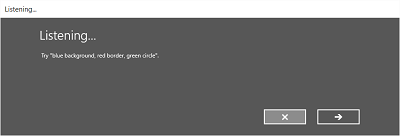
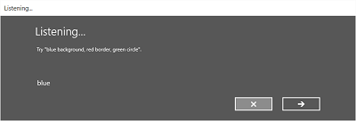

# Взаимодействие с помощью голосовых функций

Интегрируйте функции распознавания речи и преобразования текста в речь (также известную как TTS или синтез речи) непосредственно в приложение.

**Другие компоненты речи**

-   См. [Рекомендации по проектированию Кортаны](cortana-interactions.md), если планируется выполнять функциональность приложения в пользовательском интерфейсе **Кортаны**.

**Распознавание речи:** преобразует слова, произносимые пользователем, в текст для заполнения формы, диктовки, указания действия или команды и выполнения других задач. Поддерживаются как заранее определенные грамматики для диктовки произвольного текста и веб-поиска, так и пользовательские грамматики, созданные с помощью спецификации Speech Recognition Grammar Specification (SRGS) Version 1.0.

**Преобразование текста в речь:** использует модуль синтеза речи (голоса) для преобразования текстовой строки в произносимые слова. Строка ввода может быть либо базовым текстом без каких-либо добавлений, либо более сложным текстом на языке SSML. SSML обеспечивает стандартные способы управления характеристиками вывода речи, такими как произношение, громкость, высота, скорость речи и ударение.

> [!NOTE]
> С помощью **Кортаны** и настраиваемых голосовых команд приложение можно запустить на переднем плане (фокус переносится на приложение, как если бы оно было запущено из меню "Пуск") или активировать как фоновую службу (фокус сохраняется на **Кортане**, но результаты предоставляются из приложения).
> 
> Команды, для которых требуется дополнительный контекст или пользовательский ввод (такой как отправка сообщения определенному контакту), наилучшим образом обрабатываются на переднем плане, а основные команды при этом могут обрабатываться в **Кортане** в фоновом приложении.
>
> Если планируется, что посредством голосовых команд функциональность будет запускаться как фоновая служба в пользовательском интерфейсе **Кортаны**, см. раздел [Рекомендации по проектированию Кортаны](cortana-design-guidelines.md).

Вдумчивое проектирование и реализация помогут сделать речь надежным и приятным способом взаимодействия пользователя с вашим приложением, который сможет дополнить или даже заменить взаимодействие с помощью клавиатуры, мыши, сенсорного ввода и жестов.

## Проектирование взаимодействия с помощью голосовых функций

Следующие инструкции и рекомендации описывают, как лучше всего интегрировать функции распознавания речи и преобразования текста в речь в способы взаимодействия приложения с пользователем.

Если вы планируете поддержку взаимодействия с вашим приложением посредством голосовых команд:

-   Какие действия можно выполнять с помощью голосовых команд? Может ли пользователь перемещаться между страницами, вызывать команды или вводить данные, например, для заполнения текстовых полей, создания кратких заметок или диктовки длинных сообщений?
-   Является ли голосовой ввод хорошим способом для выполнения задач?
-   Как пользователь узнает о возможности голосового ввода?
-   Приложение всегда слушает пользователя, или пользователю нужно выполнить действие для активации режима прослушивания?
-   Какие фразы инициируют действия? Следует ли отображать фразы и действия на экране?
-   Необходимо ли отображать экраны подсказок, подтверждений и уточнений? Требуется ли преобразование текста в речь (TTS)?
-   Каким должно быть диалоговое окно взаимодействия между приложением и пользователем?
-   Нужен ли настраиваемый или ограниченный словарь (например, медицинский, научный либо региональный) в контексте приложения?
-   Необходимо ли подключение к сети?

## Текстовый ввод

Речь для текстового ввода может быть короткой (одно слово или одна фраза) или длинной (непрерывная диктовка). Короткая форма ввода не быть продолжительностью больше 10 секунд, а длинная форма — не больше двух минут. (Ввод длинной формы можно перезапустить без участия пользователя, чтобы создать впечатление непрерывной диктовки.)

Для указания того, что функция распознавания речи поддерживается, пользователю следует предоставить визуальную подсказку, как и запрос, желает ли пользователь включить эту функцию. Например, для указания доступности, а также состояния можно использовать кнопку панели команд с глифом микрофона (см. [Панели команд](../controls-and-patterns/app-bars.md)).

Предоставьте отзыв о непрерывном распознавании, чтобы минимизировать явное отсутствие какой-либо реакции при выполнении распознавания.

Позвольте пользователям изменять текст распознавания с помощью ввода с клавиатуры, вариантов уточнения или дополнительного распознавания речи.

Остановите распознавание, если обнаружен ввод с устройств, не распознающих речь, например, с сенсорного устройства или клавиатуры. Скорее всего, это означает, что пользователь перешел к выполнению другой задачи, например исправлению текста распознанной речи или взаимодействию с другими полями формы.

Укажите время, отсутствие речевого ввода в течение которого указывает, что распознавание может быть завершено. Не начинайте распознавание речи автоматически по истечении этого периода времени, так как, обычно, это означает, что пользователь прекратил взаимодействие с вашим приложением.

Отключите все элементы пользовательского интерфейса для постоянного распознавания речи и завершите сеанс распознавания речи, сетевое подключение отсутствует. Для непрерывного распознавания речи необходимо подключение к сети.

## Командные элементы

С помощью голосового ввода можно инициировать действия, вызывать команды и выполнять задачи.

Если позволяет пространство, рекомендуется отображать поддерживаемые реакции для текущего контекста приложения с примерами правильного ввода. Это сокращает список возможных реакций, которые должно обработать приложение, а также исключает путаницу для пользователя.

Попробуйте ограничить вопросы так, чтобы на них можно было дать наиболее специфичный ответ. Например, вопрос "Чем вы хотите заняться сегодня?" очень открытый и требует большого определения грамматики, так как ответы на него могут быть очень разнообразными. А вопрос "Что вы хотите – поиграть в игру или послушать музыку?" ограничивает ответ до одного из двух допустимых ответов, которые, соответственно, потребуют небольшого определения грамматики. Небольшую грамматику намного проще создать, и она дает более точные результаты распознавания.

Запрашивайте подтверждение пользователя, если уверенность в распознавании речи недостаточно высока. Если намерение пользователя непонятно, лучше получить объяснение, чем инициировать нежелаемое действие.

Для указания того, что функция распознавания речи поддерживается, пользователю следует предоставить визуальную подсказку, как и запрос, желает ли пользователь включить эту функцию. Например, для указания доступности, а также состояния можно использовать кнопку панели команд с глифом микрофона (см. [Руководство по панелям команд](../controls-and-patterns/app-bars.md)).

Если переключатель функции распознавания речи обычно не виден, попробуйте отобразить индикатор состояния в области содержимого приложения.

Если распознавание вызывается пользователем, можно использовать встроенные возможности распознавания для согласованности. Встроенные возможности включают настраиваемые экраны с подсказками, примерами, уточнениями, подтверждениями и ошибками.

Отображение экрана зависит от указанных ограничений:

-   предопределенная грамматика (диктовка или веб-поиск)

    -   Экран **Слушаю**.
    -   Экран **Думаю**.
    -   Экран **Я услышал** или экран ошибки.
-   Список слов либо фраз или файл грамматики SRGS

    -   Экран **Слушаю**.
    -   Экран **Вы сказали**, если сказанное пользователем можно интерпретировать по-разному;
    -   Экран **Я услышал** или экран ошибки.

На экране **Слушаю** вы можете:

-   настроить текст заголовка;
-   предоставить пример текста, который пользователи могут произнести;
-   указать, отображается ли экран **Я услышал**;
-   прочитать распознанную строку для пользователя на экране **Я услышал**.

Далее приведен пример встроенного процесса распознавания речи для распознавателя, который использует ограничения, определенные в SRGS. В этом примере распознавание речи прошло успешно.

## Постоянное ожидание голосового ввода

Приложение сможет ожидать речевой ввод и распознавать его сразу после запуска приложения, без вмешательства пользователя.

Ограничения грамматики следует настраивать с учетом контекста приложения. Это обеспечивает целевое распознавание речи соответственно текущей задаче и минимизирует ошибки.

## "Что можно говорить?"

Когда включена функция голосового ввода, важно помочь пользователю узнать, какие голосовые команды могут быть распознаны и какие действия можно выполнить с их помощью.

Если функция распознавания речи включена пользователем, рекомендуется использовать панель команд или меню команд для отображения всех слов и фраз, поддерживаемых в текущем контексте.

Если функция распознавания речи всегда включена, рассмотрите вариант добавления фразы "Что можно говорить?" на каждой странице. Когда пользователь произнесет эту фразу, отобразите все слова и фразы, поддерживаемые в текущем контексте. Использование этой фразы обеспечивает согласованный способ узнать возможности голосового ввода в разных разделах системы.

## Сбои распознавания

Сбои распознавания речи случаются. Они происходят в случае плохого качества звука, при распознавании только части фразы или если ввод и вовсе не обнаружен.

Корректно обработайте сбой, помогите пользователю понять, почему распознавание не выполнено, и исправьте ситуацию.

Приложение должно сообщить пользователю, что его команда не была распознана и что ему необходимо повторить попытку ввода.

Предусмотрите один или несколько примеров поддерживаемых фраз. Пользователь, скорее всего, повторит предложенную фразу, и это повысит шанс успешного распознавания речи.

Следует показать список потенциальных совпадений, из которых пользователь сможет выбрать нужное. Это может быть более эффективным, чем повторение всего процесса распознавания.

Необходимо всегда обеспечивать поддержку альтернативных типов ввода, которые особенно полезны для обработки повторных сбоев распознавания. Например, можно предложить пользователю воспользоваться клавиатурой либо мышью или выполнить сенсорный ввод для выбора из списка потенциальных соответствий.

Используйте встроенные возможности распознавания речи, которые включают экраны, информирующие пользователя об ошибке распознавания и предоставляющие ему возможность повторить попытку распознавания.

Прослушайте и попытайтесь исправить ошибки в голосовом вводе. Распознаватель речи может обнаружить проблемы с качеством звука, которые могут снизить точность распознавания речи. Используйте сведения, предоставляемые распознавателем речи, чтобы сообщить пользователю о проблеме и позволить ему внести корректировки, если это необходимо. Например, если для параметра громкости на микрофоне установлено слишком низкое значение, можно предложить пользователю говорить громче или увеличить громкость микрофона.

## Ограничения

Ограничения, или грамматики, определяют произнесенные слова и фразы, которые могут сопоставляться распознавателем речи. Вы можете выбрать одну из предопределенных грамматик веб-службы или создать настраиваемую грамматику, которая будет устанавливаться вместе с приложением.

### Предопределенные грамматики

Предопределенные грамматики диктовки и веб-поиска обеспечивают распознавание речи в приложении без необходимости создавать грамматику. Когда используются эти грамматики, распознавание речи выполняется удаленной веб-службой, а результаты возвращаются на устройство.

-   Стандартная грамматика для диктовки в свободной форме может распознавать большинство слов и фраз, произносимых пользователем на данном языке, и оптимизирована для распознавания коротких фраз. Диктовка в свободной форме удобна, если не нужно ограничивать область высказываний пользователя. Обычно она используется для создания текстов заметок и диктовки сообщений.
-   Грамматика веб-поиска, например грамматика диктовки, содержит большое количество слов и фраз, которые пользователь может произнести. Однако она оптимизирована для распознавания терминов, которыми люди обычно используются, выполняя поиск в Интернете.

> [!NOTE]
> Поскольку предопределенные грамматики для диктовки и веб-поиска могут иметь большой размер и размещаются в сети (а не на устройстве), они могут уступать в производительности настраиваемым грамматикам, установленным на устройстве.

Эти предопределенные грамматики можно использовать для распознавания до ввода речи продолжительностью до 10 секунд, и для этого не потребуется никаких доработок с вашей стороны. Однако потребуется подключение к сети.

### Настраиваемые грамматики

Настраиваемую грамматику разрабатываете и создаете вы, она устанавливается вместе с вашим приложением. Распознавание речи с помощью настраиваемых ограничений выполняется на устройстве.

-   Программные ограничения-списки представляют упрощенный подход к созданию простой грамматики с использованием списка слов или фраз. Для распознавания коротких четких фраз удобно использовать ограничения-списки. Явно указание всех слов в грамматике также повышается точность распознавания, так как подсистема распознавания речи должна обрабатывать голосовые данные только в рамках подтверждения соответствия. Список можно также обновлять программными средствами.
-   Грамматика SRGS — это статический документ, который, в отличие от программного ограничения-списка, использует формат XML, определенный в спецификации [SRGS Version 1.0](http://go.microsoft.com/fwlink/p/?LinkID=262302). Грамматика SRGS предоставляет больший контроль над распознаванием речи и позволяет создавать несколько семантических значений в одном распознавании.

    Советы по созданию грамматики SRGS.

    -   Старайтесь, чтобы грамматика была небольшой. Чем меньше в грамматике фраз, тем выше точность распознавания по сравнению с более объемной грамматикой, содержащей множество фраз. Лучше иметь несколько небольших грамматик для конкретных сценариев, чем одну грамматику для всего приложения.
    -   Сообщайте пользователям, какие голосовые команды они могут произносить к каждом контексте приложения; включайте и выключайте грамматики по мере необходимости.
    -   Проектируйте каждую грамматику так, чтобы пользователь мог произносить команды несколькими способами. Например, можно использовать правило **GARBAGE**, которое позволяет сопоставить речевой ввод, который не определен в вашей грамматика. Это позволит пользователям произносить дополнительные слова, не имеющие значения для вашего приложения. Например, "дай мне", "и", "уф", "может" и т. д.
    -   Используйте элемент [sapi:subset](http://msdn.microsoft.com/library/windowsphone/design/jj572474.aspx) для сопоставления речевого ввода. это расширение Майкрософт для спецификации SRGS. Оно позволяет сопоставлять частичные фразы.
    -   Старайтесь не определять в грамматике фразы, которые содержат только один слог. Точность распознавания повышается, если фразы содержат два слога или более.
    -   Старайтесь не использовать фразы со сходным звучанием. Например, такие фразы, как "привет", "буфет" и "бювет" могут запутать систему распознавания и привести к плохим показателям точности распознавания.

> [!NOTE]
> Используемый тип ограничения зависит от сложности создаваемого взаимодействия с распознаванием. Каждый может оказаться наилучшим для конкретной задачи распознавания, и в приложении может найтись место всем типам ограничений.

### Варианты произношения

Если в вашем приложении присутствуют специализированные, необычные или вымышленные слова либо слова с непривычным произношением, повысить точность их распознавания можно путем определения вариантов произношения.

Для небольшого списка слов и фраз или списка редко используемых слов и фраз можно создать варианты произношения в грамматике SRGS. Дополнительные сведения см. в разделе, посвященном [элементу token](http://msdn.microsoft.com/library/windowsphone/design/hh361600.aspx).

Для больших списков слов и фраз или часто используемых слов и фраз можно создать отдельные документы словаря произношения. Дополнительные сведения см. в разделе [о словарях и фонетических алфавитах](http://msdn.microsoft.com/library/windowsphone/design/hh361646.aspx).

## Тестирование

Проверяйте точность распознавания речи и поддерживаемые пользовательские интерфейсы на целевой аудитории вашего приложения. Это лучший способ определить эффективность речевого взаимодействия в приложении. Например, пользователи получают плохие результаты распознавания, потому что ваше приложение не ожидает произношения общих фраз?

Измените грамматику, так чтобы она поддерживала ту или иную фразу, или предоставьте пользователям список поддерживаемых фраз. Если список поддерживаемых фраз предоставляется, убедитесь, что его легко найти.

## Text-to-речь (преобразование текста в речь)

Преобразование текста в речь генерирует речь из обычного текста или SSML.

Попробуйте спроектировать подсказки таким образом, чтобы они были вежливыми и ободряющими.

Подумайте, нужно ли будет читать длинные строки текста. Одно дело прослушать текстовое сообщение, но совсем другое — прослушать длинный список результатов поиска, которые сложно запомнить.

Вы должны обеспечить пользователю элементы управления мультимедиа, которые позволят ему приостановить или остановить работу функции преобразования текста в речь.

Необходимо прослушать все строки преобразования текста в речь, чтобы убедиться, что они звучат понятно и естественно.

-   Связывание необычных слов в одну последовательность, произношение номеров частей или знаков препинания может привести к усложнению восприятия смысла фразы.
-   Речь может звучать неестественно, когда ударение или модуляция отличаются от того, как произнес бы эту фразу носитель языка.

Оба типа проблем можно решить путем использования SSML вместо простого текста в синтезаторе речи. Дополнительные сведения о SSML см. в разделах [Использование SSML для управления синтезированной речью](http://msdn.microsoft.com/library/windowsphone/design/hh378454.aspx) и [Справка по языку SSML](http://msdn.microsoft.com/library/windowsphone/design/hh378377.aspx).

## Другие статьи в этом разделе 

| Тема | Описание |
| --- | --- |
| [Распознавание речи](speech-recognition.md) | С помощью функции распознавания речи можно вводить данные, указывать действия или команды и выполнять задачи. |
| [Определение языка для распознавателя речи](specify-the-speech-recognizer-language.md) | Узнайте, как выбрать установленный язык для распознавания речи. |
| [Определение настраиваемых ограничений распознавания](define-custom-recognition-constraints.md) | Из этой статьи вы узнаете, как определять и использовать настраиваемые ограничения для распознавания речи. |
| [Включение непрерывной диктовки](enable-continuous-dictation.md) |Узнайте, как записать и распознать длительный непрерывный речевой ввод. |
| [Решение проблем голосового ввода](manage-issues-with-audio-input.md) | Узнайте, как решать проблемы с точностью распознавания речи, связанные с качеством голосового ввода. |
| [Установка времени ожидания распознавания речи](set-speech-recognition-timeouts.md) | Вы можете задать время, в течение которого распознаватель речи будет игнорировать тишину или нераспознаваемые звуки (бормотание) и будет ожидать данные на речевом входе. |

## Связанные разделы

* [Взаимодействие с помощью голосовых функций](https://msdn.microsoft.com/library/windows/apps/mt185614)
* [Взаимодействие с Кортаной](https://msdn.microsoft.com/library/windows/apps/mt185598)

 **Примеры**

* [Пример распознавания и синтеза речи](http://go.microsoft.com/fwlink/p/?LinkID=619897)
 

 

<!--HONumber=Dec16_HO3-->

