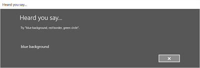

# Распознавание речи


С помощью функции распознавания речи можно вводить данные, указывать действия или команды и выполнять задачи.

**Важные API**

-   [**Windows.Media.SpeechRecognition**](https://msdn.microsoft.com/library/windows/apps/dn653262)


Для распознавания речи используется специальная среда выполнения, API распознавания для программирования среды выполнения, готовые грамматики для диктовки и веб-поиска, а также системный пользовательский интерфейс по умолчанию, который помогает пользователям обнаруживать и использовать функции распознавания речи.


## Настройка аудиоканала


Убедитесь, что ваше устройство оснащено микрофоном или эквивалентным оборудованием.

Настройте возможность устройства ([**DeviceCapability**](https://msdn.microsoft.com/library/windows/apps/br211430)) **Микрофон** в [манифесте пакета приложения](https://msdn.microsoft.com/library/windows/apps/br211474) (файле **package.appxmanifest**) для получения доступа к аудиоканалу микрофона. Это позволяет приложению записывать звук с подключенных микрофонов.

Дополнительные сведения: [Объявление характеристик приложения](https://msdn.microsoft.com/library/windows/apps/mt270968).

## Распознавание речевого ввода


В *ограничении* определяются слова и фразы (словарь), которые приложение распознает в речевом вводе. Ограничения являются основой распознавания речи и дают вашему приложению возможность управлять точностью распознавания.

При распознавании речи вы можете использовать различные типы ограничений.

1.  **Предопределенные грамматики** ([**SpeechRecognitionTopicConstraint**](https://msdn.microsoft.com/library/windows/apps/dn631446)).

    Предопределенные грамматики диктовки и веб-поиска обеспечивают распознавание речи в приложении без необходимости создавать грамматику. Когда используются эти грамматики, распознавание речи выполняется удаленной веб-службой, а результаты возвращаются на устройство.

    Стандартная грамматика для диктовки в свободной форме может распознавать большинство слов и фраз, произносимых пользователем на данном языке, и оптимизирована для распознавания коротких фраз. Предопределенная грамматика для диктовки используется, если для объекта [**SpeechRecognizer**](https://msdn.microsoft.com/library/windows/apps/dn653226) не заданы никакие ограничения. Диктовка в свободной форме удобна, если не нужно ограничивать область высказываний пользователя. Обычно она используется для создания текстов заметок и диктовки сообщений.

    Грамматика веб-поиска, например грамматика диктовки, содержит большое количество слов и фраз, которые пользователь может произнести. Однако она оптимизирована для распознавания терминов, которыми люди обычно используются, выполняя поиск в Интернете.

    **Примечание.** Поскольку предопределенные грамматики для диктовки и веб-поиска могут иметь большой размер и размещаются в сети (а не на устройстве), они могут уступать в производительности настраиваемым грамматикам, установленным на устройстве.

     

    Эти предопределенные грамматики можно использовать для распознавания до ввода речи продолжительностью до 10 секунд, и для этого не потребуется никаких доработок с вашей стороны. Однако потребуется подключение к сети.

    Чтобы использовать ограничения веб-службы, в меню **Параметры** необходимо включить поддержку речевого ввода и диктовки в разделе "Познакомьтесь со мной" на странице Параметры -&gt; Конфиденциальность -&gt; Голосовые функции, рукописный ввод и ввод с клавиатуры.

    Здесь показано, как проверить, включен ли голосовой ввод, и если нет, как открыть страницу Параметры -&gt; Конфиденциальность -&gt; Голосовые функции, рукописный ввод и ввод с клавиатуры.

    Сначала мы инициализируем глобальную переменную (HResultPrivacyStatementDeclined) до значения HResult 0x80045509. См. раздел [Обработка исключений в C\# или Visual Basic](https://msdn.microsoft.com/library/windows/apps/dn532194).

```    CSharp
private static uint HResultPrivacyStatementDeclined = 0x80045509;</code></pre></td>
    </tr>
    </tbody>
    </table>
```

    We then catch any standard exceptions during recogntion and test if the [**HResult**](https://msdn.microsoft.com/library/windows/apps/br206579) value is equal to the value of the HResultPrivacyStatementDeclined variable. If so, we display a warning and call `await Windows.System.Launcher.LaunchUriAsync(new Uri("ms-settings:privacy-accounts"));` to open the Settings page.

    
```    CSharp
    <colgroup>
    <col width="100%" />
    </colgroup>
    <thead>
    <tr class="header">
    <th align="left">C#</th>
    </tr>
    </thead>
    <tbody>
    <tr class="odd">
catch (Exception exception)
    {
      // Handle the speech privacy policy error.
      if ((uint)exception.HResult == HResultPrivacyStatementDeclined)
      {
        resultTextBlock.Visibility = Visibility.Visible;
        resultTextBlock.Text = "The privacy statement was declined. 
          Go to Settings -> Privacy -> Speech, inking and typing, and ensure you 
          have viewed the privacy policy, and &#39;Get To Know You&#39; is enabled.";
        // Open the privacy/speech, inking, and typing settings page.
        await Windows.System.Launcher.LaunchUriAsync(new Uri("ms-settings:privacy-accounts")); 
      }
      else
      {
        var messageDialog = new Windows.UI.Popups.MessageDialog(exception.Message, "Exception");
        await messageDialog.ShowAsync();
      }
    }
```

2.  **Программные ограничения на базе списка** ([**SpeechRecognitionListConstraint**](https://msdn.microsoft.com/library/windows/apps/dn631421)).

    Программные ограничения-списки представляют упрощенный подход к созданию простой грамматики с использованием списка слов или фраз. Для распознавания коротких четких фраз удобно использовать ограничения-списки. Явно указание всех слов в грамматике также повышается точность распознавания, так как подсистема распознавания речи должна обрабатывать голосовые данные только в рамках подтверждения соответствия. Список можно также обновлять программными средствами.

    Ограничение-список состоит из массива строк, представляющих ввод речи, принимаемый приложением для операции распознавания. Чтобы создать ограничение-список в приложении, создайте объект ограничения-списка для распознавания речи и передайте ему массив строк. Затем добавьте этот объект в коллекцию ограничений распознавателя. Когда распознаватель речи распознает любую из строк в массиве, распознавание завершается успешно.

3.  **Грамматики SRGS** ([**SpeechRecognitionGrammarFileConstraint**](https://msdn.microsoft.com/library/windows/apps/dn631412)).

    Грамматика SRGS – это статический документ, который, в отличие от программного ограничения-списка, использует формат XML, определенный в спецификации [SRGS Version 1.0](http://go.microsoft.com/fwlink/p/?LinkID=262302). Грамматика SRGS предоставляет больший контроль над распознаванием речи и позволяет создавать несколько семантических значений в одном распознавании.

4.  **Ограничения голосовых команд** ([**SpeechRecognitionVoiceCommandDefinitionConstraint**](https://msdn.microsoft.com/library/windows/apps/dn653220))

    С помощью XML-файлов определения голосовых команд можно задать команды, которые пользователь может произносить, чтобы выполнять определенные действия при активации вашего приложения. Дополнительные сведения см. в статье [Запуск приложения переднего плана с помощью голосовых команд в Кортане (XAML)](launch-a-foreground-app-with-voice-commands-in-cortana.md).

**Примечание.** Используемый тип ограничения зависит от сложности создаваемого взаимодействия с распознаванием. Каждый может оказаться наилучшим для конкретной задачи распознавания, и в приложении может найтись место всем типам ограничений.
Сведения об ограничениях см. в статье [Определение настраиваемых ограничений распознавания](define-custom-recognition-constraints.md).

 

Предопределенная грамматика универсального приложения для Windows для диктовки распознает большинство слов и коротких фраз в заданном языке. По умолчанию она активируется, когда создается экземпляр объекта распознавателя речи без настраиваемых ограничений.

В этом разделе мы покажем, как:

-   Создать распознаватель речи.
-   Скомпилировать ограничения универсального приложения для Windows по умолчанию (в набор грамматик распознавателя речи не добавлены грамматики).
-   Начать прослушивание речи с помощью простого интерфейса распознавания и результатов преобразования текста в речь, передаваемых методом [**RecognizeWithUIAsync**](https://msdn.microsoft.com/library/windows/apps/dn653245). Если пользовательский интерфейс по умолчанию не требуется, используйте метод [**RecognizeAsync**](https://msdn.microsoft.com/library/windows/apps/dn653244).

```CSharp
private async void StartRecognizing_Click(object sender, RoutedEventArgs e)
{
    // Create an instance of SpeechRecognizer.
    var speechRecognizer = new Windows.Media.SpeechRecognition.SpeechRecognizer();

    // Compile the dictation grammar by default.
    await speechRecognizer.CompileConstraintsAsync();

    // Start recognition.
    Windows.Media.SpeechRecognition.SpeechRecognitionResult speechRecognitionResult = await speechRecognizer.RecognizeWithUIAsync();

    // Do something with the recognition result.
    var messageDialog = new Windows.UI.Popups.MessageDialog(speechRecognitionResult.Text, "Text spoken");
    await messageDialog.ShowAsync();
}
```

## Настройка пользовательского интерфейса распознавания


Когда ваше приложение пытается распознать речь при помощи вызова [**SpeechRecognizer.RecognizeWithUIAsync**](https://msdn.microsoft.com/library/windows/apps/dn653245), отображаются несколько экранов в следующем порядке.

Если вы используете ограничение на базе предварительно заданной грамматики (диктовки или веб-поиска):

-   Экран **Слушаю**.
-   Экран **Думаю**.
-   Экран **Я услышал** или экран ошибки.

Если вы используете ограничение на базе списка слов или фраз или ограничение на базе грамматического файла SRGS:

-   Экран **Слушаю**.
-   Экран **Вы сказали**, если сказанное пользователем можно интерпретировать по-разному.
-   Экран **Я услышал** или экран ошибки.

На следующем изображении представлен пример потока между экранами распознавателя речи, использующего ограничение на базе грамматического файла SRGS. В этом примере распознавание речи прошло успешно.




Экран **Слушаю** может предоставлять примеры слов или фраз, которые приложение может распознать. Здесь мы покажем, как использовать свойства класса [**SpeechRecognizerUIOptions**](https://msdn.microsoft.com/library/windows/apps/dn653234) (его можно получить, вызвав свойство [**SpeechRecognizer.UIOptions**](https://msdn.microsoft.com/library/windows/apps/dn653254)) для настройки содержимого на экране **Слушаю**.

```CSharp
private async void WeatherSearch_Click(object sender, RoutedEventArgs e)
{
    // Create an instance of SpeechRecognizer.
    var speechRecognizer = new Windows.Media.SpeechRecognition.SpeechRecognizer();

    // Listen for audio input issues.
    speechRecognizer.RecognitionQualityDegrading += speechRecognizer_RecognitionQualityDegrading;

    // Add a web search grammar to the recognizer.
    var webSearchGrammar = new Windows.Media.SpeechRecognition.SpeechRecognitionTopicConstraint(Windows.Media.SpeechRecognition.SpeechRecognitionScenario.WebSearch, "webSearch");


    speechRecognizer.UIOptions.AudiblePrompt = "Say what you want to search for...";
    speechRecognizer.UIOptions.ExampleText = @"Ex. &#39;weather for London&#39;";
    speechRecognizer.Constraints.Add(webSearchGrammar);

    // Compile the constraint.
    await speechRecognizer.CompileConstraintsAsync();

    // Start recognition.
    Windows.Media.SpeechRecognition.SpeechRecognitionResult speechRecognitionResult = await speechRecognizer.RecognizeWithUIAsync();
    //await speechRecognizer.RecognizeWithUIAsync();

    // Do something with the recognition result.
    var messageDialog = new Windows.UI.Popups.MessageDialog(speechRecognitionResult.Text, "Text spoken");
    await messageDialog.ShowAsync();
}
```

## Статьи по теме


**Разработчикам**
* [Взаимодействие с помощью голосовых функций](speech-interactions.md)
            
          
            **Проектировщикам**
* [Рекомендации по проектированию голосовых функций](https://msdn.microsoft.com/library/windows/apps/dn596121)
            
          
            **Примеры**
* [Пример распознавания и синтеза речи](http://go.microsoft.com/fwlink/p/?LinkID=619897)
 

 


<!--HONumber=Jun16_HO4-->


