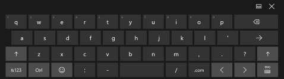
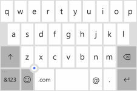
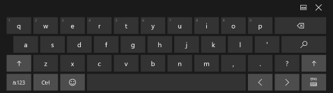

# <a name="use-input-scope-to-change-the-touch-keyboard"></a>Использование типа вводимых данных для изменения сенсорной клавиатуры
<link rel="stylesheet" href="https://az835927.vo.msecnd.net/sites/uwp/Resources/css/custom.css">

Чтобы упростить пользователям ввод данных с помощью сенсорной клавиатуры или панели функционального ввода, можно настроить тип вводимых данных элемента управления для ввода текста, чтобы он соответствовал типу данных, которые должен вводить пользователь.

<div class="important-apis" >
<b>Важные API</b><br/>
<ul>
<li>[**InputScope**](https://msdn.microsoft.com/library/windows/apps/hh702632)</li>
<li>[**InputScopeNameValue**](https://msdn.microsoft.com/library/windows/apps/hh702028)</li>
</ul>
</div>


Сенсорная клавиатура позволяет вводить текст, если приложение выполняется на устройстве с сенсорным экраном. Сенсорная клавиатура появляется, когда пользователь касается редактируемого поля ввода, например, [**TextBox**](https://msdn.microsoft.com/library/windows/apps/br209683) или [**RichEditBox**](https://msdn.microsoft.com/library/windows/apps/br227548). Пользователи могут вводить данные в вашем приложении гораздо быстрее и проще, если настроить *тип вводимых данных* элемента управления текстом на соответствие типу данных, которые пользователь должен вводить. Тип вводимых данных предоставляет системе подсказку о типе текстового ввода, ожидаемого элементом управления. Благодаря этому система может отобразить специальную раскладку сенсорной клавиатуры в соответствии с используемым типом ввода.

Например, если текстовое поле используется только для ввода 4-значного ПИН-кода, установите для свойства [**InputScope**](https://msdn.microsoft.com/library/windows/apps/hh702632) значение **Number**. Это сообщает системе, что нужно отобразить раскладку цифровой клавиатуры, благодаря чему пользователю проще вводить PIN-код.

> **Важно!**&nbsp;&nbsp;
- Эти сведения применимы только к панели функционального ввода. Они неприменимы к аппаратным клавиатурам или экранной клавиатуре, доступной в параметрах специальных возможностей Windows.
- Тип вводимых данных не вызывает выполнение проверки ввода, а также не препятствует пользователю вводить любые данные через аппаратную клавиатуру или другое устройство ввода. При необходимости вы по-прежнему несете ответственность за проверку вводимых данных в коде.

## <a name="changing-the-input-scope-of-a-text-control"></a>Изменение типа вводимых данных для элемента управления текстом

Типы вводимых данных, доступные вашему приложению, представляют собой члены перечисления [**InputScopeNameValue**](https://msdn.microsoft.com/library/windows/apps/hh702028). Вы можете задать для свойства **InputScope** объекта [**TextBox**](https://msdn.microsoft.com/library/windows/apps/br209683) или [**RichEditBox**](https://msdn.microsoft.com/library/windows/apps/br227548) одно из указанных ниже значений.

> **Важно**&nbsp;&nbsp;Свойство [**InputScope**](https://msdn.microsoft.com/library/windows/apps/dn996570) в [**PasswordBox**](https://msdn.microsoft.com/library/windows/apps/br227519) поддерживает только значения **Password** и **NumericPin**. Любое другое значение будет проигнорировано.

В этой процедуре мы изменим тип вводимых данных для нескольких текстовых полей в соответствии с данными, которые предполагается вводить.

**Изменение типа вводимых данных в XAML**

1.  В файле XAML для страницы найдите тег для элемента управления с текстом, который необходимо изменить.
2.  Добавьте атрибут [**InputScope**](https://msdn.microsoft.com/library/windows/apps/hh702632) к тегу и укажите значение [**InputScopeNameValue**](https://msdn.microsoft.com/library/windows/apps/hh702028), которое соответствует ожидаемым вводимым данным.

    Вот некоторые текстовые поля, которые могут отображаться в общей форме контакта с клиентом. При заданном [**InputScope**](https://msdn.microsoft.com/library/windows/apps/hh702632) для каждого текстового поля отображается сенсорная клавиатура с подходящей раскладкой для данных.

    ```xaml
    <StackPanel Width="300">
        <TextBox Header="Name" InputScope="Default"/>
        <TextBox Header="Email Address" InputScope="EmailSmtpAddress"/>
        <TextBox Header="Telephone Number" InputScope="TelephoneNumber"/>
        <TextBox Header="Web site" InputScope="Url"/>
    </StackPanel>
    ```

**Изменение типа вводимых данных в коде**

1.  В файле XAML для страницы найдите тег для элемента управления с текстом, который необходимо изменить. Если он не установлен, установите [x:Name attribute](https://msdn.microsoft.com/library/windows/apps/mt204788), таким образом вы сможете ссылаться на элемент управления в коде.

    ```csharp
    <TextBox Header="Telephone Number" x:Name="phoneNumberTextBox"/>
    ```

2.  Создайте экземпляр объекта [**InputScope**](https://msdn.microsoft.com/library/windows/apps/hh702025).

    ```csharp
    InputScope scope = new InputScope();
    ```

3.  Создайте экземпляр объекта [**InputScopeName**](https://msdn.microsoft.com/library/windows/apps/hh702027).
    
    ```csharp
    InputScopeName scopeName = new InputScopeName();
    ```

4.  Установите для свойства [**NameValue**](https://msdn.microsoft.com/library/windows/apps/hh702032) объекта [**InputScopeName**](https://msdn.microsoft.com/library/windows/apps/hh702027) значение перечисления [**InputScopeNameValue**](https://msdn.microsoft.com/library/windows/apps/hh702028).

    ```csharp
    scopeName.NameValue = InputScopeNameValue.TelephoneNumber;
    ```

5.  Добавьте объект [**InputScopeName**](https://msdn.microsoft.com/library/windows/apps/hh702027) в коллекцию [**Names**](https://msdn.microsoft.com/library/windows/apps/hh702034) объекта [**InputScope**](https://msdn.microsoft.com/library/windows/apps/hh702025).

    ```csharp
    scope.Names.Add(scopeName);
    ```

6.  Задайте объект [**InputScope**](https://msdn.microsoft.com/library/windows/apps/hh702025) в качестве значения свойства элемента управления текстом [**InputScope**](https://msdn.microsoft.com/library/windows/apps/hh702632).

    ```csharp
    phoneNumberTextBox.InputScope = scope;
    ```

Ниже приведен код полностью.

```CSharp
InputScope scope = new InputScope();
InputScopeName scopeName = new InputScopeName();
scopeName.NameValue = InputScopeNameValue.TelephoneNumber;
scope.Names.Add(scopeName);
phoneNumberTextBox.InputScope = scope;
```

Эти же шаги можно сжать до следующего сокращенного кода.

```CSharp
phoneNumberTextBox.InputScope = new InputScope() 
{
    Names = {new InputScopeName(InputScopeNameValue.TelephoneNumber)}
};
```

## <a name="text-prediction-spell-checking-and-auto-correction"></a>Прогнозирование текста, проверка правописания и автозамена

Элементы управления [**TextBox**](https://msdn.microsoft.com/library/windows/apps/br209683) и [**RichEditBox**](https://msdn.microsoft.com/library/windows/apps/br227548) имеют несколько свойств, которые влияют на поведение панели функционального ввода. Чтобы обеспечить наилучшее взаимодействие с пользователями, важно понимать, как эти свойства влияют на ввод текста с помощью сенсорного ввода.

-   [**IsSpellCheckEnabled**](https://msdn.microsoft.com/library/windows/apps/br209688) — если для элемента управления для ввода текста включена проверка правописания, то он будет взаимодействовать с модулем проверки правописания системы, чтобы пометить нераспознанные слова. Можно коснуться слова, чтобы просмотреть список рекомендуемых исправлений. По умолчанию функция проверки правописания включена.

    Для типа вводимых данных **Default** это свойство также автоматически включает функции написания первого слова предложения с прописной буквы и автозамены слов по мере ввода. Для других типов вводимых данных эти функции автозамены можно выключить. Подробнее см. в таблицах далее в этом разделе.

-   [**IsTextPredictionEnabled**](https://msdn.microsoft.com/library/windows/apps/br209690) — когда включено прогнозирование текста для элемента управления текстом, система отображает список слов, которые могут вводиться. Вы можете выбрать слово из списка, чтобы не вводить слово целиком. По умолчанию функция прогнозирования текста включена.

    Прогнозирование текста можно отключить, если тип вводимых данных отличается от **Default**, даже если свойство [**IsTextPredictionEnabled**](https://msdn.microsoft.com/library/windows/apps/br209690) имеет значение **true**. Подробнее см. в таблицах далее в этом разделе.

    **Примечание.**&nbsp;&nbsp;В семействе мобильных устройств прогнозируемый текст и исправления правописания отображаются на панели функционального ввода над клавиатурой. Если для свойства [**IsTextPredictionEnabled**](https://msdn.microsoft.com/library/windows/apps/br209690) задано значение **false**, то эта часть панели функционального ввода будет скрыта, а автозамена будет выключена, даже если свойство [**IsSpellCheckEnabled**](https://msdn.microsoft.com/library/windows/apps/br209688) имеет значение **true**.

-   [**PreventKeyboardDisplayOnProgrammaticFocus**](https://msdn.microsoft.com/library/windows/apps/dn299273) — если это свойство имеет значение **true**, система не отображает панель функционального ввода, когда фокус программным образом установлен на элементе управления для ввода текста. Вместо этого клавиатура отображается только тогда, когда пользователь взаимодействует с элементом управления.

## <a name="touch-keyboard-index-for-windows-and-windows-phone"></a>Указатель сенсорной клавиатуры для Windows и Windows Phone

В таблицах ниже показаны раскладки панели функционального ввода для настольных ПК и мобильных устройств для стандартных значений типов вводимых данных. Влияние типа вводимых данных на функции, включаемые свойствами **IsSpellCheckEnabled** и **IsTextPredictionEnabled**, указаны для каждого типа вводимых данных. Это неполный перечень доступных типов вводимых данных.

> **Примечание.**&nbsp;&nbsp;Так как на мобильных устройствах панель функционального ввода имеет меньший размер, особенно важно, чтобы мобильные приложения правильно указывали типы вводимых данных. Как показано здесь, Windows Phone предлагает большее разнообразие специализированных раскладок клавиатуры. Преимуществом текстового поля, для которого не нужно задавать тип вводимых данных в приложении Магазина Windows, может быть установка этого поля в приложении Магазина Windows Phone.

> **Совет.**&nbsp;&nbsp;Большинство сенсорных клавиатур можно переключать с алфавитной раскладки на раскладку с цифрами и символами и наоборот. В Windows нажмите клавишу **&123**. В Windows Phone нажмите клавишу **&123** для перехода к раскладке с цифрами и символами и нажмите клавишу **abcd** для перехода к алфавитной раскладке.

### <a name="default"></a>Default (По умолчанию)

`<TextBox InputScope="Default"/>`

Клавиатура по умолчанию.

| Windows                                                    | Windows Phone                                                    |
|------------------------------------------------------------|------------------------------------------------------------------|
|  |  |

Доступность функций:

-   Проверка правописания: включена при **IsSpellCheckEnabled** = **true**, отключена при **IsSpellCheckEnabled** = **false**
-   Автозамена: включена при **IsSpellCheckEnabled** = **true**, отключена при **IsSpellCheckEnabled** = **false**
-   Автоматическое применение заглавных букв: включено при **IsSpellCheckEnabled** = **true**, отключено при **IsSpellCheckEnabled** = **false**
-   Прогнозирование текста: включено при **IsTextPredictionEnabled** = **true**, отключено при **IsTextPredictionEnabled** = **false**

### <a name="currencyamountandsymbol"></a>CurrencyAmountAndSymbol

`<TextBox InputScope="CurrencyAmountAndSymbol"/>`

Раскладка клавиатуры с цифрами и символами по умолчанию.

| Windows                                                    | Windows Phone                                                    |
|------------------------------------------------------------|------------------------------------------------------------------|
| <br>Кроме того, содержит клавиши "Страница влево" и "Страница вправо" для отображения других символов.|  |
|Доступность функций:<ul><li>Проверка правописания: по умолчанию включена, может быть отключена</li><li>Автозамена: всегда отключена</li><li>Автоматическое применение заглавных букв: всегда отключено</li><li>Прогнозирование текста: всегда отключено</li></ul>Аналогично **Number** и **TelephoneNumber**. | Доступность функций:<ul><li>Проверка правописания: по умолчанию включена, может быть отключена</li><li>Автозамена: по умолчанию включена, может быть отключена</li><li>Автоматическое применение заглавных букв: всегда отключено</li><li>Прогнозирование текста: по умолчанию включено, может быть отключено</li>| 

### <a name="url"></a>URL-адрес

`<TextBox InputScope="Url"/>`

Содержит клавиши **.com** и  (Перейти). Нажмите и удерживайте клавишу **.com**, чтобы отобразить дополнительные варианты (**.org**, **.net** и суффиксы, зависящие от регионов).

| Windows                                                    | Windows Phone                                                    |
|------------------------------------------------------------|------------------------------------------------------------------|
| <br>Кроме того, содержит клавиши **:**, **-** и **/**.| <br>Нажмите и удерживайте клавишу с точкой, чтобы отобразить дополнительные параметры ( - + &quot; / &amp; : , ). |
|Доступность функций:<ul><li>Проверка правописания: по умолчанию включена, может быть отключена</li><li>Автозамена: по умолчанию включена, может быть отключена</li><li>Автоматическое применение заглавных букв: всегда отключено</li><li>Прогнозирование текста: всегда отключено</li></ul> | Доступность функций:<ul><li>Проверка правописания: по умолчанию отключена, может быть включена</li><li>Автозамена: по умолчанию отключена, может быть включена</li><li>Автоматическое применение заглавных букв: по умолчанию отключено, может быть включено</li><li>Прогнозирование текста: по умолчанию отключено, может быть включено</li></ul> |

### <a name="emailsmtpaddress"></a>EmailSmtpAddress

`<TextBox InputScope="EmailSmtpAddress"/>`

Содержит клавиши **@** и **.com**. Нажмите и удерживайте клавишу **.com**, чтобы отобразить дополнительные варианты (**.org**, **.net** и суффиксы, зависящие от регионов).

| Windows                                                    | Windows Phone                                                    |
|------------------------------------------------------------|------------------------------------------------------------------|
| <br>Кроме того, содержит клавиши **_** и **-**.| <br>Нажмите и удерживайте клавишу с точкой, чтобы отобразить дополнительные параметры ( - _ , ; ). |
|Доступность функций:<ul><li>Проверка правописания: по умолчанию включена, может быть отключена</li><li>Автозамена: по умолчанию включена, может быть отключена</li><li>Автоматическое применение заглавных букв: всегда отключено</li><li>Прогнозирование текста: всегда отключено</li></ul> | Доступность функций:<ul><li>Проверка правописания: по умолчанию отключена, может быть включена</li><li>Автозамена: по умолчанию отключена, может быть включена</li><li>Автоматическое применение заглавных букв: по умолчанию отключено, может быть включено</li><li>Прогнозирование текста: по умолчанию отключено, может быть включено</li></ul> |

### <a name="number"></a>Номер

`<TextBox InputScope="Number"/>`

| Windows                                                    | Windows Phone                                                    |
|------------------------------------------------------------|------------------------------------------------------------------|
| | <br>Клавиатура содержит цифры и десятичную запятую. Нажмите и удерживайте клавишу десятичной запятой, чтобы отобразить дополнительные параметры ( , - ). |
|Аналогично **CurrencyAmountAndSymbol** и **TelephoneNumber**. | Доступность функций:<ul><li>Проверка правописания: всегда отключена</li><li>Автозамена: всегда отключена</li><li>Автоматическое применение заглавных букв: всегда отключено</li><li>Прогнозирование текста: всегда отключено</li></ul> |

### <a name="telephonenumber"></a>TelephoneNumber (номер телефона)

`<TextBox InputScope="TelephoneNumber"/>`

| Windows                                                    | Windows Phone                                                    |
|------------------------------------------------------------|------------------------------------------------------------------|
| | <br>Клавиатура имитирует клавиатуру телефона. Нажмите и удерживайте клавишу с точкой, чтобы отобразить дополнительные параметры ( , ( ) X . ). Нажмите и удерживайте клавишу "0", чтобы вставить "+". |
|Аналогично **CurrencyAmountAndSymbol** и **TelephoneNumber**. | Доступность функций:<ul><li>Проверка правописания: всегда отключена</li><li>Автозамена: всегда отключена</li><li>Автоматическое применение заглавных букв: всегда отключено</li><li>Прогнозирование текста: всегда отключено</li></ul> |

### <a name="search"></a>Поиск

`<TextBox InputScope="Search"/>`

Содержит клавишу **Search** (Поиск) вместо клавиши **Enter** (Ввод).

| Windows                                                    | Windows Phone                                                    |
|------------------------------------------------------------|------------------------------------------------------------------|
| | |
|Доступность функций:<ul><li>Проверка правописания: по умолчанию включена, может быть отключена</li><li>Автозамена: всегда отключена</li><li>Автоматическое применение заглавных букв: всегда отключено</li><li>Прогнозирование текста: по умолчанию включено, может быть отключено</li></ul> | Доступность функций:<ul><li>Проверка правописания: по умолчанию включена, может быть отключена</li><li>Автозамена: по умолчанию включена, может быть отключена</li><li>Автоматическое применение заглавных букв: всегда отключено</li><li>Прогнозирование текста: по умолчанию включено, может быть отключено</li></ul> |

### <a name="searchincremental"></a>SearchIncremental

`<TextBox InputScope="SearchIncremental"/>`

| Windows                                                    | Windows Phone                                                    |
|------------------------------------------------------------|------------------------------------------------------------------|
| <br>Та же раскладка, что и в клавиатуре **Default**.| |
|Доступность функций:<ul><li>Проверка правописания: по умолчанию отключена, может быть включена</li><li>Автозамена: всегда отключена</li><li>Автоматическое применение заглавных букв: всегда отключено</li><li>Прогнозирование текста: всегда отключено</li></ul> | Аналогично **Default.** |

### <a name="formula"></a>Формулы

`<TextBox InputScope="Formula"/>`

Содержит клавишу **=**.

| Windows                                                    | Windows Phone                                                    |
|------------------------------------------------------------|------------------------------------------------------------------|
| <br>Кроме того, содержит клавиши **%**, **$** и **+**.| <br>Нажмите и удерживайте клавишу с точкой, чтобы отобразить дополнительные параметры ( - ! ? , ). Нажмите и удерживайте клавишу **=**, чтобы отобразить дополнительные параметры ( ( ) : &lt; &gt; ). |
|Доступность функций:<ul><li>Проверка правописания: по умолчанию отключена, может быть включена</li><li>Автозамена: всегда отключена</li><li>Автоматическое применение заглавных букв: всегда отключено</li><li>Прогнозирование текста: всегда отключено</li></ul> | Доступность функций:<ul><li>Проверка правописания: по умолчанию включена, может быть отключена</li><li>Автозамена: по умолчанию включена, может быть отключена</li><li>Автоматическое применение заглавных букв: всегда отключено</li><li>Прогнозирование текста: по умолчанию включено, может быть отключено</li></ul> |

### <a name="chat"></a>Chat (чат)

`<TextBox InputScope="Chat"/>`

| Windows                                                    | Windows Phone                                                    |
|------------------------------------------------------------|------------------------------------------------------------------|
| <br>Та же раскладка, что и в клавиатуре **Default**.| <br>Та же раскладка, что и в клавиатуре **Default**.|
|Доступность функций:<ul><li>Проверка правописания: по умолчанию отключена, может быть включена</li><li>Автозамена: всегда отключена</li><li>Автоматическое применение заглавных букв: всегда отключено</li><li>Прогнозирование текста: всегда отключено</li></ul> | Доступность функций:<ul><li>Проверка правописания: по умолчанию включена, может быть отключена</li><li>Автозамена: по умолчанию включена, может быть отключена</li><li>Автоматическое применение заглавных букв: по умолчанию включено, может быть отключено</li><li>Прогнозирование текста: по умолчанию включено, может быть отключено</li></ul> |

### <a name="nameorphonenumber"></a>NameOrPhoneNumber

`<TextBox InputScope="NameOrPhoneNumber"/>`

| Windows                                                    | Windows Phone                                                    |
|------------------------------------------------------------|------------------------------------------------------------------|
| <br>Та же раскладка, что и в клавиатуре **Default**.| <br>Содержит клавиши **;** и **@**. Клавиша **&amp;123** заменяется клавишей **123**, которая открывает клавиатуру телефона (см. клавиатуру **TelephoneNumber**).|
|Доступность функций:<ul><li>Проверка правописания: по умолчанию включена, может быть отключена</li><li>Автозамена: всегда отключена</li><li>Автоматическое применение заглавных букв: всегда включено</li><li>Прогнозирование текста: всегда отключено</li></ul> | Доступность функций:<ul><li>Проверка правописания: по умолчанию отключена, может быть включена</li><li>Автозамена: по умолчанию отключена, может быть включена</li><li>Автоматическое применение заглавных букв: по умолчанию выключено, но можно включить его. Первая буква каждого слова преобразуется в прописную.</li><li>Прогнозирование текста: по умолчанию отключено, может быть включено</li></ul> |


<!--HONumber=Dec16_HO3-->


