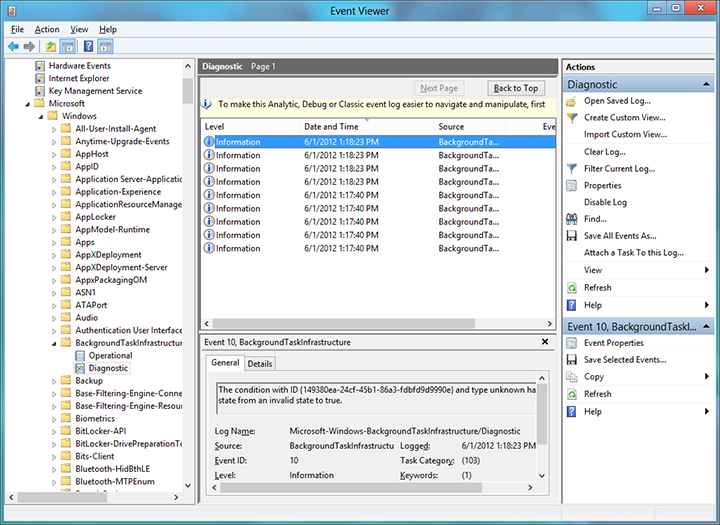

# Отладка фоновой задачи

\[ Обновлено для приложений UWP в Windows10. Статьи о Windows 8.x см. в [архиве](http://go.microsoft.com/fwlink/p/?linkid=619132) \]

**Важные API**
-   [Windows.ApplicationModel.Background](https://msdn.microsoft.com/library/windows/apps/br224847)

Узнайте, как отладить фоновую задачу, выполнив в том числе активацию фоновой задачи и трассировку отладки в журнале событий Windows.

## Сравнение отладки фоновых задач с несколькими процессами и с одним процессом
В этом разделе в основном рассматриваются фоновые задачи, которые выполняются в отдельном процессе, отличном от процесса приложения узла. Если выполняется отладка фоновой задачи с одним процессом, отдельный проект фоновой задачи отсутствует и можно задать точку останова в **OnBackgroundActivated** (где выполняется ваш фоновый код с одним процессом); затем см. шаг 2 в разделе [Ручная активация фоновых задач для отладки их кода](#Trigger-background-tasks-manually-to-debug-background-task-code) ниже, в котором приведены инструкции по запуску выполнения фонового кода.

## Правильная настройка параметров проекта фоновой задачи

В этой статье предполагается, что у вас уже есть приложение с фоновой задачей, которую необходимо отладить. Приведенная ниже информация относится к фоновым задачам, которые выполняются в отдельном процессе; она не касается фоновых задач, выполняющихся в одном процессе.

-   Для приложений на языках C# и C++ основной проект должен ссылаться на проект фоновой задачи. Если такой ссылки нет, то фоновая задача не будет включена в пакет приложения.
-   В коде на языке C# или C++ параметр **Тип вывода** проекта фоновой задачи должен иметь значение «Компонент среды выполнения Windows».
-   Фоновый класс необходимо объявить в атрибуте точки входа в манифесте пакета.

## Ручная активация фоновых задач для отладки их кода

Фоновые задачи могут быть запущены вручную через Microsoft Visual Studio. После этого можно по шагам выполнять код и его отладку.

1.  В C# поместите точку останова в метод Run фонового класса (для фоновых задач с одним процессом установите точки останова в App.OnBackgroundActivated()) и/или напишите отладочный вывод с помощью [**System.Diagnostics**](https://msdn.microsoft.com/library/windows/apps/xaml/hh441592.aspx).

    В C++ поместите точку останова в функцию Run фонового класса (для фоновых задач с одним процессом установите точки останова в App.OnBackgroundActivated()) и/или напишите отладочный вывод с помощью [**OutputDebugString**](https://msdn.microsoft.com/library/windows/desktop/aa363362).

2.  Запустите приложение в отладчике, затем активируйте фоновую задачу с помощью панели инструментов **События жизненного цикла**. В этом раскрывающемся меню отображаются имена фоновых задач, которые можно активировать с помощью VisualStudio.

    Для того чтобы это работало, фоновая задача должна быть уже зарегистрирована и ожидать запуска. Например, если фоновая задача была зарегистрирована с одноразовым триггером времени TimeTrigger, который уже был активирован, запуск задачи через Visual Studio не сработает.

> [!Note]
> Таким способом невозможно запустить фоновые задачи, использующие следующие триггеры: [**ApplicationTrigger**](https://msdn.microsoft.com/en-us/library/windows/apps/windows.applicationmodel.background.applicationtrigger.aspx), [**MediaProcessingTrigger**](https://msdn.microsoft.com/en-us/library/windows/apps/windows.applicationmodel.background.mediaprocessingtrigger.aspx), [**ControlChannelTrigger**](https://msdn.microsoft.com/library/windows/apps/hh701032), [**PushNotificationTrigger**](https://msdn.microsoft.com/library/windows/apps/hh700543) и фоновые задачи, использующие [**SystemTrigger**](https://msdn.microsoft.com/library/windows/apps/br224838) с типом триггера [**SmsReceived**](https://msdn.microsoft.com/library/windows/apps/br224839).  
> **ApplicationTrigger** и **MediaProcessingTrigger** можно установить в коде вручную с помощью `trigger.RequestAsync()`.     

    

3.  При активации фоновой задачи отладчик подключается к ней и отображает отладочный вывод в Visual Studio.

## Отладка активации фоновой задачи

> [!NOTE]
> Этот раздел относится к фоновым задачам, которые выполняются в отдельном процессе; он не касается фоновых задач, выполняющихся в одном процессе.

Активация фоновой задачи зависит от трех условий:

-   Имя и пространство имен класса фоновой задачи.
-   Атрибут точки входа, указанный в манифесте пакета.
-   Точка входа, заданная приложением при регистрации фоновой задачи.

1.  Используя Visual Studio, определите точку входа фоновой задачи:

    -   В коде на языке C# или C++ запомните имя и пространство имен класса фоновой задачи, указанные в проекте фоновой задачи.

2.  С помощью конструктора манифеста проверьте, правильно ли объявлена фоновая задача в манифесте пакета.

    -   В коде на языке C# или C++ атрибут точки входа должен соответствовать пространству имен фоновой задачи, за которым следует имя класса. Например: RuntimeComponent1.MyBackgroundTask.
    -   Кроме того, необходимо указать все типы триггеров, которые использует задача.
    -   Исполняемый файл НЕ СЛЕДУЕТ указывать, если только вы не используете [**ControlChannelTrigger**](https://msdn.microsoft.com/library/windows/apps/hh701032) или [**PushNotificationTrigger**](https://msdn.microsoft.com/library/windows/apps/hh700543).

3.  Только Windows. Чтобы увидеть точку входа, используемую Windows для активации фоновой задачи, включите трассировку отладки и используйте журнал событий Windows.

    Если после выполнения этой процедуры в журнале событий отображается неправильная точка входа или триггер фоновой задачи, это означает, что приложение неправильно регистрирует фоновую задачу. Разобраться с такой задачей поможет статья [Регистрация фоновой задачи](register-a-background-task.md).

    1.  Перейдите на начальный экран и откройте просмотр событий (для этого найдите и запустите файл eventvwr.exe).
    2.  Перейдите в раздел **Журналы приложения и служб** -&gt; **Microsoft** -&gt; **Windows** -&gt; **BackgroundTaskInfrastructure** в просмотре событий.
    3.  На панели действий выберите **Просмотр** -&gt; **Отобразить аналитический и отладочный журналы** для включения ведения журнала диагностики.
    4.  Выберите **Журнал диагностики** и щелкните **Включить журнал**.
    5.  Теперь попробуйте еще раз использовать ваше приложение для регистрации и активации фоновой задачи.
    6.  Просмотрите в журналах диагностики подробную информацию об ошибке. Эта информация будет содержать точку входа, зарегистрированную для фоновой задачи.

## Фоновые задачи и развертывание пакета Visual Studio

Если приложение, которое использует фоновые задачи, развернуто с помощью Visual Studio, а версия (основная или дополнительная), указанная в конструкторе манифеста, затем обновляется, то последующее повторное развертывание приложения с помощью Visual Studio может вызвать блокировку фоновых задач приложения. Эту проблему можно решить следующим образом:

-   Используйте Windows PowerShell для развертывания обновленного приложения (вместо Visual Studio), запустив сценарий, созданный вместе с пакетом.
-   Если вы уже развернули приложение с помощью Visual Studio и фоновые задачи приложения теперь блокированы, перезагрузите систему либо выйдите из системы и войдите снова, чтобы фоновые задачи приложения опять заработали.
-   Вы можете выбрать параметр отладки "Всегда переустанавливать мой пакет", чтобы избежать этого в проектах C#.
-   Подождите с обновлением версии пакета, пока приложение не будет готово к окончательному развертыванию (не меняйте версию во время отладки).

## Примечания

-   Убедитесь, что перед повторной регистрацией фоновой задачи приложение проверяет существующие регистрации фоновых задач. Многократная регистрация одной и той же фоновой задачи может привести к неожиданным результатам, так как фоновая задача будет запускаться каждый раз при ее активации.
-   Если фоновой задаче требуется доступ к экрану блокировки, то перед выполнением ее отладки необходимо, чтобы приложение было размещено на экране блокировки. Сведения о том, как указывать параметры манифеста для приложений с возможностью размещения на экране блокировки, см. в статье [Объявление фоновых задач в манифесте приложения](declare-background-tasks-in-the-application-manifest.md).
-   Параметры регистрации фоновых задач проверяются во время регистрации. Если какие-либо из параметров регистрации оказываются недопустимыми, возвращается ошибка. Убедитесь, что ваше приложение корректно обрабатывает сценарии, в которых регистрация фоновой задачи завершается ошибкой. Если работа вашего приложения зависит от наличия допустимого объекта регистрации после попытки регистрации задачи, то оно может дать сбой.

Дополнительные сведения об использовании Visual Studio для отладки фоновых задач см. в статье [Вызов событий приостановки, возобновления и фоновых событий для приложений Магазина Windows](https://msdn.microsoft.com/library/windows/apps/xaml/hh974425.aspx).

## Связанные разделы

* [Создание и регистрация фоновой задачи, которая запускается в отдельном процессе](create-and-register-a-background-task.md)
* [Создание и регистрация фоновой задачи, которая запускается в одном процессе](create-and-register-a-singleprocess-background-task.md)
* [Регистрация фоновой задачи](register-a-background-task.md)
* [Объявление фоновых задач в манифесте приложения](declare-background-tasks-in-the-application-manifest.md)
* [Руководство по работе с фоновыми задачами](guidelines-for-background-tasks.md)
* [Вызов событий приостановки, возобновления и фоновых событий для приложений Магазина Windows](https://msdn.microsoft.com/library/windows/apps/xaml/hh974425.aspx)
* [Анализ качества кода приложений Магазина Windows с помощью средства анализа кода Visual Studio](https://msdn.microsoft.com/library/windows/apps/xaml/hh441471.aspx)

 

 

<!--HONumber=Aug16_HO3-->

