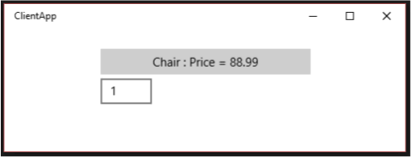

# <a name="create-and-consume-an-app-service"></a>Создание и использование службы приложений

Службы приложений— это приложения UWP, которые могут предоставлять службы другим приложениям UWP. Это похоже на веб-службы на устройстве. Служба приложения выполняется как фоновой задачи в приложении узла и обеспечить его службы другим приложениям. Например служба приложения может предоставить службу сканер штрих-кода, которая может использовать другие приложения. Или корпоративный набор приложений может использовать общую службу проверки орфографии, которая доступна всем приложениям в наборе.  Службы приложений позволяют создавать службы без пользовательского интерфейса, которые приложения могут вызывать на одном устройстве и, начиная с Windows 10 версии 1607, на удаленных устройствах.

Начиная с Windows 10 версии 1607, вы можете создавать службы приложений, выполняющиеся в том же процессе, что и ведущее приложение. В этой статье основное внимание уделяется созданию и использованию служб приложения, которые выполняются в отдельном фоновом процессе. Подробнее о службах приложения, работающих в том же процессе, что и ведущее приложение, см. в разделе [Преобразование службы приложения для запуска в одном процессе с ее поставщиком](convert-app-service-in-process.md).

Пример кода службы приложений см. на странице с [примерами приложений для универсальной платформы Windows (UWP)](https://github.com/Microsoft/Windows-universal-samples/tree/master/Samples/AppServices).

## <a name="create-a-new-app-service-provider-project"></a>Создание проекта поставщика службы приложений

В этой инструкции для простоты мы создадим универсальное решение.

-   В Microsoft Visual Studioсоздайте проект приложения UWP и назовите его **AppServiceProvider**. (Для этого в диалоговом окне **Создание проекта** последовательно выберите пункты **Шаблоны &gt; Другие языки &gt; Visual C# &gt;Windows &gt; Универсальные &gt; Пустое приложение (универсальное приложение Windows**)). Это приложение будет предоставлять службу приложения другим приложениям UWP.
-   При появлении запроса выбора **целевой версии** проекта, выберите версию не меньше **10.0.14393**. Если вы хотите использовать новый атрибут `SupportsMultipleInstances`, необходимо работать в Visual Studio 2017 и выбрать целевую версию **10.0.15063** (**обновление Windows 10 Creators Update**) или более позднюю версию.

<span id="appxmanifest"/>

## <a name="add-an-app-service-extension-to-packageappxmanifest"></a>Добавление в файл package.appxmanifest расширения службы приложений

В файле Package.appxmanifest проекта AppServiceProvider добавьте указанное ниже расширение AppService в элемент `&lt;Application&gt;`. В этом примере показано, как объявить службу `com.Microsoft.Inventory` и указать, что приложение является поставщиком службы приложений. Сама служба будет реализована в виде фоновой задачи. Проект приложения службы приложений предоставляет службу другим приложениям. Для имени службы мы рекомендуем использовать обратное доменное имя.

Обратите внимание, что префикс пространства имен `xmlns:uap4` и атрибут `uap4:SupportsMultipleInstances` действительны, только если вы используете пакета Windows SDK 10.0.15063 или более поздней версии. Их можно удалить, если используется более ранняя версия SDK.

``` xml
<Package
    ...
    xmlns:uap3="http://schemas.microsoft.com/appx/manifest/uap/windows10/3"
    xmlns:uap4="http://schemas.microsoft.com/appx/manifest/uap/windows10/4"
    ...
    <Applications>
        <Application Id="AppServicesProvider.App"
          Executable="$targetnametoken$.exe"
          EntryPoint="AppServicesProvider.App">
          ...
          <Extensions>
            <uap:Extension Category="windows.appService" EntryPoint="MyAppService.Inventory">
              <uap3:AppService Name="com.microsoft.inventory" uap4:SupportsMultipleInstances="true"/>
            </uap:Extension>
          </Extensions>
          ...
        </Application>
    </Applications>
```

Благодаря атрибуту **Category** это приложение идентифицируется как поставщик службы приложений.

Атрибут **EntryPoint** идентифицирует класс в пространстве имен, реализующий службу, которую мы реализуем позже.

Атрибут **SupportsMultipleInstances** указывает, что при каждом вызове службы приложений его необходимо запускать в новом процессе. Это не является обязательным, но возможно, если вам необходимы эти функции и вы используете пакет SDK `10.0.15063` (**Windows 10 Creators Update**) или более поздней версии. В качестве префикса следует использовать пространство имен `uap4`.

## <a name="create-the-app-service"></a>Создание службы приложений

1.  Служба приложений будет реализована в виде фоновой задачи. Это позволяет приложению переднего плана вызывать службу приложений в другом приложении. Чтобы создать службу приложения в качестве фоновой задачи, добавьте в решение новый проект компонента среды выполнения Windows (**Файл &gt; Добавить &gt; Создать проект**) с именем MyAppService. (Для этого в диалоговом окне **Добавление нового проекта** последовательно выберите пункты **Установленные &gt; Другие языки &gt; Visual C# &gt; Windows &gt; Универсальные &gt; Компонент среды выполнения Windows (универсальное приложение Windows)**).
2.  В проекте **AppServiceProvider** добавьте межпроектную ссылку на новый проект **MyAppService** (в обозревателе решений щелкните правой кнопкой мыши по проекту **AppServiceProvider** > **Добавить** > **Ссылка** > **Проекты** > **Решение** и выберите **MyAppService** > **ОК**). Этот шаг очень важен: если вы не добавите ссылку, служба приложения не сможет подключиться во время выполнения.
3.  В проекте MyappService добавьте следующие операторы **using** в верхнюю часть файла Class1.cs:
    ```cs
    using Windows.ApplicationModel.AppService;
    using Windows.ApplicationModel.Background;
    using Windows.Foundation.Collections;
    ```

4.  Замените код заглушки для класса **Class1** новым классом фоновой задачи с именем **Inventory**:

    ```cs
    public sealed class Inventory : IBackgroundTask
    {
        private BackgroundTaskDeferral backgroundTaskDeferral;
        private AppServiceConnection appServiceconnection;
        private String[] inventoryItems = new string[] { "Robot vacuum", "Chair" };
        private double[] inventoryPrices = new double[] { 129.99, 88.99 };

        public void Run(IBackgroundTaskInstance taskInstance)
        {
            this.backgroundTaskDeferral = taskInstance.GetDeferral(); // Get a deferral so that the service isn't terminated.
            taskInstance.Canceled += OnTaskCanceled; // Associate a cancellation handler with the background task.

            // Retrieve the app service connection and set up a listener for incoming app service requests.
            var details = taskInstance.TriggerDetails as AppServiceTriggerDetails;
            appServiceconnection = details.AppServiceConnection;
            appServiceconnection.RequestReceived += OnRequestReceived;
        }

        private async void OnRequestReceived(AppServiceConnection sender, AppServiceRequestReceivedEventArgs args)
        {
            // This function is called when the app service receives a request
        }

        private void OnTaskCanceled(IBackgroundTaskInstance sender, BackgroundTaskCancellationReason reason)
        {
            if (this.backgroundTaskDeferral != null)
            {
                // Complete the service deferral.
                this.backgroundTaskDeferral.Complete();
            }
        }
    }
    ```

    Это класс, в котором служба приложений будет выполнять свою работу.

    После создания фоновой задачи будет вызван метод **Run()**. Так как по завершении работы метода **Run** работа фоновых задач также завершается, код создает отсрочку, и фоновая задача может продолжать обрабатывать запросы. Служба приложения, которая реализована как фоновая задача, остается активной около 30секунд после получения вызова, если она не будет вызвана снова в течение этого периода или будет инициализирована задержка. Если служба приложения реализована в том же процессе, что и вызывающий объект, ее жизненный цикл связан с жизненным циклом вызывающего объекта.

    Срок жизни службы приложения зависит от вызывающей стороны.

    1. Если вызывающий объект находится на переднем плане, жизненный цикл службы приложения не отличается от жизненного цикла вызывающего объекта.
    2. Если вызывающий объект находится в фоновом режиме, служба приложения получает 30 секунд для выполнения. Активация задержки дает службе пять дополнительных секунд.

    При отмене задачи будет вызван метод **OnTaskCanceled()**. Отмена задачи происходит в следующих случаях: клиентское приложение ликвидирует [**AppServiceConnection**](https://msdn.microsoft.com/library/windows/apps/dn921704), клиентское приложение приостановлено, ОС завершает работу или переходит в режим сна или когда ОС исчерпала все ресурсы для выполнения задачи.

## <a name="write-the-code-for-the-app-service"></a>Написание кода для службы приложений

Код службы приложений помещается в метод **OnRequestReceived()**. Замените заглушку **OnRequestReceived()** в файле Class1.cs проекта MyAppService кодом из этого примера. Этот код получает индекс складской позиции и передает его в строке команды в службу, чтобы получить название и цену указанной складской позиции. В собственные проекты добавьте код обработки ошибок.

```cs
private async void OnRequestReceived(AppServiceConnection sender, AppServiceRequestReceivedEventArgs args)
{
    // Get a deferral because we use an awaitable API below to respond to the message
    // and we don't want this call to get cancelled while we are waiting.
    var messageDeferral = args.GetDeferral();

    ValueSet message = args.Request.Message;
    ValueSet returnData = new ValueSet();

    string command = message["Command"] as string;
    int? inventoryIndex = message["ID"] as int?;

    if ( inventoryIndex.HasValue &&
         inventoryIndex.Value >= 0 &&
         inventoryIndex.Value < inventoryItems.GetLength(0))
    {
        switch (command)
        {
            case "Price":
            {
                returnData.Add("Result", inventoryPrices[inventoryIndex.Value]);
                returnData.Add("Status", "OK");
                break;
            }

            case "Item":
            {
                returnData.Add("Result", inventoryItems[inventoryIndex.Value]);
                returnData.Add("Status", "OK");
                break;
            }

            default:
            {
                returnData.Add("Status", "Fail: unknown command");
                break;
            }
        }
    }
    else
    {
        returnData.Add("Status", "Fail: Index out of range");
    }

    try
    {
        await args.Request.SendResponseAsync(returnData); // Return the data to the caller.
    }
    catch (Exception e)
    {
        // your exception handling code here
    }
    finally
    {
        // Complete the deferral so that the platform knows that we're done responding to the app service call.
        // Note for error handling: this must be called even if SendResponseAsync() throws an exception.
        messageDeferral.Complete();
    }
}
```

Обратите внимание, что метод **OnRequestReceived()** принадлежит к типу **async**, так как в данном примере мы выполняем поддерживающий ожидание вызов метода [**SendResponseAsync**](https://msdn.microsoft.com/library/windows/apps/dn921722).

Отсрочка используется для того, чтобы служба могла использовать методы **async** в обработчике OnRequestReceived. Это гарантирует, что вызов **OnRequestReceived** не завершится до тех пор, пока не будет обработано сообщение.  [**SendResponseAsync**](https://msdn.microsoft.com/library/windows/apps/dn921722) отправляет результаты вызывающей стороне. **SendResponseAsync** не сигнализирует о завершении вызова. Сигнал для [**SendMessageAsync**](https://msdn.microsoft.com/library/windows/apps/dn921712) о завершении **OnRequestReceived** передается по завершении отсрочки. Вызов **SendResponseAsync()** помещается в оболочку блока Try/Finally, поскольку вы должны завершить отсрочку, даже если **SendResponseAsync()** выдаст исключение.

Для обмена информацией службы приложений используют [**ValueSet**](https://msdn.microsoft.com/library/windows/apps/dn636131). Размер данных, которые можно передать, ограничен только ресурсами системы. Не существует предопределенных параметров, которые можно использовать в **ValueSet**. Вам необходимо решить, какие значения параметров вы будете использовать для определения протокола для службы приложений. Вызывающий код необходимо писать с учетом этого протокола. В этом примере мы выбрали параметр с именем `Command`, значение которого указывает, что должна предоставить служба приложений: сведения об имени складской позиции или ее цене. Индекс имени складской позиции хранится в параметре `ID`. Возвращаемое значение хранится в параметре `Result`.

Вызывающему коду возвращается перечисление [**AppServiceClosedStatus**](https://msdn.microsoft.com/library/windows/apps/dn921703), указывающее на то, был ли вызов службы приложений успешным. Сбой вызова службы приложений может возникнуть, если ОС прерывает конечную точку службы, так как ее ресурсы исчерпаны. Вы можете возвращать дополнительные сведения об ошибке с помощью [**ValueSet**](https://msdn.microsoft.com/library/windows/apps/dn636131). В этом примере мы используем параметр `Status`, чтобы возвращать в вызывающий код более подробные сведения об ошибке.

Вызов [**SendResponseAsync**](https://msdn.microsoft.com/library/windows/apps/dn921722) возвращает [**ValueSet**](https://msdn.microsoft.com/library/windows/apps/dn636131) в вызывающий код.

## <a name="deploy-the-service-app-and-get-the-package-family-name"></a>Развертывание приложения службы и получение имени семейства пакетов

Необходимо развернуть приложение поставщика служб приложений, прежде чем можно будет вызывать его из клиента. Кроме того, чтобы вызвать приложение службы приложений, вам понадобится имя его семейства пакетов.

Один из способов получить имя семейства пакетов приложения службы приложений состоит в том, чтобы получить свойство [**Windows.ApplicationModel.Package.Current.Id.FamilyName**](https://msdn.microsoft.com/library/windows/apps/br224670) из проекта **AppServiceProvider** (например, из метода `public App()` в файле App.xaml.cs) и запомнить его значение. Чтобы запустить AppServiceProvider в MicrosoftVisualStudio, настройте его в качестве запускаемого проекта в окне обозревателя решений и запустите проект.

Другой способ получить имя семейства пакетов— это развернуть решение (для этого последовательно выберите пункты **Сборка &gt; Развернуть решение**) и запомнить полное имя пакета, которое отображается в окне вывода (для этого последовательно выберите пункты **Вид &gt; Вывод**). Чтобы получить имя пакета, необходимо удалить сведения о платформе из строки в окне вывода. Например, если в окне вывода указано полное имя пакета `Microsoft.SDKSamples.AppServicesProvider.CPP_1.0.0.0_x86__8wekyb3d8bbwe`, значение `1.0.0.0\_x86\_\_" leaving "Microsoft.SDKSamples.AppServicesProvider.CPP_8wekyb3d8bbwe` будет извлечено как имя семейства пакетов.

## <a name="write-a-client-to-call-the-app-service"></a>Написание клиента для вызова службы приложений

1.  Добавьте в решение новый пустой проект универсального приложения для Windows (для этого последовательно выберите пункты **Файл &gt; Добавить &gt; Создать проект**). Для этого в диалоговом окне **Добавление нового проекта** последовательно выберите пункты **Установленные &gt; Другие языки &gt; Visual C# &gt; Windows &gt; Универсальные &gt; Пустое приложение (универсальное приложение Windows)**) и назовите приложение **ClientApp**.
2.  В проекте ClientApp добавьте следующий оператор **using** в верхнюю часть файла MainPage.xaml.cs:
    ```cs
    >using Windows.ApplicationModel.AppService;
    ```
3.  Добавьте текстовое поле и кнопку в файл MainPage.xaml.
4.  Добавьте обработчик нажатия кнопки и ключевое слово **async** в подпись обработчика кнопки.
5.  Замените заглушку обработчика нажатия кнопки указанным ниже кодом. Не забудьте включить объявление поля `inventoryService`.

   ```cs
   private AppServiceConnection inventoryService;
   private async void button_Click(object sender, RoutedEventArgs e)
   {
       // Add the connection.
       if (this.inventoryService == null)
       {
           this.inventoryService = new AppServiceConnection();

           // Here, we use the app service name defined in the app service provider's Package.appxmanifest file in the <Extension> section.
           this.inventoryService.AppServiceName = "com.microsoft.inventory";

           // Use Windows.ApplicationModel.Package.Current.Id.FamilyName within the app service provider to get this value.
           this.inventoryService.PackageFamilyName = "replace with the package family name";

           var status = await this.inventoryService.OpenAsync();
           if (status != AppServiceConnectionStatus.Success)
           {
               textBox.Text= "Failed to connect";
               this.inventoryService = null;
               return;
           }
       }

       // Call the service.
       int idx = int.Parse(textBox.Text);
       var message = new ValueSet();
       message.Add("Command", "Item");
       message.Add("ID", idx);
       AppServiceResponse response = await this.inventoryService.SendMessageAsync(message);
       string result = "";

       if (response.Status == AppServiceResponseStatus.Success)
       {
           // Get the data  that the service sent  to us.
           if (response.Message["Status"] as string == "OK")
           {
               result = response.Message["Result"] as string;
           }
       }

       message.Clear();
       message.Add("Command", "Price");
       message.Add("ID", idx);
       response = await this.inventoryService.SendMessageAsync(message);

       if (response.Status == AppServiceResponseStatus.Success)
       {
           // Get the data that the service sent to us.
           if (response.Message["Status"] as string == "OK")
           {
               result += " : Price = " + response.Message["Result"] as string;
           }
       }

       textBox.Text = result;
   }
   ```
Замените имя семейства пакетов в строке `this.inventoryService.PackageFamilyName = "replace with the package family name";` именем семейства пакета проекта **AppServiceProvider**, которое вы получили выше в разделе [Развертывание приложения службы и получение имени семейства пакетов](#deploy-the-service-app-and-get-the-package-family-name).

Сначала код устанавливает связь со службой приложения. Подключение останется открытым, пока вы не удалите объект `this.inventoryService`. Имя службы приложения должно соответствовать атрибуту **AppService Name**, который вы добавили в файл Package.appxmanifest проекта AppServiceProvider. В этом примере это `<uap:AppService Name="com.microsoft.inventory"/>`.

Сообщение с именем [**ValueSet**](https://msdn.microsoft.com/library/windows/apps/dn636131) **** создается, чтобы определить команду, которую требуется отправить службе приложения. Пример службы приложения будет ждать команду, чтобы указать, какое из 2 действий необходимо выполнить. Мы получаем индекс из текстового поля в ClientApp и вызываем службу с командой `Item`, чтобы получить описание элемента. Затем с помощью команды `Price` мы получаем цену элемента. Результат используется в качестве текста кнопки.

Так как [**AppServiceResponseStatus**](https://msdn.microsoft.com/library/windows/apps/dn921724) показывает только то, удалось ли операционной системе подключить вызов к службе приложения, мы проверяем ключ `Status` в классе [**ValueSet**](https://msdn.microsoft.com/library/windows/apps/dn636131), который мы получаем от службы приложений, чтобы убедиться, что ей удалось выполнить запрос.

6.  В VisualStudio настройте проект ClientApp в качестве запускаемого проекта в окне обозревателя решений и запустите решение. Введите число 1 в текстовое поле и нажмите кнопку. Служба возвратит следующие данные: "Chair : Price = 88.99".

    

Если не удается выполнить вызов службы приложений, выполните указанные ниже проверки для ClientApp.

1.  Убедитесь, что имя семейства пакетов, назначенное подключению к службе складских запасов, совпадает с именем семейства пакетов приложения AppServiceProvider. См. метод: **button\_Click()**`this.inventoryService.PackageFamilyName = "...";`).
2.  В методе **button\_Click()** проверьте, что имя службы приложений, назначенное подключению к службе складских запасов, совпадает с именем службы приложений в файле Package.appxmanifest проекта AppServiceProvider. См. `this.inventoryService.AppServiceName = "com.microsoft.inventory";`.
3.  Убедитесь, что приложение AppServiceProvider развернуто (в обозревателе решений щелкните правой кнопкой мыши решение и выберите пункт **Развернуть**).

## <a name="debug-the-app-service"></a>Отладка службы приложений

1.  Перед отладкой убедитесь, что решение развернуто, так как перед вызовом службы необходимо развернуть приложение поставщика службы приложений. (Для этого в VisualStudio последовательно выберите пункты **Сборка &gt; Развернуть решение**).
2.  В обозревателе решений щелкните правой кнопкой мыши проект **AppServiceProvider** и выберите пункт **Свойства**. На вкладке **Отладка** измените значение параметра **Действие при запуске** на **Не запускать, а отлаживать мой код при открытии**. (Обратите внимание, что при использовании C++ для реализации поставщика службы приложений на вкладке **Отладка** необходимо изменить значение параметра **Запуск приложения** на **Нет**.)
3.  В проекте MyAppService в файле Class1.cs установите точку останова в методе `OnRequestReceived()`.
4.  Настройте проект AppServiceProvider в качестве запускаемого и нажмите клавишу F5.
5.  Запустите ClientApp из меню "Пуск" (не из VisualStudio).
6.  Введите число 1 в текстовое поле и нажмите кнопку. Отладчик остановится на вызове службы приложений в точке ее останова.

## <a name="debug-the-client"></a>Отладка клиента

1.  Для отладки клиента, вызывающего службу приложений, выполните инструкции из предыдущего шага.
2.  Запустите ClientApp из меню "Пуск".
3.  Подключите отладчик к процессу ClientApp.exe (а не к процессу ApplicationFrameHost.exe). (В VisualStudio последовательно выберите пункты **Отладка &gt; Присоединиться к процессу...**).
4.  В проекте ClientApp установите точку останова в **button\_Click()**.
5.  Теперь, если вы введете число 1 в текстовое поле приложения ClientApp и нажмете кнопку, сработают точки останова и в клиенте, и в службе приложений.

## <a name="general-app-service-troubleshooting"></a>Устранение общих неполадок службы приложений ##

Если при попытке подключения к службе приложений вы сталкиваетесь с состоянием **AppUnavailable**, выполните следующие действия.

- Убедитесь, что проект поставщика службы приложений и проект службы приложений развернуты. Необходимо развернуть оба проекта перед запуском клиента, так как в противном случае клиенту не к чему будет подключаться. Развертывание можно выполнить в Visual Studio с помощью команды **Сборка** > **Развернуть решение**.
- В обозревателе решений убедитесь, что в проекте поставщика службы приложений есть ссылка на проект, который реализует службу приложений.
- Убедитесь, что элемент `<Extensions>` и его дочерние элементы были добавлены в файл Package.appxmanifest, принадлежащий проекту поставщика службы приложений, как указано выше в разделе [Добавление расширения службы приложений в package.appxmanifest](#appxmanifest).
- Убедитесь, что строка `AppServiceConnection.AppServiceName` в клиенте, которая вызывает поставщика службы приложений, соответствует значению `<uap3:AppService Name="..." />`, указанному в файле Package.appxmanifest проекта поставщика службы приложений.
- Убедитесь, что `AppServiceConnection.PackageFamilyName` совпадает с именем семейства пакета компонента поставщика службы приложений, как указано выше в разделе [Добавление расширение службы приложений в package.appxmanifest](#appxmanifest)
- Для внепроцессных служб приложений, как в этом примере, убедитесь, что объект `EntryPoint`, указанный в элементе `<uap:Extension ...>` файла Package.appxmanifest проекта поставщика службы приложений, соответствует пространству имен и имени открытого класса, в котором реализуется `IBackgroundTask` в вашем проекте службы приложений.

### <a name="troubleshoot-debugging"></a>Устранение неполадок отладки

Если отладчик не останавливается на точках останова в проекте поставщика службы приложений или проекте службы приложений, выполните следующие действия.

- Убедитесь, что проект поставщика службы приложений и проект службы приложений развернуты. Оба проекта должны быть развернуты перед запуском клиента. Развертывание можно выполнить в Visual Studio с помощью команды **Сборка** > **Развернуть решение**.
- Убедитесь, что проект, который необходимо отладить, назначен в качестве запускаемого и что свойства отладки для данного проекта заданы таким образом, что проект не запускается при нажатии кнопки F5. Щелкните правой кнопкой мыши проект, выберите пункт **Свойства** и щелкните **Отладка** (или **Отладка** в C++). При работе на C# измените значение параметра **Действие при запуске** на **Не запускать, а отлаживать мой код при открытии**. При работе на C++ задайте для параметра **Запуск приложения** значение **Нет**.

## <a name="remarks"></a>Примечания.

В этом примере показано, как создать службу приложений, которая выполняется как фоновая задача, и как вызвать ее из другого приложения. Ключевые моменты, которые следует запомнить, — это создание фоновой задачи для размещения службы приложений, добавление расширения windows.appservice в файл Package.appxmanifest приложения поставщика службы приложений, получение имени семейства пакетов приложения поставщика службы приложений (чтобы к нему можно было подключиться из клиентского приложения), добавление в проект поставщика службы приложений ссылки на проект службы приложений и использование [**Windows.ApplicationModel.AppService.AppServiceConnection**](https://msdn.microsoft.com/library/windows/apps/dn921704) для вызова службы.

## <a name="full-code-for-myappservice"></a>Полный код MyAppService

```cs
using System;
using Windows.ApplicationModel.AppService;
using Windows.ApplicationModel.Background;
using Windows.Foundation.Collections;

namespace MyAppService
{
    public sealed class Inventory : IBackgroundTask
    {
        private BackgroundTaskDeferral backgroundTaskDeferral;
        private AppServiceConnection appServiceconnection;
        private String[] inventoryItems = new string[] { "Robot vacuum", "Chair" };
        private double[] inventoryPrices = new double[] { 129.99, 88.99 };

        public void Run(IBackgroundTaskInstance taskInstance)
        {
            this.backgroundTaskDeferral = taskInstance.GetDeferral(); // Get a deferral so that the service isn't terminated.
            taskInstance.Canceled += OnTaskCanceled; // Associate a cancellation handler with the background task.

            // Retrieve the app service connection and set up a listener for incoming app service requests.
            var details = taskInstance.TriggerDetails as AppServiceTriggerDetails;
            appServiceconnection = details.AppServiceConnection;
            appServiceconnection.RequestReceived += OnRequestReceived;
        }

        private async void OnRequestReceived(AppServiceConnection sender, AppServiceRequestReceivedEventArgs args)
        {
            // Get a deferral because we use an awaitable API below to respond to the message
            // and we don't want this call to get cancelled while we are waiting.
            var messageDeferral = args.GetDeferral();

            ValueSet message = args.Request.Message;
            ValueSet returnData = new ValueSet();

            string command = message["Command"] as string;
            int? inventoryIndex = message["ID"] as int?;

            if (inventoryIndex.HasValue &&
                 inventoryIndex.Value >= 0 &&
                 inventoryIndex.Value < inventoryItems.GetLength(0))
            {
                switch (command)
                {
                    case "Price":
                        {
                            returnData.Add("Result", inventoryPrices[inventoryIndex.Value]);
                            returnData.Add("Status", "OK");
                            break;
                        }

                    case "Item":
                        {
                            returnData.Add("Result", inventoryItems[inventoryIndex.Value]);
                            returnData.Add("Status", "OK");
                            break;
                        }

                    default:
                        {
                            returnData.Add("Status", "Fail: unknown command");
                            break;
                        }
                }
            }
            else
            {
                returnData.Add("Status", "Fail: Index out of range");
            }

            await args.Request.SendResponseAsync(returnData); // Return the data to the caller.
            // Complete the deferral so that the platform knows that we're done responding to the app service call.
            // Note for error handling: this must be called even if SendResponseAsync() throws an exception.
            messageDeferral.Complete();
        }


        private void OnTaskCanceled(IBackgroundTaskInstance sender, BackgroundTaskCancellationReason reason)
        {
            if (this.backgroundTaskDeferral != null)
            {
                // Complete the service deferral.
                this.backgroundTaskDeferral.Complete();
            }
        }
    }
}
```

## <a name="related-topics"></a>Связанные статьи

* [Преобразование службы приложения для ее запуска в одном процессе с ведущим приложением](convert-app-service-in-process.md)
* [Поддержка приложения с помощью фоновых задач](support-your-app-with-background-tasks.md)
* [Пример кода службы приложения (C#, C++ и VB)](https://github.com/Microsoft/Windows-universal-samples/tree/master/Samples/AppServices)
