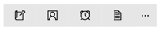
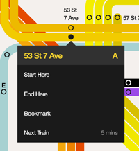

#  Основы проектирования команд в приложениях UWP

В универсальном приложении для Windows (UWP) *командные элементы* — это интерактивные элементы пользовательского интерфейса, которые позволяют пользователю выполнять действия, например отправлять электронное сообщение, удалять элемент или отправлять форму. В этой статье описаны командные элементы, такие как кнопки и флажки, взаимодействия, которые они поддерживают, и поверхности для команд (например, панели команд и контекстные меню) для их размещения.

## Укажите правильный тип взаимодействий

При проектировании командного интерфейса самое важное решение — это выбрать, что пользователи смогут делать. Например, если вы создаете фотоприложение, пользователю понадобятся инструменты для редактирования фотографий. Если же вы создаете приложение для социальных сетей, которое отображает фотографии, возможно, редактирование изображений не так уж важно, и инструменты для редактирования можно опустить для экономии места. Решите, чем должны заниматься пользователи, и предоставьте им необходимые для этого инструменты.

Рекомендации по планированию правильных взаимодействий для приложения см. в разделе [Планирование приложения](https://msdn.microsoft.com/library/windows/apps/hh465427.aspx).

## Используйте для взаимодействия правильный элемент команды

Если использовать правильные элементы для правильных взаимодействий, то приложение будет интуитивно понятным. В противном случае оно будет сложным или запутанным. Платформа универсальных приложений для Windows (UWP) предоставляет широкий набор командных элементов в виде элементов управления, которые можно использовать в приложении. Вот список некоторых наиболее распространенных элементов управления и краткое описание взаимодействий, которые они обеспечивают.

| Категория              | Элементы                                                                                                                                                                                                            | Взаимодействие                                                                                                                                        |
|-----------------------|---------------------------------------------------------------------------------------------------------------------------------------------------------------------------------------------------------------------|----------------------------------------------------------------------------------------------------------------------------------------------------|
| Кнопки               | [Кнопка](https://msdn.microsoft.com/library/windows/apps/hh465470)                                                                                                                                                     | Выполняет немедленное действие, например отправку электронного сообщения, подтверждение действия в диалоговом окне, отправку данных формы.                                    |
| Управляющие элементы выбора даты и времени | [выбор даты календаря, представление календаря, выбор даты, выбор времени](https://msdn.microsoft.com/library/windows/apps/hh465466)                                                                                                                 | Позволяет пользователям просматривать и изменять сведения о дате и времени, например вводить дату окончания срока действия кредитной карты или устанавливать будильник.                   |
| Списки                 | [раскрывающийся список, список, представление списка и представление сетки](https://msdn.microsoft.com/library/windows/apps/mt186889)                                                                                                                                              | Представляет элементы в интерактивном списке или сетке. Используйте эти элементы, чтобы позволить пользователям выбирать фильм из списка новинок или управлять складом. |
| Прогнозируемый ввод текста | [Поле автозаполнения](https://msdn.microsoft.com/library/windows/apps/dn997762)                                                                                                                                                                    | Экономит время пользователей при вводе данных или выполнении запросов, предоставляя варианты во время набора.                                                   |
| Элементы управления для выбора    | 
            [флажок](https://msdn.microsoft.com/library/windows/apps/hh700393), [переключатель](https://msdn.microsoft.com/library/windows/apps/hh700395), [тумблер](https://msdn.microsoft.com/library/windows/apps/hh465475) | Позволяет пользователю выбирать различные варианты, например при выполнении опроса или настройке параметров приложения.                                      |

 

Полный список см. в разделе [Элементы управления и пользовательского интерфейса](https://dev.windows.com/design/controls-patterns)

##  Размещение команд на нужной поверхности

Командные элементы можно размещать на ряде поверхностей приложения, в том числе на холсте приложения (область содержимого приложения) или в специальных командных элементах, которые могут выступать в качестве контейнеров команд, таких как панели команд, меню, диалоговые окна и всплывающие элементы. Вот некоторые общие рекомендации по размещению команд.

-   Всегда старайтесь сделать так, чтобы пользователи могли напрямую управлять содержимым на холсте приложения, не перегружая его обособленными командами. Скажем, пусть путешественники из нашего примера, планируя маршрут, просто перетаскивают развлечения внутри списка на холсте приложения, а не нажимают всякий раз стрелки.
-   В противном случае разместите команды на одной из этих поверхностей интерфейса, если пользователи не могут управлять содержимым напрямую:

    -   [Панель команд](https://msdn.microsoft.com/library/windows/apps/hh465302). Большинство команд лучше расположить на панели команд, которая помогает организовать команды и облегчает к ним доступ.
    -   Холст приложения. Если определенная страница или представление служат одной цели, то команды, обслуживающие эту цель, можно разместить прямо на холсте. Таких команд должно быть совсем немного.
    -   [Контекстное меню](https://msdn.microsoft.com/library/windows/apps/hh465308). В контекстное меню можно поместить команды, обеспечивающие работу буфера обмена (вырезание, копирование и вставка), или команды, относящиеся к содержимому, которое нельзя выбрать (например, добавление флажка на карту).

Вот список поверхностей для команд, которые предоставляет Windows, и рекомендации по тому, когда их использовать.

<table>
<colgroup>
<col width="50%" />
<col width="50%" />
</colgroup>
<thead>
<tr class="header">
<th align="left">Поверхность</th>
<th align="left">Описание</th>
</tr>
</thead>
<tbody>
<tr class="odd">
<td align="left">Холст приложения (область содержимого)

</td>
<td align="left">
Если команда очень важна и постоянно необходима пользователю для выполнения основных сценариев, поместите ее на холст (область содержимого приложения). Так как вы можете разместить команды возле объектов, на которые они влияют (или на них), если разместить команды на холсте, их будет просто понять и использовать.

Но выбирайте команды, которые помещаете на холст, тщательно. Слишком много команд на холсте приложения занимают ценное место на экране и могут перегружать пользователя. Если команда будет использоваться не часто, ее можно поместить на другую поверхность для команд, например в меню или в область &quot;Дополнительно&quot; на панели команд.
</td>
</tr>
<tr class="even">
<td align="left">[Панель команд](https://msdn.microsoft.com/library/windows/apps/hh465302)

</td>
<td align="left">
Панели команд предоставляют пользователям удобный доступ к действиям. Панель команд можно использовать, чтобы показывать команды или параметры, относящиеся к пользовательскому контексту, например к выбору фотографий или режиму рисования.

Панели команд можно разместить в верхней части экрана, в нижней части экрана, или как в верхней, так и в нижней части экрана. В данном макете приложения для редактирования фотографий отображается область содержимого и панель команд:

Подробнее о панелях команд см. в статье [Руководство по панелям команд](https://msdn.microsoft.com/library/windows/apps/hh465302).
</td>
</tr>
<tr class="odd">
<td align="left">[Меню и контекстные меню](../controls-and-patterns/dialogs-popups-menus.md)

</td>
<td align="left">
Иногда эффективнее группировать несколько команд в меню команд. Меню позволяют предлагать больше параметров, используя меньше пространства. Меню могут содержать интерактивные элементы управления.

Контекстные меню могут содержать ярлыки на часто используемые действия и предоставлять доступ ко второстепенным командам, которые актуальны только в определенном контексте.

Контекстные меню предназначены для выполнения следующих типов команд и командных сценариев:

<ul>
<li>Контекстные действия с выбранным текстом, такие как «Копировать», «Вырезать», «Вставить», «Проверка орфографии» и т. д.</li>
<li>Команды для выполнения операций с объектом, с которым можно взаимодействовать, но который нельзя выбрать или выделить иным способом.</li>
<li>Отображение команд буфера обмена.</li>
<li>Пользовательские команды.</li>
</ul>

В этом примере показано проектирование приложения метро, в котором контекстное меню используется для изменения маршрута, добавления маршрута в закладки или выбора другого поезда.

Подробнее о контекстных меню см. в статье [Руководство по контекстным меню](https://msdn.microsoft.com/library/windows/apps/hh465308).
</td>
</tr>
<tr class="even">
<td align="left">[Диалоговые элементы управления](../controls-and-patterns/dialogs-popups-menus.md)

</td>
<td align="left">
Диалоговые окна — это модальные наложения пользовательского интерфейса, которые предоставляют контекстную информацию о приложении. В большинстве случаев диалоговые окна блокируют взаимодействие с окном приложения, пока не будут закрыты явным образом, и зачастую требуют от пользователя выполнить некое действие.

Диалоговые окна могут отвлекать и должны использоваться только в определенных ситуациях. Подробнее см. в разделе [Когда подтверждать или отменять действия](#whentoconfirm).
</td>
</tr>
<tr class="odd">
<td align="left">[Всплывающий элемент](../controls-and-patterns/dialogs-popups-menus.md)

</td>
<td align="left">
Облегченное всплывающее контекстно-зависимое окно, отображающее элемент пользовательского интерфейса в зависимости от действий пользователя. Используйте всплывающий элемент, чтобы:

<ul>
<li>показать меню;</li>
<li>отобразить дополнительные сведения об элементе;</li>
<li>запросить у пользователя подтверждение действия, не блокируя взаимодействие с приложением.</li>
</ul>

Всплывающий элемент можно закрыть, нажав на участок экрана за его пределами. Дополнительные сведения об элементах управления "всплывающий элемент" см. в статье [Диалоговые окна, всплывающие окна и меню](../controls-and-patterns/dialogs-popups-menus.md).
</td>
</tr>
</tbody>
</table>

 

## Когда подтверждать или отменять действия

Независимо от того, насколько правильно разработан пользовательский интерфейс и насколько осторожно действует пользователь, в определенный момент все пользователи выполняют действие, которое они не хотели бы выполнять. Ваше приложение может помочь в этой ситуации, требуя, чтобы пользователь подтвердил действие, или предоставляя возможность отменить последние действия.

-   Для имеющих серьезные последствия действий, которые нельзя отменить, рекомендуется использовать диалоговое окно подтверждения. Примеры таких действий:
    -   перезапись файла;
    -   закрытие файла без сохранения;
    -   подтверждение окончательного удаления файла или данных;
    -   покупка (если пользователь не отказался от обязательного подтверждения);
    -   отправка формы, например регистрация.
-   Для действий, которые можно отменить, обычно достаточно простой команды «Отменить». Примеры таких действий:
    -   удаление файла;
    -   удаление электронного письма (не окончательное);
    -   изменение содержимого или редактирование текста;
    -   переименование файла.

            **Совет**  Обратите внимание, сколько диалоговых окон подтверждения использует ваше приложение; они могут оказаться очень полезными, если пользователь совершил ошибку, но они также выступают помехой, когда пользователь пытается выполнить действие намеренно.

 

##  Оптимизация для определенных типов ввода

Подробнее об оптимизации взаимодействия с пользователем на основе определенного типа ввода или устройства см. в разделе [Азбука взаимодействия](../input-and-devices/input-primer.md).

 

 

<!--HONumber=Jun16_HO4-->

