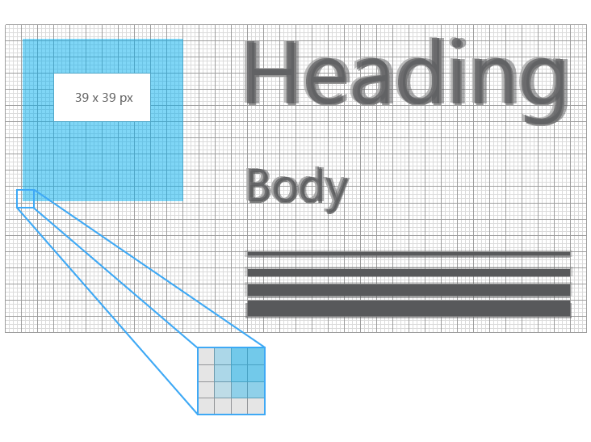
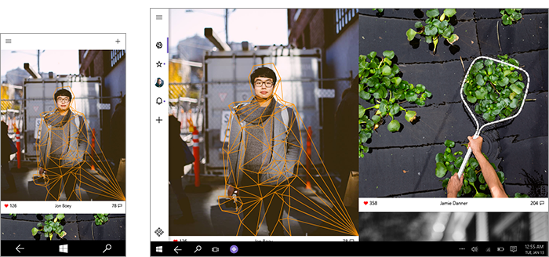
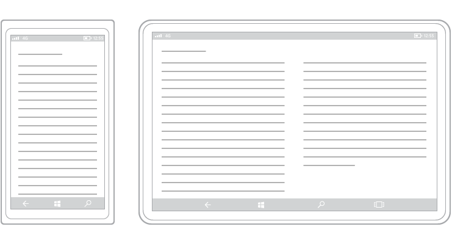

#  Введение в проектирование приложений UWP 

<link rel="stylesheet" href="https://az835927.vo.msecnd.net/sites/uwp/Resources/css/custom.css">

Приложение универсальной платформы Windows (UWP) может работать на любом устройстве на основе Windows — от телефона до планшета или настольного компьютера.

Проектирование приложения, которое хорошо бы смотрелось на таком широком спектре устройств, может быть сложной задачей. Итак, как же подойти к проектированию приложения, интерфейс которого был бы одинаково удобен при использовании на устройствах с самыми разными размерами экрана и способами ввода информации? К счастью, универсальная платформа Windows (UWP) предоставляет набор встроенных функций и универсальных шаблонов, предназначенных именно для этого. 

В этой статье описываются функции пользовательского интерфейса и преимущества приложений UWP и предоставляются некоторые общие рекомендации по проектированию для создания вашего первого приложения UWP. Давайте начнем со знакомства с некоторыми функциями, которые вы можете использовать при создании приложения UWP. 

## Функции приложения UWP

### Эффективные пиксели и масштабирование

Приложения UWP автоматически регулируют размер элементов управления, шрифтов и других элементов пользовательского интерфейса, чтобы они были разборчивыми на всех устройствах.

При запуске приложения на устройстве система использует алгоритм, позволяющий оптимизировать отображение элементов пользовательского интерфейса на экране. Этот алгоритм масштабирования учитывает расстояние, на котором осуществляется просмотр, и растровую плотность (количество пикселей на дюйм) и оптимизирует воспринимаемый (а не физический) размер элементов. Алгоритм масштабирования позволяет добиться того, что шрифт размером 24 пикселя на Surface Hub, который располагается на расстоянии трех метров от пользователя, будет таким же читаемым, как и шрифт аналогичного размера, отображаемый на телефоне с диагональю экрана 5 дюймов, который располагается на расстоянии нескольких сантиметров от пользователя.

В силу особенностей работы системы масштабирования, создавая приложение UWP, вы ведете разработку в *эффективных*, а не физических пикселях. Итак, как же это влияет на разработку вами приложения?

-   При разработке вы можете игнорировать плотность пикселей и фактическое разрешение экрана. Выполняйте разработку с учетом эффективного разрешения (разрешения в эффективных пикселях) для класса размеров (дополнительные сведения см. в статье [Размеры экрана и точки останова](screen-sizes-and-breakpoints-for-responsive-design.md)).

-   Система масштабирует пользовательский интерфейс в величинах, кратных 4. Чтобы обеспечить четкость отображения, переключитесь при разработке на сетку с размером ячейки 4 × 4 пикселя. Сделайте так, чтобы величина полей, размеры и положение элементов пользовательского интерфейса и положение текста (но не размер — текст может быть любого размера) текста были кратны 4.

На этой иллюстрации показаны элементы интерфейса, размещенные на сетке с размером ячейки 4 × 4 пикселя. У элементов интерфейса всегда будут четкие края.

На следующем рисунке показаны элементы интерфейса, которые не совпадают с линиями сетки с размером ячейки 4 × 4 пикселя. На некоторых устройствах края этих элементов будут смазаны.

> [!TIP]
> При создании макетов в графических редакторах установите количество точек на дюйм равным 72 и соотнесите размеры изображения с эффективным разрешением целевого класса размеров. (Список классов размеров и значений эффективного разрешения см. в разделе [Рекомендации для определенных классов размеров](#sizeclasses) данной статьи.)

### Универсальный ввод данных и интеллектуальное взаимодействие

Другая встроенная возможность UWP — универсальный ввод данных, использующий интеллектуальное взаимодействие. Хотя вы можете разработать приложения для конкретных режимов ввода и устройств, это не обязательно, поскольку универсальные приложения для Windows по умолчанию используют интеллектуальное взаимодействие. Это означает, что вы можете выполнять обработку нажатия и при этом вам будет все равно, осуществляется ли это нажатие с помощью щелчка мыши или прикосновения пальца.

### Универсальные элементы управления и стили

Платформа UWP также предоставляет некоторые полезные шаблоны, которые упрощают разработку для нескольких семейств устройств.

-   **Универсальные элементы управления**

    Платформа UWP предоставляет набор универсальных элементов управления, которые будут хорошо работать на всех устройствах под управлением Windows. Этот набор включает все элементы управления от стандартных элементов управления формы, таких как переключатели и текстовые поля, до сложных элементов, таких как представление сетки или списка, которые могут генерировать списки на основе потока данных и шаблона. Эти элементы управления поддерживают методы ввода информации и используют подходящий набор возможностей ввода, состояний событий и общего функционала, присущего линейке устройств.

    Полный список таких элементов управления и шаблонов, которые могут быть созданы на их основе, см. в разделе [Элементы управления и шаблоны](https://dev.windows.com/design/controls-patterns).

-   **Универсальные стили**

    Приложение UWP автоматически получает набор стилей по умолчанию, который предоставляет следующие возможности.

    -   Набор стилей, который автоматически применяет к приложению светлую или темную тему (по выбору) и который может использовать выбранный пользователем цвет элементов.

        

    -   Набор шрифтов Segoe, которые обеспечивают четкое отображение текста на всех устройствах.
    -   Анимация взаимодействия по умолчанию.
    -   Автоматическая поддержка режимов высокой контрастности. Эти стили разработаны с учетом требований высокой контрастности и будут корректно отображаться в приложениях на устройствах, работающих в режиме высокой контрастности.
    -   Автоматическая поддержка других языков. Эти стили по умолчанию автоматически выбирают подходящий шрифт для каждого языка, поддерживаемого Windows. Вы можете использовать в одном приложении несколько языков, и все они будут отображаться правильно.
    -   Встроенная поддержка направления чтения справа налево.

    Вы можете настроить эти стили по умолчанию, чтобы настроить внешний вид приложения или вовсе заменить их на свои собственные, чтобы создать уникальный графический интерфейс. Например, вот проект погодного приложения с уникальным визуальным стилем:

    

Итак, мы описали шаблоны приложений UWP. Как соединить их для создания пользовательского интерфейса? 
    
## Анатомия типичного приложения UWP

Современный пользовательский интерфейс — это сложный объект, состоящий из текста, форм, цветов и анимации, которые в конечном счете составляются из отдельных пикселей экрана используемого устройства. При проектировании пользовательского интерфейса количество вариантов исполнения может быть просто огромным.

Чтобы сделать все еще проще, давайте определим структуру приложения с точки зрения разработки. Допустим, приложение состоит из экранов и страниц. На каждой странице имеется пользовательский интерфейс, включающий три типа элементов: элементы навигации, командные элементы и элементы содержимого.

<table class="uwpd-noborder" >
<colgroup>
<col width="50%" />
<col width="50%" />
</colgroup>
<tbody>
<tr class="odd">
<td align="left">

</td>
<td align="left"><strong>Элементы навигации</strong>

Элементы навигации помогают пользователям выбрать то содержимое, которое они хотят отобразить. Примеры элементов навигации включают [вкладки и элементы управления "Сводка"](../controls-and-patterns/tabs-pivot.md), [гиперссылки](../controls-and-patterns/hyperlinks.md) и [панели навигации](../controls-and-patterns/nav-pane.md).

Элементы навигации подробно освещаются в статье [Основы проектирования навигации](navigation-basics.md).

<strong>Командные элементы</strong>

Командные элементы служат для выполнения действий, таких как управление, сохранение или предоставление общего доступа к содержимому. Примеры командных элементов: [кнопка](../controls-and-patterns/buttons.md) и [панель команд](../controls-and-patterns/app-bars.md). К командным элементам могут также относиться сочетания клавиш, которые фактически не отображаются на экране.

Командные элементы подробно освещаются в статье [Основы проектирования команд](commanding-basics.md).

<strong>Элементы содержимого</strong>

Элементы содержимого служат для отображения содержимого приложения. В случае графического редактора содержимым может быть рисунок, в случае новостного приложения — новостная статья.

Элементы содержимого подробно освещаются в статье [Основы проектирования содержимого](content-basics.md).
</td>
</tr>
</tbody>
</table>

 

В приложении имеется как минимум экран-заставка и домашняя страница, которая определяет пользовательский интерфейс. Обычно приложение содержит несколько экранов и страниц, а элементы навигации, командные элементы и элементы содержимого изменяются в зависимости от страницы.

Выбирая элементы пользовательского интерфейса для приложения, можно также учитывать устройства и размеры экранов, на которых будет использоваться приложение.

## Настройка приложения под конкретные устройства и размеры экранов.

Приложения UWP используют эффективные пиксели, чтобы обеспечить читаемость и удобство использования элементов интерфейса на всех устройствах под управлением Windows. Зачем же тогда производить настройку пользовательского интерфейса под конкретное семейство устройств?

**Примечание.**  
Прежде всего, Windows не предоставляет средств, благодаря которым приложение могло бы определить конкретное устройство, на котором оно запущено. Система способна определить тип устройства (мобильное, настольное и т. д.), на котором запущено приложение, эффективное разрешение и размер экранного пространства, доступного для приложения (размер окна приложения).

 

-   **Максимальная оптимизация использования пространства и уменьшение потребности в навигации**

    Если вы создаете приложение, ориентированное на устройство с маленьким экраном, например телефон, оно может быть запущено и на компьютере, экран которого намного больше, но в этом случае, скорее всего, останется неиспользованное пространство. Вы можете настроить приложение таким образом, чтобы оно отображало больше содержимого, если размер экрана превышает определенное значение. Например, приложение для совершения покупок может одновременно отображать одну категорию товара на телефоне и несколько категорий и продуктов на ПК или ноутбуке.

    Выводя больший объем содержимого на экран, вы сокращаете количество действий, которые пользователю необходимо совершать для навигации.

-   **Использование возможностей устройств**

    Некоторые устройства, скорее всего, обладают определенными возможностями. Например, телефоны, скорее всего, будут оснащены датчиком расположения и камерой, в то время как на ПК может не быть ни того, ни другого. Ваше приложение может определять доступные возможности и активировать функции, которые используют эти возможности.

-   **Оптимизация для ввода**

    Универсальная библиотека элементов управления поддерживает все типы ввода (прикосновения, перо, клавиатура, мышь). Тем не менее вы можете произвести оптимизацию некоторых типов ввода, изменив порядок элементов пользовательского интерфейса. Например, если вы размещаете элементы навигации в нижней части экрана, владельцам телефонов будет удобно пользоваться ими, однако большинство пользователей ПК ожидают увидеть элементы навигации в верхней части экрана.

## Методы создания отзывчивого дизайна

Если вы оптимизируете пользовательский интерфейс приложения для конкретной ширины экрана, мы считаем, что вы создаете отзывчивый дизайн. Вот шесть методов создания отзывчивого дизайна. которые вы можете использовать для настройки пользовательского интерфейса своего приложения.

### Изменение положения

Вы можете изменять положение элементов пользовательского интерфейса приложения, чтобы максимально эффективно использовать каждое из устройств. В этом примере портретная ориентация телефона или фаблета обуславливает необходимость прокрутки элементов пользовательского интерфейса, так как одновременно отображается только один полный кадр. При запуске приложения на устройстве, которое позволяет отображать на экране два полных кадра как при портретной, так и при альбомной ориентации, кадр B может занимать выделенное для него пространство. Если вы используете сетку для управления положением элементов пользовательского интерфейса, то можете воспользоваться ею и в том случае, если оно меняется.

В этом примере разработки приложения для работы с фотографиями приложение изменяет положение своего содержимого на более крупных экранах.

### Изменение размера

Вы можете оптимизировать размер кадра, регулируя поля и размер элементов пользовательского интерфейса. Как видно из приведенных примеров, благодаря этому можно расширить пространство для чтения на больших экранах, просто увеличив размер кадра содержимого.

### Адаптация

Приложение способно обеспечить оптимальное отображение содержимого путем изменения порядка элементов пользовательского интерфейса в зависимости от устройства и его ориентации. Например, при переходе на устройство с большим размером экрана, возможно, имело бы смысл использовать более крупные контейнеры, добавлять колонки и по-другому генерировать элементы списков.

В этом примере показано, как один столбец вертикально прокручиваемого содержимого на телефоне или фаблете может быть адаптирован к большему экрану для отображения двух столбцов текста.

###  Отображение

Вы можете отобразить пользовательский интерфейс в зависимости от свободного экранного пространства или если устройство поддерживает дополнительные функции, конкретные ситуации или предпочитаемые ориентации экрана.

В этом примере средняя вкладка со значком камеры может использоваться в приложении на телефоне или фаблете, но может не подходить для устройств с большим экраном. Поэтому она отображается на устройстве справа. Другой распространенный пример отображения и скрытия пользовательского интерфейса касается элементов управления проигрывателей мультимедиа, в которых набор кнопок сворачивается на маленьких и разворачивается на больших устройствах. Например, на ПК проигрыватель мультимедиа может задействовать больше функциональных возможностей с использованием экрана, чем на телефоне.

К отображению или скрытию элементов относится также выбор ситуаций, в которых следует отображать дополнительные метаданные. Если свободное экранное пространство имеет большую ценность, например в случае телефона или фаблета, лучше отображать минимум метаданных. На ноутбуке или ПК может быть отображен значительный объем метаданных. Некоторые примеры отображения или скрытия метаданных:

-   в случае приложения для работы с электронной почтой вы можете отображать фотографию пользователя;
-   в случае музыкального плеера вы можете отображать более подробную информацию об альбоме или исполнителе;
-   в случае видеоплеера мы можете отображать сведения о фильме или передаче, например указывая информацию об актерском составе и съемочной группе;
-   в любом приложении вы можете разбивать колонки и отображать подробные сведения;
-   в любом приложении вы имеете возможность горизонтально упорядочить те элементы, которые были сгруппированы по вертикали; при переходе с телефона или фаблета к большим устройствам элементы списка, упорядоченные по вертикали, можно реорганизовать, так чтобы отображались строки с элементами и столбцы с метаданными.

### Замена

Этот метод позволяет переключать пользовательский интерфейс на конкретный класс устройств или ориентацию экрана. В этом примере панель навигации и ее компактный, прозрачный интерфейс хорошо смотрятся на небольших устройствах, но на более крупном устройстве лучше выбрать вкладки.

###  Изменение архитектуры

Вы можете свернуть архитектуру приложения или создать несколько ее вариантов для лучшего охвата конкретных устройств. В этом примере при переходе от левого устройства к правому происходит соединение страниц.

Здесь приведен пример этого метода, примененный при разработке приложения для умного дома.

## Связанные разделы

- [Что такое приложение UWP?](https://msdn.microsoft.com/library/windows/apps/dn726767.aspx)

 

