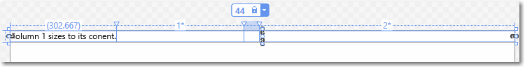
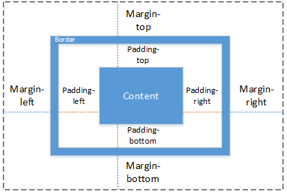
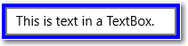
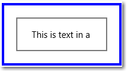
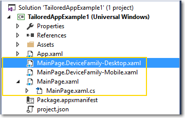
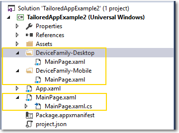

# <a name="define-page-layouts-with-xaml"></a>Определение макетов страниц с помощью XAML

<link rel="stylesheet" href="https://az835927.vo.msecnd.net/sites/uwp/Resources/css/custom.css">

XAML предоставляет гибкую систему макетов, позволяющую использовать функцию автоматического выбора размера, панели макетов, визуальные состояния и даже отдельные определения пользовательского интерфейса для создания интерфейса с быстрым откликом. Благодаря гибкой структуре ваше приложение будет прекрасно смотреться на экранах с различными размерами окна, разными разрешениями, плотностью пикселей и ориентацией.

В этой статье описано, как с помощью свойств и панелей макета XAML создавать гибкие и быстро реагирующие приложения. Она основана на важных сведениях о проектировании гибкого пользовательского интерфейса из статьи [Введение в проектирование приложений UWP](../layout/design-and-ui-intro.md). Вам необходимо знать, что такое эффективные пиксели, а также понимать каждую из этих методик оформления с быстрым откликом: изменение положения, изменение размера, адаптация, отображение, замена и изменение архитектуры.

> [!NOTE]
> Макет вашего приложения начинается с выбранной вами модели навигации: например, можно использовать модель [**Pivot**](https://msdn.microsoft.com/library/windows/apps/xaml/windows.ui.xaml.controls.pivot.aspx) с моделью [‘tabs and pivot’](../controls-and-patterns/tabs-pivot.md) или модель [**SplitView**](https://msdn.microsoft.com/library/windows/apps/xaml/windows.ui.xaml.controls.splitview.aspx) с моделью [‘nav pane’](../controls-and-patterns/nav-pane.md). Подробнее об этом см. в разделе [Основы проектирования навигации для приложений UWP](../layout/navigation-basics.md). Здесь будут описаны методики создания макета одной страницы или группы элементов с быстрым откликом. Эти данные применяются независимо от выбранной вами модели навигации для приложения.

Платформа XAML предоставляет несколько уровней оптимизации, с помощью которых можно создать пользовательский интерфейс с быстрым откликом.
- **Гибкий макет**
    Используйте свойства макета и панели, чтобы сделать свой пользовательский интерфейс более гибким по умолчанию.

    Основа гибкого макета — это правильное применение свойств и панелей для перемещения, изменения размеров и адаптации содержимого. Вы можете задать фиксированный размер для элемента или использовать функцию автоматического выбора размера, чтобы позволить родительской панели макета выбрать его размер. Различные классы [**Panel**](https://msdn.microsoft.com/library/windows/apps/xaml/windows.ui.xaml.controls.panel.aspx), например [**Canvas**](https://msdn.microsoft.com/library/windows/apps/xaml/windows.ui.xaml.controls.canvas.aspx), [**Grid**](https://msdn.microsoft.com/library/windows/apps/xaml/windows.ui.xaml.controls.grid.aspx), [**RelativePanel**](https://msdn.microsoft.com/library/windows/apps/xaml/windows.ui.xaml.controls.relativepanel.aspx) и [**StackPanel**](https://msdn.microsoft.com/library/windows/apps/xaml/windows.ui.xaml.controls.stackpanel.aspx), реализуют разные способы выбора размера и расположения дочерних элементов.

- **Адаптивный макет**
    Используйте визуальные состояния, чтобы существенно изменить пользовательский интерфейс на основе размера окна или внести другие правки.

    Когда окно вашего приложения увеличится или уменьшится до размеров, выходящих за указанный диапазон, возможно, вы захотите изменить свойства макета, чтобы перемещать окна и изменять их размеры, адаптировать, отображать или заменять разделы вашего пользовательского интерфейса. Вы можете определять различные визуальные состояния пользовательского интерфейса и применять их, когда ширина или высота окна превысит заданное пороговое значение. [**AdaptiveTrigger**](https://msdn.microsoft.com/library/windows/apps/xaml/windows.ui.xaml.adaptivetrigger.aspx) предоставляет простой способ установки порогового значения (или «точки останова»), при котором применяется состояние.

- **Специально разработанный макет**
    Специально разработанный макет оптимизирован для конкретного семейства устройств или размеров экрана. В семействе устройств макет должен реагировать на изменения в пределах диапазона поддерживаемых размеров окон и адаптироваться к ним.
    > **Примечание**&nbsp;&nbsp; С помощью [Continuum для телефонов](http://go.microsoft.com/fwlink/p/?LinkID=699431) пользователи могут подключать к своим телефонам монитор, мышь и клавиатуру. Эта возможность стирает границы между телефоном и настольными компьютерами.

    Подходы к специальной разработке
    - Создание настраиваемого триггера

    Вы можете создать триггер для семейства устройств и изменить его методы установки значений, как для адаптивных триггеров.

    - Используйте отдельные файлы XAML для определения отдельных представлений для каждого семейства устройств.

    Вы можете использовать отдельные файлы XAML с тем же файлом кода для определения представления каждого семейства устройств пользовательского интерфейса.

    - Используйте отдельный XAML и код для предоставления различных реализаций для каждого семейства устройств.

    Вы можете предоставить различные реализации страницы (XAML и код), а затем переходить к конкретной реализации на основе семейства устройств, размера экрана и других факторов.

## <a name="layout-properties-and-panels"></a>Панели и свойства макета

Создание макета — это изменение размеров объектов и их размещение в пользовательском интерфейсе. Чтобы разместить видимые объекты, необходимо поместить их в элемент «Панель» или в другой объект-контейнер. Платформа XAML предоставляет различные классы panel, такие как [**Canvas**](https://msdn.microsoft.com/library/windows/apps/xaml/windows.ui.xaml.controls.canvas.aspx), [**Grid**](https://msdn.microsoft.com/library/windows/apps/xaml/windows.ui.xaml.controls.grid.aspx), [**RelativePanel**](https://msdn.microsoft.com/library/windows/apps/xaml/windows.ui.xaml.controls.relativepanel.aspx) и [**StackPanel**](https://msdn.microsoft.com/library/windows/apps/xaml/windows.ui.xaml.controls.stackpanel.aspx), которые служат контейнерами для размещения элементов пользовательского интерфейса.

Система макетов XAML поддерживает как статические, так и гибкие макеты. В статическом макете элементам управления прямо назначаются размеры пикселей и положения. Если пользователь меняет разрешение или ориентацию устройства, пользовательский интерфейс не меняется. Статические макеты могут оказаться обрезанными при различных конструктивных параметрах и размерах изображения.

Гибкие макеты сжимаются, растягиваются и видоизменяются, адаптируясь к доступному на устройстве визуальному пространству экрана. Для создания гибкого макета используйте автоматический или пропорциональный размер элементов, выравнивания, полей и заполнения. Сделайте так, чтобы дочерние элементы панелей макета могли разместиться необходимым способом. Дочерние элементы размещаются с указанием, как они должны быть расположены по отношению друг к другу и какие они должны иметь размеры относительно их содержимого и (или) родительского элемента.

На практике используется сочетание статических и гибких элементов для создания пользовательского интерфейса. В некоторых местах по-прежнему используются статические элементы и значения, однако следует обеспечивать, чтобы пользовательский интерфейс в целом имел быстрый отклик и адаптировался к различным разрешениям, макетам и представлениям.

### <a name="layout-properties"></a>Свойства макета

Для управления размером и положением элемента следует установить его свойства макета. Вот некоторые распространенные свойства макета и их эффект.

**Height и Width**

Задайте свойства [**Height**](https://msdn.microsoft.com/library/windows/apps/xaml/windows.ui.xaml.frameworkelement.height.aspx) и [**Width**](https://msdn.microsoft.com/library/windows/apps/xaml/windows.ui.xaml.frameworkelement.width.aspx) для определения размера элемента. Можно использовать статические значения, измеренные в эффективных пикселях, функцию автоматического выбора размера либо пропорциональный размер. Чтобы получить размер элемента во время выполнения, используйте свойства [**ActualHeight**](https://msdn.microsoft.com/library/windows/apps/xaml/windows.ui.xaml.frameworkelement.actualheight.aspx) и [**ActualWidth**](https://msdn.microsoft.com/library/windows/apps/xaml/windows.ui.xaml.frameworkelement.actualwidth.aspx) вместо Height и Width.

Функция автоматического выбора размера используется, чтобы разрешить элементам пользовательского интерфейса изменять размер по размеру своего содержимого или родительского контейнера. Можно также использовать функцию автоматического выбора размера со строками и столбцами сетки. Для использования функции автоматического выбора размеров установите для параметров Height и/или Width элементов пользовательского интерфейса значение **Auto**.

> [!NOTE]
> Будет ли элемент изменять размер согласно своему содержимому или контейнеру, зависит от значения его свойств [**HorizontalAlignment**](https://msdn.microsoft.com/library/windows/apps/xaml/windows.ui.xaml.frameworkelement.horizontalalignment.aspx) и [**VerticalAlignment**](https://msdn.microsoft.com/library/windows/apps/xaml/windows.ui.xaml.frameworkelement.verticalalignment.aspx), а также от того, как родительский контейнер обработает изменение размеров его дочерних элементов. Подробнее см. в разделах [Выравнивание]() и [Панели макета]() далее в этой статье.

Пропорциональное изменение размеров, также именуемое *задание размера с помощью звезды*, используется для распределения доступного пространства среди строк и столбцов сетки с помощью взвешенных пропорций. В языке XAML значения звезд выражены как \* (или *n*\* для пропорционального задания размера с помощью звезды). Например, чтобы указать, что один столбец двухстолбцового макета в пять раз шире, чем другой, используйте значения «5\*» и «\*» для свойств [**Width**](https://msdn.microsoft.com/library/windows/apps/xaml/windows.ui.xaml.controls.columndefinition.width.aspx) в элементах [**ColumnDefinition**](https://msdn.microsoft.com/library/windows/apps/xaml/windows.ui.xaml.controls.columndefinition.aspx).

В этом примере сочетаются фиксированный, автоматический и пропорциональный размер в элементе [**Grid**](https://msdn.microsoft.com/library/windows/apps/xaml/windows.ui.xaml.controls.grid.aspx) с четырьмя столбцами.

&nbsp;|&nbsp;|&nbsp;
------|------|------
Column_1 | **Auto (Автоматически)** | Размер столбца автоматически подстраивается под содержимое.
Column_2 | * | После вычисления значений ширины для автоматических столбцов этот столбец получает часть оставшейся ширины. Ширина столбца Column_2 будет занимать половину ширины столбца Column_4.
Column_3 | **44** | Столбец будет иметь ширину 44 пикселя.
Column_4 | **2**\* | После вычисления значений ширины для столбцов с автоматическим подбором размера этот столбец получает часть оставшейся ширины. Ширина столбца Column_4 будет в два раза больше ширины столбца Column_2.

Ширина столбцов по умолчанию составляет «*», поэтому не нужно явным образом задавать это значение для второго столбца.

```xaml
<Grid>
    <Grid.ColumnDefinitions>
        <ColumnDefinition Width="Auto"/>
        <ColumnDefinition/>
        <ColumnDefinition Width="44"/>
        <ColumnDefinition Width="2*"/>
    </Grid.ColumnDefinitions>
    <TextBlock Text="Column 1 sizes to its conent." FontSize="24"/>
</Grid>
```

В конструкторе XAML в Visual Studio результат выглядит следующим образом.



**Ограничения размера**

При автоматическом выборе размера в вашем пользовательском интерфейсе все же может потребоваться установить ограничения для размера элемента. Вы можете задать свойства [**MinWidth**](https://msdn.microsoft.com/library/windows/apps/xaml/windows.ui.xaml.frameworkelement.minwidth.aspx)/[**MaxWidth**](https://msdn.microsoft.com/library/windows/apps/xaml/windows.ui.xaml.frameworkelement.maxwidth.aspx) и [**MinHeight**](https://msdn.microsoft.com/library/windows/apps/xaml/windows.ui.xaml.frameworkelement.minheight.aspx)/[**MaxHeight**](https://msdn.microsoft.com/library/windows/apps/xaml/windows.ui.xaml.frameworkelement.maxheight.aspx), чтобы определить значения, которые ограничивают размер элемента, но в то же время обеспечивают его гибкое изменение.

В элементах Grid свойство MinWidth/MaxWidth можно также использовать с определениями столбца. Свойство MinHeight/MaxHeight можно использовать с определениями строки.

**Выравнивание**

Используйте свойства [**HorizontalAlignment**](https://msdn.microsoft.com/library/windows/apps/xaml/windows.ui.xaml.frameworkelement.horizontalalignment.aspx) и [**VerticalAlignment**](https://msdn.microsoft.com/library/windows/apps/xaml/windows.ui.xaml.frameworkelement.verticalalignment.aspx), чтобы указать, как элемент должен быть расположен в выделенном родительском контейнере.
- Значения для **HorizontalAlignment**: **Left**, **Center**, **Right** и **Stretch**.
- Значения для **VerticalAlignment**: **Top**, **Center**, **Bottom** и **Stretch**.

При выравнивании **Stretch** элементы занимают все место в соответствии с родительским контейнером. Stretch является значением по умолчанию для обоих свойств выравнивания. Однако некоторые элементы управления, например [**Button**](https://msdn.microsoft.com/library/windows/apps/xaml/windows.ui.xaml.controls.button.aspx), перезаписывают это значение в своем стиле по умолчанию.
Любой элемент, который может содержать дочерние элементы, может интерпретировать значение Stretch только для свойств HorizontalAlignment и VerticalAlignment. Например, элемент, использующий значения Stretch по умолчанию в Grid, растягивается, заполняя ячейку, которая его содержит. Тот же элемент, помещенный в Canvas, принимает размеры его содержимого. Подробнее о том, как каждая панель обрабатывает значение Stretch, см. в статье [Панели макета](layout-panels.md).

Подробнее см. в статье [Выравнивание, поле и заполнение](alignment-margin-padding.md) и на справочных страницах [**HorizontalAlignment**](https://msdn.microsoft.com/library/windows/apps/xaml/windows.ui.xaml.frameworkelement.horizontalalignment.aspx) и [**VerticalAlignment**](https://msdn.microsoft.com/library/windows/apps/xaml/windows.ui.xaml.frameworkelement.verticalalignment.aspx).

Элементы управления имеют свойства [**HorizontalContentAlignment**](https://msdn.microsoft.com/library/windows/apps/xaml/windows.ui.xaml.controls.control.horizontalcontentalignment.aspx) и [**VerticalContentAlignment**](https://msdn.microsoft.com/library/windows/apps/xaml/windows.ui.xaml.controls.control.verticalcontentalignment.aspx), которые можно использовать для определения способа расположения содержимого. Не все элементы управления используют эти свойства. Они только влияют на поведение макета для элемента управления, когда его шаблон использует свойства в качестве источника значения HorizontalAlignment/VerticalAlignment для обработчиков или областей содержимого внутри контейнера.

Для [TextBlock](https://msdn.microsoft.com/library/windows/apps/xaml/windows.ui.xaml.controls.textblock.aspx), [TextBox](https://msdn.microsoft.com/library/windows/apps/xaml/windows.ui.xaml.controls.textbox.aspx) и [RichTextBlock](https://msdn.microsoft.com/library/windows/apps/xaml/windows.ui.xaml.controls.richtextblock.aspx) используйте свойство **TextAlignment** для управления выравниванием текста в элементе управления.

**Поля и заполнение**

Задайте свойство [**Margin**](https://msdn.microsoft.com/library/windows/apps/xaml/windows.ui.xaml.frameworkelement.margin.aspx) для управления размером пустого пространства вокруг элемента. Margin не добавляет пиксели к ActualHeight и ActualWidth и не считается частью элемента для проведения проверок и событий ввода источников.

Свойство [**Padding**](https://msdn.microsoft.com/library/windows/apps/xaml/windows.ui.xaml.controls.control.padding.aspx) позволяет контролировать объем пространства между внутренними границами элемента и его содержимым. Положительное значение Padding уменьшает область содержимого элемента.

На данной диаграмме показано, как поле и заполнение применяются к элементу.



Левое, правое, верхнее и нижнее значения для параметров Margin и Padding необязательно должны быть симметричными, и для них можно установить отрицательные значения. Подробнее см. в разделе [Выравнивание, поле и заполнение](alignment-margin-padding.md) и на справочных страницах [**Margin**](https://msdn.microsoft.com/library/windows/apps/xaml/windows.ui.xaml.frameworkelement.margin.aspx) или [**Padding**](https://msdn.microsoft.com/library/windows/apps/xaml/windows.ui.xaml.controls.control.padding.aspx).

Рассмотрим влияние параметров Margin и Padding на реальные элементы управления. Вот параметр TextBox внутри Grid со значениями параметров Margin и Padding по умолчанию, равными 0.



Вот те же самые параметры TextBox и Grid со значениями параметров Margin и Padding в TextBox, как показано в этом коде XAML.

```xaml
<Grid BorderBrush="Blue" BorderThickness="4" Width="200">
    <TextBox Text="This is text in a TextBox." Margin="20" Padding="24,16"/>
</Grid>
```



**Видимость**

Можно показать или скрыть элемент, задав свойству [**Visibility**](https://msdn.microsoft.com/library/windows/apps/xaml/windows.ui.xaml.uielement.visibility.aspx) одно из значений перечисления [**Visibility**](https://msdn.microsoft.com/library/windows/apps/xaml/windows.ui.xaml.visibility.aspx): **Visible** или **Collapsed**. Когда элемент свернут (Collapsed), он не занимает место в макете пользовательского интерфейса.

Можно изменить свойство Visibility элемента в коде или в визуальном состоянии. Когда свойство Visibility элемента изменено, все его дочерние элементы также изменяются. Вы можете заменить разделы своего пользовательского интерфейса путем отображения одной панели и сворачивания другой.

> **Совет.**&nbsp;&nbsp;Когда вы используете элементы в пользовательском интерфейсе, которые свернуты (**Collapsed**) по умолчанию, объекты продолжают создаваться при запуске, даже если они невидимы. Вы можете отложить загрузку этих элементов до их отображения, установив для атрибута **x:DeferLoadStrategy** значение «Lazy». Это может улучшить производительность при запуске. Подробнее см. в разделе [Атрибут x:DeferLoadStrategy](../xaml-platform/x-deferloadstrategy-attribute.md).

### <a name="style-resources"></a>Ресурсы стиля

Вам не придется задавать значение свойства по отдельности для элемента управления. Обычно такой способ более эффективен для группировки значений свойств в ресурс [**Style**](https://msdn.microsoft.com/library/windows/apps/xaml/windows.ui.xaml.style.aspx) и применения Style к элементу управления. Это особенно актуально, когда необходимо применить одинаковые значения свойства к многочисленным элементам управления. Подробнее об использовании стилей см. в разделе [Настройка стиля элементов управления](../controls-and-patterns/styling-controls.md).

### <a name="layout-panels"></a>Панели макета

Как правило, содержимое приложения может быть разбито по группировкам или иерархиям. Панели макета используются для группирования и упорядочивания элементов управления пользовательского интерфейса в приложении. Выбирая панель, главное — определить, как панель размещает свои дочерние элементы и задает их размеры. Также может потребоваться учесть характер перекрытия дочерних элементов, наложенных друг на друга.

Ниже показано сравнение основных функций элементов управления панели, предоставленных в платформе XAML.

Элемент управления панели | Описание
--------------|------------
[**Холст**](https://msdn.microsoft.com/library/windows/apps/xaml/windows.ui.xaml.controls.canvas.aspx) | **Canvas** не поддерживает гибкий пользовательский интерфейс. Вы управляете всеми аспектами размещения дочерних элементов и определения их размеров. Он обычно применяется в особых случаях, например, при создании графики или определении небольших статических областей большего адаптивного пользовательского интерфейса. Вы можете использовать код или визуальные состояния для перемещения элементов во время выполнения.<li>Абсолютное положение элементов задается присоединенными свойствами Canvas.Top и Canvas.Left.</li><li>Многоуровневое расположение можно явным образом указать с помощью присоединенного свойства Canvas.ZIndex.</li><li>Значения Stretch для параметра HorizontalAlignment/VerticalAlignment игнорируются. Если размер элемента явным образом не задан, его размер подбирается по содержимому.</li><li>Содержимое дочерних элементов визуально не сокращается, если его размер больше панели. </li><li>Содержимое дочерних элементов может выходить за границы панели.</li>
[**Сетка**](https://msdn.microsoft.com/library/windows/apps/xaml/windows.ui.xaml.controls.grid.aspx) | **Grid** поддерживает гибкое изменение размера дочерних элементов. Вы можете использовать код или визуальные состояния для перемещения элементов и адаптации.<li>Элементы упорядочиваются в строки и столбцы с помощью прикрепленных свойств Grid.Row и Grid.Column.</li><li>Присоединенные свойства Grid.RowSpan и Grid.ColumnSpan позволяют распространить элементы на несколько строк или столбцов.</li><li>Значения Stretch для параметра HorizontalAlignment/VerticalAlignment учитываются. Если размер элемента явным образом не задан, он растягивается на все доступное пространство ячейки сетки.</li><li>Содержимое дочерних элементов визуально обрезается, если его размер больше панели.</li><li>Размер содержимого ограничен границами панели, поэтому в прокручиваемом содержимом отображаются полосы прокрутки, если необходимо.</li>
[**RelativePanel**](https://msdn.microsoft.com/library/windows/apps/xaml/windows.ui.xaml.controls.relativepanel.aspx) | <li>Элементы упорядочены относительно края или центра панели и относительно друг друга.</li><li>Элементы размещаются с помощью различных присоединенных свойств, которые управляют выравниванием панели, выравниванием элементов одного уровня и расположением элементов одного уровня. </li><li>Значения Stretch для параметров HorizontalAlignment/VerticalAlignment игнорируются, если присоединенные свойства RelativePanel для выравнивания не будут вызывать растягивание (например, элемент выравнивается по правому и левому краям панели). Если размер элемента не задан явно и он не растянут, то размер соответствует его содержимому.</li><li>Содержимое дочерних элементов визуально обрезается, если его размер больше панели.</li><li>Размер содержимого ограничен границами панели, поэтому в прокручиваемом содержимом отображаются полосы прокрутки, если необходимо.</li>
[**StackPanel**](https://msdn.microsoft.com/library/windows/apps/xaml/windows.ui.xaml.controls.stackpanel.aspx) |<li>Элементы размещаются стопкой на одной линии по вертикали или горизонтали.</li><li>Значения Stretch для параметров HorizontalAlignment/VerticalAlignment соблюдаются в направлении, противоположном свойству Orientation. Если размер элемента явным образом не задан, он растягивается на всю доступную ширину (или высоту, если Orientation имеет значение Horizontal). В направлении, определенном свойством Orientation, размер элемента соответствует его содержимому.</li><li>Содержимое дочерних элементов визуально обрезается, если его размер больше панели.</li><li>Размер содержимого может выходить за границы панели в направлении, определенном свойством Orientation. Поэтому содержимое с возможностью прокрутки растягивается за границы панели, и в нем не отображаются полосы прокрутки. Необходимо явным образом ограничить высоту (или ширину) содержимого дочерних элементов, чтобы сделать полосы прокрутки видимыми.</li>
[**VariableSizedWrapGrid**](https://msdn.microsoft.com/library/windows/apps/xaml/windows.ui.xaml.controls.variablesizedwrapgrid.aspx) |<li>Элементы упорядочены по строкам и столбцам с автоматическим переносом на новую строку или столбец при достижении значения MaximumRowsOrColumns.</li><li>Упорядочиваются ли элементы по строкам и столбцам, определяется свойством Orientation.</li><li>Присоединенные свойства VariableSizedWrapGrid.RowSpan и VariableSizedWrapGrid.ColumnSpan позволяют распространить элементы на несколько строк или столбцов.</li><li>Значения Stretch для параметра HorizontalAlignment/VerticalAlignment игнорируются. Размеры элементов задаются свойствами ItemHeight и ItemWidth. Если эти свойства не заданы, размер элемента в первой ячейке соответствует его содержимому, и все остальные ячейки наследуют этот размер.</li><li>Содержимое дочерних элементов визуально обрезается, если его размер больше панели.</li><li>Размер содержимого ограничен границами панели, поэтому в прокручиваемом содержимом отображаются полосы прокрутки, если необходимо.</li>

Подробнее об этих панелях и примеры см. в разделе [Панели макета](layout-panels.md). См. также раздел [Пример адаптивных методик](http://go.microsoft.com/fwlink/p/?LinkId=620024).

Панели макета позволяют упорядочить пользовательский интерфейс в логические группы элементов управления. При их использовании с надлежащими параметрами свойства можно получить дополнительную поддержку для функции автоматического выбора размера, передать и переформатировать элементы пользовательского интерфейса. Однако большинство макетов пользовательского интерфейса следует изменить при изменении размера окна. Для этого можно использовать визуальные состояния.

## <a name="visual-states-and-state-triggers"></a>Визуальные состояния и триггеры состояния

Используйте визуальные состояния, чтобы перемещать окна и изменять их размеры, адаптировать, отображать или заменять разделы пользовательского интерфейса на основе размера экрана и других факторов. [**VisualState**](https://msdn.microsoft.com/library/windows/apps/xaml/windows.ui.xaml.visualstate.aspx) определяет значения свойства, применяемые к элементу, когда он находится в определенном состоянии. Сгруппируйте визуальные состояния в [**VisualStateManager**](https://msdn.microsoft.com/library/windows/apps/xaml/windows.ui.xaml.visualstatemanager.aspx), который применяет соответствующее VisualState при определенных условиях.

### <a name="set-visual-states-in-code"></a>Задание визуальных состояний в коде

Для применения визуального состояния из кода вызовите метод [**VisualStateManager.GoToState**](https://msdn.microsoft.com/library/windows/apps/xaml/windows.ui.xaml.visualstatemanager.gotostate.aspx). Например, чтобы применить состояние, когда окно приложения имеет определенный размер, обработайте событие [**SizeChanged**](https://msdn.microsoft.com/library/windows/apps/xaml/windows.ui.xaml.window.sizechanged.aspx) и вызовите **GoToState** для применения соответствующего состояния.

Здесь [**VisualStateGroup**](https://msdn.microsoft.com/library/windows/apps/xaml/windows.ui.xaml.visualstategroup.aspx) содержит два определения VisualState. Первое, `DefaultState`, пустое. Если оно применяется, применяются значения, определенные на странице XAML. Второе, `WideState`, изменяет свойство [**DisplayMode**](https://msdn.microsoft.com/library/windows/apps/xaml/windows.ui.xaml.controls.splitview.displaymode.aspx) параметра [**SplitView**](https://msdn.microsoft.com/library/windows/apps/xaml/windows.ui.xaml.controls.splitview.aspx) на **Inline** и открывает панель. Это состояние применяется в обработчике событий SizeChanged, если ширина окна составляет 720 эффективных пикселей или больше.

```xaml
<Page ...>
    <Grid>
        <VisualStateManager.VisualStateGroups>
            <VisualStateGroup>
                <VisualState x:Name="DefaultState">
                        <Storyboard>
                        </Storyboard>
                    </VisualState>

                <VisualState x:Name="WideState">
                    <Storyboard>
                        <ObjectAnimationUsingKeyFrames
                            Storyboard.TargetProperty="SplitView.DisplayMode"
                            Storyboard.TargetName="mySplitView">
                            <DiscreteObjectKeyFrame KeyTime="0">
                                <DiscreteObjectKeyFrame.Value>
                                    <SplitViewDisplayMode>Inline</SplitViewDisplayMode>
                                </DiscreteObjectKeyFrame.Value>
                            </DiscreteObjectKeyFrame>
                        </ObjectAnimationUsingKeyFrames>
                        <ObjectAnimationUsingKeyFrames
                            Storyboard.TargetProperty="SplitView.IsPaneOpen"
                            Storyboard.TargetName="mySplitView">
                            <DiscreteObjectKeyFrame KeyTime="0" Value="True"/>
                        </ObjectAnimationUsingKeyFrames>
                    </Storyboard>
                </VisualState>
            </VisualStateGroup>
        </VisualStateManager.VisualStateGroups>

        <SplitView x:Name="mySplitView" DisplayMode="CompactInline"
                   IsPaneOpen="False" CompactPaneLength="20">
            <!-- SplitView content -->

            <SplitView.Pane>
                <!-- Pane content -->
            </SplitView.Pane>
        </SplitView>
    </Grid>
</Page>
```

```csharp
private void CurrentWindow_SizeChanged(object sender, Windows.UI.Core.WindowSizeChangedEventArgs e)
{
    if (e.Size.Width >= 720)
        VisualStateManager.GoToState(this, "WideState", false);
    else
        VisualStateManager.GoToState(this, "DefaultState", false);
}
```

### <a name="set-visual-states-in-xaml-markup"></a>Задание визуальных состояний в разметке XAML

До Windows 10 определения VisualState требовали объектов [**Storyboard**](https://msdn.microsoft.com/library/windows/apps/xaml/windows.ui.xaml.media.animation.storyboard.aspx) для изменения свойств, и необходимо было вызвать **GoToState** в коде для применения состояния. Это демонстрируется в предыдущем примере. Вы увидите много примеров, которые также используют этот синтаксис. Возможно, у вас даже есть код, в котором он используется.

Начиная c Windows 10, можно использовать упрощенный синтаксис [**Setter**](https://msdn.microsoft.com/library/windows/apps/xaml/windows.ui.xaml.setter.aspx), показанный здесь, и использовать объекты [**StateTrigger**](https://msdn.microsoft.com/library/windows/apps/xaml/windows.ui.xaml.statetrigger.aspx) в разметке XAML для применения состояния. Триггеры состояния используется для создания своих простых правил, которые автоматически вызывают изменения визуального состояния в ответ на события приложения.

В этом примере выполняются те же действия, что и в предыдущем, но используется упрощенный синтаксис **Setter** вместо Storyboard для определения изменений свойств. И вместо вызова GoToState в нем используется встроенный триггер состояния [**AdaptiveTrigger**](https://msdn.microsoft.com/library/windows/apps/xaml/windows.ui.xaml.adaptivetrigger.aspx) для применения состояния. При использовании триггеров состояния не нужно указывать пустое состояние `DefaultState`. Параметры по умолчанию повторно автоматически применяются при игнорировании условий триггера состояния.

```xaml
<Page ...>
    <Grid>
        <VisualStateManager.VisualStateGroups>
            <VisualStateGroup>
                <VisualState>
                    <VisualState.StateTriggers>
                        <!-- VisualState to be triggered when the
                             window width is >=720 effective pixels. -->
                        <AdaptiveTrigger MinWindowWidth="720" />
                    </VisualState.StateTriggers>

                    <VisualState.Setters>
                        <Setter Target="mySplitView.DisplayMode" Value="Inline"/>
                        <Setter Target="mySplitView.IsPaneOpen" Value="True"/>
                    </VisualState.Setters>
                </VisualState>
            </VisualStateGroup>
        </VisualStateManager.VisualStateGroups>

        <SplitView x:Name="mySplitView" DisplayMode="CompactInline"
                   IsPaneOpen="False" CompactPaneLength="20">
            <!-- SplitView content -->

            <SplitView.Pane>
                <!-- Pane content -->
            </SplitView.Pane>
        </SplitView>
    </Grid>
</Page>
```

> **Важно!**&nbsp;&nbsp;В предыдущем примере прикрепленное свойство VisualStateManager.VisualStateGroups настраивается для элемента **Grid**. При использовании StateTriggers всегда следует убедиться, что свойство VisualStateGroups является присоединенным к первому дочернему элементу корня, чтобы триггеры запускались автоматически. (Здесь **Grid** — это первый дочерний элемент корня **Page**).

### <a name="attached-property-syntax"></a>Синтаксис присоединенного свойства

В VisualState обычно задается значение для свойства элемента управления или для одного из присоединенных свойств панели, содержащей элемент управления. Когда вы задаете присоединенное свойство, используйте скобки вокруг имени присоединенного свойства.

В этом примере показано, как задать присоединенное свойство [**RelativePanel.AlignHorizontalCenterWithPanel**](https://msdn.microsoft.com/library/windows/apps/xaml/windows.ui.xaml.controls.relativepanel.alignhorizontalcenterwithpanel.aspx) в TextBox с именем `myTextBox`. Первый XAML использует синтаксис [**ObjectAnimationUsingKeyFrames**](https://msdn.microsoft.com/library/windows/apps/xaml/windows.ui.xaml.media.animation.objectanimationusingkeyframes.aspx), а второй — синтаксис **Setter**.

```xaml
<!-- Set an attached property using ObjectAnimationUsingKeyFrames. -->
<ObjectAnimationUsingKeyFrames
    Storyboard.TargetProperty="(RelativePanel.AlignHorizontalCenterWithPanel)"
    Storyboard.TargetName="myTextBox">
    <DiscreteObjectKeyFrame KeyTime="0" Value="True"/>
</ObjectAnimationUsingKeyFrames>

<!-- Set an attached property using Setter. -->
<Setter Target="myTextBox.(RelativePanel.AlignHorizontalCenterWithPanel)" Value="True"/>
```

### <a name="custom-state-triggers"></a>Пользовательские триггеры состояния

Вы можете расширить класс [**StateTrigger**](https://msdn.microsoft.com/library/windows/apps/xaml/windows.ui.xaml.statetrigger.aspx), чтобы создавать пользовательские триггеры для широкого диапазона сценариев. Например, вы можете создать StateTrigger, чтобы активировать различные состояния на основании типа ввода, а затем расширять поля вокруг элемента управления, когда тип ввода является сенсорным. Также StateTrigger позволяет применять различные состояния, основанные на семействах устройств, на которых запущено приложение. Примеры создания пользовательских триггеров и способы их использования для оптимизации пользовательского интерфейса из единого представления XAML см. в разделе [Пример триггеров состояния](http://go.microsoft.com/fwlink/p/?LinkId=620025).

### <a name="visual-states-and-styles"></a>Визуальные состояния и стили

Ресурсы Style можно использовать в визуальных состояниях для применения набора изменений свойств к нескольким элементам управления. Подробнее об использовании стилей см. в разделе [Настройка стиля элементов управления](../controls-and-patterns/styling-controls.md).

В этом упрощенном XAML из раздела «Пример триггеров состояния» ресурс Style применяется к Button для настройки размера и полей для ввода мышью или сенсорного ввода. Полный код и определение пользовательского триггера состояния см. в разделе [Пример триггеров состояния](http://go.microsoft.com/fwlink/p/?LinkId=620025).

```xaml
<Page ... >
    <Page.Resources>
        <!-- Styles to be used for mouse vs. touch/pen hit targets -->
        <Style x:Key="MouseStyle" TargetType="Rectangle">
            <Setter Property="Margin" Value="5" />
            <Setter Property="Height" Value="20" />
            <Setter Property="Width" Value="20" />
        </Style>
        <Style x:Key="TouchPenStyle" TargetType="Rectangle">
            <Setter Property="Margin" Value="15" />
            <Setter Property="Height" Value="40" />
            <Setter Property="Width" Value="40" />
        </Style>
    </Page.Resources>

    <RelativePanel>
        <!-- ... -->
        <Button Content="Color Palette Button" x:Name="MenuButton">
            <Button.Flyout>
                <Flyout Placement="Bottom">
                    <RelativePanel>
                        <Rectangle Name="BlueRect" Fill="Blue"/>
                        <Rectangle Name="GreenRect" Fill="Green" RelativePanel.RightOf="BlueRect" />
                        <!-- ... -->
                    </RelativePanel>
                </Flyout>
            </Button.Flyout>
        </Button>
        <!-- ... -->
    </RelativePanel>
    <VisualStateManager.VisualStateGroups>
        <VisualStateGroup x:Name="InputTypeStates">
            <!-- Second set of VisualStates for building responsive UI optimized for input type.
                 Take a look at InputTypeTrigger.cs class in CustomTriggers folder to see how this is implemented. -->
            <VisualState>
                <VisualState.StateTriggers>
                    <!-- This trigger indicates that this VisualState is to be applied when MenuButton is invoked using a mouse. -->
                    <triggers:InputTypeTrigger TargetElement="{x:Bind MenuButton}" PointerType="Mouse" />
                </VisualState.StateTriggers>
                <VisualState.Setters>
                    <Setter Target="BlueRect.Style" Value="{StaticResource MouseStyle}" />
                    <Setter Target="GreenRect.Style" Value="{StaticResource MouseStyle}" />
                    <!-- ... -->
                </VisualState.Setters>
            </VisualState>
            <VisualState>
                <VisualState.StateTriggers>
                    <!-- Multiple trigger statements can be declared in the following way to imply OR usage.
                         For example, the following statements indicate that this VisualState is to be applied when MenuButton is invoked using Touch OR Pen.-->
                    <triggers:InputTypeTrigger TargetElement="{x:Bind MenuButton}" PointerType="Touch" />
                    <triggers:InputTypeTrigger TargetElement="{x:Bind MenuButton}" PointerType="Pen" />
                </VisualState.StateTriggers>
                <VisualState.Setters>
                    <Setter Target="BlueRect.Style" Value="{StaticResource TouchPenStyle}" />
                    <Setter Target="GreenRect.Style" Value="{StaticResource TouchPenStyle}" />
                    <!-- ... -->
                </VisualState.Setters>
            </VisualState>
        </VisualStateGroup>
    </VisualStateManager.VisualStateGroups>
</Page>
```

## <a name="tailored-layouts"></a>Специально разработанные макеты

Если вы внесете значительные изменения в макет пользовательского интерфейса на разных устройствах, вы, возможно, убедитесь, что более удобный способ — это определить отдельный файл пользовательского интерфейса с помощью специально разработанного макета для устройства, а не адаптировать единый пользовательский интерфейс. Если функция работает аналогично на всех устройствах, вы можете определить отдельные представления XAML, которые используют один и тот же файл кода. Если представление и функции на устройствах значительно различаются, вы можете определить отдельные страницы (Pages) и выбрать, к какой из них переходить при загрузке приложения.

### <a name="separate-xaml-views-per-device-family"></a>Отдельные представления XAML на семейство устройств

Используйте представления XAML для создания различных определений пользовательского интерфейса, которые имеют тот же код. Вы можете предоставить собственное определение пользовательского интерфейса для каждого семейства устройств. Выполните следующие действия, чтобы добавить представление XAML в приложение.

**Добавление представления XAML в приложение**
1. Выберите элемент "Проект" > "Добавить новый элемент". Откроется диалоговое окно "Добавление нового элемента".
    > **Совет.**&nbsp;&nbsp;Убедитесь, что в обозревателе решений выбран проект или папка, а не решение.
2. В разделе Visual C# или Visual Basic на левой панели выберите тип шаблона XAML.
3. На центральной панели выберите Представление XAML.
4. Введите имя для представления. Представление должно называться правильно. Подробнее об именовании см. в оставшейся части этого раздела.
5. Нажмите кнопку Добавить. Файл будет добавлен в проект.

Предыдущие действия создают только файл XAML, но не связанный с ним файл кода программной части. Вместо этого представление XAML связывается с существующим файлом кода программной части с помощью квалификатора DeviceName, который является частью имени файла или папки. Это имя квалификатора можно сопоставить со строковым значением, которое представляет семейство устройств для устройства, на котором в настоящее время запущено приложение, например «Настольное», «Мобильное» или другое (см. раздел [**ResourceContext.QualifierValues**](https://msdn.microsoft.com/library/windows/apps/xaml/windows.applicationmodel.resources.core.resourcecontext.qualifiervalues.aspx)).

Квалификатор можно добавить в имя файла, либо можно добавить файл в папку, которая содержит имя квалификатора.

**Использование имени файла**

Чтобы использовать имя квалификатора с файлом, применяется следующий формат: *[pageName]*.DeviceFamily-*[qualifierString]*.xaml.

Рассмотрим пример с именем файла MainPage.xaml. Чтобы создать представление для мобильных устройств, задайте для представления XAML имя MainPage.DeviceFamily-Mobile.xaml. Чтобы создать представление для устройств компьютера, задайте для представления имя MainPage.DeviceFamily-Desktop.xaml. Ниже представлен вид решения в Microsoft Visual Studio.



**Использование имени папки**

Для организации представлений в проекте Visual Studio с использованием папок можно использовать имя квалификатора с папкой. Для этого назовите папку приблизительно так: DeviceFamily-*[qualifierString]*. В этом случае каждый файл представления XAML имеет такое имя. Не включайте квалификатор в имя файла.

Вот еще один пример с именем файла MainPage.xaml. Чтобы создать представление для мобильных устройств, создайте папку с именем DeviceFamily-Mobile и поместите в нее представление XAML с именем MainPage.xaml. Чтобы создать представление для ПК, создайте папку с именем DeviceFamily-Desktop и поместите в нее другое представление XAML с именем MainPage.xaml. Ниже представлен вид решения в Visual Studio.



В обоих случаях используется уникальное представление для мобильных устройств и ПК. Файл MainPage.xaml используется по умолчанию, если устройство, на котором он открыт, не совпадает ни с одним представлением для семейства устройств.

### <a name="separate-xaml-pages-per-device-family"></a>Отдельные страницы XAML в семействе устройств

Для предоставления уникальных представлений и функциональности можно создать отдельные файлы Page (XAML и код), а затем перейти на соответствующую страницу при необходимости.

**Добавление страницы XAML в приложение**
1. Выберите элемент "Проект" > "Добавить новый элемент". Откроется диалоговое окно "Добавление нового элемента".
    > **Совет.**&nbsp;&nbsp;Убедитесь, что в обозревателе решений выбран проект, а не решение.
2. В разделе Visual C# или Visual Basic на левой панели выберите тип шаблона XAML.
3. На центральной панели выберите элемент «Пустая страница».
4. Введите имя страницы. Например: MainPage_Mobile. Будут созданы файл MainPage_Mobile.xaml и файл кода MainPage_Mobile.xaml.cs/vb/cpp.
5. Нажмите кнопку «Добавить». Файл будет добавлен в проект.

Во время выполнения проверьте семейство устройств, на котором запущено приложение, и перейдите на нужную страницу, например, как эта.

```csharp
if (Windows.System.Profile.AnalyticsInfo.VersionInfo.DeviceFamily == "Windows.Mobile")
{
    rootFrame.Navigate(typeof(MainPage_Mobile), e.Arguments);
}
else
{
    rootFrame.Navigate(typeof(MainPage), e.Arguments);
}
```

Вы также можете использовать другие критерии, чтобы определить, на какую страницу перейти. Дополнительные примеры см. в примере [Несколько специально разработанных представлений](http://go.microsoft.com/fwlink/p/?LinkId=620636), в котором используется функция [**GetIntegratedDisplaySize**](https://msdn.microsoft.com/library/windows/apps/xaml/dn904185.aspx) для проверки физического размера встроенного дисплея.

## <a name="sample-code"></a>Образец кода
*   [Основы создания пользовательского интерфейса XAML](https://github.com/Microsoft/Windows-universal-samples/blob/master/Samples/XamlUIBasics)<br/>
    Ознакомьтесь со всеми элементами управления XAML в интерактивном формате.
