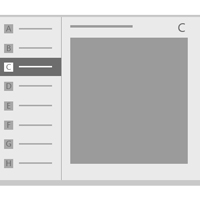

#  Основы проектирования навигации для приложений UWP

\[ Обновлено для приложений UWP в Windows 10. Статьи о Windows 8.x см. в [архиве](http://go.microsoft.com/fwlink/p/?linkid=619132) \]

Навигация в приложениях универсальной платформы Windows (UWP) основана на гибкой модели структур навигации, элементов навигации, и функций системного уровня. Вместе они позволяют реализовать различное интуитивно понятное взаимодействие с пользователем для перемещения между приложениями, страницами и содержимым.

В некоторых случаях все содержимое и функции приложения можно разместить на одной странице, в результате чего пользователю не придется делать ничего, кроме как сдвигать содержимое для его просмотра. Однако в большинстве приложений обычно есть несколько страниц с содержимым и функциями, которые пользователю необходимо изучить и взаимодействовать. Если в приложении более одной страницы, вам необходимо обеспечить правильные средства навигации.

Чтобы сделать приложение удобным и привлекательным для пользователей, в приложениях UWP реализованы различные элементы навигации между страницами, включая указанные ниже (более подробно они описаны далее).

-   **Подходящая структура навигации**

    Создание понятной пользователю структуры критически важно для создания интуитивной навигации.

-   **Совместимые элементы навигации**, поддерживающие выбранную структуру.

    Элементы навигации позволяют пользователю перейти нужному содержимому и помогают ему узнать, в какой части приложения он находится. Однако они занимают пространство, которое могло бы использоваться для содержимого или командных элементов, поэтому важно использовать именно те элементы навигации, которые лучше всего подходят для структуры вашего приложения.

-   **Соответствующая реакция на функции навигации системного уровня (такие как функция возврата)**

    Чтобы обеспечить единообразие и простоту взаимодействия, используйте функции навигации системного уровня предсказуемым образом.

## Создание подходящей структуры навигации

Рассмотрим приложение как коллекцию сгруппированных страниц, каждая из которых содержит уникальное содержимое или функционал. Например, приложение для работы с фотографиями может содержать страницу для съемки фото, страницу для редактирования изображений и страницу для управления библиотекой. То, как вы объедините эти страницы в группы, определяет структуру навигации приложения. Существует два стандартных способа организации группы страниц:

<table>
<colgroup>
<col width="50%" />
<col width="50%" />
</colgroup>
<thead>
<tr class="header">
<th align="left">иерархическая модель организации;</th>
<th align="left">одноранговая модель организации.</th>
</tr>
</thead>
<tbody>
<tr class="odd">
<td align="left">

</td>
<td align="left">

</td>
</tr>
<tr class="even">
<td align="left">
Структура организации страниц подобна дереву. У каждой дочерней страницы имеется только одна родительская, но одна родительская страница может иметь одну или несколько дочерних. Чтобы попасть на дочернюю страницу, сначала необходимо обратиться к родительской.
</td>
<td align="left">
Страницы располагаются рядом друг с другом. Вы можете переходить от одной страницы к другой в любом порядке.
</td>
</tr>
</tbody>
</table>

 

Обычно приложения используют обе модели организации, при этом некоторые группы страниц имеют одноранговую структуру, а другие — иерархическую.

Итак, когда же следует использовать иерархическую модель организации страниц, а когда одноранговую? Чтобы ответить на этот вопрос, мы должны определить число страниц в группе, отношение между ними и то, должны ли они просматриваться в определенном порядке. Обычно структуры с меньшим количеством уровней более понятны и удобны для навигации, но иногда уместно использовать и многоуровневую иерархическую модель.

<table>
<colgroup>
<col width="50%" />
<col width="50%" />
</colgroup>
<tbody>
<tr class="odd">
<td align="left">
Мы рекомендуем использовать иерархическую модель организации в следующих случаях.

<ul>
<li>
Предполагается, что пользователь будет просматривать страницы в определенном порядке. Используйте иерархическую модель организации, чтобы обеспечить этот порядок.
</li>
<li>
Имеются четкие иерархические отношения между одной страницей группы и остальными.
</li>
<li>
Если в группе более 7 страниц.

Если в группе более 7 страниц, пользователю может быть трудно понять, чем они отличаются друг от друга, или определить свое текущее местоположение в группе. Если вам кажется, что затруднений не возникнет, используйте одноранговую модель организации страниц. В противном случае используйте иерархическую структуру, чтобы разбить страницы на две или несколько более мелких групп. (Элемент управления «Главный раздел» поможет вам разбить страницы по категориям.)
</li>
</ul></td>
<td align="left">
Мы рекомендуем использовать одноранговую структуру организации в следующих случаях.

<ul>
<li>Страницы могут просматриваться в любом порядке.</li>
<li>Страницы явно отличаются друг от друга и не имеют очевидных отношений типа «предок — потомок».</li>
<li>
В группе менее 8 страниц.

Если в группе более 7 страниц, пользователю может быть трудно понять, чем они отличаются друг от друга, или определить свое текущее местоположение в группе. Если вам кажется, что затруднений не возникнет, используйте одноранговую модель организации страниц. В противном случае используйте иерархическую структуру, чтобы разбить страницы на две или несколько более мелких групп. (Элемент управления «Главный раздел» поможет вам разбить страницы по категориям.)
</li>
</ul></td>
</tr>
</tbody>
</table>

 

## Использование подходящих элементов навигации

Элементы навигации выполняют две задачи. Они позволяют пользователю перейти к нужному содержимому и помогают ему узнать, в какой части приложения он находится. Однако они занимают пространство, которое могло бы использоваться для содержимого или командных элементов, поэтому важно использовать именно те элементы навигации, которые лучше всего подходят для структуры вашего приложения.

### Одноранговые элементы навигации

Одноранговые элементы навигации обеспечивают переходы между страницами, расположенными на одном и том же уровне одного и того же поддерева.

Для навигации между одноранговыми элементами рекомендуется использовать вкладки или панель навигации.

<table>
<colgroup>
<col width="50%" />
<col width="50%" />
</colgroup>
<thead>
<tr class="header">
<th align="left">Элемент навигации</th>
<th align="left">Описание</th>
</tr>
</thead>
<tbody>
<tr class="odd">
<td align="left">
[Tabs and pivot](../controls-and-patterns/tabs-pivot.md)

</td>
<td align="left">Отображают постоянный список ссылок на страницы одного уровня.

Используйте вкладки или элементы управления «Сводка» в следующих случаях.

<ul>
<li>
Количество страниц составляет от двух до пяти.

(Вы можете использовать вкладки или элементы управления «Сводка», даже если имеется больше пяти страниц, однако в этом случае могут возникнуть затруднения с их размещением на экране.)
</li>
<li>Предполагается, что пользователи будут часто переключаться между страницами.</li>
</ul>

Этот проект приложения для поиска ресторанов использует вкладки и сводки:

</td>
</tr>
<tr class="even">
<td align="left">
[Nav pane](../controls-and-patterns/nav-pane.md)

</td>
<td align="left">Отображает список ссылок на страницы верхнего уровня.

Используйте панель навигации в следующих случаях.

<ul>
<li>Предполагается, что пользователи не будут часто переключаться между страницами.</li>
<li>Вы хотите сохранить пространство за счет более медленной навигации.</li>
<li>Страницы располагаются на верхнем уровне.</li>
</ul>

Этот проект приложения умного дома использует панель навигации:

</td>
</tr>
</tbody>
</table>

 

Если в структуре навигации имеется несколько уровней, мы рекомендуем, чтобы одноранговые элементы ссылались друг на друга только в пределах своего текущего поддерева. Изучите следующую иллюстрацию, на которой показана трехуровневая структура навигации:

-   На уровне 1 элемент одноранговой модели навигации должен предоставлять доступ к страницам A, B, C и D.
-   На уровне 2 элементы одноранговой модели навигации страниц A2 должны ссылаться только на другие страницы A2. Они не должны ссылаться на страницы уровня 2 поддерева C.

### Элементы иерархической модели навигации

Элементы иерархической модели навигации обеспечивают переход от родительской страницы к дочерним.

<table>
<colgroup>
<col width="50%" />
<col width="50%" />
</colgroup>
<thead>
<tr class="header">
<th align="left">Элемент навигации</th>
<th align="left">Описание</th>
</tr>
</thead>
<tbody>
<tr class="odd">
<td align="left">
[Hub](../controls-and-patterns/hub.md)

</td>
<td align="left">Главный раздел — это особый тип элемента управления навигацией, который обеспечивает предварительный просмотр своих дочерних страниц. В отличие от вкладок или панели навигации, он обеспечивает переход к этим дочерним страницам при помощи ссылок и заголовков секций, встроенных в саму страницу.

Используйте элемент управления "Главный раздел" в следующих случаях.

<ul>
<li>Предполагается, что пользователи захотят просматривать часть содержимого дочерних страниц, не переходя к каждой из них.</li>
</ul>

Элементы управления «Главный раздел» поощряют поиск и исследование, благодаря чему они хорошо подходят для приложений для работы с мультимедийными файлами и программ для чтения новостей и совершения покупок.

</td>
</tr>
<tr class="even">
<td align="left">
[Master/details](../controls-and-patterns/master-details.md)

</td>
<td align="left">Отображает список (основное представление) сводок элементов Выбор элемента отображает соответствующую ему страницу элементов в разделе сведений.

Используйте элемент "Основные и подробные данные" в следующих случаях.

<ul>
<li>Предполагается, что пользователи будут часто переключаться между дочерними элементами.</li>
<li>Вы хотите позволить пользователю выполнять операции высокого уровня, например удаление или сортировку, с отдельными элементами или группами элементов, а также хотите позволить им просматривать или обновлять сведения о каждом элементе.</li>
</ul>

Элемент управления «Основные и подробные данные» хорошо подходит для почтовых приложений, списков контактов и ввода данных.

Этот проект приложения для отслеживания акций использует шаблон «основные и подробные данные»:

</td>
</tr>
</tbody>
</table>

 

### Элементы истории навигации

<table>
<colgroup>
<col width="50%" />
<col width="50%" />
</colgroup>
<thead>
<tr class="header">
<th align="left">Элемент навигации</th>
<th align="left">Описание</th>
</tr>
</thead>
<tbody>
<tr class="odd">
<td align="left">Назад</td>
<td align="left">
Позволяет пользователю перемещаться по журналу навигации в приложении и, в зависимости от устройства, из приложения в приложение. Дополнительные сведения см. в разделе [Make your app work well with system-level navigation features](#backnavigation) далее в этой статье.
</td>
</tr>
</tbody>
</table>

 

### Элементы навигации, встроенные в содержимое

<table>
<colgroup>
<col width="50%" />
<col width="50%" />
</colgroup>
<thead>
<tr class="header">
<th align="left">Элемент навигации</th>
<th align="left">Описание</th>
</tr>
</thead>
<tbody>
<tr class="odd">
<td align="left">Гиперссылки и кнопки</td>
<td align="left">
Элементы навигации, встроенные в содержимое, отображаются в содержимом страницы. В отличие от других элементов навигации, которые должны сохранять единообразие в группе страниц или поддереве, элементы управления, встроенные в содержимое, различаются от страницы к странице.
</td>
</tr>
</tbody>
</table>

 

### Группировка элементов навигации

Вы можете группировать элементы навигации, чтобы создавать навигацию, которая подходит для вашего приложения. Например, ваше приложение может использовать панель навигации для доступа к страницам верхнего уровня и вкладки для доступа к страницам второго уровня.

\[Эта статья содержит сведения, относящиеся к приложениям UWP и Windows 10. Для получения инструкций по Windows 8.1 скачайте [рекомендации для Windows 8.1 в формате PDF](https://go.microsoft.com/fwlink/p/?linkid=258743).\]

 

<!--HONumber=Mar16_HO1-->

