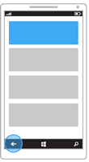
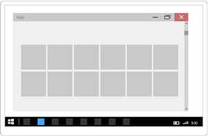
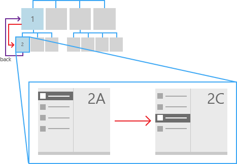

#  <a name="navigation-history-and-backwards-navigation-for-uwp-apps"></a>Журнал навигации и навигация в обратном направлении для приложений UWP

<link rel="stylesheet" href="https://az835927.vo.msecnd.net/sites/uwp/Resources/css/custom.css">

В Интернете отдельные веб-сайты предоставляют собственные системы навигации, такие как содержание, кнопки, меню, простые списки ссылок и т. д. Использование возможностей навигации разными сайтами может существенно различаться. Тем не менее один элемент навигации имеется везде: кнопка «Назад». Большинство веб-браузеров имеют кнопку «Назад», которая работает одинаково, независимо от веб-сайта.

По этим же причинам, из соображений единообразия навигации, универсальная платформа Windows (UWP) предоставляет систему возврата на предыдущий уровень, позволяя пользователю перемещаться по журналу навигации в приложении и, в зависимости от устройства, из приложения в приложение.

Пользовательский интерфейс для системной кнопки возврата оптимизирован для каждого форм-фактора и типа устройства ввода, а функция навигации является глобальной и одинаковой для различных устройств и приложений UWP.

Ниже приведены основные форм-факторы с пользовательским интерфейсом кнопки возврата.


<table>
    <tr>
        <td colspan="2">Устройства</td>
        <td style="vertical-align:top;">Поведение кнопки "Назад"</td>
     </tr>
    <tr>
        <td style="vertical-align:top;">Телефон</td>
        <td style="vertical-align:top;"></td>
        <td style="vertical-align:top;">
        <ul>
<li>Всегда присутствует.</li>
<li>Программная или физическая кнопка в нижней части устройства.</li>
<li>Глобальная обратная навигация в приложении и между приложениями.</li>
</ul>
</td>
     </tr>
     <tr>
        <td style="vertical-align:top;">Планшет</td>
        <td style="vertical-align:top;"></td>
        <td style="vertical-align:top;">
<ul>
<li>Всегда присутствует в режиме планшета. Недоступна в режиме настольного компьютера. Вместо этого можно включить кнопку возврата в заголовке окна. См. пункт [ПК, ноутбук, планшет](#PC).
Для переключением между режимом планшета и настольного компьютера необходимо выбрать **Параметры &gt; Система &gt; Режим планшета**, а затем выбрать параметр **Включать дополнительные возможности сенсорного управления Windows при использовании устройства в качестве планшета**.</li>
<li> Программная кнопка на панели навигации в нижней части устройства.</li>
<li>Глобальная обратная навигация в приложении и между приложениями.</li></ul>        
        </td>
     </tr>
    <tr>
        <td style="vertical-align:top;">ПК, ноутбук, планшет</td>
        <td style="vertical-align:top;"></td>
        <td style="vertical-align:top;">
<ul>
<li>Дополнительная функция в режиме настольного компьютера. Отсутствует в режиме планшета. См. пункт [Планшет](#Tablet). Отключена по умолчанию. Для включения необходимо предоставить согласие.
Для переключением между режимом планшета и настольного компьютера необходимо выбрать **Параметры &gt; Система &gt; Режим планшета**, а затем выбрать параметр **Включать дополнительные возможности сенсорного управления Windows при использовании устройства в качестве планшета**.</li>
<li>Программная кнопка в заголовке окна приложения.</li>
<li>Обратная навигация только внутри приложения. Навигация между приложениями не поддерживается.</li></ul>        
        </td>
     </tr>
    <tr>
        <td style="vertical-align:top;">Surface Hub</td>
        <td style="vertical-align:top;"></td>
        <td style="vertical-align:top;">
<ul>
<li>Необязательно.</li>
<li>Отключена по умолчанию. Для включения необходимо предоставить согласие.</li>
<li>Программная кнопка в заголовке окна приложения.</li>
<li>Обратная навигация только внутри приложения. Навигация между приложениями не поддерживается.</li></ul>        
        </td>
     </tr>     
<table>


Ниже приведено несколько альтернативных способов ввода, для которых не требуется пользовательский интерфейс кнопки возврата, и которые при этом обеспечивают точно такие же функции.


<table>
<tr><td colspan="3">Устройства ввода</td></tr>
<tr><td style="vertical-align:top;">Клавиатура</td><td style="vertical-align:top;"></td><td style="vertical-align:top;">Клавиша Windows + Backspace</td></tr>
<tr><td style="vertical-align:top;">Кортана</td><td style="vertical-align:top;"></td><td style="vertical-align:top;">Скажите: "Привет, Кортана! Назад".</td></tr>
</table>
 

При запуске приложения на телефоне, планшете, ПК или ноутбуке, на которых системная кнопка возврата включена, система сообщает ему о нажатии кнопки "Назад". Пользователь ожидает что кнопка «Назад» позволит ему перейти на предыдущую страницу истории навигации приложения. Именно вы решаете, какие действия навигации добавлять в журнал навигации и как реагировать на нажатие кнопки «Назад».


## <a name="how-to-enable-system-back-navigation-support"></a>Включение поддержки системной обратной навигации


Приложения должны включить обратную навигацию для всех аппаратных и программных системных кнопок «Назад». Для этого зарегистрируйте прослушиватель для события [**BackRequested**](https://msdn.microsoft.com/library/windows/apps/dn893596) и определите соответствующий обработчик.

Здесь мы регистрируем глобальный прослушиватель для события [**BackRequested**](https://msdn.microsoft.com/library/windows/apps/dn893596) в файле кода программной части App.xaml. Вы можете зарегистрировать это событие на каждой странице, которую нужно исключить из обратной навигации, или выполнить код на уровне страницы перед отображением страницы.

> [!div class="tabbedCodeSnippets"]
```csharp
Windows.UI.Core.SystemNavigationManager.GetForCurrentView().BackRequested += 
    App_BackRequested;
```
```cpp
Windows::UI::Core::SystemNavigationManager::GetForCurrentView()->
    BackRequested += ref new Windows::Foundation::EventHandler<
    Windows::UI::Core::BackRequestedEventArgs^>(
        this, &amp;App::App_BackRequested);
```

Вот соответствующий обработчик событий [**BackRequested**](https://msdn.microsoft.com/library/windows/apps/dn893596), который вызывает [**GoBack**](https://msdn.microsoft.com/library/windows/apps/dn996568) в корневом кадре приложения.

Этот обработчик вызывается в глобальном событии возврата. Если стек переходов назад приложения пуст, система может перейти к предыдущему приложению в стеке приложений или на начальный экран. Стека переходов назад в настольном режиме нет, и пользователь остается в приложении, даже если стек переходов назад в приложении исчерпан.

> [!div class="tabbedCodeSnippets"]
```csharp
>private void App_BackRequested(object sender, 
>    Windows.UI.Core.BackRequestedEventArgs e)
>{
>    Frame rootFrame = Window.Current.Content as Frame;
>    if (rootFrame == null)
>        return;
>
>    // Navigate back if possible, and if the event has not 
>    // already been handled .
>    if (rootFrame.CanGoBack &amp;&amp; e.Handled == false)
>    {
>        e.Handled = true;
>        rootFrame.GoBack();
>    }
>}
```
```cpp
>void App::App_BackRequested(
>    Platform::Object^ sender, 
>    Windows::UI::Core::BackRequestedEventArgs^ e)
>{
>    Frame^ rootFrame = dynamic_cast<Frame^>(Window::Current->Content);
>    if (rootFrame == nullptr)
>        return;
>
>    // Navigate back if possible, and if the event has not
>    // already been handled.
>    if (rootFrame->CanGoBack && e->Handled == false)
>    {
>        e->Handled = true;
>        rootFrame->GoBack();
>    }
>}
```

## <a name="how-to-enable-the-title-bar-back-button"></a>Включение кнопки "Назад" в строке заголовка


Устройства, поддерживающие настольный режим (обычно это настольные компьютеры и ноутбуки, а также некоторые планшеты), с включенным параметром (**Параметры &gt; Система &gt; Режим планшета**) не предоставляют глобальную панель навигации с системной кнопкой "Назад".

В настольном режиме каждое приложение работает в окне со строкой заголовка. Вы можете предоставить альтернативную кнопку «Назад», отображаемую в этой строке.

Такая кнопка доступна только в приложениях, работающих на устройствах в настольном режиме, и поддерживает только журнал навигации в приложении, но не журнал навигации между приложениями.

**Важно!** Кнопка возврата в строке заголовка по умолчанию не отображается. Ее необходимо включить.

 

|                                                             |                                                        |
|-------------------------------------------------------------|--------------------------------------------------------|
|  |  |
| Настольный режим, нет обратной навигации.                           | Настольный режим, обратная навигация включена.                 |

 

Переопределите событие [**OnNavigatedTo**](https://msdn.microsoft.com/library/windows/apps/br227508) и установите для [**AppViewBackButtonVisibility**](https://msdn.microsoft.com/library/windows/apps/dn986448) значение [**Visible**](https://msdn.microsoft.com/library/windows/apps/dn986276) для каждой страницы приложения, на которой требуется включить кнопку «Назад» в файле кода программной части.

Для этого примера мы укажем все страницы в стеке переходов назад и включим кнопку возврата, если свойство кадра [**CanGoBack**](https://msdn.microsoft.com/library/windows/apps/br242685) имеет значение **true**.

> [!div class="tabbedCodeSnippets"]
>```csharp
>protected override void OnNavigatedTo(NavigationEventArgs e)
>{
>    Frame rootFrame = Window.Current.Content as Frame;
>
>    string myPages = "";
>    foreach (PageStackEntry page in rootFrame.BackStack)
>    {
>        myPages += page.SourcePageType.ToString() + "\n";
>    }
>    stackCount.Text = myPages;
>
>    if (rootFrame.CanGoBack)
>    {
>        // Show UI in title bar if opted-in and in-app backstack is not empty.
>        SystemNavigationManager.GetForCurrentView().AppViewBackButtonVisibility = 
>            AppViewBackButtonVisibility.Visible;
>    }
>    else
>    {
>        // Remove the UI from the title bar if in-app back stack is empty.
>        SystemNavigationManager.GetForCurrentView().AppViewBackButtonVisibility = 
>            AppViewBackButtonVisibility.Collapsed;
>    }
>}
>```
>```cpp
>void StartPage::OnNavigatedTo(NavigationEventArgs^ e)
>{
>    auto rootFrame = dynamic_cast<Windows::UI::Xaml::Controls::Frame^>(Window::Current->Content);
>
>    Platform::String^ myPages = "";
>
>    if (rootFrame == nullptr)
>        return;
>
>    for each (PageStackEntry^ page in rootFrame->BackStack)
>    {
>        myPages += page->SourcePageType.ToString() + "\n";
>    }
>    stackCount->Text = myPages;
>
>    if (rootFrame->CanGoBack)
>    {
>        // If we have pages in our in-app backstack and have opted in to showing back, do so
>        Windows::UI::Core::SystemNavigationManager::GetForCurrentView()->AppViewBackButtonVisibility =
>            Windows::UI::Core::AppViewBackButtonVisibility::Visible;
>    }
>    else
>    {
>        // Remove the UI from the title bar if there are no pages in our in-app back stack
>        Windows::UI::Core::SystemNavigationManager::GetForCurrentView()->AppViewBackButtonVisibility =
>            Windows::UI::Core::AppViewBackButtonVisibility::Collapsed;
>    }
>}
>```


### <a name="guidelines-for-custom-back-navigation-behavior"></a>Рекомендации по пользовательской настройке обратной навигации

Если вы решили предусмотреть собственную навигацию обратного стека, данная функция должна быть совместима с другими приложениями. Рекомендуем использовать описанные ниже шаблоны действий навигации.

<table>
<thead>
<tr class="header">
<th align="left">Действие навигации</th>
<th align="left">Добавить в историю навигации?</th>
</tr>
</thead>
<tbody>
<tr class="odd">
<td style="vertical-align:top;"><strong>Со страницы на страницу, различные группы одноранговых элементов</strong></td>
<td style="vertical-align:top;"><strong>Да</strong>
<p>На данной иллюстрации пользователь переходит от уровня 1 к уровню 2 приложения, перемещаясь из одной группы одноранговых элементов к другой, поэтому переходы добавляются в журнал навигации.</p>
<p></p>
<p>На следующей иллюстрации пользователь перемещается между двумя группами одноранговых элементов, находящихся на одном и том же уровне, снова переходя от группы к группе, поэтому его перемещение добавляется в журнал навигации.</p>
<p></p></td>
</tr>
<tr class="even">
<td style="vertical-align:top;"><strong>Со страницы на страницу; одна и та же группа одноранговых элементов; элементы навигации не отображаются на экране</strong>
<p>Пользователь переходит от одной страницы к другой в пределах одной и той же группы одноранговых элементов. Постоянно присутствующего элемента навигации (такого как вкладки, элемент управления «Сводка» или закрепленная панель навигации), который обеспечивал бы непосредственное перемещение между двумя страницами, нет.</p></td>
<td style="vertical-align:top;"><strong>Да</strong>
<p>На следующем рисунке пользователь переходит между страницами одной и той же одноранговой группы. Страницы не используют вкладки или закрепленную панель навигации, поэтому перемещения добавляются в журнал навигации.</p>
<p></p></td>
</tr>
<tr class="odd">
<td style="vertical-align:top;"><strong>Со страницы на страницу; одна и та же группа одноранговых элементов; элементы навигации отображаются на экране</strong>
<p>Пользователь переходит от одной страницы к другой в пределах одной и той же группы одноранговых элементов. Обе страницы отображаются в одном и том же элементе навигации. Например, обе страницы используют одни и те же вкладки или элемент управления «Сводка», или же обе страницы отображаются на закрепленной панели навигации.</p></td>
<td style="vertical-align:top;"><strong>Нет</strong>
<p>Когда пользователь нажимает кнопку «Назад», выполните переход к последней странице, на которой он находился перед переходом к текущей одноранговой группе.</p>
<p></p></td>
</tr>
<tr class="even">
<td style="vertical-align:top;"><strong>Используйте промежуточный пользовательский интерфейс</strong>
<p>Приложение отображает всплывающее или дочернее окно, например диалоговое окно, экран-заставку или экранную клавиатуру, или же оно переходит в специальный режим, например режим выбора нескольких элементов.</p></td>
<td style="vertical-align:top;"><strong>Нет</strong>
<p>Если пользователь нажимает кнопку «Назад», скройте промежуточный элемент пользовательского интерфейса (экранную клавиатуру, диалоговое окно и т. д.) и вернитесь к породившей его странице.</p>
<p></p></td>
</tr>
<tr class="odd">
<td style="vertical-align:top;"><strong>Перечисление элементов</strong>
<p>Приложение отображает содержимое элемента экрана, например информацию о выбранном элементе в основном и подробном списке.</p></td>
<td style="vertical-align:top;"><strong>Нет</strong>
<p>Перечисление элементов сходно с навигацией в пределах одноранговой группы. Если пользователь нажимает кнопку «Назад», выполните переход на страницу, предшествующую текущей, на которой имеется перечисление элементов.</p>
</td>
</tr>
</tbody>
</table>


### <a name="resuming"></a>Возобновление

Если пользователь переходит к другому приложению, а затем возвращается к вашему приложению, мы рекомендуем открывать при этом последнюю страницу в журнале навигации.


## <a name="get-the-samples"></a>Получение примеров
*   [Пример кнопки "Назад"](https://github.com/Microsoft/Windows-universal-samples/blob/master/Samples/BackButton)<br/>
    Показана настройка обработчика событий для события кнопки "Назад"и включение кнопки "Назад" в строке заголовка для приложения в развернутом оконном режиме "Рабочий стол".

## <a name="related-articles"></a>Связанные статьи
* [Основы навигации](navigation-basics.md)

 


