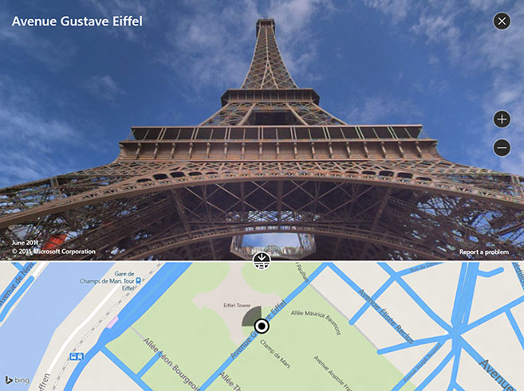

# Руководство по картам

\[ Обновлено для приложений UWP в Windows 10. Статьи для Windows 8.x см. в [архиве](http://go.microsoft.com/fwlink/p/?linkid=619132) \]

Элемент управления картой может отображать карты дорог и гибридный трехмерный вид, маршруты, результаты поиска и сведения о ситуации на дорогах. На карте можно показать положение пользователя, маршруты и интересные места. Карта может также показывать трехмерный гибридный вид, представления Streetside, предоставлять сведения о ситуации на дорогах и показывать сведения о местных организациях и заведениях.

## Выбор правильного элемента управления

Используйте элемент управления картой, если нужно показать карту в приложении, которое позволяет пользователям просматривать сведения, зависящие от приложения или общие географические сведения. Наличие элемента управления картой в вашем приложении означает, что пользователям не нужно выходить из вашего приложения для получения соответствующих сведений.

**Примечание**  Если ничего страшного в выходе пользователей за пределы вашего приложения нет, рассмотрите возможность использования приложения Карт Windows для предоставления этих сведений. Ваше приложение может использовать приложение Карты Windows для отображения определенных карт, маршрутов и результатов поиска. Дополнительные сведения см. в разделе [Запуск приложения Карты Windows](https://msdn.microsoft.com/library/windows/apps/mt228341).

## Примеры

В этом примере показана карта с представлением Streetside:

 

В этом примере показана карта с гибридным трехмерным представлением:

 

В этом примере показано приложение с гибридным трехмерным представлением и представлением Streetside:

## Рекомендации

-   Используйте свободное место на экране (или весь экран) для отображения карты, чтобы пользователям не приходилось постоянно сдвигать и масштабировать карту для просмотра географических сведений.

-   Если карта используется только для представления статического, информационного представления, то более подходящим будет использование карты меньшего размера. Если вы будете использовать статическую карту меньшего размера, задайте ее размеры на основании удобства использования. Используйте небольшой размер, чтобы сэкономить место на экране, но достаточный, чтобы отобразить нужную информацию.

-   Укажите достопримечательности на карте, используя [**map elements**](https://msdn.microsoft.com/library/windows/apps/dn637034). Любые дополнительные сведения могут быть отображены в качестве прозрачного наложения пользовательского интерфейса на карту.

## Связанные разделы

* [Отображение карт с помощью двумерных и трехмерных представлений, а также с помощью представлений Streetside](https://msdn.microsoft.com/library/windows/apps/mt219695)
* [Отображение объектов на карте](https://msdn.microsoft.com/library/windows/apps/mt219696)
* [Центр разработки Карт Bing](https://www.bingmapsportal.com/)
* [Пример карты UWP](http://go.microsoft.com/fwlink/p/?LinkId=619977)
* [Видео //Build 2015: использование карт и расположений в приложениях для Windows на телефонах, планшетах и ПК](https://channel9.msdn.com/Events/Build/2015/2-757)
* [Запуск приложения Карты Windows](https://msdn.microsoft.com/library/windows/apps/mt228341)
 

 

<!--HONumber=May16_HO2-->

