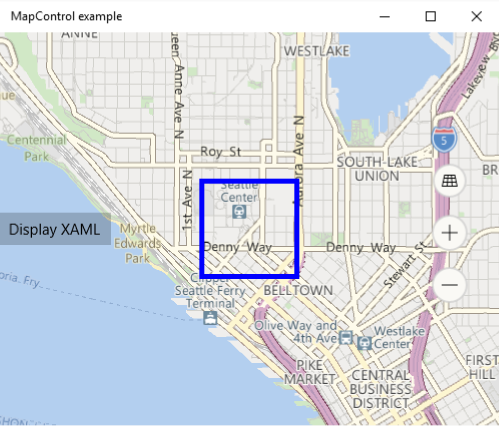

# <a name="display-points-of-interest-on-a-map"></a>Отображение объектов на карте

Добавляйте объекты на карту, используя вешки, изображения, фигуры и элементы пользовательского интерфейса XAML. Объект— это определенная точка на карте, представляющая что-нибудь интересное. Например, это может быть расположение компании, города или друга.

Чтобы получить дополнительные сведения об отображении объектов в приложении, скачайте [пример карты универсальной платформы для Windows (UWP)](http://go.microsoft.com/fwlink/p/?LinkId=619977) из [репозитория Windows-universal-samples](http://go.microsoft.com/fwlink/p/?LinkId=619979) на веб-сайте GitHub.

Вы можете отображать вешки, изображения и фигуры на карте, добавляя объекты [**MapIcon**](https://msdn.microsoft.com/library/windows/apps/dn637077), [**MapBillboard**](https://docs.microsoft.com/uwp/api/windows.ui.xaml.controls.maps.mapbillboard), [**MapPolygon**](https://msdn.microsoft.com/library/windows/apps/dn637103) и [**MapPolyline**](https://msdn.microsoft.com/library/windows/apps/dn637114) в коллекцию **MapElements** объекта [**MapElementsLayer**](https://docs.microsoft.com/uwp/api/windows.ui.xaml.controls.maps.mapelementslayer). Затем добавьте этот объект слоя в коллекцию **Layers** элемента управления картой.

>[!NOTE]
> В предыдущих выпусках в этом руководстве рассказывалось, как добавить элементы на карте в коллекцию [**MapElements**](https://docs.microsoft.com/uwp/api/windows.ui.xaml.controls.maps.mapcontrol.MapElements). Хотя по-прежнему можно использовать этот подход, вы упустите некоторые преимущества новой модели слоев карты. Дополнительные сведения см. в разделе [Работа со слоями](#layers) данного руководства.

Можно также отобразить элементы пользовательского интерфейса XAML, например [**Button**](https://msdn.microsoft.com/library/windows/apps/br209265), [**HyperlinkButton**](https://msdn.microsoft.com/library/windows/apps/br242739) или [**TextBlock**](https://msdn.microsoft.com/library/windows/apps/br209652), на карте, добавляя их в [**MapItemsControl**](https://msdn.microsoft.com/library/windows/apps/dn637094) или качестве [**Children**](https://msdn.microsoft.com/library/windows/apps/dn637008) (дочерних элементов) объекта [**MapControl**](https://msdn.microsoft.com/library/windows/apps/dn637004).

Если необходимо разместить на карте большое количество элементов, можно [наложить на нее динамически перераспределяемые изображения](overlay-tiled-images.md). Сведения о том, как отобразить дороги на карте, см. в статье [Отображение маршрутов и направлений](routes-and-directions.md).

## <a name="add-a-pushpin"></a>Добавление вешки

Чтобы показать изображение, например вешку, на карте и при желании добавить к нему текст, используйте класс [**MapIcon**](https://msdn.microsoft.com/library/windows/apps/dn637077). Можно принять изображение по умолчанию или указать пользовательское изображение с помощью свойства [**Image**](https://msdn.microsoft.com/library/windows/apps/dn637078). На рисунке ниже показано изображение по умолчанию для объекта **MapIcon**, у которого не задано значение для свойства [**Title**](https://msdn.microsoft.com/library/windows/apps/dn637088), с коротким названием, длинным названием и очень длинным названием.


В примере ниже показано, как отобразить карту Сиэтла и добавить объект [**MapIcon**](https://msdn.microsoft.com/library/windows/apps/dn637077) с изображением по умолчанию и необязательным заголовком, чтобы указать расположение башни Спейс-Нидл. Кроме того, в примере показано, как выполнить центровку карты по отношению к значку и увеличить ее масштаб. Общие сведения об использовании элемента управления картой см. в статье [Отображение карт с помощью двумерных и трехмерных представлений, а также представлений Streetside](display-maps.md).

```csharp
public void AddSpaceNeedleIcon()
{
    var MyLandmarks = new List<MapElement>();

    BasicGeoposition snPosition = new BasicGeoposition { Latitude = 47.620, Longitude = -122.349 };
    Geopoint snPoint = new Geopoint(snPosition);

    var spaceNeedleIcon = new MapIcon
    {
        Location = snPoint,
        NormalizedAnchorPoint = new Point(0.5, 1.0),
        ZIndex = 0,
        Title = "Space Needle"
    };

    MyLandmarks.Add(spaceNeedleIcon);

    var LandmarksLayer = new MapElementsLayer
    {
        ZIndex = 1,
        MapElements = MyLandmarks
    };

    myMap.Layers.Add(LandmarksLayer);

    myMap.Center = snPoint;
    myMap.ZoomLevel = 14;

}
```

В этом примере отображаются указанные ниже объекты на карте (изображение по умолчанию находится в центре).


Указанная ниже строка кода отображает объект [**MapIcon**](https://msdn.microsoft.com/library/windows/apps/dn637077) с пользовательским изображением, сохраненным в папке Assets проекта. Свойство [**Image**](https://msdn.microsoft.com/library/windows/apps/dn637078) объекта **MapIcon** принимает значение с типом [**RandomAccessStreamReference**](https://msdn.microsoft.com/library/windows/apps/hh701813). Этому типу требуется оператор **using** для пространства имен [**Windows.Storage.Streams**](https://msdn.microsoft.com/library/windows/apps/br241791).

>[!NOTE]
>Чтобы обеспечить максимальную производительность при использовании одного и того же изображения для нескольких значков карт, объявите объект [**RandomAccessStreamReference**](https://msdn.microsoft.com/library/windows/apps/hh701813) на уровне страницы или приложения.

```csharp
    MapIcon1.Image =
        RandomAccessStreamReference.CreateFromUri(new Uri("ms-appx:///Assets/customicon.png"));
```

При работе с классом [**MapIcon**](https://msdn.microsoft.com/library/windows/apps/dn637077) учитывайте указанные ниже соображения.

-   Свойство [**Image**](https://msdn.microsoft.com/library/windows/apps/dn637078) поддерживает изображения размером не более 2048×2048 пикселей.
-   По умолчанию отображение изображения значка карты не гарантируется. Этот элемент может быть скрыт, если он заслоняет другие элементы или метки на карте. Чтобы он оставался видимым, задайте для свойства [**CollisionBehaviorDesired**](https://msdn.microsoft.com/library/windows/apps/dn974327) значение [**MapElementCollisionBehavior.RemainVisible**](https://msdn.microsoft.com/library/windows/apps/dn974314).
-   Отображение необязательного свойства [**Title**](https://msdn.microsoft.com/library/windows/apps/dn637088) объекта [**MapIcon**](https://msdn.microsoft.com/library/windows/apps/dn637077) не гарантируется. Если текст не отображается, уменьшите масштаб, уменьшив значение свойства [**ZoomLevel**](https://msdn.microsoft.com/library/windows/apps/dn637068) объекта [**MapControl**](https://msdn.microsoft.com/library/windows/apps/dn637004).
-   При показе изображения [**MapIcon**](https://msdn.microsoft.com/library/windows/apps/dn637077), которое указывает определенное местоположение на карте, например вешки или стрелки, попробуйте присвоить значению свойства [**NormalizedAnchorPoint**](https://msdn.microsoft.com/library/windows/apps/dn637082) приблизительное местоположение указателя на изображении. Если для свойства **NormalizedAnchorPoint** оставить значение по умолчанию (0,0), которое соответствует верхнему левому углу изображения, то в результате изменений свойства карты [**ZoomLevel**](https://msdn.microsoft.com/library/windows/apps/dn637068) изображение может указывать на другое местоположение.
-   Если [Altitude](https://docs.microsoft.com/uwp/api/windows.devices.geolocation.basicgeoposition) и [AltitudeReferenceSystem](https://docs.microsoft.com/uwp/api/windows.devices.geolocation.geopoint.AltitudeReferenceSystem) не заданы явным образом, элемент [**MapIcon**](https://msdn.microsoft.com/library/windows/apps/dn637077) будет размещен на поверхности.

## <a name="add-a-3d-pushpin"></a>Добавление трехмерной вешки

Трехмерные объекты можно добавлять на карту. Используйте класс [MapModel3D](https://docs.microsoft.com/uwp/api/windows.ui.xaml.controls.maps.mapmodel3d) для импорта трехмерного объекта из файла в [трехмерном производственном формате (3MF)](http://3mf.io/specification/).

На этом изображении трехмерные чашки кофе используются для обозначения расположения кофеен в районе.


Следующий код добавляет чашку кофе на карту путем импорта файла 3MF. Чтобы не усложнять, этот код добавляет изображение в центр карты, но ваш код, вероятно, будет добавлять изображение в определенное расположение.

```csharp
public async void Add3DMapModel()
{
    var mugStreamReference = RandomAccessStreamReference.CreateFromUri
        (new Uri("ms-appx:///Assets/mug.3mf"));

    var myModel = await MapModel3D.CreateFrom3MFAsync(mugStreamReference,
        MapModel3DShadingOption.Smooth);

    myMap.Layers.Add(new MapElementsLayer
    {
       ZIndex = 1,
       MapElements = new List<MapElement>
       {
          new MapElement3D
          {
              Location = myMap.Center,
              Model = myModel,
          },
       },
    });
}
```

## <a name="add-an-image"></a>Добавление изображения

Показывайте большие изображения, связанные с расположениями на карте, например фотографии ресторана или ориентира. Когда пользователи отдаляют карту, изображение пропорционально уменьшается, чтобы пользователь мог видеть расширенный участок карты. Это немного отличается от элемента [**MapIcon**](https://msdn.microsoft.com/library/windows/apps/dn637077), который помечает определенное расположение, обычно имеет небольшой размер и сохраняет свой размер, когда пользователь приближает и отдаляет карту.


В следующем коде показан элемент [**MapBillboard**](https://docs.microsoft.com/uwp/api/windows.ui.xaml.controls.maps.mapbillboard), представленный на рисунке выше.

```csharp
public void AddLandmarkPhoto()
{
    // Create MapBillboard.

    RandomAccessStreamReference mapBillboardStreamReference =
        RandomAccessStreamReference.CreateFromUri(new Uri("ms-appx:///Assets/billboard.jpg"));

    var mapBillboard = new MapBillboard(myMap.ActualCamera)
    {
        Location = myMap.Center,
        NormalizedAnchorPoint = new Point(0.5, 1.0),
        Image = mapBillboardStreamReference
    };

    // Add MapBillboard to a layer on the map control.

    var MyLandmarkPhotos = new List<MapElement>();

    MyLandmarkPhotos.Add(mapBillboard);

    var LandmarksPhotoLayer = new MapElementsLayer
    {
        ZIndex = 1,
        MapElements = MyLandmarkPhotos
    };

    myMap.Layers.Add(LandmarksPhotoLayer);
}
```

В этом коде есть три фрагмента, которые заслуживают более тщательного изучения: изображение, опорная камера и свойство [**NormalizedAnchorPoint**](https://docs.microsoft.com/uwp/api/windows.ui.xaml.controls.maps.mapbillboard.NormalizedAnchorPoint).

### <a name="image"></a>Изображение

В этом примере показано пользовательское изображение, сохраненное в папку проекта **Assets**. Свойство [**Image**](https://docs.microsoft.com/uwp/api/windows.ui.xaml.controls.maps.mapbillboard.Image) объекта [**MapBillboard**](https://docs.microsoft.com/uwp/api/windows.ui.xaml.controls.maps.mapbillboard) принимает значение с типом [**RandomAccessStreamReference**](https://msdn.microsoft.com/library/windows/apps/hh701813). Этому типу требуется оператор **using** для пространства имен [**Windows.Storage.Streams**](https://msdn.microsoft.com/library/windows/apps/br241791).

>[!NOTE]
>Чтобы обеспечить максимальную производительность при использовании одного и того же изображения для нескольких значков карт, объявите объект [**RandomAccessStreamReference**](https://msdn.microsoft.com/library/windows/apps/hh701813) на уровне страницы или приложения.

### <a name="reference-camera"></a>Опорная камера

 Так как изображение [**MapBillboard**](https://docs.microsoft.com/uwp/api/windows.ui.xaml.controls.maps.mapbillboard) масштабируется при изменении свойства [**ZoomLevel**](https://docs.microsoft.com/uwp/api/windows.ui.xaml.controls.maps.mapcontrol.ZoomLevel) карты, важно определить, при каком положении регулятора [**ZoomLevel**](https://docs.microsoft.com/uwp/api/windows.ui.xaml.controls.maps.mapcontrol.ZoomLevel) изображение отображается в исходном масштабе. Это положение определяется в опорной камере [**MapBillboard**](https://docs.microsoft.com/uwp/api/windows.ui.xaml.controls.maps.mapbillboard), и для его настройки необходимо передать объект [**MapCamera**](https://docs.microsoft.com/uwp/api/windows.ui.xaml.controls.maps.mapcamera) в конструктор [**MapBillboard**](https://docs.microsoft.com/uwp/api/windows.ui.xaml.controls.maps.mapbillboard).

 Вы можете определить требуемое положение в [**Geopoint**](https://docs.microsoft.com/uwp/api/windows.devices.geolocation.geopoint) и затем использовать эту точку [**Geopoint**](https://docs.microsoft.com/uwp/api/windows.devices.geolocation.geopoint) для создания объекта [**MapCamera**](https://docs.microsoft.com/uwp/api/windows.ui.xaml.controls.maps.mapcamera).  Однако в этом примере мы просто используем объект [**MapCamera**](https://docs.microsoft.com/uwp/api/windows.ui.xaml.controls.maps.mapcamera), возвращаемый свойством [**ActualCamera**](https://docs.microsoft.com/uwp/api/windows.ui.xaml.controls.maps.mapcontrol.ActualCamera) элемента управления картой. Это внутренняя камера карты. Текущее положение этой камеры становится положением опорной камеры, то есть тем положением, в котором изображение [**MapBillboard**](https://docs.microsoft.com/uwp/api/windows.ui.xaml.controls.maps.mapbillboard) отображается в исходном масштабе.

 Если ваше приложение предоставляет пользователям возможность уменьшить масштаб на карте, размер изображения уменьшается, поскольку внутренняя камера карты поднимается над землей, а изображение в его исходном размере остается неподвижным с привязкой к опорной камере.

### <a name="normalizedanchorpoint"></a>NormalizedAnchorPoint

[**NormalizedAnchorPoint**](https://docs.microsoft.com/uwp/api/windows.ui.xaml.controls.maps.mapbillboard.NormalizedAnchorPoint) является точкой изображения, привязанной к свойству [**Location**](https://docs.microsoft.com/uwp/api/windows.ui.xaml.controls.maps.mapbillboard.Location) объекта [**MapBillboard**](https://docs.microsoft.com/uwp/api/windows.ui.xaml.controls.maps.mapbillboard). Точка с координатами 0,5, 1 — центр нижнего края изображения. Поскольку мы присвоили свойству [**Location**](https://docs.microsoft.com/uwp/api/windows.ui.xaml.controls.maps.mapbillboard.Location) объекта [**MapBillboard**](https://docs.microsoft.com/uwp/api/windows.ui.xaml.controls.maps.mapbillboard) значение, соответствующее центру элемента управления картой, нижний край изображения будет привязан к центру элемента управления картой. Если изображение должно отображаться по центру прямо над точкой, задайте для [**NormalizedAnchorPoint**](https://docs.microsoft.com/uwp/api/windows.ui.xaml.controls.maps.mapbillboard.NormalizedAnchorPoint) значение 0.5,0.5.  

## <a name="add-a-shape"></a>Добавление фигуры

Для отображения многоточечной фигуры на карте используйте класс [**MapPolygon**](https://msdn.microsoft.com/library/windows/apps/dn637103). В показанном ниже фрагменте из [примера карты UWP](http://go.microsoft.com/fwlink/p/?LinkId=619977) показано, как отобразить красное поле с синей рамкой на карте.

```csharp
public void HighlightArea()
{
    // Create MapPolygon.

    double centerLatitude = myMap.Center.Position.Latitude;
    double centerLongitude = myMap.Center.Position.Longitude;

    var mapPolygon = new MapPolygon
    {
        Path = new Geopath(new List<BasicGeoposition> {
                    new BasicGeoposition() {Latitude=centerLatitude+0.0005, Longitude=centerLongitude-0.001 },
                    new BasicGeoposition() {Latitude=centerLatitude-0.0005, Longitude=centerLongitude-0.001 },
                    new BasicGeoposition() {Latitude=centerLatitude-0.0005, Longitude=centerLongitude+0.001 },
                    new BasicGeoposition() {Latitude=centerLatitude+0.0005, Longitude=centerLongitude+0.001 },
                }),
        ZIndex = 1,
        FillColor = Colors.Red,
        StrokeColor = Colors.Blue,
        StrokeThickness = 3,
        StrokeDashed = false,
    };

    // Add MapPolygon to a layer on the map control.
    var MyHighlights = new List<MapElement>();

    MyHighlights.Add(mapPolygon);

    var HighlightsLayer = new MapElementsLayer
    {
        ZIndex = 1,
        MapElements = MyHighlights
    };

    myMap.Layers.Add(HighlightsLayer);
}
```

## <a name="add-a-line"></a>Добавление линии


Для отображения линии на карте используйте класс [**MapPolyline**](https://msdn.microsoft.com/library/windows/apps/dn637114). В показанном ниже фрагменте из [примера карты UWP](http://go.microsoft.com/fwlink/p/?LinkId=619977) показано, как отобразить пунктирную линию на карте.

```csharp
public void DrawLineOnMap()
{
    // Create Polyline.

    double centerLatitude = myMap.Center.Position.Latitude;
    double centerLongitude = myMap.Center.Position.Longitude;
    var mapPolyline = new MapPolyline
    {
        Path = new Geopath(new List<BasicGeoposition> {
                    new BasicGeoposition() {Latitude=centerLatitude-0.0005, Longitude=centerLongitude-0.001 },
                    new BasicGeoposition() {Latitude=centerLatitude+0.0005, Longitude=centerLongitude+0.001 },
                }),
        StrokeColor = Colors.Black,
        StrokeThickness = 3,
        StrokeDashed = true,
    };

   // Add Polyline to a layer on the map control.

   var MyLines = new List<MapElement>();

   MyLines.Add(mapPolyline);

   var LinesLayer = new MapElementsLayer
   {
       ZIndex = 1,
       MapElements = MyLines
   };

   myMap.Layers.Add(LinesLayer);

}
```

## <a name="add-xaml"></a>Добавление XAML

Для отображения настраиваемых элементов пользовательского интерфейса на карте используйте XAML. Чтобы расположить XAML на карте, укажите расположение и нормализованную точку привязки XAML.

-   Чтобы задать местоположение на карте, где необходимо разместить XAML, вызовите метод [**SetLocation**](https://msdn.microsoft.com/library/windows/desktop/ms704369).
-   Чтобы настроить относительное местоположение в XAML, соответствующее указанному местоположению, вызовите метод [**SetNormalizedAnchorPoint**](https://msdn.microsoft.com/library/windows/apps/dn637050).

В примере ниже показано, как отобразить карту Сиэтла и добавить элемент управления XAML [**Border**](https://msdn.microsoft.com/library/windows/apps/br209250), чтобы указать местоположение башни Спейс-Нидл. Кроме того, в примере показано, как выполнить центровку карты по отношению к области и увеличить ее масштаб. Общие сведения об использовании элемента управления картой см. в статье [Отображение карт с помощью двумерных и трехмерных представлений, а также представлений Streetside](display-maps.md).

```csharp
private void displayXAMLButton_Click(object sender, RoutedEventArgs e)
{
   // Specify a known location.
   BasicGeoposition snPosition = new BasicGeoposition { Latitude = 47.620, Longitude = -122.349 };
   Geopoint snPoint = new Geopoint(snPosition);

   // Create a XAML border.
   Border border = new Border
   {
      Height = 100,
      Width = 100,
      BorderBrush = new SolidColorBrush(Windows.UI.Colors.Blue),
      BorderThickness = new Thickness(5),
   };

   // Center the map over the POI.
   MapControl1.Center = snPoint;
   MapControl1.ZoomLevel = 14;

   // Add XAML to the map.
   MapControl1.Children.Add(border);
   MapControl.SetLocation(border, snPoint);
   MapControl.SetNormalizedAnchorPoint(border, new Point(0.5, 0.5));
}
```

В этом примере показано, как отобразить синюю рамку на карте.



В примерах ниже показано, как добавить элементы пользовательского интерфейса XAML непосредственно в разметку XAML страницы, используя привязку данных. Как и другие элементы XAML, отображающие содержимое, [**Children**](https://msdn.microsoft.com/library/windows/apps/dn637008)— это свойство содержимого по умолчанию объекта [**MapControl**](https://msdn.microsoft.com/library/windows/apps/dn637004), и его не нужно явно задавать в разметке XAML.

В этом примере показано, как отобразить два элемента управления XAML в качестве неявных потомков класса [**MapControl**](https://msdn.microsoft.com/library/windows/apps/dn637004). Эти элементы управления отображаются на карте с привязкой расположений к данным.

```xml
<maps:MapControl>
    <TextBox Text="Seattle" maps:MapControl.Location="{x:Bind SeattleLocation}"/>
    <TextBox Text="Bellevue" maps:MapControl.Location="{x:Bind BellevueLocation}"/>
</maps:MapControl>
```

Задайте эти расположения с помощью свойств в файле кода программной части.

```csharp
public Geopoint SeattleLocation { get; set; }
public Geopoint BellevueLocation { get; set; }
```

В этом примере показано, как отобразить два элемента управления XAML, содержащиеся в [**MapItemsControl**](https://msdn.microsoft.com/library/windows/apps/dn637094). Эти элементы управления отображаются на карте в расположениях, обусловленных данными.

```xml
<maps:MapControl>
  <maps:MapItemsControl>
    <TextBox Text="Seattle" maps:MapControl.Location="{x:Bind SeattleLocation}"/>
    <TextBox Text="Bellevue" maps:MapControl.Location="{x:Bind BellevueLocation}"/>
  </maps:MapItemsControl>
</maps:MapControl>
```

В этом примере показано, как отобразить коллекцию элементов XAML, связанных с классом [**MapItemsControl**](https://msdn.microsoft.com/library/windows/apps/dn637094).

```xml
<maps:MapControl x:Name="MapControl" MapTapped="MapTapped" MapDoubleTapped="MapTapped" MapHolding="MapTapped">
  <maps:MapItemsControl ItemsSource="{x:Bind LandmarkOverlays}">
      <maps:MapItemsControl.ItemTemplate>
          <DataTemplate>
              <StackPanel Background="Black" Tapped ="Overlay_Tapped">
                  <TextBlock maps:MapControl.Location="{Binding Location}" Text="{Binding Title}"
                    maps:MapControl.NormalizedAnchorPoint="0.5,0.5" FontSize="20" Margin="5"/>
              </StackPanel>
          </DataTemplate>
      </maps:MapItemsControl.ItemTemplate>
  </maps:MapItemsControl>
</maps:MapControl>
```

Свойство ``ItemsSource`` в приведенном выше примере привязано к свойство типа [IList](https://docs.microsoft.com/dotnet/api/system.collections.ilist?view=netframework-4.70) в файле кода программной части.

```csharp
public sealed partial class Scenario1 : Page
{
    public IList LandmarkOverlays { get; set; }

    public MyClassConstructor()
    {
         SetLandMarkLocations();
         this.InitializeComponent();   
    }

    private void SetLandMarkLocations()
    {
        LandmarkOverlays = new List<MapElement>();

        var pikePlaceIcon = new MapIcon
        {
            Location = new Geopoint(new BasicGeoposition
            { Latitude = 47.610, Longitude = -122.342 }),
            Title = "Pike Place Market"
        };

        LandmarkOverlays.Add(pikePlaceIcon);

        var SeattleSpaceNeedleIcon = new MapIcon
        {
            Location = new Geopoint(new BasicGeoposition
            { Latitude = 47.6205, Longitude = -122.3493 }),
            Title = "Seattle Space Needle"
        };

        LandmarkOverlays.Add(SeattleSpaceNeedleIcon);
    }
}
```

<a id="layers" />

## <a name="working-with-layers"></a>Работа со слоями

В примерах в этом руководстве элементы добавляются в коллекцию [MapElementLayers](https://docs.microsoft.com/uwp/api/windows.ui.xaml.controls.maps.mapelementslayer). Затем рассказывается, как добавить эту коллекцию в свойство **Layers** элемента управления картой. В предыдущих выпусках в этом руководстве рассказывалось, как добавить элементы на карте в коллекцию [**MapElements**](https://docs.microsoft.com/uwp/api/windows.ui.xaml.controls.maps.mapcontrol.MapElements):

```csharp
var pikePlaceIcon = new MapIcon
{
    Location = new Geopoint(new BasicGeoposition
    { Latitude = 47.610, Longitude = -122.342 }),
    NormalizedAnchorPoint = new Point(0.5, 1.0),
    ZIndex = 0,
    Title = "Pike Place Market"
};

myMap.MapElements.Add(pikePlaceIcon);
```

Хотя по-прежнему можно использовать этот подход, вы упустите некоторые преимущества новой модели слоев карты. Группируя элементы в слои, можно управлять каждым слоем независимо друг от друга. Например: каждый слой имеет собственный набор событий, поэтому можно реагировать на событие в определенном слое и выполнить действие для этого события.

Также можно привязать XAML непосредственно к [MapLayer](https://docs.microsoft.com/uwp/api/windows.ui.xaml.controls.maps.maplayer). Это нельзя сделать с помощью коллекции [MapElements](https://docs.microsoft.com/uwp/api/windows.ui.xaml.controls.maps.mapcontrol.MapElements).

Один из способов, как это можно сделать, — использовать класс модели представления, код программной части XAML-страницы, а также XAML-страницу.

### <a name="view-model-class"></a>Класс модели представления

```csharp
public class LandmarksViewModel
{
    public ObservableCollection<MapLayer> LandmarkLayer
        { get; } = new ObservableCollection<MapLayer>();

    public LandmarksViewModel()
    {
        var MyElements = new List<MapElement>();

        var pikePlaceIcon = new MapIcon
        {
            Location = new Geopoint(new BasicGeoposition
            { Latitude = 47.610, Longitude = -122.342 }),
            Title = "Pike Place Market"
        };

        MyElements.Add(pikePlaceIcon);

        var LandmarksLayer = new MapElementsLayer
        {
            ZIndex = 1,
            MapElements = MyElements
        };

        LandmarkLayer.Add(LandmarksLayer);         
    }

```

### <a name="code-behind-a-xaml-page"></a>Код программной части XAML-страницы

Подключите класс модели представления к коду программной части страницы.

```csharp
public LandmarksViewModel ViewModel { get; set; }

public myMapPage()
{
    this.InitializeComponent();
    this.ViewModel = new LandmarksViewModel();
}
```

### <a name="xaml-page"></a>XAML-страница

На XAML-странице выполните привязку к свойству в классе модели представления, которое возвращает слой.

```XML
<maps:MapControl
    x:Name="myMap" TransitFeaturesVisible="False" Loaded="MyMap_Loaded" Grid.Row="2"
    MapServiceToken="Your token" Layers="{x:Bind ViewModel.LandmarkLayer}"/>
```

## <a name="related-topics"></a>Статьи по теме

* [Центр разработки Карт Bing](https://www.bingmapsportal.com/)
* [Пример карты UWP](http://go.microsoft.com/fwlink/p/?LinkId=619977)
* [Руководство по разработке карт](https://msdn.microsoft.com/library/windows/apps/dn596102)
* [Видео c конференции Build 2015: использование карт и местоположений в приложениях для Windows на телефонах, планшетах и ПК](https://channel9.msdn.com/Events/Build/2015/2-757)
* [Пример приложения UWP для работы с картами](http://go.microsoft.com/fwlink/p/?LinkId=619982)
* [**MapIcon**](https://msdn.microsoft.com/library/windows/apps/dn637077)
* [**MapPolygon**](https://msdn.microsoft.com/library/windows/apps/dn637103)
* [**MapPolyline**](https://msdn.microsoft.com/library/windows/apps/dn637114)
