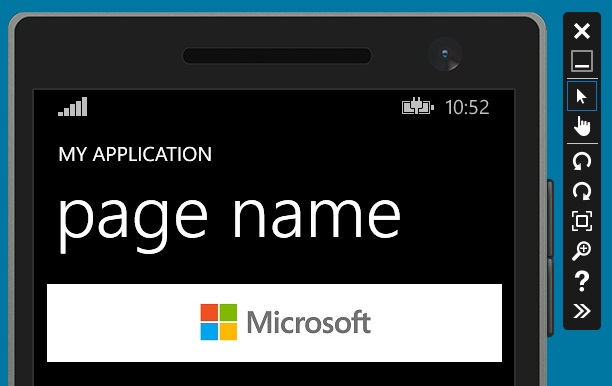

# <a name="adcontrol-in-windows-phone-silverlight"></a>AdControl в Windows Phone Silverlight

В этом пошаговом руководстве рассказывается, как использовать класс [AdControl](https://msdn.microsoft.com/library/windows/apps/hh524191.aspx) для показа баннерной рекламы в приложении Silverlight для Windows Phone 8.1 и Windows Phone 8.0.

<span id="silverlight_support"/>
## <a name="advertising-support-for-windows-phone-8x-silverlight-projects"></a>Поддержка рекламы для проектов Windows Phone 8.x Silverlight

Некоторые сценарии разработчиков больше не поддерживаются в проектах Windows Phone 8.x Silverlight. Дополнительные сведения см. в следующей таблице.

|  Версия платформы  |  Существующие проекты    |   Новые проекты  |
|-----------------|----------------|--------------|
| Windows Phone 8.0 Silverlight     |  Если у вас есть существующий проект Windows Phone 8.0 Silverlight, в котором уже используются **AdControl** или **AdMediatorControl** из предыдущего выпуска пакета SDK Universal Ad Client или SDK Microsoft Advertising, и это приложение уже опубликовано в Магазине Windows, вы можете изменить и пересобрать проект, а также выполнить отладку или тестирование изменений на устройстве. Отладка или тестирование проекта в эмуляторе не поддерживается.  |  Не поддерживается.  |
| Windows Phone 8.1 Silverlight    |  Если у вас есть существующий проект Windows Phone 8.1 Silverlight, в котором уже используются **AdControl** или **AdMediatorControl** из предыдущего пакета SDK, вы можете изменить и пересобрать его. Но для отладки или тестирования приложения необходимо запустить его в эмуляторе и использовать [значения тестового режима](test-mode-values.md) для идентификаторов приложения и рекламных блоков. Отладка или тестирование приложения на устройстве не поддерживается.  |   Вы можете добавить **AdControl** или **AdMediatorControl** в новый проект Windows Phone 8.1 Silverlight. Но для отладки или тестирования приложения необходимо запустить его в эмуляторе и использовать [значения тестового режима](test-mode-values.md) для идентификаторов приложения и рекламных блоков. Отладка или тестирование приложения на устройстве не поддерживается. |

## <a name="add-the-advertising-assemblies-to-your-project"></a>Добавление рекламных сборок в проект

Чтобы начать работу, скачайте и установите пакет NuGet, содержащий сборки Microsoft Advertising для Windows Phone Silverlight.

1.  Откройте проект в Visual Studio.

2.  Щелкните **Средства**, наведите курсор на пункт **Диспетчер пакетов NuGet** и щелкните **Консоль диспетчера пакетов**.

3.  В окне **консоли диспетчера пакетов** введите одну из этих команд.

  * Если проект предназначен для Windows Phone 8.0, введите следующую команду.

      ```syntax
      Install-Package Microsoft.Advertising.WindowsPhone.SL80 -Version 6.2.40501.1
      ```

  * Если проект предназначен для Windows Phone 8.1, введите следующую команду.

      ```syntax
      Install-Package Microsoft.Advertising.WindowsPhone.SL81 -Version 8.1.50112
      ```

    На этом этапе все необходимые сборки пакета Microsoft Advertising для Silverlight загружаются в ваш локальный проект с помощью пакетов NuGet, и ссылки на эти сборки автоматически добавляются в ваш проект.

## <a name="code-your-app"></a>Составление кода приложения


1.  Добавьте следующие возможности в узел **Возможности** в файле WMAppManifest.xml.

  ``` syntax
  <Capability Name="ID_CAP_IDENTITY_USER"/>
  <Capability Name="ID_CAP_MEDIALIB_PHOTO"/>
  <Capability Name="ID_CAP_PHONEDIALER"/>
  ```

  Для этого примера узел **Возможности** ** выглядит следующим образом.

  ``` syntax
  <Capabilities>
      <Capability Name="ID_CAP_NETWORKING"/>
      <Capability Name="ID_CAP_MEDIALIB_AUDIO"/>
      <Capability Name="ID_CAP_MEDIALIB_PLAYBACK"/>
      <Capability Name="ID_CAP_SENSORS"/>
      <Capability Name="ID_CAP_WEBBROWSERCOMPONENT"/>
      <Capability Name="ID_CAP_IDENTITY_USER"/>
      <Capability Name="ID_CAP_MEDIALIB_PHOTO"/>
      <Capability Name="ID_CAP_PHONEDIALER"/>
  </Capabilities>
  ```

2.  (Необязательно) Сохраните проект. Нажмите значок **Сохранить все** или выберите в меню **Файл** пункт **Сохранить все**.

3.  Добавьте возможность **Интернет (клиент и сервер)** в файл Package.appxmanifest вашего проекта. В **Обозревателе решений** дважды щелкните по **Package.appxmanifest**.

    

    В **Редакторе** нажмите вкладку **Возможности**. Установите флажок **Интернет (клиент и сервер)**.

4.  (Необязательно) Сохраните проект. Нажмите значок **Сохранить все** или выберите в меню **Файл** пункт **Сохранить все**.

5.  Внесите исправления в разметку Silverlight в файле MainPage.xaml для включения пространства имен **Microsoft.Advertising.Mobile.UI**.

  ``` xml
  xmlns:UI="clr-namespace:Microsoft.Advertising.Mobile.UI;assembly=Microsoft.Advertising.Mobile.UI"
  ```

  В заголовке страницы будет расположен следующий код.

  ``` xml
  xmlns:mc="http://schemas.openxmlformats.org/markup-compatibility/2006"
  xmlns:UI="clr-namespace:Microsoft.Advertising.Mobile.UI;assembly=Microsoft.Advertising.Mobile.UI"
  x:Class="PhoneApp1.MainPage"
  ```

6.  В раздел под тегом **Grid** добавьте следующий код для **AdControl**. Задайте свойствам **ApplicationId** и **AdUnitId** тестовые значения, приведенные в разделе [Значения тестового режима](test-mode-values.md) и настройте свойства **Height** и **Width**, чтобы они соответствовали одному из [поддерживаемых размеров объявлений для баннерной рекламы](supported-ad-sizes-for-banner-ads.md).

  > **Примечание.**&nbsp;&nbsp;Перед отправкой приложения на проверку необходимо будет заменить тестовые значения **ApplicationId** и **AdUnitId** действительными значениями.

  ``` xml
  <Grid x:Name="ContentPanel" Grid.Row="1">
      <UI:AdControl
          ApplicationId="3f83fe91-d6be-434d-a0ae-7351c5a997f1"
          AdUnitId="10865270"
          HorizontalAlignment="Left"
          Height="80"
          VerticalAlignment="Top"
          Width="480"/>
  </Grid>
  ```

7.  Соберите и запустите проект. Убедитесь, что ваше приложение отображает объявление, подобное следующему.

  

## <a name="release-your-app-with-live-ads-using-dev-center"></a>Выпуск приложения с динамической рекламой с помощью Центра разработки

1.  На информационной панели Центра разработки перейдите на страницу **Монетизация** &gt; **Монетизация с помощью рекламы** вашего приложения и [создайте автономную группу объявлений](../publish/monetize-with-ads.md). В качестве типа рекламного блока укажите **Баннер**. Запишите и идентификатор рекламного блока, и идентификатор приложения.

2.  В своем коде замените тестовые значения (**applicationId** и **adUnitId**) рекламного блока действительными значениями, сгенерированными в Центре разработки.

3.  [Отправьте приложение](../publish/app-submissions.md) в Магазин с помощью информационной панели в Центре разработки.

4.  Изучите [отчеты по показателям рекламы](../publish/advertising-performance-report.md) на информационной панели Центра разработки.


 
