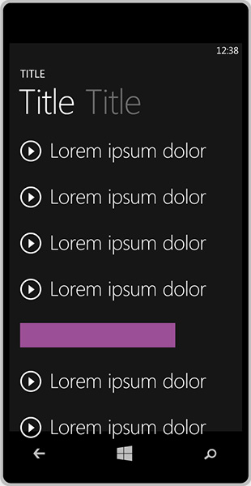

# Поддерживаемые размеры рекламных баннеров

Для приложений универсальной платформы Windows (UWP) поддерживаются следующие размеров рекламных баннеров. При создании экземпляра вашего **AdControl** объекта в приложении, убедитесь, что значение свойства width и height, чтобы соответствовать одному из этих поддерживаемых размеров.

Размеры: ширина x высота в пикселях.

* 160x600
* 300x50
* 300x250
* 300x600
* 320x50:
* 640x100
* 728x90

> [!NOTE]
> Для получения наилучших результатов рекомендуется использовать следующие размеры на устройствах Windows 10 Mobile: 300 x 50, 320 x 50 и 640 x 100.

В таблице ниже приведены примеры, иллюстрирующие каждый размер рекламного баннера.

<table>
<colgroup>
<col width="20%" />
<col width="80%" />
</colgroup>
<thead>
<tr class="header">
<th align="left">Размер объявления</th>
<th align="left">Пример</th>
</tr>
</thead>
<tbody>
<tr class="even">
<td align="left">
160x600
</td>
<td align="left"></td>
</tr>
<tr class="even">
<td align="left">
300x250
</td>
<td align="left"></td>
</tr>
<tr class="odd">
<td align="left">
300x600
</td>
<td align="left"></td>
</tr>
<tr class="odd">
<td align="left">
728x90
</td>
<td align="left"></td>
</tr>
<tr class="odd">
<td align="left">
300x50
</td>
<td align="left"></td>
</tr>
<tr class="even">
<td align="left">
320x50:
</td>
<td align="left"></td>
</tr>
<tr class="even">
<td align="left">
640x100
</td>
<td align="left"></td>
</tr>
</tbody>
</table>

 

 

 
