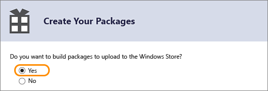

# Упаковка приложения UWP с помощью Visual Studio

Для продажи вашего приложения UWP или его распространения другим пользователям его необходимо упаковать. Если вы не хотите распространять приложение через Microsoft Store, вы можете отправить пакет приложения без публикации непосредственно на устройство или распространить его через [веб-установку](installing-UWP-apps-web.md). В этой статье описан процесс настройки, создания и тестирования пакета приложения UWP с помощью Visual Studio. Дополнительные сведения об управлении и развертывании бизнес-приложений см. в разделе [Управление корпоративными приложениями](https://docs.microsoft.com/windows/client-management/mdm/enterprise-app-management).

В Windows 10 вы можете отправить пакет приложения, пакет приложений или файл отправки пакета готового приложения в [Центр партнеров](https://partner.microsoft.com/dashboard). Самым удобным из этих вариантов является отправка файла отправки пакета. 

## Типы пакетов приложений

- **Пакет приложения (AppX или .msix)**  
    Файл, содержащий ваше приложение в формате, который можно загрузить неопубликованным на ваше устройство. Любой файл пакета одного приложения, созданные с помощью Visual Studio, **не** предназначен для отправки в центр партнеров и должен использоваться для загрузки неопубликованных приложений и тестирования только в качестве примера. Если вы хотите отправить приложение в центр партнеров, используйте файл отправки пакета приложения.  

- **Пакет приложений (.appxbundle или .msixbundle)**  
    Пакет приложений— это тип пакета, который может содержать множество пакетов приложений, каждый из которых создан для поддержки определенной архитектуры устройства. Например, пакет приложений может содержать три отдельных пакета приложения для конфигураций x86, x64 и ARM. Пакеты приложений должны создаваться всякий раз, когда это возможно, потому что они делают приложение доступным для широкого ассортимента устройств.  

- **Файл отправки пакета приложения (.appxupload)**  
    Один файл, который может содержать несколько пакетов приложения или пакет приложений, чтобы обеспечить поддержку разных архитектур процессора. Загруженный файл также содержит файл символов для [анализа производительности приложения](https://docs.microsoft.com/windows/uwp/publish/analytics) после его публикации в Microsoft Store. Этот файл будет автоматически создан для вас, если вы упакуете приложение с помощью Visual Studio отправить его в центр партнеров для публикации. Важно отметить, что это **только** допустимые центра партнеров форма отправки пакета приложения можно создать с помощью Visual Studio.

Ниже приведен обзор действий по подготовке и созданию пакета приложения.

1.  [Перед формированием пакета приложения](#before-packaging-your-app). Выполните следующие действия, чтобы убедиться, что ваше приложение будет готово к формированию пакета для отправки в центр партнеров.
2.  [Настройка пакета приложения](#configure-an-app-package) Используйте конструктор манифеста Visual Studio для настройки пакета. Например, добавьте изображения для плиток и выберите ориентации, которые будут поддерживаться приложением.
3.  [Создание файла пакета отправки приложения](#create-an-app-package-upload-file). Используйте мастер пакета приложения в Visual Studio для создания пакета приложения, а затем сертифицируйте созданный пакет с помощью комплекта сертификации приложений для Windows.
4.  [Загрузка пакета неопубликованного приложения](#sideload-your-app-package). После загрузки неопубликованного приложения на устройство вы сможете проверить, правильно ли оно работает.

После выполнения вышеперечисленных действий ваше приложение будет готово к распространению. Если у вас есть бизнес-приложения (LOB), которое предназначено не для продажи, только для внутреннего, вы можете отправлять установить его на любом устройстве Windows10.

## Перед формированием пакета приложения

1.  **Протестируйте свое приложение.** Перед формированием пакета приложения для отправки в центр партнеров, убедитесь, что оно правильно работает на всех семействах устройств, которые планируется поддерживать. Эти семейства устройств могут включать настольные и мобильные устройства, Surface Hub, Xbox, устройства IoT и др.
2.  **Оптимизируйте приложение.** Используйте средства профилирования и отладки в Visual Studio для оптимизации производительности вашего приложения UWP. Например, средство "Временная шкала" для измерения отклика пользовательского интерфейса, средство измерения использования памяти, средство оценки загрузки процессора и многие другие. Дополнительные сведения об этих инструментах командной строки см. в разделе [Обзор функции профилирования](https://docs.microsoft.com/visualstudio/profiling/profiling-feature-tour).
3.  **Проверьте совместимость с .NET Native (для приложений Visual Basic и C#).** Универсальная платформа Windows предоставляет новый собственный компилятор, который улучшит показатели времени выполнения приложения. Настоятельно рекомендуется протестировать приложение в этой среде компиляции. По умолчанию конфигурация сборки **Выпуск** включает цепочку инструментов .NET Native, поэтому обязательно протестируйте приложение с такой конфигурацией **Выпуск** и убедитесь, что приложение ведет себя ожидаемо. Некоторые распространенные проблемы отладки, которые могут произойти с платформой .NET Native, подробно рассматриваются в разделе [Отладка универсальных приложений для Windows .NET Native](http://blogs.msdn.com/b/visualstudioalm/archive/2015/07/29/debugging-net-native-windows-universal-apps.aspx).

## Настройка пакета приложения

Файл манифеста приложения (package.appxmanifest.xml) представляет собой XML-файл, который содержит свойства и параметры, необходимые для создания пакета приложения. Например, определенные свойства в файле манифеста приложения описывают изображение, которое будет использоваться как плитка приложения, и ориентации, которые будут поддерживаться вашим приложениям при повороте устройства.

Visual Studio содержит конструктор манифестов, который позволяет обновлять файл манифеста без необходимости редактировать необработанный XML-код файла.

**Настройка пакета с помощью конструктора манифестов**

1.  В **обозревателе решений** разверните узел проекта приложения UWP.
2.  Дважды щелкните файл **Package.appxmanifest**. Если файл манифеста уже открыт в представлении кода XML, Visual Studio предложит вам закрыть файл.
3.  Теперь вы сможете решить, как настроить свое приложение. Каждая вкладка содержит сведения о приложении, которые можно настроить, и ссылки на дополнительную информацию (при необходимости).  
    

    Убедитесь, что все изображения, необходимые для приложения UWP, присутствуют на вкладке **Визуальные активы**.

    На вкладке **Упаковка** можно ввести сведения о публикации. Здесь можно выбрать сертификат для подписания приложения. Все приложения UWP должны быть подписаны сертификатом. 
    
    >[!IMPORTANT]
    >Если приложение публикуется в Microsoft Store, приложение будет подписано для вас с помощью доверенного сертификата. Это позволит пользователям устанавливать и запускать приложения без установки соответствующего сертификата для подписи приложения. 
    
    Если приложение не публикуется и достаточно выполнить загрузку пакета неопубликованного приложения, необходимо сначала обеспечить доверие к пакету. Для этого сертификат необходимо установить на устройстве пользователя. Подробнее о загрузке неопубликованных приложений см. в разделе [Подготовка устройства к разработке](https://docs.microsoft.com/windows/uwp/get-started/enable-your-device-for-development).

4.  Сохраните файл **Package.appxmanifest** после внесения необходимых изменений в приложение.

Если приложение распространяется через Microsoft Store, Visual Studio может связать ваш пакет со Store. При этом некоторые поля на вкладке формирования пакета в конструкторе манифеста обновляются автоматически.

## Создание файла пакета отправки приложения

Для распространения приложения через Microsoft Store необходимо создать пакет приложения (AppX или .msix), пакет приложений (.appxbundle или .msixbundle) или пакет передачи (.appxupload) и [Отправить пакетное приложение в центр партнеров](https://docs.microsoft.com/windows/uwp/publish/app-submissions). Хотя возможно отправить в пакет приложения или пакета приложения в центр партнеров само по себе, можно также передавать пакет отправки.

>[!NOTE]
> Файл отправки пакета приложения (.appxupload) — это **только** тип допустимого пакета приложения для центра партнеров, которые могут быть созданы с помощью Visual Studio. Другие допустимые [пакеты приложения можно создать вручную](https://docs.microsoft.com/windows/uwp/packaging/create-app-package-with-makeappx-tool), без Visual Studio. 

Это можно сделать, воспользовавшись мастером **Создание пакетов приложения**. Выполните следующие действия, чтобы создать пакет, подходящий для отправки в центр партнеров с помощью Visual Studio.

**Создание файла отправки пакета приложения**

1.  В **обозревателе решений** откройте решение для проекта приложения UWP.
2.  Щелкните проект правой кнопкой мыши и выберите **Store**->**Создать пакеты приложения**. Если этот параметр отключен или не отображается, убедись, что это универсальный проект Windows.  
    

    Откроется мастер **Создание пакетов приложения**.

3.  Выберите "Да" в первый диалоговое окно с запросом, если вы хотите выполнить сборку пакетов для отправки в центр партнеров, а затем нажмите кнопку Далее.  
    

    Если кнопку "Нет", Visual Studio не создаст файл отправки (.appxupload) пакета приложения для отправок в центр партнеров. Если требуется загрузить неопубликованное приложение только для запуска на внутренних устройствах или для тестирования, можете выбрать этот вариант. Подробнее о загрузке неопубликованных приложений см. в разделе [Подготовка устройства к разработке](https://docs.microsoft.com/windows/uwp/get-started/enable-your-device-for-development).
4.  Выполните вход с помощью учетной записи разработчика в центре партнеров. Если у вас нет учетной записи разработчика, мастер поможет создать ее.
5.  Выберите имя приложения для пакета или зарезервируйте новое, если вы не зарезервировали в центре партнеров.  
    
6.  Не забудьте выбрать все три конфигурации архитектуры (x86, x64 и ARM) в диалоговом окне **Выбор и настройка пакетов**, чтобы гарантировать развертывание приложения на самых разных устройствах. В списковом окне **Создать пакет приложений** выберите **Всегда**. Пакет приложений (.appxbundle) предпочтительнее файл пакета одно приложение, так как он содержит коллекцию пакетов приложения, настроенных для каждого типа архитектуры процессора. Если вы решили создать пакет приложений, он будет включен в окончательный файл отправки пакета приложения (.appxupload) вместе с аналитической информацией об отладке и аварийном завершении. Если вы не уверены, какие архитектуры выбрать, или хотите узнать больше о том, какие архитектуры используются разными устройствами, см. информацию в разделе [Архитектуры пакета приложения](https://docs.microsoft.com/windows/uwp/packaging/device-architecture).  
    

7.  Включите полные файлы символов PDB для [анализа производительности приложения](https://docs.microsoft.com/windows/uwp/publish/analytics) в центре партнеров после публикации вашего приложения. Настройте любые дополнительные сведения, включая номер версии и выходное расположение пакета.
9.  Щелкните **Создать**, чтобы создать пакет приложения. Если **Да,** выбранных в шаге 3 и создаете пакет для отправки в центр партнеров, мастер создаст файл отправки пакета (.appxupload). Если в шаге 3 вы выбрали **Нет**, мастер создаст или отдельный пакет приложения или пакет приложений в зависимости от того, что вы выберете в шаге 6.
10. Если приложение успешно упаковано, отобразится это диалоговое окно.  
    

    Проверьте приложение перед отправкой в центр партнеров для сертификации на локальном или удаленном компьютерах. Проверить можно только сборку рабочего выпуска для пакета приложения, а не отладочную сборку.

11. Для выполнения локальной проверки приложения оставьте выбранным вариант **Локальный компьютер** и щелкните **Запустить комплект сертификации приложений для Windows**. Подробнее о тестировании приложений с помощью комплекта сертификации приложений для Windows см. в разделе [Комплект сертификации приложений для Windows](https://msdn.microsoft.com/library/windows/apps/Mt186449).

    Комплект сертификации приложений для Windows выполняет различные тесты и отображает их результаты. Подробные сведения см. в разделе [Тесты из комплекта сертификации приложений для Windows](https://msdn.microsoft.com/library/windows/apps/mt186450).

    Если у вас есть удаленное устройство Windows10, которое вы хотите использовать для тестирования, необходимо вручную установить комплект сертификации приложений Windows на этом устройстве. Следующий раздел поможет выполнить эти действия. После этого выберите вариант **Удаленный компьютер** и щелкните **Запустить комплект сертификации приложений для Windows**, чтобы установить подключение к удаленному устройству и запустить проверочные тесты.

12. После завершения КОМПЛЕКТА и ваше приложение прошло сертификацию, вы готовы отправить приложение в центр партнеров. Убедитесь, что отправляется нужный файл. Местоположение файла по умолчанию можно найти в корневой папке решения `\[AppName]\AppPackages`. Расширение файла — .appxupload. Если вы решили использовать пакет приложений с полной архитектурой пакета, имя будет иметь форму `[AppName]_[AppVersion]_x86_x64_arm_bundle.appxupload`.

Дополнительные сведения об отправке приложения в центр партнеров см. в разделе [отправки приложений](https://docs.microsoft.com/windows/uwp/publish/app-submissions).

**Проверка пакета приложения на удаленном устройстве Windows10**

1.  Включение Windows10 устройства для разработки, выполнив инструкции [Включение устройства для разработки](https://msdn.microsoft.com/library/windows/apps/Dn706236) .
    **Важные**невозможно проверить пакет приложения на удаленном устройстве ARM для Windows10.
2.  Скачайте и установите средства удаленной работы для Visual Studio. Эти средства используются для удаленного запуска комплекта сертификации приложений для Windows. Подробнее об этих средствах в том числе, а также о том, где можно их скачать, см. на веб-сайте [Запуск приложений UWP на удаленном компьютере](https://msdn.microsoft.com/library/hh441469.aspx#BKMK_Starting_the_Remote_Debugger_Monitor).
3.  Загрузите требуется [Комплект сертификации приложений для Windows](http://go.microsoft.com/fwlink/p/?LinkID=309666) , а затем установите его на удаленное устройство Windows10.
4.  На странице **Создание пакетов завершено** мастера выберите вариант **Удаленный компьютер**, а затем нажмите кнопку многоточия рядом с кнопкой **Проверить подключение**.
    **Примечание**переключатель **Удаленный компьютер** доступен, только если выбрана по крайней мере одна конфигурация решения, поддерживающая проверку. Подробнее о тестировании приложения с помощью комплекта сертификации приложений для Windows см. в разделе [Комплект сертификации приложений для Windows](https://msdn.microsoft.com/library/windows/apps/Mt186449).
5.  Укажите формат устройства внутри подсети или укажите имя сервера доменных имен (DNS) или IP-адрес устройства, находящегося вне вашей подсети.
6.  В списке **Режим аутентификации** выберите **Нет**, если устройство не требует входа в систему, установленную на нем, с использованием учетных данных Windows.
7.  Нажмите кнопку **Выбрать**, а затем — **Запустить комплект сертификации приложений для Windows**. Если на устройстве запущены средства удаленной работы, Visual Studio подключится к нему и затем выполнит проверочные тесты. См. раздел [Тесты комплекта сертификации приложений для Windows](https://msdn.microsoft.com/library/windows/apps/mt186450).

## Загрузка пакета неопубликованного приложения

В юбилейном обновлении Windows 10 появилась возможность установки пакетов приложений простым двойным щелчком по файлу пакета приложения. Для этого перейдите к файлу пакета приложения или пакета приложения и двойным щелчком откройте его. Установщик приложения запускается и предоставляет базовые данные приложения, а также кнопку установки, индикатор выполнения установки и все соответствующие сообщения об ошибках. 

> [!NOTE]
> Установщик приложения предполагает, что приложение является доверенным для устройства. Если вы являетесь разрабатываете собственное или корпоративное приложение без его публикации, вам потребуется установить сертификат подписи в хранилище центров сертификации "Доверенные люди" или "Доверенные издатели" на устройстве. Если вы не знаете, как это сделать, см. раздел [Установка тестовых сертификатов](https://docs.microsoft.com/windows-hardware/drivers/install/installing-test-certificates).

### Загрузка приложений без публикации в предыдущих версиях Windows
При использовании пакетов приложений UWP приложения не устанавливаются на устройство, как это происходит с классическими приложениями. Обычно приложение UWP скачивается из Microsoft Store, и при этом оно также само устанавливается на устройство. Приложения могут быть установлены без публикации в Store (загрузка неопубликованных приложений). Это позволяет установить и что вы создали файл тестовых приложений с помощью пакета приложения. Если вы не собираетесь продавать приложение (например, бизнес-приложение) в Store, можно загрузить это неопубликованное приложение, чтобы другие пользователи в вашей организации могли использовать его.

В следующем списке приведены требования для загрузки неопубликованного приложения.

-   Необходимо [подготовить устройство к разработке](https://msdn.microsoft.com/library/windows/apps/Dn706236).
-   Для загрузки неопубликованного приложения на устройстве Windows10 Mobile использовать средства [WinAppDeployCmd.exe](install-universal-windows-apps-with-the-winappdeploycmd-tool.md) .

**Загрузка неопубликованного приложения на настольный компьютер, ноутбук или планшет**

1.  Скопируйте папки той версии приложения, которую вы хотите установить на целевое устройство.

    При создании пакета приложений создается папка, соответствующая номеру версии, и папка `*_Test`. Пример этих двух папок (версия для установки — 1.0.2.0):

    -   `C:\Projects\MyApp\MyApp\AppPackages\MyApp_1.0.2.0`
    -   `C:\Projects\MyApp\MyApp\AppPackages\MyApp_1.0.2.0_Test`

    Если пакет приложения не создан, скопируйте папку для необходимой архитектуры и соответствующую папку `*_Test`. Эти две папки служат примером пакета приложения с архитектурой x64 и его папки `*_Test`:

    -   `C:\Projects\MyApp\MyApp\AppPackages\MyApp_1.0.2.0_x64`
    -   `C:\Projects\MyApp\MyApp\AppPackages\MyApp_1.0.2.0_x64_Test`

2.  На целевом устройстве откройте папку `*_Test`.
3.  Щелкните правой кнопкой мыши файл **Add-AppDevPackage.ps1**. Выберите **Выполнить с помощью PowerShell** и следуйте указаниям на экране.  
    

    После завершения установки пакета приложения в окне PowerShell отобразится сообщение **Приложение успешно установлено**.

    **Совет**: чтобы открыть контекстное меню на планшете, коснитесь экрана и удерживайте, пока не появится полный круг, а затем поднимите палец. После того, как вы уберете палец с экрана, откроется контекстное меню.
4.  Нажмите кнопку "Пуск" для поиска приложения по названию, чтобы запустить его.
