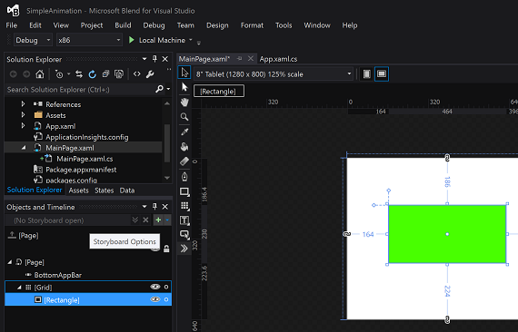

# Начало работы: анимация

\[ Обновлено для приложений UWP в Windows 10. Статьи о Windows 8.x см. в [архиве](http://go.microsoft.com/fwlink/p/?linkid=619132) \]

## Добавление анимаций

В iOS эффекты анимации чаще всего создаются программно. Например, для создания анимации можно использовать методы **animateWithDuration**, предоставляемые классом блочного формирования изображений **UIView**, либо более старые методы неблочного формирования изображений. Кроме того, для анимации слоев вы можете использовать в явной форме класс **CALayer**. В приложениях для Windows анимацию можно создавать программно, но помимо этого ее можно определить с помощью объявления XAML. Вы можете использовать Microsoft Visual Studio, чтобы редактировать код XAML напрямую, но Visual Studio также предоставляется с инструментом под названием **Blend**, который создает код XAML во время работы с анимациями в конструкторе. Фактически Blend позволяет открывать, проектировать, создавать и запускать законченные проекты Visual Studio в графическом виде. Эти возможности можно опробовать в следующем пошаговом руководстве.

Создайте новое приложение универсальной платформы Windows (UWP) и назовите его, например, SimpleAnimation. В этом проекте мы будем перемещать прямоугольник, применять к нему эффект угасания и затем снова отображать прямоугольник. Анимации в XAML основаны на понятии *раскадровок* (не путать с раскадровками в iOS). Для анимации изменений свойств в раскадровках используются *опорные кадры*.

Откройте проект в области **Обозреватель решений**, щелкните правой кнопкой мыши имя проекта, а затем выберите пункт **Открыть в Blend** или **Проектировать в Blend**, как показано на следующем рисунке. Visual Studio продолжит работу в фоновом режиме.


После запуска приложения Blend вы увидите окно, похожее на следующее.


Дважды щелкните **MainPage.xaml** в **Обозревателе решений** слева. Затем выберите инструмент **Прямоугольник** на вертикальной полосе инструментов вдоль края центрального **Представления конструирования** и нарисуйте прямоугольник в **Представлении конструирования**, как показано на следующем рисунке.


Чтобы сделать прямоугольник зеленым, в окне **Свойства** области **Щетка** нажмите кнопку **Одноцветная кисть**, а потом щелкните значок **Пипетка выбора цвета**. Выберите любой оттенок зеленого цвета.

Чтобы приступить к анимации прямоугольника, в окне **Объекты и временная шкала** нажмите кнопку со знаком «плюс» (**Создать**), как показано на следующем рисунке, а затем нажмите кнопку **ОК**.



Раскадровка отображается в окне **Объекты и временная шкала** (возможно, вам придется изменить размер этого окна для корректного отображения). **Представление конструирования** изменится, показывая, что **идет запись временной шкалы раскадровки Storyboard1**. Чтобы захватить текущее состояние прямоугольника, в окне **Объекты и временная шкала** нажмите кнопку **Записать опорный кадр** над желтой стрелкой, как показано на следующем рисунке.


Теперь переместим прямоугольник и применим к нему эффект угасания. Для этого перетащите оранжевую/желтую стрелку в позицию, соответствующую 2 секундам, после чего переместите зеленый прямоугольник слегка вправо. Затем в разделе **Внешний вид** окна **Свойства** задайте свойству **Непрозрачность** значение **0**, как показано на следующем рисунке. Чтобы предварительно просмотреть анимацию, нажмите кнопку **Воспроизвести** на панели раскадровки.


Далее вернем прямоугольник обратно в представление. В окне **Объекты и временная шкала** дважды щелкните **Storyboard1**. Затем в разделе **Общие** панели **Свойства** выберите **AutoReverse**, как показано на следующем рисунке.


В завершение нажмите кнопку **Воспроизвести**, чтобы увидеть, что произойдет.

Вы можете выполнить сборку и запуск проекта, щелкнув на зеленой кнопке выполнения в верхней части окна (или нажмите клавишу F5). В этом случае вы увидите, что проект действительно выполняет сборку и запуск, но зеленый прямоугольник останется на месте, как ребенок, которому не дали конфету в супермаркете. Чтобы запустить анимацию, вам потребуется добавить в проект дополнительный код. Опишем, как это сделать.

Сохраните проект, открыв меню **Файл** и выбрав пункт **Сохранить MainPage.xaml**. Вернитесь в Visual Studio. Если Visual Studio отображает диалоговое окно, запрашивающее перезагрузку измененного файла, выберите **Да**. Дважды щелкните файл **MainPage.xaml.cs**, скрытый под **MainPage.xaml**, чтобы открыть его, а затем добавьте следующий код сразу над методом public MainPage():

```csharp
protected override void OnNavigatedTo(NavigationEventArgs e)
{
    // Add the following line of code.
    Storyboard1.Begin();
}
```

Снова запустите проект и просмотрите анимацию прямоугольника. Ура!

Если вы откроете файл MainPage.xaml, то в представлении **XAML** вы увидите код XAML, добавленный приложением Blend, как в случае, если бы вы работали в конструкторе. В частности, просмотрите код в элементах `<Storyboard>` и `<Rectangle>`. Следующий код демонстрирует пример. Для краткости код, не имеющий отношения к примеру, опущен. (Для удобства чтения в код добавлены разрывы строк.)

```xml
...
<Storyboard 
        x:Name="Storyboard1" 
        AutoReverse="True">
    <DoubleAnimationUsingKeyFrames 
            Storyboard.TargetProperty="(UIElement.RenderTransform).(CompositeTransform.TranslateX)"
            Storyboard.TargetName="rectangle">
        <EasingDoubleKeyFrame 
                KeyTime="0" 
                Value="0"/>
        <EasingDoubleKeyFrame 
                KeyTime="0:0:2" 
                Value="185.075"/>
    </DoubleAnimationUsingKeyFrames>
    <DoubleAnimationUsingKeyFrames 
            Storyboard.TargetProperty="(UIElement.RenderTransform).(CompositeTransform.TranslateY)" 
            Storyboard.TargetName="rectangle">
        <EasingDoubleKeyFrame 
                KeyTime="0" 
                Value="0"/>
        <EasingDoubleKeyFrame 
                KeyTime="0:0:2" 
                Value="2.985"/>
    </DoubleAnimationUsingKeyFrames>
    <DoubleAnimationUsingKeyFrames 
            Storyboard.TargetProperty="(UIElement.Opacity)" 
            Storyboard.TargetName="rectangle">
        <EasingDoubleKeyFrame 
                KeyTime="0" 
                Value="1"/>
        <EasingDoubleKeyFrame 
                KeyTime="0:0:2"
                Value="0"/>
    </DoubleAnimationUsingKeyFrames>
</Storyboard>
...
<Rectangle 
        x:Name="rectangle" 
        Fill="#FF00FF63" 
        HorizontalAlignment="Left" 
        Height="122" 
        Margin="151,312,0,0" 
        Stroke="Black" 
        VerticalAlignment="Top" 
        Width="239" 
        RenderTransformOrigin="0.5,0.5">
    <Rectangle.RenderTransform>
        <CompositeTransform/>
    </Rectangle.RenderTransform>
</Rectangle>
...
```

Вы можете изменить этот код XAML вручную или вернуться к Blend, чтобы продолжить работу над кодом. Blend значительно упрощает создание интересных пользовательских интерфейсов, а возможность анимировать их при помощи графического инструмента может существенно сократить время разработки. Дополнительную информацию об анимациях см. в статье [Обзор анимаций](https://msdn.microsoft.com/library/windows/apps/mt187350).

**Примечание.** Подробнее об анимации для приложений Магазина Windows на JavaScript и HTML: [Анимация пользовательского интерфейса (HTML)](https://msdn.microsoft.com/library/windows/apps/hh465165).

### Следующие шаги

[Приступая к работе: что дальше?](getting-started-what-next.md)


<!--HONumber=Aug16_HO3-->


