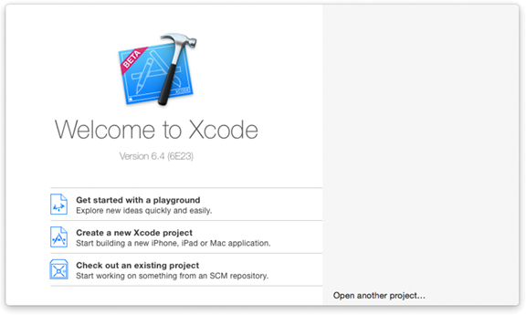
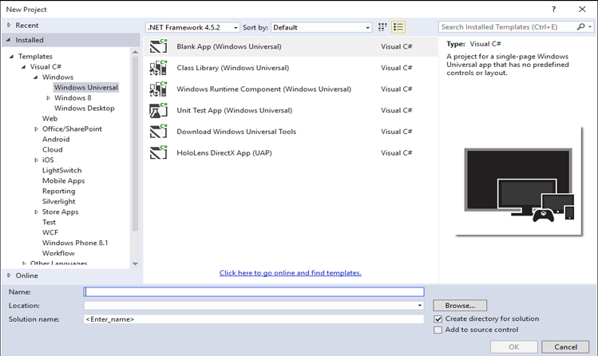

# Начало работы: создание проекта

## Создание проекта

Microsoft Visual Studio является для Windows примерно тем же, чем Xcode для iOS и Mac OS. В этом пошаговом руководстве мы поможем вам освоиться с использованием Visual Studio. Руководство даст вам основные сведения, которые нужно знать, чтобы начать работу. Каждый раз, создавая приложение, вы будете выполнять шаги, аналогичные этим.

В следующем видеоролике сравниваются Xcode и Visual Studio.

> [!VIDEO https://channel9.msdn.com/Blogs/One-Dev-Minute/Comparing-Xcode-to-Visual-Studio/player]

Кроме того, полезными будут записи в блоге [Создание приложений для Windows](https://blogs.windows.com/buildingapps/2016/01/27/visual-studio-walkthrough-for-ios-developers/).

Создание приложения для Windows10 (более официально называется приложение универсальной платформы Windows (UWP)) больше похоже на создание приложения iOS с помощью раскадровки. Приложение Windows10 часто состоит из нескольких страниц, каждый страницу, содержащую различные части пользовательского интерфейса, такие как веб-сайт. Для каждой страницы, как правило, существует два связанных исходных файла: один для хранения пользовательского интерфейса, определенного программным путем или визуально, который хранится в формате [Обзора языка XAML](https://msdn.microsoft.com/library/windows/apps/mt185595), а второй с исходным кодом— как правило, C#. В ходе взаимодействия с приложением пользователь переходит с одной страницы на другую. В данном пошаговом руководстве вы создадите приложение с двумя страницами.

**Примечание**важной характеристикой приложений Windows10 является тот факт, что один и тот же исходный код и тот же набор API доступны вам независимо от платформы. Как известно, когда вы пишите универсальное приложение для iOS для iPhone и iPad, вы можете определить во время выполнения платформу, на которой будет работать ваше приложение, и предпринять соответствующие шаги. Подобным образом, Windows10 приложения могут указать, во время выполнения, устройство, на котором они работают. В приложении UWP нет необходимости использовать \#ifdef's в исходном коде, чтобы создать сборки для телефона вместо сборки для компьютера. Удобства, приложения Windows10 также интеллектуально используют элементы управления своего пользовательского интерфейса в зависимости от устройства: например, ваше приложение может ссылаться управляющий элемент выбора даты и элемент управления будет автоматически выглядеть и функционировать по-разному в зависимости от того, есть ли выполняется на компьютере или экрана телефона. Однако исходный код при этом не изменится.

Давайте посмотрим, как мы можем создать приложение Windows10. Сначала запустите Visual Studio. При первом запуске Visual Studio запрашивает лицензию разработчика. Лицензия разработчика позволяет устанавливать и тестировать приложения UWP на локальном компьютере перед отправкой в Microsoft Store. Чтобы получить лицензию, выполните вход с учетной записью Microsoft, следуя указаниям на экране. Если у вас нет учетной записи Microsoft, щелкните ссылку **Регистрация** в диалоговом окне **Лицензия разработчика**, а затем следуйте указаниям на экране.

Для сравнения при запуске Xcode отображается окно **Welcome to Xcode** (Добро пожаловать в Xcode), которое показано на следующем рисунке.

Очень похоже выглядит Visual Studio. Вы увидите **Начальную страницу**, как показано на следующем рисунке.

Чтобы создать новое приложение, начните с выполнения проекта посредством одного из следующих действий.

-   На **начальной странице** щелкните **Создать проект**.
-   В меню **Файл** выберите **Создать проект**.

Для сравнения при создании нового проекта в Xcode вы увидите список шаблонов проекта (см. следующий рисунок).

В Visual Studio вы также можете выбрать один из нескольких шаблонов проекта (см. следующий рисунок).

 Для выполнения данного пошагового руководства последовательно коснитесь **Visual C#**, **Windows**, **Универсальное приложение для Windows** и **Пустое приложение (универсальное приложение для Windows)**. В поле **Имя** введите "MyApp" и нажмите кнопку **OK**. Visual Studio создаст ваш первый проект и отобразит его на экране. Теперь все готово для проектирования приложения и добавления кода.

## Следующий шаг

[Приступая к работе: выбор языка программирования](getting-started-choosing-a-programming-language.md)
