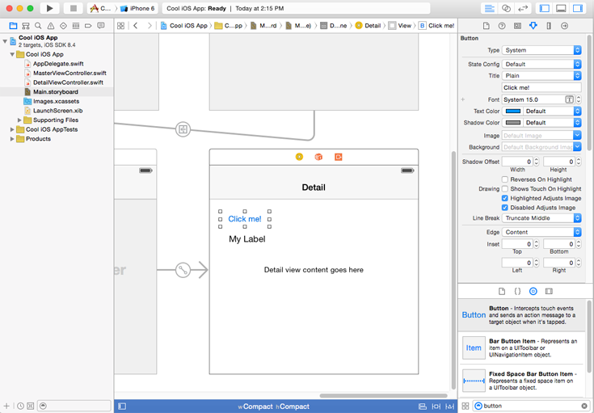
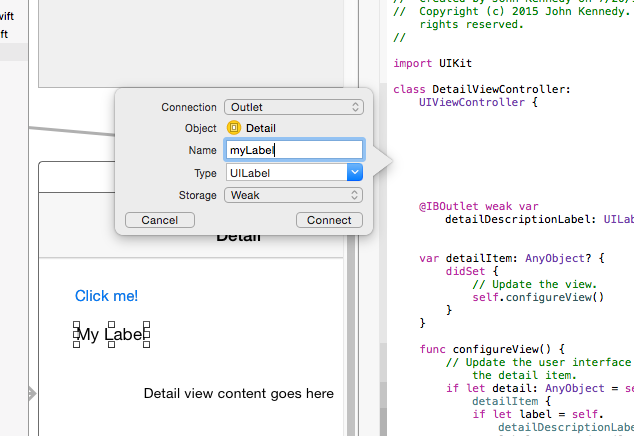
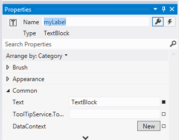

# <a name="getting-started-getting-around-in-visual-studio"></a>Начало работы: введение в Visual Studio


## <a name="getting-around-in-microsoft-visual-studio"></a>Знакомство с Microsoft Visual Studio

Вернемся в проект, созданный ранее, и рассмотрим возможности реализации интегрированной среды разработки (IDE) Microsoft Visual Studio.

Если вы являетесь разработчиком Xcode, представление по умолчанию, показанное ниже, должно быть вам знакомо: исходные файлы расположены на левой панели, редактор (пользовательского интерфейса или исходного кода) — на центральной, а элементы управления и их свойства — на правой панели.


Среда Microsoft Visual Studio аналогична, хотя в представлении по умолчанию элементы управления находятся слева на **панели элементов**. Файлы исходного кода находятся в окне **Обозреватель решений** с правой стороны, а свойства находятся в окне **Свойства** в области **Обозреватель решений**, например:


Если для вас это незнакомо, вам будет приятно узнать, что вы можете изменить расположение областей в Visual Studio: разместить исходные файлы в левой части экрана, а набор инструментов — в правой. На самом деле, вы можете перетащить строку заголовка любой области для изменения ее положения, и Visual Studio отобразит общее поле, в котором будет указано, где оно будет закреплено после выпуска. В большинстве панелей также имеется небольшой значок закрепления рисования в заголовке окна. Это позволяет закреплять панель как есть, блокируя ее на месте. Открепите панель, и ее можно свернуть для сохранения пространства: это полезно, если монитор находится на меньшей части. Если вы все перемешаете (не волнуйтесь, все можно исправить). Для этого выберите элемент **Сброс макета окон** в меню **Окно**, чтобы восстановить порядок.

## <a name="adding-controls-setting-their-properties-and-responding-to-events"></a>Добавление элементов управления, задание их свойств и обработка событий

Теперь давайте добавим некоторые элементы управления в ваш проект. Затем изменим некоторые свойства и напишем код для ответа на одно из событий элемента управления.

Чтобы добавить элементы управления в Xcode, откройте требуемый XIB-файл или раскадровку, а затем перетащите элементы управления, например**Прямоугольная кнопка со скругленными углами** или **Подпись**, как показано ниже:



Выполним аналогичные действия в Visual Studio. В **панели элементов** перетащите элемент управления **Button** на поверхность разработки файла MainPage.xaml.

Выполните аналогичные действия с элементом **TextBlock**, чтобы он выглядел следующим образом:


В отличие от Xcode, который скрывает информацию о макете и привязке в XIB-файле или файле раскадровки, Visual Studio предлагает вам изменять файлы XAML, используемые для хранения этих сведений, с помощью богатого, редактируемого, декларативного языка, похожего на язык XML. Подробнее о языке XAML см. в разделе [Обзор языка XAML](https://msdn.microsoft.com/library/windows/apps/mt185595). Пока вам достаточно знать, что все, что отображается в области **Конструктор**, определяется в области **XAML**. Область **XAML** позволяет точнее управлять параметрами там, где это необходимо, а также ускорить разработку кода пользовательского интерфейса вручную. Пока же мы сосредоточимся на области **Конструктор** и окне **Свойства**.

Давайте изменим сведения о кнопке. Как известно, чтобы изменить имя кнопки в Xcode, необходимо изменить значение поля **Название** на панели свойств.

В Visual Studio вы делаете что-то очень похожее. В области **Конструктор** нажмите кнопку, чтобы перевести на нее фокус. Затем на панели **Свойства** измените значение **Содержимое** с "Button" на "Press Me". Далее обновите имя элемента управления кнопкой, изменив значение **Имя** с "&lt;No Name&gt;" на "myButton", как показано здесь:


Теперь напишем код, чтобы после касания кнопки пользователем содержимое элемента управления **TextBlock** изменялось на  "Hello, World!" (Здравствуй, мир!).

В Xcode связывание события с элементом управления включает написание кода и последующее связывание этого кода с элементом управления, часто с помощью перетаскивания кнопки в исходный код, примерно так:


```swift
// Swift implementation.

@IBAction func buttonPressed(sender: UIButton) {
    
}
```

Visual Studio очень похожа в этом отношении. В правом верхнем углу панели **Свойства** расположена кнопка с изображением молнии. Здесь перечислены возможные события, связанные с выбранным элементом управления, например:


Чтобы добавить код события нажатия кнопки, сначала выберите кнопку в области **Конструктор**. Далее нажмите кнопку с изображением молнии и дважды щелкните на пустом поле рядом с именем **Click**. Visual Studio затем добавит событие "myButton\_Click" в поле **Click**, а затем добавит и отобразит соответствующий обработчик событий в файл MainPage.xaml.cs, как показано ниже.

```csharp
private void myButton_Click(object sender, RoutedEventArgs e)
{

}
```

Рассмотрим теперь подключение элемента управления **TextBlock**. В Xcode вы бы перетаскивали кнопку в файл исходного кода удерживая клавишу Control, чтобы связать элемент управления с его определением, как показано ниже.



```swift
// Swift implentation.

@IBOutlet weak var myLabel : UILabel
```

В Visual Studio вам не нужен связанный элемент управления, поскольку это делается до вас. Давайте изменим некоторые свойства с помощью следующих действий:

1.  Коснитесь вкладки файла MainPage.xaml.
2.  На панели **Конструктор** щелкните элемент управления **TextBlock**.
3.  На панели **Свойства** нажмите кнопку с изображением гаечного ключа, чтобы просмотреть свойства.
4.  В поле **Имя** измените "&lt;Без имени&gt;" на "myLabel".



Добавим код в событие нажатия кнопки. Выберите файл MainPage.xaml.cs, чтобы перевести на него фокус, а затем добавьте следующий код в обработчик событий myButton\_Click.

```csharp
private void myButton_Click(object sender, RoutedEventArgs e)
{
    // Add the following line of code.    
    myLabel.Text = "Hello, World!";
}
```

Это похоже на то, что вы напишите в Swift:

```swift
@IBAction func buttonPressed(sender: UIButton) {
    myLabel.text = "Hello, World!"
}
```

Наконец, чтобы запустить приложение, выберите меню **Отладка**, а затем — **Начать отладку** (или просто нажмите клавишу F5). После запуска приложения нажмите кнопку "Press Me" (Нажмите) и убедитесь, что содержимое подписи изменено с "TextBlock" на "Hello, World!" (Здравствуй, мир!), как показано на следующем рисунке.


Чтобы выйти из приложения, вернитесь в Visual Studio, а затем либо выберите в меню **Debug** (Отладка) пункт **Stop Debugging** (Остановить отладку), либо просто нажмите клавиши SHIFT+F5. Обратите внимание, что Visual Studio позволяет опробовать приложение во многих различных устройствах, чтобы проверить, как оно работает в каждом.

## <a name="next-step"></a>Следующий шаг

[Приступая к работе: общие элементы управления](getting-started-common-controls.md)

