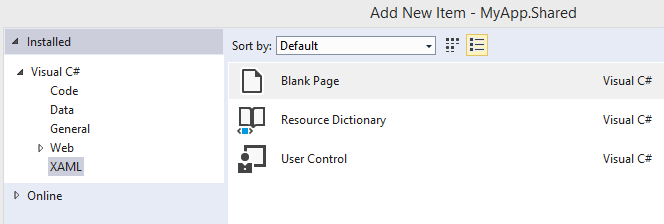

# Приступая к работе: навигация

\[ Обновлено для приложений UWP в Windows 10. Статьи о Windows 8.x, см. в [архиве](http://go.microsoft.com/fwlink/p/?linkid=619132) \]

## Добавление навигации

iOS предоставляет класс **UINavigationController**, чтобы помочь в создании навигации в приложении: вы можете использовать представления push и pop для создания иерархии **UIViewControllers**, определяющей ваше приложение.

Напротив, приложение для Windows 10, содержащее несколько представлений, скорее использует подход к навигации по аналогии с веб-сайтом. Вы можете представить своих пользователей, которые переходят между «страницами» приложения по мере нажатия элементов управления. Подробнее см. в разделе [Основы проектирования навигации](https://msdn.microsoft.com/library/windows/apps/dn958438).

Для приложения Windows 10 один из способов управления этой навигацией — использование класса [**Frame**](https://msdn.microsoft.com/library/windows/apps/br242682). Эти возможности описаны в указанном ниже пошаговом руководстве.

Продолжим работу с решением, которую вы начали ранее. Откройте файл **MainPage.xaml** и добавьте кнопку в **представление конструирования**. Задайте для свойства кнопки **Content** значение "Go To Page" вместо "Button". Затем создайте обработчик для события кнопки **Click**, как показано на следующем рисунке. Если вы не помните, как это делать, обратитесь к пошаговому руководству в предыдущем разделе (совет: дважды щелкните кнопку в **представлении конструирования**).


Давайте добавим новую страницу. В представлении **Решение** коснитесь меню **Проект**, а затем коснитесь элемента **Добавление нового элемента**. Выберите **Пустая страница**, как показано на следующем рисунке, и затем нажмите кнопку **Добавить**.



Затем добавьте кнопку в файл BlankPage.xaml. Мы будем использовать элемент управления AppBarButton с изображением стрелки, указывающей назад: в представлении **XAML** добавьте ` <AppBarButton Icon="Back"/>` между элементами `<Grid> </Grid>`.

Теперь давайте добавим обработчик событий в кнопку: дважды щелкните элемент управления в представлении **конструирования**, и Microsoft Visual Studio добавит текст "AppBarButton\_Click" в поле **Click** (Нажатие), как показано на следующем рисунке, а затем добавит и отобразит соответствующий обработчик событий в файле BlankPage.xaml.cs.


Если вы вернетесь к представлению **XAML** файла BlankPage.xaml, код XAML элемента `<AppBarButton>` будет выглядеть так:

` <AppBarButton Icon="Back" Click="AppBarButton_Click"/>`

Вернитесь в файл BlankPage.xaml.cs и добавьте следующий код для перехода на предыдущую страницу при нажатии кнопки пользователем.

```csharp
private void AppBarButton_Click(object sender, RoutedEventArgs e)
{
    // Add the following line of code.    
    Frame.GoBack();
}
```

В завершение откройте файл MainPage.xaml.cs и добавьте следующий код. Он открывает страницу BlankPage после нажатия кнопки пользователем.

```csharp
private void Button_Click(object sender, RoutedEventArgs e)
{
    // Add the following line of code.
    Frame.Navigate(typeof(BlankPage1));
}
```

Теперь запустите программу. Нажмите кнопку "Go To Page", чтобы перейти на другую страницу, а затем нажмите кнопку со стрелкой назад, чтобы вернуться на предыдущую страницу.

Для управления навигацией по страницам используется класс [**Frame**](https://msdn.microsoft.com/library/windows/apps/br242682). Аналогично классу **UINavigationController** в iOS, который использует методы **pushViewController** и **popViewController**, класс **Frame** для приложений Магазина Windows предоставляет методы [**Navigate**](https://msdn.microsoft.com/library/windows/apps/br242694) и [**GoBack**](https://msdn.microsoft.com/library/windows/apps/dn996568). Класс **Frame** также содержит метод под названием [**GoForward**](https://msdn.microsoft.com/library/windows/apps/br242693), который выполняет то, что вы ожидаете.

В этом пошаговом руководстве при каждом переходе на страницу создается новый экземпляр BlankPage. (Предыдущий экземпляр будет автоматически освобожден (*высвобожден*). Если вы не хотите, чтобы при каждом переходе на страницу создавался новый экземпляр, добавьте этот код в конструктор класса BlankPage в файле BlankPage.xaml.cs. Он включает режим [**NavigationCacheMode**](https://msdn.microsoft.com/library/windows/apps/br227506).

```csharp
public BlankPage()
{
    this.InitializeComponent();
    // Add the following line of code.
    this.NavigationCacheMode = Windows.UI.Xaml.Navigation.NavigationCacheMode.Enabled;
}
```

Для указания числа кэшируемых страниц в журнале навигации вы также можете получить или задать свойство [**CacheSize**](https://msdn.microsoft.com/library/windows/apps/br242683) класса **Frame**.

Подробнее о навигации см. в разделах [Навигация](https://msdn.microsoft.com/library/windows/apps/mt187344) и [Пример анимаций персонализации на XAML](http://go.microsoft.com/fwlink/p/?LinkID=242401).

**Примечание.**  Дополнительные сведения о навигации для приложений Магазина Windows на JavaScript и HTML см. в разделе [Краткое руководство: использование одностраничной навигации](https://msdn.microsoft.com/library/windows/apps/hh452768).
 
### Следующие шаги

[Приступая к работе: анимация](getting-started-animation.md)


<!--HONumber=Mar16_HO1-->


