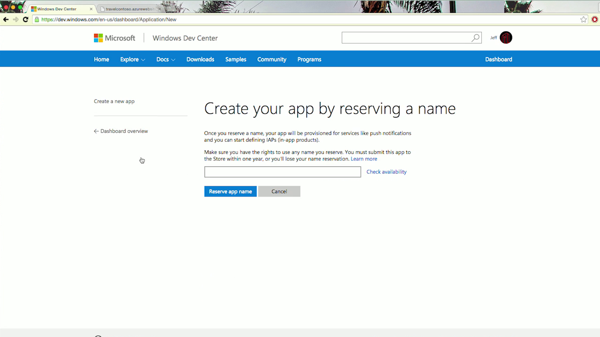

# Преобразование существующего приложения Chrome в приложение UWP

Мы облегчили процесс преобразования имеющихся размещенных приложений Chrome в приложения, работающие на универсальной платформе Windows (UWP). Существует два способа преобразования приложений Chrome.

- Вариант 1. [ManifoldJS](http://manifoldjs.com/) теперь принимает манифесты Chrome в качестве одной из форм ввода. 

- Вариант 2. Мы разработали [средство командной строки](https://github.com/MicrosoftEdge/hwa-cli), которое создает пакет `.appx` из существующих `.zip`- или `.crx`-файлов.

## Преобразование существующего приложения Chrome с помощью интерфейса командной строки

1. Установите [NodeJS](https://nodejs.org/en/) и его диспетчер пакетов ([npm](https://www.npmjs.com/)). 

2. Откройте окно командной строки в нужном каталоге.

3. Установите интерфейс командной строки размещенных веб-приложений, введя в командной строке следующую команду: `npm i -g hwa-cli`

4. Преобразуйте пакет Chrome (поддерживаемые форматы пакетов — `.crx` и `.zip`), введя следующую команду в командной строке: `hwa convert path/to/chrome/app.crx` или `hwa convert path/to/chrome/app.zip`

    **Замените строку `path/to/chrome/app` на путь к приложению Chrome.*
    
5. Созданный файл `.appx` будет находиться в той же папке, где и пакет Chrome. Теперь вы можете отправить это приложение в Магазин Windows. 

## Отправка приложения в Магазин Windows

Для отправки приложения перейдите в информационную панель [Центра разработки для Windows](https://developer.microsoft.com/windows). Щелкните пункт [Создание нового приложения](https://developer.microsoft.com/dashboard/Application/New) и зарезервируйте имя приложения.

Перейдите на страницу «Пакеты» в разделе отправки и отправьте пакет `AppX`.

Заполните информацию в диалоговых окнах Магазина Windows.

    During the conversion process, you will be prompted for an Identity Name, Publisher Identity, and Publisher Display Name. To retrieve these values, visit the Dashboard in the [Windows Dev Center](https://developer.microsoft.com/windows).
    - Click on "[Create a new app](https://developer.microsoft.com/dashboard/Application/New)" and reserve your app name.

    - Затем нажмите "Удостоверение приложения" в меню слева под разделом "Управление приложениями".
    
    - На странице должны быть указаны три запрашиваемых значения: 
        1. Имя удостоверения: `Package/Identity/Name`
        2. Удостоверение издателя: `Package/Identity/Publisher`
        3. Отображаемое имя издателя: `Package/Properties/PublisherDisplayName`

## Руководство по переносу размещенного веб-приложения

После упаковки веб-приложения для Магазина Windows настройте его так, чтобы оно правильно работало на всех устройствах под управлением Windows, включая компьютеры, планшеты, телефоны, HoloLens, Surface Hub, Xbox и Raspberry Pi.

### Правила универсального кода ресурса для содержимого приложения

[Правила универсального кода ресурса для содержимого приложения (ACUR)](./hwa-access-features.md) или URI содержимого определяют область использования размещенного веб-приложения посредством списка разрешенных URL-адресов в манифесте пакета приложения. Для контроля входящих и исходящих соединений с удаленным содержимым необходимо указать, какие URL-адреса следует включить в этот список, а какие — исключить из него. Если пользователь переходит на URL-адрес, который явно не включен в список, Windows открывает целевой путь в браузере по умолчанию. Также с помощью ACUR для URL-адресов можно предоставить доступ к [универсальным API для Windows](https://msdn.microsoft.com/library/windows/apps/br211377.aspx).

Как минимум, ваши правила должны включить в список начальную страницу вашего приложения. Средство преобразования автоматически создаст для вас набор правил ACUR с учетом начальной страницы и ее домена. Однако если имеются любые программные перенаправления, как на стороне сервера, так и на стороне клиента, целевые адреса необходимо будет добавить в список разрешений.

*Примечание. ACUR применяются только к навигации по страницам. Эти ограничения не затрагивают изображения, библиотеки JavaScript и другие подобные ресурсы.*

Многие приложения используют сторонние сайты для организации процедуры входа, например Facebook и Google. Средство преобразования автоматически создаст для вас набор правил ACUR на основе наиболее популярных сайтов. Если ваш метод проверки подлинности отсутствует в этом списке и использует процедуру перенаправления, необходимо добавить его путь (или пути) в качестве правил ACUR. Вы также можете попробовать использовать [брокер веб-проверки подлинности](./hwa-access-features.md).

### Flash

Использовать Flash в приложениях для Windows 10 запрещено. Необходимо убедиться, что его отсутствие не влияет на работу вашего приложения.

Если вы показываете в приложении рекламу, необходимо убедиться, что ваш рекламодатель поддерживает применение HTML5. Вы можете использовать службы [Bing Ads](https://bingads.microsoft.com/) и [библиотеки Microsoft Advertising](../monetize/display-ads-in-your-app.md). 

Видео с YouTube должно по-прежнему работать, так как теперь [по умолчанию оно воспроизводится с помощью тега HTML5 `<video>`](http://youtube-eng.blogspot.com/2015/01/youtube-now-defaults-to-html5_27.html), если вы используете [метод внедрения `<iframe>`](https://developers.google.com/youtube/iframe_api_reference). Если ваше приложение все еще использует API Flash, вам следует перейти на указанный выше метод внедрения.

### Ресурсы изображений

Для интернет-магазина Chrome требуется [наличие в пакете приложения значка приложения размером 128 × 128 пикселей](https://developer.chrome.com/webstore/images). Для приложений для Windows 10 как минимум необходимо предоставить значки приложения размером 44 × 44, 50 × 50, 150 × 150 и 600 × 350 пикселей. Средство преобразования автоматически создаст такие значки из значка размером 128 × 128 пикселей. Чтобы улучшить вид приложения и усилить впечатление от работы с ним, мы настоятельно рекомендуем создавать собственные файлы изображений. Вот некоторые [рекомендации по использованию ресурсов плиток и значков](https://msdn.microsoft.com/library/windows/apps/mt412102.aspx).

### Возможности

Чтобы получить доступ к некоторым API и ресурсам, в манифесте приложения следует [объявить](https://msdn.microsoft.com/windows/uwp/packaging/app-capability-declarations) возможности приложения. Средство преобразования автоматически включит три популярные возможности устройств — определение местоположения, микрофон и веб-камеру. Как и прежде, система будет запрашивать у пользователя разрешение перед предоставлением доступа к этим возможностям.

*Примечание. Пользователи получают уведомление обо всех объявленных возможностях приложения. Рекомендуется убрать те возможности, которые не требуются вашему приложению.*

### Загружаемые файлы

Обычная загрузка файлов в той форме, в какой она осуществляется в браузере, в настоящее время не поддерживается.

### API платформы Chrome

Chrome предоставляет приложениям [специализированные API](https://developer.chrome.com/apps/api_index), которые могут выполняться в качестве фонового сценария. Они не поддерживаются. Вы можете найти эквивалентный функционал и другие возможности в [API среды выполнения Windows](https://msdn.microsoft.com/library/windows/apps/br211377.aspx).

## Еще по теме

- [Улучшение веб-приложения путем обращения к функциям универсальной платформы Windows (UWP)](./hwa-access-features.md)
- [Руководство по работе с приложениями универсальной платформы Windows (UWP)](http://go.microsoft.com/fwlink/p/?LinkID=397871)
- [Загружаемые ресурсы проектирования для приложений Магазина Windows](https://msdn.microsoft.com/library/windows/apps/xaml/bg125377.aspx)
