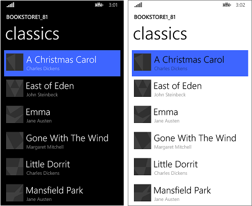
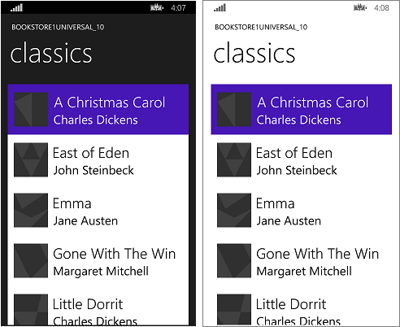

# Пример переноса со среды выполнения Windows 8.x на UWP: Bookstore1

В этом разделе представлен практический пример переноса очень простое универсальное приложение версии 8.1 в приложение Windows10Universal платформы Windows (UWP). Универсальное приложение версии 8.1 — это уведомление, создает один пакет приложения для Windows8.1, а другое приложение для Windows Phone 8.1. С помощью Windows10, можно создать один пакет приложения, покупатели могут установить на широкий спектр устройств, и именно то, что мы выполним займемся в этом. См. раздел [Руководство по приложениям UWP](https://msdn.microsoft.com/library/windows/apps/dn894631).

Приложение, которое мы будем портировать, состоит из элемента **ListBox**, привязанного к модели представления. Модель представления содержит список книг, в котором отображается заголовок, имя автора и обложка книги. У изображений обложки книги **Действие при сборке** установлено на **Содержимое**, а **Копировать в выходной каталог** установлено на **Не копировать**.

Предыдущая тема в этом разделе описывает различия между платформами. Это описание содержит подробные сведения и руководство по переносу различных элементов приложения из разметки XAML через привязку к модели представления и далее к доступу к данным. Цель этого практического примера — дополнить это руководство, показывая его в действии на реальном примере. Предполагается, что вы ознакомились с этим руководством, которое в данных примерах не повторяется.

**Примечание**  при открытии Bookstore1Universal\_10 в Visual Studio, если вы видите сообщение «Требуется обновление Visual Studio», следуйте инструкциям в [TargetPlatformVersion](w8x-to-uwp-troubleshooting.md).

## Скачиваемые файлы

[Скачать универсальное приложение Bookstore1\_81 для версии 8.1](http://go.microsoft.com/fwlink/?linkid=532946).

[Скачать приложение Bookstore1Universal\_10 для Windows10](http://go.microsoft.com/fwlink/?linkid=532950).

## Универсальное приложение для версии 8.1

Вот как выглядит приложение Bookstore1\_81, которое мы собираемся переносить. Это просто список книг с вертикальной прокруткой под заголовком имени и названия страницы приложения.

Bookstore1\_81 в Windows

Bookstore1\_81 в Windows Phone

##  Перенос в проект Windows10

Приложение Bookstore1\_81 является проектом универсального приложения для Windows 8.1. Оно содержит следующие модули.

-   Bookstore1\_81.Windows. Этот проект создает пакет приложения для Windows8.1 является.
-   Bookstore1\_81.WindowsPhone. Этот проект создает пакет приложения для Windows Phone 8.1.
-   Bookstore1\_81.Shared. Этот проект содержит исходный код, файлы разметки и другие ресурсы, которые используются обоими приложениями.

В этом примере мы выберем обычные параметры, описанные в разделе [Если у вас универсальное приложение для версии8.1](w8x-to-uwp-root.md), которые относятся к поддержке устройств. Выбор здесь — это простой из них: это приложение обладает теми же самыми функциями и тот же код, и его Windows8.1, так и для Windows Phone 8.1. Итак мы будем переносить содержимое общего проекта (и все, что нам нужно из других проектов) для Windows10, которое ориентировано на универсальное семейство устройств (приложение, которое можно установить на самый широкий спектр устройств).

Создание нового проекта в Visual Studio, копирование в него файлов Bookstore1\_81 и подключение скопированных файлов к новому проекту не займут много времени. Начните с создания нового проекта пустого приложения (Windows Universal). Назовите его Bookstore1Universal\_10. Эти файлы следует скопировать из Bookstore1\_81 в Bookstore1Universal\_10.

**Из общего проекта**

-   Скопируйте папку, содержащую файлы изображений обложек книг в формате PNG (папка \\Assets\\CoverImages). После копирования убедитесь, что в **Обозревателе решений** включена функция **Показать все файлы**. Щелкните правой кнопкой мыши на скопированной папке и выберите **Включить в проект**. Под выполнением этой команды мы и понимаем включение файлов или папок в проект. Каждый раз, копируя файл или папку, нажимайте **Обновить** в **Обозревателе решений**, а затем включайте этот файл или папку в проект. Для тех файлов, которые вы заменяете в конечном местоположении, выполнять эту операцию не нужно.
-   Скопируйте папку, содержащую исходный файл модели представления (папка \\ViewModel).
-   Скопируйте файл MainPage.xaml и замените на него файл в конечной папке.

**Из проекта Windows**

-   Скопируйте файл BookstoreStyles.xaml. Мы будем использовать такой как отправную точку, так как все ключи ресурсов в этот файл в приложении для Windows10; Некоторые из них в аналогичном файле WindowsPhone не будет.

Отредактируйте исходный код и файлы разметки, которые вы только что скопировали, и замените все ссылки на пространство имен Bookstore1\_81 на Bookstore1Universal\_10. Эту операцию можно быстро выполнить при помощи функции **Заменить в файлах**. В модель представления или любой другой императивный код вносить изменений не надо. Но чтобы было видно, какая версия приложения запущена, измените значение, возвращаемое свойством **Bookstore1Universal\_10.BookstoreViewModel.AppName**, с BOOKSTORE1\_81 на BOOKSTORE1UNIVERSAL\_10.

Сейчас вы можете собрать и запустить приложение. Вот как выглядит наше новое приложение UWP после не выполнено явной еще для его переноса в Windows10.

Приложение Windows10 с начальными изменениями исходного кода на настольном компьютере

Приложение Windows10 с начальными изменениями исходного кода на мобильном устройстве

Представление и модель представления правильно работают друг с другом, а элемент **ListBox** выполняет свои функции. Нам необходимо только подкорректировать оформление. На мобильном устройстве при выборе светлой темы заметна граница списка. Ее нетрудно скрыть. Кроме того, текст слишком велик, поэтому мы изменим используемый стиль. Также приложение должно отображаться в светлых тонах при запуске на ПК, если мы хотим, чтобы оно выглядело так же, как и по умолчанию. Мы изменим цвет.

## Универсальное оформление

Приложение Bookstore1\_81 использовало два различных словаря ресурсов (BookstoreStyles.xaml) для адаптировать его стили операционные системы Windows8.1 и Windows Phone 8.1. Ни один из этих двух файлов BookstoreStyles.xaml не содержит стилей, необходимых для Windows10 приложения. Но, к счастью, то, что нам нужно, на самом деле, намного проще любого из них. Поэтому далее мы в основном будем заниматься удалением и упрощением файлов и разметки нашего проекта. Порядок действий описан ниже. Вы можете использовать ссылки в верхней части данного раздела, чтобы загрузить проекты и сравнить результаты всех изменений на данном этапе и в конце примера.

-   Чтобы сократить расстояние между элементами, найдите шаблон данных `BookTemplate` в файле MainPage.xaml и удалите `Margin="0,0,0,8"` из корневого элемента **Grid**.
-   Также в `BookTemplate` есть ссылки на `BookTemplateTitleTextBlockStyle` и `BookTemplateAuthorTextBlockStyle`. Приложение Bookstore1\_81 использовало эти ключи в качестве косвенного обращения, чтобы у одного и того же ключа было две различных реализации в двух приложениях. Мы более не нуждаемся в этом методе обхода и можем ссылаться на стили системы напрямую. Замените эти ссылки на `TitleTextBlockStyle` и `SubtitleTextBlockStyle` соответственно.
-   Теперь нам необходимо задать корректное значение по умолчанию для фона `LayoutRoot`, чтобы приложение выглядело соответствующим образом при запуске на всех устройствах вне зависимости от используемой темы. Измените его с `"Transparent"` на `"{ThemeResource ApplicationPageBackgroundThemeBrush}"`.
-   В `TitlePanel` замените ссылку на `TitleTextBlockStyle` (который сейчас слишком велик) ссылкой на `CaptionTextBlockStyle`. `PageTitleTextBlockStyle` — еще один метод косвенного обращения Bookstore1\_81, в котором мы более не нуждаемся. Используйте вместо него ссылку на `HeaderTextBlockStyle`.
-   Нам более не нужно задавать специальные значения для свойств Background, Style или ItemContainerStyle для **ListBox**, поэтому просто удалите эти три атрибута и их значения из файла разметки. Но мы хотим скрыть границу элемента **ListBox**, поэтому добавьте сюда свойство `BorderBrush="{x:Null}"`.
-   Мы не ссылаемся на какие либо ресурсы в **ResourceDictionary** файла BookstoreStyles.xaml. Вы можете удалить все эти ресурсы. Однако не удаляйте сам файл BookstoreStyles.xaml. Как будет видно в следующем разделе, он нам еще понадобится.

После описанных выше действий приложение будет выглядеть так.

Практически перенесенное приложение Windows10, запущенное на настольном компьютере

Практически перенесенное приложение Windows10, запущенное на мобильном устройстве

## Дополнительная настройка списка для мобильных устройств

При запуске на мобильном устройстве у списка по умолчанию светлый фон при использовании обеих тем. Возможно, вы отдадите предпочтение именно этому стилю. Если это так, то вам более не нужно делать ничего, кроме небольшой уборки. Удалите файл словаря ресурсов BookstoreStyles.xaml из проекта и удалите разметку, которая включает его в MainPage.xaml.

Тем не менее элементы управления спроектированы таким образом, что вы можете настроить их внешний вид, не изменяя поведения. Поэтому если вы хотите, чтобы при использовании темной темы список был темного цвета, как это было в оригинальном приложении, то в этом разделе приводится описание того, как это можно сделать.

То изменение, которое мы вносим, должно влиять на приложение только в том случае, если оно запускается на мобильных устройствах. Поэтому мы будем использовать слегка измененный стиль списка при запуске приложения на семействе мобильных устройств и стиль по умолчанию на остальных устройствах. Для этого мы создадим копию файла BookstoreStyles.xaml и присвоим ему специальное, пригодное для MRT имя, благодаря которому она будет загружаться только на мобильных устройствах.

Добавьте новый элемент проекта **ResourceDictionary** и назовите его BookstoreStyles.DeviceFamily-Mobile.xaml. Теперь у вас есть два файла, оба логических имени которых — BookstoreStyles.xaml (и именно это имя вы используете в разметке и коде). Тем не менее физические имена у файлов разные, поэтому они могут содержать различную разметку. Вы можете использовать эту MRT-совместимую систему именования с любым файлом в формате XAML, но имейте в виду, что все файлы этого формата с одним и тем же логическим именем используют один и тот же файл кода программной части xaml.cs (там где это применимо).

Отредактируйте копию шаблона списка и сохраните ее вместе с ключом `BookstoreListBoxStyle` в новом словаре ресурсов BookstoreStyles.DeviceFamily-Mobile.xaml. Теперь внесем несложные изменения в три метода задания свойств.

-   В методе задания свойств Foreground измените значение на `"{x:Null}"`. Обратите внимание, что изменение значения свойства на `"{x:Null}"` непосредственно для элемента равносильно его изменению на `null` в коде. Однако использование значения `"{x:Null}"` в методе присваивания значения приводит к своеобразному эффекту: оно переопределяет метод присваивания значения в стиле по умолчанию (для одного и того же свойства) и восстанавливает значение по умолчанию для целевого элемента.
-   В методе присваивания значения Background измените значение на `"Transparent"`, чтобы убрать этот светлый фон.
-   В методе присваивания значения Template найдите визуальное состояние `Focused` и удалите его раскадровку, оставив пустой тег.
-   Удалите из разметки все остальные методы присваивания значения.

Наконец, скопируйте `BookstoreListBoxStyle` в файл BookstoreStyles.xaml и удалите три метода присваивания значения, оставив пустой тег. Мы делаем это для того, чтобы на всех устройствах, кроме мобильных, наша ссылка на BookstoreStyles.xaml и `BookstoreListBoxStyle` обрабатывалась, но не применялась.

Перенесенное приложение Windows10, запущенное на мобильном устройстве

## Заключение

В этом примере показан процесс переноса очень простого приложения, вероятно, нереально простого. Например, список можно использовать для выбора или задания контекста для навигации; приложение переходит на страницу с дополнительной информацией об элементе, которого коснулся пользователь. Данное приложение не выполняет никаких действий с выбором пользователя и не поддерживает ни навигацию. Но даже в этом случае данный пример помог вам познакомиться с процессом портирования и продемонстрировал важные методики, которые вы можете использовать с реальными приложениями UWP.

Мы также убедились в том, что перенос моделей представления обычно происходит без затруднений. Пользовательский интерфейс и поддержка форм-факторов— это те аспекты, которые наиболее вероятно потребуют нашего внимания при переносе.

Следующий пример — [Bookstore2](w8x-to-uwp-case-study-bookstore2.md), где мы рассмотрим доступ к сгруппированным данным и их и отображение.
