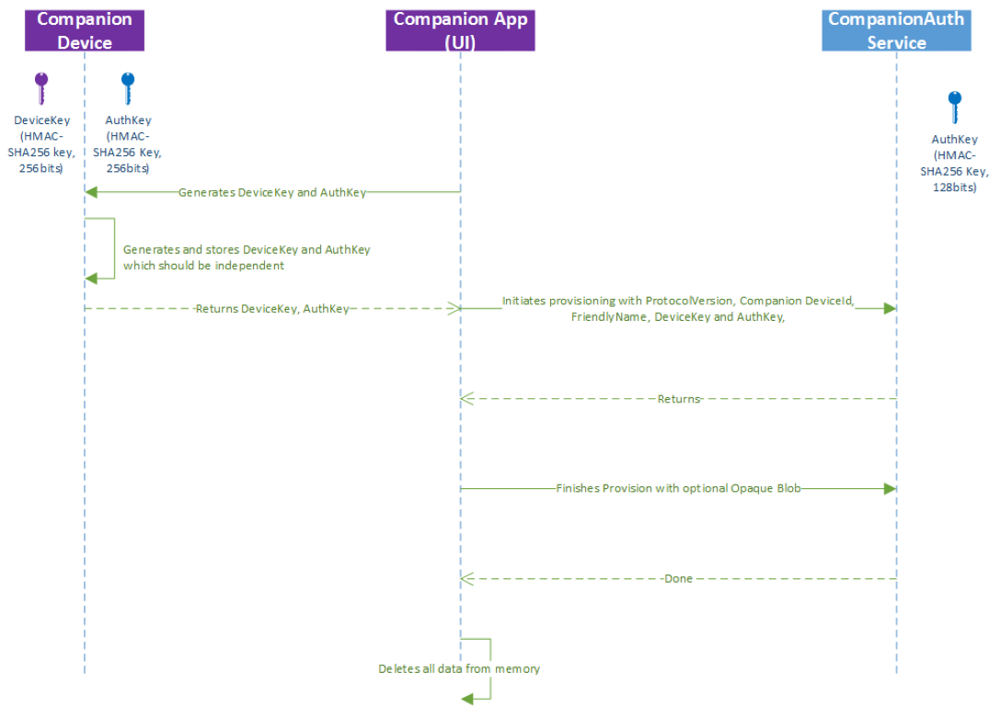

# <a name="windows-unlock-with-windows-hello-companion-iot-devices"></a>Разблокировка Windows с помощью устройств-компаньонов (IoT) для Windows Hello

Устройство-компаньон Windows Hello— это устройство, которое может взаимодействовать с настольным компьютером Windows 10 для повышения удобства процедуры проверки подлинности пользователя. При работе с платформой сопутствующих устройств для Windows Hello устройство-компаньон открывает широкие возможности использования Windows Hello, даже если функция биометрии недоступна (например, на компьютере с Windows 10 отсутствует камера для проверки подлинности по лицу или устройство для считывания отпечатков пальцев).

> **Примечание.** Платформа сопутствующих устройств для Windows Hello — это специальная функция, доступная лишь некоторым разработчикам приложений. Чтобы использовать эту платформу, ваше приложение должно быть особым образом подготовлено к работе корпорацией Майкрософт и содержать ограниченную возможность *secondaryAuthenticationFactor* в своем манифесте. Чтобы получить утверждение, напишите на адрес [cdfonboard@microsoft.com](mailto:cdfonboard@microsoft.com).

## <a name="introduction"></a>Введение

> Видеообзор см. в презентации [Разблокировка Windows с помощью устройств IoT](https://channel9.msdn.com/Events/Build/2016/P491), представленной на конференции Build2016 на веб-сайте Channel 9.

> Примеры кода см. в [Репозитории Github платформы сопутствующих устройств для Windows Hello](https://github.com/Microsoft/companion-device-framework).

### <a name="use-cases"></a>Варианты использования

Существует множество способов использования платформы сопутствующих устройств Windows Hello для реализации удобной разблокировки Windows с помощью устройства-компаньона. Например, пользователи могут делать следующее:

- Подключить свое сопутствующее устройство к компьютеру через USB-порт, нажать кнопку на устройстве и автоматически разблокировать компьютер.
- Носить с собой телефон, уже связанный с компьютером через Bluetooth. После нажатия на клавишу "ПРОБЕЛ" на компьютере на телефон приходит уведомление. Подтвердить его, после чего компьютер разблокируется.
- Приложить сопутствующее устройство к NFC-сканеру, чтобы быстро разблокировать компьютер.
- Носить фитнес-браслет, владелец которого уже прошел проверку подлинности с его помощью. Когда пользователь подходит к компьютеру и выполняет особый жест (например, хлопок), происходит разблокировка компьютера.

### <a name="biometric-enabled-windows-hello-companion-devices"></a>Устройства-компаньоны для Windows Hello с поддержкой биометрии

Если устройство-компаньон поддерживает биометрию, в некоторых случаях [биометрическая платформа Windows](https://msdn.microsoft.com/library/windows/hardware/mt608302(v=vs.85).aspx) может быть более удобным решением, чем платформа сопутствующих устройств для Windows Hello. Напишите на адрес [cdfonboard@microsoft.com](mailto:cdfonboard@microsoft.com), и мы поможем вам выбрать правильный подход.

### <a name="components-of-the-solution"></a>Компоненты решения

На схеме ниже представлены компоненты решения, а также указано, кто отвечает за их создание.


Платформа сопутствующих устройств для Windows Hello реализована как служба под управлением Windows (в этой статье она носит название службы проверки подлинности устройств-компаньонов). Эта служба отвечает за создание маркера разблокировки, который должен быть защищен ключом HMAC, хранящимся на устройстве-компаньоне Windows Hello. Это гарантирует, что для доступа к маркеру разблокировки будет необходимо использовать само устройство-компаньон Windows Hello. Для каждого кортежа (компьютер, пользователь Windows) создается уникальный маркер разблокировки.

Условия успешной интеграции с платформой сопутствующих устройств для Windows Hello:

- Наличие приложения [универсальной платформы Windows (UWP)](https://msdn.microsoft.com/windows/uwp/get-started/universal-application-platform-guide) для устройства-компаньона Windows Hello, скачанного из Магазина приложений для Windows. 
- Возможность создать два 256-битных ключа HMAC на устройстве-компаньоне Windows Hello и сформировать код HMAC с его помощью (с использованием алгоритма SHA-256).
- Верно настроенные параметры безопасности на настольном компьютере с Windows 10. Этот PIN-код потребуется службе проверки подлинности устройств-компаньонов, чтобы выполнить настройку, прежде чем к ней будет подключено устройство-компаньон Windows Hello. Пользователям необходимо задать PIN-код в разделе "Параметры" > "Учетные записи" > "Параметры входа".

Помимо указанных выше требований, приложение устройства-компаньона Windows Hello также отвечает за выполнение следующих процессов:

- Взаимодействие с пользователем и отображение фирменной символики во время начальной регистрации, а также последующая отмена регистрации устройства-компаньона Windows Hello.
- Работа в фоновом режиме, обнаружение устройства-компаньона Windows Hello, подключение к этому устройству и службе проверки подлинности устройств-компаньонов.
- Обработка ошибок

Обычно сопутствующие устройства поставляются с приложением для начальной настройки, например для первоначальной настройки фитнес-браслета. В подобном приложении описанные в этом документе функции могут быть уже реализованы. В этом случае отдельное приложение не потребуется.  

### <a name="user-signals"></a>Сигналы пользователя

Каждое устройство-компаньон Windows Hello должно работать в связке с приложением, поддерживающим три сигнала пользователя. Эти сигналы могут быть в форме действий или жестов.

- **Сигнал намерения**: позволяет пользователю выражать свое намерение разблокировать компьютер, например путем нажатия кнопки на устройстве-компаньоне Windows Hello. Сигнал намерения должен поступать c **устройства-компаньона Windows Hello**.
- **Сигнал присутствия пользователя**: подтверждает присутствие пользователя. Устройство-компаньон Windows Hello может, например, запросить PIN-код, прежде чем его можно будет использовать для разблокировки компьютера (не путать с PIN-кодом компьютера), либо запросить нажатие кнопки.
- **Сигнал уточнения**: уточняет, какой компьютер с Windows 10 пользователь хочет разблокировать, если на устройстве-компаньоне Windows Hello доступно несколько вариантов.

Любое число этих сигналов можно объединить в один сигнал. Сигналы присутствия пользователя и намерения должны запрашиваться при каждом использовании.

### <a name="registration-and-future-communication-between-a-pc-and-windows-hello-companion-devices"></a>Регистрация и дальнейшая связь между компьютером и устройствами-компаньонами Windows Hello

Перед подключением устройства-компаньона Windows Hello к платформе сопутствующих устройств Windows Hello его необходимо зарегистрировать на этой платформе. Приложение устройства-компаньона Windows Hello управляет всеми этапами процесса регистрации.

Связь между устройством-компаньоном Windows Hello и настольным компьютером с Windows 10 может быть множественной (то есть одно устройство-компаньон можно использовать для нескольких настольных компьютеров с Windows 10). Однако каждое устройство-компаньон Windows Hello можно использовать только для одного пользователя на каждом настольном компьютере с Windows 10.   

Прежде чем устройство-компаньон Windows Hello сможет обмениваться данными с компьютером, для устройства и компьютера необходимо выбрать общий способ передачи данных. Этот способ выбирает приложение устройства-компаньона Windows Hello. Платформа сопутствующих устройств Windows Hello не накладывает какие-либо ограничения на способ передачи данных (через USB, NFC, Wi-Fi, Bluetooth, BLE и т. д.) или протокол, используемый между устройством-компаньоном Windows Hello и его приложением на настольном компьютере с Windows 10. Однако платформа предлагает некоторые рекомендации по безопасности на транспортном уровне, которые описаны в разделе "Требования к безопасности" в этом документе. За предоставление этих требований несет ответственность поставщик устройства. Платформа их не предоставляет.


## <a name="user-interaction-model"></a>Модель взаимодействия с пользователем

### <a name="windows-hello-companion-device-app-discovery-installation-and-first-time-registration"></a>Обнаружение, установка и первоначальная регистрация приложения устройства-компаньона Windows Hello

Обычный рабочий процесс для пользователя выглядит следующим образом:

- Пользователь настраивает PIN-код на каждом из целевых настольных компьютеров с Windows 10, которые требуется разблокировать с помощью устройства-компаньона Windows Hello.
- Пользователь запускает приложение устройства-компаньона Windows Hello на своем настольном компьютере с Windows 10, чтобы зарегистрировать на нем свое устройство-компаньон Windows Hello.

Примечание.

- Мы рекомендуем оптимизировать и, если возможно, автоматизировать процессы обнаружения, скачивания и запуска приложения устройства-компаньона Windows Hello (например, приложение можно скачать, приложив устройство-компаньон к NFC-сканеру на настольном компьютере с Windows 10). Однако за выполнение этой процедуры отвечают устройство-компаньон Windows Hello и его приложение.
- В корпоративной среде приложение устройства-компаньона Windows Hello можно развернуть через систему MDM.
- Приложение устройства-компаньона Windows Hello отвечает за отправку пользователю сообщений об ошибках в ходе регистрации.

### <a name="registration-and-de-registration-protocol"></a>Протокол регистрации и ее отмены

На схеме ниже показано, как устройство-компаньон Windows Hello взаимодействует со службой проверки подлинности устройств-компаньонов при регистрации.  



В нашем протоколе используются два ключа:

- ключ устройства (**devicekey**) применяется для защиты маркеров разблокировки, используемых компьютером для разблокировки Windows;
- ключ проверки подлинности (**authkey**) используется для взаимной проверки подлинности устройства-компаньона Windows Hello и службы проверки подлинности устройств-компаньонов.

Устройство-компаньон Windows Hello и его приложение обмениваются этими ключами при регистрации. В итоге устройство-компаньон Windows Hello и его приложение должны использовать безопасный способ транспортировки для защиты ключей.

Примечание. Несмотря на то, что на схеме выше представлен процесс создания двух ключей HMAC на устройстве-компаньоне Windows Hello, приложение также может создать их и отправить устройству-компаньону Windows Hello для хранения.

### <a name="starting-authentication-flows"></a>Начало процессов проверки подлинности

Пользователь может начать процесс входа на настольном компьютере с Windows 10 с помощью платформы сопутствующих устройств Windows Hello (то есть отправить сигнал намерения) двумя способами:

- открыть крышку ноутбука, нажать клавишу "ПРОБЕЛ" или провести пальцем вверх по экрану компьютера;
- выполнить жест или действие на устройстве-компаньоне Windows Hello.

Выбор одного из этих способов в качестве начальной точки делает устройство-компаньон Windows Hello. Платформа сопутствующих устройств Windows Hello сообщит приложению устройства-компаньона, если произойдет первое событие. Чтобы узнать о захвате второго события, приложение устройства-компаньона Windows Hello должно отправить запрос на устройство-компаньон. Это позволяет устройству-компаньону Windows Hello получать сигнал намерения, прежде чем произойдет разблокировка.

### <a name="windows-hello-companion-device-credential-provider"></a>Поставщик учетных данных для устройств-компаньонов Windows Hello

В Windows 10 появился новый поставщик учетных данных, работающий со всеми устройствами-компаньонами Windows Hello.

Поставщик учетных данных для устройства-компаньона Windows Hello отвечает за запуск фоновой задачи устройства-компаньона путем активации триггера. Первоначальная настройка триггера происходит при выходе компьютера из спящего режима и отображении экрана блокировки. Вторая настройка происходит, когда на компьютере открывается пользовательский интерфейс входа и выбирается плитка поставщика учетных данных для устройства-компаньона Windows Hello.

Вспомогательная библиотека приложения устройства-компаньона Windows Hello будет ожидать изменения состояния экрана блокировки и отправит событие, соответствующее фоновой задаче устройства-компаньона Windows Hello.

При выполнении нескольких фоновых задач устройства-компаньона Windows Hello первая из этих задач, завершившая процесс проверки подлинности, разблокирует компьютер. Служба проверки подлинности устройств-компаньонов проигнорирует остальные вызовы проверки подлинности.

Приложение устройства-компаньона Windows Hello управляет всеми этапами процесса на стороне устройства-компаньона Windows Hello. Платформа сопутствующих устройств Windows Hello не управляет этой частью процесса взаимодействия с пользователем. В частности, поставщик проверки подлинности с помощью устройства-компаньона сообщает приложению устройства-компаньона Windows Hello (через фоновое приложение) об изменениях в состоянии пользовательского интерфейса входа (например, если экран блокировки отключен или пользователь отключил его, нажав клавишу "ПРОБЕЛ"). Приложение устройства-компаньона Windows Hello отвечает за формирование взаимодействия с пользователем на основе этих изменений (например, при нажатии клавиши "ПРОБЕЛ" и отключении экрана блокировки начинается поиск устройства через порт USB).

Платформа сопутствующих устройств Windows Hello предоставит на выбор приложению устройства-компаньона Windows Hello набор (локализованных) текстовых сообщений и сообщений об ошибках. Эти сообщения будут отображаться поверх экрана блокировки (или в пользовательском интерфейсе входа). Дополнительные сведения можно найти в разделе "Обработка сообщений и ошибок".

### <a name="authentication-protocol"></a>Протокол проверки подлинности

После запуска фоновой задачи, связанной с приложением устройства-компаньона Windows Hello, она отправляет устройству-компаньону Windows Hello запрос на выполнение проверки значения HMAC, вычисленного службой проверки подлинности устройств-компаньонов, а также запрос на расчет двух значений HMAC:
- Проверка значения HMAC от службы = HMAC (элемент nonce ключа проверки подлинности и службы || элемент nonce устройства || элемент nonce сеанса).
- Вычисление значения HMAC ключа устройства с элементом nonce.
- Вычисление значения HMAC ключа проверки подлинности с первым значением HMAC, объединенным с элементом nonce, который был сформирован службой проверки подлинности устройств-компаньонов.

Служба использует второе вычисленное значение для проверки подлинности устройства и предотвращения атак с имитацией перехваченного трафика на транспортном канале.


## <a name="lifecycle-management"></a>Управление жизненным циклом

### <a name="register-once-use-everywhere"></a>Одна регистрация для повсеместного использования

Без внутреннего сервера пользователям потребуется отдельно зарегистрировать свое устройство-компаньон Windows Hello на каждом настольном компьютере с Windows 10.

Поставщик или изготовитель оборудования сопутствующего устройства может реализовать веб-службу для перемещения состояния регистрации между настольными компьютерами или мобильными устройствами с Windows 10. Дополнительные сведения можно найти в разделе "Служба роуминга, отзыва и фильтрации".

### <a name="pin-management"></a>Управление ПИН-кодом

Перед использованием устройства-компаньона необходимо задать PIN-код на настольном компьютере с Windows 10. Это гарантия того, что в случае отказа устройства-компаньона Windows Hello у пользователя останется резервная копия. PIN-код скрыт от приложений— им управляет Windows. Пользователь может изменить его в разделе "Параметры" > "Учетные записи" > "Параметры входа".

### <a name="management-and-policy"></a>Управление и политика

Пользователи могут удалить устройство-компаньон Windows Hello с настольного компьютера с Windows 10, запустив приложение устройства-компаньона Windows Hello на этом компьютере.

У предприятий есть два способа управления платформой сопутствующих устройств Windows Hello:

- включение или отключение этой функции;
- определение списка разрешений устройств-компаньонов Windows Hello, которым разрешено использовать хранилище приложений для Windows.

Платформа сопутствующих устройств Windows Hello не предоставляет централизованного способа ведения учета доступных устройств-компаньонов или метода расширенной фильтрации разрешенных экземпляров устройств-компаньонов Windows Hello определенного типа (например, разрешено использование только устройств-компаньонов с серийным номером от X до Y). Однако разработчики приложений могут создать службу с поддержкой этих функций. Дополнительные сведения см. в разделе "Служба роуминга, отзыва и фильтрации".

### <a name="revocation"></a>Отзыв

Платформа сопутствующих устройств Windows Hello не поддерживает удаление устройства-компаньона с конкретного настольного компьютера с Windows 10 в удаленном режиме. Вместо этого пользователи могут удалить устройство-компаньон Windows Hello через приложение устройства-компаньона Windows Hello на соответствующем настольном компьютере с Windows 10.

Однако поставщики сопутствующих устройств могут создать службу с поддержкой функции удаленного отзыва. Дополнительные сведения можно найти в разделе "Служба роуминга, отзыва и фильтрации".

### <a name="roaming-and-filter-services"></a>Службы роуминга и фильтрации

Поставщики сопутствующих устройств могут реализовать веб-службу для использования в следующих сценариях:

- Служба фильтрации для предприятия: предприятие может ограничить набор устройств-компаньонов Windows Hello, которым разрешено работать в корпоративной среде, до нескольких устройств от определенного поставщика. Например, компания Contoso может заказать 10000 сопутствующих устройств модели Y от поставщика X и разрешить только этим устройствам работать на домене Contoso (запрет также распространяется на все остальные модели устройств от поставщика X).
- Данные инвентаризации. Предприятие может определить список существующих сопутствующих устройств, используемых в корпоративной среде.
- Отзыв в реальном времени. Если сотрудник сообщит об утере или краже своего сопутствующего устройства, это устройство можно отозвать с помощью веб-службы.
- Роуминг: пользователю нужно лишь однажды пройти процедуру регистрации устройства, после чего оно будет работать со всеми настольными компьютерами и мобильными устройствами с Windows 10 этого пользователя.

Для реализации этих функций необходимо, чтобы приложение устройства-компаньона Windows Hello сверялось с веб-службой при регистрации и использовании. Приложение устройства-компаньона Windows Hello может выполнять оптимизацию для сценариев с использованием кэшированных данных о входе, например запрашивать сверку с веб-службой только один раз в день (при этом время отзыва может увеличиться до одного дня).  

## <a name="windows-hello-companion-device-framework-api-model"></a>Модель API платформы сопутствующих устройств Windows Hello

### <a name="overview"></a>Обзор

Приложение устройства-компаньона Windows Hello должно состоять из двух компонентов: внешнего приложения с пользовательским интерфейсом для регистрации устройства и ее отмены, а также фоновой задачи для выполнения проверки подлинности.

Общий процесс API выглядит следующим образом:

1. Регистрация устройства-компаньона Windows Hello
    * убедитесь, что устройство находится поблизости и отправьте запрос для определения его доступности (если необходимо);
    * создайте два ключа HMAC (на стороне устройства-компаньона или его приложения);
    * вызовите метод RequestStartRegisteringDeviceAsync;
    * вызовите метод FinishRegisteringDeviceAsync;
    * убедитесь, что приложение устройства-компаньона Windows Hello сохранило ключи HMAC (если такая функция поддерживается) и удалило их копии.
2. Регистрация фоновой задачи
3. Ожидание нужного события фоновой задачи
    * WaitingForUserConfirmation: дождитесь возникновения этого события, если для запуска процесса проверки подлинности пользователь должен выполнить действие или жест на стороне устройства-компаньона Windows Hello;
    * CollectingCredential: дождитесь возникновения этого события, если для запуска процесса проверки подлинности с помощью устройства-компаньона Windows Hello необходимо, чтобы пользователь выполнил действие или жест на компьютере (например, нажал клавишу "ПРОБЕЛ");
    * другой триггер, например смарт-карта: отправьте запрос текущего состояния проверки подлинности для вызова нужных API.
4. Уведомление пользователя об ошибках или дальнейших действиях путем вызова ShowNotificationMessageAsync. Этот API следует вызывать только после получения сигнала о намерении
5. Разблокировка
    * убедитесь, что сигналы намерения и присутствия пользователя получены;
    * вызовите StartAuthenticationAsync;
    * свяжитесь с устройством-компаньоном, чтобы выполнить необходимые действия HMAC;
    * вызовите метод FinishAuthenticationAsync.
6. Отмена регистрации устройства-компаньона Windows Hello по запросу пользователя (например, при утере устройства-компаньона)
    * перечислите устройство-компаньон Windows Hello для выполнившего вход пользователя с помощью FindAllRegisteredDeviceInfoAsync;
    * отмените его регистрацию с помощью UnregisterDeviceAsync.

### <a name="registration-and-de-registration"></a>Регистрация и ее отмена

Для осуществления регистрации требуется выполнить два вызова API в адрес службы проверки подлинности устройств-компаньонов: RequestStartRegisteringDeviceAsync и FinishRegisteringDeviceAsync.

Перед выполнением этих вызовов приложение устройства-компаньона Windows Hello должно убедиться в доступности устройства-компаньона Windows Hello. Если устройство-компаньон Windows Hello отвечает за создание ключей HMAC (ключи устройства и проверки подлинности), его приложение должно также запросить у устройства их создание перед совершением любого из указанных выше вызовов. Если приложение устройства-компаньона Windows Hello отвечает за создание ключей HMAC, оно должно создать их перед выполнением указанных выше вызовов.

Кроме того, в рамках вызова первого API (RequestStartRegisteringDeviceAsync) приложение устройства-компаньона Windows Hello должно определить возможности устройства (например, поддерживает ли оно безопасное хранилище для ключей HMAC) и подготовиться к его передаче в составе вызова API. Если одно и то же приложение устройства-компаньона Windows Hello используется для управления несколькими версиями одного и того же устройства-компаньона, а возможности устройства изменяются (и для их определения требуется отправка запроса устройству), рекомендуется отправить эти запросы до вызова первого API.   

Первый API (RequestStartRegisteringDeviceAsync) вернет дескриптор, используемый вторым API (FinishRegisteringDeviceAsync). Первый вызов для регистрации запустит запрос на PIN-код, чтобы проверить присутствие пользователя. Если PIN-код не настроен, вызов завершится с ошибкой. Приложение устройства-компаньона Windows Hello может также отправить запрос на проверку наличия PIN-кода через вызов KeyCredentialManager.IsSupportedAsync. Вызов RequestStartRegisteringDeviceAsync также может завершиться с ошибкой, если использование устройств-компаньонов Windows Hello отключено в рамках политики.

Результат первого вызова возвращается через перечисление SecondaryAuthenticationFactorRegistrationStatus:

```C#
{
    Failed = 0,         // Something went wrong in the underlying components
    Started,            // First call succeeded
    CanceledByUser,     // User cancelled PIN prompt
    PinSetupRequired,   // PIN is not set up
    DisabledByPolicy,   // Companion device framework or this app is disabled
}
```

Второй вызов (FinishRegisteringDeviceAsync) завершает регистрацию. В рамках процесса регистрации приложение устройства-компаньона Windows Hello может хранить данные конфигурации сопутствующего устройства в службе проверки подлинности устройств-компаньонов. Размер этих данных не может превышать 4КБ. Эти данные будут доступны приложению устройства-компаньона Windows Hello при проверке подлинности. Помимо прочего, эти данные можно использовать для подключения к устройству-компаньону Windows Hello, например по MAC-адресу. Также данные конфигурации можно использовать, если в устройстве-компаньоне Windows Hello нет хранилища и ему требуется хранить данные на компьютере. Обратите внимание, что любые конфиденциальные данные, хранящиеся в составе данных конфигурации, должны быть зашифрованы с помощью ключа, известного только устройству-компаньону Windows Hello. Также с учетом того, что данные конфигурации хранятся в службе Windows, они доступны приложению устройства-компаньона Windows Hello во всех профилях пользователя.

Приложение устройства-компаньона Windows Hello может вызвать AbortRegisteringDeviceAsync для отмены регистрации и передачи кода ошибки. Служба проверки подлинности сопутствующих устройств занесет ошибку в журнал данных телеметрии. Наглядным примером такого вызова может послужить ситуация, в которой на устройстве-компаньоне Windows Hello возникла неисправность, и оно не смогло завершить регистрацию (например, устройство не может сохранить ключи HMAC или потеряно подключение по Bluetooth).

Приложение устройства-компаньона Windows Hello должно предоставить пользователю возможность отмены регистрации устройства-компаньона Windows Hello на настольном компьютере с Windows 10 (например, при утере устройства-компаньона или приобретении более новой версии). Если пользователь выбирает этот вариант, приложение устройства-компаньона Windows Hello должно вызвать UnregisterDeviceAsync. Этот вызов от приложения устройства-компаньона Windows Hello приведет к тому, что служба проверки подлинности устройств-компаньонов удалит все данные (включая ключи HMAC), связанные с определенным кодом устройства и идентификатором приложения, совершившего вызов на стороне компьютера. Этот API не пытается удалить ключи HMAC на стороне устройства-компаньона Windows Hello или его приложения. Их удаляет приложение устройства-компаньона Windows Hello.

Приложение устройства-компаньона Windows Hello отвечает за отображение сообщений об ошибках в ходе регистрации и ее отмены.

```C#
using System;
using Windows.Security.Authentication.Identity.Provider;
using Windows.Storage.Streams;
using Windows.Security.Cryptography;
using Windows.UI.Popups;

namespace SecondaryAuthFactorSample
{
    public class DeviceRegistration
    {

        public void async OnRegisterButtonClick()
        {
            //
            // Pseudo function, the deviceId should be retrieved by the application from the device
            //
            string deviceId = await ReadSerialNumberFromDevice();

            IBuffer deviceKey = CryptographicBuffer.GenerateRandom(256/8);
            IBuffer mutualAuthenticationKey = CryptographicBuffer.GenerateRandom(256/8);

            SecondaryAuthenticationFactorRegistration registrationResult =
                await SecondaryAuthenticationFactorRegistration.RequestStartRegisteringDeviceAsync(
                    deviceId,  // deviceId: max 40 wide characters. For example, serial number of the device
                    SecondaryAuthenticationFactorDeviceCapabilities.SecureStorage |
                        SecondaryAuthenticationFactorDeviceCapabilities.HMacSha256 |
                        SecondaryAuthenticationFactorDeviceCapabilities.StoreKeys,
                    "My test device 1", // deviceFriendlyName: max 64 wide characters. For example: John's card
                    "SAMPLE-001", // deviceModelNumber: max 32 wide characters. The app should read the model number from device.
                    deviceKey,
                    mutualAuthenticationKey);

            switch(registerResult.Status)
            {
            case SecondaryAuthenticationFactorRegistrationStatus.Started:
                //
                // Pseudo function:
                // The app needs to retrieve the value from device and set into opaqueBlob
                //
                IBuffer deviceConfigData = ReadConfigurationDataFromDevice();

                if (deviceConfigData != null)
                {
                    await registrationResult.Registration.FinishRegisteringDeviceAsync(deviceConfigData); //config data limited to 4096 bytes
                    MessageDialog dialog = new MessageDialog("The device is registered correctly.");
                    await dialog.ShowAsync();
                }
                else
                {
                    await registrationResult.Registration.AbortRegisteringDeviceAsync("Failed to connect to the device");
                    MessageDialog dialog = new MessageDialog("Failed to connect to the device.");
                    await dialog.ShowAsync();
                }
                break;

            case SecondaryAuthenticationFactorRegistrationStatus.CanceledByUser:
                MessageDialog dialog = new MessageDialog("You didn't enter your PIN.");
                await dialog.ShowAsync();
                break;

            case SecondaryAuthenticationFactorRegistrationStatus.PinSetupRequired:
                MessageDialog dialog = new MessageDialog("Please setup PIN in settings.");
                await dialog.ShowAsync();
                break;

            case SecondaryAuthenticationFactorRegistrationStatus.DisabledByPolicy:
                MessageDialog dialog = new MessageDialog("Your enterprise prevents using this device to sign in.");
                await dialog.ShowAsync();
                break;
            }
        }

        public void async UpdateDeviceList()
        {
            IReadOnlyList<SecondaryAuthenticationFactorInfo> deviceInfoList =
                await SecondaryAuthenticationFactorRegistration.FindAllRegisteredDeviceInfoAsync(
                    SecondaryAuthenticationFactorDeviceFindScope.User);

            if (deviceInfoList.Count > 0)
            {
                foreach (SecondaryAuthenticationFactorInfo deviceInfo in deviceInfoList)
                {
                    //
                    // Add deviceInfo.FriendlyName and deviceInfo.DeviceId into a combo box
                    //
                }
            }
        }

        public void async OnUnregisterButtonClick()
        {
            string deviceId;
            //
            // Read the deviceId from the selected item in the combo box
            //
            await SecondaryAuthenticationFactorRegistration.UnregisterDeviceAsync(deviceId);
        }
    }
}
```

### <a name="authentication"></a>Проверка подлинности

Для проверки подлинности требуется совершить два вызова API в адрес службы проверки подлинности сопутствующих устройств: StartAuthenticationAsync и FinishAuthencationAsync.

Первый API инициирования возвращает дескриптор, используемый вторым API.  Помимо прочего, первый вызов возвращает код nonce, для которого (после объединения с другими элементами) необходимо создать код HMAC в соответствии с кодом устройства, хранящимся на устройстве-компаньоне Windows Hello. Второй вызов возвращает результаты создания HMAC на основе ключа устройства и может привести к успешной проверке подлинности (то есть пользователь увидит свой рабочий стол).

Первый API инициации (StartAuthenticationAsync) может завершиться с ошибкой, если после первоначальной регистрации это устройство-компаньон Windows Hello было отключено политикой. Он также может завершиться с ошибкой, если вызов API был выполнен за пределами состояний WaitingForUserConfirmation или CollectingCredential (об этом подробнее рассказывается далее в этом разделе). К тому же исходу может привести совершение этого вызова через приложение незарегистрированного сопутствующего устройства. Перечисление SecondaryAuthenticationFactorAuthenticationStatus указывает все возможные результаты:

```C#
{
    Failed = 0,                     // Something went wrong in the underlying components
    Started,
    UnknownDevice,                  // Companion device app is not registered with framework
    DisabledByPolicy,               // Policy disabled this device after registration
    InvalidAuthenticationStage,     // Companion device framework is not currently accepting
                                    // incoming authentication requests
}
```

Вызов второго API (FinishAuthencationAsync) может завершиться с ошибкой, если срок действия кода nonce, предоставленного после первого вызова, истек (20 секунд). Перечисление SecondaryAuthenticationFactorFinishAuthenticationStatus указывает все возможные результаты:

```C#
{
    Failed = 0,     // Something went wrong in the underlying components
    Completed,      // Success
    NonceExpired,   // Nonce is expired
}
```

Время выполнения этих двух вызовов API (StartAuthenticationAsync и FinishAuthencationAsync) должно соответствовать получению устройством-компаньоном Windows Hello сигналов намерения, присутствия пользователя и уточнения (дополнительные сведения см. в разделе "Сигналы пользователя". Например, второй вызов следует отправлять только после получения сигнала намерения. Другими словами, компьютер не должен разблокироваться, если пользователь не выразил соответствующее намерение. Пояснение. Предположим, что для разблокировки компьютера устройство должно находиться в радиусе действия подключения Bluetooth. В этом случае явный сигнал намерения должен отправляться иным образом, иначе компьютер разблокируется, если пользователь пройдет мимо него по пути на кухню. Кроме того, срок действия кода nonce, возвращенного после первого вызова, ограничен 20 секундами и истечет по прошествии этого времени. То есть первый вызов следует выполнять, только если приложение устройства-компаньона Windows Hello явно видит присутствие устройства-компаньона, например когда это устройство подключено к USB-порту или соприкасается с NFC-сканером. При использовании Bluetooth необходимо проявлять осторожность, чтобы не разрядить аккумулятор компьютера и не помешать другим процессам, использующим Bluetooth, в момент проверки присутствия устройства-компаньона Windows Hello. Кроме того, если необходимо отправить сигнал присутствия пользователя (например, путем ввода PIN-кода), рекомендуется совершать первый вызов только после получения сигнала.

Платформа сопутствующих устройств Windows Hello помогает приложению устройства-компаньона Windows Hello принять обоснованное решение о времени выполнения двух указанных вызовов, предоставляя точные данные о расположении пользователя в процессе проверки подлинности. Платформа сопутствующих устройств Windows Hello предоставляет эту возможность, отправляя фоновой задаче приложения уведомление об изменении состояния блокировки.


Ниже указано подробное описание каждого из этих состояний:

| Состояние                         | Описание                                                                                                                                                                                                                                                                                                                                                                                                                                                                                                                                                                                                                                                                                                                                                                                                                                                                                                               |
|----------------------------   |-----------------------------------------------------------------------------------------------------------------------------------------------------------------------------------------------------------------------------------------------------------------------------------------------------------------------------------------------------------------------------------------------------------------------------------------------------------------------------------------------------------------------------------------------------------------------------------------------------------------------------------------------------------------------------------------------------------------------------------------------------------------------------------------------------------------------------------------------------------------------------------------------------------------------    |
| WaitingForUserConfirmation    | Это событие уведомления об изменении состояния активируется при отключении экрана блокировки (например, если пользователь нажал сочетание клавиш Windows + L). Не рекомендуется запрашивать сообщения об ошибках в случае возникновения проблем с поиском устройства при этом состоянии. Как правило, рекомендуется отображать сообщения только при наличии сигнала намерения. Приложение устройства-компаньона Windows Hello должно вызвать первый API для проверки подлинности в этом состоянии, если устройство-компаньон получает сигнал намерения (например, при использовании NFC-сканера, нажатии кнопки на устройстве-компаньоне или выполнении определенного жеста, такого как хлопок), а фоновая задача приложения устройства-компаньона Windows Hello получает от устройства-компаньона подтверждение обнаружения сигнала намерения. В противном случае, если при запуске процесса проверки подлинности приложению устройства-компаньона Windows Hello требуется компьютер (пользователю необходимо провести пальцем вверх по экрану блокировки или нажать клавишу "ПРОБЕЛ"), приложение устройства-компаньона Windows Hello должно дождаться возникновения следующего состояния (CollectingCredential).     |
| CollectingCredential          | Это событие уведомления об изменении состояния активируется, если пользователь открывает крышку ноутбука, нажимает любую клавишу на клавиатуре или проводит пальцем вверх по экрану блокировки. Если для получения сигнала намерения устройству-компаньону Windows Hello требуются указанные действия, то приложение устройства-компаньона Windows Hello должно приступить к его получению (например, с помощью всплывающего уведомления на устройстве-компаньоне с запросом на разблокировку компьютера для пользователя). Это подходящий момент для отображения сообщений об ошибках, если приложению устройства-компаньона Windows Hello требуется, чтобы пользователь отправил сигнал своего присутствия с устройства-компаньона (например, путем ввода PIN-кода на этом устройстве).                                                                                                                                                                                                                                                                                                                                            |
| SuspendingAuthentication      | Если приложение устройства-компаньона Windows Hello получает это состояние, значит служба проверки подлинности устройств-компаньонов перестала принимать запросы на проверку подлинности.                                                                                                                                                                                                                                                                                                                                                                                                                                                                                                                                                                                                                                                                                                                                                                            |
| CredentialCollected           | Это состояние означает, что другое приложение устройства-компаньона Windows Hello вызвало второй API, и служба проверки подлинности устройств-компаньонов проверяет отправленные данные. На этом этапе служба проверки подлинности устройств-компаньонов не принимает другие запросы на проверку подлинности, если только проверка текущего запроса не завершится с ошибкой. Приложение устройства-компаньона Windows Hello должно оставаться на связи, пока не будет достигнуто следующее состояние.                                                                                                                                                                                                                                                                                                                                                                                                                                                                                                                                   |
| CredentialAuthenticated       | Это состояние означает, что отправленные учетные данные подошли. Состояние credentialAuthenticated содержит код устройства-компаньона Windows Hello, успешно прошедшего проверку. Приложение устройства-компаньона Windows Hello обязательно должно проверить этот код и подтвердить, что он принадлежит связанному с ним устройству. В противном случае приложение устройства-компаньона Windows Hello не должно показывать процессы, следующие за проверкой подлинности (например, сообщение об успешной проверке на устройстве-компаньоне или, возможно, вибрация этого устройства). Обратите внимание, что если отправленные учетные данные не подошли, состояние изменится на CollectingCredential.                                                                                                                                                                                                                                                                                                                                                                                       |
| StoppingAuthentication        | Проверка подлинности пройдена успешно и пользователь увидел рабочий стол. Пора завершить фоновую задачу. Прежде чем выходить из фоновой задачи, необходимо явно отменить регистрацию обработчика StageEvent. Это поможет быстро выйти из фоновой задачи.                                                                                                                                                                                                                                                                                                                                                                                                                                                                                                                                                                                                                                                                                                                                                                                                                                       |


Приложения устройств-компаньонов Windows Hello должны вызывать первые два API проверки подлинности только при первых двух состояниях. Приложения устройств-компаньонов Windows Hello должны проверять, в какой ситуации активируется это событие. Есть два варианта: разблокировка или следующие за ней процессы. На текущий момент поддерживается только разблокировка. В следующих выпусках может быть реализована поддержка сценариев после разблокировки. Перечисление SecondaryAuthenticationFactorAuthenticationScenario включает оба этих варианта:

```C#
{
    SignIn = 0,         // Running under lock screen mode
    CredentialPrompt,   // Running post unlock
}
```

Пример полного кода:

```C#
using System;
using Windows.Security.Authentication.Identity.Provider;
using Windows.Storage.Streams;
using Windows.Security.Cryptography;
using System.Threading;
using Windows.ApplicationModel.Background;

namespace SecondaryAuthFactorSample
{
    public sealed class AuthenticationTask : IBackgroundTask
    {
        private string _deviceId;
        private static AutoResetEvent _exitTaskEvent = new AutoResetEvent(false);
        private static IBackgroundTaskInstance _taskInstance;
        private BackgroundTaskDeferral _deferral;

        private void Authenticate()
        {
            int retryCount = 0;

            while (retryCount < 3)
            {
                //
                // Pseudo code, the svcAuthNonce should be passed to device or generated from device
                //
                IBuffer svcAuthNonce = CryptographicBuffer.GenerateRandom(256/8);

                SecondaryAuthenticationFactorAuthenticationResult authResult = await
                    SecondaryAuthenticationFactorAuthentication.StartAuthenticationAsync(
                        _deviceId,
                        svcAuthNonce);
                if (authResult.Status != SecondaryAuthenticationFactorAuthenticationStatus.Started)
                {
                    SecondaryAuthenticationFactorAuthenticationMessage message;
                    switch (authResult.Status)
                    {
                        case SecondaryAuthenticationFactorAuthenticationStatus.DisabledByPolicy:
                            message = SecondaryAuthenticationFactorAuthenticationMessage.DisabledByPolicy;
                            break;
                        case SecondaryAuthenticationFactorAuthenticationStatus.InvalidAuthenticationStage:
                            // The task might need to wait for a SecondaryAuthenticationFactorAuthenticationStageChangedEvent
                            break;
                        default:
                            return;
                    }

                    // Show error message. Limited to 512 characters wide
                    await SecondaryAuthenticationFactorAuthentication.ShowNotificationMessageAsync(null, message);
                    return;
                }

                //
                // Pseudo function:
                // The device calculates and returns sessionHmac and deviceHmac
                //
                await GetHmacsFromDevice(
                    authResult.Authentication.ServiceAuthenticationHmac,
                    authResult.Authentication.DeviceNonce,
                    authResult.Authentication.SessionNonce,
                    out deviceHmac,
                    out sessionHmac);
                if (sessionHmac == null ||
                    deviceHmac == null)
                {
                    await authResult.Authentication.AbortAuthenticationAsync(
                        "Failed to read data from device");
                    return;
                }

                SecondaryAuthenticationFactorFinishAuthenticationStatus status =
                    await authResult.Authentication.FinishAuthencationAsync(deviceHmac, sessionHmac);
                if (status == SecondaryAuthenticationFactorFinishAuthenticationStatus.NonceExpired)
                {
                    retryCount++;
                    continue;
                }
                else if (status == SecondaryAuthenticationFactorFinishAuthenticationStatus.Completed)
                {
                    // The credential data is collected and ready for unlock
                    return;
                }
            }
        }

        public void OnAuthenticationStageChanged(
            object sender,
            SecondaryAuthenticationFactorAuthenticationStageChangedEventArgs args)
        {
            // The application should check the args.StageInfo.Stage to determine what to do in next. Note that args.StageInfo.Scenario will have the scenario information (SignIn vs CredentialPrompt).

            switch(args.StageInfo.Stage)
            {
            case SecondaryAuthenticationFactorAuthenticationStage.WaitingForUserConfirmation:
                // Show welcome message
                await SecondaryAuthenticationFactorAuthentication.ShowNotificationMessageAsync(
                    null,
                    SecondaryAuthenticationFactorAuthenticationMessage.WelcomeMessageSwipeUp);
                break;

            case SecondaryAuthenticationFactorAuthenticationStage.CollectingCredential:
                // Authenticate device
                Authenticate();
                break;

            case SecondaryAuthenticationFactorAuthenticationStage.CredentialAuthenticated:
                if (args.StageInfo.DeviceId = _deviceId)
                {
                    // Show notification on device about PC unlock
                }
                break;

            case SecondaryAuthenticationFactorAuthenticationStage.StoppingAuthentication:
                // Quit from background task
                _exitTaskEvent.Set();
                break;
            }

            Debug.WriteLine("Authentication Stage = " + args.StageInfo.AuthenticationStage.ToString());
        }

        //
        // The Run method is the entry point of a background task.
        //
        public void Run(IBackgroundTaskInstance taskInstance)
        {
            _taskInstance = taskInstance;
            _deferral = taskInstance.GetDeferral();

            // Register canceled event for this task
            taskInstance.Canceled += TaskInstanceCanceled;

            // Find all device registred by this application
            IReadOnlyList<SecondaryAuthenticationFactorInfo> deviceInfoList =
                await SecondaryAuthenticationFactorRegistration.FindAllRegisteredDeviceInfoAsync(
                    SecondaryAuthenticationFactorDeviceFindScope.AllUsers);

            if (deviceInfoList.Count == 0)
            {
                // Quit the task silently
                return;
            }
            _deviceId = deviceInfoList[0].DeviceId;
            Debug.WriteLine("Use first device '" + _deviceId + "' in the list to signin");

            // Register AuthenticationStageChanged event
            SecondaryAuthenticationFactorRegistration.AuthenticationStageChanged += OnAuthenticationStageChanged;

            // Wait the task exit event
            _exitTaskEvent.WaitOne();

            _deferral.Complete();
        }

        void TaskInstanceCanceled(IBackgroundTaskInstance sender, BackgroundTaskCancellationReason reason)
        {
            _exitTaskEvent.Set();
        }
    }
}
```

### <a name="register-a-background-task"></a>Регистрация фоновой задачи

При регистрации первого устройства-компаньона Windows Hello приложение сопутствующего устройства должно также зарегистрировать его компонент фоновой задачи, обеспечивающий передачу сведений о проверке подлинности между устройством и службой проверки подлинности устройств-компаньонов.

```C#
using System;
using Windows.Security.Authentication.Identity.Provider;
using Windows.Storage.Streams;
using Windows.ApplicationModel.Background;

namespace SecondaryAuthFactorSample
{
    public class BackgroundTaskManager
    {
        // Register background task
        public static async Task<IBackgroundTaskRegistration> GetOrRegisterBackgroundTaskAsync(
            string bgTaskName,
            string taskEntryPoint)
        {
            // Check if there's an existing background task already registered
            var bgTask = (from t in BackgroundTaskRegistration.AllTasks
                          where t.Value.Name.Equals(bgTaskName)
                          select t.Value).SingleOrDefault();
            if (bgTask == null)
            {
                BackgroundAccessStatus status =
                    BackgroundExecutionManager.RequestAccessAsync().AsTask().GetAwaiter().GetResult();

                if (status == BackgroundAccessStatus.Denied)
                {
                    Debug.WriteLine("Background Execution is denied.");
                    return null;
                }

                var taskBuilder = new BackgroundTaskBuilder();
                taskBuilder.Name = bgTaskName;
                taskBuilder.TaskEntryPoint = taskEntryPoint;
                taskBuilder.SetTrigger(new SecondaryAuthenticationFactorAuthenticationTrigger());
                bgTask = taskBuilder.Register();
                // Background task is registered
            }

            bgTask.Completed += BgTask_Completed;
            bgTask.Progress += BgTask_Progress;

            return bgTask;
        }
    }
}
```

### <a name="errors-and-messages"></a>Ошибки и сообщения

Платформа сопутствующих устройств Windows Hello отвечает за оповещение пользователя об успешном входе или сбое при входе. Платформа сопутствующих устройств Windows Hello предоставит на выбор приложению устройства-компаньона Windows Hello набор (локализованных) текстовых сообщений и сообщений об ошибках. Они отображаются в пользовательском интерфейсе входа.


Приложения устройств-компаньонов Windows Hello могут использовать ShowNotificationMessageAsync для отправки сообщений пользователю в рамках пользовательского интерфейса входа. Этот API следует вызвать при наличии сигнала намерения. Обратите внимание, что сигнал намерения всегда должен поступать с устройства-компаньона Windows Hello.

Существует два типа сообщений: руководство и ошибки.

Сообщения с руководством предназначены для того, чтобы помочь пользователю начать процесс разблокировки. Эти сообщения отображаются для пользователя только один раз на экране блокировки— при первоначальной регистрации устройства. Эти сообщения будут отображаться под экраном блокировки.

Сообщения об ошибках отображаются всегда и будут отображаться после получения сигнала о намерении. С учетом того, что перед отображением сообщений должен быть получен сигнал намерения, а пользователь отправит этот сигнал только с помощью одного из своих устройств-компаньонов, недопустима ситуация, в которой несколько устройств-компаньонов Windows Hello конкурируют с целью отображения сообщений об ошибках. Как следствие, платформа сопутствующих устройств Windows Hello не поддерживает постановку сообщений в какую-либо очередь на отображение. Когда вызывающая сторона запрашивает сообщение об ошибке, оно отображается в течение 5секунд, а все остальные запросы на отображение сообщений об ошибке в течение этого времени отклоняются. По прошествии 5секунд другая вызывающая сторона получает возможность отобразить сообщение об ошибке. Мы не позволяем вызывающим сторонам блокировать канал ошибок.

Сообщения с руководством и сообщения об ошибках выглядят следующим образом. Имя устройства— это параметр, передаваемый приложением устройства-компаньона в составе ShowNotificationMessageAsync.

**Руководство**

- "Проведите пальцем вверх или нажмите клавишу "ПРОБЕЛ", чтобы войти с помощью *имя устройства*".
- "Выполняется настройка сопутствующего устройства. Подождите или используйте другой способ входа."
- "Приложите *имя устройства* к NFC-сканеру, чтобы войти".
- "Поиск *имя устройства*..."
- "Подключите *имя устройства* к USB-порту, чтобы войти".

**Ошибки**

- "Инструкции по входу можно найти на *имя устройства*".
- "Включите Bluetooth, чтобы использовать *имя устройства* для входа".
- "Включите NFC, чтобы использовать *имя устройства* для входа".
- "Подключитесь к сети Wi-Fi, чтобы использовать *имя устройства* для входа".
- "Коснитесь *имя устройства* еще раз".
- "Ваше предприятие запрещает вход с помощью *имя устройства*. Используйте другой способ входа."
- "Коснитесь *имя устройства*, чтобы войти".
- "Коснитесь и удерживайте *имя устройства*, чтобы войти".
- "Проведите пальцем по *имя устройства*, чтобы войти".
- "Не удается войти с помощью *имя устройства*. Используйте другой способ входа."
- "Возникла проблема. Используйте другой способ входа, а затем снова настройте *имя устройства*."
- "Повторите попытку".
- "Произнесите свою устную парольную фразу в микрофон *имя устройства*".
- "Все готово ко входу с помощью *имя устройства*".
- "Используйте другой способ входа. После этого вы сможете использовать для входа *имя устройства*".

### <a name="enumerating-registered-devices"></a>Перечисление зарегистрированных устройств

Приложение устройства-компаньона Windows Hello может перечислить список зарегистрированных устройств-компаньонов с помощью вызова FindAllRegisteredDeviceInfoAsync. Этот API поддерживает два типа запросов, определенных через перечисление SecondaryAuthenticaitonFactorDeviceFindScope:

```C#
{
    User = 0,
    AllUsers,
}
```

Первая область возвращает список устройств для выполнившего вход пользователя. Вторая возвращает список всех пользователей на этом компьютере. Первую область следует использовать при отмене регистрации, чтобы избежать отмены регистрации устройства-компаньона Windows Hello другого пользователя. Вторую область следует использовать при проверке подлинности или регистрации. При регистрации это перечисление поможет приложению не допустить повторной регистрации одного и того же устройства-компаньона Windows Hello.

Обратите внимание, что даже если приложение не выполнит эту проверку, компьютер проведет ее и не позволит зарегистрировать одно и то же устройство-компаньон Windows Hello несколько раз. Использование области AllUsers при проверке подлинности позволяет приложению устройства-компаньона Windows Hello поддерживать процесс переключения пользователей: выполняется вход для пользователя А во время сеанса входа пользователя Б (для этого необходимо, чтобы у обоих пользователей было установлено приложение устройства-компаньона Windows Hello, устройства-компаньоны пользователя А были зарегистрированы на компьютере и на компьютере отображался экран блокировки или входа).

## <a name="security-requirements"></a>Требования к безопасности

Служба проверки подлинности устройств-компаньонов предоставляет следующие средства обеспечения безопасности.

- Вредоносная программа на настольном компьютере с Windows 10, работающем в качестве пользователя со средней активностью или контейнера приложений, не может использовать устройство-компаньон Windows Hello для незаметного получения доступа к ключам учетных данных пользователя (хранящимся в составе Windows Hello) на компьютере.
- Злоумышленник на настольном компьютере с Windows 10 не может использовать устройство-компаньон Windows Hello другого пользователя на этом компьютере для незаметного получения доступа к ключам учетных данных этого пользователя (на том же настольном компьютере с Windows 10).
- Вредоносная программа на устройстве-компаньоне Windows Hello не может незаметно получить доступ к ключам учетных данных пользователя на настольном компьютере с Windows 10, в том числе использовать функции или код, разработанные специально для платформы сопутствующих устройств Windows Hello.
- Злоумышленник не может разблокировать настольный компьютер с Windows 10 путем перехвата трафика между устройством-компаньоном Windows Hello и этим компьютером с последующей имитацией перехваченного трафика. Использование nonce, authkey и HMAC в нашем протоколе обеспечивает надежную защиту от атак с имитацией перехваченного трафика.
- Вредоносная программа или злоумышленник на взломанном компьютере не может использовать устройство-компаньон Windows Hello для получения доступа к компьютеру авторизованного пользователя. Это обеспечивается благодаря взаимной проверке подлинности между службой устройств-компаньонов и устройством-компаньоном Windows Hello с использованием authkey и HMAC в нашем протоколе.

Основное условие эффективности указанных средств обеспечения безопасности заключается в защите ключей HMAC от несанкционированного доступа и проверке присутствия пользователя. В частности, должны выполняться следующие требования:

- обеспечение защиты от клонирования устройства-компаньона Windows Hello;
- обеспечение защиты от перехвата при отправке ключей HMAC на компьютер во время регистрации;
- проверка наличия сигнала присутствия пользователя.
