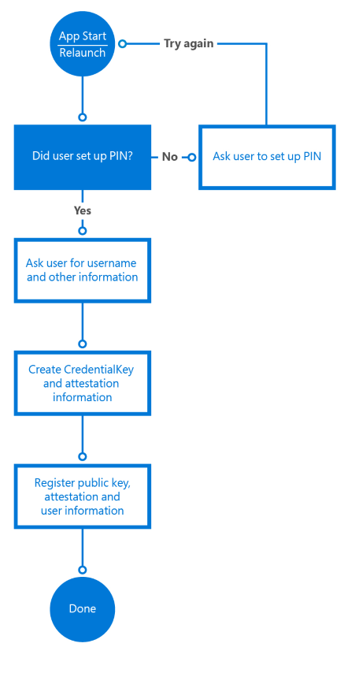

# <a name="intro-to-secure-windows-app-development"></a>Введение в разработку безопасных приложений для Windows


Эта вводная статья помогает архитекторам и разработчикам приложений лучше понять различные возможности платформы Windows10, которые ускоряют Создание безопасных приложений универсальной платформы Windows (UWP). В ней подробно описано, как использовать функции безопасности Windows, доступные на каждом из этих этапов: проверка подлинности, передача данных и данные в состоянии покоя. Более подробные сведения по каждой теме можно получить в дополнительных ресурсах к каждой главе.

## <a name="1-introduction"></a>1. Введение


Разработка безопасного приложения может оказаться непростой задачей. Сегодня в динамичном мире мобильных, социальных, облачных и комплексных корпоративных приложений клиенты ожидают, что приложения станут доступными и будут обновляться быстрее, чем когда-либо раньше. Они также используют многие типы устройств, повышая сложность создания интерфейсов приложений. При создании приложений для универсальной платформы Windows (UWP) ОС Windows 10 устройствами могут быть традиционные настольные компьютеры, ноутбуки, планшеты и мобильные устройства. Кроме того, список устройств можно расширить за счет новых устройств "Интернет вещей" (IoT), Xbox One, Microsoft Surface Hub и HoloLens. Как разработчик, вы должны убедиться, что ваши приложения обеспечивают безопасный обмен данными и их сохранение на всех платформах или устройствах.

Вот некоторые из преимуществ использования функций безопасности Windows 10.

-   Вы стандартизируете функции безопасности на всех устройствах, поддерживающих Windows 10, с помощью согласованных API для компонентов и технологий безопасности.
-   Вы пишете, тестируете и обслуживаете меньший объем кода, чем в случае реализации специального кода для охвата этих сценариев безопасности.
-   Ваши приложения становятся более стабильными и безопасными, так как вы используете операционную систему для управления доступом приложений к своим ресурсам и локальным или удаленным ресурсам системы.

Во время проверки подлинности проверяется личность пользователя, запрашивающего доступ к определенной службе. Windows Hello — это компонент Windows 10, помогающий создать более безопасный механизм проверки подлинности в приложениях для Windows. Для реализации многофакторной проверки подлинности для ваших приложений с его помощью можно использовать персональный идентификационный номер (PIN-код) или биометрические данные, например, отпечатки пальцев пользователей, распознавание лица или радужной оболочки глаз.

Данные в процессе передачи — это подключение и сообщения, которые передаются через него. Примером является получение данных от удаленного сервера с помощью веб-служб. Использование протоколов SSL и HTTPS гарантирует безопасность подключения. Блокировка доступа к этим сообщениям для промежуточных сторон или возможности связи неавторизованных приложений с веб-службами является ключом к обеспечению безопасности данных в процессе передачи.

И наконец, данные в состоянии покоя — это данные, хранящиеся в памяти или на носителях данных. В Windows 10 есть модель приложения, которая блокирует несанкционированный доступ к данным между приложениями и обеспечивает шифрование API для повышения безопасности данных на устройстве. Функцию под названием "Хранилище учетных данных" можно использовать для безопасного хранения учетных данных пользователя на устройстве. При этом операционная система не допускает доступ других приложений к этим данным.

## <a name="2-authentication-factors"></a>2. Факторы проверки подлинности


Для защиты данных пользователь, запрашивающий доступ к ним, должен пройти идентификацию и авторизацию, чтобы получить доступ к запрашиваемым ресурсам данных. Процесс определения личности пользователя называется проверкой подлинности, а определение прав доступа к ресурсу называется авторизацией. Это тесно связанные между собой операции, хотя пользователю они могут показаться одинаковыми. В зависимости от многих факторов (например, хранятся ли данные на одном сервере или размещены в нескольких системах), это могут быть относительно простые или сложные операции. Сервер, предоставляющий службы проверки подлинности и авторизации, называется поставщиком удостоверений.

Для проверки подлинности в конкретной службе или приложении пользователь использует учетные данные, которые он знает, вещь, которой он владеет, или что-то, чем он является. Все перечисленные ниже параметры называются факторами проверки подлинности.

-   **Данными, которые знает пользователь**, обычно является пароль, но это также может быть PIN-код или сочетание секретного вопроса и ответа на него.
-   **Вещью, которой владеет пользователь**, чаще всего является аппаратное запоминающее устройство (например, USB-накопитель, содержащий уникальные для пользователя данные проверки подлинности).
-   **То, чем является пользователь**, часто охватывает отпечатки пальцев, но существуют набирающие популярность факторы, например, распознавание речи, лица, глаз пользователя или образцов его поведения. Когда эти показатели сохраняются в форме данных, они называются биометрическими характеристиками.

Пароль, созданный пользователем, по сути является фактором проверки подлинности, но часто его недостаточно. Любой, кто знает пароль, может выполнить вход от имени пользователя, владеющего им. Смарт-карта может обеспечить более высокий уровень безопасности, но она может быть потеряна, украдена или оставлена не на месте. Система, которая может проверить подлинность пользователя по отпечатку пальца или сканированию глаза может обеспечить самый высокий и удобный уровень безопасности, но требует ресурсоемкого и специализированного оборудования (например, камеру Intel RealSense для распознавания лица), которое может не быть доступным для всех пользователей.

Метод проверки подлинности, используемый системой, является сложным и важным аспектом безопасности данных. В целом, чем большее число факторов вы используете в проверке подлинности, тем более безопасной будет система. В то же время, проверка подлинности должна быть пригодной для использования. Пользователь обычно входит много раз в день, поэтому процесс должен быть быстрым. Выбор типа проверки подлинности — это компромисс между безопасностью и удобством использования. Однофакторная проверка подлинности является наименее безопасной и самой простой в использовании, и многофакторная проверка подлинности становится все более безопасной, но и более сложной, так как в нее добавляется все больше дополнительных факторов.

## <a name="21-single-factor-authentication"></a>2.1 Однофакторная проверка подлинности


Эта форма проверки подлинности основывается на одних учетных данных пользователя. Обычно это пароль, но это также может быть PIN-код.

Ниже показан процесс однофакторной проверки подлинности.

-   Пользователь предоставляет имя пользователя и пароль поставщику удостоверений. Поставщиком удостоверений называется серверный процесс, который проверяет личность пользователя.
-   Поставщик удостоверений проверяет, совпадает ли имя пользователя и пароль с хранящимися в системе данными. В большинстве случаев пароль будет зашифрован для дополнительной безопасности, чтобы другие пользователи не могли его прочитать.
-   Поставщик удостоверений возвращает состояние проверки подлинности, указывающее, была ли проверка подлинности успешной.
-   Если она успешна, начнется обмен данными. Если проверка неудачна, пользователю придется повторно пройти проверку подлинности.


Данный метод проверки подлинности в настоящее время используется службами наиболее часто. Он также является наименее безопасной формой проверки подлинности при использовании в качестве единственного средства проверки подлинности. Требования к сложности пароля, "секретные вопросы" и регулярная смена пароля могут сделать использование паролей более безопасным, но они требуют больших усилий от пользователя и не являются эффективным препятствием для злоумышленников.

Сложностью при использовании паролей является то, что их легче успешно угадать, чем в системах с несколькими факторами. В случае кражи базы данных с учетными записями пользователей и хэшированным паролем из небольшого интернет-магазина, злоумышленники могут использовать пароли, используемые на других веб-сайтах. Пользователи постоянно повторно используют учетные записи, поскольку сложные пароли тяжело запомнить. ИТ-отделу, который управляет паролями, также сложно предлагать механизмы их сброса, требующие частых обновлений паролей и их безопасного хранения.

Несмотря на все недостатки однофакторная проверка подлинности предоставляет пользователям контроль над учетными данными. Они могут создавать и изменять их, а для процесса проверки подлинности требуется только клавиатура. Это основной аспект, отличающий однофакторную проверку подлинности от многофакторной.

## <a name="211-web-authentication-broker"></a>2.1.1. Брокер веб-проверки подлинности


Как обсуждалось ранее, одной из сложностей проверки подлинности пароля для ИТ-отдела является дополнительная нагрузка, связанная с управлением базой имен пользователей и паролей, механизмами сброса и пр. Все популярным вариантом становится привлечение сторонних поставщиков удостоверений, которые предлагают проверку подлинности с помощью OAuth — открытого стандарта для проверки подлинности.

С помощью OAuth ИТ-отделы могут эффективно привлекать ресурсы сторонних поставщиков удостоверений, в частности, Facebook, Twitter или Microsoft, для решения проблемы со сложностью управления базой данных имен пользователей и паролей, функцией сброса пароля и пр.

Пользователи получают полный контроль над своим удостоверением на этих платформах, но приложения с согласия пользователя могут запрашивать маркер у поставщика после того, как пользователь прошел проверку подлинности. Данный механизм может использоваться для авторизации пользователей, прошедших проверку подлинности.

Брокер веб-проверки подлинности в Windows10 предоставляет набор API и инфраструктуру, с помощью которых приложения могут использовать такие виды протоколов проверки подлинности и авторизации, как OAuth и OpenID. Приложения могут запускать операции проверки подлинности с помощью API [**WebAuthenticationBroker**](https://msdn.microsoft.com/library/windows/apps/br227025), получая в результате возврат [**WebAuthenticationResult**](https://msdn.microsoft.com/library/windows/apps/br227038). Обзор коммуникационного процесса представлен на следующем рисунке.


Приложение действует как брокер, начиная проверку подлинности с помощью поставщика удостоверений через [**WebView**](https://msdn.microsoft.com/library/windows/apps/br227702) в приложении. После того как поставщик удостоверений провел проверку подлинности пользователя, он возвращает маркер в приложение, который можно использовать, чтобы запросить сведения о пользователе от поставщика удостоверений. В целях безопасности, приложение должно быть зарегистрировано у поставщика удостоверений, прежде чем оно сможет выступать посредником в процедурах проверки подлинности для поставщика удостоверений. Эти этапы регистрации отличаются в зависимости от поставщика.

Вот общий процесс, используемый для вызова API [**WebAuthenticationBroker**](https://msdn.microsoft.com/library/windows/apps/br227025) для связи с поставщиком.

-   Создайте строки запроса, которые будут отправляться поставщику удостоверений. Количество строк и данные в каждой строке отличаются для каждой веб-службы, но обычно включают в себя две строки URI, в каждой из которых содержится URL-адрес: один–для запроса проверки подлинности, который необходимо отправить, а другой–для перенаправления пользователя после выполнения авторизации.
-   Передавая строки запроса, вызовите [**WebAuthenticationBroker.AuthenticateAsync**](https://msdn.microsoft.com/library/windows/apps/br212066) и ожидайте ответа от поставщика удостоверений.
-   После получения ответа вызовите [**WebAuthenticationResult.ResponseStatus**](https://msdn.microsoft.com/library/windows/apps/br227041), чтобы получить информацию о состоянии.
-   Если взаимодействие успешно, обработайте строку ответа, возвращенную поставщиком удостоверений. Если взаимодействие неуспешно, обработайте ошибку.

Если взаимодействие успешно, обработайте строку ответа, возвращенную поставщиком удостоверений. Если взаимодействие неуспешно, обработайте ошибку.

См. пример кода на языке C#, который предназначен для этого процесса, ниже. Дополнительные сведения и пошаговое руководство см. в разделе [WebAuthenticationBroker](web-authentication-broker.md). Полный пример кода см. в [образце WebAuthenticationBroker на GitHub](http://go.microsoft.com/fwlink/p/?LinkId=620622).

```cs
string startURL = "https://<providerendpoint>?client_id=<clientid>";
string endURL = "http://<AppEndPoint>";

var startURI = new System.Uri(startURL);
var endURI = new System.Uri(endURL);

try
{
    WebAuthenticationResult webAuthenticationResult = 
        await WebAuthenticationBroker.AuthenticateAsync( 
            WebAuthenticationOptions.None, startURI, endURI);

    switch (webAuthenticationResult.ResponseStatus)
    {
        case WebAuthenticationStatus.Success:
            // Successful authentication. 
            break;
        case WebAuthenticationStatus.ErrorHttp:
            // HTTP error. 
            break;
        default:
            // Other error.
        break;
    }
}
catch (Exception ex)
{
    // Authentication failed. Handle parameter, SSL/TLS, and
    // Network Unavailable errors here. 
}
```

## <a name="22-multi-factor-authentication"></a>2.2 Многофакторная проверка подлинности


Многофакторная проверка подлинности использует несколько факторов проверки подлинности. Обычно, элемент "что-то, что вы знаете", например, пароль, используется с элементом "что-то, что у вас есть", который может быть мобильным телефоном или смарт-картой. Даже если злоумышленник узнает пароль пользователя, он все равно не сможет получить доступ к учетной записи без устройства или карты. А если только злоумышленник получает устройство или карту, они бесполезны для него без пароля. Поэтому многофакторная проверка подлинности является более безопасной, но и более сложной, чем однофакторная проверка подлинности.

Службы, использующие многофакторную проверку подлинности, часто дают пользователю выбор способа получения вторых учетных данных. Примером такого типа проверки подлинности является повсеместно используемый процесс, при котором код подтверждения отправляется на мобильный телефон пользователя с помощью SMS-сообщения.

-   Пользователь предоставляет имя пользователя и пароль поставщику удостоверений.
-   Поставщик удостоверений проверяет имя пользователя и пароль как в однофакторной авторизации, а затем находит номер мобильного телефона пользователя, который хранится в системе.
-   Сервер отправляет SMS-сообщение, которое содержит созданный код подтверждения, на мобильный телефон пользователя.
-   Пользователь предоставляет код подтверждения поставщику удостоверений в форме, предоставляемой ему.
-   Поставщик удостоверений возвращает состояние проверки подлинности, указывающее была ли проверка подлинности обеих учетных данных завершена успешно.
-   Если она успешна, начнется обмен данными. В противном случае пользователь должен повторно пройти проверку подлинности.


Как видно, этот процесс также отличается от однофакторной проверки подлинности в том, что вторые учетные данные пользователя отправляются пользователю, а не сам пользователь создает или отправляет их. Поэтому у пользователя нет полного контроля над требуемыми учетными данными. Это также относится к случаю, когда смарт-карта используется в качестве вторых учетных данных: за ее создание и предоставление пользователю несет ответственность организация.

## <a name="221-azure-active-directory"></a>2.2.1 Azure Active Directory


Azure Active Directory (Azure AD) — это облачная служба управления удостоверениями и доступом, которая может служить поставщиком удостоверений в однофакторной или многофакторной проверке подлинности. Проверку подлинности Azure AD можно использовать с кодом подтверждения или без него.

Хотя в Azure AD может быть также реализована однофакторная проверка подлинности, предприятия обычно требуют более высокий уровень безопасности, который обеспечивает многофакторная проверка подлинности. При многофакторной проверке подлинности пользователь, выполняющий проверку подлинности с помощью учетной записи Azure AD, имеет возможность отправки кода подтверждения в виде SMS-сообщения на мобильный телефон или в приложение проверки подлинности Azure на мобильном телефоне пользователя.

Кроме того, Azure AD можно использовать в качестве поставщика OAuth, предоставляющего стандартному пользователю механизм проверки подлинности и авторизации приложений в разных платформах. Для получения дополнительных сведений см. разделы [Azure Active Directory](https://azure.microsoft.com/services/active-directory/) и [Многофакторная проверка подлинности в Azure](https://azure.microsoft.com/services/multi-factor-authentication/).

## <a name="24-windows-hello"></a>2.4 Windows Hello


В Windows 10 удобный механизм многофакторной проверки подлинности встроен в операционную систему. Windows Hello — это новая система входа с помощью биометрических данных, встроенная в Windows 10. Функция напрямую встроена в операционную систему, поэтому Windows Hello позволяет разблокировать пользовательские устройства с помощью идентификации лиц или отпечатков пальцев. Защищенное хранилище учетных данных Windows защищает биометрические данные на устройстве.

В Windows Hello реализован надежный способ распознавания отдельного пользователя устройством. Так проходится первая половина пути между пользователем и запрошенной услугой или элементом данных. После того как пользователь распознан устройством, необходимо по-прежнему выполнить для него проверку подлинности, прежде чем предоставлять этому пользователю доступ к ресурсу. Windows Hello также предоставляет надежную двухфакторную проверку подлинности (2FA), которая полностью интегрирована в Windows и заменяет повторно используемые пароли сочетанием конкретного устройства и биометрического жеста или PIN-кода. PIN-код задается пользователем в рамках регистрации учетной записи Microsoft.

Windows Hello — это не просто замена традиционных систем двухфакторной проверки подлинности. Эта система в принципе аналогична смарт-картам: проверка подлинности выполняется с использованием криптографических примитивов вместо сравнения строк, а материал ключа пользователя надежно хранится внутри устойчивого к взлому оборудования. Microsoft Hello не требует и дополнительных компонентов инфраструктуры, как для использования смарт-карт. В частности, вам не нужна инфраструктура открытых ключей (PKI) для управления сертификатами, если ее у вас нет. Windows Hello сочетает в себе основные достоинства технологии смарт-карт — гибкость в развертывании виртуальных смарт-карт и высокую безопасность физических, однако без присущих им недостатков.

Устройство должно быть зарегистрировано в службе Windows Hello, прежде чем пользователи смогут проходить проверку подлинности на нем. Windows Hello использует ассиметричное (открытый и закрытый ключ) шифрование, при котором одна сторона использует открытый ключ для шифрования данных, которые другая сторона может расшифровать с помощью закрытого ключа. Windows Hello создает набор пар открытых и закрытых ключей и записывает закрытые ключи в микросхему доверенного платформенного модуля (TPM) устройства. После регистрации устройства приложения UWP могут вызывать системные API для получения открытого ключа пользователя, который можно использовать для регистрации пользователя на сервере.

Процесс регистрации приложения может выглядеть описанным ниже образом.



В собираемых вами сведениях о регистрации может содержаться значительно больше идентифицирующих данных, чем включено в этот простой сценарий. Например, если ваше приложение получает доступ к защищенной службе, в частности для банковских операций, вам необходимо будет запросить подтверждение личности и другие данные в контексте процесса регистрации. После выполнения всех условий, открытый ключ этого пользователя будет сохранен на внутреннем сервере и будет использоваться для проверки в следующий раз, когда пользователь будет использовать данную службу.

Дополнительные сведения о Windows Hello см. в разделе [Руководство по Windows Hello](https://msdn.microsoft.com/library/mt589441) и [Руководство по Windows Hello для разработчиков](microsoft-passport.md).

## <a name="3-data-in-flight-security-methods"></a>3. Методы безопасности для данных в процессе передачи


Методы безопасности для данных в процессе передачи применяются к данным во время передачи между двумя устройствами, подключенными к сети. Данные могут передаваться между системами в среде с высоким уровнем безопасности закрытой корпоративной интрасети или между клиентом и веб-службой в небезопасной среде Интернета. Приложения для Windows 10 поддерживают такие стандарты, как протокол SSL с помощью своих сетевых API и работают с такими технологиями, как управление API службы Azure, с помощью которой разработчики могут обеспечить необходимый уровень безопасности для приложений.

## <a name="31-remote-system-authentication"></a>3.1 Проверка подлинности удаленной системой


Существует два основных сценария, в которых происходит связь с удаленной компьютерной системой.

-   Локальный сервер выполняет проверку подлинности пользователя через прямое подключение. Например, если сервер и клиент находятся в одной корпоративной интрасети.
-   Связь со службой происходит через Интернет.

Требования к безопасности для связи с веб-службой выше, чем требования для сценариев с прямой связью, так как данные больше не являются только частью безопасной сети, и вероятность перехвата данных злоумышленниками является более высокой. Поскольку доступ к службе будут получать разные типы устройств, они, скорее всего, будут созданы как службы RESTful, в противовес, например, WCF. Это означает, что проверка подлинности и авторизация службы также влечет за собой новые сложности. Мы обсудим два требования для связи с защищенной удаленной службой.

Первым требованием является конфиденциальность сообщений: информация, передаваемая между клиентом и веб-службами (например, удостоверение пользователя и другие персональные данные) не должна быть доступна для чтения третьими лицами в процессе передачи. Обычно это делается путем шифрования подключения, через которое отправляются сообщения, и шифрованием самого сообщения. В шифровании с помощью пары из открытого и закрытого ключа открытый ключ доступен всем и используется для шифрования сообщений, которые должны быть отправлены определенному получателю. Закрытый ключ содержится только у получателя и используется для расшифровки сообщения.

Вторым требованием является целостность сообщения: клиент и веб-служба должны иметь возможность убедиться в том, что сообщения, которые они получают, являются именно теми сообщениями, которые собиралась отправить другая сторона, и что данное сообщение не было изменено во время передачи. Это делается с помощью подписи сообщений цифровыми подписями и использования проверки подлинности сертификата.

## <a name="32-ssl-connections"></a>3.2 Подключения SSL


Для установки и поддержки безопасного подключения к клиентам веб-службы могут использовать протокол SSL, который поддерживается протоколом HTTPS. Протокол SSL обеспечивает конфиденциальность и целостность сообщения с помощью поддержки шифрования открытого ключа, а также сертификатов сервера. SSL заменяется сертификатом TLS, но сертификат TLS часто случайно именуется сертификатом SSL.

Когда клиент запрашивает доступ к ресурсу на сервере, протокол SSL запускает процесс согласования с сервером. Это называется подтверждением сертификата SSL. Уровень шифрования, набор из открытого и закрытого ключа и данные для проверки подлинности в сертификате сервера и сертификате клиента согласовываются в качестве основы всего взаимодействия на время SSL-подключения. В это время сервер может также потребовать выполнить проверку подлинности клиента. После установки подключения все сообщения шифруются с помощью согласованного открытого ключа до завершения подключения.

## <a name="321-ssl-pinning"></a>3.2.1 Закрепление SSL


Несмотря на то, что протокол SSL может обеспечить конфиденциальность сообщений с помощью шифрования и сертификатов, он ничего не делает для того, чтобы убедиться в том, что сервер, с которым связывается клиент, является правильным сервером. Поведение сервера может быть сымитировано несанкционированной третьей стороной, перехватывающей конфиденциальные данные, которые передает клиент. Для предотвращения этого используется метод, называемый закрепление SSL,чтобы убедиться, что сертификат на сервере является сертификатом, который ожидает и которому доверяет клиент.

Существует несколько различных способов для реализации закрепления SSL в приложениях, каждый со своими достоинствами и недостатками. Самый простой подход — с помощью объявления сертификатов в манифесте пакета приложения. Данное объявление позволяет пакету приложения установить цифровые сертификаты и объявить эксклюзивные отношения доверия к ним. Это приводит к тому, что SSL-соединения разрешаются только между данным приложением и серверами, у которых есть соответствующие сертификаты в цепочке сертификатов. Этот механизм также обеспечивает безопасное использование самозаверяющих сертификатов, так как для надежных открытых центров сертификации не требуется зависимость от третьего лица.


Чтобы лучше контролировать логику проверки, для проверки сертификатов, возвращенных сервером в ответ на запрос HTTPS, доступны API. Учтите, что данный метод требует отправки и проверки ответа, поэтому убедитесь, что вы добавили это действие в качестве проверки до фактической отправки конфиденциальной информации в запросе.

Следующий код C# иллюстрирует этот способ закрепления SSL. Метод **ValidateSSLRoot** использует класс [**HttpClient**](https://msdn.microsoft.com/library/windows/apps/dn298639) для выполнения HTTP-запроса. Когда клиент отправляет ответ, он использует коллекцию [**RequestMessage.TransportInformation.ServerIntermediateCertificates**](https://msdn.microsoft.com/library/windows/apps/dn279681), чтобы проверить сертификаты, возвращаемые сервером. Клиент может затем проверить всю цепочку сертификатов с отпечатками, которые он включил. Этот метод требует, чтобы отпечатки сертификатов были обновлены в приложении после того, как срок действия сертификата сервера истечет и будет возобновлен.

```cs
private async Task ValidateSSLRoot()
{
    // Send a get request to Bing
    var httpClient = new HttpClient();
    var bingUri = new Uri("https://www.bing.com");
    HttpResponseMessage response = 
        await httpClient.GetAsync(bingUri);

    // Get the list of certificates that were used to
    // validate the server's identity
    IReadOnlyList<Certificate> serverCertificates = response.RequestMessage.TransportInformation.ServerIntermediateCertificates;
  
    // Perform validation
    if (!ValidateCertificates(serverCertificates))
    {
        // Close connection as chain is not valid
        return;
    }
    // Validation passed, continue with connection to service
}

private bool ValidateCertificates(IReadOnlyList<Certificate> certs)
{
    // In this example, we iterate through the certificates
    // and check that the chain contains
    // one specific certificate we are expecting
    foreach (var cert in certs)
    {
        byte[] thumbprint = cert.GetHashValue();

        // Check if the thumbprint matches whatever you 
        // are expecting
        var expected = new byte[] { 212, 222, 32, 208, 94, 102, 
            252, 83, 254, 26, 80, 136, 44, 120, 219, 40, 82, 202, 
            228, 116 };

        // ThumbprintMatches does the byte[] comparison 
        if (ThumbprintMatches(thumbprint, expected))
        {
            return true;
        }
    }
    return false;
}
```

## <a name="33-publishing-and-securing-access-to-rest-apis"></a>3.3 Публикация и обеспечение безопасного доступа к API REST


Чтобы обеспечить санкционированный доступ к веб-службам, последние должны требовать проверку подлинности при каждом вызове API. Возможность контролировать производительность и выполнять масштабирование также являются важными аспектами при достуности веб-служб в Интернете. Управление API Azure–это служба, которая может помочь сделать API доступными в Интернете, предоставляя функции на трех уровнях.

**Издатели/администраторы** API могут легко настроить API с помощью портала издателя службы управления API Azure. Здесь можно создать наборы API и управлять доступом к ним, чтобы управлять доступом к конкретным API.

**Разработчики**, желающие получить доступ к этим API, могут отправить соответствующие запросы посредством портала разработчиков. Он может либо сразу предоставить доступ, либо потребовать утверждения издателя или администратора. Разработчики могут также просмотреть документацию API и пример кода на портале разработчиков, чтобы быстро принять API, предложенные веб-службой.

**Приложения**, создаваемые этими разработчиками, получают доступ к API посредством прокси-сервера, предложенного службой управления API Azure. Прокси-сервер предоставляет слой неясности, скрывая фактическую конечную точку API на сервере издателя или администратора. Он также может содержать дополнительную логику, например, перевод API, чтобы обеспечить согласованность отображаемого API, когда вызов одного API перенаправляется на другой. Они также могут использовать фильтрацию IP, чтобы блокировать вызовы API, происходящие из указанного домена IP или набора доменов. Служба управления API Azure также поддерживает безопасность своих веб-служб, используя набор открытых ключей, называемых ключи API, для проверки подлинности и обеспечения авторизации каждого вызова API. Если авторизация не удалась, доступ к API и функциям, которые они поддерживают, будет заблокирован.

Служба управления API Azure может также уменьшить число вызовов API в службу (процедура, называемая регулированием) для оптимизации производительности веб-службы. Чтобы узнать больше, просмотрите разделы [Управление API Azure](https://azure.microsoft.com/services/api-management/) и [Управление API Azure на AzureCon 2015.](https://channel9.msdn.com/events/Microsoft-Azure/AzureCon-2015/ACON313)

## <a name="4-data-at-rest-security-methods"></a>4. Методы безопасности для данных в состоянии покоя


После того, как данные поступают на устройство, они называются "данными в состоянии покоя". Эти данные необходимо хранить на устройстве в безопасном месте, чтобы несанкционированные пользователи или приложения не могли получить к ним доступ. Модель приложений в Windows 10 много делает для обеспечения того, чтобы данные, сохраняемые каким-либо приложением, были доступны только этому приложению, одновременно создавая условия для того, чтобы API давали доступ к этим данным в случае необходимости. Также доступны дополнительные API, которые гарантируют, что данные могут быть зашифрованы, а учетные данные могут храниться в безопасности.

## <a name="41-windows-app-model"></a>4.1 Модель приложения для Windows


Традиционно, у Windows никогда не было определения для приложения. Наиболее часто так называли исполняемый файл (.exe), но в определение никогда не входили установка, сохранение состояния, длина выполнения, управление версиями, интеграция операционной системы или взаимодействие между приложениями. Модель универсальной платформы Windows определяет модель приложения, в которую входят установка, среда выполнения, управление ресурсами, обновления, модель данных и удаление.

Windows10 приложения запускаются в контейнере. Это означает, что у них ограниченные права по умолчанию (Дополнительные права можно запросить и предоставлены пользователем). Например, если приложению нужно получить доступ к файлам в системе, то должно использоваться средство выбора файлов из пространства имен [**Windows.Storage.Pickers**](https://msdn.microsoft.com/library/windows/apps/br207928), чтобы разрешить пользователю выбрать файл (прямой доступ к файлам невозможен). Другой пример: если приложению необходимо получить доступ к данным о местоположении пользователя, ему следует объявить возможность определения местоположения устройства, предложив пользователю в момент скачивания, чтобы это приложение запрашивало доступ к данным о местоположении пользователя. Кроме этого, когда приложению необходимо получить доступ к данным о местоположении пользователя в первый раз, пользователю отобразится дополнительный запрос на продолжение с запросом на разрешение на доступ к данным.

Обратите внимание, что данная модель приложений играет роль "тюрьмы" для приложений. Это означает, что к ним нельзя получить внешний доступ, но это не "замок", доступ к которому нельзя получить снаружи (приложения с правами администратора могут по-прежнему получать доступ изнутри). Device Guard в Windows 10, который позволяет огранизациям и ИТ-отделам определить, какие приложения (Win32) можно выполнять, может в дальнейшем помочь ограничить доступ.

Модель приложений также управляет жизненным циклом приложения. Она, например, ограничивает фоновое выполнение приложений по умолчанию. Когда приложение переходит в фоновый режим, процесс приостанавливается (после предоставления приложению небольшого количества времени для устранения приостановки работы приложения в коде), а его память фиксируется. Операционная система предоставляет механизмы для приложений, чтобы запрашивать выполнение конкретной фоновой задачи (запланированной, инициированной различными событиями, например подключением к Интернету или Bluetooth, изменениями режима питания и пр., в определенных сценариях, в частности при воспроизведении музыки или отслеживании по GPS).

Если ресурсов памяти устройства становится недостаточно, Windows высвобождает пространство памяти, закрывая приложения. Эта модель жизненного цикла заставляет приложения сохранять данные, когда они приостановлены, поскольку у него нет доступного дополнительного времени между приостановкой и завершением.

Подробнее см. в разделе [Универсальность: понимание жизненного цикла приложения для Windows 10](https://visualstudiomagazine.com/articles/2015/09/01/its-universal.aspx).

## <a name="42-stored-credential-protection"></a>4.2 Защита сохраненных учетных данных


Приложения для Windows, которые получают доступ к прошедшим проверку подлинности службам, нередко предоставляют пользователям возможность сохранять учетные данные на локальном устройстве. Это удобно для пользователей. После того, как они введут имя пользователя и пароль, приложение автоматически использует их при последующих запусках данного приложения. Так как это может стать проблемой безопасности, если злоумышленник получит доступ к этим хранящимся данным, Windows 10 предоставляет приложениям Windows возможность сохранять учетные данные пользователя в защищенном хранилище учетных данных. Приложение вызывает API хранилища учетных данных для хранения и извлечения учетных данных из хранилища, а не сохраняет их в контейнере хранилища приложения. Хранилище учетных данных управляется операционной системой, но такой доступ ограничен до приложения, которое хранит их, тем самым предоставляя безопасно управляемое решение для хранения учетных данных.

Когда пользователь предоставляет учетные данные для хранения, приложение получает ссылку на хранилище учетных данных с помощью объекта [**PasswordVault**](https://msdn.microsoft.com/library/windows/apps/br227081) в пространстве имен [**Windows.Security.Credentials**](https://msdn.microsoft.com/library/windows/apps/br227089). Затем он создает объект [**PasswordCredential**](https://msdn.microsoft.com/library/windows/apps/br227061), содержащий идентификатор для приложения Windows, имя пользователя и пароль. Это передается методу [**PasswordVault.Add**](https://msdn.microsoft.com/library/windows/apps/hh701231) для хранения учетных данных в хранилище. Это показано в следующем примере кода C#.

```cs
var vault = new PasswordVault();
vault.Add(new PasswordCredential("My App", username, password));
```

В следующем примере кода C# приложение запрашивает все учетные данные, соответствующие приложению, вызвав метод [**FindAllByResource**](https://msdn.microsoft.com/library/windows/apps/br227083) объекта [**PasswordVault**](https://msdn.microsoft.com/library/windows/apps/br227081). Если возвращается несколько результатов, он предлагает пользователю ввести имя пользователя. Если учетные данные не находятся в хранилище, приложение дает пользователю возможность их выбрать. После этого пользователь заходит на сервер с помощью учетных данных.

```cs
private string resourceName = "My App";
private string defaultUserName;

private void Login()
{
    PasswordCredential loginCredential = GetCredentialFromLocker();

    if (loginCredential != null)
    {
        // There is a credential stored in the locker.
        // Populate the Password property of the credential
        // for automatic login.
        loginCredential.RetrievePassword();
    }
    else
    {
        // There is no credential stored in the locker.
        // Display UI to get user credentials.
        loginCredential = GetLoginCredentialUI();
    }
    // Log the user in.
    ServerLogin(loginCredential.UserName, loginCredential.Password);
}

private PasswordCredential GetCredentialFromLocker()
{
    PasswordCredential credential = null;

    var vault = new PasswordVault();
    var credentialList = vault.FindAllByResource(resourceName);

    if (credentialList.Count == 1)
    {
        credential = credentialList[0];
    }
    else if (credentialList.Count > 0)
    {
        // When there are multiple usernames,
        // retrieve the default username. If one doesn't
        // exist, then display UI to have the user select
        // a default username.
        defaultUserName = GetDefaultUserNameUI();

        credential = vault.Retrieve(resourceName, defaultUserName);
    }
    return credential;
}
```

Подробнее см. в разделе [Хранилище учетных данных](credential-locker.md).

## <a name="43-stored-data-protection"></a>4.3 Защита сохраненных данных


При работе с сохраненными данными, обычно называемыми данными в состоянии покоя, их шифрование может предотвратить доступ к сохраненным данным неавторизованным пользователем. Два стандартных механизма для шифрования данных используют симметричные ключи или асимметричные ключи. Однако шифрование данных не может обеспечить то, что данные никто не изменил между временем отправки и временем, которое они хранились. Другими словами, целостность данных невозможно обеспечить. Использование кодов проверки подлинности сообщений, хэшей и цифровые подписи являются стандартными техниками решения этой проблемы.

## <a name="431-data-encryption"></a>4.3.1 Шифрование данных


В процессе симметричного шифрования и отправитель и получатель имеют один и тот же ключ и используют его для шифрования и расшифровки данных. Сложность этого подхода заключается обычно в безопасности общего доступа к ключу, чтобы обе стороны знали его.

Единственным ответом на это является асимметричное шифрование, при котором используется пара открытых и закрытых ключей. Открытый ключ свободно раздается любому, кто желает зашифровать сообщение. Закрытый ключ всегда хранится в секрете, чтобы только вы могли его использовать для расшифровки данных. Распространенной технологией, позволяющей обнаруживать открытый ключ, является использование цифровых сертификатов, также называемых просто сертификаты. Сертификат содержит сведения об открытом ключе в дополнение к сведениям о пользователе или сервере (например, имени, издателе, адресе электронной почты и стране).

Для реализации симметричного и ассиметричного шифрования в приложениях UWP разработчики приложений для Windows могут использовать классы [**SymmetricKeyAlgorithmProvider**](https://msdn.microsoft.com/library/windows/apps/br241537) и [**AsymmetricKeyAlgorithmProvider**](https://msdn.microsoft.com/library/windows/apps/br241478). Кроме того, класс [**CryptographicEngine**](https://msdn.microsoft.com/library/windows/apps/br241490) можно использовать для шифрования и расшифровки данных, подписи содержимого и проверки цифровых подписей. Приложения также могут использовать класс [**DataProtectionProvider**](https://msdn.microsoft.com/library/windows/apps/br241559) в пространстве имен [**Windows.Security.Cryptography.DataProtection**](https://msdn.microsoft.com/library/windows/apps/br241585) для шифрования и расшифровки данных, хранящихся локально.

## <a name="432-detecting-message-tampering-macs-hashes-and-signatures"></a>4.3.2 Выявление несанкционированных изменений сообщений (коды проверки подлинности сообщения (MAC), хэши и подписи)


MAC — это код (или тег), получаемый в результате использования симметричного ключа (называемого секретным ключом) или сообщения в качестве входных данных в алгоритм шифрования MAC. Секретный ключ и алгоритм согласовываются отправителем и получателем до передачи сообщения.

MAC-коды позволяют проверить сообщения описанным ниже способом.

-   Отправитель получает тег MAC, используя секретный ключ в качестве входных данных для алгоритма MAC.
-   Отправитель отправляет тег MAC и сообщение получателю.
-   Получатель наследует тег MAC с помощью секретного ключа и сообщения в качестве входных данных в алгоритм MAC.
-   Получатель сравнивает свой тег MAC с тегом MAC отправителя. Если они одинаковы, то мы знаем, что сообщение не было несанкционированно изменено.


Приложения Windows могут реализовывать проверку сообщений с помощью MAC, вызывая класс [**MacAlgorithmProvider**](https://msdn.microsoft.com/library/windows/apps/br241530) для создания ключа и класс [**CryptographicEngine**](https://msdn.microsoft.com/library/windows/apps/br241490) для выполнения алгоритма шифрования MAC.

## <a name="433-using-hashes"></a>4.3.3 Использование хэшей


Функция хэширования — это криптографический алгоритм, который преобразовывает блок данных произвольной длины в двоичную строку фиксированной длины, называемую значением хэша. Существует целое семейство хэш-функций, которые могут выполнить это.

Значение хэша можно использовать вместо кода MAC в сценарии передачи сообщений, описанном выше. Отправитель отправляет значение хэша и сообщение, а получатель наследует собственное значение хэша из значения хэша и сообщения отправителя и сравнивает оба значения хэша. Приложения, работающие в Windows10, могут вызывать класс [**HashAlgorithmProvider**](https://msdn.microsoft.com/library/windows/apps/br241511) для перечисления доступных алгоритмов хэширования и выполнения одного из них. Класс [**CryptographicHash**](https://msdn.microsoft.com/library/windows/apps/br241498) представляет собой значение хэша. Метод [**CryptographicHash.GetValueAndReset**](https://msdn.microsoft.com/library/windows/apps/hh701376) можно использовать для повторного хэширования различных данных без необходимости заново создавать объект для каждого случая применения. Метод Append класса **CryptographicHash** добавляет новые данные в буфер для хэширования. Этот процесс полностью показан в следующем примере кода на C#.

```cs
public void SampleReusableHash()
{
    // Create a string that contains the name of the
    // hashing algorithm to use.
    string strAlgName = HashAlgorithmNames.Sha512;

    // Create a HashAlgorithmProvider object.
    HashAlgorithmProvider objAlgProv = HashAlgorithmProvider.OpenAlgorithm(strAlgName);

    // Create a CryptographicHash object. This object can be reused to continually
    // hash new messages.
    CryptographicHash objHash = objAlgProv.CreateHash();

    // Hash message 1.
    string strMsg1 = "This is message 1";
    IBuffer buffMsg1 = CryptographicBuffer.ConvertStringToBinary(strMsg1, BinaryStringEncoding.Utf16BE);
    objHash.Append(buffMsg1);
    IBuffer buffHash1 = objHash.GetValueAndReset();

    // Hash message 2.
    string strMsg2 = "This is message 2";
    IBuffer buffMsg2 = CryptographicBuffer.ConvertStringToBinary(strMsg2, BinaryStringEncoding.Utf16BE);
    objHash.Append(buffMsg2);
    IBuffer buffHash2 = objHash.GetValueAndReset();

    // Convert the hashes to string values (for display);
    string strHash1 = CryptographicBuffer.EncodeToBase64String(buffHash1);
    string strHash2 = CryptographicBuffer.EncodeToBase64String(buffHash2);
}
```

## <a name="434-digital-signatures"></a>4.3.4 Цифровые подписи


Целостность данных сохраненного сообщения, подписанного цифровой подписью, проверяется способом, подобным проверке подлинности с помощью кода MAC. Ниже описан процесс работы цифровой подписи.

-   Отправитель наследует значение хэша (также называемое дайджестом) с помощью сообщения в качестве входных данных для алгоритма хэширования.
-   Отправитель шифрует дайджест с помощью закрытого ключа.
-   Отправитель отправляет сообщение, зашифрованный дайджест и имя алгоритма хэширования, который использовался.
-   Получатель использует открытый ключ, чтобы расшифровать зашифрованный дайджест, который он получит. Затем он использует алгоритм хэширования для хэширования сообщения, чтобы создать собственный дайджест. После этого получатель сравнивает эти два дайджеста (первый — полученный и расшифрованный, второй — созданный им). Только если эти два дайджеста совпадают, получатель может быть уверен, что сообщение было отправлено владельцем закрытого ключа, следовательно он является тем, кем представляется, и сообщение не было изменено в процессе передачи.


Алгоритмы хэширования очень быстрые, поэтому значение хэша можно быстро получить даже из больших сообщений. Полученное значение хэша имеет произвольную длину и может быть короче полного сообщения, поэтому использование открытого и закрытого ключей для шифрования и расшифровки только дайджеста, а не всего сообщения является оптимизацией.

Подробнее см. в статьях [Цифровые подписи](https://msdn.microsoft.com/library/windows/desktop/aa381977), [Коды проверки подлинности сообщений, хэши и подписи](macs-hashes-and-signatures.md) и [Шифрование](cryptography.md).

## <a name="5-summary"></a>5. Резюме


Универсальная платформа Windows в Windows 10 предоставляет множество способов воспользоваться возможностями операционной системы для создания более безопасных приложений. В различных сценариях проверки подлинности, например, однофакторной, многофакторной или посреднической с помощью поставщика удостоверений OAuth, API существуют для решения наиболее сложных проблем с проверкой подлинности. Windows Hello предоставляет новую биометрическую систему входа, которая распознает пользователя и активно предотвращает попытки обойти надлежащую идентификацию. Она также предоставляет несколько уровней ключей и сертификатов, которые ни при каких обстоятельствах не могут быть раскрыты или использованы за пределами доверенного платформенного модуля. Кроме того, дальнейший уровень безопасности обеспечивается с помощью дополнительного использования ключей удостоверения подлинности и сертификатов.

Чтобы обеспечить безопасность данных в процессе передачи, API помогают установить безопасную связь с удаленными системами через SSL, одновременно предоставляя возможность проверить подлинность сервера с помощью закрепления SSL. Управление API Azure помогает в безопасной и контролируемой публикации API, предоставляя мощные варианты конфигурации для отображения API в Интернете с помощью прокси-сервера, который дополнительно скрывает конечную точку API. Доступ к этим API защищается с помощью ключей API, а для контроля производительности можно отрегулировать вызовы API.

Когда данные поступают на устройство, модель приложений Windows обеспечивает больше контроля за установкой, обновлением и доступом к данным, блокируя несанционированный доступ к данным других приложений. Хранилище учетных данных может обеспечивать безопасное хранение учетных данных пользователя под управлением операционной системы, а остальные данные можно защитить на устройстве с помощью шифрования и хэширования API, предлагаемых универсальной платформой Windows.

## <a name="6-resources"></a>6. Ресурсы


### <a name="61-how-to-articles"></a>6.1. Практические руководства

-   [Проверка подлинности и удостоверение пользователя](authentication-and-user-identity.md)
-   [Windows Hello](microsoft-passport.md)
-   [Хранилище учетных данных](credential-locker.md)
-   [Брокер веб-проверки подлинности](web-authentication-broker.md)
-   [Биометрия отпечатков пальцев](fingerprint-biometrics.md)
-   [Смарт-карты](smart-cards.md)
-   [Общие сертификаты](share-certificates.md)
-   [Шифрование](cryptography.md)
-   [Сертификаты](certificates.md)
-   [Криптографические ключи](cryptographic-keys.md)
-   [Защита данных](data-protection.md)
-   [Коды проверки подлинности сообщений, хэши и подписи](macs-hashes-and-signatures.md)
-   [Ограничения на экспорт шифрования](export-restrictions-on-cryptography.md)
-   [Общие задачи шифрования](common-cryptography-tasks.md)

### <a name="62-code-samples"></a>6.2. Примеры кода

-   [Хранилище учетных данных](https://github.com/Microsoft/Windows-universal-samples/blob/master/Samples/PasswordVault)
-   [Средство ввода учетных данных](https://github.com/Microsoft/Windows-universal-samples/blob/master/Samples/CredentialPicker)
-   [Блокировка устройства с помощью входа Azure](https://github.com/Microsoft/Windows-universal-samples/blob/master/Samples/DeviceLockdownAzureLogin)
-   [Защита корпоративных данных](https://github.com/Microsoft/Windows-universal-samples/blob/master/Samples/EnterpriseDataProtection)
-   [KeyCredentialManager](https://github.com/Microsoft/Windows-universal-samples/blob/master/Samples/KeyCredentialManager)
-   [Смарт-карты](https://github.com/Microsoft/Windows-universal-samples/blob/master/Samples/SmartCard)
-   [Управление учетными записями в Интернете](https://github.com/Microsoft/Windows-universal-samples/blob/master/Samples/WebAccountManagement)
-   [WebAuthenticationBroker](https://github.com/Microsoft/Windows-universal-samples/blob/master/Samples/WebAuthenticationBroker)

### <a name="63-api-reference"></a>6.3. Справочник по API

-   [**Windows.Security.Authentication.OnlineId**](https://msdn.microsoft.com/library/windows/apps/hh701371)
-   [**Windows.Security.Authentication.Web**](https://msdn.microsoft.com/library/windows/apps/br227044)
-   [**Windows.Security.Authentication.Web.Core**](https://msdn.microsoft.com/library/windows/apps/dn921967)
-   [**Windows.Security.Authentication.Web.Provider**](https://msdn.microsoft.com/library/windows/apps/dn921965)
-   [**Windows.Security.Credentials**](https://msdn.microsoft.com/library/windows/apps/br227089)
-   [**Windows.Security.Credentials**](https://msdn.microsoft.com/library/windows/apps/br227089)
-   [**Windows.Security.Credentials.UI**](https://msdn.microsoft.com/library/windows/apps/hh701356)
-   [**Windows.Security.Cryptography**](https://msdn.microsoft.com/library/windows/apps/br241404)
-   [**Windows.Security.Cryptography.Certificates**](https://msdn.microsoft.com/library/windows/apps/br241476)
-   [**Windows.Security.Cryptography.Core**](https://msdn.microsoft.com/library/windows/apps/br241547)
-   [**Windows.Security.Cryptography.DataProtection**](https://msdn.microsoft.com/library/windows/apps/br241585)
-   [**Windows.Security.ExchangeActiveSyncProvisioning**](https://msdn.microsoft.com/library/windows/apps/hh701506)
-   [**Windows.Security.EnterpriseData**](https://msdn.microsoft.com/library/windows/apps/dn279153)
