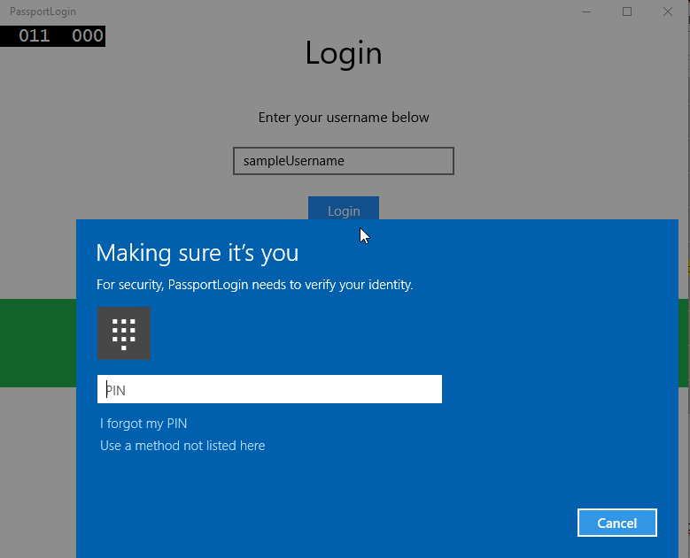
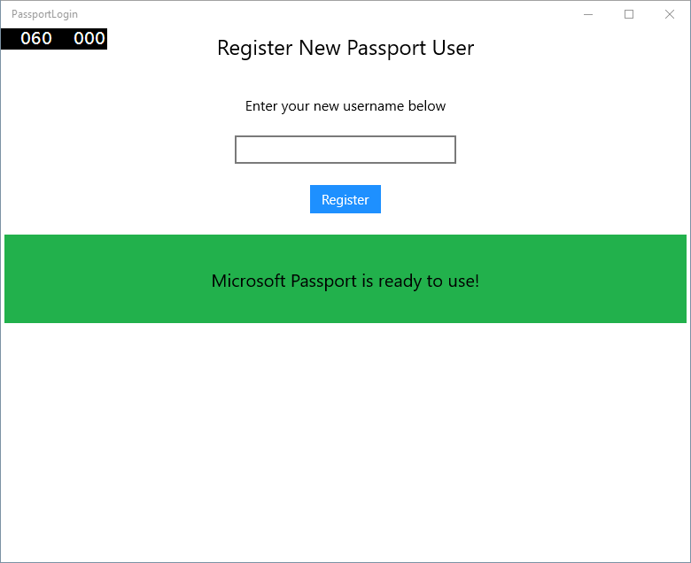

# <a name="create-a-windows-hello-login-app"></a>Создание приложения для входа с использованием Windows Hello

Это первая часть полного пошагового руководства по созданию приложения Windows 10 UWP (универсальной платформы Windows), которое использует Windows Hello в качестве альтернативы традиционным системам проверки подлинности с помощью имени пользователя и пароля. Приложение применяет имя пользователя для входа и создает ключ Hello для каждой учетной записи. Эти учетные записи будут защищены ПИН-кодом, который задается в параметрах Windows в конфигурации Windows Hello.

Это пошаговое руководство делится на две части: создание приложения и подключение внутренней службы. После прочтения этой статьи изучите часть 2: [Служба входа Windows Hello](microsoft-passport-login-auth-service.md).

Перед началом прочитайте обзор [Windows Hello](microsoft-passport.md), чтобы понять, как работает Windows Hello.

## <a name="get-started"></a>Приступая к работе


Для создания этого проекта необходим опыт работы с C# и XAML. Вам также потребуется использовать Visual Studio 2015 (Community Edition или более поздней версии), или более поздней версии Visual Studio на компьютере под управлением Windows 10. Хотя Минимальная требуемая версия Visual Studio 2015, мы рекомендуем использовать последнюю версию Visual Studio для последних обновлений безопасности и разработчиков.

-   Откройте Visual Studio и выберите Файл > Создать > проект.
-   Откроется окно «Новый проект». Перейдите в раздел «Шаблоны > Visual C#».
-   Выберите шаблон «Пустое приложение (универсальные приложения для Windows)» и назовите приложение PassportLogin.
-   Выполните построение и запустите новое приложение (клавиша F5), после чего вы увидите пустое окно на экране. Закройте приложение.


## <a name="exercise-1-login-with-microsoft-passport"></a>Упражнение 1. Вход с помощью Microsoft Passport


В этом упражнении вы узнаете, как проверить, настроен ли компонент Windows Hello на компьютере и как войти в учетную запись, используя Windows Hello.

-   В новом проекте создайте папку с именем Views. В ней будут размещаться страницы для этого примера. Щелкните проект правой кнопкой мыши в обозревателе решений, выберите команду "Добавить > Новая папка", а затем измените имя папки на Views.

    

-   Щелкните правой кнопкой мыши новую папку Views, выберите пункт "Добавить > Новый элемент" и щелкните "Пустая страница". Назовите страницу Login.xaml.

    

-   Чтобы определить пользовательский интерфейс для новой страницы входа, добавьте следующий код XAML. Этот код XAML определяет StackPanel для выравнивания следующих дочерних элементов:

    -   TextBlock, который будет содержать заголовок;
    -   TextBlock для сообщений об ошибках;
    -   TextBox для ввода имени пользователя;
    -   Button для перехода к странице регистрации;
    -   TextBlock с состоянием Windows Hello;
    -   TextBlock для описания страницы входа, так как серверной части или настроенных пользователей нет.

    ```xml
    <Grid Background="{ThemeResource ApplicationPageBackgroundThemeBrush}">
      <StackPanel Orientation="Vertical">
        <TextBlock Text="Login" FontSize="36" Margin="4" TextAlignment="Center"/>
        <TextBlock x:Name="ErrorMessage" Text="" FontSize="20" Margin="4" Foreground="Red" TextAlignment="Center"/>
        <TextBlock Text="Enter your username below" Margin="0,0,0,20"
                   TextWrapping="Wrap" Width="300"
                   TextAlignment="Center" VerticalAlignment="Center" FontSize="16"/>
        <TextBox x:Name="UsernameTextBox" Margin="4" Width="250"/>
        <Button x:Name="PassportSignInButton" Content="Login" Background="DodgerBlue" Foreground="White"
            Click="PassportSignInButton_Click" Width="80" HorizontalAlignment="Center" Margin="0,20"/>
        <TextBlock Text="Don't have an account?"
                    TextAlignment="Center" VerticalAlignment="Center" FontSize="16"/>
        <TextBlock x:Name="RegisterButtonTextBlock" Text="Register now"
                   PointerPressed="RegisterButtonTextBlock_OnPointerPressed"
                   Foreground="DodgerBlue"
                   TextAlignment="Center" VerticalAlignment="Center" FontSize="16"/>
        <Border x:Name="PassportStatus" Background="#22B14C"
                   Margin="0,20" Height="100" >
          <TextBlock x:Name="PassportStatusText" Text="Microsoft Passport is ready to use!"
                 Margin="4" TextAlignment="Center" VerticalAlignment="Center" FontSize="20"/>
        </Border>
        <TextBlock x:Name="LoginExplaination" FontSize="24" TextAlignment="Center" TextWrapping="Wrap" 
            Text="Please Note: To demonstrate a login, validation will only occur using the default username 'sampleUsername'"/>
      </StackPanel>
    </Grid>
    ```

-   Для сборки решения необходимо добавить в код программной части несколько методов. Нажмите клавишу F7 или используйте обозреватель решений, чтобы открыть Login.xaml.cs. Добавьте следующие два метода для обработки событий входа и регистрации (Login и Register). На данном этапе эти методы будут задавать ErrorMessage.Text как пустую строку.

    ```cs
    namespace PassportLogin.Views
    {
        public sealed partial class Login : Page
        {
            public Login()
            {
                this.InitializeComponent();
            }
     
            private void PassportSignInButton_Click(object sender, RoutedEventArgs e)
            {
                ErrorMessage.Text = "";
            }
            private void RegisterButtonTextBlock_OnPointerPressed(object sender, PointerRoutedEventArgs e)
            {
                ErrorMessage.Text = "";
            }
        }
    }
    ```

-   Для отрисовки страницы входа измените код MainPage для перехода на страницу входа во время загрузки MainPage. Откройте файл MainPage.xaml.cs. В обозревателе решений дважды щелкните MainPage.xaml.cs. Если вам не удается найти этот файл, щелкните маленькую стрелку рядом с MainPage.xaml, чтобы открыть код программной части. Создайте метод обработчика событий loaded, который будет переходить на страницу входа. Вам необходимо добавить ссылку на пространство имен Views.

    ```cs
    using PassportLogin.Views;
     
    namespace PassportLogin
    {
        public sealed partial class MainPage : Page
        {
            public MainPage()
            {
                this.InitializeComponent();
                Loaded += MainPage_Loaded;
            }
     
            private void MainPage_Loaded(object sender, RoutedEventArgs e)
            {
                Frame.Navigate(typeof(Login));
            }
        }
    }
    ```

-   На странице входа требуется обработать событие OnNavigatedTo, чтобы проверить, доступна ли служба Windows Hello на этом компьютере. В файле Login.xaml.cs реализуйте следующие элементы. Вы заметите, что объект MicrosoftPassportHelper вызывает ошибку. Это связано с тем, что мы его еще не реализовали.

    ```cs
    public sealed partial class Login : Page
    {
        public Login()
        {
            this.InitializeComponent();
        }
     
        protected override async void OnNavigatedTo(NavigationEventArgs e)
        {
            // Check Microsoft Passport is setup and available on this machine
            if (await MicrosoftPassportHelper.MicrosoftPassportAvailableCheckAsync())
            {
            }
            else
            {
                // Microsoft Passport is not setup so inform the user
                PassportStatus.Background = new SolidColorBrush(Windows.UI.Color.FromArgb(255, 50, 170, 207));
                PassportStatusText.Text = "Microsoft Passport is not setup!\n" + 
                    "Please go to Windows Settings and set up a PIN to use it.";
                PassportSignInButton.IsEnabled = false;
            }
        }
    }
    ```

-   Чтобы создать класс MicrosoftPassportHelper, щелкните правой кнопкой мыши решение "PassportLogin (универсальные приложения для Windows)" и щелкните "Добавить > Новая папка". Назовите папку Utils.

    

-   Щелкните правой кнопкой мыши папку Utils и выберите "Добавить > Класс". Назовите класс MicrosoftPassportHelper.cs.
-   Измените определение класса MicrosoftPassportHelper на общий статический (public static), а затем добавьте следующий метод, чтобы сообщать пользователю, можно ли использовать Windows Hello. Нужно добавить необходимые пространства имен.

    ```cs
    using System;
    using System.Diagnostics;
    using System.Threading.Tasks;
    using Windows.Security.Credentials;
     
    namespace PassportLogin.Utils
    {
        public static class MicrosoftPassportHelper
        {
            /// <summary>
            /// Checks to see if Passport is ready to be used.
            /// 
            /// Passport has dependencies on:
            ///     1. Having a connected Microsoft Account
            ///     2. Having a Windows PIN set up for that _account on the local machine
            /// </summary>
            public static async Task<bool> MicrosoftPassportAvailableCheckAsync()
            {
                bool keyCredentialAvailable = await KeyCredentialManager.IsSupportedAsync();
                if (keyCredentialAvailable == false)
                {
                    // Key credential is not enabled yet as user 
                    // needs to connect to a Microsoft Account and select a PIN in the connecting flow.
                    Debug.WriteLine("Microsoft Passport is not setup!\nPlease go to Windows Settings and set up a PIN to use it.");
                    return false;
                }
     
                return true;
            }
        }
    }
    ```

-   В файле Login.xaml.cs добавьте ссылку на пространство имен Utils. Это устранит ошибку с методом OnNavigatedTo.

    ```cs
    using PassportLogin.Utils;
    ```

-   Выполните сборку и запустите приложение (F5). Вы перейдете на страницу входа, а баннер Windows Hello укажет, что Hello можно использовать. Вы увидите зеленый или синий баннер с состоянием Windows Hello на компьютере.

    

    

-   Затем необходимо создать логику для входа. Создайте папку с именем Models.
-   В папке Models создайте класс Account.cs. Он будет служить моделью учетной записи. В этом примере он будет содержать только имя пользователя. Измените определение класса на public и добавьте свойство Username.
    
    ```cs
    namespace PassportLogin.Models
    {
        public class Account
        {
            public string Username { get; set; }
        }
    }
    ```

-   Вам понадобится способ обработки учетных записей. В этом упражнении нет сервера или базы данных, список пользователей будет сохраняться и загружаться локально. Щелкните правой кнопкой мыши папку Utils и добавьте класс AccountHelper.cs. Измените определение класса на public static. AccountHelper — это статический класс, который будет содержать все необходимые методы для локального сохранения и загрузки списка учетных записей. Для сохранения и загрузки будет использоваться XmlSerializer. Вам также необходимо запомнить сохраненный файл и его расположение. Кроме того, требуется добавить ссылки на дополнительные пространства имен.
    
    ```cs
    using System.IO;
    using System.Xml.Serialization;
    using Windows.Storage;
    using PassportLogin.Models;

    namespace PassportLogin.Utils
    {
        public static class AccountHelper
        {
            // In the real world this would not be needed as there would be a server implemented that would host a user account database.
            // For this tutorial we will just be storing accounts locally.
            private const string USER_ACCOUNT_LIST_FILE_NAME = "accountlist.txt";
            private static string _accountListPath = Path.Combine(ApplicationData.Current.LocalFolder.Path, USER_ACCOUNT_LIST_FILE_NAME);
            public static List<Account> AccountList = new List<Account>();
     
            /// <summary>
            /// Create and save a useraccount list file. (Updating the old one)
            /// </summary>
            private static async void SaveAccountListAsync()
            {
                string accountsXml = SerializeAccountListToXml();
     
                if (File.Exists(_accountListPath))
                {
                    StorageFile accountsFile = await StorageFile.GetFileFromPathAsync(_accountListPath);
                    await FileIO.WriteTextAsync(accountsFile, accountsXml);
                }
                else
                {
                    StorageFile accountsFile = await ApplicationData.Current.LocalFolder.CreateFileAsync(USER_ACCOUNT_LIST_FILE_NAME);
                    await FileIO.WriteTextAsync(accountsFile, accountsXml);
                }
            }
     
            /// <summary>
            /// Gets the useraccount list file and deserializes it from XML to a list of useraccount objects.
            /// </summary>
            /// <returns>List of useraccount objects</returns>
            public static async Task<List<Account>> LoadAccountListAsync()
            {
                if (File.Exists(_accountListPath))
                {
                    StorageFile accountsFile = await StorageFile.GetFileFromPathAsync(_accountListPath);
     
                    string accountsXml = await FileIO.ReadTextAsync(accountsFile);
                    DeserializeXmlToAccountList(accountsXml);
                }
     
                return AccountList;
            }
     
            /// <summary>
            /// Uses the local list of accounts and returns an XML formatted string representing the list
            /// </summary>
            /// <returns>XML formatted list of accounts</returns>
            public static string SerializeAccountListToXml()
            {
                XmlSerializer xmlizer = new XmlSerializer(typeof(List<Account>));
                StringWriter writer = new StringWriter();
                xmlizer.Serialize(writer, AccountList);
     
                return writer.ToString();
            }
     
            /// <summary>
            /// Takes an XML formatted string representing a list of accounts and returns a list object of accounts
            /// </summary>
            /// <param name="listAsXml">XML formatted list of accounts</param>
            /// <returns>List object of accounts</returns>
            public static List<Account> DeserializeXmlToAccountList(string listAsXml)
            {
                XmlSerializer xmlizer = new XmlSerializer(typeof(List<Account>));
                TextReader textreader = new StreamReader(new MemoryStream(Encoding.UTF8.GetBytes(listAsXml)));
     
                return AccountList = (xmlizer.Deserialize(textreader)) as List<Account>;
            }
        }
    }
    ```

-   Затем реализуйте способ добавления и удаления учетной записи из списка. Эти действия будут сохранять список. Последний метод, который вам потребуются в этом упражнении — это метод проверки. Так как у нас нет сервера авторизации или базы данных пользователей, он будет выполнять проверку с жестко заданным пользователем. Эти методы следует добавить в класс AccountHelper.
    
    ```cs
    public static Account AddAccount(string username)
            {
                // Create a new account with the username
                Account account = new Account() { Username = username };
                // Add it to the local list of accounts
                AccountList.Add(account);
                // SaveAccountList and return the account
                SaveAccountListAsync();
                return account;
            }
     
            public static void RemoveAccount(Account account)
            {
                // Remove the account from the accounts list
                AccountList.Remove(account);
                // Re save the updated list
                SaveAccountListAsync();
            }
     
            public static bool ValidateAccountCredentials(string username)
            {
                // In the real world, this method would call the server to authenticate that the account exists and is valid.
                // For this tutorial however we will just have a existing sample user that is just "sampleUsername"
                // If the username is null or does not match "sampleUsername" it will fail validation. In which case the user should register a new passport user
     
                if (string.IsNullOrEmpty(username))
                {
                    return false;
                }
     
                if (!string.Equals(username, "sampleUsername"))
                {
                    return false;
                }
     
                return true;
            }
    ```

-   Затем вам следует обработать запрос входа пользователя. В файле Login.xaml.cs создайте частную переменную, которая будет содержать текущую учетную запись, используемую для входа. Затем добавьте новый вызов метода SignInPassport. Он будет проверять учетные данные учетной записи с помощью метода AccountHelper.ValidateAccountCredentials. Этот метод возвращает логическое значение, указывающее, совпадает ли введенное имя пользователя с заданной на предыдущем шаге строкой. В этом примере это строка sampleUsername.

    ```cs
    using PassportLogin.Models;
    using PassportLogin.Utils;
    using System.Diagnostics;
     
    namespace PassportLogin.Views
    {
        public sealed partial class Login : Page
        {
            private Account _account;
     
            public Login()
            {
                this.InitializeComponent();
            }
     
            protected override async void OnNavigatedTo(NavigationEventArgs e)
            {
                // Check Microsoft Passport is setup and available on this machine
                if (await MicrosoftPassportHelper.MicrosoftPassportAvailableCheckAsync())
                {
                }
                else
                {
                    // Microsoft Passport is not setup so inform the user
                    PassportStatus.Background = new SolidColorBrush(Windows.UI.Color.FromArgb(255, 50, 170, 207));
                    PassportStatusText.Text = "Microsoft Passport is not setup!\nPlease go to Windows Settings and set up a PIN to use it.";
                    PassportSignInButton.IsEnabled = false;
                }
            }
     
            private void PassportSignInButton_Click(object sender, RoutedEventArgs e)
            {
                ErrorMessage.Text = "";
                SignInPassport();
            }
     
            private void RegisterButtonTextBlock_OnPointerPressed(object sender, PointerRoutedEventArgs e)
            {
                ErrorMessage.Text = "";
            }
     
            private async void SignInPassport()
            {
                if (AccountHelper.ValidateAccountCredentials(UsernameTextBox.Text))
                {
                    // Create and add a new local account
                    _account = AccountHelper.AddAccount(UsernameTextBox.Text);
                    Debug.WriteLine("Successfully signed in with traditional credentials and created local account instance!");
     
                    //if (await MicrosoftPassportHelper.CreatePassportKeyAsync(UsernameTextBox.Text))
                    //{
                    //    Debug.WriteLine("Successfully signed in with Microsoft Passport!");
                    //}
                }
                else
                {
                    ErrorMessage.Text = "Invalid Credentials";
                }
            }
        }
    }
    ```

-   Вы могли заметить закомментированный код, который ссылается на метод в MicrosoftPassportHelper. В файле MicrosoftPassportHelper.cs добавьте новый метод CreatePassportKeyAsync. Этот метод использует API Windows Hello в [**KeyCredentialManager**](https://msdn.microsoft.com/library/windows/apps/dn973043). После вызова [**RequestCreateAsync**](https://msdn.microsoft.com/library/windows/apps/dn973048) будет создан ключ Passport, связанный с *accountId* и локальным компьютером. Обратите внимание на комментарии в операторе switch, если вас интересует реализация этого сценария.

    ```cs
    /// <summary>
    /// Creates a Passport key on the machine using the _account id passed.
    /// </summary>
    /// <param name="accountId">The _account id associated with the _account that we are enrolling into Passport</param>
    /// <returns>Boolean representing if creating the Passport key succeeded</returns>
    public static async Task<bool> CreatePassportKeyAsync(string accountId)
    {
        KeyCredentialRetrievalResult keyCreationResult = await KeyCredentialManager.RequestCreateAsync(accountId, KeyCredentialCreationOption.ReplaceExisting);

        switch (keyCreationResult.Status)
        {
            case KeyCredentialStatus.Success:
                Debug.WriteLine("Successfully made key");

                // In the real world authentication would take place on a server.
                // So every time a user migrates or creates a new Microsoft Passport account Passport details should be pushed to the server.
                // The details that would be pushed to the server include:
                // The public key, keyAttesation if available, 
                // certificate chain for attestation endorsement key if available,  
                // status code of key attestation result: keyAttestationIncluded or 
                // keyAttestationCanBeRetrievedLater and keyAttestationRetryType
                // As this sample has no concept of a server it will be skipped for now
                // for information on how to do this refer to the second Passport sample

                //For this sample just return true
                return true;
            case KeyCredentialStatus.UserCanceled:
                Debug.WriteLine("User cancelled sign-in process.");
                break;
            case KeyCredentialStatus.NotFound:
                // User needs to setup Microsoft Passport
                Debug.WriteLine("Microsoft Passport is not setup!\nPlease go to Windows Settings and set up a PIN to use it.");
                break;
            default:
                break;
        }

        return false;
    }
    ```

-   После создания метода CreatePassportKeyAsync вернитесь в файл Login.xaml.cs и раскомментируйте код в методе SignInPassport.

    ```cs
    private async void SignInPassport()
    {
        if (AccountHelper.ValidateAccountCredentials(UsernameTextBox.Text))
        {
            //Create and add a new local account
            _account = AccountHelper.AddAccount(UsernameTextBox.Text);
            Debug.WriteLine("Successfully signed in with traditional credentials and created local account instance!");

            if (await MicrosoftPassportHelper.CreatePassportKeyAsync(UsernameTextBox.Text))
            {
                Debug.WriteLine("Successfully signed in with Microsoft Passport!");
            }
        }
        else
        {
            ErrorMessage.Text = "Invalid Credentials";
        }
    }
    ```

-   Выполните сборку и запустите приложение. Вы попадете на страницу входа. Введите «sampleUsername» и нажмите кнопку «login» (вход). Появится запрос Windows Hello на ввод ПИН-кода. После правильного ввода ПИН-кода метод CreatePassportKeyAsync сможет создать ключ Windows Hello. В окнах вывода должны появиться сообщения об успешном выполнении.

    

## <a name="exercise-2-welcome-and-user-selection-pages"></a>Упражнение 2. Страницы приветствия и выбора пользователя


В этом упражнении вы продолжите предыдущий пример. Когда пользователи успешно входят в систему, они должны быть перенаправлены на страницу приветствия, где можно выйти из системы или удалить учетную запись. Так как служба Windows Hello создает ключ для каждого компьютера, можно создать экран выбора пользователя, содержащий всех пользователей, вошедших в систему на этом компьютере. Затем пользователь может выбрать одну из учетных записей и перейти на экран приветствия, не вводя пароль еще раз, так как проверка подлинности уже пройдена.

-   В папке Views добавьте пустую страницу Welcome.xaml. Добавьте следующий код XAML для пользовательского интерфейса. Код отображает заголовок, имя пользователя, вошедшего в систему, и две кнопки. Одна из кнопок возвращает нас к списку пользователей (ее вы создадите позже), а другая кнопка позволяет забыть пользователя.

    ```xml
    <Grid Background="{ThemeResource ApplicationPageBackgroundThemeBrush}">
      <StackPanel Orientation="Vertical">
        <TextBlock x:Name="Title" Text="Welcome" FontSize="40" TextAlignment="Center"/>
        <TextBlock x:Name="UserNameText" FontSize="28" TextAlignment="Center" Foreground="Black"/>

        <Button x:Name="BackToUserListButton" Content="Back to User List" Click="Button_Restart_Click"
                HorizontalAlignment="Center" Margin="0,20" Foreground="White" Background="DodgerBlue"/>

        <Button x:Name="ForgetButton" Content="Forget Me" Click="Button_Forget_User_Click"
                Foreground="White"
                Background="Gray"
                HorizontalAlignment="Center"/>
      </StackPanel>
    </Grid>
    ```

-   В файле кода программной части Welcome.xaml.cs добавьте новую частную переменную, которая будет содержать учетную запись, использованную для входа в систему. Вам необходимо реализовать метод для переопределения события OnNavigateTo, в котором хранится учетная запись, переданная странице приветствия. Вам также понадобится реализовать событие нажатия двух кнопок, определенных в XAML. Также потребуется ссылка на папки Models и Utils.

    ```cs
    using PassportLogin.Models;
    using PassportLogin.Utils;
    using System.Diagnostics;
     
    namespace PassportLogin.Views
    {
        public sealed partial class Welcome : Page
        {
            private Account _activeAccount;
     
            public Welcome()
            {
                InitializeComponent();
            }
     
            protected override void OnNavigatedTo(NavigationEventArgs e)
            {
                _activeAccount = (Account)e.Parameter;
                if (_activeAccount != null)
                {
                    UserNameText.Text = _activeAccount.Username;
                }
            }
     
            private void Button_Restart_Click(object sender, RoutedEventArgs e)
            {
            }
     
            private void Button_Forget_User_Click(object sender, RoutedEventArgs e)
            {
                // Remove it from Microsoft Passport
                // MicrosoftPassportHelper.RemovePassportAccountAsync(_activeAccount);
     
                // Remove it from the local accounts list and resave the updated list
                AccountHelper.RemoveAccount(_activeAccount);
     
                Debug.WriteLine("User " + _activeAccount.Username + " deleted.");
            }
        }
    }
    ```

-   Вы могли заметить закомментированную строку в событии нажатия кнопки «forget user». Учетная запись удаляется из локального списка, но пока невозможно ее удалить из Windows Hello. Необходимо реализовать новый метод в файле MicrosoftPassportHelper.cs, который удаляет пользователя Windows Hello. Этот метод будет использовать другие API Windows Hello для открытия и удаления учетной записи. В реальности при удалении учетной записи следует уведомить сервер или базу данных, чтобы синхронизировать базу данных пользователей. Вам понадобится ссылку на папку Models.

    ```cs
    using PassportLogin.Models;

    /// <summary>
    /// Function to be called when user requests deleting their account.
    /// Checks the KeyCredentialManager to see if there is a Passport for the current user
    /// Then deletes the local key associated with the Passport.
    /// </summary>
    public static async void RemovePassportAccountAsync(Account account)
    {
        // Open the account with Passport
        KeyCredentialRetrievalResult keyOpenResult = await KeyCredentialManager.OpenAsync(account.Username);

        if (keyOpenResult.Status == KeyCredentialStatus.Success)
        {
            // In the real world you would send key information to server to unregister
            //e.g. RemovePassportAccountOnServer(account);
        }

        // Then delete the account from the machines list of Passport Accounts
        await KeyCredentialManager.DeleteAsync(account.Username);
    }
    ```

-   Вернитесь в файл Welcome.xaml.cs и раскомментируйте строку с вызовом метода RemovePassportAccountAsync.

    ```cs
    private void Button_Forget_User_Click(object sender, RoutedEventArgs e)
    {
        // Remove it from Microsoft Passport
        MicrosoftPassportHelper.RemovePassportAccountAsync(_activeAccount);
     
        // Remove it from the local accounts list and resave the updated list
        AccountHelper.RemoveAccount(_activeAccount);
     
        Debug.WriteLine("User " + _activeAccount.Username + " deleted.");
    }
    ```

-   Метод SignInPassport (Login.xaml.cs) после успешного вызова CreatePassportKeyAsync должен перейти на экран приветствия и передать учетную запись.

    ```cs
    private async void SignInPassport()
    {
        if (AccountHelper.ValidateAccountCredentials(UsernameTextBox.Text))
        {
            // Create and add a new local account
            _account = AccountHelper.AddAccount(UsernameTextBox.Text);
            Debug.WriteLine("Successfully signed in with traditional credentials and created local account instance!");

            if (await MicrosoftPassportHelper.CreatePassportKeyAsync(UsernameTextBox.Text))
            {
                Debug.WriteLine("Successfully signed in with Microsoft Passport!");
                Frame.Navigate(typeof(Welcome), _account);
            }
        }
        else
        {
            ErrorMessage.Text = "Invalid Credentials";
        }
    }
    ```

-   Выполните сборку и запустите приложение. Введите имя пользователя «sampleUsername» и нажмите кнопку «login» (вход). Введите ПИН-код, после чего вы перейдете на экран приветствия. Нажмите кнопку «forget user» (забыть пользователя) и убедитесь, что пользователь был удален в окне вывода. Обратите внимание, что после удаления пользователя вы остаетесь на странице приветствия. Вам потребуется создать страницу выбора пользователя, на которую приложение сможет перейти.

    

-   В папке Views создайте пустую страницу UserSelection.xaml и добавьте следующий код XAML для определения пользовательского интерфейса. Она будет содержать элемент [**ListView**](https://msdn.microsoft.com/library/windows/apps/br242878), отображающий всех пользователей в локальном списке учетных записей, и кнопку, которая позволяет перейти на страницу входа и добавить другую учетную запись.

    ```xml
    <Grid Background="{ThemeResource ApplicationPageBackgroundThemeBrush}">
      <StackPanel Orientation="Vertical">
        <TextBlock x:Name="Title" Text="Select a User" FontSize="36" Margin="4" TextAlignment="Center" HorizontalAlignment="Center"/>

        <ListView x:Name="UserListView" Margin="4" MaxHeight="200" MinWidth="250" Width="250" HorizontalAlignment="Center">
          <ListView.ItemTemplate>
            <DataTemplate>
              <Grid Background="DodgerBlue" Height="50" Width="250" HorizontalAlignment="Stretch" VerticalAlignment="Stretch">
                <TextBlock Text="{Binding Username}" HorizontalAlignment="Center" TextAlignment="Center" VerticalAlignment="Center" Foreground="White"/>
              </Grid>
            </DataTemplate>
          </ListView.ItemTemplate>
        </ListView>

        <Button x:Name="AddUserButton" Content="+" FontSize="36" Width="60" Click="AddUserButton_Click" HorizontalAlignment="Center"/>
      </StackPanel>
    </Grid>
    ```

-   В файле UserSelection.xaml.cs реализуйте метод loaded, который переходит на страницу входа, если в локальном списке нет учетных записей. Также реализуйте событие SelectionChanged для элемента ListView и событие нажатия кнопки.

    ```cs
    using System.Diagnostics;
    using PassportLogin.Models;
    using PassportLogin.Utils;

    namespace PassportLogin.Views
    {
        public sealed partial class UserSelection : Page
        {
            public UserSelection()
            {
                InitializeComponent();
                Loaded += UserSelection_Loaded;
            }

            private void UserSelection_Loaded(object sender, RoutedEventArgs e)
            {
                if (AccountHelper.AccountList.Count == 0)
                {
                    //If there are no accounts navigate to the LoginPage
                    Frame.Navigate(typeof(Login));
                }


                UserListView.ItemsSource = AccountHelper.AccountList;
                UserListView.SelectionChanged += UserSelectionChanged;
            }

            /// <summary>
            /// Function called when an account is selected in the list of accounts
            /// Navigates to the Login page and passes the chosen account
            /// </summary>
            private void UserSelectionChanged(object sender, RoutedEventArgs e)
            {
                if (((ListView)sender).SelectedValue != null)
                {
                    Account account = (Account)((ListView)sender).SelectedValue;
                    if (account != null)
                    {
                        Debug.WriteLine("Account " + account.Username + " selected!");
                    }
                    Frame.Navigate(typeof(Login), account);
                }
            }

            /// <summary>
            /// Function called when the "+" button is clicked to add a new user.
            /// Navigates to the Login page with nothing filled out
            /// </summary>
            private void AddUserButton_Click(object sender, RoutedEventArgs e)
            {
                Frame.Navigate(typeof(Login));
            }
        }
    }
    ```

<!-- -->

-   В приложении есть несколько мест, из которых нужно перейти на страницу UserSelection. В MainPage.xaml.cs необходимо перейти на страницу UserSelection вместо страницы входа. В событии loaded в MainPage необходимо загрузить список учетных записей, чтобы страница UserSelection могла проверить наличие учетных записей. Для этого нужно сделать метод loaded асинхронным и добавить ссылку на папку Utils.

    ```cs
    using PassportLogin.Utils;

    private async void MainPage_Loaded(object sender, RoutedEventArgs e)
    {
        // Load the local Accounts List before navigating to the UserSelection page
        await AccountHelper.LoadAccountListAsync();
        Frame.Navigate(typeof(UserSelection));
    }
    ```

-   Затем следует перейти на страницу UserSelection со страницы приветствия. В обоих событиях нажатия необходимо вернуться на страницу UserSelection.

    ```cs
    private void Button_Restart_Click(object sender, RoutedEventArgs e)
    {
        Frame.Navigate(typeof(UserSelection));
    }

    private void Button_Forget_User_Click(object sender, RoutedEventArgs e)
    {
        // Remove it from Microsoft Passport
        MicrosoftPassportHelper.RemovePassportAccountAsync(_activeAccount);

        // Remove it from the local accounts list and resave the updated list
        AccountHelper.RemoveAccount(_activeAccount);

        Debug.WriteLine("User " + _activeAccount.Username + " deleted.");

        // Navigate back to UserSelection page.
        Frame.Navigate(typeof(UserSelection));
    }
    ```

-   На странице входа нужен код для входа в учетную запись, выбранную из списка на странице UserSelection. В событии OnNavigatedTo сохраните переданную учетную запись. Сначала добавьте новую частную переменную, которая будет указывать, новая ли это учетная запись или существующая. Затем обработайте событие OnNavigatedTo.

    ```cs
    namespace PassportLogin.Views
    {
        public sealed partial class Login : Page
        {
            private Account _account;
            private bool _isExistingAccount;

            public Login()
            {
                InitializeComponent();
            }

            /// <summary>
            /// Function called when this frame is navigated to.
            /// Checks to see if Microsoft Passport is available and if an account was passed in.
            /// If an account was passed in set the "_isExistingAccount" flag to true and set the _account
            /// </summary>
            protected override async void OnNavigatedTo(NavigationEventArgs e)
            {
                // Check Microsoft Passport is setup and available on this machine
                if (await MicrosoftPassportHelper.MicrosoftPassportAvailableCheckAsync())
                {
                    if (e.Parameter != null)
                    {
                        _isExistingAccount = true;
                        // Set the account to the existing account being passed in
                        _account = (Account)e.Parameter;
                        UsernameTextBox.Text = _account.Username;
                        SignInPassport();
                    }
                }
                else
                {
                    // Microsoft Passport is not setup so inform the user
                    PassportStatus.Background = new SolidColorBrush(Windows.UI.Color.FromArgb(255, 50, 170, 207));
                    PassportStatusText.Text = "Microsoft Passport is not setup!\n" + 
                        "Please go to Windows Settings and set up a PIN to use it.";
                    PassportSignInButton.IsEnabled = false;
                }
            }
        }
    }
    ```

-   Метод SignInPassport нужно изменить для входа в выбранную учетную запись. MicrosoftPassportHelper потребуется другой метод, чтобы открывать учетную запись с помощью Passport, поскольку ключ Passport уже создан для нее. Реализуйте новый метод в MicrosoftPassportHelper.cs для входа существующего пользователя с помощью Passport. Подробнее о каждой части кода см. в комментарии к коду.

    ```cs
    /// <summary>
    /// Attempts to sign a message using the Passport key on the system for the accountId passed.
    /// </summary>
    /// <returns>Boolean representing if creating the Passport authentication message succeeded</returns>
    public static async Task<bool> GetPassportAuthenticationMessageAsync(Account account)
    {
        KeyCredentialRetrievalResult openKeyResult = await KeyCredentialManager.OpenAsync(account.Username);
        // Calling OpenAsync will allow the user access to what is available in the app and will not require user credentials again.
        // If you wanted to force the user to sign in again you can use the following:
        // var consentResult = await Windows.Security.Credentials.UI.UserConsentVerifier.RequestVerificationAsync(account.Username);
        // This will ask for the either the password of the currently signed in Microsoft Account or the PIN used for Microsoft Passport.

        if (openKeyResult.Status == KeyCredentialStatus.Success)
        {
            // If OpenAsync has succeeded, the next thing to think about is whether the client application requires access to backend services.
            // If it does here you would Request a challenge from the Server. The client would sign this challenge and the server
            // would check the signed challenge. If it is correct it would allow the user access to the backend.
            // You would likely make a new method called RequestSignAsync to handle all this
            // e.g. RequestSignAsync(openKeyResult);
            // Refer to the second Microsoft Passport sample for information on how to do this.

            // For this sample there is not concept of a server implemented so just return true.
            return true;
        }
        else if (openKeyResult.Status == KeyCredentialStatus.NotFound)
        {
            // If the _account is not found at this stage. It could be one of two errors. 
            // 1. Microsoft Passport has been disabled
            // 2. Microsoft Passport has been disabled and re-enabled cause the Microsoft Passport Key to change.
            // Calling CreatePassportKey and passing through the account will attempt to replace the existing Microsoft Passport Key for that account.
            // If the error really is that Microsoft Passport is disabled then the CreatePassportKey method will output that error.
            if (await CreatePassportKeyAsync(account.Username))
            {
                // If the Passport Key was again successfully created, Microsoft Passport has just been reset.
                // Now that the Passport Key has been reset for the _account retry sign in.
                return await GetPassportAuthenticationMessageAsync(account);
            }
        }

        // Can't use Passport right now, try again later
        return false;
    }
    ```

-   Измените метод SignInPassport в файле Login.xaml.cs для обработки существующей учетной записи. При этом будет использоваться новый метод в MicrosoftPassportHelper.cs. При успешном выполнении учетная запись войдет в систему, а пользователь перейдет на экран приветствия.

    ```cs
    private async void SignInPassport()
    {
        if (_isExistingAccount)
        {
            if (await MicrosoftPassportHelper.GetPassportAuthenticationMessageAsync(_account))
            {
                Frame.Navigate(typeof(Welcome), _account);
            }
        }
        else if (AccountHelper.ValidateAccountCredentials(UsernameTextBox.Text))
        {
            //Create and add a new local account
            _account = AccountHelper.AddAccount(UsernameTextBox.Text);
            Debug.WriteLine("Successfully signed in with traditional credentials and created local account instance!");

            if (await MicrosoftPassportHelper.CreatePassportKeyAsync(UsernameTextBox.Text))
            {
                Debug.WriteLine("Successfully signed in with Microsoft Passport!");
                Frame.Navigate(typeof(Welcome), _account);
            }
        }
        else
        {
            ErrorMessage.Text = "Invalid Credentials";
        }
    }
    ```

-   Выполните сборку и запустите приложение. Введите имя пользователя «sampleUsername». Введите ПИН-код, после чего вы перейдете на экран приветствия. Нажмите кнопку «back to user list» (вернуться к списку пользователей). Теперь вы должны увидеть пользователя в списке. Если выбрать этот Passport, вы сможете войти в систему без повторного ввода паролей.

    

## <a name="exercise-3-registering-a-new-windows-hello-user"></a>Упражнение 3. Регистрация нового пользователя Windows Hello


В этом упражнении вы создадите страницу, которая регистрирует новую учетную запись в Windows Hello. Она работает аналогично странице входа. Страница входа реализована для существующего пользователя, который начинает применять Windows Hello. Страница PassportRegister будет регистрировать нового пользователя в службе Windows Hello.

-   В папке Views создайте пустую страницу PassportRegister.xaml. Добавьте следующий код XAML для настройки пользовательского интерфейса. Интерфейс здесь похож на страницу входа.

    ```xml
    <Grid Background="{ThemeResource ApplicationPageBackgroundThemeBrush}">
      <StackPanel Orientation="Vertical">
        <TextBlock x:Name="Title" Text="Register New Passport User" FontSize="24" Margin="4" TextAlignment="Center"/>

        <TextBlock x:Name="ErrorMessage" Text="" FontSize="20" Margin="4" Foreground="Red" TextAlignment="Center"/>

        <TextBlock Text="Enter your new username below" Margin="0,0,0,20"
                   TextWrapping="Wrap" Width="300"
                   TextAlignment="Center" VerticalAlignment="Center" FontSize="16"/>

        <TextBox x:Name="UsernameTextBox" Margin="4" Width="250"/>

        <Button x:Name="PassportRegisterButton" Content="Register" Background="DodgerBlue" Foreground="White"
            Click="RegisterButton_Click_Async" Width="80" HorizontalAlignment="Center" Margin="0,20"/>

        <Border x:Name="PassportStatus" Background="#22B14C"
                   Margin="4" Height="100">
          <TextBlock x:Name="PassportStatusText" Text="Microsoft Passport is ready to use!" FontSize="20"
                 Margin="4" TextAlignment="Center" VerticalAlignment="Center"/>
        </Border>
      </StackPanel>
    </Grid>
    ```

-   В файле кода программной части PassportRegister.xaml.cs реализуйте частную переменную Account и события нажатия кнопки «register». При этом будет добавлена новая локальная учетная запись и создан ключ Passport.

    ```cs
    using PassportLogin.Models;
    using PassportLogin.Utils;

    namespace PassportLogin.Views
    {
        public sealed partial class PassportRegister : Page
        {
            private Account _account;

            public PassportRegister()
            {
                InitializeComponent();
            }

            private async void RegisterButton_Click_Async(object sender, RoutedEventArgs e)
            {
                ErrorMessage.Text = "";

                //In the real world you would normally validate the entered credentials and information before 
                //allowing a user to register a new account. 
                //For this sample though we will skip that step and just register an account if username is not null.

                if (!string.IsNullOrEmpty(UsernameTextBox.Text))
                {
                    //Register a new account
                    _account = AccountHelper.AddAccount(UsernameTextBox.Text);
                    //Register new account with Microsoft Passport
                    await MicrosoftPassportHelper.CreatePassportKeyAsync(_account.Username);
                    //Navigate to the Welcome Screen. 
                    Frame.Navigate(typeof(Welcome), _account);
                }
                else
                {
                    ErrorMessage.Text = "Please enter a username";
                }
            }
        }
    }
    ```

-   Вам необходимо перейти на эту страницу со страницы входа после нажатия кнопки «register».

    ```cs
    private void RegisterButtonTextBlock_OnPointerPressed(object sender, PointerRoutedEventArgs e)
    {
        ErrorMessage.Text = "";
        Frame.Navigate(typeof(PassportRegister));
    }
    ```

-   Выполните сборку и запустите приложение. Попробуйте зарегистрировать нового пользователя. Затем вернитесь к списку пользователей и убедитесь, что вы можете выбрать этого пользователя и войти в систему.

    

В этом практическом занятии вы узнали, как использовать новый API Windows Hello для проверки подлинности существующих пользователей и создания новых пользователей. Теперь вы можете упростить работу с вашими приложениями, так как пользователям не придется запоминать пароли, и при этом будете уверенны, что приложение по-прежнему защищено механизмом проверки подлинности. Windows 10 использует новую технологию проверки подлинности Windows Hello для обеспечения возможности входа в систему с помощью биометрических данных.

## <a name="related-topics"></a>Еще по теме

* [Windows Hello](microsoft-passport.md)
* [Служба входа Windows Hello](microsoft-passport-login-auth-service.md)
