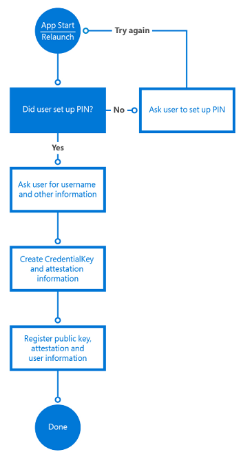

# <a name="windows-hello"></a>Windows Hello


В этой статье описывается новая технология Windows Hello, которая поставляется в комплекте с операционной системой Windows 10, и рассказывается, как разработчики могут реализовать эту технологию для защиты своих приложений универсальной платформы Windows (UWP) и внутренних служб. Здесь рассматриваются определенные возможности этих технологий, помогающие снизить угрозы от использования стандартных учетных данных, и содержит рекомендации по разработке и развертыванию этих технологий в рамках внедрения Windows 10.

Учтите, что эта статья посвящена разработке приложений. Дополнительные сведения об архитектуре и подробности реализации Windows Hello см. в разделе [Руководство по Windows Hello на веб-сайте TechNet](https://technet.microsoft.com/library/mt589441.aspx).

Полный пример кода см. в [образце кода Windows Hello на GitHub](http://go.microsoft.com/fwlink/?LinkID=717812).

Пошаговое руководство по созданию приложения UWP с использованием Windows Hello и фоновой службы проверки подлинности см. в статьях [Приложение для входа с использованием Windows Hello](microsoft-passport-login.md) и [Служба входа Windows Hello](microsoft-passport-login-auth-service.md).

## <a name="1-introduction"></a>1. Введение


Что касается информационной безопасности, предполагается, что система способна определить, кто ее использует. Идентификация пользователя позволяет системе решить, правильно ли пользователь идентифицировал себя (процесс называется проверкой подлинности), а затем решить, что прошедший проверку подлинности пользователь будет способен делать (авторизация). Подавляющее большинство компьютерных систем, развернутых по всему миру, полагается на учетные данные пользователя при принятии решений проверки подлинности и авторизации, что означает, что безопасность данных систем зависит от повторно используемых создаваемых пользователем паролей. Часто цитируемая формула, что при проверке подлинности используется "нечто, что вы знаете, имеете или чем вы являетесь", прекрасно описывает проблему: успешность проверки подлинности всецело зависит от повторно используемого пароля, и любой, кто знает этот пароль, может выдать себя за пользователя-владельца.

## <a name="11-problems-with-traditional-credentials"></a>1.1. Проблемы с традиционными учетными данными


Еще с середины 1960-х гг., когда Фернандо Корбато (Fernando Corbató) и его рабочая группа в Массачусетском технологическом институте отстояли внедрение паролей, пользователям и администраторам приходилось использовать пароли для проверки подлинности и авторизации. Со временем технологии хранения и использования паролей несколько продвинулись вперед (например, с помощью безопасного хэширования и отложения), но мы по-прежнему сталкиваемся с двумя проблемами. Пароли легко клонируются и их несложно украсть. Кроме того, ошибки реализации могут делать их незащищенными, и пользователям все время приходится с трудом балансировать между удобством и безопасностью.

## <a name="111-credential-theft"></a>1.1.1. Похищение учетных данных


Самый большой риск с паролями прост: злоумышленник может легко украсть пароль. Уязвимо любое место, где пароль вводится, обрабатывается или хранится. Например, злоумышленник может украсть коллекцию паролей или хэши с сервера проверки подлинности путем перехвата сетевого трафика на сервер приложений, внедряя вредоносные программы в приложение или на устройство, регистрируя нажатие клавиш или кнопок на устройстве, подсматривая вводимые пользователем символы. Это только наиболее распространенные методы атак.

Другой связанный с этим риск — воспроизведение учетных данных, когда злоумышленник перехватывает учетные данные в незащищенной сети и воспроизводит их позднее, чтобы представиться допустимым пользователем. Большинство протоколов проверки подлинности (в том числе Kerberos и OAuth) защищают от атак с воспроизведением, добавляя отметку времени в процедуру обмена учетными данными, но эта тактика защищает только маркер, выдаваемый системой проверки подлинности, но не пароль, который пользователь в первую очередь предоставляет для получения маркера.

## <a name="112-credential-reuse"></a>1.1.2. Повторное использование учетных данных


Общепринятая практика использования электронного адреса в качестве имени пользователя только усугубляет проблему. Злоумышленник, который успешно извлек пару "имя пользователя-пароль" из уязвимой системы, может попытаться подставить эту пару в других системах. Этот прием срабатывает на удивление во многих случаях, что позволяет злоумышленникам переходить из пораженной системы в другие системы. Использование адреса электронной почты в качестве имени пользователя может приводить к другим проблемам, которые будут рассмотрены далее в этом руководстве.

## <a name="12-solving-credential-problems"></a>1.2. Устранение неполадок с учетными данными


Решить проблему, создаваемую паролями, непросто. Ее не решить лишь более строгой политикой паролей: пользователь всегда может просто сбросить пароль, сообщить его кому-то или где-то записать. Хотя обучение пользователей чрезвычайно важно для безопасности проверки подлинности, само по себе оно не устраняет проблему.

Windows Hello заменяет пароли надежной двухфакторной проверкой подлинности (2FA) путем проверки имеющихся учетных данных и создания учетных данных для каждого конкретного устройства, защищаемых пользовательским жестом (биометрическим или на основе PIN-кода). 


## <a name="2-what-is-windows-hello"></a>2. Что такое Windows Hello?


Windows Hello — это название, которое корпорация Майкрософт дала новому биометрическому входу в систему, встроенному в Windows 10. Функция напрямую встроена в операционную систему, поэтому Windows Hello позволяет разблокировать пользовательские устройства с помощью идентификации лиц или отпечатков пальцев. Проверка подлинности происходит, когда пользователь предоставляет свой биометрический идентификатор для доступа к учетным записям на данном устройстве, то есть злоумышленник, похитивший устройство, не сможет выполнить вход, если ему неизвестен PIN-код. Защищенное хранилище учетных данных Windows защищает биометрические данные на устройстве. Разблокируя устройство с помощью Windows Hello, авторизованный пользователь получает доступ ко всем функциям, приложениям, данным, веб-сайтам и службам Windows.

Проверка подлинности Windows Hello известна также как Hello. Функция Hello уникальна для сочетания отдельного устройства и конкретного пользователя. Она не перемещается между устройствами, не используется совместно с сервером или вызывающим приложением, и ее невозможно легко извлечь из устройства. Если устройство совместно используется несколькими пользователями, каждый пользователь должен настроить свою учетную запись. Каждая учетная запись получает уникальный идентификатор Hello для этого устройства. Hello можно считать маркером, который можно использовать для разблокировки (или выпуска) сохраненных учетных данных. Идентификатор Hello сам по себе не выполняет проверку вашей подлинности в приложении или службе, но он выдает учетные данные, которые могут это сделать. Другими словами, Hello не является учетными данными пользователя, но является вторым фактором процесса аутентификации.

## <a name="21-windows-hello-authentication"></a>2.1 Проверка подлинности Windows Hello


В Windows Hello реализован надежный способ распознавания отдельного пользователя устройством. Так проходится первая половина пути между пользователем и запрошенной услугой или элементом данных. После того как пользователь распознан устройством, необходимо по-прежнему выполнить для него проверку подлинности, прежде чем предоставлять этому пользователю доступ к ресурсу. В Windows Hello реализована полностью интегрированная в Windows надежная двухфакторная проверка подлинности, которая заменяет повторно используемые пароли сочетанием конкретного устройства и биометрического жеста или PIN-кода.

Однако Windows Hello — это не просто замена традиционных систем двухфакторной проверки подлинности. Эта система в принципе аналогична смарт-картам: проверка подлинности выполняется с использованием криптографических примитивов вместо сравнения строк, а материал ключа пользователя надежно хранится внутри устойчивого к взлому оборудования. Windows Hello также не требует дополнительных инфраструктурных компонентов для развертывания. В частности, вам не нужна инфраструктура открытых ключей (PKI) для управления сертификатами, если ее у вас нет. Windows Hello сочетает в себе основные достоинства технологии смарт-карт — гибкость в развертывании виртуальных смарт-карт и высокую безопасность физических, однако без присущих им недостатков.

## <a name="22-how-windows-hello-works"></a>2.2. Как работает Windows Hello


После того как пользователь настроит Windows Hello на компьютере, функция создаст новую пару из открытого и закрытого ключей на устройстве. [Доверенный платформенный модуль](https://technet.microsoft.com/itpro/windows/keep-secure/trusted-platform-module-overview) (TPM) создает и защищает этот закрытый ключ. Если на устройстве нет микросхемы TPM, закрытый ключ шифруется и защищается программным обеспечением. Кроме того, устройство с поддержкой TPM создает блок данных, который можно использовать, чтобы убедиться, что ключ привязан к TPM. Эти данные аттестации можно использовать в вашем решении, чтобы решить, например, предоставить ли пользователю другой уровень авторизации.

Чтобы включить Windows Hello на устройстве, пользователю необходимо иметь учетную запись Azure Active Directory или учетную запись Майкрософт, подключенную в параметрах Windows.

## <a name="221-how-keys-are-protected"></a>2.2.1 Принципы защиты ключей


Каждый раз при формировании материала ключа его необходимо защищать от атак. Самым надежным способом обеспечения такой защиты является использование специализированного оборудования. У использования аппаратных модулей безопасности для создания, хранения и обработки ключей для приложений, безопасность которых имеет важнейшее значение, длительная история. Смарт-карты являются особым типом аппаратных модулей безопасности, как и устройства, совместимые со стандартом TPM организации TCG. При любой возможности реализация Windows Hello пользуется для создания, хранения и обработки ключей имеющимся оборудованием TPM. Тем не менее функции Windows Hello и Windows Hello for Work не требуют наличия оборудования TPM.

Майкрософт рекомендует всегда использовать оборудование TPM. TPM защищает от множества известных и потенциальных атак, в том числе атак методом подбора PIN-кода. Кроме того, TPM обеспечивает дополнительный уровень защиты после блокировки учетной записи. После того, как TPM заблокирует материал ключа, пользователю будет необходимо сбросить PIN-код. Сброс PIN-кода означает, что все ключи и сертификаты, зашифрованные с использованием материала старого ключа, будут удалены.

## <a name="222-authentication"></a>2.2.2 Проверка подлинности


Если пользователь хочет получить доступ к материалу защищенного ключа, процесс проверки подлинности начинается с ввода пользователем PIN-кода или биометрического жеста для разблокировки устройства. Этот процесс иногда называют "освобождением ключа".

Приложение не может использовать ключи из другого приложения, а кто-либо не может применять ключи другого пользователя. Эти ключи используются для подписания запросов, отправляемых поставщику удостоверений или IDP для получения доступа к определенным ресурсам. Приложения могут использовать определенные API для запроса операций, которым требуется материал ключа для определенных действий. Для доступа через эти API-интерфейсы требуется явная проверка с помощью жеста пользователя, а материал ключа не предоставляется запрашивающему приложению. Вместо этого приложение запрашивает указанное действие (например, подписать фрагмент данных), а уровень Windows Hello выполняет саму работу и возвращает результаты.

## <a name="23-getting-ready-to-implement-windows-hello"></a>2.3 Подготовка к реализации Windows Hello


Теперь, когда мы имеем общее представление о работе Windows Hello, рассмотрим, как реализовать функцию в собственных приложениях.

Существуют различные сценарии, которые можно реализовать с помощью Windows Hello. Например, просто вход в ваше приложение на устройстве. Другим часто используемым сценарием будет проверка подлинности в службе. Вместо использования имени и пароля для входа используется Windows Hello. В следующих главах мы обсудим реализацию нескольких различных сценариев, в том числе проверку подлинности в службах с помощью Windows Hello и способы перехода от существующей системы имени пользователя и пароля для входа к системе Windows Hello.

Наконец, учтите, что API Windows Hello требуют использования Windows 10 SDK, который соответствует операционной системе, в которой приложение будет использоваться. Другими словами, набор 10.0.10240 Windows SDK должен использоваться для приложений, которые будут развертываться в Windows 10, а набор 10.0.10586 — для приложений, предназначенных для развертывания в Windows 10 версии 1511.

## <a name="3-implementing-windows-hello"></a>3. Реализация Windows Hello


В этой главе мы начинаем с исходного сценария с несуществующей системой проверки подлинности, и рассмотрим, как реализовать Windows Hello.

В следующем разделе описано, как перейти от существующей системы с именем пользователя и паролем. Но даже если эта глава вам более интересна, вы можете просмотреть с этой главой, чтобы получить базовое понимание процесса и требуемого кода.

## <a name="31-enrolling-new-users"></a>3.1 Регистрация новых пользователей


Начнем с совершенно новой службы, которая будет использовать Windows Hello, и выдуманного пользователя, который готов зарегистрироваться на новом устройстве.

Сначала необходимо убедиться, что пользователь может использовать Windows Hello. Приложение проверяет параметры пользователя и возможности компьютера, чтобы убедиться в возможности создания ключей идентификации пользователя. Если приложение определит, что пользователь еще не включил Windows Hello, оно предложит пользователю настроить его перед использованием приложения.

Чтобы включить Windows Hello, пользователю необходимо просто настроить PIN-код в параметрах Windows, если он этого не сделал при первом включении компьютера.

Следующие строки кода показывают простой способ проверить, настроен ли пользователь в службе Windows Hello.

```cs
var keyCredentialAvailable = await KeyCredentialManager.IsSupportedAsync();
if (!keyCredentialAvailable)
{
   // User didn't set up PIN yet
   return;
}
```

Следующим шагом является запрос у пользователя данных для регистрации в службе. Можно запросить у пользователя имя, фамилию, адрес электронной почты и уникальное имя пользователя. Вы можете использовать адрес электронной почты в качестве уникального идентификатора. Выбор за вами.

В этом сценарии мы используем адрес электронной почты в качестве уникального идентификатора пользователя. После регистрации пользователя необходимо отправить проверочное сообщение, чтобы убедиться в действительности адреса. Таким способом предоставляется механизм для сброса учетной записи в случае необходимости.

Если пользователь задал PIN-код, приложение создаст [**KeyCredential**](https://msdn.microsoft.com/library/windows/apps/dn973029) пользователя. Приложение также получает дополнительные сведения об аттестации ключа для получения криптографического подтверждения, что данный ключ создан в модуле TPM. Созданный открытый ключ и, при необходимости, аттестация, отправляются на внутренний сервер для регистрации используемого устройства. Каждая пара ключей, создаваемая на каждом устройстве, будет уникальной.

Код для создания [**KeyCredential**](https://msdn.microsoft.com/library/windows/apps/dn973029) выглядит следующим образом.

```cs
var keyCreationResult = await KeyCredentialManager
    .RequestCreateAsync(AccountId, KeyCredentialCreationOption.ReplaceExisting);
```

Метод [**RequestCreateAsync**](https://msdn.microsoft.com/library/windows/apps/dn973048) — это часть, которая создает открытый и закрытый ключи. Если устройство оснащено правильной микросхемой TPM, API-интерфейсы отправят запрос TPM на создание открытого и закрытого ключа и сохранят результат. Если микросхема TPM недоступна, операционная система создает пару ключей в коде. Для приложения отсутствует способ получить доступ к созданным закрытым ключам напрямую. Частью создания пар ключей также является итоговые сведения аттестации. (Дополнительные сведения об аттестации см. в следующем разделе.)

После создания пары ключей и данных аттестации на устройстве, открытый ключ, дополнительные данные аттестации и уникальный идентификатор (например, адрес электронной почты) должны быть отправлены во внутреннюю службу регистрации и сохранены на внутреннем сервере.

Чтобы позволить пользователю получать доступ к приложению на нескольких устройствах, внутренней службе понадобится сохранить несколько ключей для одного пользователя. Поскольку каждый ключ уникален для каждого устройства, мы сохраним все эти ключи подключенными к одному пользователю. Идентификатор устройств используется, чтобы помочь оптимизировать серверную часть при проверке подлинности пользователей. Мы поговорим об этом подробнее в следующей главе.

Пример схемы базы данных для хранения этих сведений на внутреннем сервере выглядит так:


Логика регистрации может выглядеть следующим образом:



В собираемых вами сведениях о регистрации может содержаться значительно больше идентифицирующих данных, чем мы включили в этот простой сценарий. Например, если ваше приложение получает доступ к защищенной службе, в частности для банковских операций, вам необходимо будет запросить подтверждение личности и другие данные в контексте процесса регистрации. После выполнения всех условий, открытый ключ этого пользователя будет сохранен на внутреннем сервере и будет использоваться для проверки в следующий раз, когда пользователь будет использовать данную службу.

```cs
using System;
using System.Runtime;
using System.Threading.Tasks;
using Windows.Storage.Streams;
using Windows.Security.Credentials;

static async void RegisterUser(string AccountId)
{
    var keyCredentialAvailable = await KeyCredentialManager.IsSupportedAsync();
    if (!keyCredentialAvailable)
    {
        // The user didn't set up a PIN yet
        return;
    }

    var keyCreationResult = await KeyCredentialManager.RequestCreateAsync(AccountId, KeyCredentialCreationOption.ReplaceExisting);
    if (keyCreationResult.Status == KeyCredentialStatus.Success)
    {
        var userKey = keyCreationResult.Credential;
        var publicKey = userKey.RetrievePublicKey();
        var keyAttestationResult = await userKey.GetAttestationAsync();
        IBuffer keyAttestation = null;
        IBuffer certificateChain = null;
        bool keyAttestationIncluded = false;
        bool keyAttestationCanBeRetrievedLater = false;

        keyAttestationResult = await userKey.GetAttestationAsync();
        KeyCredentialAttestationStatus keyAttestationRetryType = 0;

        if (keyAttestationResult.Status == KeyCredentialAttestationStatus.Success)
        {
            keyAttestationIncluded = true;
            keyAttestation = keyAttestationResult.AttestationBuffer;
            certificateChain = keyAttestationResult.CertificateChainBuffer;
        }
        else if (keyAttestationResult.Status == KeyCredentialAttestationStatus.TemporaryFailure)
        {
            keyAttestationRetryType = KeyCredentialAttestationStatus.TemporaryFailure;
            keyAttestationCanBeRetrievedLater = true;
        }
        else if (keyAttestationResult.Status == KeyCredentialAttestationStatus.NotSupported)
        {
            keyAttestationRetryType = KeyCredentialAttestationStatus.NotSupported;
            keyAttestationCanBeRetrievedLater = true;
        }
    }
    else if (keyCreationResult.Status == KeyCredentialStatus.UserCanceled ||
        keyCreationResult.Status == KeyCredentialStatus.UserPrefersPassword)
    {
        // Show error message to the user to get confirmation that user
        // does not want to enroll.
    }
}
```

## <a name="311-attestation"></a>3.1.1 Аттестация


При создании пары ключей также существует возможность запросить данные аттестации, которые создаются микросхемой TPM. Эти необязательное сведения можно отправить на сервер в рамках процесса входа. Аттестация ключа TPM — это протокол, который криптографически доказывает, что ключ связан с TPM. Этот тип аттестации можно использовать, чтобы гарантировать, что определенная криптографическая операция произошла в TPM конкретного компьютера.

Когда сервер получает созданный ключ RSA, оператор аттестации и сертификат AIK, он проверяет перечисленные ниже условия.

-   Подпись сертификата AIK действительна.
-   Сертификат AIK восходит по цепочке к доверенному корню.
-   Сертификат AIK и его цепочка включены для идентификатора объекта по умолчанию для "EKU 2.23.133.8 .3" (понятное имя "Сертификат ключа удостоверения подлинности").
-   В сертификате AIK указано верное время.
-   Все выдаваемые сертификаты ЦС в цепочке действительны в данный период времени и не отозваны.
-   Оператор аттестации сформирован правильно.
-   Подпись на большом двоичном объекте [**KeyAttestation**](https://msdn.microsoft.com/library/windows/apps/dn298288) использует открытый ключ AIK.
-   Открытый ключ, включенный в большой двоичный объект [**KeyAttestation**](https://msdn.microsoft.com/library/windows/apps/dn298288), соответствует открытому ключу RSA, который клиент отправил наряду с оператором аттестации.

В зависимости от этих условий, ваше приложение может назначить пользователю другой уровень авторизации. Например, если одна из этих проверок заканчивается неудачей, оно может не регистрировать пользователя или ограничивать действия пользователя.

## <a name="32-logging-on-with-windows-hello"></a>3.2 Выполнение входа с помощью Windows Hello


После регистрации пользователя в системе он может использовать приложение. В зависимости от сценария можно попросить пользователей выполнить проверку подлинности перед тем, как они смогут начать использование приложения или просто попросить их пройти проверку подлинности когда они начинают использовать ваши внутренние службы.

## <a name="33-force-the-user-to-sign-in-again"></a>3.3 Принудительный повторный вход


Для некоторых сценариев, возможно, пользователю необходимо будет доказать, что он является человеком, который в данный момент вошел в систему, прежде чем получать доступ к приложению, а иногда — перед выполнением определенного действия внутри приложения. Например, прежде чем приложение для банковских операций отправит серверу команду на перевод денег, необходимо убедиться, что запрос отправлен пользователем, а не лицом, нашедшим подключенное устройство и пытающимся выполнить транзакцию. Можно принудить пользователя выполнить вход в приложение еще раз, используя класс [**UserConsentVerifier**](https://msdn.microsoft.com/library/windows/apps/dn279134). Следующая строка кода заставит пользователя ввести свои учетные данные.

Следующая строка кода заставит пользователя ввести свои учетные данные.

```cs
UserConsentVerificationResult consentResult = await UserConsentVerifier.RequestVerificationAsync("userMessage");
if (consentResult.Equals(UserConsentVerificationResult.Verified))
{
   // continue
}
```

Конечно, вы можете также использовать механизм ответа на запрос от сервера, который требует, чтобы пользователь ввел свой PIN-код или биометрические учетные данные. Это зависит от сценария, который вам, как разработчику, необходимо реализовать. Описание данного механизма приведено в следующем разделе.

## <a name="34-authentication-at-the-backend"></a>3.4 Проверка подлинности на внутреннем сервере


Если приложение пытается получить доступ к защищенной внутренней службе, данная служба отправляет запрос приложению. Данное приложение использует закрытый ключ от пользователя, чтобы подписать запрос, и отправляет его обратно серверу. Так как сервер содержит сохраненный открытый ключ для этого пользователя, он использует стандартные API шифрования, чтобы убедиться, что сообщение действительно было подписано правильным закрытым ключом. На клиенте вход выполняется с помощью API Windows Hello. У разработчика никогда не будет доступа к закрытому ключу пользователя.

Кроме проверки ключей служба может также проверять аттестацию ключей и различать, есть ли ограничения, наложенные на то, как ключи хранятся на устройстве. Например, если устройство использует TPM для защиты ключей, это будет более безопасно, чем устройства, хранящие ключи без TPM. Логика внутреннего сервера для уменьшения рисков может решить, например, что пользователю разрешено только переводить определенную сумму денег, если не используется TPM.

Аттестация доступна только для устройств с микросхемой TPM версии 2.0 или более поздних версий. Поэтому вам необходимо учитывать то, что эти сведения могут быть доступны не на каждом устройстве.

Рабочий процесс клиента может выглядеть, как показано на следующей схеме.


Сервер отправляет задачу, когда приложение вызывает службу на внутреннем сервере. Задача подписывается с помощью следующего кода:

```cs
var openKeyResult = await KeyCredentialManager.OpenAsync(AccountId);

if (openKeyResult.Status == KeyCredentialStatus.Success)
{
    var userKey = openKeyResult.Credential;
    var publicKey = userKey.RetrievePublicKey();
    var signResult = await userKey.RequestSignAsync(message);
    
    if (signResult.Status == KeyCredentialStatus.Success)
    {
        return signResult.Result;
    }
    else if (signResult.Status == KeyCredentialStatus.UserPrefersPassword)
    {
        
    }
}
```

Первая строка, [**KeyCredentialManager.OpenAsync**](https://msdn.microsoft.com/library/windows/apps/dn973046), отправит запрос операционной системе на открытие дескриптора ключа. Если он будет выполнен успешно, вы сможете подписать сообщение запроса с помощью метода [**KeyCredential.RequestSignAsync**](https://msdn.microsoft.com/library/windows/apps/dn973058), который заставит операционную систему запросить PIN-код или биометрические данные пользователя с помощью Windows Hello. Ни в один момент времени у разработчика не будет доступа к закрытому ключу пользователя. Они все защищаются с помощью API.

API отправляют запрос операционной системе на подпись задачи с помощью закрытого ключа. Затем система просит пользователя ввести PIN-код или выполнить настроенный биометрический вход. После ввода правильных сведений система может запросить у микросхемы TPM выполнить криптографические функции и подписать задачу. (Или использовать программное решение резервирования, если TPM недоступен). Клиенту необходимо отправить подписанную задачу обратно на сервер.

Базовый поток ответа на запрос показан в данной схеме последовательности:


Далее сервер должен проверить подпись. Когда вы запрашиваете открытый ключ и отправляете его на сервер для последующей проверки, он находится в большом двоичном закодированном согласно стандарту ASN.1 объекте publicKeyInfo. Если вы посмотрите [пример кода Windows Hello на GitHub](http://go.microsoft.com/fwlink/?LinkID=717812), вы увидите, что существуют вспомогательные классы для переноса функций Crypt32 для перевода большого двоичного закодированного согласно стандарту ASN.1 объекта в большой двоичный объект CNG, который используется более часто. Большой двоичный объект содержит алгоритм открытого ключа, который является RSA, и открытый ключ RSA.

После получения большого двоичного объекта CNG необходимо проверить подписанную задачу с помощью открытого ключа пользователя. Поскольку каждый разработчик использует собственную технологию системы или внутреннего сервера, не существует универсального способа реализовать эту логику. Мы всегда используем SHA256 в качестве алгоритма хэширования и Pkcs1 для SignaturePadding, поэтому убедитесь, что вы используете именно их, когда проверяете подписанный ответ от клиента. Напоминаем, что образец способа, которым можно сделать это, содержится на сервере на .NET 4.6, но обычно он будет выглядеть примерно так:

```cs
using (RSACng pubKey = new RSACng(publicKey))
{
   retval = pubKey.VerifyData(originalChallenge, responseSignature,  HashAlgorithmName.SHA256, RSASignaturePadding.Pkcs1); 
}
```

Считываем сохраненный открытый ключ, который является ключом RSA. Проверяем подписанное сообщение задачи с помощью открытого ключа, и, если проверка успешна, авторизуем пользователя. Если пользователь прошел проверку подлинности, приложение может вызывать внутренние службы в обычном режиме.

Полный код может выглядеть примерно следующим образом:

```cs
using System;
using System.Runtime;
using System.Threading.Tasks;
using Windows.Storage.Streams;
using Windows.Security.Cryptography;
using Windows.Security.Cryptography.Core;
using Windows.Security.Credentials;

static async Task<IBuffer> GetAuthenticationMessageAsync(IBuffer message, String AccountId)
{
    var openKeyResult = await KeyCredentialManager.OpenAsync(AccountId);

    if (openKeyResult.Status == KeyCredentialStatus.Success)
    {
        var userKey = openKeyResult.Credential;
        var publicKey = userKey.RetrievePublicKey();
        var signResult = await userKey.RequestSignAsync(message);
        if (signResult.Status == KeyCredentialStatus.Success)
        {
            return signResult.Result;
        }
        else if (signResult.Status == KeyCredentialStatus.UserCanceled)
        {
            // Launch app-specific flow to handle the scenario 
            return null;
        }
    }
    else if (openKeyResult.Status == KeyCredentialStatus.NotFound)
    {
        // PIN reset has occurred somewhere else and key is lost.
        // Repeat key registration
        return null;
    }
    else
    {
        // Show custom UI because unknown error has happened.
        return null;
    }
}
```

Реализация правильного механизма ответа на запрос выходит за рамки данного документа, но это тема, которой необходимо уделить внимание, чтобы успешно создать безопасный механизм, предотвращающий такие возможности, как атака с повторением или атака с перехватом.

## <a name="35-enrolling-another-device"></a>3.5. Регистрация другого устройства


В настоящее время пользователи часто используют несколько устройств с одними и теми же установленными приложениями. Как выглядит использование Windows Hello с несколькими устройствами?

При использовании Windows Hello каждое устройство создает уникальный набор из открытого и закрытого ключа. Это означает, что если вы хотите, чтобы пользователь мог использовать несколько устройств, внутренний сервер должен иметь возможность сохранять несколько открытых ключей от этого пользователя. Пример структуры таблицы см. в схеме базы данных в разделе 2.1.

Регистрация другого устройства почти не отличается от регистрации пользователя в первый раз. Вам по-прежнему необходимо убедиться в том, что пользователь, регистрирующийся в новом устройстве, действительно является тем пользователем, которым он представляется. Вы можете сделать это с помощью любого механизма двухфакторной проверки подлинности, используемого сегодня. Существует несколько способов выполнить это безопасно. Все зависит от вашего сценария.

Например, если вы все еще используете имя пользователя и пароль для входа, вы можете использовать их для проверки подлинности пользователя и отправить запрос на использование одного из доказательств (например, SMS-сообщение или сообщение электронной почты). Если у вас нет имени пользователя и пароля для входа, вы можете также использовать одно из уже зарегистрированных устройств и отправить уведомление в приложение на этом устройстве. Примером этого является приложение для проверки подлинности учетной записи Майкрософт. В двух словах, вам необходимо использовать типовой механизм 2FA для регистрации дополнительных устройств для пользователя.

Код для регистрации нового устройства точно такой же, как и для регистрации пользователя впервые (из приложения).

```cs
var keyCreationResult = await KeyCredentialManager.RequestCreateAsync(
    AccountId, KeyCredentialCreationOption.ReplaceExisting);
```

Чтобы упростить для пользователя определение зарегистрированных устройств, можно отправить ему имя устройства или другой идентификатор в рамках регистрации. Это также удобно, если вы, например, хотите создать службу на внутреннем сервере, в которой пользователи могут отменить регистрацию устройства, если устройство потеряно.

## <a name="36-using-multiple-accounts-in-your-app"></a>3.6. Использование нескольких учетных записей в приложении


Кроме поддержки нескольких устройств для одной учетной записи, распространенной практикой также является поддержка нескольких учетных записей в одном приложении. Например, возможно, вы подключаетесь к нескольким учетным записям в сети Twitter со своего приложения. С помощью Windows Hello можно создать несколько пар ключей и поддерживать несколько учетных записей в приложении.

Одним из способов сделать это является сохранение имени пользователя или уникального идентификатора, описанного в предыдущей главе, и сохранение его в изолированном хранилище. Поэтому каждый раз при создании новой учетной записи вы сохраняете идентификатор учетной записи в изолированном хранилище.

В пользовательском интерфейсе приложения вы позволяете пользователю выбрать одну из ранее созданных учетных записей или зарегистрировать новую. Процесс создания новой учетной записи идентичен описанному ранее. Выбор учетной записи — это вопрос создания списка сохраненных учетных записей на экране. После того, как пользователь выберет учетную запись, используйте идентификатор учетной записи для входа пользователя в приложение.

```cs
var openKeyResult = await KeyCredentialManager.OpenAsync(AccountId);
```

Остальной процесс идентичен описанному ранее. Естественно, все эти учетные записи защищены одинаковым PIN-кодом или биометрическим жестом, так как в этом сценарии все они используются на одном устройстве с одной учетной записью Windows.

## <a name="4-migrating-an-existing-system-to-windows-hello"></a>4. Перенос существующей системы в Windows Hello


В этом коротком разделе мы рассмотрим существующее приложение UWP и внутреннюю систему, использующую базу данных, которая хранит имя пользователя и хэшированный пароль. Эти приложения собирают учетные данные от пользователя во время запуска приложения и используют их, когда внутренняя система возвращает запрос проверки подлинности.

Здесь описываются элементы, которые необходимо будет изменить или заменить, чтобы функция Windows Hello работала.

Мы уже описывали большинство методов в предыдущих главах. Добавление Windows Hello в существующую систему предусматривает добавление нескольких разных потоков в части регистрации и проверки подлинности кода.

Одним из подходов является разрешение пользователю выбрать момент обновления. После того, как пользователь войдет в приложение и вы определите, что приложение и операционная система могут поддерживать Windows Hello, можно задать пользователю вопрос желает ли он обновить учетные данные, чтобы использовать эту современную и безопасную систему. Вы можете использовать следующий код, чтобы убедиться, что пользователь может применять Windows Hello.

```cs
var keyCredentialAvailable = await KeyCredentialManager.IsSupportedAsync();
```

Пользовательский интерфейс может выглядеть примерно так:


Если пользователь решает начать работать с Windows Hello, вы создаете [**KeyCredential**](https://msdn.microsoft.com/library/windows/apps/dn973029), как описано выше. Внутренний сервер регистрации добавляет открытый ключ и дополнительный оператор аттестации в базу данных. Так как пользователь уже прошел проверку подлинности с помощью имени пользователя и пароля, сервер может привязать новые учетные данные к данным о текущем пользователе в базе данных. Модель базы данных может быть такой же, как описана в примере выше.

Если приложение может создавать [**KeyCredential**](https://msdn.microsoft.com/library/windows/apps/dn973029) пользователей, оно сохраняет идентификатор пользователя в изолированном хранилище, чтобы пользователь мог выбрать эту учетную запись из списка, когда приложение будет запущено снова. С этого момента и далее поток полностью следует примерам, описанным в предыдущих главах.

Последним этапом в переходе к полному сценарию Windows Hello является отключение функции имени пользователя и пароля для входа в приложении и удаление сохраненных хэшированных паролей из вашей базы данных.

## <a name="5-summary"></a>5. Резюме


Windows 10 представляет более высокий уровень безопасности, который также просто очень реализовать на практике. Windows Hello предоставляет новую биометрическую систему входа, которая распознает пользователя и активно предотвращает попытки обойти надлежащую идентификацию. Она может предоставить несколько уровней ключей и сертификатов, которые ни при каких обстоятельствах не могут быть раскрыты или использованы за пределами доверенного платформенного модуля. Кроме того, дальнейший уровень безопасности обеспечивается с помощью дополнительного использования ключей удостоверения подлинности и сертификатов.

Как разработчик, вы можете использовать эти рекомендации по проектированию и развертыванию этих технологий для простого добавления безопасной проверки подлинности в развертывания Windows 10 для защиты приложений и внутренних служб. Требуемый код минимален и прост для восприятия. Windows 10 выполняет всю сложную работу.

Гибкие варианты реализации позволяют Windows Hello заменить собой или работать вместе с вашей существующей системой проверки подлинности. Процесс развертывания максимально комфортен и экономичен. Для развертывания безопасности Windows 10 не требуется дополнительная инфраструктура. С помощью функции Microsoft Hello, встроенной в операционную систему, Windows 10 предлагает самое безопасное решение проблем проверки подлинности, стоящих перед современным разработчиком.

Миссия выполнена! Вы только что повысили безопасность в Интернете!

## <a name="6-resources"></a>6. Ресурсы


### <a name="61-articles-and-sample-code"></a>6.1 Статьи и пример кода

-   [Обзор Windows Hello](http://windows.microsoft.com/windows-10/getstarted-what-is-hello)
-   [Подробные сведения о реализации Windows Hello](https://msdn.microsoft.com/library/mt589441)
-   [Пример кода Windows Hello на GitHub](http://go.microsoft.com/fwlink/?LinkID=717812)

### <a name="62-terminology"></a>6.2. Терминология

|                     |                                                                                                                                                                                                                                                                                                                                                                                                                                                                                                                               |
|---------------------|-------------------------------------------------------------------------------------------------------------------------------------------------------------------------------------------------------------------------------------------------------------------------------------------------------------------------------------------------------------------------------------------------------------------------------------------------------------------------------------------------------------------------------|
| Ключ удостоверения подлинности (AIK)                 | Ключ удостоверения подлинности используется для предоставления подобного криптографического подтверждения (Аттестация ключа TPM) путем подписи свойств ключа, не имеющего возможности миграции, и предоставления свойств и подписи проверяющей стороне для проверки. Получившаяся подпись называется "оператором аттестации". Так как подпись создается с помощью закрытого ключа AIK, который можно использовать только в TPM, где он был создан, проверяющая сторона может доверять тому, что аттестованный ключ действительно не имеет возможности миграции и не может быть использован вне данного TPM. |
| Сертификат AIK     | Сертификат AIK используется для подтверждения наличия AIK внутри TPM. Он также используются, чтобы убедиться, что другие ключи, сертифицированные этим AIK, происходят из данного конкретного TPM.                                                                                                                                                                                                                                                                                                                                              |
| Поставщик удостоверений (IDP)                 | IDP — это поставщик удостоверений. Этот пример показывает сборку IDP от Майкрософт для учетных записей Майкрософт. Каждый раз, когда приложение должно пройти проверку подлинности с помощью учетной записи Майкрософт, оно может вызывать IDP учетной записи Майкрософт.                                                                                                                                                                                                                                                                                                                                        |
| Инфраструктура открытых ключей (PKI)                 | Инфраструктура открытых ключей, обычно используемая для указания среды, размещенной самой организацией и ответственной за создание ключей, отзыв ключей и т. д.                                                                                                                                                                                                                                                                                                                                                           |
| Доверенный платформенный модуль                 | Доверенный платформенный модуль можно использовать для создания криптографических пар из открытого и закрытого ключа таким образом, что закрытый ключ невозможно раскрыть или использовать вне TPM (то есть, ключ не имеет возможности миграции).                                                                                                                                                                                                                                                                                                               |
| Аттестация ключа TPM | Протокол, который криптографически подтверждает, что этот ключ привязан к TPM. Этот тип аттестации можно использовать, чтобы гарантировать, что определенная криптографическая операция произошла в TPM конкретного компьютера.                                                                                                                                                                                                                                                                                                                       |

 

## <a name="related-topics"></a>Еще по теме

* [Приложение для входа с использованием Windows Hello](microsoft-passport-login.md)
* [Служба входа Windows Hello](microsoft-passport-login-auth-service.md)