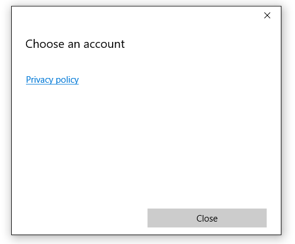

# <a name="web-account-manager"></a>Диспетчер учетных веб-записей

В этой статье описан метод использования **[AccountsSettingsPane](https://docs.microsoft.com/uwp/api/Windows.UI.ApplicationSettings.AccountsSettingsPane)** для подключения приложения универсальной платформы Windows (UWP) к внешним поставщикам удостоверений, например Microsoft или Facebook, с помощью API диспетчера учетных веб-записей для Windows10. Вы узнаете, как запросить разрешение пользователя на использование учетной записи Майкрософт, получить маркер доступа и использовать его для выполнения базовых операций (например, для получения данных профиля или отправки файлов в учетную запись OneDrive). Порядок действий при получении разрешения пользователя и доступа с помощью любого поставщика удостоверений, поддерживающего диспетчер учетных записей в Интернете, практически одинаков.

> [!NOTE]
> Полный пример кода см. в [образце кода WebAccountManagement на GitHub](http://go.microsoft.com/fwlink/p/?LinkId=620621).

## <a name="get-set-up"></a>Подготовка

Сначала создайте новое пустое приложение в Visual Studio. 

Затем необходимо связать приложение с Магазином для подключения к поставщикам удостоверений. Для этого щелкните проект правой кнопкой, выберите **Магазин** > **Связать приложение с Магазином** и следуйте инструкциям мастера. 

Затем создайте простейший пользовательский интерфейс, состоящий из кнопки XAML и двух текстовых полей.

```XML
<StackPanel HorizontalAlignment="Center" VerticalAlignment="Center">
    <Button x:Name="LoginButton" Content="Log in" Click="LoginButton_Click" />
    <TextBlock x:Name="UserIdTextBlock"/>
    <TextBlock x:Name="UserNameTextBlock"/>
</StackPanel>
```

Добавьте прикрепленный к кнопке обработчик событий в выделенном коде:

```csharp
private void LoginButton_Click(object sender, RoutedEventArgs e)
{   
}
```

И наконец, чтобы в дальнейшем не нужно было беспокоиться о проблемах со ссылками, добавьте следующие пространства имен: 

```csharp
using System;
using Windows.Security.Authentication.Web.Core;
using Windows.System;
using Windows.UI.ApplicationSettings;
using Windows.UI.Xaml;
using Windows.UI.Xaml.Controls;
using Windows.Data.Json;
using Windows.UI.Xaml.Navigation;
using Windows.Web.Http;
```

## <a name="show-the-accounts-settings-pane"></a>Отображение области параметров учетных записей

Система предоставляет встроенный пользовательский интерфейс для управления поставщиками удостоверений и учетными записями в Интернете под названием **AccountsSettingsPane**. Отобразить интерфейс можно следующим образом:

```csharp
private void LoginButton_Click(object sender, RoutedEventArgs e)
{
    AccountsSettingsPane.Show(); 
}
```

При запуске приложения и нажатии кнопки входа должно отобразиться пустое окно. 


Панель пуста, поскольку система предоставляет лишь оболочку пользовательского интерфейса, — разработчику необходимо программно добавить в панель поставщиков удостоверений. 

## <a name="register-for-accountcommandsrequested"></a>Регистрация AccountCommandsRequested

Для добавления команд на панель необходимо сначала зарегистрировать обработчик событий AccountCommandsRequested. Это сообщает системе о необходимости выполнить логику сборки, когда пользователь запрашивает отображение панели (например, щелкает кнопку XAML). 

Переопределите события OnNavigatedTo и OnNavigatedFrom в коде программной части и добавьте в них следующий код. 

```csharp
protected override void OnNavigatedTo(NavigationEventArgs e)
{
    AccountsSettingsPane.GetForCurrentView().AccountCommandsRequested += BuildPaneAsync; 
}
```

```csharp
protected override void OnNavigatedFrom(NavigationEventArgs e)
{
    AccountsSettingsPane.GetForCurrentView().AccountCommandsRequested -= BuildPaneAsync; 
}
```

Пользователи не очень часто взаимодействуют с учетными записями, поэтому подобная регистрация и отмена регистрации обработчика событий помогает предотвратить утечку памяти. Таким образом, настроенная вами панель находится в памяти, только когда велик шанс того, что пользователь запросит ее отображение (например, если он находится на странице параметров или входа). 

## <a name="build-the-account-settings-pane"></a>Создание панели параметров учетных записей

Метод BuildPaneAsync вызывается каждый раз при отображении **AccountsSettingsPane**. Именно в него добавляется код для настройки команд для отображения на панели. 

Начните с получения отсроченного объекта. Это сообщает системе о том, что **AccountsSettingsPane** следует отображать только после ее создания.

```csharp
private async void BuildPaneAsync(AccountsSettingsPane s,
    AccountsSettingsPaneCommandsRequestedEventArgs e)
{
    var deferral = e.GetDeferral();
        
    deferral.Complete(); 
}
```

Затем получите поставщика с помощью метода WebAuthenticationCoreManager.FindAccountProviderAsync. У каждого поставщика свой URL-адрес, который можно найти в документации поставщика. Для учетных записей Microsoft и Azure Active Directory используется https://login.microsoft.com. 

```csharp
private async void BuildPaneAsync(AccountsSettingsPane s,
    AccountsSettingsPaneCommandsRequestedEventArgs e)
{
    var deferral = e.GetDeferral();
        
    var msaProvider = await WebAuthenticationCoreManager.FindAccountProviderAsync(
        "https://login.microsoft.com", "consumers"); 
        
    deferral.Complete(); 
}
```

Обратите внимание, что мы также передаем строку "consumers" необязательному параметру *authority*. Это связано с тем, что Майкрософт предоставляет два различных типа проверки подлинности: учетные записи Майкрософт (MSA) для "потребителей" и Azure Active Directory (AAD) для "организаций". Значение "consumers" означает, что мы хотим использовать учетную запись Майкрософт. Если вы разрабатываете корпоративное приложение, используйте строку "organizations".

В заключение добавьте поставщика на панель **AccountsSettingsPane**, создав новый экземпляр класса **[WebAccountProviderCommand](https://docs.microsoft.com/uwp/api/windows.ui.applicationsettings.webaccountprovidercommand)** следующим образом: 

```csharp
private async void BuildPaneAsync(AccountsSettingsPane s,
    AccountsSettingsPaneCommandsRequestedEventArgs e)
{
    var deferral = e.GetDeferral();

    var msaProvider = await WebAuthenticationCoreManager.FindAccountProviderAsync(
        "https://login.microsoft.com", "consumers");

    var command = new WebAccountProviderCommand(msaProvider, GetMsaTokenAsync);  

    e.WebAccountProviderCommands.Add(command);

    deferral.Complete(); 
}
```

Метод GetMsaToken, который мы передавали в новый **WebAccountProviderCommand**, еще не существует (мы создадим его на следующем шаге). На данном этапе вы можете добавить его в виде пустого метода.

Запустите приведенный выше код. Панель должна выглядеть примерно так: 


### <a name="request-a-token"></a>Запрос маркера

После добавления учетной записи Майкрософт на **AccountsSettingsPane** необходимо обработать события, возникающие, когда пользователь выбирает учетную запись. Мы зарегистрировали метод GetMsaToken, который вызывается, когда пользователь выбирает вход с помощью учетной записи Майкрософт, поэтому мы будем запрашивать маркер здесь. 

Чтобы получить маркер, используйте метод RequestTokenAsync следующим образом. 

```csharp
private async void GetMsaTokenAsync(WebAccountProviderCommand command)
{
    WebTokenRequest request = new WebTokenRequest(command.WebAccountProvider, "wl.basic");
    WebTokenRequestResult result = await WebAuthenticationCoreManager.RequestTokenAsync(request);
}
```

В этом примере мы передаем строку "wl.basic" параметру _scope_. Scope (область) представляет собой тип информации, которую вы запрашиваете у поставщика о конкретном пользователе. Некоторые области предоставляют доступ только к базовой информации пользователя, такой как имя и адрес электронной почты, в то время как другие области могут предоставлять доступ к конфиденциальной информации, например фотографиям пользователя или папке "Входящие". Как правило, приложение должно использовать область с минимальными разрешениями для реализации своих функций.

Поставщики услуг предоставляют документацию, описывающую области, которые необходимо указать для получения токенов, используемых соответствующими службами. 

* Сведения об областях Office 365 и Outlook.com см.в разделе [Аутентификация API Office 365 и Outlook.com с использованием конечной точки аутентификации версии 2.0](https://msdn.microsoft.com/office/office365/howto/authenticate-Office-365-APIs-using-v2). 
* Сведения об областях OneDrive см. в разделе [Аутентификация OneDrive и вход в систему](https://dev.onedrive.com/auth/msa_oauth.htm#authentication-scopes). 

Если вы разрабатываете корпоративное приложение, то, скорее всего, захотите подключиться к экземпляру Azure Active Directory (AAD) и использовать Microsoft Graph API вместо обычных служб учетной записи Майкрософт. В этом случае используйте следующий код: 

```csharp
private async void GetAadTokenAsync(WebAccountProviderCommand command)
{
    string clientId = "your_guid_here"; // Obtain your clientId from the Azure Portal
    WebTokenRequest request = new WebTokenRequest(provider, "User.Read", clientId);
    request.Properties.Add("resource", "https://graph.microsoft.com");
    WebTokenRequestResult result = await WebAuthenticationCoreManager.RequestTokenAsync(request);
}
```

В остальной части этой статьи продолжается описание сценария с учетной записью Майкрософт, но код для AAD очень похож на этот пример. Дополнительные сведения о AAD/Graph, включая полный пример в GitHub, см. в [документации Microsoft Graph](https://graph.microsoft.io/docs/platform/get-started).

## <a name="use-the-token"></a>Использование маркера

Метод RequestTokenAsync возвращает объект WebTokenRequestResult, содержащий результаты запроса. Если запрос выполнен успешно, он будет содержать маркер.  

```csharp
private async void GetMsaTokenAsync(WebAccountProviderCommand command)
{
    WebTokenRequest request = new WebTokenRequest(command.WebAccountProvider, "wl.basic");
    WebTokenRequestResult result = await WebAuthenticationCoreManager.RequestTokenAsync(request);
    
    if (result.ResponseStatus == WebTokenRequestStatus.Success)
    {
        string token = result.ResponseData[0].Token; 
    }
}
```

> [!NOTE]
> Если вы получаете ошибку при запросе маркера, убедитесь, что ваше приложение связано со Store, как описано в шаге 1. Ваше приложение не сможет получить маркер, если вы пропустили этот шаг. 

После получения маркера можно использовать его для вызова API вашего поставщика. В следующем коде мы вызываем [API Microsoft Live информации о пользователе](https://msdn.microsoft.com/library/hh826533.aspx), чтобы получить основную информацию о пользователе и отобразить ее в пользовательском интерфейсе. Обратите внимание, что в большинстве случаев рекомендуется хранить полученный однажды токен и использовать его в отдельном методе.

```csharp
private async void GetMsaTokenAsync(WebAccountProviderCommand command)
{
    WebTokenRequest request = new WebTokenRequest(command.WebAccountProvider, "wl.basic");
    WebTokenRequestResult result = await WebAuthenticationCoreManager.RequestTokenAsync(request);
    
    if (result.ResponseStatus == WebTokenRequestStatus.Success)
    {
        string token = result.ResponseData[0].Token; 
        
        var restApi = new Uri(@"https://apis.live.net/v5.0/me?access_token=" + token);

        using (var client = new HttpClient())
        {
            var infoResult = await client.GetAsync(restApi);
            string content = await infoResult.Content.ReadAsStringAsync();

            var jsonObject = JsonObject.Parse(content);
            string id = jsonObject["id"].GetString();
            string name = jsonObject["name"].GetString();

            UserIdTextBlock.Text = "Id: " + id; 
            UserNameTextBlock.Text = "Name: " + name;
        }
    }
}
```

Способы вызова API REST различаются в зависимости от поставщика; сведения об использовании вашего маркера см. в документации по API поставщика. 

## <a name="store-the-account-for-future-use"></a>Сохранение учетной записи для дальнейшего использования

Маркеры полезны для мгновенного получения сведений о пользователе, но как правило имеют различный срок действия. Маркеры учетной записи Майкрософт, например, действительны в течение всего нескольких часов. К счастью, повторно отображать **AccountsSettingsPane** каждый раз, когда истекает срок действия маркера, не требуется. Пользователю достаточно разрешить доступ вашему приложению лишь однажды, после чего вы сможете хранить сведения об учетной записи для последующего использования. 

Для этого используйте класс **[WebAccount](https://docs.microsoft.com/uwp/api/windows.security.credentials.webaccount)**. Класс **WebAccount** возвращается тем же методом, который используется для запроса токена:

```csharp
private async void GetMsaTokenAsync(WebAccountProviderCommand command)
{
    WebTokenRequest request = new WebTokenRequest(command.WebAccountProvider, "wl.basic");
    WebTokenRequestResult result = await WebAuthenticationCoreManager.RequestTokenAsync(request);
    
    if (result.ResponseStatus == WebTokenRequestStatus.Success)
    {
        WebAccount account = result.ResponseData[0].WebAccount; 
    }
}
```

Получив экземпляр **WebAccount**, можно с легкостью его сохранить. В следующем примере мы используем LocalSettings. Дополнительные сведения об использовании LocalSettings и других методов сохранения данных пользователя см. в разделе [Сохранение и получение параметров и данных приложения](https://docs.microsoft.com/windows/uwp/app-settings/store-and-retrieve-app-data).

```csharp
private async void StoreWebAccount(WebAccount account)
{
    ApplicationData.Current.LocalSettings.Values["CurrentUserProviderId"] = account.WebAccountProvider.Id;
    ApplicationData.Current.LocalSettings.Values["CurrentUserId"] = account.Id; 
}
```

Затем можно использовать асинхронный метод (например, представленный ниже), чтобы попытаться получить токен в фоновом режиме с помощью сохраненного экземпляра **WebAccount**.

```csharp
private async Task<string> GetTokenSilentlyAsync()
{
    string providerId = ApplicationData.Current.LocalSettings.Values["CurrentUserProviderId"]?.ToString();
    string accountId = ApplicationData.Current.LocalSettings.Values["CurrentUserId"]?.ToString();

    if (null == providerId || null == accountId)
    {
        return null; 
    }

    WebAccountProvider provider = await WebAuthenticationCoreManager.FindAccountProviderAsync(providerId);
    WebAccount account = await WebAuthenticationCoreManager.FindAccountAsync(provider, accountId);

    WebTokenRequest request = new WebTokenRequest(provider, "wl.basic");

    WebTokenRequestResult result = await WebAuthenticationCoreManager.GetTokenSilentlyAsync(request, account);
    if (result.ResponseStatus == WebTokenRequestStatus.UserInteractionRequired)
    {
        // Unable to get a token silently - you'll need to show the UI
        return null; 
    }
    else if (result.ResponseStatus == WebTokenRequestStatus.Success)
    {
        // Success
        return result.ResponseData[0].Token;
    }
    else
    {
        // Other error 
        return null; 
    }
}
```

Разместите метод выше перед кодом, создающим **AccountsSettingsPane**. Если токен получен в фоновом режиме, отображать область нет необходимости. 

```csharp
private void LoginButton_Click(object sender, RoutedEventArgs e)
{
    string silentToken = await GetMsaTokenSilentlyAsync();

    if (silentToken != null)
    {
        // the token was obtained. store a reference to it or do something with it here.
    }
    else
    {
        // the token could not be obtained silently. Show the AccountsSettingsPane
        AccountsSettingsPane.Show();
    }
}
```

Поскольку процесс получения маркера без уведомлений очень прост, необходимо использовать этот процесс для обновления маркера между сеансами, а не помещать существующий маркер в кэш (так как срок действия маркера может истечь в любой момент).

> [!NOTE]
> В приведенном выше примере рассматриваются только базовые случаи успеха или отказа. Ваше приложение также должно предусматривать необычные сценарии (например отмену пользователем разрешения для вашего приложения или удаление учетной записи из Windows) и корректно обрабатывать их.  

## <a name="remove-a-stored-account"></a>Удаление сохраненной учетной записи

Если вы сохраняете учетную веб-запись, целесообразно предоставить пользователям возможность отвязать их учетную запись от вашего приложения. Так они смогут действительно "выйти" из приложения: сведения об их учетной записи больше не будут автоматически загружаться при запуске. Для этого сначала удалите все сохраненные сведения об учетной записи и поставщике. Затем вызовите метод **[SignOutAsync](https://docs.microsoft.com/uwp/api/windows.security.credentials.webaccount.SignOutAsync)** для очистки кэша и аннулируйте все имеющиеся в приложении маркеры. 

```csharp
private async Task SignOutAccountAsync(WebAccount account)
{
    ApplicationData.Current.LocalSettings.Values.Remove("CurrentUserProviderId");
    ApplicationData.Current.LocalSettings.Values.Remove("CurrentUserId"); 
    account.SignOutAsync(); 
}
```

## <a name="add-providers-that-dont-support-webaccountmanager"></a>Добавление поставщиков, не поддерживающих WebAccountManager

Если вы хотите включить в ваше приложение проверку подлинности службы, которая не поддерживает WebAccountManager (например Google+ или Twitter), вы можете вручную добавить этого поставщика на **AccountsSettingsPane**. Для этого создайте новый объект WebAccountProvider, укажите собственное имя поставщика и значок с расширением PNG, после чего добавьте объект в список WebAccountProviderCommands. Вот код заглушки: 

 ```csharp
private async void BuildPaneAsync(AccountsSettingsPane s, AccountsSettingsPaneCommandsRequestedEventArgs e)
{
    // other code here 

    var twitterProvider = new WebAccountProvider("twitter", "Twitter", new Uri(@"ms-appx:///Assets/twitter-auth-icon.png")); 
    var twitterCmd = new WebAccountProviderCommand(twitterProvider, GetTwitterTokenAsync);
    e.WebAccountProviderCommands.Add(twitterCmd);   
    
    // other code here
}

private async void GetTwitterTokenAsync(WebAccountProviderCommand command)
{
    // Manually handle Twitter login here
}

```

> [!NOTE] 
> Данный код лишь добавляет значок в **AccountsSettingsPane** и при нажатии на значок запускает определенный вами метод (в данном случае — GetTwitterTokenAsync). Вам необходимо написать код, который будет обрабатывать сам процесс проверки подлинности. Дополнительные сведения см. в разделе (Брокер веб-проверки подлинности)[web-authentication-broker], в котором описаны вспомогательные методы проверки подлинности с помощью служб REST. 

## <a name="add-a-custom-header"></a>Добавление настраиваемого заголовка

Панель параметров учетных записей можно настроить с помощью свойства HeaderText следующим образом: 

```csharp
private async void BuildPaneAsync(AccountsSettingsPane s, AccountsSettingsPaneCommandsRequestedEventArgs e)
{
    // other code here 
    
    args.HeaderText = "MyAwesomeApp works best if you're signed in.";   
    
    // other code here
}
```


Не делайте текст заголовка слишком длинным, пусть он будет лаконичным и понятным. Если процесс входа усложнен и вам необходимо отобразить дополнительные сведения, добавьте пользовательскую ссылку на отдельную страницу. 

## <a name="add-custom-links"></a>Добавление настраиваемых ссылок

На AccountsSettingsPane можно добавлять пользовательские команды, которые отображаются в виде ссылок под списком поддерживаемых WebAccountProviders. Пользовательские команды прекрасно подходят для выполнения простых задач, связанных с учетной записью пользователя, таких как отображение политики конфиденциальности или переход на страницу поддержки пользователей, столкнувшихся с проблемами. 

Пример. 

```csharp
private async void BuildPaneAsync(AccountsSettingsPane s, AccountsSettingsPaneCommandsRequestedEventArgs e)
{
    // other code here 
    
    var settingsCmd = new SettingsCommand(
        "settings_privacy", 
        "Privacy policy", 
        async (x) => await Launcher.LaunchUriAsync(new Uri(@"https://privacy.microsoft.com/en-US/"))); 

    e.Commands.Add(settingsCmd); 
    
    // other code here
}
```



Теоретически команды параметров можно использовать для любых целей. Однако мы рекомендуем ограничить их использование простыми сценариями, связанными с учетными записями, такими как описанные выше. 

## <a name="see-also"></a>См. также

[Пространство имен Windows.Security.Authentication.Web.Core](https://msdn.microsoft.com/library/windows/apps/windows.security.authentication.web.core.aspx)

[Пространство имен Windows.Security.Credentials](https://msdn.microsoft.com/library/windows/apps/windows.security.credentials.aspx)

[Класс AccountsSettingsPane](https://msdn.microsoft.com/library/windows/apps/windows.ui.applicationsettings.accountssettingspane)

[Брокер веб-проверки подлинности](web-authentication-broker.md)

[Пример управления учетной веб-записью](http://go.microsoft.com/fwlink/p/?LinkId=620621)

[Приложение "Планировщик обедов"](https://github.com/Microsoft/Windows-appsample-lunch-scheduler)
