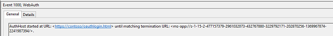

# <a name="web-authentication-broker"></a>Брокер веб-проверки подлинности


В этой статье описывается, как подключить ваше приложение универсальной платформы Windows (UWP) к поставщику сетевых удостоверений, использующему такие протоколы проверки подлинности, как OpenID или OAuth, например, Facebook, Twitter, Flickr, Instagram, и т. д. Метод [**AuthenticateAsync**](https://msdn.microsoft.com/library/windows/apps/br212066) отправляет запрос поставщику сетевых удостоверений и получает маркер доступа, описывающий ресурсы поставщика, к которым имеет доступ приложение.

>[!NOTE]
>Чтобы получить полный рабочий примера кода, клонируйте [репозиторий WebAuthenticationBroker на GitHub](http://go.microsoft.com/fwlink/p/?LinkId=620622).

 

## <a name="register-your-app-with-your-online-provider"></a>Регистрация приложения у поставщика


Вам нужно зарегистрировать приложение у поставщика сетевых удостоверений, к которому вы хотите подключиться. Узнать, как это делается, можно у поставщика сетевых удостоверений. После регистрации поставщик обычно передает идентификатор или секретный ключ для вашего приложения.

## <a name="build-the-authentication-request-uri"></a>Составление URI запроса проверки подлинности


URI запроса состоит из адреса, по которому поставщику отправляется запрос проверки подлинности, и другой необходимой информации (например, идентификатора приложения или секретных данных), а также URI перенаправления, по которому переходит пользователь, завершивший проверку подлинности, и ожидаемого типа ответа. Вы можете выяснить у поставщика, какие именно параметры необходимы.

URI запроса отправляется как параметр *requestUri* метода [**AuthenticateAsync**](https://msdn.microsoft.com/library/windows/apps/br212066). Это должен быть безопасный адрес (который начинается с `https://`).

В следующем примере показано, как составляется URI запроса.

```cs
string startURL = "https://<providerendpoint>?client_id=<clientid>&scope=<scopes>&response_type=token";
string endURL = "http://<appendpoint>";

System.Uri startURI = new System.Uri(startURL);
System.Uri endURI = new System.Uri(endURL);
```

## <a name="connect-to-the-online-provider"></a>Подключение к поставщику


Для подключения к поставщику сетевых удостоверений и получения маркера доступа вызывается метод [**AuthenticateAsync**](https://msdn.microsoft.com/library/windows/apps/br212066). В этом методе в качестве параметра *requestUri* берется URI, созданный на предыдущем шаге, а в качестве параметра *callbackUri*— URI, выбранный для перенаправления пользователя.

```cs
string result;

try
{
    var webAuthenticationResult = 
        await Windows.Security.Authentication.Web.WebAuthenticationBroker.AuthenticateAsync( 
        Windows.Security.Authentication.Web.WebAuthenticationOptions.None, 
        startURI, 
        endURI);

    switch (webAuthenticationResult.ResponseStatus)
    {
        case Windows.Security.Authentication.Web.WebAuthenticationStatus.Success:
            // Successful authentication. 
            result = webAuthenticationResult.ResponseData.ToString(); 
            break;
        case Windows.Security.Authentication.Web.WebAuthenticationStatus.ErrorHttp:
            // HTTP error. 
            result = webAuthenticationResult.ResponseErrorDetail.ToString(); 
            break;
        default:
            // Other error.
            result = webAuthenticationResult.ResponseData.ToString(); 
            break;
    } 
}
catch (Exception ex)
{
    // Authentication failed. Handle parameter, SSL/TLS, and Network Unavailable errors here. 
    result = ex.Message;
}
```

>[!WARNING]
>Помимо [**AuthenticateAsync**](https://msdn.microsoft.com/library/windows/apps/br212066) пространство имен [**Windows.Security.Authentication.Web**](https://msdn.microsoft.com/library/windows/apps/br227044) включает метод [**AuthenticateAndContinue**](https://msdn.microsoft.com/library/windows/apps/dn632425). Не вызывайте этот метод. Он разработан для приложений, предназначенных для Windows Phone 8.1 и является устаревшим начиная с Windows10.

## <a name="connecting-with-single-sign-on-sso"></a>Подключение с единым входом


По умолчанию брокер веб-проверки подлинности не разрешает сохранять файлы cookie. Из-за этого даже в том случае, когда пользователь приложения указывает, что не хочет выходить из приложения (например, установив флажок в диалоговом окне входа в систему поставщика), ему придется выполнять вход каждый раз при обращении к ресурсам данного поставщика. Чтобы выполнить вход с помощью единого входа, ваш поставщик сетевых удостоверений должен включить единый вход для брокера веб-проверки подлинности, а ваше приложение должно вызвать перегруженный метод [**AuthenticateAsync**](https://msdn.microsoft.com/library/windows/apps/br212068), где не применяется параметр *callbackUri* parameter. Это позволит брокеру веб-проверки подлинности хранить сохраненные файлы cookie, чтобы для будущих вызовов проверки подлинности, совершаемых тем же приложением, пользователю не требовалось выполнять повторный вход (пользователь фактически остается в системе до истечения срока действия маркера доступа).

В целях поддержки единого входа поставщик должен разрешить вам зарегистрировать URI перенаправления в форме `ms-app://<appSID>`, где `<appSID>` — это идентификатор безопасности для вашего приложения. Идентификатор безопасности приложения можно найти на странице разработчика вашего приложения или путем вызова метода [**GetCurrentApplicationCallbackUri**](https://msdn.microsoft.com/library/windows/apps/br212069).

```cs
string result;

try
{
    var webAuthenticationResult = 
        await Windows.Security.Authentication.Web.WebAuthenticationBroker.AuthenticateAsync( 
        Windows.Security.Authentication.Web.WebAuthenticationOptions.None, 
        startURI);

    switch (webAuthenticationResult.ResponseStatus)
    {
        case Windows.Security.Authentication.Web.WebAuthenticationStatus.Success:
            // Successful authentication. 
            result = webAuthenticationResult.ResponseData.ToString(); 
            break;
        case Windows.Security.Authentication.Web.WebAuthenticationStatus.ErrorHttp:
            // HTTP error. 
            result = webAuthenticationResult.ResponseErrorDetail.ToString(); 
            break;
        default:
            // Other error.
            result = webAuthenticationResult.ResponseData.ToString(); 
            break;
    } 
}
catch (Exception ex)
{
    // Authentication failed. Handle parameter, SSL/TLS, and Network Unavailable errors here. 
    result = ex.Message;
}
```

## <a name="debugging"></a>Отладка


Существует несколько способов выполнить диагностику API брокера веб-проверки подлинности, включая просмотр операционных журналов, веб-запросов и ответов с помощью веб-отладчика Fiddler.

### <a name="operational-logs"></a>Операционные журналы

Нередко определить, что именно не работает, помогают операционные журналы. Существует выделенный канал журналов событий Microsoft-Windows-WebAuth\\Operational, позволяющий разработчикам веб-сайтов понять, каким образом брокер веб-проверки подлинности обрабатывает их веб-страницы. Чтобы его включить, запустите файл eventvwr.exe и включите ведение операционного журнала в разделе Application and Services\\Microsoft\\Windows\\WebAuth. Брокер веб-проверки подлинности также добавляет уникальную строку к строке агента пользователя, чтобы идентифицировать себя на веб-сервере. Это строка "MSAuthHost/1.0". Обратите внимание, что номер версии в дальнейшем может меняться, поэтому ваш код не должен зависеть от номера версии. Ниже приведен пример полной строки агента пользователя и полной процедуры отладки.

`User-Agent: Mozilla/5.0 (compatible; MSIE 10.0; Windows NT 6.2; Win64; x64; Trident/6.0; MSAuthHost/1.0)`

1.  Включите операционные журналы.
2.  Запустите социальное приложение Contoso. 
3.  Записи, созданные в журналах, помогают глубже вникнуть в особенности поведения брокера веб-проверки подлинности. В нашем случае записи могут содержать следующую информацию.
    -   Навигация начата: регистрирует время запуска AuthHost и содержит сведения о URL-адресах начала и окончания навигации.
    -   
    -   Навигация выполнена: регистрирует выполнение загрузки веб-страницы.
    -   Метатег: регистрирует подробную информацию в случае обнаружения метатега.
    -   Завершение навигации: навигация завершена пользователем.
    -   Ошибка навигации: AuthHost обнаруживает ошибку навигации в URL-адресе, включая код состояния HttpStatusCode.
    -   Завершение навигации: обнаружен завершающий URL-адрес.

### <a name="fiddler"></a>Fiddler

Веб-отладчик Fiddler можно использовать с приложениями.

1.  Так как AuthHost работает в собственном контейнере приложения, чтобы предоставить ему возможность частной сети необходимо настроить раздел реестра: редактор реестра Windows версии 5.00

    **HKEY\_LOCAL\_MACHINE**\\**SOFTWARE**\\**Microsoft**\\**Windows NT**\\**CurrentVersion**\\**Image File Execution Options**\\**authhost.exe**\\**EnablePrivateNetwork** = 00000001

    Если у вас нет этого раздела реестра, можно создать его в командной строке с правами администратора.

    ```cmd 
    REG ADD "HKLM\Software\Microsoft\Windows NT\CurrentVersion\Image File Execution Options\authhost.exe" /v EnablePrivateNetwork /t REG_DWORD /d 1 /f
    ```

2.  Добавьте правило для AuthHost, поскольку эта служба создает исходящий трафик.
    ```syntax
    CheckNetIsolation.exe LoopbackExempt -a -n=microsoft.windows.authhost.a.p_8wekyb3d8bbwe
    CheckNetIsolation.exe LoopbackExempt -a -n=microsoft.windows.authhost.sso.p_8wekyb3d8bbwe
    CheckNetIsolation.exe LoopbackExempt -a -n=microsoft.windows.authhost.sso.c_8wekyb3d8bbwe
    D:\Windows\System32>CheckNetIsolation.exe LoopbackExempt -s
    List Loopback Exempted AppContainers
    [1] -----------------------------------------------------------------
        Name: microsoft.windows.authhost.sso.c_8wekyb3d8bbwe
        SID:  S-1-15-2-1973105767-3975693666-32999980-3747492175-1074076486-3102532000-500629349
    [2] -----------------------------------------------------------------
        Name: microsoft.windows.authhost.sso.p_8wekyb3d8bbwe
        SID:  S-1-15-2-166260-4150837609-3669066492-3071230600-3743290616-3683681078-2492089544
    [3] -----------------------------------------------------------------
        Name: microsoft.windows.authhost.a.p_8wekyb3d8bbwe
        SID:  S-1-15-2-3506084497-1208594716-3384433646-2514033508-1838198150-1980605558-3480344935
    ```

3.  Добавьте правило брандмауэра для входящего трафика в Fiddler.