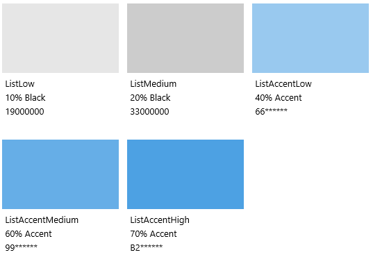
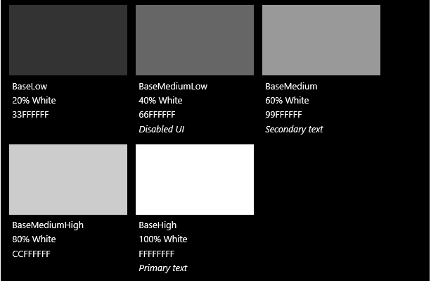
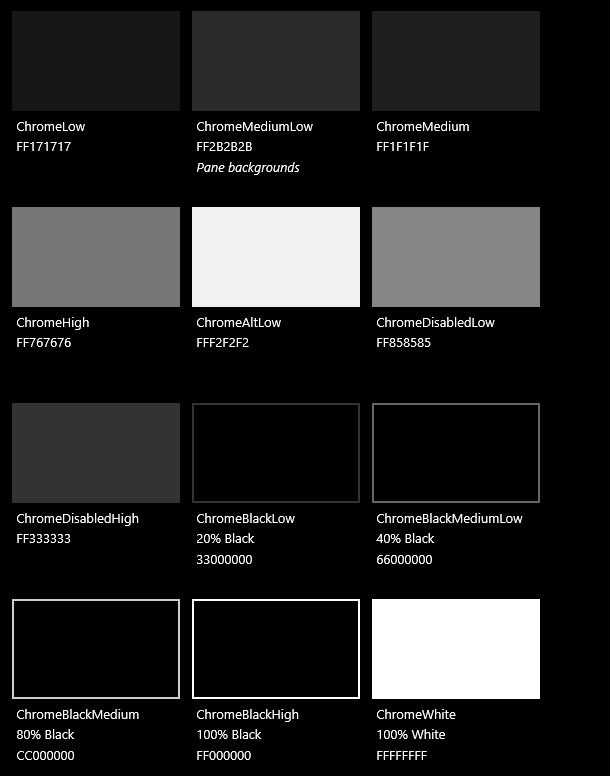

# Цвет

Цвета позволяют интуитивно ориентироваться среди различных информационных уровней приложения и служат важнейшим средством для усиления модели взаимодействия.

В Windows цвет также отражает личные предпочтения. Пользователи могут выбрать цвет и светлую либо темную тему, чтобы она проявлялась при каждом их взаимодействии с устройством.

## Цвет элементов

Пользователь может выбрать один цвет, который относится к элементам, в меню *Параметры > Персонализация > Цвета*. Они могут выбирать из 48 специально подобранных наборов цветов, однако на Xbox выбор ограничен палитрой из 21 безопасного для ТВ цвета.

<!-- Alternate version for the dev center. Need to add hex values. -->
 Цвета элементов по умолчанию

 Цвета элементов Xbox

Когда пользователи выбирают цвет элементов, он появляется в составе системной темы. Затрагиваются следующие области: меню "Пуск", панель задач, хром окон, определенные состояния взаимодействия и гиперссылки в [общих элементах управления](https://dev.windows.com/design/controls-patterns). Цвет элементов может еще шире использоваться в каждом приложении за счет оформления, фонов и взаимодействий или переопределяться ради сохранения фирменной символики приложения.

## Цвет на цвете

После выбора цвета элементов создаются его светлые и темные оттенки на основании значений яркости цвета согласно модели HSB. Приложения могут использовать варианты затенения для создания визуальной иерархии и предоставления указания на взаимодействие.

По умолчанию для гиперссылок используется выбранный пользователем цвет элементов. Если фон страницы имеет схожий цвет, можно назначить более светлый (или более темный) оттенок гиперссылкам для повышения контрастности.

<figure class="figure-img" >
    
        <figcaption>
Различные светлые и темные оттенки цвета элементов по умолчанию.

</figcaption>
</figure>

<figure class="figure-img" >
    
        <figcaption>
Пример работы логики цвета в спецификации на дизайн.

</figcaption>
</figure>

<aside class="aside-dev">
    

    

    

В XAML основной цвет элементов рассматривается как [ресурс темы](https://msdn.microsoft.com/library/windows/apps/Mt187274.aspx) под названием `SystemAccentColor`. Оттенки доступны в виде `SystemAccentColorLight3`, `SystemAccentColorLight2`, `SystemAccentColorLight1`, `SystemAccentColorDark1`, `SystemAccentColorDark2` и `SystemAccentColorDark3`. Также возможен программный доступ с помощью [UISettings.GetColorValue](https://msdn.microsoft.com/library/windows/apps/windows.ui.viewmanagement.uisettings.getcolorvalue.aspx) и перечисления [UIColorType](https://msdn.microsoft.com/library/windows/apps/windows.ui.viewmanagement.uicolortype.aspx).
    

</aside>

## Цветовые темы

Пользователь также может выбрать светлую или темную тему для системы. В некоторых приложениях тема изменяется в зависимости от предпочтений пользователя, а в некоторых такой возможности нет.

Светлая тема используется в офисных приложениях. Примером может послужить набор приложений Microsoft Office. Светлая тема упрощает чтение длинного текста и выполнение длительных задач.

Темная тема повышает контрастность содержимого в приложениях, связанных с мультимедиа, а также в тех случаях, когда пользователям приходится просматривать множество видео и изображений. В этих сценариях основная задача далеко не всегда связана с чтением, в то время как удобство просмотра фильмов при слабом освещении может быть крайне важным.

Если эти описания не подходят вашему приложению, вы можете использовать системную тему, чтобы пользователи сами выбирали подходящий им вариант.

Чтобы упростить проектирование с учетом тем, Windows предоставляет дополнительную цветовую палитру, которая автоматически адаптируется под тему.

<!-- OP version -->
### Светлая тема
#### Базовая

#### Альтернативная

#### Список

#### Хром

### Темная тема
#### Базовая

#### Альтернативная

#### Список

#### Хром

<aside class="aside-dev">
    

    

    

Каждый цвет доступен как [ресурс темы](https://msdn.microsoft.com/library/windows/apps/Mt187274.aspx#the_xaml_color_ramp_and_theme-dependent_brushes) XAML, выполняющий условия именования `System*Color` (например `SystemChromeHighColor`). Вы можете управлять темой своего приложения с помощью либо [Application.RequestedTheme](https://msdn.microsoft.com/library/windows/apps/windows.ui.xaml.application.requestedtheme.aspx), либо [FrameworkElement.RequestedTheme](https://msdn.microsoft.com/library/windows/apps/windows.ui.xaml.frameworkelement.requestedtheme.aspx).
    

</aside>

## Специальные возможности

Наша палитра оптимизирована для различных экранов. Мы рекомендуем поддерживать минимальный коэффициент контрастности текста к фону на уровне 4,5:1 для максимального удобства при чтении. Существует множество бесплатных средств для проверки соответствия выбранных вами цветов этим требованиям, например [Contrast Ratio](http://leaverou.github.io/contrast-ratio/).

<!--HONumber=Jun16_HO4-->

