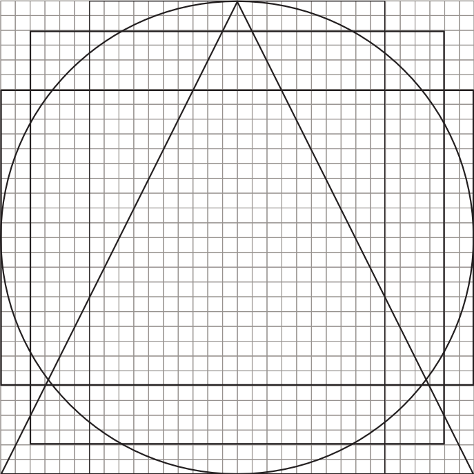
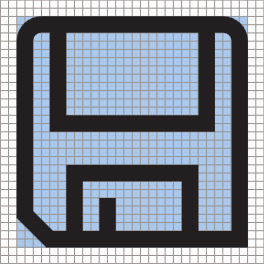
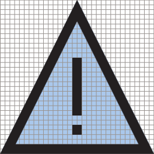
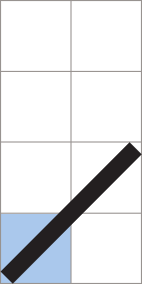
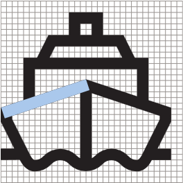
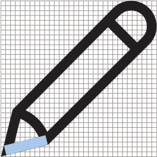
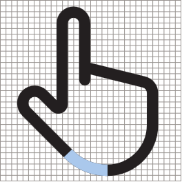
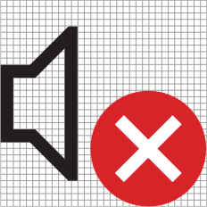
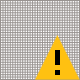

# Значки для приложений UWP

Хорошие значки согласуются со шрифтовым оформлением и языком проектирования в целом. В них метафоры не смешиваются — они сообщают только то, что нужно, как можно скорее и проще. 

## Линейное изменение размера 

<table>
    <tr> 
        <td>16×16 пкс</td>
        <td>24×24 пкс</td>
        <td>32×32 пкс</td>
        <td>48×48 пкс</td>
    </tr>
    <tr> 
        <td></td>
        <td></td>
        <td></td>
        <td></td>
    </tr>
</table>

## Общие фигуры

Как правило, значки должны заполнять все отведенное им пространство с небольшой отбивкой. Эти формы — начальная точка для работы с размерами базовых фигур. 

Используйте фигуру, которая соответствует ориентации значка, и учитывайте в разработке следующие базовые параметры. Значки не обязательно должны полностью соответствовать очертаниям фигуры — при необходимости их можно корректировать для достижения оптимального равновесия. 

<table>
    <tr>
        <td>Круг<td>
        <td>Квадрат</td>
        <td>Треугольник</td>
    </tr>
    <tr>
        <td><td>
        <td></td>
        <td></td>
    </tr>
        <tr>
        <td>Горизонтальный прямоугольник<td>
        <td colspan="2">Вертикальный прямоугольник</td>        
        </tr>
    <tr>
        <td><td>
        <td colspan="2"></td>
         
    </tr>

</table>

## Углы

Помимо использования одинаковых сеток и толщины линий при создании значков важно использовать общие элементы. 

Использование только этих углов при создании фигур обеспечивает единообразие всех значков и их правильную отрисовку. 

При создании значков эти линии можно объединять, комбинировать, поворачивать и отражать. 

<table>
    <tr>
        <td>**1:1** 45°</td>
        <td>**1:2** 26,57° (вертикальн.) 63,43°(горизонтальн.)</td>
        <td>**1:3** 18,43° (вертикальн.) 71,57°(горизонтальн.)</td>
        <td>**1:4** 14,04° (вертикальн.) 75,96°(горизонтальн.)</td>
    </tr>
    <tr>
        
        <td></td>
        <td></td>
        <td></td>
        <td></td>
    </tr>  
</table>

### Примеры

<table>
    <tr>
        <td></td>
        <td></td>
        <td></td>
        <td></td>
    </tr>
</table>

## Кривые

Кривые линии создаются из секций круга. Наклонять их следует исключительно для прикрепления к пиксельной сетке. 

<table>
    <tr>
        <td>1/4 круга</td>
        <td>1/8 круга</td>
    </tr>
    <tr>
        <td></td>
        <td></td>
    </tr>
    <tr>
        <td></td>
        <td></td>
    </tr>    
</table>

## Создание объектов по принципам геометрии

При создании значков рекомендуется использовать исключительно геометрические фигуры.

## Заполненные фигуры 

Значки при необходимости могут содержать заполненные фигуры, но их размер не должен превышать 4 пкс в значке размером 32×32 пкс. Размер заполненных кругов не должен превышать 6×6 пкс. 

## Индикаторы событий

"Индикатор событий" — это общий термин, используемый для обозначения элемента, который добавляется к значку, но который не предназначен для интеграции с основным элементом значка. Как правило, эмблема содержит другие сведения о значке, например его состояние или выполняемое действие. Для обозначения этого элемента используются и другие термины: наложение, аннотация или модификатор. 

Индикаторы событий состояния используют заполненный цветной объект, который расположен поверх значка, в то время как индикаторы действий интегрируются со значком и совпадают с ним по цвету и толщине линий.

<table>
<tr>
    <td>Стандартные индикаторы событий состояния</td>
    <td>Стандартные индикаторы действий</td>
</tr>
<tr>
    <td></td>
    <td></td>
</tr>
</table>

### Цвет индикатора событий 

Цвета должны использоваться в индикаторах событий только для обозначения состояния значка. Цвета, используемые в индикаторах событий состояния, передают пользователю определенные эмоционально насыщенные сообщения. 

<table>
<tr><td>Зеленый — #128B44</td><td>Синий — #2C71B9</td><td>Желтый — #FDC214</td></tr>
<tr><td>Положительные: готово, 
выполнено </td><td>Нейтральные: справка, 
уведомление </td><td>Предупреждающие: оповещение, предупреждение </td></tr>
<tr><td></td><td></td>
<td></td></tr>
</table>

### Положение индикатора событий

Положение по умолчанию для любого индикатора событий состояния или действия — внизу справа. Располагать индикаторы иначе следует только при отсутствии технической возможности расположить их указанным способом. 

### Размер индикатора событий

Индикаторы событий должны иметь размер 10–18 пкс в сетке 32×32 пкс. 

## Статьи по теме

* [Руководство по работе с ресурсами плиток и значков](../controls-and-patterns/tiles-and-notifications-app-assets.md)

<!--HONumber=Mar16_HO5-->

