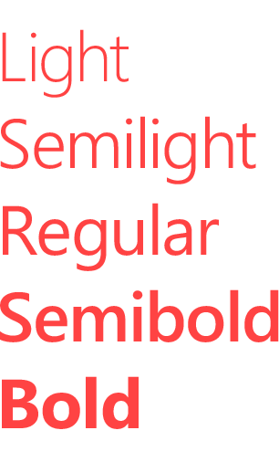
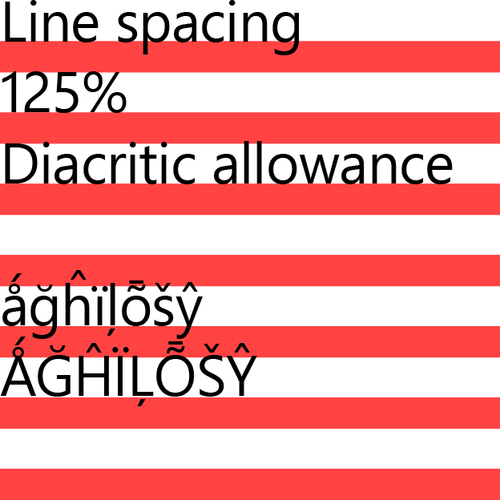
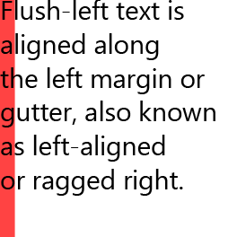
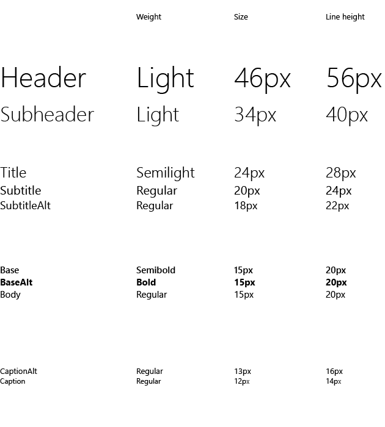

# Шрифтовое оформление для приложений UWP

Основная цель шрифтового оформления как визуального представления языка — это ясность. Стиль шрифтов никогда не должен затмевать эту цель. Но шрифтовое оформление также играет важную роль как компонент макета. Оно сильно влияет на плотность и сложность дизайна, как и на взаимодействие с пользователем в целом.

## Шрифт

Для использования во всех цифровых макетах Майкрософт мы выбрали шрифт Segoe UI. Segoe UI предоставляет большой набор символов и предназначен для поддержания оптимальной четкости при любых размерах и плотности пикселей. Он предлагает чистую, легкую и открытую эстетику, дополняющую содержимое системы.


## Насыщенность

Наш подход к шрифтовому оформлению — простота и эффективность. Мы предпочитаем использовать один шрифт, минимальное количество уровней насыщенности и размеров и четкую иерархию. Расположение и выравнивание должно соответствовать стилю по умолчанию для данного языка. В английском языке последовательность идет слева направо, сверху вниз. Связи между текстом и изображениями четкие и понятные.



## Междустрочный интервал



Междустрочный интервал следует рассчитывать как 125 % от размера шрифта, при необходимости округляя до ближайшего значения, кратного четырем. Например, при размере шрифта Segoe UI, равном 15 пикселям, 125 % от 15 пикселей составит 18,75 пикселя. Рекомендуется округлить в большую сторону и установить значение высоты линии в 20 пикселей, чтобы остаться в сетке, кратной 4 пикселям. Это обеспечит хорошую читаемость и адекватное пространство для диакритических знаков. Конкретные примеры см. в разделе "Набор шрифтов".

При размещении более крупного шрифта над менее крупным шрифтом расстояние от последней строки более крупного шрифта до первой строки менее крупного шрифта должно быть равно высоте строки более крупного шрифта.


В коде XAML это реализуется путем вертикального размещения двух элементов [TextBlocks](https://msdn.microsoft.com/en-us/library/windows/apps/windows.ui.xaml.controls.textblock.aspx) и установки соответствующего поля.

```xaml
<StackPanel Width="200">
    <!-- Setting a bottom margin of 3px on the header
         puts the baseline of the body text exactly 24px
         below the baseline of the header. 24px is the
         recommended line height for a 20px font size,
         which is what's set in SubtitleTextBlockStyle.
         The bottom margin will be different for
         different font size pairings. -->
    <TextBlock
        Style="{StaticResource SubtitleTextBlockStyle}"
        Margin="0,0,0,3"
        Text="Header text" />
    <TextBlock
        Style="{StaticResource BodyTextBlockStyle}"
        TextWrapping="Wrap"
        Text="This line of text should be positioned where the above header would have wrapped." />
</StackPanel>
```


<!-- OP version -->

## Кернинг и уплотнение

Segoe — это гуманистический шрифт с мягким, дружественным внешним видом. Он имеет органичные, открытые формы, в основе которых лежит рукописный текст. Чтобы сохранить оптимальную четкость и поддержать гуманистическую цельность шрифта, параметры кернинга и уплотнения должны иметь определенные значения.

Следует установить для кернинга значение "metrics", а для уплотнения — значение "0 ".


## Интервал между словами и межбуквенная разрядка

Как и в случае с кернингом и уплотнением, для интервала между словами и межбуквенной разрядки используются специальные параметры, помогающие достичь оптимальной четкости и гуманистической целостности.

Интервал между словами по умолчанию всегда составляет 100%, а для межбуквенной разрядки необходимо установить значение "0".


<aside class="aside-dev">
    <div class="aside-dev-title">
    </div>
    <div class="aside-dev-content">
            In a XAML text control use [Typogrphy.Kerning](https://msdn.microsoft.com/en-us/library/windows/apps/windows.ui.xaml.documents.typography.kerning.aspx) to control kerning and [FontStretch](https://msdn.microsoft.com/en-us/library/windows/apps/windows.ui.xaml.controls.control.fontstretch.aspx) to control tracking. By default Typography.Kerning is set to “true” and FontStretch is set to “Normal”, which are the recommended values.
    </div>
</aside>


<!-- OP version -->
## Выравнивание

Обычно мы рекомендуем выравнивать визуальные элементы и столбцы по левому краю. В большинстве случаев такой подход, в котором содержимое сдвинуто влево и не выравнивается по правому краю, обеспечивает согласованную привязку содержимого и универсальный макет.



## Окончания строк

Если оформление не предусматривает сдвиг влево с неровным правым краем, постарайтесь завершать строки примерно на одном уровне и избегать переносов.


## Абзацы

Чтобы обеспечить выравнивание краев столбцов, параграфы должны выделяться пропуском строки без отступа.


## Количество символов

Если строка слишком коротка, глазам придется часто перемещаться влево и вправо, что нарушит ритм чтения. Самым оптимальным для чтения количеством символов считается 50–60 символов в строке.

Segoe предоставляет широкий диапазон символов и разработан для обеспечения оптимальной четкости как в небольших, так и в больших размерах, а также при большой и малой плотности пикселей. Использование оптимального количества букв в строке текстового столбца обеспечивает хорошую четкость в приложении.

Слишком длинные строки будут напрягать глаза и могут дезориентировать пользователя. Слишком короткие строки будут заставлять читателя часто менять направление взгляда и могут вызывать усталость.


## Выравнивание висящего текста

Горизонтальное выравнивание значков с текстом может обрабатываться несколькими способами в зависимости от размера значков и объема текста. Если текст, независимо от количества линий, соответствует высоте значка, текст выравнивается по центру вертикально.

Если высота текста выходит за пределы высоты значка, первая строка текста должна выравниваться по вертикали, а дополнительный текст должен естественно переходить ниже. При использовании символов с высокими верхушками, букв с надстрочными и подстрочными элементами необходимо обратить особое внимание на соблюдение одинаковых правил выравнивания.


<aside class="aside-dev">
    <div class="aside-dev-title">
    </div>
    <div class="aside-dev-content">
            XAML's [TextBlock.TextLineBounds](https://msdn.microsoft.com/en-us/library/windows/apps/windows.ui.xaml.controls.textblock.textlinebounds.aspx) property provides access to the cap height and baseline font metrics. It can be used to visually vertically center or top-align type.
    </div>
</aside>

## Обрезка и многоточия

Параметр "Обрезка по умолчанию" предполагает, что текст будет переноситься, если только красная линия не указывает обратное. При использовании текста без переносов рекомендуется обрезать текст, а не использовать многоточия. Обрезка может происходить на краю контейнера, на краю устройства, на краю полосы прокрутки и т. д.

Исключения составляют контейнеры, которые не определены точно (например, не указан отличающий цвет фона). В этом случае текст, в котором не используются переносы, может быть настроен на использование многоточий "...".


# Набор шрифтов

Необходимо использовать разные размеры Segoe UI для создания иерархии в наборе шрифтов. Эта иерархия выполняет построение структуры, которая позволяет пользователям легко ориентироваться в письменных сообщениях.

<figure class="figure-img" >
    
        <figcaption>Все размеры указываются в эффективных пикселях. Подробнее см. в разделе, описывающем TODO (ссылка)</figcaption>
</figure>

<aside class="aside-dev">
    <div class="aside-dev-title">
    </div>
    <div class="aside-dev-content">
            Most levels of the ramp are available as XAML [static resources](https://msdn.microsoft.com/en-us/library/windows/apps/Mt187274.aspx#the_xaml_type_ramp) that follow the `*TextBlockStyle` naming convention (ex: `HeaderTextBlockStyle`). 
    </div>
</aside>


## Основной и второстепенный текст

Чтобы создать дополнительную иерархию не только с помощью набора шрифтов, задайте второстепенному тексту прозрачность 60%. В [цветовой палитре темы](color.md#color-themes) следует использовать BaseMedium. Для основного текста прозрачность всегда должна иметь значение 100% или BaseHigh.

## Заголовки заглавными буквами

Некоторые заголовки страниц должны быть написаны ПОЛНОСТЬЮ ЗАГЛАВНЫМИ БУКВАМИ, чтобы добавить еще один уровень иерархии. Эти заголовки должны использовать BaseAlt со значением межзнакового интервала, установленным на 75 тысячных доли длины буквы m. Этот принцип можно также использовать, чтобы упростить навигацию приложения.

Однако имена собственные в некоторых языках меняют свое значение при написании заглавными буквами, поэтому заголовки страниц, основанные на именах или пользовательском вводе *не* должны преобразовываться в заголовки, написанные полностью заглавными буквами.


## Возможности и ограничения
* Используйте параметр Body для основной части текста
* Используйте параметр Base для заголовков, если пространство ограничено
* Включайте SubtitleAlt, чтобы создать контраст и иерархию посредством подчеркивания содержимого верхнего уровня
* Не используйте параметр Caption для длинных строк или основных действий
* Не используйте параметры Header или Subheader, если текст необходимо переносить
* Не совмещайте Subtitle and SubtitleAlt на одной странице

## Связанные статьи

* [Элементы управления текстом](../controls-and-patterns/text-controls.md)


<!--HONumber=Mar16_HO5-->


