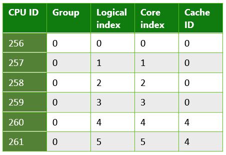

# API-интерфейс CPUSets для разработки игр

## Введение

Универсальная платформа Windows (UWP) лежит в основе широкого диапазона потребительских электронных устройств. Поэтому для работы с ней необходимо использовать API-интерфейс общего назначения, который будет удовлетворять потребности всех типов приложений — от игр и внедренных приложений до корпоративного программного обеспечения, выполняющегося на серверах. Использование правильных сведений, предоставляемых API-интерфейсом, позволит гарантировать, что ваши игры будут работать должным образом на любом оборудовании.

## API-интерфейс CPUSets

API-интерфейс CPUSets дает возможность управлять тем, какие наборы ЦП будут доступны для запланированных потоков. Для управления запланированными потоками доступно две функции:
- **SetProcessDefaultCpuSets** — эту функцию можно использовать для того, чтобы указать, какие новые потоки наборов ЦП могут выполняться, если они не назначены конкретным наборам ЦП.
- **SetThreadSelectedCpuSets** — эта функция позволяет определять наборы ЦП, на которых может выполняться конкретный поток.

Если функция **SetProcessDefaultCpuSets** никогда не используется, выполнение создаваемых потоков можно планировать на любом доступном для вас наборе ЦП. В этом разделе описаны основы использования API-интерфейса CPUSets.

### GetSystemCpuSetInformation

Первой функцией API-интерфейса, используемой для сбора информации, является функция **GetSystemCpuSetInformation**. Эта функция заполняет сведениями массив объектов **SYSTEM_CPU_SET_INFORMATION**, предоставляемых кодом заголовка. Выделение памяти для целевого объекта должно выполняться кодом игры, размер которой определяется непосредственным вызовом **GetSystemCpuSetInformation**. Для этого требуется выполнить два вызова **GetSystemCpuSetInformation**, как показано в следующем примере.

```
unsigned long size;
HANDLE curProc = GetCurrentProcess();
GetSystemCpuSetInformation(nullptr, 0, &size, curProc, 0);

std::unique_ptr<uint8_t[]> buffer(new uint8_t[size]);

PSYSTEM_CPU_SET_INFORMATION cpuSets = reinterpret_cast<PSYSTEM_CPU_SET_INFORMATION>(buffer.get());
  
GetSystemCpuSetInformation(cpuSets, size, &size, curProc, 0);
```

Каждый возвращаемый экземпляр **SYSTEM_CPU_SET_INFORMATION** содержит информацию об одном уникальном блоке обработки данных, который также носит название набора ЦП. Это необязательно означает, что этот модуль представляет собой уникальный физический компонент оборудования. Процессоры, в которых используется гиперпоточность, будут обладать несколькими логическими ядрами, работающими на одном физическом обрабатывающем ядре. Планирование выполнения нескольких потоков на разных логических ядрах, расположенных на одном и том же физическом ядре, позволяет оптимизировать потребление ресурсов на уровне оборудования. В противном случае для выполнения этой процедуры потребовалось бы выполнение дополнительных операций на уровне ядра. Два потока, запланированные на разных логических ядрах, размещенных на одном физическом ядре, будут совместно использовать время ЦП, однако в таком случае они будут выполняться более эффективно по сравнению с тем, если бы их выполнение было запланировано на одном и том же логическом ядре.

### SYSTEM_CPU_SET_INFORMATION

Сведения в каждом экземпляре этой структуры данных, возвращаемой из **GetSystemCpuSetInformation**, содержат информацию об уникальном блоке обработки данных, на котором может быть запанировано выполнение потоков. C учетом того, что диапазон целевых устройств может очень широким, большой объем информации в структуре данных **SYSTEM_CPU_SET_INFORMATION** может не подходить для разработки игр. В таблице 1 перечислены элементы данных, которые можно использовать для разработки игр.

 **Таблица 1. Элементы данных, которые могут быть полезны для разработки игр.**

| Имя элемента  | Тип данных | Описание |
| ------------- | ------------- | ------------- |
| Type (Тип)  | CPU_SET_INFORMATION_TYPE  | Тип информации в структуре. Если значение отлично от **CpuSetInformation**, его следует игнорировать.  |
| Id (Идентификатор)  | unsigned long (длинное без знака)  | Идентификатор, заданного набора ЦП. Этот идентификатор следует использовать с такими функциями набора ЦП, как **SetThreadSelectedCpuSets**.  |
| Group (Группа)  | unsigned short (короткое без знака)  | Обозначает "процессорную группу" набора ЦП. Процессорные группы обеспечивают возможность использовать в ПК больше 64 логических ядер, а также выполнять горячую замену ЦП без остановки системы. Компьютеры, не являющиеся сервером с более чем одной процессорной группой, встречаются редко. За исключением случаев, когда вы создаете приложения, предназначенные для выполнения на больших серверах или фермах серверов, оптимальным вариантом будет использование наборов ЦП в одной группе, поскольку большинство ПК потребительского класса обладают только одной процессорной группой. Все другие значения в этой структуре относятся к группе (Group).  |
| LogicalProcessorIndex  | unsigned char (char без знака)  | Относящийся к группе (Group) индекс набора ЦП.  |
| CoreIndex  | unsigned char (char без знака)  | Относящийся к группе (Group) индекс физического ядра ЦП, на котором размещен набор ЦП.  |
| LastLevelCacheIndex  | unsigned char (char без знака)  | Относящийся к группе (Group) индекс кэша последнего уровня, связанного с этим набором ЦП. Это самая медленная кэш-память. Однако кэш может быть быстрее, если в системе используются узлы с архитектурой NUMA; как правило, это кэш-память 2 или 3 уровня.  |

<br />

Другие элементы данных содержат сведения, которые скорее всего не будут включать описание ЦП компьютеров потребительского класса или других потребительских устройств, поэтому маловероятно, что эти сведения будут полезны. Сведения, предоставляемые возвращенными данными, можно затем использовать для организации выполнения потоков различными способами. В разделе [Рекомендации по разработке игр](#considerations-for-game-development) настоящего технического документа приведено описание нескольких способов использования таких данных для оптимизации распределения потоков.

Ниже приведен ряд примеров типов информации, собираемой из приложений UWP, которые выполняются на разных типах оборудования.

**Таблица 2. Информация, возвращаемая из приложения UWP, выполняющегося на Microsoft Lumia 950. Это пример системы с несколькими кэшами последнего уровня. Телефон Lumia 950 оснащен системой на кристалле Qualcomm 808 Snapdragon с двухъядерным ЦП ARM Cortex A57 и четырехъядерным ЦП ARM Cortex A53.**

  

**Таблица 3. Информация, возвращаемая из приложения UWP, выполняющегося на обычном компьютере. Это пример системы, в которой используется гиперпоточность; каждое физическое ядро имеет два логических ядра, на которых можно планировать выполнение потоков. В этом случае использовалась система с процессором Intel Xeon E5-2620.**

  

**Таблица 4. Информация, возвращаемая из приложения UWP, выполняющегося на четырехъядерном планшете Microsoft Surface Pro 4. В этом случае использовалась система с процессором Intel Core i5-6300.**

  

### SetThreadSelectedCpuSets

После сбора информации о наборах ЦП ее можно использовать для организации выполнения потоков. Дескриптор потока, созданного с помощью **CreateThread**, передается этой функции вместе с массивом идентификаторов наборов ЦП, на которых может быть запланировано выполнение потока. Пример его использования приведен в следующем фрагменте кода.

```
HANDLE audioHandle = CreateThread(nullptr, 0, AudioThread, nullptr, 0, nullptr);
unsigned long cores [] = { cpuSets[0].CpuSet.Id, cpuSets[1].CpuSet.Id };
SetThreadSelectedCpuSets(audioHandle, cores, 2);
```
В этом примере поток создается на основе функции, объявленной как **AudioThread**. Затем выполнение этого потока можно запланировать на одном из двух наборов ЦП. Привязка потока к набору ЦП не является монопольной. Потоки, создаваемые без привязки к конкретному набору ЦП, могут использовать время из **AudioThread**. Кроме того, в дальнейшем, другие создаваемые потоки можно привязать к одному или обоим наборам ЦП.

### SetProcessDefaultCpuSets

Противоположностью **SetThreadSelectedCpuSets** является **SetProcessDefaultCpuSets**. В ходе создания потоков необходимость в их привязке к конкретным наборам ЦП отсутствует. Если вы не хотите, чтобы эти потоки выполнялись на определенных наборах ЦП (наборах, используемых, к примеру, вашими обрабатывающим или звуковым потоками), эту функцию можно использовать для указания ядер, которые будут доступны для того, чтобы на них можно было запланировать выполнение этих потоков.

## Рекомендации по разработке игр

Как мы выяснили, API-интерфейс CPUSets API предоставляет много информации, а также необходимую гибкость для планирования потоков. Вместо использования восходящего подхода для поиска случаев использования этих данных, более эффективным является применение нисходящего принципа для определения того, каким образом лучше использовать данные для реализации стандартных сценариев.

### Работа с зависящими от времени потоками и гиперпоточностью

Этот способ является эффективным, когда в игре присутствует несколько потоков, которые должны выполняться в режиме реального времени одновременно с другими рабочими потоками, для выполнения которых требуется относительно мало времени ЦП. Для обеспечения оптимального взаимодействия с игрой некоторые задачи, например непрерывная фоновая музыка, должны выполняться без перерывов. Даже незначительное зависание звукового потока может привести к нежелательному деформированию объектов при смене кадров или подергиванию изображения, поэтому очень важно, чтобы со сменой каждого кадра поток получал необходимый объем времени ЦП.

Использование **SetThreadSelectedCpuSets** в сочетании с **SetProcessDefaultCpuSets** позволит гарантировать отсутствие прерывания выполнения ресурсоемких потоков любыми рабочими (фоновыми) потоками. **SetThreadSelectedCpuSets** можно использовать для назначения ресурсоемких потоков конкретным наборам ЦП. **SetProcessDefaultCpuSets** можно использовать для того, чтобы гарантировать перенос любых создаваемых неназначенных потоков другим наборам ЦП. При использовании процессоров, в которых применяется гипероточность, также важно не забывать о логических ядрах, размещенных на одном и том же физическом ядре. Рабочие потоки не должны выполняться на логические ядрах, использующих то же физическое ядро, что и поток, который требуется выполнить с откликом в режиме реального времени. В следующем фрагменте кода показано, как определить, используется ли в компьютере гиперпоточность.

```
unsigned long retsize = 0;
(void)GetSystemCpuSetInformation( nullptr, 0, &retsize,
    GetCurrentProcess(), 0);
 
std::unique_ptr<uint8_t[]> data( new uint8_t[retsize] );
if ( !GetSystemCpuSetInformation(
    reinterpret_cast<PSYSTEM_CPU_SET_INFORMATION>( data.get() ),
    retsize, &retsize, GetCurrentProcess(), 0) )
{
    // Error!
}
 
std::set<DWORD> cores;
std::vector<DWORD> processors;
uint8_t const * ptr = data.get();
for( DWORD size = 0; size < retsize; ) {
    auto info = reinterpret_cast<const SYSTEM_CPU_SET_INFORMATION*>( ptr );
    if ( info->Type == CpuSetInformation ) {
         processors.push_back( info->CpuSet.Id );
         cores.insert( info->CpuSet.CoreIndex );
    }
    ptr += info->Size;
    size += info->Size;
}
 
bool hyperthreaded = processors.size() != cores.size();
```

Если в системе применяется гиперпоточность, важно, чтобы в набор ЦП по умолчанию не входили логические ядра, размещенные на том же физическом ядре, что и любые потоки, выполняющиеся в режиме реального времени. Если система не поддерживает гиперпоточность, необходимо убедиться, что в наборы ЦП по умолчанию не входит ядро, которое также включено в набор ЦП, на котором выполняется звуковой поток.

Образец организации выполнения потоков на основе физических ядер можно найти в примере CPUSets, доступном в репозитории GitHub, ссылка на который размещена в разделе [Дополнительные ресурсы](#additional-resources).

### Сокращение расходов на согласование кэшей с кэшем последнего уровня

Понятие согласованность кэша означает, что кэшируемая память должна быть одинаковой в разных аппаратных ресурсах, работающих с одними и теми же данными. Если выполнение потоков запланировано на разных ядрах, но эти потоки работают с одинаковыми данными, они могут работать с отдельными копиями этих данных в разных кэшах. Чтобы получить правильные результаты, необходимо обеспечить целостность данных в этих кэшах. Обеспечение целостности данных в разных кэшах обходится относительно дорого и в то же время является обязательным, чтобы многоядерная система работала правильно. Кроме того, этот процесс абсолютно не контролируется кодом клиента; базовая система работает независимо для сохранения целостности данных в кэшах путем осуществления доступа к общим ресурсам памяти между ядрами.

Если в игре работает несколько потоков, которые совместно используют большой объем данных, вы можете сократить расходы на обеспечение согласованности кэшей, запланировав их выполнение на наборах ЦП с общим кэшем последнего уровня. Кэш-память последнего уровня является самой медленной кэш-памятью, доступной для ядра в системах, не оснащенных узлами с архитектурой NUMA. В игровых ПК узлы с архитектурой NUMA используются крайне редко. Если ядра не используют общий кэш последнего уровня, для сохранения их согласованности потребуется осуществление доступа к памяти более высокого уровня, которая будет являться более медленной. Привязка двух потоков к отдельным наборам ЦП, использующим общий кэш и общее физическое ядро, поможет добиться более высокой производительности по сравнению с планированием выполнения потоков на отдельных физических ядрах, в случае если для их выполнения не требуется более 50% времени при каждой смене кадра. 

В этом фрагменте кода показано, как определить, могут ли потоки, которые часто взаимодействуют друг с другом, использовать общий кэш последнего уровня.

```
unsigned long retsize = 0;
(void)GetSystemCpuSetInformation(nullptr, 0, &retsize,
    GetCurrentProcess(), 0);
 
std::unique_ptr<uint8_t[]> data(new uint8_t[retsize]);
if (!GetSystemCpuSetInformation(
    reinterpret_cast<PSYSTEM_CPU_SET_INFORMATION>(data.get()),
    retsize, &retsize, GetCurrentProcess(), 0))
{
    // Error!
}
 
unsigned long count = retsize / sizeof(SYSTEM_CPU_SET_INFORMATION);
bool sharedcache = false;
 
std::map<unsigned char, std::vector<SYSTEM_CPU_SET_INFORMATION>> cachemap;
for (size_t i = 0; i < count; ++i)
{
    auto cpuset = reinterpret_cast<PSYSTEM_CPU_SET_INFORMATION>(data.get())[i];
    if (cpuset.Type == CPU_SET_INFORMATION_TYPE::CpuSetInformation)
    {
        if (cachemap.find(cpuset.CpuSet.LastLevelCacheIndex) == cachemap.end())
        {
            std::pair<unsigned char, std::vector<SYSTEM_CPU_SET_INFORMATION>> newvalue;
            newvalue.first = cpuset.CpuSet.LastLevelCacheIndex;
            newvalue.second.push_back(cpuset);
            cachemap.insert(newvalue);
        }
        else
        {
            sharedcache = true;
            cachemap[cpuset.CpuSet.LastLevelCacheIndex].push_back(cpuset);
        }
    }
}
```

Архитектура кэшей, представленная на рисунке 1, является примером архитектуры кэшей, которая может использоваться в вашей системе. На этом рисунке приведена архитектура кэшей, использующаяся в Microsoft Lumia 950. Взаимодействие потоков, происходящее между ЦП 256 и ЦП 260, приведет к значительной перегрузке, так как системе придется обеспечивать согласованность кэшей 2 уровня этих потоков.

**Рис. 1. Архитектура кэша на устройстве Microsoft Lumia 950.**


## Резюме

API-интерфейс CPUSets, доступный для разработки программного обеспечения UWP, предоставляет значительный объем информации и широкие возможности управления многопотоковыми процессами. По сравнению с предыдущими API-интерфейсами для разработки многопоточного ПО для Windows структура этого API-интерфейса была усложнена и его освоение займет некоторое время, однако благодаря увеличенной гибкости интерфейса можно добиться повышения производительности на целом ряде потребительских ПК и других устройствах.

## Дополнительные ресурсы
- [Наборы ЦП (MSDN)](https://msdn.microsoft.com/library/windows/desktop/mt186420(v=vs.85).aspx)
- [Пример CPUSets от ATG](https://github.com/Microsoft/Xbox-ATG-Samples/tree/master/Samples/System/CPUSets)


<!--HONumber=Jun16_HO4-->


